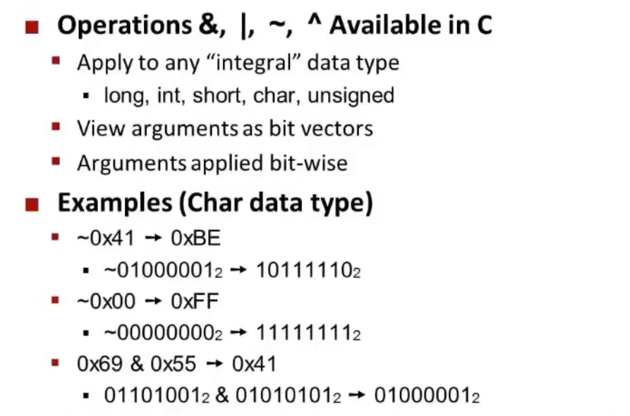

## 1. Data bytes

1. **位（Bit）**
   - 位是最基本的数据单位，是二进制数制的基础。
   - 一个位只能表示两种状态，通常用 0 和 1 来表示。
   - 位是构成所有其他数据大小单位的基础。
2. **字节（Byte）**
   - 字节是计算机存储和处理信息的常用单位。
   - 一个字节通常由 8 个位组成。因此，一个字节可以表示 28=25628=256 种不同的状态。
   - 字节是用来度量文本大小的标准单位，如文件大小、内存大小等。例如，一个 ASCII 字符通常用一个字节表示。
3. **字（Word）**
   - 字是计算机处理数据的基本单位，特别是在处理器架构和内存管理中。
   - 一个字的大小通常取决于特定的计算机架构。在32位系统中，一个字通常是32位（4字节）；在64位系统中，一个字通常是64位（8字节）。
   - 字的大小决定了处理器一次可以处理数据的大小。例如，32位处理器通常一次可以处理32位数据。


* 当说一个机器是64位(8byte,8字节)，这代表这些地址是64位。

*  位运算

  

* **位运算能够很方便的进行集合操作**
  * 

* **Bit Level Operations**

  * ==最容易混淆的就是~和!,前者是按位取反，而后者只针对ture or false，后者将所有非0视为true，!4=0,!0=1==

    

    

  * **Shift Opetration**

    * 左移只有一种情况，而右移会有两种情况

      * logical shift：无论左移还是右移，以0填充
      * Arithmetic Right shift（算数右移）：算术右移保持符号位不变（通常是最左边的位），同时将其余位向右移动。这意味着正数和负数在算术右移时保持其符号不变。

      

* **Bit2Unsigned & Bit 2 Two'sComplement(二进制补码)**

  * 二进制的无符号数值计算，只需要将所有位加权加起来
  * 二进制的有符号数值计算（补码数值计算）()
    * 假设我们有一个 8 位的二进制数 `11111011`，我们如何解读它的值？
      1. **符号位**：最高位是 `1`，因此这是一个负数。在 8 位二进制数中，符号位的加权值是 -2^(8-1) = -128。
      2. **其余位的加权和**：`0111011` 可以按照正常的二进制数转换成十进制，即 `1*2^6 + 1*2^5 + 1*2^4 + 1*2^3 + 0*2^2 + 1*2^1 + 1*2^0 = 64 + 32 + 16 + 8 + 2 + 1 = 123`。
      3. **计算最终值**：将这两部分结合，得到 -128 + 123 = -5。因此，补码 `11111011` 表示十进制中的 -5。

  * 简便来说，无符号和有符号的数值计算区别就在于其符号位的加权是正还是负数，对于同一个1000000，无符号是`2^7+0`，有符号是`-2^7+0`

  > ### 不同的有符号数表示方法
  >
  > 1. **补码（Two's Complement）**
  >    - 补码是一种常用的有符号数表示方法，特别是在现代计算机系统中。在补码表示中，负数表示为正数的补数。
  > 2. **反码（One's Complement）**
  >    - 反码表示法中，负数通过对正数的每一位取反来表示。这种方法存在两种不同的零（+0 和 -0）。
  > 3. **符号-幅度（Sign-Magnitude）**
  >    - 符号-幅度表示法中，数字的最高位用作符号位（0 表示正，1 表示负），其余位表示数字的幅度（大小）。这种表示法直观，但在运算上不如补码高效。
  >
  > ### 为什么补码非常普遍
  >
  > 1. **运算简化**：
  >    - 补码允许使用同一套算术运算规则（尤其是加法和减法）来处理有符号数，无需为正数和负数设计不同的运算规则。
  > 2. **无歧义的零**：
  >    - 补码表示法中只有一种零（`000...0`），而在其他方法（如反码）中，存在正零和负零两种表示。
  > 3. **范围最大化**：
  >    - 在 n 位的补码表示中，可以表示的范围是 -2^(n-1) 到 2^(n-1)-1，这最大化了可表示的负数范围。
  > 4. **硬件实现的优势**：
  >    - 补码简化了计算机硬件的设计，特别是在进行算术运算时。大多数现代计算机和处理器都是基于补码运算设计的。
  > 5. **自然的溢出处理**：
  >    - 补码在处理溢出时表现更自然，尤其是在加法和减法运算中。

* 二进制区间

  

  * 对于无符号，最大是`11111111`即为`2^8-1`，最小是0
  * 对于有符号，正数部分为`0000 0000-0111 1111`,`0~2^7-1`，负数部分为`1000 0000~1111 1111`，`-2^7 ~ (-2^7 + 2^7 - 1) = -1`

* ==当有符号数与无符号数比较时，有符号数自动变为无符号数，然后再比较==

* **两个unsigned的陷阱，**

  * `for(unsigned int i = n-1;i >= 0;i--)`:程序将永远跑下去
  * `for(int i = n-1;i -sizeof(i) >= 0;i--)`: 同样的，sizeof返回一个unsigned 值，强制转换`i-sizeof`为unsigned，因此也会死循环。

* **sign extension**

  * ### 举例

    假设有一个 8 位的有符号整数 `11101010`（补码表示），其表示 -22（十进制）。在进行 sign extension 到 16 位时，操作如下：

    1. 确定原数的符号位（这里是 1，因为原数是负数）。
    2. 将符号位复制到新的高位，直到填满所有扩展的位。
    3. 扩展后的数变为 `1111111111101010`。

    这个 16 位的数依然表示 -22（十进制），保持了原数的符号和值。

    ### 重要性

    Sign extension 在许多计算机操作中都非常重要，特别是在进行算术运算、数字类型转换和数据从一个寄存器传输到另一个更大寄存器时。正确的 sign extension 确保了数据的准确性和运算的正确性。
  
* 整数的右移与左移（因为整数可以被按位优化，因此你可以发现为什么说计算能力都是浮点数flop计算能力）。在C中，只有无符号数有标准的<<，>>，对于有符号数，一次shift通常是算数shift。

  * 对于无符号数，左移是乘2，右移是除2，并且是整除，也就是如果有余数，那么将被抛弃
  * 对于有符号数
    * 正数左移乘2，右移除2
    * 负数左移不存在，右移通常需要加上偏移量

* 如何取负一个数

  * 取反加1

* 为什么使用unsigned

  * 因为unsigned的溢出是有迹可循，全平台C通用的，signed数据你可能假设它是补码，但是不同地方实现的不一样

  * 使用数字来表现集合

  * 关于上面的unsigned陷阱，还有一个方式解决，在下面，循环在size_t溢出时会终止。

    ```c++
    size_t i;
    for(i = cnt-1;i < cnt;i--){
        
    }
    ```

* 几个题目

  ```c++
  int x = foo();
  int y = bar();
  unsigned ux = x;
  unsigned uy = y;
  ```

  

  * $x<0\ \rightarrow (x*2) < 0$: not true

  * $ux \geq 0$ : always true

  * $x \& 7 == 7 \rightarrow (x<<30)<0$:前一个等式保证了x低三位都为1，在左移30位之后，实际上变成了高两位都为1，因此正确

  * $ux > -1$：always false，因为ux是unsigned，-1会被先转换为unsigned，此时为max了

  * $x > y \rightarrow -x < -y$:如果x是任意数，y为最小值1000 0000 0000 0000...0000,此时取反加一，y仍然为最小值，因此错误

  * 第一个是true，第二个是false，理由同上，最小的负数取反加一还是他本身

    

  * $(x|-x)>>31==1111...1111$，在x=0000...0000时，其负数也为0000...0000，是错的，但是在x为非0时这一定是对的，因为负数符号位永远为1，根据or特性结果符号位也永远为1，有符号数右移又是算数右移。

