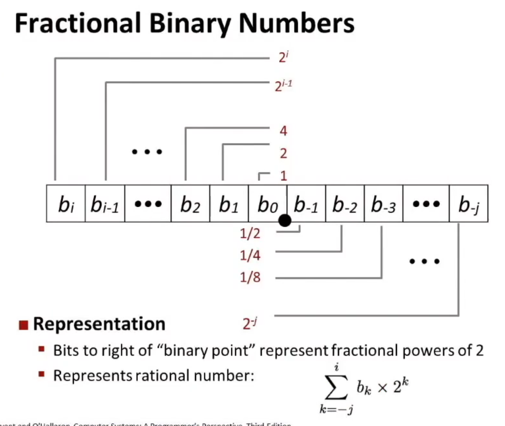
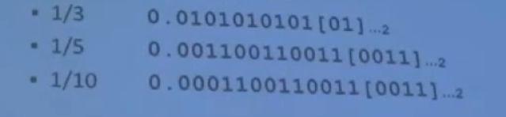
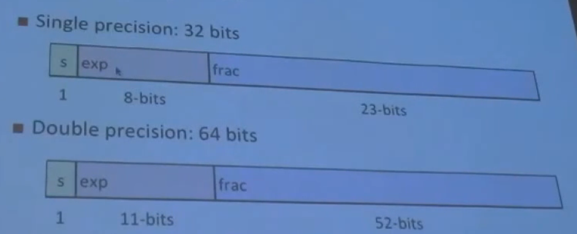
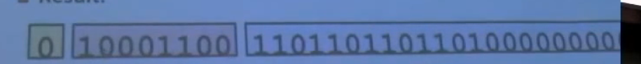
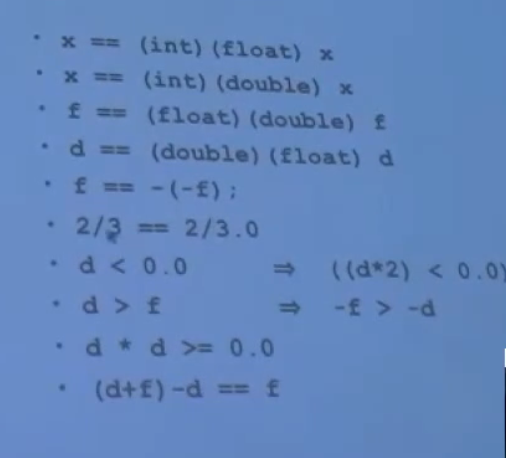

# 2. Float

## 2.1 二进制表示float



* 这种表示法有缺陷

  * 只能表示$x/2^k$这种数，其余的实数需要用repeating bit representtions

    

* 事实上，能存储的总长度是固定的，因此point的位置决定了我们的值域与精度

* 同时，每个厂商的机器实现float并不一样，因此同一个程序，放到其他机器上，你并不能确定它浮点数的精确运行。因此，IEEE引入了IEEE浮点数标准，此后float的标准都一样了。


## 2.2 IEEE float

$$
(-1)^s M \ 2^E
$$

* $s$确定了该数字的正负
* Mantissa通常介于1到2的分数(fraction value)
* E会以2的幂次增长


exp encode E， frac encode M


分类




### Normalized values

$$
v = (-1)^ s M s^E
$$


* exp编码不能为全0或全1
* $E = Exp - Bias$
  * Exp被看作unsigned value，例如11bits的exp，看作11位的无符号整数,这个数的范围为$[0,2^{12}-1]$
  * $Bias = 2^{k-1}-1$
    * Bias for single precision: $2^7-1 = 127$
    * Bias for double precision: 1023
  * 实际上就是用unsigned表示signed的一种方法，不使用补码是因为，考虑到bias是固定的，我们可以使用unsigned的方式直观的按位比较两个signed数的大小。
  * 如果以单精度为例，可以发现$E\in [-127，128]$
* $M$: Significand coded with implied leading 1
  * M将原数字转换为形似1.xxxxxxx
  * 当分数(fraction)等于00000时，M=1.00000...
  * 当fraction等于1111111时，$M = 2.0-\epsilon$


一个浮点数被normalize，首位一定是1（首位的0全部被忽略）
$$
15213_{10} = 11101101101101
$$
**一个例子**：

```c++
float F = 15213.0
```

* Normalize: $15213.0 = 11101101101101_2 = 1.1101101101101_2 \times 2^{13}$

  * $M = 1.1101101101101_2$
  * $frac = 1101101101101 \ 0000000000_2$
  * $E = 13$
  * $Bias = 127$
  * 因此exp在encode时应该为$140 = 10001100_2$

  得到的最终Result为

  


### Dennormalized Value

我们可以发现，


### float 的四舍六入

又叫round to even，其实很简单，四舍六入五考虑。

其实很简单，

如果考虑四位变两位

* 四舍：$7.8949 \rightarrow 7.89$，因为7.8949 < 7.895，满足四舍
* 六入:$7.8951\rightarrow 7.90$，因为7.8951 > 7.895，满足六入
* 五入偶:$7.8950->7.90, 7.8850->7.88$，此时是round到第二位，此时如果第三位正好是5且之后的位全为0，则round to最近的偶数。


在二进制浮点数中进行四舍六入时，如果要舍入的位是1（即二进制的"5"），则会看其后一位。如果后一位是0（即没有更多位或者都是0），则舍入到最近的偶数（即末位为0）。如果后一位是1（即二进制的"6"以上），则舍入位会进1。例如，二进制的'1011.100'（十进制的5.5）四舍六入到最近的偶数，即'1011.1'（十进制的5.4）。


在二进制浮点数中：

- '101.11'（5.75）四舍五入到一个位时变为'110'（6），因为'1'（5）后面是'1'，所以向上舍入。
- '101.101'（5.625）四舍五入到一个位时变为'110'（6），因为'1'（5）后面是'0'，但是'101'（5）是奇数，所以向上舍入。
- '100.101'（4.625）四舍五入到一个位时变为'101'（5），因为'0'（4）后面是'1'，但是'100'（4）是偶数，所以保持不变。


## 习题

```c++
int x;
float f;
double d;
```




答案分别是

no:float的frac比int的短，一次int to float会损失一些bit

yes:double的frac够长

yes：同理

no:同理

yes:只是修改了符号位

no:前者是0后者是一个浮点数

yes:因为浮点数即使溢出也只会溢出到负无穷大

yes: 单调性

yes

no:浮点数不满足结合律


