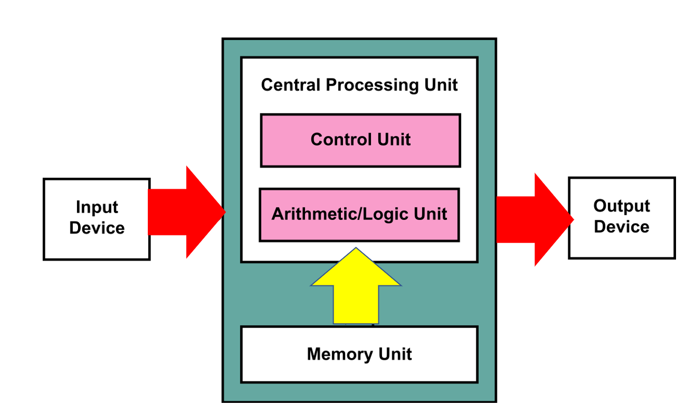
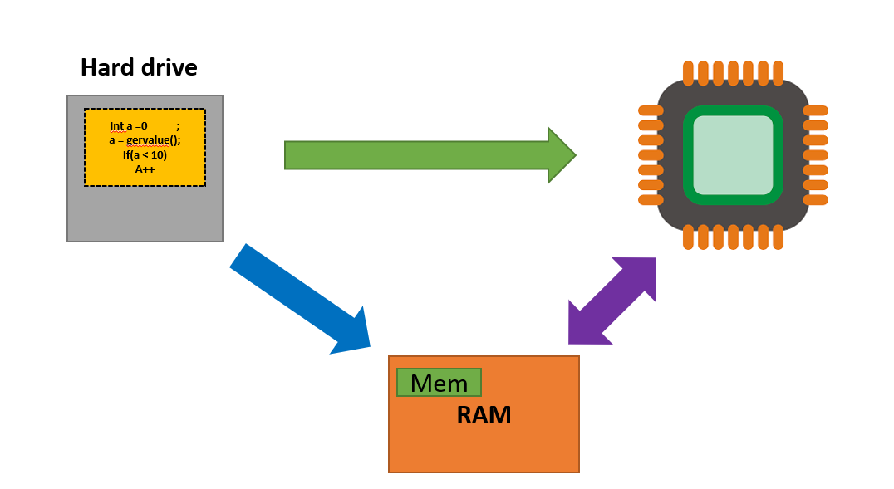
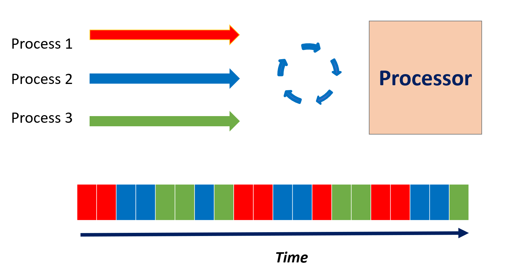

# 1. 冯诺伊曼架构的基本计算机体系结构

这张图显示了冯诺依曼架构的基本计算机体系。

指令存储在MemoryUnit中（persistent memory or hard drive)，作为可执行文件。当我们运行指令时，程序的指令被加载到CPU，基本数据被加载到RAM。然后计算单元，也被称为处理器，会executing instructions while taking inputs.

以上就是单个Program做的事，现代电脑能够同时执行多个指令。

### CUDA 主讲课程：第一部分笔记

------

#### 并行编程背景概念

1. **Von Neumann架构**：现代计算机基本上都基于这种架构。
   - 程序指令存储在持久性内存或硬盘上。
   - 当程序运行时，指令加载到CPU，基础数据加载到RAM。
   - 计算单元开始执行指令并在运行时接收输入。
   - 程序根据这些输入输出结果。
   - 注意：我们是按顺序执行指令的。
2. **多任务执行**：现代计算机可以同时运行多个应用程序。
3. **进程(Process)**:一个进程是一个最小执行单位：
   - 进程是计算机应用的一个实例。
   - 执行应用时，指令被发送到处理器，RAM内为运行时资源分配内存。
   - 
   - 与进程关联的还有一个称为上下文（context）的重要概念。
   - 上下文是关于进程的数据集合，允许处理器挂起或持有进程的执行，并稍后重新开始执行。
4. **上下文切换**：允许处理器在进程之间进行切换的机制。
5. **线程**：
   - 线程或执行线程是可以独立管理的程序指令的最小序列。
   - 每个进程至少有一个线程，称为主线程。
   - 线程可以看作进程的简化版本。
   - 同一进程内的多个线程可以共享内存，但两个进程之间不会共享资源。
   - **进程与线程的区别总结：进程可以多线程**
     - **本质区别：**进程是操作系统资源分配的基本单位，而线程是处理器任务调度和执行的基本单位。
     - **包含关系：**一个进程至少有一个线程，线程是进程的一部分，所以线程也被称为轻权进程或者轻量级进程。
     - **资源开销：**每个进程都有独立的地址空间，进程之间的切换会有较大的开销；线程可以看做轻量级的进程，同一个进程内的线程共享进程的地址空间，每个线程都有自己独立的运行栈和程序计数器，线程之间切换的开销小。
     - **影响关系：**一个进程崩溃后，在保护模式下其他进程不会被影响，但是一个线程崩溃可能导致整个进程被操作系统杀掉，所以多进程要比多线程健壮。

------

#### 并行编程

1. **并行处理**：多个线程或多个进程可以同时执行，无需进行上下文切换。
2. **并行处理与现实世界**：
   - 例如，建房子的任务。
   - 有些任务需要按顺序执行，如计划和建基础。
   - 有些任务可以同时执行，如砌墙、铺设管道和电线。
3. **并行和计算机应用**：
   - 并行编码应用程序可以在单核处理器上运行，但性能提升有限。
   - 现代的个人电脑和笔记本电脑都有多个核心，如果我们知道如何并行编程，我们就能利用这些现代硬件的计算能力。
4. **并行类型**：
   - 任务级并行：不同的工作执行不同的任务。
   - 数据级并行：多个工作执行相同的任务，但处理不同的数据。
5. **并行 vs 并发**：
   - 并行：如果处理器有足够的核心运行每个进程，则所有进程或线程都将并行运行。
   - 并发：尽管外部看起来像是并行执行，但在硬件级别，指令是顺序执行的。

------

#### 课程目标

- 主要目的是学习CUDA并行编程。
- 课程将同时考虑并行和并发。