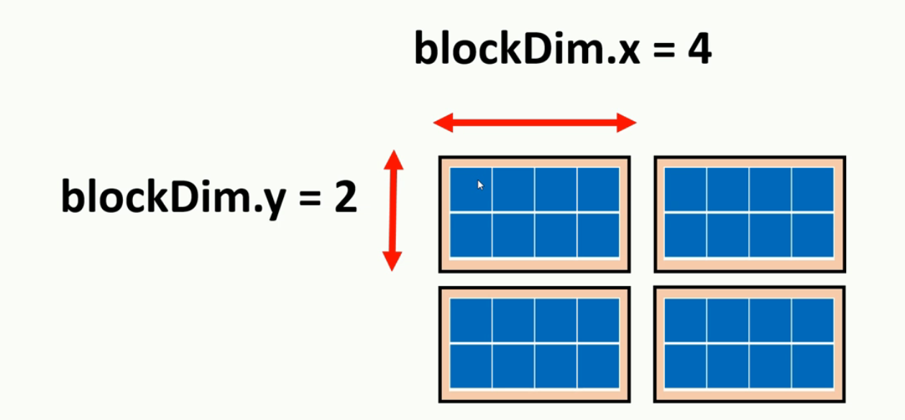
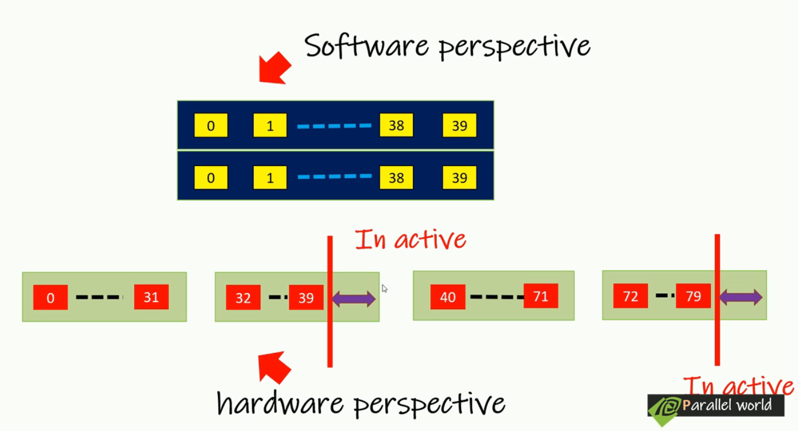

几乎所有的cuda程序都遵循一个基本的步骤。

* 从CPU code初始化数据
* 将初始化数据传输到GPU
* 启动一个内核(kernel)对这些数据执行任务
* 将并行执行的结果传回CPU context
* reclaim the allocated memory for both CPU and GPU execution to the system


CUDA代码分为两个部分：

* Sequential code run in CPU
  * 被称为Host code
    * Sequence programming logic
    * calling CUDA kernel with proper device configuration
* parallel code run in GPU
  * 被称为Device code

## 1. CUDA基础语法

### 1.1 Hello Cuda

该指令由GPU执行而非CPU

* 引入必要头文件

* add both device code and host code

  * 对C语言的函数增加一个关键字使其在CUDA启用设备中运行

  * ```c++
    int hellow_world(int x, float y, char *name){
        
    }
    
    //Modifiers:__global__,__device__,__host__,每个内核都应该以void作为返回类型，以指示此函数调用不返回任何内容
    //如果想要从kernel返回一些变量，则需要specific CUDA runtime function calls
    __global__ void hellow_cuda(int x){
        
    }
    ```

    * Add kernel

    * Calling kernel in host code(launching a kernel): 相比一般的函数调用，还需要指定内核启动参数`<<<线程块数目，线程数>>>`

    * 保持CPU，GPU同步

    * 释放所占用设备

    * ```c++
      # include "cuda_runtime.h"
      # include "device_launch_parameters.h"
      
      
      # include<stdio.h>
      
      // add a kernel
      /*
      这部分定义了一个CUDA核函数（kernel function）。
      __global__是一个CUDA特定的修饰符，
      表示这是一个在GPU上运行的函数。
      这个核函数非常简单，
      它只是在GPU上打印出“Hello CUDA world”。
      */
      __global__ void hello_cuda()
      {
      	printf("Hello CUDA world \n");
      }
      
      int main() {
      	/*
      	这行代码调用了之前定义的CUDA核函数。
      	<<<1,1>>>表示核函数的执行配置。
      	这里，我们使用1个线程块和每个线程块中的1个线程来执行这个核函数。
      	因此，总共只有1个线程在GPU上执行这个核函数。
      	*/
      	hello_cuda << <1,20>> > ();
      	/*
      	cudaDeviceSynchronize();是CUDA运行时API的一个函数，
      	它确保所有先前在设备上启动的工作都已完成。
      	这是必要的，因为CUDA核函数的执行是异步的，
      	这意味着CPU代码不会等待GPU代码完成。
      	通过调用cudaDeviceSynchronize()，
      	我们确保在继续执行后续的CPU代码之前，
      	GPU上的所有工作都已完成。
      	*/
      	cudaDeviceSynchronize();
      	/*
      	cudaDeviceReset();是另一个CUDA运行时API的函数，
      	它重置当前设备并清除与该设备关联的所有资源。
      	这通常在程序结束时调用，
      	以确保所有的CUDA资源都被正确地释放。
      	*/
      	cudaDeviceReset();
      	return 0;
      }
      ```

### 1.2 CUDA程序中的修饰符

* `__global__`:CUDA kernel 函数前缀，该函数被CPU调用启动，在GPU上执行。
* `__host__`: CPU端调用且在CPU端执行的函数，**正常的C++代码，无任何修饰符时，默认是CPU端函数**
* `__device__`: GPU端调用且在GPU端执行的函数，可以理解为GPU端的函数封装，CPU不能调用。这是在GPU上调用并执行的函数的前缀。这些函数只能由其他`__device__`函数或`__global__`函数调用。关于“编译器确定是否inline”的部分：在CUDA中，`__device__`函数默认是内联的，但编译器可能会根据特定情况决定是否真正进行内联。内联意味着函数的代码会被插入到调用它的地方，而不是作为一个单独的函数调用。这可以提高性能，但也可能增加生成的代码的大小。
* `__noinline__`: 强制编译器不inline
* `__forceinline__`: 强制编译器inline

```c++
// 以下代码表示既需要运行于CPU， 也要运行于GPU（必须加host)
__host__ __device__ int run_on_cpu_or_gpu(){
    return 1;
}
```

### 1.3 CUDA中的函数

* `__global__`修饰的CUDA kernel 函数
* `main`函数: 基于<<<...,...>>>启动的CUDA kernel 函数
* 可选的修饰符
* <cuda.h> <cuda_runtime.h>

### 1.4 CUDA高层次视角下的流程


通过PCIe Bus(总线）：

Step1:传输数据到GPU

$\rightarrow$

Step2:CPU发令给GPU(<<<>>>这个命令，红色箭头)

$\rightarrow$

Step3:GPU执行CUDA函数,如果没有Synchronize类似操作，CPU继续自己的事

$\rightarrow$

Step4:GPU执行完了之后，Device(Global) Memory上的执行结果退回Host Memory(DRAM)


1. **编写代码**:
   - 使用CUDA C/C++扩展编写代码，其中包括主机代码和设备代码。
   - 设备代码通常包含在`__global__`函数中，这些函数也称为kernels。
2. **编译代码**:
   - 使用NVIDIA的`nvcc`编译器编译CUDA代码。
   - `nvcc`将CUDA代码分为主机代码和设备代码。主机代码由标准C/C++编译器（如gcc或cl.exe）编译，而设备代码由`nvcc`转换为PTX（并行线程执行）中间表示。
3. **程序初始化**:
   - 初始化CUDA运行时。
   - 选择一个CUDA设备进行执行。
4. **内存分配**:
   - 使用`cudaMalloc()`在GPU上分配内存。
   - 使用标准C/C++函数（如`malloc()`或`new`）在主机上分配内存。
5. **数据传输**:
   - 使用`cudaMemcpy()`将数据从主机传输到设备或从设备传输到主机。
6. **执行CUDA kernels**:
   - 使用`<<<>>>`语法在GPU上启动CUDA kernels。
   - 指定执行配置，包括grid大小、block大小等。
7. **同步操作**:
   - 使用`cudaDeviceSynchronize()`等待所有kernels完成执行。
   - 或使用`cudaStreamSynchronize()`等待特定CUDA流中的操作完成。
8. **数据回传**:
   - 使用`cudaMemcpy()`将结果数据从设备传输回主机。
9. **清理**:
   - 使用`cudaFree()`释放GPU内存。
   - 使用标准C/C++函数（如`free()`或`delete`）释放主机内存。
   - 可能还需要释放其他CUDA资源，如纹理、流或事件。
10. **程序结束**:

- 使用`cudaDeviceReset()`重置CUDA设备，尤其是在程序结束时或在错误处理中。

这个流程提供了一个高层次的概述，但CUDA编程还涉及到许多其他的细节和高级特性，如流、事件、纹理内存、共享内存、动态并行等。不过，上述流程为初学者提供了一个良好的起点，帮助他们理解CUDA程序的基本执行过程。


### 1.5 CUDA线程层次结构

> 1. **调度单位 (Scheduling Unit)**:
>    - **定义**：调度单位是操作系统选择为执行的最小实体。它是操作系统调度器用来决定哪个任务应该在给定时刻运行的实体。
>    - **例子**：在传统的CPU中，线程是最常见的调度单位。在GPU中，如NVIDIA的CUDA架构，warp是调度单位。
> 2. **执行单位 (Execution Unit)**:
>    - **定义**：执行单位是实际执行指令的硬件实体。
>    - **例子**：在CPU和GPU中，线程是一个常见的执行单位。每个线程都有自己的指令流，并在执行单位上独立运行。
> 3. **区别**：
>    - **功能**：调度单位是关于“何时”运行的决策，而执行单位是关于“如何”和“在哪里”运行的决策。
>    - **层次**：调度通常在更高的操作系统层次上进行，而执行是在硬件层次上进行的。
> 4. **联系**：
>    - **依赖性**：执行单位依赖于调度单位。换句话说，调度器选择一个调度单位进行执行，然后这个单位在一个或多个执行单位上运行。
>    - **并行性**：在多核或多线程硬件上，多个执行单位可以同时运行。这意味着多个调度单位可以被同时选择并在不同的执行单位上并行运行。
>
> 总结：调度单位和执行单位是多任务和并行计算的基石。调度单位决定了哪个任务应该运行，而执行单位则决定了任务如何运行。在并行环境中，理解这两个概念及其相互关系是优化性能和资源利用的关键。

1. **线程（Thread）**:

   - 最基本的==执行单位==。==（要与CPU区分，CPU的最小调度单位是thread，GPU的是warp)==

   - 每个线程都执行相同的kernel代码，但可以通过其唯一的线程ID来执行不同的数据路径或操作不同的数据。

   - > CPU中线程也是基本的执行实体，它在进程的context中运行，每个线程都有自己的寄存器集，堆栈和局部存储，同时虽然线程是最小的调度单位，现代CPU通常支持硬件线程或是超线程，这意味着单个物理核心可以同时执行多个线程
     >
     > GPU中，线程为基本执行单位，这意味着每个线程都有自己的指令流，但是由于SIMT的特性，一个warp中所有线程都会执行先沟通的命令。

2. **warp**:

   - GPU的基本调度单位。
   - 一个warp包含多达32个线程。
   - warp中的所有线程同时执行相同的指令，但是可以操作不同的数据，这是SIMT（单指令多线程）模型的核心。
   - 如果warp中的线程因为分支而采取不同的执行路径，那么它会经历所谓的“分支发散”，这可能会降低性能。
   - 若是我们分配grid=(1,1,1), block=(1,1,1)，此时仍然会给每个block分配32个线程，此时只有第一个线程工作，其余都是idle状态。

3. **线程块（Thread Block）**:

   - 包含一组线程，这些线程可以协同工作并共享数据。
   - 一个线程块可以包含多个warp。
   - 线程块内的线程可以使用共享内存（Shared Memory）进行通信，这是一个快速的本地内存。
   - 线程块内的线程可以使用同步原语（如`__syncthreads()`）进行同步。
   - 所有属于同一线程块的线程都在同一个流多处理器（SM）上执行。

4. **网格（Grid）**:

   - 包含一组线程块。
   - 所有线程块都执行相同的kernel，但每个线程块都有一个唯一的块ID。
   - 网格中的线程块可以在多个SM上并行执行。

5. **索引和维度**:

   - 每个线程都有一个唯一的线程ID，通常表示为`threadIdx`。
   - 每个线程块都有一个唯一的块ID，通常表示为`blockIdx`。
   - `threadIdx`和`blockIdx`都可以是1D、2D或3D的，这为复杂的数据结构和算法提供了方便。
   - `blockDim`表示线程块的维度，即每个维度的线程数。
   - `gridDim`表示网格的维度，即每个维度的线程块数。

6. **线程的全局ID**:

   - 虽然`threadIdx`和`blockIdx`提供了线程和线程块的局部ID，但在许多情况下，需要计算线程的全局ID来索引全局内存或确定线程的全局位置。
   - 全局线程ID可以通过以下方式计算：`globalID = blockIdx.x * blockDim.x + threadIdx.x`（对于1D情况）。

7. **最大尺寸限制**:

   - 由于硬件和架构的限制，线程块和网格的大小都有上限。
   - 例如，线程块的最大线程数可能为1024（取决于具体的CUDA版本和硬件）。
   - 同样，网格的最大尺寸也受到限制。


### 1.6 CUDA 库

#### 1.6.1 cuda_runtime:在运行时调用的API

* cudaMalloc

* cudaMemcpy

* cudaFree

* cuda错误检错宏(之后有详细解答)[错误检测](##6. ERROR CHECK)（加上显得专业)

* cudaKernel 计时 API:CUDA并发编程时相对CPU自带计时更高效的计时

  * 在编程和计算机科学中，"事件对象"通常指的是与某种特定事件或条件关联的对象。这些对象可以用于多种目的，如同步、通知、或跟踪特定的状态变化。具体的定义和用途可能会根据上下文和使用的技术或框架而有所不同。以下是一些常见的上下文中的"事件对象"的解释：

    1. **并发编程和多线程**：在多线程环境中，事件对象可以用作同步机制，允许线程等待某个条件成立或某个事件发生。例如，在Windows的线程编程中，有一个名为"事件"的同步对象，它允许一个线程通知其他线程某个事件已经发生。
    2. **事件驱动编程**：在事件驱动的框架或系统中，事件对象可能代表用户操作（如点击、键盘输入）、系统通知或其他外部触发的事件。这些事件对象通常包含与事件相关的信息，并可以传递给事件处理函数或监听器。
    3. **数据库和系统通知**：在某些数据库或系统中，事件对象可以代表某种状态变化或条件的满足，允许应用程序或系统组件对这些变化做出响应。
    4. **网络和通信**：在网络编程中，事件对象可能与网络操作（如数据到达、连接建立或断开）相关联。
    5. **游戏和交互应用**：在交互式应用程序或游戏中，事件对象可以代表玩家的操作、游戏状态的变化或其他游戏事件。

    总的来说，事件对象是一个广泛的概念，其具体定义和用途取决于上下文。在特定的技术或框架中，它可能有特定的定义和属性。

  * 在CUDA编程中，事件变量是一种特殊的变量，用于测量和同步GPU上的操作。具体来说，它们主要用于以下目的：

    1. **性能测量**：通过在代码的关键点放置事件，开发者可以测量两个事件之间的时间间隔，从而得到某个操作或一系列操作的执行时间。这对于性能调优和分析非常有用。
    2. **同步**：事件还可以用于同步CPU和GPU操作。例如，当你想确保某个GPU操作完成后再进行下一步操作时，可以使用事件来同步。

    在CUDA中，事件是通过`cudaEvent_t`数据类型表示的。以下是与CUDA事件相关的一些基本操作：

    - **创建事件**：使用`cudaEventCreate()`函数创建一个新的事件。
    - **记录事件**：使用`cudaEventRecord()`函数在CUDA流中记录事件。这标记了事件在流中的位置，当流到达该点时，事件被记录。
    - **同步事件**：使用`cudaEventSynchronize()`函数同步事件。这会阻止CPU执行，直到与特定事件关联的GPU操作完成。
    - **计算时间差**：使用`cudaEventElapsedTime()`函数计算两个事件之间的时间差。
    - **销毁事件**：使用`cudaEventDestroy()`函数销毁先前创建的事件，以释放与其关联的资源。

    总的来说，事件变量在CUDA中是一种强大的工具，允许开发者测量GPU操作的执行时间并同步操作，从而确保正确的程序执行和性能优化。

```c++
//这行代码声明了两个CUDA事件变量：start 和 stop。
cudaEvent_t start, stop;
//创建一个新的事件对象并将其与start关联。此事件将用于记录内核执行的开始时间。
cudaEventCreate(&start);
//创建一个新的事件对象并将其与stop关联。此事件将用于记录内核执行的结束时间。
cudaEventCreate(&stop);
//记录当前时间到start事件。这意味着从此刻开始，我们开始测量时间。
cudaEventRecord(start);
//这行代码启动CUDA内核CUDAKernel。Grid和Block定义了内核的执行配置，即网格和块的大小。
CUDAKernel<<<Grid, Block>>>();
// 在内核执行完成后，记录当前时间到stop事件。这意味着我们停止测量时间。
cudaEventRecord(stop);
//这是一个同步调用，它确保stop事件已经被记录。因为CUDA操作是异步的，所以在继续执行任何其他操作之前，我们需要确保stop事件已经完成。这确保了我们得到的时间测量是准确的。
cudaEventSynchronize(stop);//让CPU等待stop被记录
//这行代码计算start和stop之间经过的时间（以毫秒为单位）并将结果存储在milliseconds变量中。这给了我们内核执行的准确时间
cudaEventElapsedTime(&milliseconds, start, stop);
```

​	在CUDA中，当你调用一个内核或任何其他设备操作时，这些操作不是立即执行的。相反，它们被排入一个队列中，称为流（stream）。默认情况下，所有操作都在默认流中执行，除非你明确地创建和使用其他流。

当你调用`cudaEventRecord(stop)`，`stop`事件被插入到当前流中，紧随其后的是之前调用的`CUDAKernel`内核。这意味着，一旦`CUDAKernel`内核完成其执行，`stop`事件就会被记录。

这是一个简化的描述：

1. `CUDAKernel<<<Grid, Block>>>();` - 这行代码将`CUDAKernel`内核插入到流中。
2. `cudaEventRecord(stop);` - 这行代码将`stop`事件插入到相同的流中，紧随其后。

由于CUDA操作在流中是按顺序执行的，所以`stop`事件只有在`CUDAKernel`内核完成执行后才会被记录。这确保了`stop`事件记录的时间点正好是内核执行完成的时间点。

当你稍后调用`cudaEventSynchronize(stop)`时，它会阻塞CPU的执行，直到`stop`事件在流中被记录，这进一步确保了你得到的时间测量是准确的。


### 1.7 CUDA main函数编写流程

* host端申请内存并初始化数据
* device端申请内存
* host端数据拷贝到device端
* 计时开始
* 启动CUDAkernel
* 计时结束
* device端把结果拷贝回host端
* 检查双端计算结果
* 释放device端和host端内存


## 2.Grid and Block

### Grid, Block and thread

在CUDA编程模型中，`block`、`grid`和`thread`是并行执行的基本单位。它们之间的关系是核心的，理解这些概念对于编写高效的CUDA代码至关重要。以下是它们之间的关系和定义：

1. **Thread（线程）**:
   - 线程是CUDA中的基本执行单位。
   - 每个线程都有一个唯一的ID，可以通过`threadIdx.x`、`threadIdx.y`和`threadIdx.z`来访问。
   - 线程在一个特定的线程块（block）内执行。
2. **Block（线程块）**:
   - 线程块是一组并行执行的线程。
   - 每个线程块都有一个唯一的ID，可以通过`blockIdx.x`、`blockIdx.y`和`blockIdx.z`来访问。
   - 线程块内的线程可以通过共享内存（shared memory）进行通信。
   - 一个线程块内的所有线程都在同一个SM（Streaming Multiprocessor）上执行，这意味着它们可以共享资源。
   - 线程块的大小（即其中的线程数）是有限的。==例如==，对于许多NVIDIA GPU，每个线程块的最大线程数为1024。
3. **Grid（网格）**:
   - 网格是一组线程块。
   - 当你启动一个CUDA核函数时，你实际上是在定义一个网格的大小和每个线程块的大小。
   - 网格的大小由`gridDim.x`、`gridDim.y`和`gridDim.z`表示。

**关系**:

- 一个**网格**包含多个**线程块**。
- 一个**线程块**包含多个**线程**。

**如何计算全局线程ID**: 由于每个线程都在特定的线程块中，并且每个线程块都在特定的网格中，所以我们经常需要计算一个线程的全局ID，以便知道它应该处理哪部分数据。对于1D的配置，全局线程ID可以这样计算：

```c++

int globalThreadID = blockIdx.x * blockDim.x + threadIdx.x;
```

对于2D或3D的配置，计算会稍微复杂一些，但基本的思路是相同的。

### CUDA提供三个维度

在CUDA编程模型中，`x`、`y`和`z`三个维度为开发者提供了更大的灵活性，使得他们可以更自然地表示和处理多维数据。这三个维度的存在有以下几个原因：

1. **多维数据的直观表示**:
   - 在许多应用中，数据是多维的。==例如==，图像可以被视为二维数据（宽度和高度），而视频则可以被视为三维数据（宽度、高度和时间）。
   - 使用三个维度可以使得这些数据的并行处理更为直观和简单。
2. **简化内存访问模式**:
   - 当处理多维数据时，使用多维线程块和网格可以简化内存访问模式，从而提高性能。
   - ==例如==，当处理二维图像时，可以使用二维线程块，其中`threadIdx.x`和`threadIdx.y`直接映射到图像的像素位置。
3. **更广泛的应用适应性**:
   - 不是所有的应用都需要三个维度，但提供这三个维度使CUDA能够适应各种各样的应用和数据结构。
   - 对于只需要一维的应用，开发者可以只使用`x`维度，而忽略`y`和`z`维度。
4. **硬件支持**:
   - NVIDIA的GPU硬件设计支持这三个维度，这使得多维线程块和网格的执行非常高效。
5. **更简单的代码**:
   - 在某些情况下，使用多维线程块和网格可以简化代码。==例如==，当处理二维数组时，可以直接使用`threadIdx.x`和`threadIdx.y`，而不需要进行额外的计算来确定每个线程应该处理哪个数据元素。

总的来说，`x`、`y`和`z`三个维度为CUDA开发者提供了一个强大而灵活的工具，使他们可以更有效地表示和处理多维数据。

### 总结

* Grid是一个内核启动时所有线程的集合
* Threads in an grid are organized into a group called thread block. These Thread block allows CUDA toolkit to synchronize and manage workload without heavy performance penalties
* 举一个例子，==例如==一个Grid一共有64个线程，我们可以规定有8个block，每个block有8个thread。


## 3.内核启动参数

启动内核时，我们可以指定4个内核启动参数，目前我们只关心前两个，也就是block数量与thread_per_block数量

首先介绍内置数据结构`dim3`

### dim3

`dim3`是CUDA中的一个内置数据结构。它是一个三元素的向量类型，用于表示三维的大小或索引。在CUDA编程中，`dim3`类型通常用于定义网格（grid）和线程块（block）的尺寸。

`dim3`的主要特点如下：

1. **三个无符号整数成员**：`dim3`类型有三个无符号整数成员：`x`、`y`和`z`。这三个成员用于表示三维的大小。

2. **默认值**：如果你只为`dim3`变量提供一个或两个值，那么其余的值将默认为1。==例如==：

   ```c++
   dim3 var(10);       // x = 10, y = 1, z = 1
   dim3 var(10, 20);  // x = 10, y = 20, z = 1
   ```

3. **用于核函数的执行配置**：当你启动一个CUDA核函数时，你会使用两个`dim3`变量来指定网格和线程块的尺寸。==例如==：

   ```c++
   dim3 blocks(10, 10);
   dim3 threadsPerBlock(16, 16);
   myKernel<<<blocks, threadsPerBlock>>>();
   ```

4. **灵活性**：`dim3`提供了一种方便的方式来表示一维、二维或三维的大小。这使得CUDA编程更加灵活，可以更自然地处理各种维度的数据。

总的来说，`dim3`是CUDA中的一个基本数据结构，用于表示三维的大小或索引。它为CUDA编程提供了很大的灵活性，使得处理多维数据变得更加简单和直观。


### 内核启动参数-一维

```c++
dim3 block(4,1,1); //一般用来表示每个block有几个thread
dim3 grid(8,1,1);// 一般用来表示每个grid分几个block
Kernel_name <<<grid,block>>>();
```

### 内核启动参数-二维


```c++
int nx{ 16 };
int ny{ 4 };
dim3 block(8, 2);
dim3 grid(nx / block.x, ny / block.y);
Kernel_name<<<grid,block>>>();
```

### 内核启动参数的限制

对于一个block，thread数目应满足$x\leq1024,y\leq1024,z\leq 64$

对于一个grid，block数目应满足$x\leq 2^{32}-1,y\leq 2^{16},z\leq 2^{16}$

超出限制会导致内核启动失败。

### 内核thread编号：固有字段`dim3 threadIdx`

在CUDA中，我们可以访问设备代码中的唯一变量集。这些变量集由CUDA运行时根据访问线程的位置隐式初始化。 所有变量都具有dim3的类型变量。

在CUDA中，每个线程都有一个唯一的标识符，这是通过组合网格（grid）和线程块（block）的索引以及线程自身的索引来实现的。这些索引是由CUDA运行时系统自动初始化的，开发者不需要手动为每个线程分配这些索引。

以下是如何确定每个线程的唯一标识符的：

1. **线程索引 (`threadIdx`)**:
   - 每个线程在其所属的线程块内都有一个唯一的索引，这个索引是一个`dim3`类型的变量，称为`threadIdx`。
   - `threadIdx.x`、`threadIdx.y`和`threadIdx.z`分别表示线程在其线程块内的x、y和z方向上的索引。
2. **线程块索引 (`blockIdx`)**:
   - 每个线程块在其所属的网格内都有一个唯一的索引，这个索引也是一个`dim3`类型的变量，称为`blockIdx`。
   - `blockIdx.x`、`blockIdx.y`和`blockIdx.z`分别表示线程块在其网格内的x、y和z方向上的索引。
3. **线程块尺寸 (`blockDim`)**:
   - `blockDim`表示线程块的尺寸，也是一个`dim3`类型的变量。
   - `blockDim.x`、`blockDim.y`和`blockDim.z`分别表示线程块在x、y和z方向上的尺寸（即线程数）。

使用上述索引，可以为每个线程计算一个全局的唯一标识符。==例如==，对于一个1D的配置，线程的全局ID可以这样计算：

```c++
int globalThreadID = blockIdx.x * blockDim.x + threadIdx.x;
```

对于2D或3D的配置，计算会稍微复杂一些，但基本的思路是相同的。

需要注意的是，这些索引（`threadIdx`、`blockIdx`和`blockDim`）是CUDA运行时系统自动为每个线程设置的，开发者只需要使用它们，而不需要手动初始化。

#### 每个线程的`threadidx.x`取决于该特定线程在==线程块block中的位置==

* one dimensional grid- 单block


* one-dimensional grid- multi-block


* two dimensional grid-multi block


* two dimensional grid-two dimensional block(==注意是横向为x，左边是0，纵向是y，上边是0==)


### 内核block编号：固有字段`dim3 blockIdx`

与上文相同的几个情况：

* grid(1, 2, 1), block(4, 1, 1)
* grid(2, 2, 1), block(4, 1, 1)
* grid(2,2,1), block(4,2,1)

### 关键字`dim3 blockDim`, `dim3 gridDim`




### 关键词总结

==`threadIdx, blockIdx, blockDim, gridDim`==

```c++
# include "cuda_runtime.h"
# include "device_launch_parameters.h"


# include<stdio.h>

// add a kernel
__global__ void print_key_words_detail() {
	printf("threadIdx.x : %d, threadIdx.y : %d, threadIdx.z : %d, blockIdx.x : %d, blockIdx.y : %d, blockIdx.z : %d, blockDim.x : %d, blockDim.y : %d, blockDim.z : %d, gridDim.x : %d, gridDim.y : %d, gridDim.z : %d\n",
		threadIdx.x, threadIdx.y, threadIdx.z, blockIdx.x, blockIdx.y, blockIdx.z, blockDim.x, blockDim.y, blockDim.z, gridDim.x, gridDim.y, gridDim.z);
}

int main() {

	// detail key words
	int nx{ 32 };
	int ny{ 16 };
	dim3 block(4, 4);
	dim3 grid(nx / block.x, ny / block.y);
	print_key_words_detail << <grid, block >> > ();
	cudaDeviceSynchronize();
	cudaDeviceReset();

	return 0;
}
```


### 内核参数传递

在 CUDA 中，从 CPU 端调用 GPU 内核（kernel）函数时，可以传递各种类型的参数，包括标量、指针和结构体。这些参数会被复制到 GPU，并用于内核函数的执行。因此，即使是标量参数，也可以直接传递给 GPU 内核。让我们详细解释：

1. **内核参数传递**：
   - CUDA 内核函数参数传递机制可以接受各种数据类型，包括标量（如整数、浮点数）、指针（指向 GPU 内存）和结构体（struct）。
   - 内核函数参数会在启动时从 CPU 复制到 GPU 的全局内存，然后被 GPU 内核函数使用。
2. **标量参数**：
   - 标量参数（例如整型或浮点数）可以直接传入 GPU 内核，因为它们在传递时会被复制到 GPU 内存，并且在内核启动时由 GPU 使用。
3. **指针参数**：
   - 指针参数通常用于指向 GPU 内存中的数据数组。需要注意的是，指针必须指向已经分配在 GPU 全局内存中的数据，否则可能会导致访问冲突或错误。
   - CPU 内存指针不能直接传入 GPU 内核，必须通过 CUDA API（如 `cudaMalloc` 和 `cudaMemcpy`）将数据移动到 GPU 内存。
4. **结构体参数**：
   - 结构体可以直接作为内核参数传入。结构体的所有成员会被复制到 GPU 中，然后由内核函数使用。
   - 如果结构体成员包含指针，这些指针也必须指向已分配在 GPU 上的内存


==GPU内核启动参数只能是上面几个，不能涉及高级特性==

例如，CUDA 内核启动参数不能直接使用 lambda 表达式。原因在于 CUDA 编译器 NVCC 不支持内核函数使用未在 CUDA 规范中明确支持的高级 C++ 语法特性。内核函数必须被明确标记为 `__global__`，以便能够被 GPU 上的线程并行执行。而 lambda 表达式的灵活性使得 NVCC 目前无法将其直接用于内核函数。

通常，使用结构体或者类就足够了

1. **函数对象**：
   - 可以使用函数对象来代替 lambda 表达式，将一个可调用的结构体作为内核参数传递。
   - 函数对象可以将数据成员与计算逻辑结合在一起，并通过 `__device__` 函数在内核中执行。
2. **普通函数**：
   - 你可以将计算逻辑放入一个普通的 `__device__` 函数或静态函数中，并在内核函数中调用该函数。

```c++
// 函数对象（Functor）
struct AddFunctor {
    __device__ float operator()(float a, float b) const {
        return a + b;
    }
};

// 内核函数
__global__ void ApplyOperation(const float* a, const float* b, float* c, int size, AddFunctor op) {
    int idx = blockIdx.x * blockDim.x + threadIdx.x;
    if (idx < size) {
        c[idx] = op(a[idx], b[idx]);
    }
}

int main(){
    AddFunctor add_op;
    ApplyOperation<<<1, size>>>(a_device, b_device, c_device, size, add_op);
}
```


主要需要注意的就是

* GPU读不到CPU上的指针，因此你需要用Cudamemcpy传进去。

* 结构体你可以看成若干个标量和指针参数传入，标量能够直接复制，但是如果有成员指针必须要是指向GPU的指针。

  如果你的结构体含有成员函数，必须使用`__device__`标记才能在GPU使用

  注意，NVCC目前支持public private，单继承多继承，但是不支持虚函数和多态，因为NVCC无法使用虚表vtable，

  ```c++
  #include <iostream>
  #include <cuda_runtime.h>
  
  // 类定义
  class ComputeFunctor {
  public:
      // 构造函数
      ComputeFunctor(float scale) : scale(scale) {}
  
      // 在设备上使用的成员函数
      __device__ float Compute(float x) const {
          return x * scale;
      }
  
  private:
      float scale;  // 成员变量
  };
  
  // 内核函数
  __global__ void Kernel(const ComputeFunctor functor, const float* input, float* output, int size) {
      int idx = blockIdx.x * blockDim.x + threadIdx.x;
      if (idx < size) {
          output[idx] = functor.Compute(input[idx]);
      }
  }
  
  int main() {
      // 输入数据
      const int size = 10;
      float input_host[size] = {1.0, 2.0, 3.0, 4.0, 5.0, 6.0, 7.0, 8.0, 9.0, 10.0};
      float output_host[size] = {0};
  
      // 分配 GPU 内存
      float* input_device;
      float* output_device;
      cudaMalloc((void**)&input_device, size * sizeof(float));
      cudaMalloc((void**)&output_device, size * sizeof(float));
  
      // 将数据从 CPU 复制到 GPU
      cudaMemcpy(input_device, input_host, size * sizeof(float), cudaMemcpyHostToDevice);
  
      // 创建类对象
      ComputeFunctor functor(2.0f);
  
      // 启动内核
      Kernel<<<1, size>>>(functor, input_device, output_device, size);
  
      // 将结果从 GPU 复制回 CPU
      cudaMemcpy(output_host, output_device, size * sizeof(float), cudaMemcpyDeviceToHost);
  
      // 输出结果
      for (int i = 0; i < size; ++i) {
          std::cout << "output[" << i << "] = " << output_host[i] << std::endl;
      }
  
      // 释放 GPU 内存
      cudaFree(input_device);
      cudaFree(output_device);
  
      return 0;
  }
  
  ```

  


## 4. 从内核中访问数据(Acess Data from a kernel)

考虑一个包含8个元素的数组


我们launch一个kernel with 8 threads tin a (1,1,1) grid with (8,1,1) block


### 计算全局唯一标识

#### 1d数据: `grid(n,1,1)`, `block(m,1,1)`


```c++
gid = threadIdx.x + blockIdx.x * blockDim.x
```

#### 2d数据:`grid(n,k,1)`,`block(m,1,1)`


```c++
gid = (gridDim.x * blockDim.x * blockIdx.y)
    + (blockIdx.x * blockDim.x)
    + threadIdx.x
    = block_offset + row_offset +  thread_offset
```

#### 2d数据:'grid(n,k,1)', 'block(m,h,1)'


上图有一些问题，绿色部分应该是*blockIdx.y

```c++
gid = blockDim.x * blockDim.y * gridDim.x * blockIdx.y
    + blockDim.x * blockDim.y * blockIdx.x
    + blockDim.x * threadIdx.y
    + threadIdx.x
```

## 5.主机与设备之间的内存传输(Memory transferring between host and device)

在CUDA程序中，我们使用两个Device进行计算，即CPU与GPU。

在host端，execution happens using CPU and main memory(RAM)

在GPU中，执行指令采用其独有的内存层次结构。

CUDA程序的步骤如下所示：


* 首先我们从host side 初始化数据
* 然后我们呢对数据执行计算密集型任务移交给GPU
* 然后host继续执行，如果host下一个步骤需要用到GPU计算结果，则会等到GPU完成计算，将结果传输回host才会继续。

一共有两次数据传输，第一次是初始化数据后从host传输到GPU，第二次是将GPU的结果传输回CPU。

可视化的host与Device（GPU）交互如下所示，在这里可以发现CPU正在使用主机端内存，而流多处理器(streaming multiprocessors)正在使用设备端内存。因此在CUDA程序中我们必须在host与device之间显式的传输内存。


### 5.1 在主机和设备直接传输内存:cudaMemCpy

```c++
cudaMemcpy(destination ptr, sourse ptr, size in byte, direction)
```

必须指定destination pointer, source pointer, number of bypes we are going to copy and memory transfer direction.


其中memory transfer direction可以是

* host to device :`cudamemcpyhtod`，此时deistination pointer 为 pointer in device memory, source pointer 是 pointer in host memory

* device to host : `cudamemcpydtoh`，其余以此类推

* or device to device :`cudamemcpydtod`， 其余以此类推

==注意==： `cudaMemcpy`函数在其执行时会隐式地同步。当你从设备（GPU）复制数据到主机（CPU）时，使用`cudaMemcpy`的`cudaMemcpyDeviceToHost`模式，它会确保所有先前提交到设备的操作都完成了，然后再开始数据传输。因此，当你执行`cudaMemcpyDeviceToHost`后，你可以确信所有的GPU操作都已完成。

简而言之，当使用`cudaMemcpyDeviceToHost`进行数据传输时，你不需要显式地调用`cudaDeviceSynchronize()`来同步，因为`cudaMemcpy`已经为你做了这个工作。

`cudaMemcpy`确保与==所涉及的目标指针相关的所有操作都完成了==。当你使用`cudaMemcpyDeviceToHost`从设备复制数据到主机时，它会确保与那块设备内存相关的所有先前的操作都已完成。

但是，这并不意味着所有的GPU操作都已完成。只有与那块特定的设备内存区域相关的操作会被同步。如果你有其他并行的GPU操作，它们可能仍然在执行，除非你显式地调用`cudaDeviceSynchronize()`来同步整个设备。

### 5.2 Host与Device申请内存的方法:cudaMalloc

`cudaMalloc`函数用于在GPU的设备内存中分配空间。它的原型如下：

```c++
cudaError_t cudaMalloc(void** devPtr, size_t size);
```

其中，`devPtr`是一个==指向设备内存地址的指针的指针==，`size`是要分配的字节数。

为什么`devPtr`是一个指针的指针（也称为二级指针）呢？

这是因为`cudaMalloc`需要修改传递给它的指针的值，使其指向新分配的设备内存。在C和C++中，如果你想要一个函数修改传递给它的参数的值，你需要传递该参数的指针。在这种情况下，我们想要修改一个指针的值（即设备内存地址），所以我们需要传递该指针的指针，这就是为什么我们需要一个二级指针。

当我们调用`cudaMalloc`时，我们通常这样做：

```c++
float* d_array;
cudaMalloc((void**)&d_array, size * sizeof(float));
```

这里，`d_array`是一个指向浮点数的指针。但是，`cudaMalloc`期望的是一个`void**`类型的参数，所以我们使用`(void**)&`进行类型转换。这样，`cudaMalloc`就可以正确地修改`d_array`的值，使其指向新分配的设备内存。

在下文中，我们先申请了`int * d_input`，这是在host里面申请的一个指针，我们想将这个指针重导向device，就需要修改这个指针的地址。所以我们使用`&d_input`对这个指针取地址，然后利用`cudaMalloc`将其导向cuda中。


```c++
# include "cuda_runtime.h"
# include "device_launch_parameters.h"


# include<stdio.h>
# include<stdlib.h>
# include<time.h>

// memory transfer
__global__ void memory_transfer_test(int* input)
{
	int global_index = blockIdx.x * blockDim.x + threadIdx.x;
	printf("tid:%d, gid : %d, value : %d \n", threadIdx.x, global_index, input[global_index]);
}

int main() {
	// 内存传输测试
	int size = 128; 
	size_t byte_size = size * sizeof(int);

	// 指向整数数组的指针，此变量是host变量。
	int * h_input;
	// 分配内存: provide number of bytes we need to allocate as the argument to the malloc function
	h_input = (int*)malloc(byte_size);// malloc function will return a void pointer, so we have to cast that pointer to the type we want

	// 生成测试数组
	time_t t;
	srand((unsigned)time(&t));
	for (size_t i{ 0 }; i < size; i++)
	{
		//分配0-255随机值
		h_input[i] = (int)(rand() & 0xff);
	}

	// 指向设备的指针，并分配device中的内存
	int * d_input;
	// 采用double pointer(pointer to a pointer)作为第一个参数，因此我们需要先将设备指针转换为通用双指针(generic double pointer)，然后指定所需空间大小
	cudaMalloc((void**)&d_input, byte_size);

	// 传输数据
	cudaMemcpy(d_input, h_input, byte_size, cudaMemcpyHostToDevice);

	// 设置启动参数
	dim3 block(64);
	dim3 grid(2);

	memory_transfer_test << <grid, block >> > (d_input);
	cudaDeviceSynchronize();
	
	// 回收Host和Device分配的内存
	cudaFree(d_input);
	free(h_input);

	cudaDeviceReset();
	 

	return 0;
}
```

举一个例子，若是我们有150个元素，而一个block被分配了32个元素，那么一共有160个线程会被启动。

如果想要仅处理有意义的150个元素，则需要加一个`if (gid < 150)`， 否则会处理无意义的数据。

### 5.3 例子：利用GPU完成数组加法

例子1：Udemy例子

```c++
# include "cuda_runtime.h"
# include "device_launch_parameters.h"
# include "common.h"


# include<stdio.h>
# include<stdlib.h>
# include<time.h>

# include<cstring>

// array summury: sum two (n*1*1) array
__global__ void sum_array_gpu(int* a, int* b, int* c, int size) 
{
	size_t global_index = blockIdx.x * blockDim.x + threadIdx.x;

	if (global_index < size) {
		c[global_index] = a[global_index] + b[global_index];
	}
}
void sum_array_cpu(int* a, int* b, int* c, int size)
{
	//this is a comparitive function
	for (int i = 0; i < size; i++)
	{
		c[i] = a[i] + b[i];
	}
}

int main() {
	// array summury and 有效性测试（GPU结果是否正确）
	
	int size = 10000;
	int block_size = 128;

	int NO_BYTES = (int)(size * sizeof(int));

	//hostpointer
	int* h_a, * h_b, * gpu_results, *h_c;
	h_a = (int*)malloc(NO_BYTES);
	h_b = (int*)malloc(NO_BYTES);
	gpu_results = (int*)malloc(NO_BYTES);
	h_c = (int*)malloc(NO_BYTES);

	//initialize host pointer
	time_t t;
	srand((unsigned int)time(&t));
	for (size_t i{ 0 }; i < size; i++)
	{
		h_a[i] = (int)(rand() & 0xFF);
	}
	for (size_t i{ 0 }; i < size; i++)
	{
		h_b[i] = (int)(rand() & 0xFF);
	}
	sum_array_cpu(h_a, h_b, h_c, size);

	memset(gpu_results, 0, NO_BYTES);

	// device pointer
	int* d_a, * d_b, * d_c;
	cudaMalloc((int**)&d_a, NO_BYTES);
	cudaMalloc((int**)&d_b, NO_BYTES);
	cudaMalloc((int**)&d_c, NO_BYTES);

	// transform
	cudaMemcpy(d_a, h_a, NO_BYTES, cudaMemcpyHostToDevice);
	cudaMemcpy(d_b, h_b, NO_BYTES, cudaMemcpyHostToDevice);

	// launch grid
	dim3 block(block_size);
	dim3 grid((size / block.x) + 1);// 1000/128除不尽，加上一个block

	sum_array_gpu << <grid, block >> > (d_a, d_b, d_c, size);
	cudaDeviceSynchronize();

	// 传回结果
	cudaMemcpy(gpu_results, d_c, NO_BYTES, cudaMemcpyDeviceToHost);

	// array comparison: effective check
	compare_arrays(gpu_results, h_c, size);

	cudaFree(d_c);
	cudaFree(d_a);
	cudaFree(d_b);


	free(gpu_results);
	free(h_a);
	free(h_b);
	cudaDeviceReset();
	
	return 0;
}
```

例子2：包含计算GPU时间

```c++
#include <stdio.h>
#include <cuda.h>
#include <cuda_runtime.h>

typedef float FLOAT;

/* CUDA kernel function */
__global__ void vec_add(FLOAT *x, FLOAT *y, FLOAT *z, int N)
{
    /* 2D grid */
    int idx = (blockDim.x * (blockIdx.x + blockIdx.y * gridDim.x) + threadIdx.x);
    /* 1D grid */
    // int idx = blockDim.x * blockIdx.x + threadIdx.x;
    if (idx < N) z[idx] = y[idx] + x[idx];
}

void vec_add_cpu(FLOAT *x, FLOAT *y, FLOAT *z, int N)
{
    for (int i = 0; i < N; i++) z[i] = y[i] + x[i];
}

int main()
{
    int N = 10000;
    int nbytes = N * sizeof(FLOAT);

    /* 1D block */
    int bs = 256;

    /* 2D grid */
    int s = ceil(sqrt((N + bs - 1.) / bs));
    dim3 grid(s, s);
    /* 1D grid */
    // int s = ceil((N + bs - 1.) / bs);
    // dim3 grid(s);

    FLOAT *dx, *hx;
    FLOAT *dy, *hy;
    FLOAT *dz, *hz;

    /* allocate GPU mem */
    cudaMalloc((void **)&dx, nbytes);
    cudaMalloc((void **)&dy, nbytes);
    cudaMalloc((void **)&dz, nbytes);
    
    /* init time */
    float milliseconds = 0;

    /* alllocate CPU mem */
    hx = (FLOAT *) malloc(nbytes);
    hy = (FLOAT *) malloc(nbytes);
    hz = (FLOAT *) malloc(nbytes);

    /* init */
    for (int i = 0; i < N; i++) {
        hx[i] = 1;
        hy[i] = 1;
    }

    /* copy data to GPU */
    cudaMemcpy(dx, hx, nbytes, cudaMemcpyHostToDevice);
    cudaMemcpy(dy, hy, nbytes, cudaMemcpyHostToDevice);

    cudaEvent_t start, stop;
    cudaEventCreate(&start);
    cudaEventCreate(&stop);
    cudaEventRecord(start);
    /* launch GPU kernel */
    vec_add<<<grid, bs>>>(dx, dy, dz, N);
    cudaEventRecord(stop);
    cudaEventSynchronize(stop);
    cudaEventElapsedTime(&milliseconds, start, stop);  
    
	/* copy GPU result to CPU */
    cudaMemcpy(hz, dz, nbytes, cudaMemcpyDeviceToHost);

    /* CPU compute */
    FLOAT* hz_cpu_res = (FLOAT *) malloc(nbytes);
    vec_add_cpu(hx, hy, hz_cpu_res, N);

    /* check GPU result with CPU*/
    for (int i = 0; i < N; ++i) {
        if (fabs(hz_cpu_res[i] - hz[i]) > 1e-6) {
            printf("Result verification failed at element index %d!\n", i);
        }
    }
    printf("Result right\n");
    printf("Mem BW= %f (GB/sec)\n", (float)N*4/milliseconds/1e6);///1.78gb/s
    cudaFree(dx);
    cudaFree(dy);
    cudaFree(dz);

    free(hx);
    free(hy);
    free(hz);
    free(hz_cpu_res);

    return 0;
}
```

这段代码展示了如何使用`cudaEvent_t`来测量CUDA内核执行的时间。以下是对这段代码的逐步解释：

1. **声明事件**:

   ```
   c++Copy code
   cudaEvent_t start, stop;
   ```

   这里，我们声明了两个CUDA事件：`start`和`stop`。这两个事件将用于标记我们想要测量的操作的开始和结束。

2. **创建事件**:

   ```
   c++Copy codecudaEventCreate(&start);
   cudaEventCreate(&stop);
   ```

   使用`cudaEventCreate`函数创建事件。这些事件现在可以用于记录特定的时间点。

3. **记录开始事件**:

   ```
   c++Copy code
   cudaEventRecord(start);
   ```

   使用`cudaEventRecord`函数记录`start`事件。这标志着我们想要测量的操作的开始。

4. **执行CUDA内核**:

   ```
   c++Copy code
   vec_add<<<grid, bs>>>(dx, dy, dz, N);
   ```

   这是我们想要测量执行时间的CUDA内核。在这个例子中，我们正在测量`vec_add`内核的执行时间。

5. **记录结束事件**:

   ```
   c++Copy code
   cudaEventRecord(stop);
   ```

   内核执行完成后，我们记录`stop`事件。这标志着我们想要测量的操作的结束。

6. **等待事件完成**:

   ```
   c++Copy code
   cudaEventSynchronize(stop);
   ```

   使用`cudaEventSynchronize`函数确保`stop`事件已经完成。这确保了所有之前的操作（特别是CUDA内核）都已经完成。

7. **计算经过的时间**:

   ```
   c++Copy code
   cudaEventElapsedTime(&milliseconds, start, stop);
   ```

   使用`cudaEventElapsedTime`函数计算两个事件之间经过的时间。这将给出`vec_add`内核执行所需的时间，以毫秒为单位。

这段代码的结果是，`milliseconds`变量中存储了`vec_add`内核执行的时间（以毫秒为单位）。这种测量方法为CUDA程序员提供了一个精确的工具，以确定哪些操作或内核可能是性能瓶颈，从而可以进行优化。

### 5.4 例子2: 向量化的加法(Vectorized VectorAdd)

* 向量化load&store 加速vectorAdd
* 可以用来测量GPU显存带宽

#### 5.4.1 float4

在CUDA中，`float4`是一个特殊的数据结构，它包含四个浮点数（`x`、`y`、`z`和`w`）。使用`float4`（或其他类似的向量类型，如`int4`、`double2`等）可以带来一些优势：

1. **内存访问合并**：当多个线程连续地访问内存时，使用`float4`可以使这些访问合并为更少的内存事务，从而提高带宽利用率。例如，如果线程0读取`A[0]`，线程1读取`A[1]`，线程2读取`A[2]`，线程3读取`A[3]`，那么使用`float4`可以将这四个访问合并为一个内存事务。
2. **计算效率**：某些GPU硬件可以在一个指令周期内执行向量操作，这意味着它们可以同时处理`float4`中的所有四个元素，而不是逐个处理。
3. **数据对齐**：`float4`数据结构确保数据在内存中是对齐的，这可以提高内存访问的效率。

在给定的代码中，使用`float4`是为了提高性能。通过将四个连续的浮点数组合成一个`float4`，代码可以更有效地利用GPU的并行性和内存带宽。这就是为什么代码中有`* 4`的操作：每个线程处理四个浮点数，所以全局索引和循环步长都乘以4。


#### 5.4.2 内存事务合并

在GPU中，内存访问是高度优化的，以确保最大的吞吐量和效率。这种优化的一个关键方面是内存事务的合并。当我们说“原本四个线程，合成一个内存事务”时，我们是指将多个线程的内存访问合并成一个单一的内存事务，以减少总的内存访问次数和提高效率。

让我们详细解释这一点：

1. **内存事务**：当GPU需要从全局内存中读取或写入数据时，它不是每次只读取或写入一个字节或一个单词，而是读取或写入一个较大的数据块，称为内存事务。例如，在某些GPU架构中，一个内存事务可能会读取或写入128字节。
2. **线程合并**：在GPU中，线程通常是以线程束（或称为warp）的形式组织的，其中包含多个线程（例如32个线程）。当这些线程尝试访问连续的内存地址时，硬件会尝试将这些访问合并成一个或几个内存事务，而不是为每个线程执行单独的事务。
3. **例子**：假设我们有4个线程，每个线程都要读取一个整数（假设整数是4字节）。如果这四个整数在内存中是连续的，那么而不是执行4个单独的内存事务，GPU可能会执行一个16字节的内存事务来一次性读取所有四个整数。

这种合并的好处是，它可以显著减少内存访问的数量，从而提高带宽利用率和整体性能。但是，为了充分利用这种合并，开发人员需要确保他们的内存访问模式是合并友好的，这意味着线程应该尽量访问连续的内存地址。

#### 5.4.3 选择4个数据打包的原因

在CUDA中，使用`float4`的选择并不是随意的。`float4`是一个向量数据类型，它包含四个浮点数元素（`x`、`y`、`z`和`w`）。选择“4”有以下几个原因：

1. **内存对齐**：`float4`数据类型确保了128位对齐，这意味着它的大小是16字节（每个浮点数4字节 x 4 = 16字节）。这种对齐方式可以使内存访问更加高效，因为GPU的内存控制器通常以128位、256位或更大的块来设计。
2. **内存带宽优化**：当多个线程连续地访问内存时，使用`float4`可以合并这些访问，从而减少内存事务的数量。这可以更有效地利用内存带宽。
3. **计算优化**：某些GPU架构可以在单个指令中处理`float4`数据类型的所有四个元素，从而提高计算效率。
4. **自然的数据表示**：在某些应用中，如图形处理或物理模拟，数据经常以三维或四维向量的形式出现。使用`float4`可以直接和自然地表示这些数据。

总之，选择“4”并不是随意的，而是基于对齐、内存带宽和计算效率的优化。当然，不是所有的应用都会从`float4`中受益，所以开发者应该根据具体的应用和硬件特性来选择最适合的数据类型。

#### 5.4.4 reinterpret_cast

`reinterpret_cast` 是 C++ 中的一种类型转换运算符，它提供了从一个指针类型到另一个指针类型，或从一个整数类型到另一个整数类型的低级转换。这种转换基本上只是告诉编译器将数据视为新类型，而不进行任何特殊的数据转换或检查。

以下是一些 `reinterpret_cast` 的常见用途和示例：

1. **指针类型之间的转换**：

   ```c++
   int x = 10;
   int* int_ptr = &x;
   void* void_ptr = reinterpret_cast<void*>(int_ptr);
   ```

2. **指针与整数之间的转换**： 这在某些低级编程场景中可能有用，例如操作系统或嵌入式系统编程。

   ```c++
   int* ptr = new int(10);
   uintptr_t int_value = reinterpret_cast<uintptr_t>(ptr);
   int* new_ptr = reinterpret_cast<int*>(int_value);
   ```

3. **不同类型的指针之间的转换**：

   ```c++
   char* char_ptr = new char[10];
   int* int_ptr = reinterpret_cast<int*>(char_ptr);
   ```

4. **与特定硬件相关的数据转换**： 当处理特定的硬件资源或内存映射I/O时，可能需要将物理地址转换为适当的数据结构的指针。

需要注意的是，`reinterpret_cast` 是一个非常强大的工具，但也是一个危险的工具。不正确的使用可能导致未定义的行为。因此，除非你确切知道你在做什么，否则最好避免使用它。当你认为需要使用 `reinterpret_cast` 时，应该仔细考虑是否有其他更安全的转换方法可用。

##### 5.4.4.1 reinterpret_cast<float4*>(A)

这段代码 `reinterpret_cast<float4*>(A)[i]` 是一个使用 `reinterpret_cast` 的示例，它涉及到指针和数组的操作。让我们逐步解析这段代码：

1. **`reinterpret_cast<float4*>(A)`**: 这部分代码将指针 `A` 重新解释为指向 `float4` 类型的指针。`float4` 是 CUDA 中的一个内置类型，表示一个包含四个浮点数的向量。
2. **`[i]`**: 一旦我们有了一个 `float4` 类型的指针，我们就可以像操作数组一样操作它。`[i]` 就是访问该指针指向的数组的第 `i` 个元素。

==所以，整体来看，这段代码的目的是从一个浮点数数组 `A` 中取出第 `i` 个 `float4` 元素。这意味着它实际上是从原始浮点数数组中取出连续的四个浮点数，并将它们视为一个 `float4` 向量。==

这种转换通常用于优化，因为处理一个 `float4` 可能比处理四个单独的浮点数更快。但是，这种转换要求原始数据 `A` 必须正确对齐，以确保每个 `float4` 向量的数据都是连续的。

##### 5.4.4.2 reinterpret_cast<float4*>(A)，非4的整数倍转化

如果`A`数组中只有7个元素，那么使用`reinterpret_cast<float4*>(A)`可能会导致未定义的行为，因为我们试图访问超出数组边界的内存。

具体来说，当我们尝试这样做：

```c++
float4 a1 = reinterpret_cast<float4*>(A)[0];
```

`a1`将包含`A`数组的前四个元素，这是正常的。但是，当我们尝试这样做：

```c++
float4 a2 = reinterpret_cast<float4*>(A)[1];
```

`a2.x`、`a2.y`和`a2.z`将包含`A`数组的第5、6和7个元素，但`a2.w`将尝试访问`A`数组之外的内存，这可能导致未定义的行为。这意味着`a2.w`的值是不确定的，可能是任何值，或者这种访问可能导致程序崩溃。

为了避免这种情况，你应该确保在使用`reinterpret_cast`进行此类转换之前，你的数组大小至少是你想要的数据结构大小的整数倍。在这种情况下，如果你想使用`float4`，你应该确保`A`的大小至少是4的倍数。

如果你知道`A`可能不是4的倍数，你应该特别小心，确保不访问超出数组边界的内存。这可能需要添加额外的逻辑来处理数组的最后几个元素，这些元素可能不足以填充一个完整的`float4`结构。

##### 5.4.4.3 reinterpret_cast的消耗

`reinterpret_cast`是C++中的一个类型转换操作符，它用于将一个指针或整数类型转换为另一个指针或整数类型。在CUDA中，它经常用于将基本数据类型的指针转换为向量类型的指针，如将`float*`转换为`float4*`。

关于你的问题：

1. **为什么要在for循环中使用`reinterpret_cast`？**
   在循环中使用`reinterpret_cast`是为了在每次迭代时都能正确地获取`float4`向量的下一个元素。因为每个`float4`向量包含4个`float`元素，所以在每次迭代中，我们都需要从原始`float`数组中获取下一个`float4`元素。
2. **这个操作的消耗很低吗？**
   是的，`reinterpret_cast`的消耗非常低。实际上，它在运行时几乎没有开销。这是因为`reinterpret_cast`只是告诉编译器如何解释内存中的数据，而不需要执行任何实际的数据转换或移动操作。因此，它在编译时就被解析，而不是在运行时。

总的来说，使用`reinterpret_cast`在循环中进行向量化内存访问是一种常见的技巧，它可以帮助提高内存带宽的利用率，而不会引入额外的运行时开销。

#### 5.4.5 代码

==以下分配时都需要提前考虑并行，就是说对于128个元素，我们只能分配的时候分配128/4=32个线程，也就是类似grid(4,1,),block(8,1,1)的分配==

##### 5.4.5.1 和之前数组加法差不多的基础上的向量加法

首先我理解的`reinterpret_cast<float4*>(A)[x]`是将`A`转换为`float4 A`数组之后，取第`x`个元素。也就是`float A`数组中的`[4x,4x+3]`里面的内容。

这种方法会多申请一些空间，并且需要block和grid配合，接下来会给出一种自适应的kernel写法。

```c++
# define SIZEOFDATA 10000000
# define BLOCKSIZE 256

__global__ void mem_bw(float* A, float* B, float* C, int size) {
	int idx = blockIdx.x * blockDim.x + threadIdx.x;

	if (idx < size) {
		float4 a1 = reinterpret_cast<float4*>(A)[idx];
		float4 b1 = reinterpret_cast<float4*>(B)[idx];
		float4 c1;
		c1.x = a1.x + b1.x;
		c1.y = a1.y + b1.y;
		c1.z = a1.z + b1.z;
		c1.w = a1.w + b1.w;

		reinterpret_cast<float4*>(C)[idx];
	}
}
int main() {
	int float4_array_size = (SIZEOFDATA + 4 - 1) / 4;
	dim3 block(BLOCKSIZE, 1, 1);
	dim3 grid((float4_array_size + BLOCKSIZE - 1) / BLOCKSIZE, 1, 1);
	//略
	mem_bw << <grid, block >> > (A, B, C, float4_array_size);
	//略
}
```


##### 5.4.5.2 自适应的向量加法kernel加法

原本的加法

```c++
void vec_add_cpu(float* x, float* y, float* z, int size)
{
	for (int i{ 0 }; i < size; i++)
	{
		z[i] = x[i] + y[i];
	}
}
```

向量化的加法：向量化的读写数据+标量化的计算

向量化的读写数据与标量化的计算结合使用是为了在GPU上实现高效的数据处理。这种方法的背后有几个关键的原因：

1. **内存带宽优化**：GPU的内存带宽是其强大计算能力的关键组成部分。通过向量化读写，可以一次性读取或写入多个数据元素，从而更有效地利用这个带宽。例如，使用`float4`代替四次单独的`float`读取可以更高效地利用内存带宽。
2. **内存事务合并**：GPU在访问内存时会进行事务合并。当多个线程访问相邻的内存地址时，这些访问可以合并为一个内存事务，从而提高效率。向量化的读写自然地鼓励这种相邻的内存访问模式。
3. **计算与内存访问的解耦**：尽管向量化的读写可以提高内存带宽的利用率，但并不是所有的计算都能轻易地向量化。标量化的计算允许更灵活的算法实现，而不需要担心复杂的向量指令。此外，标量计算可以更好地利用GPU的算术能力。
4. **简化编程模型**：虽然向量化的计算在某些情况下可能更快，但它也可能使代码变得更复杂。标量化的计算提供了一个更简单、更直观的编程模型，特别是对于那些不容易向量化的算法。
5. **硬件支持**：现代GPU提供了强大的标量处理能力，这意味着标量操作可以非常快速。与此同时，向量化的内存访问可以充分利用GPU的内存层次结构。

总之，向量化的读写数据与标量化的计算结合使用是为了在GPU上实现最佳的性能。这种方法充分利用了GPU的内存带宽和算术能力，同时还提供了一个相对简单的编程模型。


```c++
#include <stdio.h>
#include <cuda.h>
#include <cuda_runtime.h>

#define ARRAY_SIZE 100000000   //Array size has to exceed L2 size to avoid L2 cache residence
#define MEMORY_OFFSET 10000000 //总数据量
#define BENCH_ITER 10
#define THREADS_NUM 256

__device__ __forceinline__
float4 LoadFromGlobalPTX(float4 *ptr) {
    float4 ret;
    asm volatile (
        "ld.global.v4.f32 {%0, %1, %2, %3}, [%4];"
        : "=f"(ret.x), "=f"(ret.y), "=f"(ret.z), "=f"(ret.w)
        : "l"(ptr)
    );

    return ret;
}

//float4 vectoradd
__global__ void mem_bw (float* A,  float* B, float* C){
	// block and thread index
	int idx = blockIdx.x * blockDim.x + threadIdx.x;
	// int idx = blockIdx.x * blockDim.x * 4 + threadIdx.x;
	for(int i = idx; i < MEMORY_OFFSET / 4; i += blockDim.x * gridDim.x) {
		//问题1: 删除34-46行,会发现带宽数据为2666g/S
		//尝试: 使用nv ptx load global memory指令,结果数据依然没变
		//结论: 大概率是编译器优化:读了数据不做操作那就会不读
		float4 a1 = reinterpret_cast<float4*>(A)[i];
		//float4 a1 = LoadFromGlobalPTX(reinterpret_cast<float4*>(A) + i);
		float4 b1 = reinterpret_cast<float4*>(B)[i];
		//float4 b1 = LoadFromGlobalPTX(reinterpret_cast<float4*>(B) + i);
		//float4 c1;
    	// 测量显存带宽方法1:向量加法,248.8g/s
		//c1.x = a1.x + b1.x;
		//c1.y = a1.y + b1.y;
		//c1.z = a1.z + b1.z;
		//c1.w = a1.w + b1.w;
		// 测量显存带宽方法2:copy操作,242.3g/s	
		c1.x = a1.x;
		c1.y = a1.y;
		c1.z = a1.z;
		c1.w = a1.w;
		reinterpret_cast<float4*>(C)[i] = c1;
	}
}

void vec_add_cpu(float *x, float *y, float *z, int N)
{
    for (int i = 0; i < 20; i++) z[i] = y[i] + x[i];
}

int main(){
	float *A = (float*) malloc(ARRAY_SIZE*sizeof(float));
	float *B = (float*) malloc(ARRAY_SIZE*sizeof(float));
	float *C = (float*) malloc(ARRAY_SIZE*sizeof(float));

	float *A_g;
	float *B_g;
	float *C_g;

	float milliseconds = 0;

	for (uint32_t i=0; i<ARRAY_SIZE; i++){
		A[i] = (float)i;
		B[i] = (float)i;
	}
	cudaMalloc((void**)&A_g, ARRAY_SIZE*sizeof(float));
	cudaMalloc((void**)&B_g, ARRAY_SIZE*sizeof(float));
	cudaMalloc((void**)&C_g, ARRAY_SIZE*sizeof(float));

	cudaMemcpy(A_g, A, ARRAY_SIZE*sizeof(float), cudaMemcpyHostToDevice);
	cudaMemcpy(B_g, B, ARRAY_SIZE*sizeof(float), cudaMemcpyHostToDevice);
  
	int BlockNums = MEMORY_OFFSET / 256;
    //warm up to occupy L2 cache
	printf("warm up start\n");
	mem_bw<<<BlockNums / 4, THREADS_NUM>>>(A_g, B_g, C_g);
	printf("warm up end\n");
    // time start using cudaEvent
	cudaEvent_t start, stop;
	cudaEventCreate(&start);
	cudaEventCreate(&stop);
	cudaEventRecord(start);
	for (int i = BENCH_ITER - 1; i >= 0; --i) {
		mem_bw<<<BlockNums / 4, THREADS_NUM>>>(A_g + i * MEMORY_OFFSET, B_g + i * MEMORY_OFFSET, C_g + i * MEMORY_OFFSET);
	}
	// time stop using cudaEvent
	cudaEventRecord(stop);
	cudaEventSynchronize(stop);
	cudaEventElapsedTime(&milliseconds, start, stop);

	cudaMemcpy(C, C_g, ARRAY_SIZE*sizeof(float), cudaMemcpyDeviceToHost);
	/* CPU compute */
	float* C_cpu_res = (float *) malloc(20*sizeof(float));
	vec_add_cpu(A, B, C_cpu_res, ARRAY_SIZE);

	/* check GPU result with CPU*/
	for (int i = 0; i < 20; ++i) {
		/* 测量显存带宽时, 修改C_cpu_res[i]为0 */
		if (fabs(C_cpu_res[i] - C[i]) > 1e-6) {
			printf("Result verification failed at element index %d!\n", i);
		}
	}
	printf("Result right\n");
	unsigned N = ARRAY_SIZE * 4;
	/* 测量显存带宽时, 根据实际读写的数组个数, 指定110行是1/2/3 */
	printf("Mem BW= %f (GB/sec)\n", 3 * (float)N / milliseconds / 1e6);
  	cudaFree(A_g);
  	cudaFree(B_g);
  	cudaFree(C_g);

  	free(A);
  	free(B);
  	free(C);
  	free(C_cpu_res);
}

```

#### 5.4.6 向量化读写与内存事务合并

向量化读写和内存事务合并都是为了更有效地利用带宽。这两者都是优化内存访问的策略，但它们的工作方式和目的略有不同。下面我们将详细讨论这两者：

1. **向量化读写**：
   - 向量化读写是指一次操作处理多个数据元素。例如，使用`float4`类型可以一次处理4个浮点数，而不是分四次处理每个浮点数。
   - 当处理器或GPU支持SIMD（单指令多数据流）或SIMT（单指令多线程）时，向量化读写可以显著提高性能，因为它们可以在一个操作中处理多个数据元素。
   - 从带宽的角度看，向量化读写允许我们在每个内存访问中获取更多的数据，从而更充分地利用带宽。
2. **内存事务合并**：
   - 内存事务合并是GPU中的一个特性，它会尝试合并多个小的内存访问请求，形成一个更大的请求，从而减少总的内存访问次数。
   - 当多个线程访问相邻的内存地址时，这些访问可以被合并为一个更大的内存事务，从而更高效地使用带宽。
   - 事务合并特别适用于GPU，因为GPU中有大量的并行线程，它们经常同时访问内存。

这两种策略都旨在最大化带宽的利用率。向量化读写通过一次访问获取更多的数据，而内存事务合并则通过合并多个小的访问来减少总的访问次数。在实际应用中，这两种策略往往同时使用，以实现最佳的内存访问性能。


确实，一次只访问一个数据可能不会充分利用带宽。为了更好地理解这一点，我们需要深入了解内存访问和带宽的关系。

1. **带宽**：
   - 带宽是指在单位时间内可以传输的数据量，通常以GB/s（吉字节每秒）或其他相应的单位来表示。
   - 例如，如果一个GPU的内存带宽为288 GB/s，这意味着理论上它每秒可以读取或写入288吉字节的数据。
2. **内存访问**：
   - 当一个线程尝试从内存中读取数据时，它不仅仅是读取一个字节或一个单词。实际上，它会读取一个内存块，这通常比请求的数据要大。这个内存块被称为“缓存行”或“内存事务”。
   - 例如，一个常见的缓存行大小可能是128字节。这意味着，即使你只想读取一个4字节的`float`，实际上会从内存中读取整个128字节的数据。
3. **充分利用带宽**：
   - 如果每个线程都单独访问内存，并且这些访问是随机的（即不连续的），那么每次都需要读取整个缓存行，但只使用其中的一小部分数据。这是低效的，因为它浪费了带宽。
   - 但是，如果多个线程并行地访问连续的内存地址，那么这些访问可以合并，从而在一个内存事务中读取多个数据元素。这样，带宽就被更充分地利用了。
4. **向量化和带宽**：
   - 向量化访问，如使用`float4`，允许每个线程一次访问多个数据元素。这意味着，对于每个内存事务，更多的数据被实际使用，从而更充分地利用带宽。
   - 当多个线程并行执行并使用向量化访问时，带宽的利用率会进一步提高。

总之，为了充分利用带宽，我们希望尽可能减少单独的、非连续的内存访问，而更多地使用连续的、向量化的内存访问。这样，每个内存事务都能传输更多的有用数据，从而更高效地使用带宽。

#### 5.4.7 循环的意义

==循环的意义在于处理多出来的部分，意思是对一个thread，安排多出来的部分跟在第一个正统的float4后面串行执行，也就是说只有部分thread会有串行操作。例如一共132个数据，我能分成132/4=33个float4，然后给其分配grid(4,1,1),block(8,1,1)，这样只能分配32个thread，因此采用循环的话，我们能将第33个float4分配给thread0。==

这样做的好处是我们不必将block，grid和kernel对应，有较好的拓展性。

#### 5.4.8 ARRAY_SIZE设置

这个宏定义设置了一个数组的大小为`100000000`。注释提到了这个大小需要超过L2缓存的大小，以避免数据长时间驻留在L2缓存中。

为什么要这样做呢？

1. **缓存层次结构**：现代的CPU和GPU都有多级缓存。通常，L1缓存是最小但最快的，L2缓存稍大一些但稍慢一些，以此类推。这些缓存的目的是为了减少从主内存中获取数据的时间，因为从缓存中获取数据比从主内存中获取数据要快得多。
2. **缓存驻留**：当数据被加载到缓存中并被频繁访问时，它会在缓存中“驻留”一段时间。如果数据不经常被访问，它可能会被其他更频繁访问的数据替换出去。
3. **为什么要超过L2的大小**：在某些性能测试或实验中，你可能想要测量从主内存中读取数据的真实成本，而不是从缓存中读取。为了确保数据不被缓存在L2中，你需要确保你的数据集大于L2缓存的大小。这样，当你访问数据时，它不太可能全部被缓存在L2中，从而使你能够测量从主内存中读取数据的真实成本。

在这个特定的宏定义中，`ARRAY_SIZE`被设置得足够大，以确保当你访问这个数组的数据时，这些数据不太可能都被缓存在L2中。这可能是为了进行某种性能测试或实验，其中你想要测量从主内存中读取数据的真实延迟，而不是从L2缓存中读取。

#### 5.4.9 其他类似数据类型

CUDA 提供了一系列的向量类型，用于不同大小和不同数据类型的向量。以下是一些常见的CUDA向量类型：

1. **整数向量**：
   - 1 byte: `char2`, `char3`, `char4`
   - 1 byte: `uchar2`, `uchar3`, `uchar4`
   - 2 byte: `short2`, `short3`, `short4`
   - 2 byte: `ushort2`, `ushort3`, `ushort4`
   - 4 byte: `int2`, `int3`, `int4`
   - 4 byte: `uint2`, `uint3`, `uint4`
   - 8 byte: `longlong2`
   - 8 byte: `ulonglong2`
2. **浮点数向量**：
   - 4 byte: `float2`, `float3`, `float4`
   - 8 byte: `double2`
3. **其他**：
   - `dim3`：这是一个特殊的类型，通常用于指定线程块和网格的维度。

每种向量类型都有对应的组件。例如，`float3`有`x`、`y`和`z`三个组件，而`float4`有`x`、`y`、`z`和`w`四个组件。

使用这些向量类型可以帮助优化内存访问和计算，但选择哪种类型取决于具体的应用和所需的数据结构。

`int3`（以及其他类似的数据类型，如`float3`、`double3`等）在CUDA和图形编程中是常见的，主要是为了满足特定的应用需求。以下是为什么存在这些类型的一些原因：

1. **三维空间表示**：在图形编程和物理模拟中，三维向量是非常常见的，用于表示空间中的点或向量。例如，一个三维点可以由其x、y和z坐标表示，这正是`int3`或`float3`所提供的。
2. **内存对齐**：尽管`int3`和`float3`通常用于表示三维数据，但在内存中，它们可能会被对齐为4个元素的大小，以优化数据访问。这意味着，尽管只使用了三个元素，但它们在内存中可能会占用与`int4`或`float4`相同的空间。
3. **硬件优化**：某些GPU硬件指令可能针对特定大小的向量进行了优化，使得使用这些特定大小的向量比使用单独的标量更加高效。
4. **简化代码**：使用向量类型可以简化代码，使其更加紧凑和可读。例如，执行向量操作通常比逐个元素操作更简洁。
5. **灵活性**：提供各种大小的向量类型（如`int2`、`int3`、`int4`等）为开发者提供了选择的灵活性，使他们可以根据特定应用的需求选择最合适的数据类型。

总的来说，`int3`和其他类似的向量类型为CUDA和图形编程提供了一种高效、紧凑和灵活的方式来处理向量数据。


### 5.5 计算运行时间

```c++
// CPU EXECUTION TIME
clock_t cput_start, cpu_end;
cpu_start = clock();//记录时钟周期
processing();
cpu_end = clock;//记录时钟周期

printf("Algorithm CPU execution time : %4.6f \n", 
       (double)((double)(cpu_end - cpu_start) / CLOCKS_PER_SEC));
// CLOCKS_PER_SEC是一个很大的数，因此我们使用double，否则会输出0.

       
// GPU EXECUTION TIME: 包括内存传输时间同理，end放在cudaSynchronize()之后即可


       

```

### 5.6 试错法寻找最佳的block configuration

根据底层的row hit 访问机制，一般我们分配的必须为2的幂

### HOMEWORK2

1. Imagine you have 3 randomly initialized arrays with 2 to the power 22 elements (4194304). You have to write a CUDA program to sum up these three arrays in your device.  
2. 假设您有 3 个随机初始化的数组，其中 2 个元素为 22 次方 （4194304）。您必须编写一个 CUDA 程序来总结设备中的这三个数组。
3. First write the c function to sum up these 3 arrays in CPU.
4. 首先编写 c 函数，将 CPU 中的这 3 个数组相加。
5. Then write kernel and launch that kernel to sum up these three arrays in GPU.
6. 然后编写内核并启动该内核以在 GPU 中汇总这三个数组。
7. You have to use the CPU timer we discussed in the first section to measure the timing of your CPU and GPU implementations.
8. 您必须使用我们在第一部分中讨论的 CPU 计时器来测量 CPU 和 GPU 实现的时序。
9. You have to add CUDA error checking mechanism we discussed as well.

5.您还必须添加我们讨论过的CUDA错误检查机制。

6. Your grid should be 1Dimensional.
7. 您的网格应该是一维的。
8. Use 64, 128, 256, 512 as block size in X dimension and run your GPU implementations with each of these block configurations and measure the execution time.
9. 使用 64、128、256、512 作为 X 维度的块大小，并使用每个块配置运行 GPU 实现并测量执行时间。

```c++
# include "cuda_runtime.h"
# include "device_launch_parameters.h"
# include "common.h"


# include<stdio.h>
# include<stdlib.h>
# include<time.h>

# include<cstring>

# define get_runtime(device, runtime, block_size) {printf("Algorithm %s execution time : %4.6f in block_size = %d \n", device, runtime, block_size); }
# define gpuErrchk(ans) {gpuAssert((ans), __FILE__,__LINE__);}

//homework 2
__global__ void sum_three_array_gpu(int * fir, int * sec, int * thir, int * ans, int size) {
	size_t global_index = blockIdx.x * blockDim.x + threadIdx.x;

	if (global_index < size) {
		ans[global_index] = fir[global_index] + sec[global_index] + thir[global_index];
	}
}
void sum_three_array_cpu(int * fir, int * sec, int * thir, int * ans, int size) {
	for (size_t i{ 0 }; i < size; i++)
	{
		ans[i] = fir[i] + sec[i] + thir[i];
	}
}
inline void gpuAssert(cudaError_t code, const char* file, int line, bool abort = true)
{
	if (code != cudaSuccess)
	{
		fprintf(stderr, "GPUassert : %s %s %d\n", cudaGetErrorString(code), file, line);
		if (abort) exit(code);
	}
}
void execute_homework2(int block_size) {
	// homework2
	clock_t cpu_start, cpu_end, gpu_start, gpu_end;

	int size = 1 << 22;
	cudaError error;
	int NO_BYTES = (int)sizeof(int) * size;

	// host pointer
	int* h_fir, * h_sec, * h_thir, * gpu_result, * cpu_result;
	h_fir = (int*)malloc(NO_BYTES);
	h_sec = (int*)malloc(NO_BYTES);
	h_thir = (int*)malloc(NO_BYTES);
	gpu_result = (int*)malloc(NO_BYTES);
	cpu_result = (int*)malloc(NO_BYTES);

	// initialize host pointer
	time_t t;
	srand((unsigned int)time(&t));
	for (size_t i{ 0 }; i < size; i++)
	{
		h_fir[i] = (int)(rand() & 0xFF);
	}
	for (size_t i{ 0 }; i < size; i++)
	{
		h_sec[i] = (int)(rand() & 0xFF);
	}
	for (size_t i{ 0 }; i < size; i++)
	{
		h_thir[i] = (int)(rand() & 0xFF);
	}
	cpu_start = clock();
	sum_three_array_cpu(h_fir, h_sec, h_thir, cpu_result, size);
	cpu_end = clock();
	get_runtime("CPU", (double)((double)(cpu_end - cpu_start) / CLOCKS_PER_SEC), block_size);
	memset(gpu_result, 0, NO_BYTES);

	// device pointer
	int* d_fir, * d_sec, * d_thir, * d_result;
	gpuErrchk(cudaMalloc((int**)&d_fir, NO_BYTES));
	gpuErrchk(cudaMalloc((int**)&d_sec, NO_BYTES));
	gpuErrchk(cudaMalloc((int**)&d_thir, NO_BYTES));
	gpuErrchk(cudaMalloc((int**)&d_result, NO_BYTES));

	// transform
	gpu_start = clock();
	gpuErrchk(cudaMemcpy(d_fir, h_fir, NO_BYTES, cudaMemcpyHostToDevice));
	gpuErrchk(cudaMemcpy(d_sec, h_sec, NO_BYTES, cudaMemcpyHostToDevice));
	gpuErrchk(cudaMemcpy(d_thir, h_thir, NO_BYTES, cudaMemcpyHostToDevice));
	gpu_end = clock();
	get_runtime("GPU transformation", (double)((double)(gpu_end - gpu_start) / CLOCKS_PER_SEC), block_size);

	// launch grid
	dim3 block(block_size);
	dim3 grid(size / block.x);

	gpu_start = clock();
	sum_three_array_gpu << <grid, block >> > (d_fir, d_sec,d_thir, d_result, size);
	cudaDeviceSynchronize();
	gpu_end = clock();
	get_runtime("GPU", (double)((double)(gpu_end - gpu_start) / CLOCKS_PER_SEC), block_size);

	// return result
	gpuErrchk(cudaMemcpy(gpu_result, d_result, NO_BYTES, cudaMemcpyDeviceToHost));

	// array comparison: effective check
	compare_arrays(gpu_result, cpu_result, size);

	cudaFree(d_fir);
	cudaFree(d_sec);
	cudaFree(d_thir);
	cudaFree(d_result);


	free(h_fir);
	free(h_sec);
	free(h_thir);
	free(gpu_result);
	free(cpu_result);
	cudaDeviceReset();
}
int main() {
	int block_size[]{ 1 << 5, 1 << 6,1 << 7,1 << 8 };
	for (size_t i{ 0 };i < 4; i++)
		execute_homework2(block_size[i]);
	return 0;
}

```


## 6. ERROR CHECK

因为是在DEVICE上面运行，不会像host端口一样直接给出错误，因此在实际编程中需要为每个（或是关键）cuda函数加入ERROR check，==例如==

```c++
// 声明
cudaError error;
// 打印错误
error = cudaMalloc((int**)&d_a, NO_BYTES);//==例如==此处就可以使用
	if (error != cudaSuccess) {
		fprintf(stderr, "Error %s \n", cudaGetErrorString(error));
	}
```


为了简化代码，给出以下定式

```c++
# define gpuErrchk(ans) {gpuAssert((ans),__FILE__,__LINE__);}

inline void gpuAssert(cudaError_t code, const char *file, int line, bool abort = true)
{
    if(code != cudaSuccess)
    {
        fprintf(stderr, "GPUassert : %s %s %d\n", cudaGetErrorString(code), file,line);
        if (abort) exit(code);
    }
}
```

使用：
```c++
gpuErrchk(cudaMemcpy(d_b, h_b, NO_BYTES, cudaMemcpuHostToDevice));
```


其中

`inline`关键字在C++中有两个主要用途：

1. **建议编译器内联函数**：当函数被声明为`inline`时，它会给编译器一个建议，表示该函数的调用应该被其函数体替换，从而避免函数调用的开销。这对于小的、经常被调用的函数特别有用，因为它可以提高程序的执行速度。但请注意，`inline`只是一个建议，编译器可以选择忽略它。
2. **解决多重定义问题**：在C++中，`inline`函数的另一个重要特性是它们可以在多个翻译单元中定义，而不会导致链接错误。这使得`inline`函数特别适合在头文件中定义，因为头文件可能会被多个`.cpp`文件包含。

下面是一个`inline`函数的例子：

```c++
// 在头文件中
inline void printMessage() {
    std::cout << "Hello, World!" << std::endl;
}
```

当你在一个`.cpp`文件中调用`printMessage()`函数时，编译器可能会直接将函数调用替换为`std::cout << "Hello, World!" << std::endl;`，从而避免函数调用的开销。

总之，`inline`关键字用于建议编译器内联函数，并允许函数在多个翻译单元中定义，从而避免链接错误。

#### 内联函数（Inlining）

函数调用通常涉及一系列的开销，如设置参数、跳转到函数代码的位置、保存和恢复寄存器等。对于那些体积小、调用频繁的函数，这种开销可能会对性能产生明显的影响。

内联函数的主要思想是，而不是通过常规的函数调用机制来调用函数，直接在每个调用点插入函数的实际代码。这样，你就避免了函数调用的开销。

==例如==，考虑以下的内联函数：

```c++
inline int add(int a, int b) {
    return a + b;
}
```

如果你在代码中这样调用它：

```c++
int result = add(5, 3);
```

编译器可能会生成类似于直接执行加法操作的代码，而不是调用函数：

```c++
int result = 5 + 3;
```

**一些要点**：

1. **只是一个建议**：`inline`关键字只是给编译器的一个建议，表示你认为内联这个函数可能是有益的。但最终决定权在于编译器。编译器可能会根据函数的大小、复杂性、调用频率等因素来决定是否真的内联它。
2. **可能的代码膨胀**：过度使用内联可能导致代码膨胀，因为函数的每次调用都被替换为实际的函数代码。这可能会增加最终的可执行文件大小，并可能影响缓存效率。
3. **适用于小函数**：内联通常最适合那些小的、简单的函数，如访问器、修改器或简单的数学函数。对于复杂的、大的或递归的函数，内联可能不是一个好选择。
4. **不保证性能提升**：虽然内联函数可以减少函数调用的开销，但它不总是导致性能的明显提升。实际的性能提升取决于许多因素，如函数的大小、调用频率、硬件架构等。

总的来说，`inline`关键字提供了一种机制，允许开发者向编译器建议哪些函数可能受益于内联，但最终的决策权在于编译器。

#### 预定义宏

`__LINE__` 和 `__FILE__` 是C和C++中的预定义宏，你不需要（也不能）自己定义它们。它们在编译时会被编译器自动替换为相应的值。

1. **`__LINE__`**：这个宏会被替换为当前源代码行的行号。它是一个整数常量。
2. **`__FILE__`**：这个宏会被替换为当前源文件的文件名。它是一个字符串常量。

这两个宏在调试、日志记录和错误报告中特别有用，因为它们可以帮助你确定代码的具体位置。

==例如==：

```c++
printf("This is line %d in file %s\n", __LINE__, __FILE__);
```

如果这行代码位于名为`example.cpp`的文件的第10行，那么上述代码的输出将是：

```
arduinoCopy code
This is line 10 in file example.cpp
```

除了`__LINE__`和`__FILE__`，还有其他一些预定义的宏，如`__DATE__`（编译日期）、`__TIME__`（编译时间）和`__FUNCTION__`（当前函数的名称）等，它们都可以在不需要明确定义的情况下使用。

## 7. 连续调用Kernel的几个问题

### 7.1 cudaDeviceSynchronize()放置位置

在CUDA中，核函数的启动是异步的，这意味着当你在CPU上调用一个核函数时，CPU不会等待该核函数在GPU上完成。相反，CPU会立即继续执行后续的代码。

`cudaDeviceSynchronize()`函数用于同步CPU和GPU的执行。当你调用这个函数时，CPU会等待直到GPU上所有先前启动的任务都完成。

如果你不使用`cudaDeviceSynchronize()`，以下几种情况可能会发生：

1. **CPU继续执行**：CPU会继续执行后续的代码，而不等待GPU上的核函数完成。
2. **数据不一致**：如果CPU代码依赖于GPU上的核函数的结果，那么在核函数完成之前访问这些结果可能会导致数据不一致或错误的结果。
3. **可能的正确结果**：如果在CPU代码执行到一半时，GPU上的核函数恰好完成，那么你确实会得到正确的结果。但这是不确定的，依赖于CPU和GPU的工作负载和执行时间。

`cudaDeviceSynchronize()`的位置应当基于你的代码逻辑和需求来确定。

你不必总是立即在调用CUDA核函数后使用`cudaDeviceSynchronize()`。相反，你应该在确实需要确保GPU上的计算已经完成时使用它。这通常是在你的CPU代码需要使用GPU计算的结果之前。

==例如==，考虑以下情况：

```c++
kernelFunction<<<blocks, threads>>>(...);  // 启动CUDA核函数

// 一些不依赖于GPU结果的CPU代码
...

cudaDeviceSynchronize();  // 确保GPU上的计算已完成

// 使用GPU计算的结果的CPU代码
...
```

在上述代码中，我们首先启动了一个CUDA核函数。然后，我们执行了一些不依赖于GPU计算结果的CPU代码。只有在我们真正需要使用GPU的结果之前，我们才调用`cudaDeviceSynchronize()`来确保GPU上的计算已经完成。

这种方法可以更好地利用CPU和GPU的并行性，因为它们可以同时执行各自的任务，直到我们确实需要它们同步为止。

### 7.2 连续调用Kernel

1. **关于`cudaDeviceSynchronize()`的使用**:
   - `cudaDeviceSynchronize()`函数用于同步CPU和GPU的执行，确保GPU上的所有核函数都已完成。
   - 它可以放在任何调用GPU核函数后的位置，关键是确保在整个程序结束时，所有的核函数都已经完成执行。
2. **核函数的执行顺序**:
   - 在默认情况下（即不使用显式的CUDA流），核函数是按照它们被调用的顺序串行执行的（即在默认流中串行执行）。
   - 如果使用不同的CUDA流，可以实现核函数的并行执行。
3. **关于线程和线程块的资源限制**:
   - 每个核函数的线程和线程块数量都有其限制，这些限制是针对单个核函数的。
   - 如果一个核函数使用了所有的资源，那么下一个核函数必须等待这些资源被释放才能开始执行。
4. **关于CUDA资源的复用**:
   - 线程和线程块的资源（如寄存器和共享内存）在核函数执行完毕后会被释放，并为后续的核函数重新分配。
   - 设备内存（Device Memory）在核函数执行完毕后不会自动释放，除非显式地进行释放操作。这意味着设备内存可以在不同的核函数之间被复用，但需要确保不会发生数据竞争或不一致。

## 8. 获取DEVICE(GPU)信息

### 8.1 GPU 硬件能力查询

查询GPU显存大小，时钟频率，L2 chche大小，每个SM最大线程数量等

* `cudaGetDeviceCount(&deviceCount);`: `return cudaError_t`, 查询GPU数量

```c++
#include <cuda_runtime.h>
#include <cuda.h>
#include <iostream>
#include <string>

int main() {
  int deviceCount = 0;
  cudaError_t error_id = cudaGetDeviceCount(&deviceCount);
  if (deviceCount == 0) { //没有可用设备
    printf("There are no available device(s) that support CUDA\n");
  } else {
    printf("Detected %d CUDA Capable device(s)\n", deviceCount);
  }
  for (int dev = 0; dev < deviceCount; ++dev) {
    cudaSetDevice(dev);
    cudaDeviceProp deviceProp;
    cudaGetDeviceProperties(&deviceProp, dev);

    printf("\nDevice %d: \"%s\"\n", dev, deviceProp.name);
    // 显存容量
    printf("  Total amount of global memory:                 %.0f MBytes "
             "(%llu bytes)\n",
             static_cast<float>(deviceProp.totalGlobalMem / 1048576.0f),
             (unsigned long long)deviceProp.totalGlobalMem);
    // 时钟频率
    printf( "  GPU Max Clock rate:                            %.0f MHz (%0.2f "
        "GHz)\n",
        deviceProp.clockRate * 1e-3f, deviceProp.clockRate * 1e-6f);
    //if (deviceProp.l2CacheSize) {
    printf("  L2 Cache Size:                                 %d bytes\n",
             deviceProp.l2CacheSize);
    //}
    // high-frequent used
    printf("  Total amount of shared memory per block:       %zu bytes\n",
           deviceProp.sharedMemPerBlock);
    printf("  Total shared memory per multiprocessor:        %zu bytes\n",
           deviceProp.sharedMemPerMultiprocessor);
    printf("  Total number of registers available per block: %d\n",
           deviceProp.regsPerBlock);
    printf("  Warp size:                                     %d\n",
           deviceProp.warpSize);
    printf("  Maximum number of threads per multiprocessor:  %d\n",
           deviceProp.maxThreadsPerMultiProcessor);
    printf("  Maximum number of threads per block:           %d\n",
           deviceProp.maxThreadsPerBlock);
    printf("  Max dimension size of a block size (x,y,z): (%d, %d, %d)\n",
           deviceProp.maxThreadsDim[0], deviceProp.maxThreadsDim[1],
           deviceProp.maxThreadsDim[2]);
    printf("  Max dimension size of a grid size    (x,y,z): (%d, %d, %d)\n",
           deviceProp.maxGridSize[0], deviceProp.maxGridSize[1],
           deviceProp.maxGridSize[2]);
  }
  return 0;
}
```


### 8.2 软件能力查询


* name指的是compute capability, ==例如==5.2就是version5, 修订2
* totalGlobalMem指的是设备上可用的全局内存总量(byte)
* maxThreadsPerBlock是每个块的最大线程数（通常为1024），这里是三个维度(x,y,z)的所有线程`x*y*z`的总和上限
* maxThreadsDim是一个dim3类型的属性，指示每个维度的最大值
* madGridSize同理
* clockRate展示了以千赫兹为单位的时钟频率
* sharedMemPerBlock展示了共享内存的最大数量
* Warpsize:Warp是流式处理器中的基本执行单元，目前对于所有设备的warpsize一般都为32
* 在CUDA架构中，warp是一个基本的执行单元。以下是warp的详细解释：
  1. **定义**：warp是一组线程，这些线程同时执行相同的指令，但是在不同的数据上。在NVIDIA的CUDA架构中，一个warp包含32个线程。
  2. **执行方式**：当一个warp被选中执行时，其中的所有线程都会执行相同的指令。这种方式称为SIMT（Single Instruction, Multiple Threads），即单指令多线程。这意味着warp中的所有线程都应该执行相同的操作，但是可以在不同的数据上执行。
  3. **分支和掩码**：尽管warp中的所有线程都执行相同的指令，但有时并不是所有线程都需要执行。==例如==，当某些线程满足某个条件时，它们可能需要执行一个分支，而其他线程则不需要。在这种情况下，满足条件的线程会被“掩盖”或“禁用”，这意味着它们不会执行该指令，而其他线程则会继续执行。
  4. **效率**：为了实现最佳性能，最好确保warp中的所有线程都执行相同的操作路径，避免分支。如果warp中的线程采取不同的执行路径，这会导致所谓的“warp发散”，从而降低性能。
  5. **调度**：在GPU上，warp调度器负责选择哪个warp应该执行。当一个warp在等待数据或满足某些条件时，调度器可以快速切换到另一个已准备好的warp，从而隐藏延迟并保持处理器的繁忙状态。
  6. **与线程块的关系**：线程块（或称为block）是由多个warp组成的。==例如==，一个大小为64的线程块包含两个warp。

### 打印这些参数

1. **`devNo`**: 设备编号。
   - 意义：当系统中有多个CUDA兼容设备（==例如==，多个GPU）时，每个设备都会有一个唯一的编号。
   - 硬件作用：用于区分和选择特定的GPU设备。
2. **`iProp.name`**: 设备的名称。
   - 意义：设备的品牌和型号，如“NVIDIA GeForce GTX 1080”。
   - 硬件作用：帮助识别和选择特定的GPU型号。
3. **`iProp.multiProcessorCount`**: 设备上的多处理器数量。
   - 意义：GPU内部的多处理器（SM，Streaming Multiprocessor）数量。
   - 硬件作用：每个SM都可以并行处理多个线程。多的SM意味着更高的并行处理能力。
4. **`iProp.clockRate`**: 设备的时钟频率。
   - 意义：GPU的核心时钟频率，通常以千赫兹（kHz）为单位。
   - 硬件作用：决定了GPU执行指令的速度。
5. **`iProp.major` 和 `iProp.minor`**: 设备的计算能力版本。
   - 意义：指示GPU架构的版本。==例如==，6.1表示Pascal架构。
   - 硬件作用：不同的架构可能有不同的性能和功能特点。
6. **`iProp.totalGlobalMem`**: 设备上可用的全局内存总量。
   - 意义：GPU上的全局内存（或称为设备内存）总量，以字节为单位。
   - 硬件作用：全局内存用于存储在GPU上执行的程序中使用的数据。
7. **`iProp.totalConstMem`**: 设备上的常量内存总量。
   - 意义：GPU上的常量内存总量，以字节为单位。
   - 硬件作用：常量内存是一种特殊的内存，用于存储不变的数据，可以被所有线程读取但不能写入。
8. **`iProp.sharedMemPerBlock`**: 每个块可用的共享内存总量。
   - 意义：每个线程块内部的线程可以访问的共享内存总量。
   - 硬件作用：共享内存是一种高速缓存，用于线程块内的线程之间的数据交换。
9. **`iProp.sharedMemPerMultiprocessor`**: 每个多处理器可用的共享内存总量。
   - 意义：每个SM上可用的共享内存总量。
   - 硬件作用：同上，但是这是在SM级别上的。
10. **`iProp.regsPerBlock`**: 每个块可用的寄存器数量。

- 意义：每个线程块可以使用的寄存器总数。
- 硬件作用：寄存器是存储临时数据的高速存储位置，每个线程都有自己的寄存器集。

11. **`iProp.warpSize`**: 设备的warp大小。

- 意义：warp是CUDA中的基本执行单元，通常包含32个线程。
- 硬件作用：warp中的所有线程同时执行相同的指令，但在不同的数据上。

12. **`iProp.maxThreadsPerBlock`**: 每个块的最大线程数。

- 意义：一个线程块中可以包含的最大线程数量。
- 硬件作用：决定了线程块的并行处理能力。

13. **`iProp.maxThreadsPerMultiProcessor`**: 每个多处理器的最大线程数。

- 意义：每个SM上可以并行处理的最大线程数量。
- 硬件作用：决定了SM的并行处理能力。

14. **`iProp.maxBlocksPerMultiProcessor`**: 每个多处理器的最大块数。

- 意义：每个SM上可以并行处理的最大线程块数量。
- 硬件作用：决定了SM的并行处理能力。

15. **`iProp.maxGridSize`**: 设备支持的最大网格尺寸。

- 意义：可以在一个网格中并行执行的最大线程块数量（在三个维度上）。
- 硬件作用：决定了整个GPU的并行处理能力。

16. **`iProp.maxThreadsDim`**: 设备支持的每个维度的最大线程数。

- 意义：线程块的每个维度上的最大线程数量。
- 硬件作用：决定了线程块的形状和大小。

这些参数提供了关于CUDA设备的详细信息，这些信息对于优化CUDA程序和确保其在特定设备上正确运行非常重要。

```c++
// query device
void query_device()
{
	// 查询可用device数量
	int deviceCount = 0;
	cudaGetDeviceCount(&deviceCount);

	if (deviceCount == 0) printf("No CUDA support device found\n"); else printf("There are %d available device(s)\n", deviceCount);

	// 查询设备，接受两个参数：CUDA设备属性类型变量以及设备编号，前者是函数返回到这个变量中，后者是要查询的目标设备。
	int devNo = 0;//我们仅查询第一个设备
	cudaDeviceProp iProp;
	cudaGetDeviceProperties(&iProp, devNo);

	printf("Device %d: %s\n", devNo, iProp.name);
	printf("\t Number of multiprocessors:\t %d \n", iProp.multiProcessorCount);
	printf("\t clock rate: \t %d \n", iProp.clockRate);
	printf("\t Compute capability: \t %d .%d \n", iProp.major, iProp.minor);
	printf("\t Total amount of global memory: \t %4.2f KB \n", iProp.totalGlobalMem / 1024.0);
	printf("\t Total amount of constant memory: \t %4.2f KB \n", iProp.totalConstMem / 1024.0);
	printf("\t Total amount of shared memory per block: \t %4.2f KB \n", iProp.sharedMemPerBlock / 1024.0);
	printf("\t Total amount of shared memory per MP: \t %4.2f KB \n", iProp.sharedMemPerMultiprocessor / 1024.0);
	printf("\t Total number of registers available per block: \t %d \n",iProp.regsPerBlock);
	printf("\t Warp size: \t %d \n",iProp.warpSize );
	printf("\t Maximum number of threads per block: \t %d \n", iProp.maxThreadsPerBlock);
	printf("\t Maximum number of threads per Multiprocessor: \t %d \n",iProp.maxThreadsPerMultiProcessor );
	printf("\t Maximum number of blocks per Multiprocessor: \t %d \n",iProp.maxBlocksPerMultiProcessor );
	printf("\t Maximum Grid size: \t (%d,%d,%d) \n",iProp.maxGridSize[0], iProp.maxGridSize[1], iProp.maxGridSize[2]);
	printf("\t Maximum block dimension: \t (%d,%d,%d) \n", iProp.maxThreadsDim[0], iProp.maxThreadsDim[1], iProp.maxThreadsDim[2]);

}

int main() {
    // query device
	
	query_device();
}
	

```


## 9. 初探GPU架构

### 9.0 GPU架构简介/CUDA执行模型


GPU架构是围绕着可扩展的流式多处理器（streaming multiprocessor)来构建的，GPU硬件层面上的并行就是通过复制这一架构构建块(block)来实现的。

在这个GPU中，SM用红色的线框起来，我们可以在这个GPU中数出16个这样的SM，==这些SM可以访问设备内的全局内存。==

除此之外还有二级缓存，内存空间。

以下是一个SM逻辑图，适用于费米微架构中的SM。现代SM单元与此有些不同，但是可以作为参考。


其中包含：

* CUDA core:与CPU核心类似，它将执行指令提取到该核心。
* Shared memory and L1 cache： 促进更快的内存访问，==这两个一般共用同一个大的空间，例如A100是192KB，虽然L2缓存有固定大小，但是必要的时候我们能调整这两个存储的大小==。
* Registers(寄存器)： 有限的片上存储器，用以存储执行中的fly values。
* Load/Store units： 加载存储单元用于执行内存加载和存储请求。
* warp schedulers：warp调度程序将确定接下来要执行哪个warp或者哪组线程。
* Special function units： 

以上组件都是片上组件，我们必须特别小心使用那些register，shared memory 以及L1 cache,因为这些资源是SM上十分有限的资源。

并且warp schedule再决定接下来要执行哪个warp时将消耗资源。

如下图所示的现代SM中，其架构比上文提到的更加复杂。==在下图中一个SM有4个core==。

==在下图中，每个SM包括四个区块，使得每个SM可以并行执行4组不同指令序列（同时也可以发现有4个warp scheduler对应,warp scheduler每个周期能调度32个线程）==

Dispatch Unit每个周期能够分发32个线程，协助warp scheduler工作，它决定这些线程分发到哪些cuda core上面去


1. **L1 cache 和 L0 cache**：
   - **功能**：这两个缓存层次为SM提供了数据的快速访问。==L1 cache通常用于存储局部数据，而L0 cache则是一个更接近于执行单元的缓存，为数据提供更快的访问速度。==
   - **协同**：当数据不在L0 cache中时，会尝试从L1 cache中获取。如果L1 cache中也没有，那么数据会从更高级的缓存或主存中获取。
2. **warp scheduler**：
   - **功能**：负责调度和管理warp（32个线程的集合）。它决定哪个warp应该在下一个时钟周期执行。
   - 每个时钟周期选择一个warp（32个线程）进行调度。它决定哪个warp应该执行接下来的指令。
   - ==这个warp scheduler主要负责将其对应部分内的执行单元资源分配给选定的warp==
   - **协同**：与Dispatch Unit紧密协同工作，确保线程被正确地分发到CUDA核心上。
3. **Dispatch Unit**：
   - **功能**：如您所述，它每个周期能够分发32个线程，并决定这些线程分发到哪些cuda core上面去。
   - **协同**：与warp scheduler紧密协同，确保线程被正确地分发。
4. **register file**：
   - **功能**：为SM中的线程提供寄存器存储。每个线程都有自己的寄存器集，用于存储临时数据。
   - **协同**：与CUDA核心紧密协同，为执行单元提供必要的数据。
5. **Tensor core, integer operation execution cores, FP32 cores, FP64 cores**：
   - **功能**：这些都是不同类型的执行单元，用于执行特定类型的操作。例如，Tensor core专门用于深度学习的矩阵乘法和累加操作；FP32和FP64核心分别用于单精度和双精度浮点操作；整数操作执行核心用于整数运算。
   - **协同**：与warp scheduler和Dispatch Unit紧密协同，==确保正确的线程被分发到适当的执行单元==。
6. **LDVST, SFU, L1data cache/shared memory, tex**：
   - **LDVST**：负责加载和存储操作。
   - **SFU**：特殊函数单元，用于执行如平方根、三角函数等复杂的数学操作。
   - **L1data cache/shared memory**：L1数据缓存用于存储局部数据，而共享内存则为线程块中的线程提供了一个共享的数据存储区域。
   - **tex**：纹理单元，用于图形渲染中的纹理操作。

**常用知识点**：

- **SM的并行性**：SM设计为高度并行的，可以同时执行多个warp。这种并行性是GPU能够实现高性能的关键。
- **线程块与SM**：线程块被映射到SM上执行。一个SM可以同时执行多个线程块，但这取决于资源的可用性。
- **资源限制**：每个SM都有固定的资源，如寄存器、共享内存等。这些资源的可用性可能会限制一个SM上可以执行的线程块数量。

**Q&A**：

1. **对于一个SM，它有一个待处理的warp池，每个时间周期由四个core的warp scheduler将自己的core用来给一个warp处理。**

   - **判断**：SM确实有一个待处理的warp池，但warp scheduler的数量和core的数量不一定是一对一的关系。具体的设计取决于GPU的架构。

2. **每个周期warp scheduler只分配1个warp接下来的操作，这个操作可能持续若干个周期。**

   - **判断**：正确。warp scheduler在每个周期中选择一个warp进行调度，而这个warp的操作可能需要多个周期来完成。

3. **若是四个warp都被分配到了tensor core操作，但是只有两个tensor core，那么有两个warp就不会工作，等到前两个warp使用完了，才会被warp scheduler调度去tensor core。**

   - **判断**：正确。如果资源（如tensor core）有限，那么一些warp需要等待资源可用。

4. **如果当前周期warp scheduler的core繁忙，其将跳过这个时间周期。**

   - **判断**：部分正确。如果warp scheduler不能调度新的warp（例如，由于资源限制或数据依赖），它可能在那个周期不调度新的warp。但这并不意味着它“跳过”了整个周期，因为其他warp可能仍在执行。

5. **warp scheduler对接的是SM外的指令，将其指定到特定的core里面处理。**

   - **判断**：不完全正确。warp scheduler调度在SM内部的warp池中的warps，而不是直接从SM外部获取指令。

6. **warp scheduler每次分配只会分配给32个线程一个指令。**

   - **判断**：正确。一个warp由32个线程组成，warp scheduler在调度一个warp时，为这32个线程分配一个共同的指令。

7. **warp被调用的前提是有数据已经准备好且在这个SM中有空闲的core。**

   - **判断**：正确。数据的可用性和资源的可用性都是warp调度的关键因素。

8. **warp scheduler不会调度线程，它将warp引进来之后由dispatch unit调度线程。那这些线程是如何分配到执行单元中的？**

   - **判断**：正确。warp scheduler负责选择哪个warp进行调度，而dispatch unit则负责将这些线程分配到具体的执行单元。线程的分配基于执行单元的可用性和线程的指令类型。

9. ==可以无缝切换的warp数量是有上限的，这个上限主要由以下几个因素决定：==

   1. **寄存器文件 (Register File) 的大小**：每个warp使用的寄存器数量取决于其执行的代码。寄存器文件的总大小决定了可以同时活跃的warp数量。如果所有的寄存器都被当前活跃的warps使用了，那么新的warps就不能被调度，直到有足够的寄存器可用。
   2. **共享内存的大小**：如果warps使用共享内存，那么共享内存的大小也会限制可以同时活跃的warp数量。共享内存是SM内部的一块快速存储，供线程块内的线程共享数据。每个线程块使用的共享内存量取决于其代码，而共享内存的总量是有限的。
   3. **其他硬件资源**：例如，每个SM有固定数量的执行单元、加载/存储单元和特殊功能单元。这些资源的可用性也可能限制可以同时调度的warp数量。
   4. **调度和管理资源**：例如，每个SM有固定数量的warp scheduler。这些调度器的数量和能力也会影响可以同时活跃的warp数量。

   总之，尽管SM设计为支持高度并行的warp执行，并且可以快速在warps之间切换，但可以同时活跃的warp数量是有限的，这主要取决于硬件资源的可用性。

10. ==在NVIDIA GPU中，不同的SM之间并不直接进行warp切换。==每个SM独立地调度和执行其内部的warps。以下是一些关键点：

    1. **线程块的分配**：当一个CUDA核心或其他GPU应用程序被启动时，它被分解为多个线程块。这些线程块被全局调度器分配给GPU上的不同SM执行。多个线程块可以被分给一个SM，一个线程块不能被分给多个SM。
    2. **独立的SM**：每个SM都有自己的资源，如寄存器文件、共享内存、执行单元等。因此，一旦线程块被分配给一个SM，它在该SM内的所有线程（组织为warps）都由该SM独立调度和执行。
    3. **不跨越SM的Warp**：单个warp不会跨越多个SM执行。一旦warp开始在一个SM上执行，它会在那里完成。但是，同一个线程块中的不同warps可以被分配给不同的SM。
    4. **动态分配**：随着线程块的完成，全局调度器会动态地将新的线程块分配给有空闲资源的SM。这确保了GPU的资源得到了充分利用。
    5. **数据交换**：虽然每个SM都可以独立访问全局内存，但SM之间的直接通信是有限的。如果线程需要跨SM交换数据，它们通常使用全局内存或其他高级缓存。但这比在同一个SM内的通信要慢。

    总之，不同的SM之间并不直接进行warp切换。相反，全局调度器负责将线程块分配给不同的SM，每个SM然后独立地调度和执行其内部的warps。

11. 在一个SM中，如果有4个warp scheduler，每个warp scheduler都有自己的队列或池来管理和调度warps。==一般情况下，一旦一个warp被分配给一个特定的warp scheduler，它就会在该warp scheduler下执行，直到完成==。它不会在不同的warp scheduler之间切换。

    以下是为什么warps通常不在不同的warp scheduler之间切换的原因：

    1. **资源局部性**：每个warp scheduler都与一组执行单元、寄存器文件和其他资源相关联。为了最大化资源利用率和减少数据移动的开销，一旦warp开始在一个warp scheduler下执行，它会继续在那里执行。
    2. **调度效率**：在warp scheduler之间移动warps会增加复杂性，并可能导致调度延迟。为了保持高效的调度，每个warp scheduler独立地管理和调度其warps。
    3. **数据依赖性**：warps可能有数据依赖性，这意味着一个warp可能需要等待另一个warp完成才能继续。如果warps在不同的warp scheduler之间频繁切换，处理这些依赖性会变得更加复杂。
    4. **硬件和软件设计**：从硬件和软件的角度看，保持warp在同一个warp scheduler下执行更为简单和高效。

    总之，虽然从理论上讲，warps可以在不同的warp scheduler之间移动，但在实际的GPU设计中，为了效率和简单性，一旦warp被分配给一个warp scheduler，它通常会在那里执行，直到完成。

12. **SM:GPU中每个SM都能支持数百个线程并发执行，每个GPU通常由多个SM，当一个GPU kernel 被启动的时候，多个block会被同时分配到SM上执行**：

    * GPU内部有一个硬件调度器，它负责将这些线程块动态的分配给SM。
    * 线程块被分配到SM的一个关键因素是SM的资源可用性。这包括寄存器、共享内存、执行单元等。如果一个SM有足够的资源来执行一个线程块，那么调度器可能会将一个新的线程块分配给它。
    * 调度器的目标之一是确保所有的SM都得到充分利用。因此，它会尝试均匀地将线程块分配给所有的SM，以确保没有SM处于空闲状态，而其他SM过载。
    * 随着线程块的执行和完成，新的线程块会被动态地分配给SM。这确保了SM在kernel执行期间始终保持忙碌。
    * 为了提高缓存的命中率和减少数据移动的开销，一旦一个线程块开始在一个SM上执行，它会在那里继续执行，直到完成。
    * 为了提高缓存的命中率和减少数据移动的开销，一旦一个线程块开始在一个SM上执行，它会在那里继续执行，直到完成。==一个线程块（block）只能被分配给一个SM并在那个SM上完整地执行。线程块内的线程可以共享数据和同步执行，这是通过SM内的共享内存和同步原语（如`__syncthreads()`）实现的。由于这种紧密的交互和同步需求，线程块被设计为在单个SM上执行。==

13. **Warp:GPU 硬件角度的最小调度单元，在每个cycle，SM上每个Warp scheduler调度32个线程一个指令**

14. 下图展示了不同架构的不同类型的计算能力，即为GPU吞吐能力，以Volta，FP32为例，其每个SM每个周期能处理64条指令。==这意味着这个SM有64个FP32 core,这些core在一个周期内并行执行一条命令，所以每个周期最大吞吐量为64==。同时，考虑到测试指令为==FMA操作==(Fused Multiply-Add)，FMA操作是一种将乘法和加法合并成单个操作的技术。具体来说，它执行以下操作：$C=A\times B+C$。这意味着在单个操作中，您实际上执行了两个浮点操作：一个乘法和一个加法。因此，当GPU支持FMA并且在单个时钟周期内执行它时，您可以将每个核心的操作计数乘以2，因为每个核心在每个时钟周期内实际上可以执行两个浮点操作。

    所以，计算峰值浮点性能时的公式可能如下：

    $$PeakFLOPS=core频率*SM个数*吞吐*2 = F_{clk}*N_{SM}*T_{ins}*2$$​

    这里公式中的乘以2通常是因为每个浮点操作可以在每个时钟周期内执行两个操作：一次加法（Add）和一次乘法（Multiply）。这是在现代GPU架构中常见的，尤其是在执行复合浮点操作，

### 9.1 Computer architecture classification

根据Flynns taxonomy(弗林斯分类法)，计算机体系结构可以分为四类：

* SISD(single instruction single data)，即为单指令单数据
  * 它代表了串行执行(sequential compute)，在指令中没有运用并行性或是数据流，在这里单个控制单元将从存储器中获取单个指令流，控制单元然后生成适当的控制信号以指导信号处理单元对单个信号流进行操作。
* SIMD(Single instruction multiple data)，即为单指令多数据
  * 这个模型代表了包含控制单元(control unit)，处理器单元(processor unit)和存储单元(memory unit)的单个计算单元的组织结构。指令将按顺序执行，这个功能可以由pipelining或是multiple funtion units来实现
* MISD(multiple instruction single data),这里多条指令对一个data stream进行操作。这是一个不常见的架构，通常用于容错。下图异构系统将对同一个数据进行操作，并且必须结果达成一致。
* MIMD(multiple instruction multiple data), MIMD表示多个autonomous processors  同时在不同的数据上同时执行。MIMD架构包括multicore super sacaler processor和一个使用one shared memory space或是distributed memory space的分布式系统(distributed systems)。


==CUDA使用的是SIMD的拓展版SIMT==，它具有multithreading，这意味着单个的指令将在多个线程上运行。

在CUDA中，线程块(thread block) 将在单个流多处理器(single streaming multiprocessor)中执行。多个线程块(thread block) 可以在同一个SM上被并行执行，具体并行执行的规模取决于该SM的资源限制。但是一个线程块(thread block)不能在多个SM中执行。如果device不能在一个SM中运行单个block，==例如==如果对于特定block的所需的shared memory count 大于SM中可用的shared memory，then error will return fro that kernel launch. 当一个block被分配到一个SM上去执行，它将以single instruction run by multiple threads的方式执行。

==面试题==SIMT和SIMD的区别：

SIMT (Single Instruction, Multiple Threads) 和 SIMD (Single Instruction, Multiple Data) 都是并行处理的概念，但它们在设计和实现上有所不同。以下是它们之间的主要区别：

1. **基本定义**：
   - **SIMD**：在SIMD中，单一的指令在多个数据元素上同时执行。这通常是通过向量处理器或向量寄存器来实现的，其中一个操作可以同时应用于一个向量的所有元素。
   - **SIMT**：在SIMT中，单一的指令流被多个线程同时执行，但每个线程都有自己的数据和独立的执行路径。这意味着，尽管所有线程都开始执行相同的指令，但它们可以独立地分叉和合并，允许更灵活的并行性。
2. **分支处理**：
   - **SIMD**：在SIMD中，所有的数据元素都遵循相同的指令流，这使得分支处理变得复杂。如果数据元素需要采取不同的分支，那么通常需要特殊的掩码操作来处理。
   - **SIMT**：在SIMT中，每个线程都可以独立地处理分支，这使得分支处理更为直接和灵活。
3. **硬件实现**：
   - **SIMD**：SIMD通常在CPU（如Intel的AVX指令集）和某些特定的DSP中实现。
   - **SIMT**：SIMT是GPU架构的核心，特别是NVIDIA的CUDA架构。
4. **应用场景**：
   - **SIMD**：由于SIMD的并行性是固定的，它最适合于那些数据并行性很强、分支较少的应用。
   - **SIMT**：由于SIMT允许每个线程独立地处理分支，它更适合于那些分支较多或数据访问模式不规则的应用。
5. **灵活性**：
   - **SIMD**：SIMD需要程序员或编译器明确地指定并行操作，通常需要特定的向量指令。
   - **SIMT**：在SIMT中，硬件自动地为每个线程提供并行性，程序员只需要指定线程的数量和布局。

总结：虽然SIMT和SIMD都是并行处理的概念，但它们在设计、实现和应用上都有所不同。SIMD强调在多个数据上执行单一的指令，而SIMT强调多个线程执行单一的指令流，但每个线程都有自己的数据和执行路径。

### 9.2 代码层面grid与block在硬件层面的映射


1. **网格与设备映射**：当你在CUDA中启动一个内核时，你会定义一个网格（grid）的大小。这个网格实际上是一个三维的线程块（block）数组。这些线程块会被映射到GPU设备上，并在其上执行。
2. **线程块与SM**：线程块是CUDA的基本执行单元，它们在GPU的流多处理器（SM）上执行。==一个SM可以同时处理多个线程块。block必须在一个SM上执行，SM上不止一个block。==
3. **线程与核心**：每个线程块包含多个线程，每个线程在GPU的一个核心上执行。这意味着，尽管一个线程块可能包含数百个线程，但每个线程都由单独的GPU核心处理。注意，==核心就是执行单元，现代的核心分为很多类型，统一由dispatch unit分配==
4. grid与Device的分配靠的是GPU驱动层的算法，同理block分配到SM上也是GPU驱动层的算法。
5. **SIMT**：SIMT代表单指令多线程。这意味着在一个SM中，多个线程可以同时执行相同的指令，但在不同的数据上。这是GPU能够高效处理大量数据的关键。
6. **CUDA微架构的差异**：不同的GPU型号基于不同的CUDA微架构。每种微架构都有其特定的功能和优化。==例如==，某些新的微架构可能支持更高级的原子操作或特定的硬件加速功能。
7. **性能优化**：为了充分利用GPU的能力，开发者需要了解其特性和限制。这包括理解其内存层次结构、执行模型和特定微架构的功能。这样，开发者可以编写高效的CUDA代码，充分利用GPU的并行处理能力。

### 9.3 NVIDIA GPU架构总结

1. **核心与SM**：在NVIDIA的GPU架构中，SM（流多处理器）包含了多个CUDA核心（或称为线程处理器）。这些核心都是同类型的，并且可以执行相同的指令集。不同的是，某些特定功能（如纹理采样或特殊的数学运算）可能由专门的功能单元处理，而不是常规的CUDA核心。

2. **网格与硬件映射**：网格（grid）本身并不直接映射到任何特定的硬件组件。它只是一个逻辑概念，代表了线程块（block）的三维集合。这些线程块会被调度到GPU的SM上执行。

3. **多个block在一个SM上**：多个block可以在一个SM上并行执行，前提是这些block的资源需求（如共享内存、寄存器等）不超过SM的资源限制。

4. **SIMT与warp**：在SIMT模型中，一个SM上的多个线程会同时执行相同的指令，但在不同的数据上。这些线程被组织成warp，每个warp包含32个线程。在执行时，是以warp为单位进行的，也就是说，一个warp中的所有线程会同时执行相同的指令。

5. **grid、block与流处理器**：grid和block确实是逻辑概念，用于组织和编号线程。实际上，这些线程会被调度到SM的CUDA核心上执行。流处理器（或称为SM）的主要作用是并行处理多个线程。每个SM都有自己的资源（如共享内存、寄存器等）和调度器，可以独立地执行和管理线程。

#### 9.3.1 **warp**

##### 9.3.1.1warp的定义

WAPR- A basic scheduling unit of GPU, up to 32 thread

* CUDA Utilizes SIMT(single Instruction Multiple Thread)
* Warps are groups of 32 thread
* issued by warp scheduler and dispatch port（操作系统层面上由warp scheduler和dispatch port分发/分配/调度)
* CUDA provides "zero-overhead" warp and thread scheduling(warp和线程的调度切换是近似0的开销，CPU中的切换是很昂贵的)

Also, the overhead of thread creation is on the order of 1 clock. (线程的创建开销很小，在一个时钟周期内就能实现)

如下图，软件视角是block，硬件视角是warp， 执行视角是core


##### 9.3.1.2 Warp的分配

假设我们有一个grid包含1000000的thread，并且为每个thread block分配512个threads。从程序的角度，我们让这1000000个threads都要做并行运算。

针对一个13个SM，128 core per SM的硬件，可以得到如下分析：

* 我们总共只有`13*128=1664`个内核，也就是这个设备最多只能并行执行1664个线程
* 一个块必须在一个SM内运行，考虑到一个SM只有128个核心/线程因此将所有属于同一个block的thread并行执行是不可能的。
* 因此，我们引入了更小的单元，warp。每个warp有32个==连续线程==。
* 给定的线程块中所有的warp都将在单个SM中执行。
  * ==例如==，对于一个block 512个thread，我们将其分为16个wrap。对于同一个SM，我们每次只能运行`128/32=4`个warp，因此这一个SM将运行4轮。
  * warp的执行没有特定顺序，是由硬件属性(?)决定的
  * 因此，warp被认为是SM中的基本执行单元。
* 当我们launch a grid时，thread blocks将被分配到SM中，一旦一个block被调配到SM中，其中的thread将被进一步划分为warp。
* 一个warp包含32线程，并且遵循SIMT范式，也就是其在每个线程上使用其register中的own private data执行相同的指令。
* 线程块可能会被配置为1，2，3D,但是从硬件的角度看，它总是1d的，每个线程都将具有唯一ID
* 即使对于单thread的block，warp也将仅仅分配一个active 线程，而其他31个线程保持inactive。==这些inactive thread仍然会被考虑资源分配，==例如==共享内存，因此，SM中的非活动线程会极大的浪费资源，为此，我们倾向于使用32*k size的块大小的值==
* 对于如下的图，应该被分为四个warp而非三个warp，==因为warp必须在同一个block内，不能跨block，warp中被多分配的线程将处于inactive state==




   在CUDA编程中，你不需要直接分配warp。相反，warp是由CUDA硬件和运行时系统自动管理和分配的。以下是关于warp分配的详细解释：

   1. **自动分配**：当你定义一个线程块（block）的大小并启动一个CUDA内核时，线程块内的线程会自动被组织成warp。在大多数NVIDIA GPU架构中，一个warp包含32个线程。因此，一个大小为64的线程块会被分为两个warp。
   2. **连续线程**：线程块内的线程ID是连续的，这意味着连续的32个线程会自动组成一个warp。==例如==，线程ID 0到31会组成第一个warp，线程ID 32到63会组成第二个warp，以此类推。
   3. **执行顺序**：尽管线程块内的线程会被组织成warp，但这并不保证warp的执行顺序。CUDA硬件会根据资源可用性和其他因素来决定哪个warp先执行。
   4. **部分warp**：如果线程块的大小不是32的倍数（==例如==，一个大小为50的线程块），那么最后一个warp将不会完全填满。在这种情况下，最后一个warp只有18个线程是活跃的，而其他14个线程是非活跃的。
   5. **设计建议**：尽管你不需要直接管理warp，但为了获得最佳性能，建议选择可以被32整除的线程块大小。这样可以确保所有warp都完全填满，从而最大化GPU的利用率。

   总之，你不需要担心直接分配或管理warp。CUDA硬件和运行时系统会自动处理这些细节。但了解warp的工作原理和如何最佳地组织线程可以帮助你编写更高效的CUDA代码。

##### 9.3.1.2 Warp divergence

正常来说一个warp里面所有的线程都将执行相同的指令。此节讨论的时如果我们强制warp中的某些线程执行不同的指令的情况吗，即warp divergence。

==例如==:对于一个32线程的warp，block(32,1,1)，我们用以下语句造出两个branch path

```c++
if (threadIdx.x < 16)
    do some calculation A;
else
    do some calculation B;
```

那么将要发生的是，warp将串行对threads执行其对应的branch中的指令，同时禁用其他branch的thread。因此，如果有多个条件检查导致的wrap divergence，那么将是一个显著的性能损失。

==例如2==

```c++
if (tid % 2 == 0)
    do sth;
else
    do sth;
```

为了遵守SIMT执行约定，CUDA运行时将强制每个thread按顺序检查if else中的all the statements ，并且disable那些并没有走这条path的thread。如图所示，蓝色的框代表连贯的代码的运行，橙色代表暂缓执行，也就是disable，此时偶数的tid执行了if中的语句；然后偶数的tid暂缓执行，奇数的tid执行了else中的语句。可以发现图中的并行度减少了一半，如果branch越多，那么并行损失就越多。

==注意，单纯的条件检查并不会引起wrap divergence，只有有多个执行路径是才会出现。==

==例如3==,第一个wrap将执行一些东西，而第二个wrap将执行另外的东西，即使我们进行了条件检查，也没有造成发散。

```c++
if(tid / 32 < 1)
    do sth;
else 
    do sth;
```

可以使用`performance metric with nvprof profiling tool`检查代码是否存在发散。Performance metric是内核不同属性的度量，还有一些指标称为branch efficiency，用以表明内核中是否存在发散代码。

接下来我们用以下代码来查看其Branch Efficiency:

```c++
// test branch divergence
__global__ void code_without_divergence()
{
	int gid = blockIdx.x * blockDim.x + threadIdx.x;

	float a, b;
	a = b = 0;

	int warp_id = gid / 32;

	if (warp_id % 2 == 0)
	{
		a = 100.0;
		b = 50.0;
	}
	else
	{
		a = 200.0;
		b = 75.0;
	}
}
__global__ void divergence_code() {
	int gid = blockIdx.x * blockDim.x + threadIdx.x;

	float a, b;
	a = b = 0;

	

	if (gid % 2 == 0)
	{
		a = 100.0;
		b = 50.0;
	}
	else
	{
		a = 200.0;
		b = 75.0;
	}
}

int main(){
    	// divergence test;
	printf("\n----------------------WARP DIVERGENCE EXAMPLE-----------------------------------\n\n");

	int size = 1 << 22;
	dim3 block_size(128);
	dim3 grid_size((size + block_size.x - 1) / block_size.x);

	code_without_divergence << <grid_size, block_size >> > ();
	cudaDeviceSynchronize();

	divergence_code << <grid_size, block_size >> > ();
	cudaDeviceSynchronize();

	cudaDeviceReset();
	return 0;
}
}
```


可以发现，并没有性能损失，这是因为nvcc发现了抵消代码，将自动segment这些代码进行优化。

接下来我们禁用优化器。

> nvcc -G -o divergence_test.out file_name.cu

-G选项使得编译器禁用设备优化，并生成debug information for device code，


可以发现，其下降的性能与我们所算的不太一样，有以下几个原因：

* 在我们的内核中，if else不是全部，还有其他的一些声明代码，这些代码也被考虑在内，但是这些代码是全并行。
* 即便我们关闭了编译器优化，编译器仍然会进行一些基础优化

### 9.4 Resource and Limitation

本地的warp执行主要需要以下资源组成：

* 程序计数器(program counter)
* 寄存器(register)
* 共享内存(shared memory)

The execution context of each warp processed by a SM is maintaned on-chip during the entire life time of a warp. 因此==switching from one execution context to another has no cost==. 

> 这意味着当一个SM处理一个warp时，该warp的执行上下文（包括寄存器值、程序计数器、其他状态等）都是在芯片上保存的，而不是存储在外部内存中。这在整个warp的生命周期内都是如此。
>
> 由于warp的执行上下文都是在芯片上保存的，当SM需要在不同的warp之间切换时，这个切换操作几乎没有开销。这意味着，如果一个warp因为某种原因（例如等待内存访问）而被阻塞，SM可以非常迅速地切换到另一个warp并继续执行，而不会浪费时间在上下文切换上。
>
> 这种设计是为了最大化GPU的并行性和效率。当某些warp等待内存访问或其他长时间操作时，其他warp可以立即使用SM的资源，从而保持高效率。

然而，这种0成本的context switching是用轻量化thread以及限制thread能力换来的。

**GPU的关键存储资源**：

* Register

  * GPU中的每个==寄存器==可以存储32位的数据

  * 大量的寄存器组成了一个==寄存器文件(register file)== ，在GPU中，每个SM都有自己的寄存器文件。

  * 在一个SM中，register file的寄存器是==在各个线程之间分配的==，每个线程都有自己的一组寄存器，用来存储局部变量和中间变量。

* Shared Memory

  * 每个SM上shared memory数量是固定的。==共享内存是一个快速的存储区域，可以被同一个BLOCK中的所有线程快速访问。==
  * 共享内存是在==各个线程块之间分配的==，每个线程块有自己的一部分共享内存，用作线程之间的数据交换和协作。

==对于给定内核，在一个SM中可以并行的warp数量取决于寄存器以及共享内存的量。==

==例如==：如下图所示，如果给定内核的每个thread消耗更多寄存器，那么更少的warp可以驻留在SM上.

* 如果你可以减少registers a kernel consumes,more warp will be processed simultaneously。
* 同样的，如果thread block 消耗更多的shared memory， 那么fewer thread block会被放置在同一个SM并行运算。（限制block的是shared memory而不是register，因为warp是最小执行单位）

* 在CUDA中，调度的基本单位是warp，而不是整个block。一个SM必须有足够的资源（如寄存器和共享内存）来处理至少一个warp。如果一个SM上没有足够的资源来处理至少一个warp，那么kernel的启动将会失败。

  因此，正确的说法应该是：“==如果设备资源不足，一个SM上没有足够的寄存器或共享内存来处理至少一个warp，kernel的启动将会失败。==”

  这也是为什么在设计CUDA kernel时，开发者需要考虑每个线程使用的寄存器和共享内存的数量，以确保至少一个warp可以在每个SM上执行。

* **目标不仅仅是使用完共享内存**：虽然我们希望充分利用GPU的资源，但目标并不仅仅是完全使用SM上的共享内存。我们还要考虑其他资源，如寄存器和线程限制。
* **少分配block可能增加并行warp**：是的，如果一个SM上分配的block数量减少，那么每个block可能会有更多的warp并行执行（假设block的线程数没有达到上限）。这是因为SM上的线程数是有限的，如果你有更少的block，那么每个block可以有更多的线程。
* **权衡**：在CUDA编程中，一个常见的策略是找到一个平衡点，使得SM上的资源（如共享内存、寄存器和线程）都得到合理的利用。例如，如果你的block使用了大量的共享内存，那么你可能需要减少block的大小（即线程数）以确保有足够的warp可以并行执行。
* **动态分配**：CUDA允许动态分配共享内存，这意味着你可以在运行时基于实际需求分配共享内存。这为优化提供了更大的灵活性。

总的来说，CUDA编程涉及到许多权衡和优化。理解如何有效地分配和使用资源是获得高性能的关键。

> **共享内存与寄存器**：
>
>    共享内存（Shared Memory）和寄存器（Registers）是GPU上的两种关键存储资源，它们都位于每个流多处理器（SM）内部。以下是它们的详细描述和作用：
>
> ##### 共享内存（Shared Memory）
>
>       1. **定义**：共享内存是每个流多处理器（SM）上的一块快速、可读写的内存区域。
>       2. **作用**：
>          - **数据共享**：线程块内的线程可以使用共享内存来共享数据。这对于需要线程之间交互的算法（==例如==归约或扫描）非常有用。
>          - **减少全局内存访问**：由于共享内存的访问速度比全局内存快得多，将频繁访问的数据加载到共享内存可以显著提高性能。
>          - **协同缓存**：在某些GPU架构中，共享内存还可以作为L1缓存使用。
>       3. **限制**：共享内存的大小是有限的，通常为每个SM的几十到几百KB。因此，程序员需要谨慎地管理和分配这些资源。
>
> ##### 寄存器（Registers）
>
>       1. **定义**：寄存器是用于存储线程私有数据的小存储单元。每个线程都有自己的寄存器集，这些寄存器在其生命周期内存储局部变量和中间计算结果。
>       2. **作用**：
>          - **快速访问**：寄存器提供了对数据的快速访问，比其他任何类型的内存都要快。
>          - **线程私有存储**：每个线程都有自己的寄存器集，这确保了数据的私有性和隔离性。
>       3. **限制**：每个SM有一个固定数量的寄存器。如果一个线程使用的寄存器数量超过了可用的寄存器数量，那么超出的数据会被存储在本地内存中，这会导致性能下降。
>
> ##### 总结：
>
>    - **共享内存**是用于线程块内线程之间的数据共享和协作的快速存储区域。
>    - **寄存器**为每个线程提供快速、私有的存储空间，用于存储局部变量和中间计算结果。
>
>    理解这两种资源的性质和限制对于优化CUDA程序和充分利用GPU的并行处理能力非常重要。

### 9.5 warp categories in SM

* Active Warp(resource have been allocated)：那些已经将计算资源，例如register和shared memory，分配给他的warp。
  * **Selected warp：在一个给定的时钟周期中，被SM中的warp调度器选择执行的warp**。在每个时钟周期中，warp调度器会从eligible warps中选择一个或多个warp进行执行。
  * **stalled(停滞的) warp: 那些因为某种原因（如等待内存访问、等待其他warp的计算结果等）而不能继续执行的warp**。这些warp已经开始执行，但在完成之前被暂停了。一旦所需的资源或数据可用，它们就可以继续执行。
  * **eligible warp：那些已经准备好执行并且没有任何停滞原因的warp**。这些warp已经获得了所有必要的资源，并且没有任何阻止它们执行的原因。在每个时钟周期中，warp调度器会从这些warp中选择一个或多个进行执行。
    * **32 CUDA cores are free for execution**:
      - 这意味着有32个CUDA核心（或称为CUDA线程处理器）是空闲的，准备好执行新的指令。在NVIDIA的GPU架构中，一个warp通常由32个线程组成，这些线程在执行时会遵循SIMT（单指令多线程）模型，即所有线程都会执行相同的指令，但是在不同的数据上。
    * **all arguments to the current instruction for that warp should be ready**:
      - 这意味着在warp可以开始执行其当前指令之前，该指令所需的所有参数或操作数都必须准备好。这可能涉及到从寄存器、共享内存或全局内存中获取数据。如果所需的数据还没有准备好（例如，因为前一个内存加载指令还没有完成），那么warp就会停滞，等待数据准备好。

对于==具有计算能力3或更高的微架构==，从启动到完成的任何时刻，活动的warp数量必须小于或等于64个并发warp的架构限制。这意味着在这些GPU上，最多可以有64个warp同时在一个流多处理器（SM）上执行。==如果一个warp暂停（例如，因为它正在等待数据），warp调度器会选择一个准备好的warp来代替它执行==。这是因为计算资源（如寄存器和共享内存）在warp的整个生命周期中都被保留在芯片上，所以在不同的warp之间切换上下文不会增加任何额外的执行周期。这使得GPU能够在等待某些操作完成（如内存访问）时快速切换到其他warp，从而提高整体的并行性和效率。

#### 9.5.1  **关于warp调度的细节**

1. **一个warp处理到一半，之前暂停的warp就绪了**：
   - 当一个warp因为某种原因（如等待内存加载）而暂停时，warp调度器会选择另一个准备好的warp来执行。这样，GPU可以在等待某些操作完成时继续执行其他工作，从而提高并行性。
2. **是不是需要等到64个warp其中任意一个处理完才能继续？**：
   - 不需要。warp调度器可以在任何时候选择任何准备好的warp来执行，而不需要等待其他warp完成。这种调度策略是为了确保GPU上的核心始终有工作可做，从而最大化利用率。
3. **还是需要同一个block的warp处理完就能继续？**：
   - 不是这样的。在同一个block中的warp可以独立于其他warp进行调度。这意味着，如果一个block中的某个warp暂停，其他准备好的warp（无论它们是否属于同一个block）都可以被调度器选中并执行。
4. **还是能直接停止当前warp继续之前的warp？**：
   - 是的，如果一个正在执行的warp遇到了会导致它暂停的操作（如内存访问），调度器可以立即切换到另一个准备好的warp。这种切换是非常快速的，不会引入额外的延迟。
5. **一个SM里面，任意一个block分出的warp的context是以SM为单位存储的**：
   - 正确。每个流多处理器（SM）都有一组资源，如寄存器、共享内存和warp调度器。当一个block被分配给一个SM时，它的资源需求（如寄存器和共享内存）会从SM的资源池中分配出来。每个block中的warp都会使用这些分配的资源。
6. **如果一个block没事干了，其他block的warp能动态的填补上空缺？**：
   - 是的。当一个block完成其执行并释放其资源时，SM可以分配新的block来使用这些资源。这种动态的资源管理和任务调度确保了SM始终保持忙碌状态，从而最大化了GPU的利用率。
   - 例如，假设一个SM可以同时容纳4个block，但其中一个block比其他block更早完成。一旦这个block释放了其资源，SM可以立即分配一个新的block来填补这个空缺，而不需要等待其他三个block完成。

这种动态的资源管理和任务调度策略是CUDA架构的一个关键特点，它使得GPU能够高效地处理大量的并行任务。

总之，CUDA的warp调度策略旨在确保GPU始终忙碌，即使某些warp因为各种原因而暂停。这种策略有助于提高GPU的并行性和效率。

### 9.6 Latency of instructions

>  Latency hiding highlights the need of enough active warps to utilize the computation power optimally

#### 9.6.1 what is latency/instruction latency?

**Latency** 是从指令被发出到指令完成之间的时钟周期数。当core中的控制单元向算术逻辑单元发送了一个指令时，算术逻辑单元可能需要一些时钟周期来完成这些指令。若是涉及到内存操作的指令，那latency就是memory instruction被发出直到memory到达目的地这期间的时钟周期数。

1. **指令被发出**：这是指令开始被处理器处理的时刻。在流水线处理器中，这可能是指令进入流水线的时刻。
2. **指令完成**：这是指令执行完成并产生结果的时刻。对于某些指令，这可能意味着数据已经写入寄存器或内存；对于其他指令，这可能只是一个中间步骤。

下图是一个指令latency的例子，是基于Maxwell gm107芯片的，它突出显示了Nvidia 4 微架构常用的指令类型：integer， logic 与 floating point operation。

在图中我们可以发现，加减延迟最小，取最大最小，MAD或是乘法延迟稍微大了点，但是除法与求余断档式的延迟大。

下图中展示了不同类型内存加载指令延迟，包括全局内存，本地内存，共享内存，纹理内存以及常量内存的存储加载操作。

可以发现，L1缓存延迟为194，DRAM为350，但共享内存只需要28，这凸显了共享内存的重要性。

==例如==当一个warp正在执行时，如果它执行一个算术操作，那么这个warp将会暂停（或称为“stall”）大约15个时钟周期。这里的“hold”或“stall”是指warp在等待某些资源或操作完成时的暂停。同样的，如果进行memory operation，那么这个holding time可以增加到数百个时钟周期。

原因是GPU中的算术操作（如加法、乘法等）需要一定数量的时钟周期来完成。这不是说每次执行算术操作都需要15个时钟周期，而是平均来说，这些操作可能需要大约15个时钟周期。具体的延迟取决于GPU的微架构和操作的类型。

当一个warp在等待其指令完成时，它不能继续执行后续的指令。这就是为什么GPU设计师努力减少这些延迟，并使用技术如warp调度来“隐藏”这些延迟，即当一个warp在等待时，调度器可以选择另一个准备好的warp来执行，从而保持处理器的忙碌状态并提高整体的吞吐量。

#### 9.6.2 Latency hiding 机制

* SM处理的每个warp的上下文都维护在片上，切换没有成本
* 我们需要拥有大量的Eligible warps

==例如==，如下图所示，我们在cycle 1处执行一个warp1，它需要20个周期的latency。如果只有这一个warp，我们需要等到21时才能继续执行，其余时候该核心都是被占用状态但是不干活。


但是如果我们有20个eligible warp，我们可以快速切换这些warp，在20个时间周期内发出20条指令。但后在21时正好继续执行warp1。

问题是，对于一个给定的kernel，我们需要多少个eligible warp去完成这个隐藏指令延迟？

==假设== 我们的SM有128个核心，这意味着我们可以同时运行4个warp， 正如我们之前提到的，对于四个warp，我们需要4*20=80个eligible warps来隐藏这些延迟。如果我们有13个这样的SM，那么总的来说我们需要80*13=1040个warps来隐藏延迟。如果时memory instruction latency，时间更长。

==实际例子==：

* 我们以GTX 970为例，此设备有196GB/s的DRAM bandwidth

* 设备内存时钟速度可以由命令行得到

  

* 查询得到3.6GHz的memory clock

* 196/3.6=54 Bytes/cycle,这个值表示了从设备中所有SM通过DDR 5memory bus传输到DRAM的速度

* 现在，假设我们有350 clock cycle的latency，我们在这期间可以传输 350*54=18900byte的数据

* 如果我们内核使用4字节内存，例如传输一个整数，那么我们需要18900/4=4725个thread来隐藏内存延迟。这意味着设备中应当由128个符合条件的eligible warps。

* 如果我们有13个SM，那么我们至少需要12个warps per SM来隐藏内存延迟。(?)

##### 9.6.2.1 Latency hiding 过程

当我们谈论GPU编程时，latency hiding是一个关键概念。在许多传统的CPU系统中，当一个线程等待某些操作（如内存访问）完成时，它可能会被挂起，导致处理器资源的浪费。但在GPU中，由于其高度并行的特性，当一个线程（或warp）等待时，其他线程可以继续执行。这种机制被称为“latency hiding”。

以下是latency hiding在GPU中的工作原理：

1. **多线程并行性**：GPU设计为能够处理大量的并行线程。这些线程被组织成warps（在NVIDIA的CUDA中，一个warp包含32个线程）。
2. **Warp调度**：每个SM（Streaming Multiprocessor）都有一个warp调度器，它可以在每个时钟周期选择一个或多个warp进行执行。
3. **当一个Warp等待时**：如果一个warp执行的指令需要等待（例如，等待内存访问或某个长时间的算术操作），那么这个warp会被标记为“stalled”或“waiting”。
4. **调度其他Warp**：当一个warp处于等待状态时，warp调度器会选择另一个已准备好的warp进行执行。这意味着，尽管某些warps可能在等待，但SM上的其他核心仍然在忙碌地执行其他warp的指令。
5. **资源复用**：由于每个warp的执行上下文（如寄存器值）都存储在芯片上，因此从一个warp切换到另一个warp几乎没有开销。
6. **最大化吞吐量**：通过这种方式，GPU尽量确保其计算资源始终处于忙碌状态，从而最大化其吞吐量。

为了有效地隐藏延迟，GPU程序员需要确保有足够多的线程或warp可以执行。这通常意味着要确保每个SM上有足够多的活动warp，以便当某些warp等待时，其他warp可以继续执行。

总之，latency hiding是GPU实现高效率的关键机制之一。通过在一个warp等待时执行其他warp的指令，GPU确保其计算资源始终被充分利用。

##### 9.6.2.2 latency界定

在这里，"latency"指的是从指令被发出到指令完成所需的时间，这通常是以时钟周期来计算的。这种延迟可以由多种原因引起，包括但不限于：

1. **访问内存**：当线程需要从全局内存中读取或写入数据时，它可能会遇到延迟，因为内存访问（尤其是从主内存）通常比从寄存器或共享内存访问要慢得多。
2. **功能性核心操作**：例如，算术逻辑单元（ALU）执行某些复杂的算术或逻辑操作可能需要多个时钟周期。
3. **等待其他资源**：例如，线程可能需要等待其他线程释放某些资源，如共享内存或某些特定的硬件功能。

为了不浪费宝贵的计算资源，GPU使用了latency hiding机制。当一个warp遇到延迟并开始等待时，GPU会立即切换到另一个已准备好的warp，让它开始执行。这确保了计算资源的持续利用，从而提高了整体的吞吐量。

“指令完成”指的是指令已经成功地执行并产生了预期的结果。在计算机指令周期中，指令的生命周期通常包括以下几个阶段：

1. **取指（Fetch）**：从内存中获取指令。
2. **解码（Decode）**：解析或解码指令，以确定要执行的操作。
3. **执行（Execute）**：实际执行指令。
4. **存储（Memory）**：如果需要，从内存中读取或写入数据。
5. **写回（Write-back）**：将结果写回到寄存器或内存。

当我们说一个指令“完成”时，我们是指它已经经历了上述所有阶段，并且其结果已经被正确地计算和存储。在GPU的上下文中，由于其并行性质，多个指令可能会同时处于不同的阶段。但是，当一个指令达到“完成”状态时，它已经完成了其预期的任务。

当我们谈论“memory instruction”的latency时，我们通常指的是从指令开始执行到其结果（例如，从内存读取的数据）被写回到目标位置（例如，一个寄存器）所需的时间。这包括了整个指令的生命周期，从取指到写回。

对于内存操作，latency可能会更长，因为它涉及到与内存的交互。例如，一个load指令（从内存加载数据到寄存器）的latency会包括发送内存地址、等待内存响应、接收数据，并将数据写回到寄存器的时间。同样，一个store指令（将数据从寄存器存储到内存）的latency会包括发送数据和地址到内存并确认数据已被正确写入的时间。

因此，当我们考虑memory instruction的latency时，我们确实是考虑从指令开始到数据被正确写回的整个过程。这也是为什么内存操作的latency通常比算术操作的latency要长，因为它涉及到与内存的交互，这通常比在处理器内部的操作要慢。

##### 9.6.2.3 warp核心作用

在GPU中，warp是一组线程（在NVIDIA的架构中，通常是32个线程）的集合，这些线程并行执行并共享相同的指令流。当我们说一个warp正在执行时，我们实际上是指warp中的所有线程都在执行。

当一个warp遇到latency（例如，由于内存访问或某些长时间的算术操作），它确实会在某种程度上“停滞”。但这并不意味着SM（Streaming Multiprocessor）上的所有核心都会空闲。这是因为SM设计为可以同时处理多个warp。当一个warp等待某个操作完成时，SM可以切换到另一个已准备好的warp并开始执行它。这就是所谓的“latency hiding”机制。

==所以，当一个warp在等待时，它的资源（例如，寄存器）确实被“锁定”，但SM上的其他核心并不空闲。==它们可以处理其他warp的线程。这种设计允许GPU在等待内存访问或其他高延迟操作完成时保持高效率。

简而言之，warp中的线程并不是简单的“临时存储器”或“出租屋”。它们是活跃的执行单位，当它们遇到延迟时，GPU的设计允许其他warp利用那段时间进行计算，从而最大化整体的计算效率。


------------------------------


==Q==: warp寄存器被锁定，那可不可以理解为warp里面寄存器只用接受输入输出就好了？那线程此时又在处理其他事情，所以线程具体有什么用呢？


==A== :首先，我们需要明确一点：在GPU中，线程是执行指令的基本单位，而warp是一组并行执行的线程。每个线程都有自己的寄存器集，这些寄存器用于存储该线程的局部变量和计算中间结果。

当我们说一个warp中的寄存器被“锁定”时，我们是指这些寄存器正在被该warp中的线程使用，并且不能被其他warp重用。但这并不意味着这些寄存器只用于输入/输出。相反，它们在整个计算过程中都是活跃的，用于存储和检索数据，以及执行算术和逻辑操作。

线程在GPU中的作用是执行实际的计算。每个线程都执行一系列的指令，这些指令操作该线程的寄存器和共享内存中的数据。当一个warp遇到一个高延迟的操作（例如，一个内存读取）时，整个warp可能会暂停执行，但这并不意味着其寄存器中的数据不再活跃。相反，这些数据仍然被保存，等待warp恢复执行。

在此期间，SM可以切换到另一个warp并开始执行它，这是因为每个warp都有自己的寄存器集，这些寄存器与其他warp的寄存器是隔离的。这种能力使得GPU可以在一个warp等待时继续执行其他warp，从而隐藏延迟并保持高效率。

总之，线程是GPU中的基本执行单位，它们使用寄存器进行计算。当一个warp遇到延迟时，其寄存器仍然保存其数据，而其他warp可以在SM上并行执行。


==Q==: 也就是说latency实际上是数据还在路上赶路，此时线程其实没事干，但是warp对应的寄存器是锁着的，我们接着让寄存器锁着，但是线程去给别的warp用，等数据到了再还回来？


==A== :几乎是这样的，但有一些细微的差别需要明确：

1. **延迟（Latency）**：确实，当我们说到延迟，特别是内存访问延迟，我们通常指的是数据在“路上”的时间。例如，从全局内存读取数据可能需要数百个时钟周期。
2. **线程和寄存器**：每个线程都有自己的一组寄存器。当一个warp遇到延迟时，这些寄存器中的数据确实是“锁定”的，因为它们保存了该warp中线程的当前状态和中间计算结果。
3. **线程切换**：当一个warp遇到延迟时，SM（流多处理器）不会“空闲”。相反，它会切换到另一个已准备好执行的warp（即，没有等待任何延迟的warp）。这种切换几乎是无成本的，因为每个warp的状态（在其寄存器中）都被保存下来，所以没有真正的“线程迁移”。只是执行单元从一个warp切换到另一个warp。
4. **线程的角色**：当我们说线程“没事干”时，我们是指它正在等待某些数据或资源。但线程本身并没有被“转移”或“重用”给其他warp。相反，整个warp（包括其中的所有线程）被暂停，而SM开始执行另一个warp。
5. **恢复执行**：一旦数据到达或延迟结束，原来的warp可以恢复执行，因为其状态（在寄存器中）已经被完整地保存下来。

所以，你的理解基本上是正确的，但关键是理解warp是如何在SM上切换的，以及每个warp的状态是如何被保存和恢复的。

-----------------------------------------------------------------------------------------------


##### 9.6.2.4 对CUDA应用进行分类

分为两类：

* 如果memory latency 是导致延迟的最大延迟，那么我们将此类应用程序称为==带宽绑定或者内存绑定==applications
* 如果算术运算的延迟(latency of arithmetic operations)影响最大，我们称之为计算绑定(computation bound application)

### 9.7 Occupancy

Occupancy（占用率）是一个在CUDA编程中经常被提及的概念，它描述了一个流多处理器（SM）上活跃warp的数量与该SM上可能的最大warp数量之间的比率。换句话说，它是一个度量，表示SM的利用率或饱和度。
$$
Occupancy = \frac{ActiveWarps}{maximum\ warps}
$$
在CUDA中，为了最大化性能，通常希望高占用率，因为这意味着有更多的warp可以用来隐藏延迟，如内存访问延迟。==当一个warp在等待数据时，其他warp可以执行，从而使SM保持忙碌。==

占用率受多个因素影响，包括：

1. **每个线程块使用的寄存器数量**：每个SM有一个固定大小的寄存器文件，如果每个线程使用大量的寄存器，那么每个SM上可以同时存在的线程块数量就会减少。
2. **每个线程块使用的共享内存数量**：共享内存是有限的，如果线程块使用大量的共享内存，那么每个SM上可以同时存在的线程块数量就会减少。
3. **每个线程块的线程数量**：虽然增加线程块中的线程数量可以增加占用率，但每个线程块的线程数量也是有上限的。
4. **其他资源**：如栅栏、SM上的最大线程块数量等。

NVIDIA提供了一个名为“Occupancy Calculator”的工具，它可以帮助开发者估计给定内核的占用率，并为其提供优化建议。这个工具通常与NVIDIA的CUDA SDK一起提供。

==但是并不是占用率越高GPU性能越好==

首先了解两种常见的性能瓶颈：

- **带宽受限（bandwidth-bound）**：当内核的性能受到内存带宽限制时，即数据从内存到处理单元的传输速率成为性能的主要瓶颈。
- **计算受限（computation-bound）**：当内核的性能受到计算能力的限制时，即处理单元的计算速度成为性能的主要瓶颈。


**占用率（occupancy）**是指GPU上活跃的线程数与GPU上可能的最大线程数之间的比率。高占用率意味着更多的线程正在并行执行。

如果一个内核不受带宽或计算能力的限制，那么仅仅增加占用率可能不会提高性能，甚至可能会导致其他不良影响。

- **额外的指令**：可能需要更多的计算和逻辑指令。
- **更多的寄存器溢出到本地内存**：当寄存器不足以存储所有的数据时，数据可能会被移动到本地内存，这是一个离芯片的内存，其访问速度比寄存器慢得多。
- **更多的分支不一致**：在GPU中，当一个warp内的线程采取不同的执行路径时，会导致分支不一致，这会降低性能。

GPU的占用率（occupancy）是指GPU上活跃的线程数与GPU上可能的最大线程数之间的比率。理论上，更高的占用率意味着更多的线程正在并行执行，这可以帮助隐藏延迟并提高吞吐量。然而，仅仅提高占用率并不总是导致更好的性能，原因如下：

1. **隐藏的延迟已经足够**：==如果当前的占用率已经足够高以隐藏主要的延迟（如内存访问延迟），那么进一步增加占用率可能不会带来明显的性能提升。==
2. **资源争用**：增加占用率可能导致更多的线程争用有限的硬件资源，如寄存器、共享内存和缓存。这可能导致寄存器溢出到本地内存、共享内存的冲突等问题，从而降低性能。
3. **分支不一致**：在GPU中，一个warp内的线程应该尽量执行相同的指令。如果由于高占用率导致更多的线程采取不同的执行路径，这会导致分支不一致，从而降低性能。
4. **其他瓶颈**：如果内核的性能受到其他因素的限制，如内存带宽或算术吞吐量，那么仅仅提高占用率可能不会有太大帮助。
5. **复杂性增加**：为了提高占用率，可能需要进行代码修改，这可能会增加代码的复杂性和引入新的性能问题。
6. **不是唯一的优化策略**：占用率只是众多性能指标之一。有时，牺牲一些占用率以获得其他优化（如更好的内存访问模式或减少的全局内存访问）可能更为有益。

总的来说，虽然占用率是一个重要的性能指标，但它不应该被视为优化的唯一目标。真正的目标应该是平衡各种资源和指标，以获得最佳的整体性能。

#### 9.7.1 GTX 970下的例子

**Warp Occupancy 计算示例：**

1. **假设条件**：
   - 每个线程使用48个寄存器。
   - 每个块使用4096字节的共享内存。
   - 使用的设备是GTX 970。
2. **寄存器使用对占用率的影响**：
   - 一个线程使用48个寄存器，所以一个warp（32个线程）使用的寄存器总数是：48 x 32 = 1536。
   - GTX 970每个SM有65536个寄存器，所以允许的warp数量是：65536 / 1536 = 42.6。
   - 但由于warp分配粒度为4(即为该device最小执行单元需要4个warp)，实际允许的warp数量是40。
3. **共享内存使用对占用率的影响**：
   - GTX 970每个SM有98304字节的共享内存。
   - 基于我们的内核使用的共享内存，允许的线程块数量是：98304 / 4096 = 24。
   - 如果我们考虑线程块大小为128（即每个块有4个warp），那么基于共享内存，每个SM可以有96个warp。
   - ==但对于计算能力为5.2的设备，每个SM最多只能有64个warp。==
4. **结论**：
   - 在这种情况下，寄存器使用是限制因素，限制了活跃warp的数量为40。共享内存远远超过了所需。
   - 因此，占用率是：40/64 = 63%。

#### 9.7.2 查询kernel资源使用情况

```c++
# include "cuda_runtime.h"
# include "device_launch_parameters.h"
# include "common.h"


# include<stdio.h>
# include<stdlib.h>
# include<time.h>

# include<cstring>

# define get_runtime(device, runtime, block_size) {printf("Algorithm %s execution time : %4.6f in block_size = %d \n", device, runtime, block_size); }
# define gpuErrchk(ans) {gpuAssert((ans), __FILE__,__LINE__);}

// occupancy test
__global__ void occupancy_test(int* result) {
	int gid = blockDim.x * blockIdx.x + threadIdx.x;

	int x1 = 1;
	int x2 = 2;
	int x3 = 3;
	int x4 = 4;
	int x5 = 5;
	int x6 = 6;
	int x7 = 7;
	int x8 = 8;
	
	result[gid] = x1 + x2 + x3 + x4 + x5 + x6 + x7 + x8;
}
int main() {
    // occupancy test
	dim3 block(1, 1, 1);
	dim3 grid(1, 1, 1);
	int* h_result;
	int* d_result;
	
	h_result = (int*)malloc(sizeof(int));
	cudaMalloc((void**)&d_result, (int)sizeof(int));
	occupancy_test << <grid, block >> > (d_result);
	cudaDeviceSynchronize();
	// 传输数据
	cudaMemcpy(d_result, h_result, sizeof(int), cudaMemcpyDeviceToHost);
	
	cudaFree(d_result);
	free(h_result);
	cudaDeviceReset();
	

	return 0;
}
```


```c++
nvcc --ptxas -options=-v -o occupancy_test.out filename.cu
```


1. **nvcc**：这是NVIDIA CUDA编译器的命令行工具，用于将CUDA源代码编译成GPU可执行代码。
2. **--ptxas-options=-v**：这是一个编译选项，它传递参数给`ptxas`（PTX汇编器）。
   - **ptxas**：是CUDA工具链中的一个组件，用于将PTX中间表示形式转换为二进制CUDA代码。
   - **-v**：这个选项告诉`ptxas`在编译过程中提供详细的输出，包括使用的寄存器数量、共享内存大小等。这对于分析和优化CUDA代码的性能非常有用。
3. **-o occupancy_test.out**：这指定了输出文件的名称，即编译后的二进制文件将被保存为`occupancy_test.out`。
4. **filename.cu**：这是您要编译的CUDA源代码文件的名称。

当您在命令行中运行这个指令时，`nvcc`将编译`filename.cu`，并将生成的二进制文件保存为`occupancy_test.out`。同时，由于您使用了`--ptxas-options=-v`选项，编译器还将显示有关资源使用（如寄存器、共享内存等）的详细信息。这些信息可以帮助您理解和优化代码的性能。

> 此处我使用的是，因为使用cmd会出现环境错误，暂时没精力修改。


这部分信息与您的`occupancy_test`函数相关。

1. **Compiling entry function '_Z14occupancy_testPi' for 'sm_52'**：这告诉我们编译器正在为计算能力为5.2的设备编译`occupancy_test`函数。`_Z14occupancy_testPi`是该函数的mangled名称。
2. **Function properties for _Z14occupancy_testPi**：这部分提供了关于函数的资源使用情况的详细信息。
   - **0 bytes stack frame**：这意味着函数没有使用任何堆栈空间。
   - **0 bytes spill stores, 0 bytes spill loads**：这意味着函数没有导致任何寄存器溢出到局部内存。
   - **Used 4 registers**：这告诉我们该函数为每个线程使用了4个寄存器。考虑到您的函数中有8个整数变量，这意味着编译器进行了某种优化，可能是因为这些变量的值都是常数。
   - **328 bytes cmem[0]**：这表示该函数使用了328字节的常量内存。这可能是由于内部CUDA运行时的需求。

### 9.8 *GPU memory hirerarcy

下图列出了六大基础存储单元，寄存器，Local memory（本地内存）, shared memory（共享内存）, global memory（显存），constant， texture。

并列出了其是否在片上，是否有缓存功能，访问权限，作用范围(scope)，生命周期(lifetime)


* 只有register和sharedmemory在片上，==也就是访问延迟最低==
* 只有local，constant，texture有缓存，只有他们三个可以用作缓存。
* 只有constant，texture仅可读
* * 寄存器和local memory的scope是1 thread,代表每个线程都会分配一个寄存器和local memory。
  * 而shared memory是一个共享内存空间，all thread in same block可以访问这个共享内存空间。
  * global，constant，texture是所有block，甚至cpu都可以访问的单元
* * register，local随着线程的存在而存在，为线程私有
  * shared memory是随着block的存在而存在
  * global，constant，texture都是在cpu端指定分配多少空间。

在写程序时，global memory，shared memory和register是我们要关注的。

如下图，Global memory可以被每个block访问，而shared memory仅可以被对应的block访问，block分为若干个warp执行指令，warp访问register（其实也可以访问local memory来防止register spill,即寄存器溢出，但是如果发生寄存器溢出，性能会极大下降。因此使用寄存器最好不要超过255个寄存器，不然会溢出到local memory。 

下图描述了内存的层次分布。同样也应证了上述所说。


#### 关键存储单元特性以及优化方向

* global memory：访问时需要连续访问

* * 一次访问被称为一次内存事务[详细见5.4.2](#### 5.4.2 内存事务合并)
  * 一次内存事务拿到128字节 ，我们希望一次内存事务取到的数据有用的占比越大越好，以float为例，float大小为4字节，理论上一个warp访问一次global memory需要32*4=128字节，正好一次内存事务。但是如果我们warp需要的数据被隔一个存储了，例如`thread1data, otherdata,thread2data,otherdata...`，那么我们就需要两个内存事务才能读完，这样我们读取的数据就只有50%能用上。

* shared memory：如果能对一个运算处理bank conflict特性的冲突，那么这个运算效果会显著提升

  * bank conflict特性：

    `shared memory`是NVIDIA GPU中每个Streaming Multiprocessor (SM)的一部分，用于线程块内的线程之间的快速数据交换。为了支持高并行性和高吞吐量，`shared memory`被组织成多个存储单元，称为“banks”。**每个bank可以在单个时钟周期内独立地为一个线程提供数据。**

    **Bank Conflict** 的问题出现在以下情况：

    当两个或多个线程在同一个时钟周期内尝试访问同一个bank的不同地址时，这些访问不能同时发生，**因此它们会被序列化**。这种序列化导致额外的时钟周期来满足所有的内存访问请求，从而降低了性能。这种情况被称为“bank conflict”。

    例如，考虑一个简化的情况，其中`shared memory`只有两个banks。如果两个线程同时访问bank 1的不同地址，那么这些访问会产生bank conflict，因为它们不能同时被满足。

    为了避免bank conflicts并最大化`shared memory`的性能，程序员需要考虑他们的数据访问模式和数据布局。以下是一些建议：

    1. **数据对齐**：确保数据结构和数组以bank的大小对齐，这可以帮助避免多个线程访问同一个bank。
    2. **使用padding**：在数据结构中添加额外的空间或“填充”，以确保不同的线程访问不同的banks。
    3. **动态索引**：尽量避免使用动态索引来访问`shared memory`，因为这可能导致不可预测的访问模式和bank conflicts。

    总之，bank conflicts是`shared memory`访问中的一个潜在问题，它可以降低CUDA应用程序的性能。了解并避免这些冲突是优化GPU代码的关键部分。

  * 

* register：别使用过度register，造成register spill。

* constant memory通常被看作global memory的缓存，它的延迟比global memory低，经常做广播(borad cast)作用。

  * 例如，一个warp或者半个warp都要访问global memory同一个地址的数据，平时可能是每个thread都访问一次，一共访问32或是16次。但是现在能够使其中一个thread访问一次global memory的这个地址，然后借用constant memory广播给其他thread，减少对global memory的访问次数。

  * 在NVIDIA的CUDA架构中，`constant memory`是一种特殊类型的设备内存，设计用于存储在kernel执行期间不会改变的数据。这种内存有一些特点和优势，其中之一就是广播机制。以下是关于`constant memory`广播的解释和为什么它能加速计算：

    1. **广播机制**：当多个线程（在同一个warp中）同时请求相同地址的`constant memory`数据时，该数据会被广播到这些线程，而不是为每个线程单独提供数据。这意味着，对于一个warp中的32个线程，如果它们都请求相同的`constant memory`地址，那么只需要一个内存访问，而不是32个。
    2. **缓存**：`constant memory`在硬件中通过一个小的、快速的缓存来实现，称为`constant cache`。这确保了对`constant memory`的访问非常快，特别是当数据存在于缓存中时。
    3. **减少内存访问**：由于广播机制，`constant memory`可以显著减少内存访问的数量，从而减少内存访问的延迟。
    4. **最佳使用场景**：`constant memory`和其广播机制最适合那些多个线程需要访问相同数据的场景。例如，如果你有一个固定的参数数组，每个线程都需要读取，那么将这个数组存储在`constant memory`中会非常有益。
    5. **大小限制**：需要注意的是，`constant memory`的大小是有限的（例如，64KB）。因此，它只适用于小的、不经常改变的数据集。

    总的来说，`constant memory`的广播机制可以加速GPU计算，因为它减少了内存访问的数量和延迟，特别是在多个线程需要访问相同数据的情况下。但是，为了充分利用它，开发者需要确保他们的应用程序和数据访问模式与`constant memory`的特点和限制相匹配。

#### 组件总结

1. **Global Memory**:
   - **特点**：这是GPU的主要设备内存，通常具有最大的存储容量。
   - **优势**：可以容纳大量数据；所有线程都可以读写；持久性高，即数据在kernel执行之间保持不变。
   - **缺点**：访问延迟相对较高。
2. **Constant Memory**:
   - **特点**：小的、只读内存区域，用于存储在kernel执行期间不变的数据。
   - **优势**：当warp中的多个线程访问相同的地址时，数据会被广播，从而减少实际的内存访问；由于其小的`constant cache`，访问速度快。
   - **缺点**：大小有限（例如，64KB）；只读。
3. **Texture Memory**:
   - **特点**：用于图形应用程序的内存，但也可以用于其他计算任务；具有内置的缓存。
   - **优势**：特别适合那些需要采样周围数据点的应用程序，如图像处理；缓存策略优化了空间局部性，提高了访问速度。
   - **缺点**：特定的数据访问和存储模式。
4. **Shared Memory**:
   - **特点**：每个SM都有一块小的、快速的`shared memory`。
   - **优势**：用于线程块内的线程之间的通信；访问速度非常快；可以用于实现各种算法，如归约和扫描。
   - **缺点**：大小有限；需要手动管理和同步。
5. **Local Memory**:
   - **特点**：当寄存器溢出时，用于存储线程的变量；实际上是`global memory`的一部分，但编译器和硬件会自动管理它。
   - **优势**：为线程提供额外的存储空间。
   - **缺点**：访问延迟高，因为它实际上是`global memory`。
6. **Registers**:
   - **特点**：每个SM都有一组寄存器，用于存储线程的局部变量。
   - **优势**：访问速度非常快；每个线程都有自己的寄存器集，这避免了数据冲突。
   - **缺点**：数量有限；过多的局部变量可能导致寄存器溢出，这时数据会被移到`local memory`。

每种内存类型都有其特定的用途和优势。为了获得最佳性能，CUDA程序员需要了解这些内存类型的特点，并根据应用程序的需求和数据访问模式选择合适的内存类型。

### 9.9 总结

#### 9.9.1 CUDA架构

当我们谈论CUDA编程和GPU架构时，理解各个组件及其之间的关系和约束是非常重要的。以下是一个简要的总结：

1. **代码端（Kernel）**:
   - 这是你为GPU编写的函数，通常称为kernel。
   - 当你启动一个kernel时，你会指定一个grid的大小，该grid由多个blocks组成。
2. **Grid**:
   - 代表整个GPU上的所有线程块的集合。
   - 没有特定的硬件与grid对应；它只是一个逻辑概念，用于组织和启动线程块。
3. **Block**:
   - 一个线程块包含多个线程。
   - 所有在==同一个block中的线程可以访问同一块共享内存==。
   - ==一个block在执行时会被分配给一个SM，但一个SM可以同时执行多个blocks==。
4. **Warp**:
   - Warp是线程的一个集合，是最小执行单元，通常包含32个线程。
   - 所有在同一个warp中的线程在每个时钟周期都==执行相同的指令==（但是可以在不同的数据上），这是SIMT（Single Instruction, Multiple Threads）模型的核心。
   - Warp是调度和执行的基本单位。当一个warp在等待（例如，内存访问）时，SM可以切换到另一个warp。
5. **Thread**:
   - 线程是执行kernel代码的基本单位。
   - 每个线程都有自己的局部寄存器。
6. **SM (Streaming Multiprocessor)**:
   - SM是GPU中的一个处理单元，包含多个cores。
   - ==SM负责执行blocks，并在其内部调度和执行warps==。
   - 每个SM都有自己的共享内存和寄存器文件。
7. **Core**:
   - 在GPU中，一个core是执行线程的基本硬件单元。
   - 一个SM包含多个cores，这使得多个线程可以在同一个SM上并行执行。

**约束和特点**:

- **相同的指令**：在一个warp中，所有线程都执行相同的指令，但是可以在不同的数据上执行。这是SIMT模型的基础。
- **资源限制**：每个SM都有限制的共享内存和寄存器。这决定了一个SM上可以同时执行的block和thread的数量。
- **线程块的调度**：一旦一个block被分配给一个SM，它就会在那个SM上执行直到完成。但是，warp可以在等待时被其他warp替代。
- **硬件依赖**：不同的GPU架构可能有不同数量的SMs、cores、共享内存等。因此，为了获得最佳性能，可能需要根据目标硬件微调代码。


#### 9.9.2 CUDA warp

1. **寄存器存储与核心（core）**：首先，==寄存器是分配给SM的，而不是单独的CUDA核心。每个SM都有一个大的寄存器文件，这些寄存器被分配给在该SM上运行的所有线程。==因此，当我们说一个线程的局部变量存储在寄存器中时，我们是指这些变量存储在与该线程关联的SM的寄存器文件中。
2. **warp的执行与核心**：一个warp由32个线程组成。当一个warp被调度到一个SM上执行时，这32个线程会在SM的CUDA核心上并行执行。这是SIMT（单指令多线程）模型的核心：所有线程执行相同的指令，但在不同的数据上。
3. **上下文切换**：当我们说warp的上下文切换是无缝的，我们是指从一个warp切换到另一个warp不需要昂贵的上下文保存和恢复操作。==这是因为所有线程的状态（即它们的寄存器值）都已经存储在寄存器文件中，而不需要被移动或更改==。当一个warp暂停并另一个warp开始执行时，硬件简单地开始使用与新warp关联的寄存器。
4. **核心与上下文**：==CUDA核心本身不存储线程的状态或上下文。它们只是执行指令==。线程的状态和上下文存储在SM的寄存器文件和其他硬件结构中。因此，不同的warp可以在同一个核心上执行，而不需要任何特殊的上下文切换操作。

总之，warp的上下文存储在SM的寄存器文件和其他硬件结构中，而不是在单独的CUDA核心中。这使得在同一个SM上快速切换不同的warp成为可能。


在GPU中，最基本的并行执行单位确实是warp。一个warp通常包含32个线程，这些线程会同时执行相同的指令。这种并行执行方式被称为SIMT（Single Instruction, Multiple Threads）。

块（block）是线程的逻辑分组，而每个块内部的线程会被进一步分为多个warp。当我们说一个块在GPU上执行时，实际上是块内部的多个warp在并行执行。


#### 9.9.3 Guide line for grid and block size

**GPU应用程序扩展的基本指导原则**：

1. **线程数与Warp大小**：为了最大化效率，确保每个块的线程数是Warp大小的倍数(一般为32的倍数）。

2. **避免小块大小**：使用太少的线程可能会导致每个SM的warp数量受到硬件限制，而不是所有资源都被充分利用。==建议的起始点是每个块至少128个线程或是256个线程。==

   在CUDA编程中，线程是组织成块的，而块内的线程又被进一步分组成warp。每个warp通常包含32个线程，这些线程会同时执行相同的指令。

   当我们为一个CUDA内核选择块大小时，我们实际上是在决定每个块有多少线程。这个选择会影响每个块有多少warp，从而影响GPU的并行执行能力。

   如果我们选择了一个小的块，例如只有16个线程的块，那么这个块只有半个warp。这意味着，尽管SM（Streaming Multiprocessor）有能力同时执行多个warp，但由于块太小，它可能无法充分利用这种能力，==也就是另外半个warp就被浪费了。==

   另一方面，如果我们选择了一个大的块，例如512个线程的块，那么这个块有16个warp。这可能会超过SM的warp并行执行能力，导致一些warp在等待其他warp完成时闲置。==即为一个block就超过了一个SM的处理能力，这个时候就算利用occupancy机制消除延迟，使得这些warp能够都active，但是延迟的时间终归是较小的时间，最后超出SM处理能力的warp只能串行执行==

   因此，选择合适的块大小是很重要的。太小的块可能无法充分利用GPU的并行能力，而太大的块可能导致资源浪费。建议的起始点是选择128个线程的块大小，因为这样可以确保至少有4个warp在每个块中，并且可以根据内核的资源需求进行调整。

3. **调整块大小**：根据内核的资源需求，适当地增加或减少块的大小。

4. **并行度**：为了充分利用GPU的并行能力，==我们需要确保有足够多的块供SM处理==。如果块的数量太少，那么可能只有部分SM在工作，而其他SM则处于空闲状态，这样就浪费了计算资源。

5. **实验与优化**：为了找到最佳的执行配置和资源使用，进行实验和测试是至关重要的。

6. **关于占用率**：占用率是衡量内核性能的一个关键指标。但是，它并不是唯一影响性能的因素。在达到一定的占用率水平后，进一步增加可能不会导致性能的改善。

7. **深入学习**：随着学习的深入，您将了解到其他影响GPU性能的因素。

## 10. 初探CPU架构

CPU架构一直以来，始终由运算器(ALU,计算单元)，控制器(控制单元)和存储单元(内存，缓存，寄存器) 这三大部分组成。


内存中保存了数据和指令，寄存器读取并做完处理之后再送回内存。

从右图可以看出来CPU中各个单元的占比，缓存占比最大。


#### 10.1 ==CPU的工作流程（流水线）==

* 从内存提取指令
* 解码
* 执行指令（对数据执行操作）
* 数据写回内存/缓存/寄存器


流水线式处理是现代CPU设计中的一个核心概念，它允许CPU在同一时刻处理多个指令的不同阶段。流水线设计的灵感来源于制造业的生产线，其中每个工作站执行特定的任务，然后将部分完成的产品传递给下一个工作站。同样地，指令流水线中的每个阶段负责处理指令的一个特定部分。

以下是为什么说CPU工作流程是流水线式的几个原因：

1. **并行处理**：流水线允许CPU在不同的阶段并行处理多个指令。例如，当一个指令在执行阶段时，另一个指令可能正在取指阶段，而第三个指令可能正在解码阶段。
2. **提高吞吐量**：由于在任何给定的时钟周期中，多个指令都在不同的流水线阶段中，因此CPU的吞吐量==（每个时钟周期完成的指令数）==得到了提高。
3. **简化设计**：将指令处理分解为多个较小的步骤可以简化每个步骤的硬件设计。这使得更容易实现高频率的CPU设计，因为每个阶段都可以在一个较短的时钟周期内完成。
4. **预测和优化**：现代CPU使用复杂的技术，如分支预测、乱序执行和乱序提交，来进一步优化流水线的性能。这些技术旨在确保流水线尽可能地保持忙碌，即使在面对分支和数据依赖性时也是如此。
5. **延迟与吞吐量的权衡**：虽然流水线增加了单个指令的延迟（因为它必须通过多个阶段），但它大大提高了吞吐量，因为多个指令可以同时在流水线中。

然而，流水线设计也带来了一些挑战，如流水线冒险（当后续指令依赖于前面指令的结果时）和流水线刷新（当预测错误时，如分支预测失败）。为了解决这些问题，现代CPU采用了各种复杂的策略和技术。

总的来说，流水线式的CPU工作流程允许现代处理器在高频率下并行处理多个指令，从而实现高性能和高吞吐量。


回答：不是，因为首先流水线级数增加了，那肯定需要添加专门处理这一级的电子元件，所以芯片面积会增加，相对应的功耗也会增加。其次流水线级数越多，满载吞吐量确实很大，但是没有满载时候性能倒退，收益和成本不成正比。

#### 10.2 流水线的级数与CPU效率

流水线技术的核心思想是将指令的执行过程分解成多个较小的步骤，每个步骤由流水线的一个阶段处理。这样，多个指令可以在不同的流水线阶段并行执行，从而提高CPU的吞吐量。但是，简单地说流水线级数越多，CPU效率越高，并不完全准确。流水线的深度（即级数）和效率之间的关系更为复杂。

#### 未学习部分

以下是增加流水线级数可能提高效率的原因：

1. **更高的时钟频率**：将指令执行过程分解为更多的小步骤可以使每个步骤更简单，从而可能允许更高的时钟频率。这意味着CPU可以在同一时间内完成更多的指令。

   * “CPU运行在更高的时钟频率”意味着CPU的时钟速度更快，==这意味着它可以在单位时间内完成更多的操作==。时钟频率通常以赫兹（Hz）为单位，表示每秒的时钟周期数。
   * 每个阶段的延迟是指完成该阶段所需的时间。在流水线中，每个阶段都被设计为在一个时钟周期内完成，但这需要每个阶段的操作都足够简单。

   * 当指令执行被分解为更小的步骤时，==每个步骤可以在一个时钟周期内完成==。这意味着每个步骤的复杂性降低，因此可以在更短的时间内完成。这使得CPU可以运行在更高的时钟频率，因为每个阶段的延迟减少了。

   * 为什么分解成小步骤能允许CPU运行在更高的频率？

     * 分解任务成小步骤并在流水线中执行它们允许CPU运行在更高的时钟频率，原因如下：

       1. **简化操作**：将复杂的操作分解成更简单的小步骤意味着每个步骤可以在一个时钟周期内完成。简单的操作通常需要更少的电路，这意味着信号在电路中传播的速度更快。
       2. **并行处理**：在流水线中，每个步骤都是并行的。这意味着，虽然单个指令可能需要多个时钟周期才能完成，但多个指令可以在流水线的不同阶段同时执行。这提高了吞吐量和效率。
       3. **优化电路设计**：当操作被分解成更简单的步骤时，可以针对每个步骤优化电路设计。这可能包括减少电路的复杂性、减少逻辑门的数量或优化路径，从而允许更高的时钟频率。
       4. **降低热量和功耗**：更简单的操作通常消耗更少的能量，这意味着CPU产生的热量更少。过热是限制时钟频率的一个关键因素，因为高温会导致电子设备不稳定。通过减少每个操作的复杂性，可以降低功耗和热量，从而允许更高的时钟频率。
       5. **减少数据依赖性**：将操作分解成小步骤可以帮助减少数据之间的依赖性。这意味着，一个操作不必等待另一个操作完成就可以开始，从而允许更高的时钟频率。

       总之，通过将任务分解成小步骤并在流水线中执行它们，可以优化和简化每个步骤，从而允许CPU在更高的时钟频率下运行。这不仅提高了性能，还提高了效率和吞吐量。

2. **并行处理**：更深的流水线意味着在任何给定的时刻，更多的指令可以在不同的流水线阶段中并行处理。==考虑到只有最理想的时候（也就是一个cycle一个指令），吞吐量才能拉满当前级数的最大吞吐，因此更深的流水线，应对各种情况时，并行的更多==

   * 当我们说指令的load与流水线的级数有关时，我们是指在给定的时钟周期中，可以有多少指令在不同的流水线阶段中。

   * 假设有一个三级流水线：取指、执行和写回。当第一个指令在执行阶段时，第二个指令可以在取指阶段，第三个指令可以进入流水线但还未开始取指。这样，三个指令在不同的流水线阶段中并行处理。

3. **专化硬件**：每个流水线阶段可以针对其特定的任务进行优化，从而提高效率。

然而，增加流水线的深度也带来了一些挑战和潜在的效率降低：

1. **流水线冒险**：更深的流水线可能会增加数据和控制冒险的风险。例如，当一个指令依赖于前一个指令的结果时，可能需要停顿流水线。

   * 例如instruction latency，指令延迟是完成指令所需的时钟周期数。如果某个指令的延迟很长，它可能会占用流水线的某个阶段多个时钟周期，这可能会导致流水线停顿。

2. **分支预测错误的代价更高**：在深流水线的CPU中，分支预测错误的代价更高，因为需要清空更多的流水线阶段。

   1. 什么是分支预测？
      	

      1. 分支预测是现代处理器中的一种关键技术，它用于提高流水线处理器的性能。为了理解为什么要使用分支预测，我们首先需要了解流水线处理和分支指令的性质。

      2. **流水线处理**：流水线处理是一种并行处理技术，允许多个指令在不同的流水线阶段同时执行。这意味着在任何给定的时钟周期中，处理器可能正在取指、解码、执行、访存和写回多个不同的指令。

      3. **分支指令的问题**：分支指令（如if-else语句或循环）决定了程序的下一个执行路径。直到分支指令实际执行并确定其结果之前，处理器不知道应该从哪里获取下一个指令。这导致了流水线停顿，因为处理器必须等待分支结果才能继续取指。这种停顿被称为“分支惩罚”。

      4. **分支预测的目的**：为了减少由于分支指令引起的流水线停顿，处理器使用分支预测来猜测分支的结果。如果预测正确，流水线可以继续无缝地执行，从而避免分支惩罚。如果预测错误，处理器必须撤销错误路径上的所有操作并从正确的路径重新开始，但由于预测往往是准确的，所以性能的整体提升是显著的。

      5. **提高处理器吞吐量**：通过减少分支惩罚，分支预测允许处理器更频繁地完成指令，从而提高其吞吐量。

      6. **现代应用程序的复杂性**：随着现代应用程序变得越来越复杂，分支指令变得越来越频繁。没有分支预测，处理器的性能将受到严重影响。

         总之，分支预测是一种优化技术，旨在提高流水线处理器的性能，通过预测分支指令的结果来减少分支惩罚，从而提高处理器的吞吐量和效率。

   2. 深流水线指的是流水线有很多阶段。每个阶段处理的任务更小，因此可以在更短的时间内完成。

   3. 分支预测错误是因为CPU尝试预测分支指令的结果（例如，条件跳转将采取哪个路径）。如果预测错误，已经进入流水线的指令可能是错误的，需要被丢弃，流水线需要重新填充。

   4. 在深流水线中，分支预测错误的代价更高，因为更多的指令阶段需要被清空和重新填充。

   5. 分支预测在20世纪80年代中期开始在高性能的微处理器中出现。随着流水线的深化，处理器需要提前知道接下来要执行的指令，以保持流水线的充分利用。

   6. 分支预测的目的是预测条件分支（如if-else语句）将采取哪个路径。如果预测正确，流水线可以继续充满，没有停顿。如果预测错误，流水线可能需要清空并重新开始，这会导致性能损失。

3. **启动和停顿的代价**：深流水线在启动时需要更多的时间来填满，而在停顿时，恢复到全速运行也需要更长的时间。

   * 深流水线有更多的阶段，所以需要更多的时钟周期来完全填满所有阶段。当流水线停顿（例如，因为分支预测错误）时，所有的阶段都需要重新填充，这需要时间。
   * 虽然每个阶段的处理速度可能相同，但重新填充所有阶段需要多个时钟周期。

4. **复杂性增加**：更多的流水线级数可能会增加设计的复杂性，这可能会影响到其他方面的性能。

因此，虽然增加流水线的深度可以提高CPU的吞吐量，但也带来了一系列的设计和性能挑战。最佳的流水线深度取决于多种因素，包括特定的应用、工艺技术和设计目标。简单地说，流水线深度并不总是与效率成正比的。


==注意==：Q:**对于CPU吞吐量，对于N级流水线，CPU吞吐量满载也是N个指令吗？**:

- 不完全是。理论上，一个满载的N级流水线在每个时钟周期可以完成一个指令。但实际上，由于流水线冒险（如数据冒险、控制冒险等）和其他因素，实际的吞吐量可能低于理论最大值。但在最佳情况下，每个时钟周期可以完成一个指令。

## 11. CPU和GPU架构的区别（面试常问）


* CPU的core大而少，GPU的core小而多

  * GPU==不适合处理计算分散（数据越分散，以缓存的规律，不容易缓存到我们需要的数据，此时GPU仍然会去显存内存找，效率更低），或是计算复杂的程序，或是计算量小的程序（计算量小就会只有很少的核会被调用，不如CPU）==，因为GPU的核面积小，即核心频率更低，每个核的资源(例如cache，GPU不像CPU每个核都有一个L1cache)就更少，因此每个核的能力就比较弱。

* CPU控制单元大而少，GPU的小而多

  * GPU不擅长复杂的控制逻辑程序处理，仅仅适合控制线程调度与分配。==即GPU不适合处理有分支的程序(if else)==。

* CPU cache大而少，GPU的小也少

  * CPU的cache是为了降低延迟，而GPU的cache是为了提升吞吐
  * 以坐电梯为例，CPU是加快了电梯的速度，GPU是增加了电梯的数量。

* GPU是标量运算处理器（SIMT)，CPU反之(SIMD)

  * **GPU是标量运算处理器，CPU反之**:

    - 这意味着GPU是为处理单个数据项（标量）而设计的，而不是处理数据向量。每个GPU线程通常处理单个数据元素。这与传统的向量处理器不同，后者在单个操作中处理整个数据向量。
    - 另一方面，许多现代CPU具有向量指令集（如Intel的SSE和AVX），它们可以在单个指令中处理多个数据元素。

  * **GPU不支持向量化计算，但支持向量化load&store**:

    - 尽管GPU是标量处理器，但它们的内存系统经常支持向量化的数据加载和存储。这意味着，尽管每个线程处理单个数据元素，但多个线程可以合作以向量方式从内存加载或存储数据,然后拆开做计算。
    - 这有助于提高内存带宽的利用率和数据传输的效率。

  * **CPU支持单指令下多运算和复杂运算**:

    - 这是指CPU的SIMD（Single Instruction, Multiple Data）能力，其中单个指令可以操作多个数据元素。例如，使用SSE或AVX指令集，CPU可以在单个指令中执行多个浮点加法。

    - 此外，CPU通常支持更复杂的操作和指令，这些操作和指令在GPU上可能不那么常见或需要更多的指令来实现。

      总的来说， GPU是为高吞吐量的并行处理设计的，而CPU则更注重单线程性能和复杂的计算任务。

## 12. 标准分析工具nvprof cuda tool kit

### 12.1 文档驱动的优化概念(profile driven optimization concepts)

在profile driven optimization中，我们根据分析输出来修改程序。

> 注：当profiling时，很多执行相关的额外信息会被profiler记录，会给GPU造成极大开销，因此以下几点是不建议的：
>
> * CPU仅能作为结果验证，而非时间验证，不能与profiling中的kernel比较
>
> * 不建议在分析时对内核计时，因为分析本身已经占用很大的性能了，此时计时没有意义
>
>   nvprof应用在比较两个同时在profiling的kernel

#### 12.1.1 Nvprof profile modes

* **Summary mode**:
  - 这是`nvprof`的默认模式。
  - 提供了应用程序的高级摘要，包括每个内核的执行时间、调用次数等。
  - 为开发者提供了一个快速的性能概览，帮助他们识别可能的瓶颈。
* **GPU and API trace mode**:
  - 这种模式捕获所有的GPU活动和CUDA API调用。
  - 提供了一个详细的时间线，显示了内核执行、数据传输、API调用等的顺序和持续时间。
  - 对于诊断性能问题和理解应用程序的行为非常有用。
* **Event metrics summary mode**:
  - 这种模式收集关于GPU事件和度量的统计信息。
  - 事件可以是内核执行、内存操作等，而度量则是如吞吐量、带宽、占用率等性能指标。
  - 提供了关于应用程序在GPU上的行为的深入洞察，帮助开发者优化代码。
* **Event, metrics trace mode**:
  - 这种模式捕获关于每个GPU事件和度量的详细跟踪信息。
  - 与“事件度量摘要模式”相比，它提供了更细粒度的数据，显示了每个事件和度量随时间的变化。
  - 对于深入分析和诊断特定问题非常有用。

以下以数组求和为例：

* 首先，使用命令行参数来进行程序分析

  ```c++
  //arguments :
  //1 - kernel (0:1D or 1:2D), 
  //2 - input size (2 pow (x))
  //3 - for 2D kernel nx, 
  //4 - block.x 
  //5 - block.y  
  int main(int argc, char** argv)
  ```

  

* 

