## 1. 加速算子介绍

星号越少难度越低

### 1.1 Gemm类**

矩阵乘法操作，常用于全连接层和某些RNN结构。

- **matmul**：矩阵与矩阵乘法。
- **batchmatmul**：批量矩阵乘法，处理多个矩阵乘法操作。

### 1.2 Sliding Window类

涉及滑动窗口操作，常用于卷积神经网络。

- **conv2d**：二维卷积。
- **conv3d**：三维卷积。
- **maxpool**：最大池化操作。

### 1.3 Reduce类*

降维操作，将输入数据的维度减少。

- **softmax**：归一化指数函数，常用于分类任务的输出层。

### 1.4 Elementwise类*

对元素进行操作，不改变数据的形状或结构。即以元素为单位的算子。

- **gelu**：高斯误差线性单元激活函数。
- **copy_if**：条件复制操作。

### 1.5 Fused类*

将多个操作融合为一个操作，以提高效率。

- **MatmulAndBiasAndRelu**：矩阵乘法后加偏置并应用ReLU激活函数。
- **fusedMaskScaleAndAdd**：融合掩码、缩放和加法操作。

### 1.6 Scan类***

累积操作，如前缀和。

- **prefixsum**：计算前缀和。
- **cumsum**：计算累积和。

### 1.7 Sort类***

排序操作。

- **mergesort**：使用归并排序算法。

### 1.8 坐标变换类**

改变数据的形状或结构。

- **concat**：连接操作，将多个张量合并为一个。
- **transpose**：转置操作，交换张量的维度。

## 2. Cuda Reduce kernel

* reduce定义：给定N个数值，对他们对累计的算术操作，例如求出其**总和，最大值，最小值，均值，异或**这一类操作，称为reduction

* 解决方案

  * 每个block求得各自负责范围内的和
    * 方案一：Baseline: 一个线程做reduce        ==(latency: 999ms)==
    * 方案二： 引入shared memory                  == (latency: 3.835ms)==
    * 方案三： 消除warp divergence                 ==(latency: 3.065ms==
    * 方案四： 提高occupancy                            ==(latency: 2.301ms==
    * 方案五： 展开for循环最后一个warp          ==(latency: 1.147ms==
    * 方案六：完全展开for循环                           ==(latency: 0.694ms==
    * 方案七： warp层面的reduce：warp shuffle==(latency: 1.254ms==
  * 方案八：一个线程干多个活，并启动两次kernel求得所有block总和。==(latency: 1.831ms==
  * 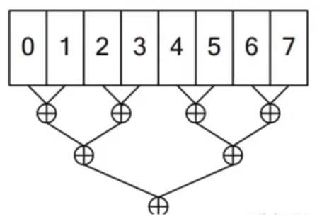

  * 数据流：2560w

### 2.1 Baseline

Baseline:一个线程做reduce，用CPU的方法来写 

```c++
__global__ void SerialKernel(const float* input, float* output, size_t n){
    float sum = 0.0f;
    for(size_t i=0; i < n; i++){
        sum+=input[i];
    }
    *output = sum;
}
void ReduceBySerial(const float* input, float* output, size_t n){
    SerialKernel<<<1,1>>>(input, output, n);
}

```

### 2.2 reduce_v0-使用多个thread以及shared memory并行运算

```c++
// reduce_v0
template<int blockSize>
__global__ void reduce_v0(float* d_in, float* d_out) {
	//存入共享内存中
	__shared__ float smem[blockSize];

	int tid = threadIdx.x;
	// int gtid = blockIdx.x * blockSize + threadIdx.x;
	// 每一个线程加载一个元素到shared memory对应的位置
	smem[tid] = d_in[tid];
	//等到所有thread全部完成以上操作后才继续
	__syncthreads();

	// 在shared memory中reduce
	for (int index = 1; index < blockDim.x; index *= 2) {
		if (tid % (2 * index) == 0) {
			smem[tid] += smem[tid + index];
		}
		__syncthreads();
	}

	// 最后全部存到0位置，这就是这个block的结果
	if (tid == 0) {
		d_out[blockIdx.x] = smem[0];
	}
}

bool CheckResult(float* out, float groudtruth, int n) {
	float res = 0;
	for (int i = 0; i < n; i++) {
		res += out[i];
	}

	if (res != groudtruth) {
		return false;
	}
	return true;
}
int main(){
/*
		1. 使用每个thread先加载一个数据到其shared memory中
		2. thread两两相加，利用__syncthreads同步所有thread的行为，如此若干轮
		3. 最后一个block的结果会存在这个block的thread0中
		*/
		float milliseconds = 0;
		cudaSetDevice(0);
		cudaDeviceProp deviceProp;
		cudaGetDeviceProperties(&deviceProp, 0);
		const int N = 25600000;
		const int blockSize = 256;
		int GridSize = min((N + 256 - 1) / 256, deviceProp.maxGridSize[0]);
		//申请内存
		//输入一个大小为N的数组
		float* a = (float*)malloc(N * sizeof(float));
		float* d_a;
		cudaMalloc((void**)&d_a, N * sizeof(float));
		//输出的是一个grid中的每个block计算的结果，存为一个数组
		float* out = (float*)malloc(GridSize * sizeof(float));
		float* d_out;
		cudaMalloc((void**)&d_out, GridSize * sizeof(float));

		// 初始化输入数组为全1
		for (int i = 0; i < N; i++) {
			a[i] = 1.0f;
		}
		// 答案应该就等于数组大小
		float groudtruth = N * 1.0f;
		// 传给GPU
		cudaMemcpy(d_a, a, N * sizeof(float), cudaMemcpyHostToDevice);

		dim3 Grid(GridSize);
		dim3 Block(blockSize);

		cudaEvent_t start, stop;
		cudaEventCreate(&start);
		cudaEventCreate(&stop);
		cudaEventRecord(start);
		reduce_v0 <blockSize> <<<Grid, Block >> > (d_a, d_out);
		cudaEventRecord(stop);
		cudaEventSynchronize(stop);
		cudaEventElapsedTime(&milliseconds, start, stop);

		cudaMemcpy(out, d_out, GridSize * sizeof(float), cudaMemcpyDeviceToHost);
		printf("allcated %d blocks, data counts are %d \n", GridSize, N);

		bool is_right = CheckResult(out, groudtruth, GridSize);
		if (is_right) {
			printf("the ans is right\n");
		}
		else {
			printf("the ans is wrong\n");
			for (int i = 0; i < GridSize; i++) {
				printf("res per block : %lf\n", out[i]);
			}
			printf("\n");
			printf("groudtruth is %f \n", groudtruth);
		}
		printf("reduce_v0 latency = %f ms\n", milliseconds);

		cudaFree(d_a);
		cudaFree(d_out);
		free(a);
		free(out);
}
```


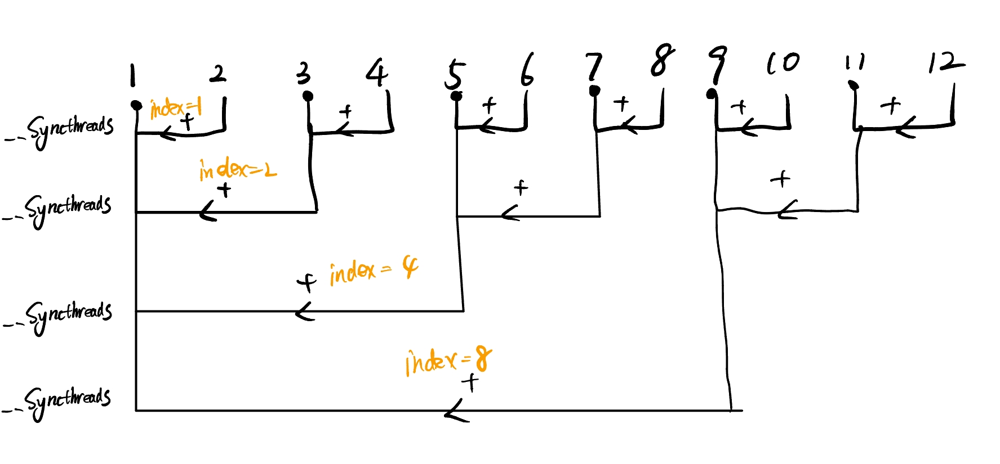

#### 2.2.1 template设置非类型模板参数

> 当你使用模板来定义一个函数或类时，模板声明（`template<...>`）必须==紧贴在其后的函数或类定义之前==。==这告诉编译器接下来的代码是一个模板定义==。
>
> 例如，对于函数模板：
>
> ```c++
> template<typename T>
> void printValue(T value) {
>     std::cout << value << std::endl;
> }
> ```
>
> 或者对于你的情况，一个带有非类型模板参数的函数模板：
>
> ```c++
> template<int blockSize>
> __global__ void reduce_v0(float* d_in, float* d_out) {
>     // ...
> }
> ```
>
> 这种结构是必要的，因为模板不是常规的函数或类定义。模板是一种告诉编译器如何为特定类型或值生成函数或类的蓝图。因此，`template<...>`声明必须紧跟其后的函数或类定义，以便编译器知道它是一个模板定义，而不是常规的函数或类定义。
>
> reduce_v0<256> <<<Grid, Block>>> (d_a, d_out);

==在C++模板编程中，模板的定义（即模板函数或模板类的实现）只能出现一次，但模板的实例化（即为模板参数提供具体值的操作）可以多次。==

`template<int blocksize>` 是一个非类型模板参数的示例，其中 `blocksize` 是一个整数。这种模板参数允许你为模板提供一个编译时常量值，从而为不同的值生成不同版本的代码。

在CUDA编程中，这种模板参数经常用于为不同的线程块大小或其他与并行计算相关的参数生成特定的内核版本。

在上述例子中，`template<int blocksize>`确实允许我们在编译时为`blocksize`提供一个值，从而避免了在运行时传递这个值作为函数参数。但这不仅仅是为了减少参数数量。使用模板参数还有其他重要的优势：

1. **编译时优化**：由于`blocksize`是一个编译时常量，编译器可以为特定的`blocksize`值进行优化。这可能会导致更高效的代码，因为编译器知道这个值是固定的，并且可以利用这个信息进行优化。
2. **代码生成**：使用模板参数，你可以为不同的`blocksize`值生成不同版本的函数或内核。这意味着你可以为不同的应用场景或硬件配置生成特定的代码版本。
3. **代码清晰性**：使用模板参数可以使代码更加清晰和模块化。你可以明确地看到函数或内核是为哪个`blocksize`值生成的，而不是在运行时查找这个值。
4. **避免运行时开销**：由于`blocksize`是一个编译时常量，不需要在运行时传递它作为参数，这可以减少一些运行时开销。

总的来说，虽然使用`template<int blocksize>`确实避免了传递一个参数，但其主要的优势是提供了编译时优化和特定代码版本生成的能力


#### 2.2.2 使用shared memory

在并行计算中，特别是在GPU编程中，`shared memory` 是一种非常有用的内存类型。使用 `shared memory` 有以下好处：

1. **速度**：`shared memory` 是一种片上内存，比全局内存访问速度快得多。因此，合理使用 `shared memory` 可以显著提高内核的性能。==一次片上访问延迟大概在30周期，片外global memory大概在300周期，虽然因架构而异，例如GDDR为300周期以上，HBM（高带宽内存）为200周期，但是都不如片上周期）。==也就是`global传到shared memory+shared memory读取计算时间< global memory读取并计算`

2. **带宽**：`shared memory` 的带宽远高于全局内存，这使得多个线程可以同时高效地访问它。

3. **数据重用**：在许多算法中，多个线程可能需要访问相同的数据。通过将这些数据加载到 `shared memory` 中，多个线程可以重复使用它，而不是每次都从全局内存中重新加载。

4. **同步**：`shared memory` 允许在一个线程块内的线程之间进行同步。这意味着，你可以确保在继续执行之前，所有线程都已经完成了对 `shared memory` 的写入或读取。

5. **减少全局内存访问**：全局内存访问是昂贵的，而且可能导致性能瓶颈。通过使用 `shared memory`，可以减少对全局内存的访问次数。

6. **协同加载和存储**：线程可以协同工作，将数据块从全局内存加载到 `shared memory`，或将数据从 `shared memory` 写回到全局内存。这种协同操作可以优化内存访问模式，从而提高性能。

7. ==**灵活性与减少内存冲突**：==

   1. **使用shared memory**:

      * 当数据被加载到`shared memory`中时，线程通常使用`threadIdx`来访问它，因为`shared memory`是线程块内部的本地存储。每个线程块都有自己的`shared memory`实例。

      * 在这种情况下，`threadIdx`为每个线程提供了一个唯一的索引，用于访问其在`shared memory`中的数据。

   2. **使用global memory**:

      * 当直接从`global memory`访问数据时，每个线程需要知道其全局索引，以便知道它应该处理哪部分数据。

      * 全局索引通常通过以下方式计算：`int globalIdx = blockIdx.x * blockDim.x + threadIdx.x;`。这里，`blockIdx.x`表示当前线程块的索引，`blockDim.x`表示线程块的大小（即每个线程块中的线程数），而`threadIdx.x`表示当前线程在其线程块中的索引。
      * 这样，每个线程都有一个唯一的全局索引，它可以用来从`global memory`中读取或写入数据。

​	总之，当使用`shared memory`时，线程通常使用`threadIdx`来访问数据，因	为它们都在同一个线程块内。但是，当直接从`global memory`访问数据时，线	程需要知道其全局索引，以确保它们正确地访问数据。

尽管 `shared memory` 有这么多好处，但也有其局限性，如有限的大小和需要手动管理。因此，开发者需要权衡利弊，根据应用程序的需求决定如何使用它。

### 2.3 reduce1: 消除前三次warp divergence

#### 2.3.1 warp divergent问题：

对于一个warp，它的所有thread都是执行同一条指令。

如果存在if-else分支情况，

* volta架构之前，warp内的thread会执行所有的分支，只是不满足条件的线程将会原地等待满足条件的thread。==这也就是典型的warp divergence==
* volta架构之后，引入了independent thread scheduling从而缓解


> 注意，不仅仅是if else才会形成分支与warp divergence，只有if 也会生成分支和warp divergence，这意味着某些thread执行的是==等待操作==
>
> 这意味着在一个warp中，一些线程可能在等待其他线程完成它们的操作。这种情况下，即使只有一个线程不执行加法操作，整个warp也会受到性能的影响，因为warp中的所有线程都必须等待最长的执行路径完成。
>
> 所以，尽管如果所有的thread都执行相同的操作和选一些thread执行操作，其时间可能是一样的，但是==性能受到了影响==，因此仍然是warp divergence

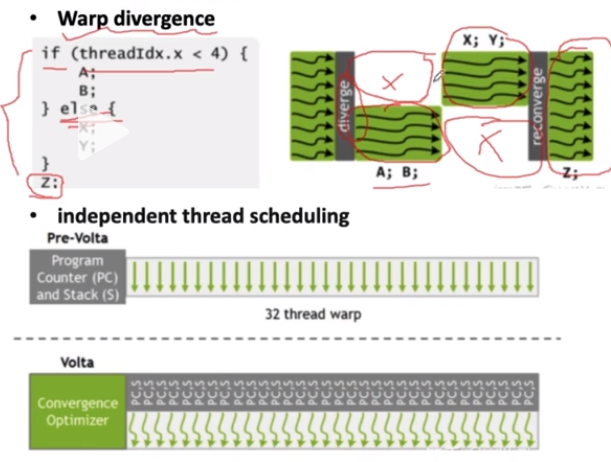

#### 2.3.2 v0中的warp divergent

如下图所示，

==v0是用一个线程对应数组中的一个位置来计算的==

* ```c++
  int tid = threadIdx.x;
  	// int gtid = blockIdx.x * blockSize + threadIdx.x;
  	// 每一个线程加载一个元素到shared memory对应的位置
  	smem[tid] = d_in[tid];
  ```

* 这会导致对于每个warp，我们实际上有如下问题

  * 在第一个同步中，所有的线程都有事干
  * 在第二个同步中，仅仅有`tid % (2 * index) == 0`位置的线程有事情干，warp需要单独分支选出这些线程，这就已经进入了==warp divergence==了
  * 在第三个线程中，occupancy更低了
  * 。。。

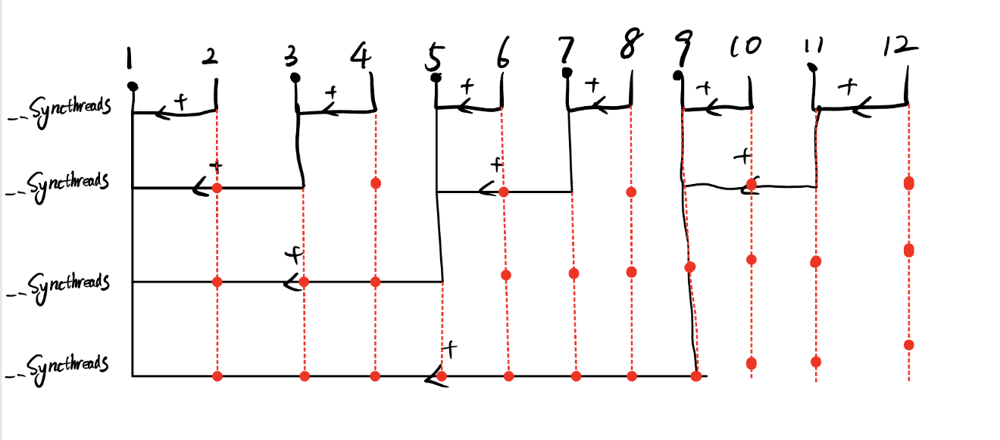

图中红点表示了这些thread都处于占着茅坑不拉屎

#### 2.3.3 通过修改循环判定，减少前三次warp divergence

```c++
for(unsigned int s = 1; s < blockDim.x; s *= 2){
    int index = 2 * s * tid;
    if(index < blockDim.x){
        sdata[index]+= sdata[indxe+s];
    }
    __syncthreads();
}
```

我们使用如下方法，即为==用线程去访问特定位置，而非将线程和位置绑定==

>  这种方法会造成大量的bank conflict，在v2中体现

这样，例如对于256个数据

* 第一个同步中，所有256个线程都忙碌，也就是8个warp都忙碌
* 第二个同步中，仅有64个线程忙碌，也就是2个warp忙碌
* 第三个同步中，仅有32个线程忙碌，也就是1个warp忙碌

可以发现，这种方法随着代数的增加，==之前能够边计算边释放warp，并且保证占用的warp一定是满载的==，当然后面不可避免的会有warp divergence问题，但是仅仅损失一个warp。

==活用s*=2来二分的计算，定位我们所需要的位置==

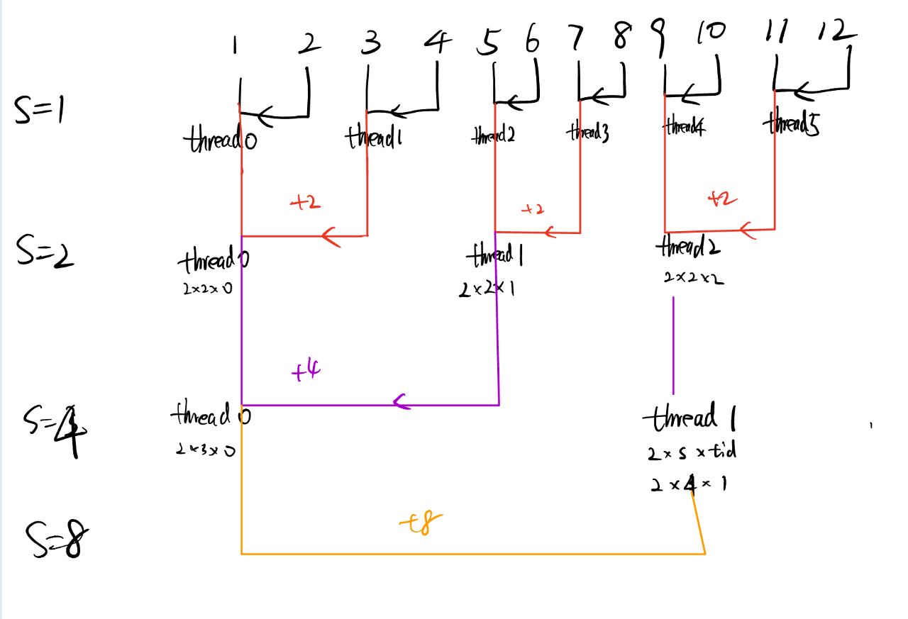


#### 2.3.4 Volta-Independent thread scheduling


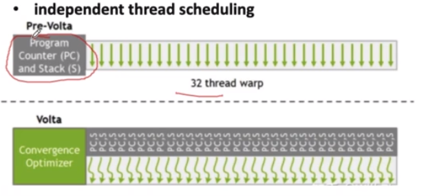

如图所示，在

* **Pre-Volta**：也就是经典的warp 调度，它是拥有一个Program Counter（PC指针），与一个栈，存储了这个warp的32个线程。PC指针指向下一个指令的地址，然后让所有的warp都运行该指令，因此warp divergence不可避免。
* **Volta**引入了独立线程调度，它为每个线程都分配了一个PC指针


volta架构为每个线程引入了一个独立的程序计数器(PC指针)，这意味着每个线程可以独立的跟踪其执行路径，但是这并不能消除warp divergence。

volta引入独立的PC指针，主要好处是提升了线程的调度灵活性，在某些状况下，能==减少==warp divergence带来的性能损失。

##### 2.3.4.1 等待(waiting)与暂时挂起(suspending)

在介绍例子之前，我们先澄清一下线程的两种状态：等待与挂起

1.**等待**

* 当一个线程等待时，它通常是因为依赖于其指令序贯中某个尚未完成的操作，例如一个内存读取或者其他线程的计算结果。
* 在等待期间，线程处于非活动状态，直到它所依赖的操作完成。

2.**暂时挂起**

* 当一个线程被暂时挂起时，它将被==移出执行单元==，使得其他线程可以使用这些执行单元。
* 被挂起的线程不会消耗计算资源，直到他们被重新调度并恢复执行
* 在具有独立PC指针的架构中，选择一个执行路径的线程可以被暂时挂起，而选择另一个执行路径的线程可以继续执行，从而更有效的利用计算资源。

##### 2.3.4.2 例子

例如，假设我们有一个warp，其中32个线程都执行以下代码：

```c++
if(tid < 16){
    //path A
    result[tid] *= 2;
}else{
    result[tid]*=3;
}
```

现在我将比较prevolta与volta架构处理这段的区别：

* 指令
  * Pre-Volta: 指令被一个统一的PC指针指向
  * Volta： 每个thread都有自己的一个PC指针
* 序贯指令
  * Pre-Volta：严格遵循序贯指令顺序，在不同的时刻令不满足要求的thread==等待==
  * Volta：虽然每个thread都有自己的PC指针，但是他们仍然属于这个warp调度，他们遵循这个warp本身的指令序列。但是，单独的PC指针赋予了单个thread==挂起==的能力。当这些thread在这一时刻不工作时，他们将被==挂起==。独立的PC指针使得线程可以更有效的处理这些不同的路径，而不是简单的序列化所有路径。
* 占用资源
  * Pre-Volta:==32个线程一直占用计算单元==
  * Volta：用不上的线程被挂起，==不占用计算资源==
* 指令执行顺序：
  * Pre-Volta:等待支路A的所有线程都完成之后，开始支路B
  * Volta: 在前一个支路有线程完成计算后，挂起的线程会==立刻接手它的计算单元==，而不用等到前一个支路所有都完成。

##### 2.3.4.3 总结

1. **独立指针赋予了线程单独挂起的能力**：这意味着在一个warp中，如果某些线程因为某种原因（例如等待内存访问）而被阻塞，其他线程可以继续执行，而不是整个warp都被阻塞。
2. **假设warp对于一个if指令分为A支路和B支路处理，先处理A支路**：独立的PC指针可以令A支路处理完成的thread解放其运算资源，让B支路的某一个挂起的thread接手这些计算单元。此时A支路的线程被挂起。
3. **warp divergence并未完全消失**：虽然独立的PC指针提供了更灵活的线程调度，但这并不意味着warp divergence的开销会完全消失，在volta中，上下文切换和不同执行路径的管理成为了额外的开销。但是与没有PC指针的架构相比，这种开销已经大大减少。
4. **最佳性能仍然来自于避免或者最小化warp divergence**：独立PC指针主要是为了提高线程利用率和处理warp divergence， 但是最佳的性能仍然来自于避免或者最小化warp divergence。==这是因为即使有独立的PC指针，不同的执行路径仍然需要在同一个warp中管理和调度==，这会带来一些额外/的开销。


### 2.4 v2-消除shared Memory Bank Conflict

#### 2.4.1 基础数据类型

| 数据类型        | 位数                                 | 字节数                               |
| --------------- | ------------------------------------ | ------------------------------------ |
| **char**        | 8 bits                               | 1 byte                               |
| **short**       | 16 bits                              | 2 bytes                              |
| **int**         | 32 bits (可能为16 bits 或 64 bits)   | 4 bytes (可能为2或8 bytes)           |
| **long**        | 32 bits 或 64 bits                   | 4 bytes 或 8 bytes                   |
| **long long**   | 64 bits                              | 8 bytes                              |
| **float**       | 32 bits                              | 4 bytes                              |
| **double**      | 64 bits                              | 8 bytes                              |
| **long double** | 通常为80 bits 或 128 bits            | 通常为10 bytes 或 16 bytes           |
| **指针**        | 32位系统: 32 bits, 64位系统: 64 bits | 32位系统: 4 bytes, 64位系统: 8 bytes |
| **bool**        | 通常为8 bits                         | 1 byte                               |

`float2`、`float3`、`float4` 等都是CUDA中定义的向量类型。这些类型用于表示包含多个浮点数的向量。例如，`float2` 表示一个包含两个浮点数的向量，`float3` 表示一个包含三个浮点数的向量，以此类推。

具体来说：

- `float2`: 表示一个包含两个`float`的向量，通常用于表示2D坐标或其他需要两个浮点数的数据。
- `float3`: 表示一个包含三个`float`的向量，通常用于表示3D坐标。
- `float4`: 表示一个包含四个`float`的向量，可以用于表示四维坐标或RGBA颜色值。

在内存中，这些向量类型的大小是它们所包含的浮点数的大小的总和。例如，`float2` 的大小是8字节（因为它包含两个`float`，每个`float`是4字节）。

| 数据类型   | 位数     | 字节数   |
| ---------- | -------- | -------- |
| **float2** | 64 bits  | 8 bytes  |
| **float3** | 96 bits  | 12 bytes |
| **float4** | 128 bits | 16 bytes |

#### 2.4.2 计算机中的“Word”

"Word"是计算机科学和计算机工程中的一个术语，通常用来描述==计算机内存或数据存储的基本单位==。它的具体大小和定义可能因架构和上下文而异。以下是关于"word"的一些关键点：

1. **基本定义**：在计算机架构中，一个word通常指的是计算机的自然数据单位。对于给定的硬件平台，一个word的大小表示该计算机一次可以处理或传输的数据的位数。
2. **大小**：word的大小因计算机架构而异。例如，一个32位计算机的word大小通常是32位或4字节。同样，64位计算机的word大小通常是64位或8字节。
3. **与其他单位的关系**：
   - **Byte**：通常是8位。大多数现代计算机系统中，一个word包含多个字节。
   - **Halfword**：通常是word大小的一半。
   - **Doubleword**：通常是word大小的两倍。
4. **使用场景**：word的概念在多个计算机科学领域中都有应用，包括内存管理、数据传输和指令集架构。
5. **历史**：在早期的计算机系统中，word的大小可能不是8位的倍数。但随着时间的推移，8位字节成为了标准，现代计算机的word大小通常是字节的整数倍。
6. **指令集和数据传输**：在某些上下文中，word可以指代计算机指令的大小或数据总线一次可以传输的数据量。

总的来说，"word"是描述计算机数据大小或长度的一个基本术语，具体的定义和大小取决于特定的计算机架构和上下文。


#### 2.4.3 CUDA Shared Memory 和 Bank 机制

##### 2.4.3.1 Shared Memory 概述

Shared Memory 是 CUDA 中的一个重要概念，它位于每个 SM（Streaming Multiprocessor）上，作为一个快速、可编程的存储器。与全局内存相比，Shared Memory 的访问速度快得多，但其大小有限。为了最大化其性能，NVIDIA 的 GPU 使用了一个称为 "bank" 的机制来组织 shared memory。

##### 2.4.3.2 Shared Memory 的 Bank 机制

###### 1. Banks 的定义

- Shared memory 被分为多个等大小的存储单元，称为 banks。
- 每个 bank 可以在一个时钟周期内为一个线程提供一个 word 的数据。
- 在某些架构中，例如 Fermi 架构，有 32 个 banks，而在新的架构中，如 Volta，有更多的 banks。
- **地址映射**：
  - 当线程访问shared memory时，地址是如何映射到特定的bank的呢？
  - 对于32位访问（例如，单个float或int），地址的最低几位决定了数据存储在哪个bank。例如，在有32个banks的架构中，地址的最低5位决定了bank的编号。
  - 这意味着连续的32位words（例如，array[0], array[1], array[2]...）会被映射到不同的banks。

###### 2. Bank Conflicts

- 当两个或更多的线程在同一时钟周期内访问同一个 bank 的不同地址时，会发生 bank conflict。
- 这会导致访问被序列化，增加访问的延迟。

###### 3. 避免 Bank Conflicts

- 为了避免 bank conflicts，应确保在同一时钟周期内，同一个 warp 中的线程访问的 shared memory 地址分布在不同的 banks 上。
- 例如：`array[0]` 和 `array[32]` 都映射到 bank 0，因此应避免在同一时钟周期内访问这两个地址。

###### 4. Broadcasting

- 如果一个 warp 中的所有线程在同一时钟周期内访问同一个 bank 的同一个地址，GPU 可以广播该地址的数据到所有线程，而不会产生 bank conflict。

###### 5. Bank 的大小和宽度

- 在大多数 CUDA 架构中，==每个 bank 的宽度是 32 位或 4 字节。==
- 如果线程访问的数据宽度超过 4 字节（例如，`float2` 或 `float4`），可能会发生 bank conflict。

###### 6. 示例

- 当线程访问 `array[threadIdx.x]` 时，由于连续的 32 位 words 被映射到不同的 banks，因此不会有 bank conflicts。
- 但如果每个线程访问 `array[2 * threadIdx.x]`，则会发生 2-way bank conflict。

###### 7. 术语

1. **Bank Width**：每个bank的数据宽度。在许多CUDA架构中，每个bank的宽度是32位或4字节。
2. **Bank Conflict**：当两个或更多的线程在同一个时钟周期内尝试访问同一个bank的数据时，会发生bank conflict。这导致访问被序列化，从而降低性能。
3. **Bank Indexing**：描述如何将shared memory地址映射到特定的bank。例如，在一个有32个banks的系统中，地址0、32、64等会映射到bank 0；地址1、33、65等会映射到bank 1，以此类推。
4. **Stride**：线程之间访问shared memory的地址间隔。例如，如果线程访问的是`array[threadIdx.x * stride]`，那么stride就是访问之间的间隔。Stride会影响bank conflicts的发生。
5. **Broadcast**：在某些CUDA架构中，当所有线程在同一个时钟周期内访问同一个bank的相同地址时，硬件可以广播该地址的数据到所有线程，而不会发生bank conflict。
6. **Coalesced Access**：当线程以一种可以合并为单个内存事务的模式访问shared memory时，称为coalesced access。这通常与global memory访问相关，但与shared memory的高效访问模式类似。
7. **Partition Camping**：当多个线程集中访问少数几个banks，而忽略其他banks时，称为partition camping。这会导致这些banks上的高度竞争和bank conflicts，而其他banks则处于空闲状态。

###### 总结

理解 shared memory 的 bank 机制对于优化 CUDA 程序至关重要。正确地使用 shared memory 可以显著提高程序的性能。

#### 2.4.4 性能下降的主要原因

如果==一个warp的多个线程访问同一个bank的不同字段时==（注，同一bank不同字段例如`bank[0][0],bank[1][0]...bank[n][0]`，那么就发生了bank冲突，因为bank被设置成不同的bank可以被同时访问，而当如果多个线程请求的shared memory地址映射到了同一个bank上，那么这些请求就变成了串行的。


例如在reduce v1中，我们消除了warp divergence，但是引入了bank conflict

在第一轮中

* thread0访问了sdata[0]和sdata[1]:`bank0，bank1的第一排`
* thread1访问了sdata[2]和sdata[3]:`bank2，bank3的第一排`
* ...
* thread16访问了sdata[32]和sdata[33]`sdata[33]也就是bank0的第二排`
  * 也就是和thread0有一个bank conflict
* thread17访问了sdata[34]和sdata[35]`bank1，bank2的第二排`
  * 也就是和thread0有一个bank conflict，和thread1有一个bank conflict
* 。。。

在后面几轮，也因为为了消除warp divergence，我们用同一个thread去访问不同的地址，因此发生了很多bank conflict，==靠后的thread对这些地址的访问都必须等待前面的thread访问完，也就是变成了串行的访问了。==

#### 2.4.5 重构for循环解决bank conflict

当**同一个warp中的不同线程**在同一时钟周期内访问**同一个bank的不同地址**时，会发生bank conflict。

但是，同一个线程在同一时钟周期内访问同一个bank的不同地址是不可能的，因为每个线程在一个时钟周期内只能执行一个内存访问操作。

因此，==我们将同一个bank的访问分配给同一个thread，以解决bank conflict==

```c++
for(unsigned int s = blockDim.x / 2; s > 0; s >>= 1){
    if(tid < s){
        sdata[tid] += sdata[tid+s];
    }
    __syncthreads();
}
if(tid == 0){
        d_out[blockIdx.x] = sdata[0];
}
```

#### 2.4.6 bank conflict的统筹理解

* **bank conflict是针对单个warp的**：
  * SM（Streaming Multiprocessor）可以同时管理多个warp，但每个时钟周期，SM会从这些warp中选择一个来执行。这意味着在任何给定的时钟周期，只有一个warp的线程正在执行。因此，不同warp之间的访问是彼此独立的。
  * 由于每个warp都有自己的指令地址，不同的warp可以执行不同的代码路径。这意味着一个warp可能正在执行一个代码段，而另一个warp可能正在执行一个完全不同的代码段。
  * **因此，只有==同一个warp不同线程访问同一个bank==才会造成bank conflict**
* **同一个thread访问同一个bank的不同位置不会造成bank conflict**：因为thread收到的指令是串行的，它一个时间只能处理一个，因此读两个数据必定是要两个周期的，而不会像其他thread访问时需要等待。
* **bank conflict最完美的消除结果**：以256个数据为例，我们使用4个warp读取并做加减
  * 仅考虑读取的话，一个warp的每个thread需要读其对应bank的两个不同位置的数据
  * 因此总共需要`2*4=8`个周期
  * ==这也说明了SM对warp的串行执行排序==


#### 2.4.7 Padding方法避免bank conflict

1. **原因**：在某些访问模式下，多个线程可能会访问到同一个 bank 的不同地址。例如，如果线程使用固定的步长（stride）来访问 shared memory，并且这个步长是 bank 数量的倍数，那么所有线程都可能会访问同一个 bank，从而导致 bank conflict。

2. **解决方法**：为了避免这种情况，可以在数据之间添加额外的空间，使得线程访问的地址不再映射到同一个 bank。这种额外的空间被称为 "padding"。

3. **如何使用**：假设我们有一个 2D 数组，每行有 32 个元素，我们想要将其存储在 shared memory 中。如果我们直接存储，那么每行的第一个元素（`例如 array[0][0], array[1][0], array[2][0]...`）都会映射到 bank 0，这可能会导致 bank conflict。为了避免这种情况，我们可以在每行的末尾添加一个额外的元素作为 padding，==使得每行有 33 个元素==。这样，第二行的第一个元素 `array[1][0] `就会映射到 bank 1，从而避免了 bank conflict。

   * ```c++
     __shared__ float sdata[n][n];
     //变成
     __shared__ float sdata[n][n+1];   
     ```

   * 

4. **注意事项**：padding 可以有效地避免 bank conflicts，但它也会浪费一些 shared memory 空间。因此，在使用 padding 时，需要权衡其带来的性能提升和额外空间的开销。

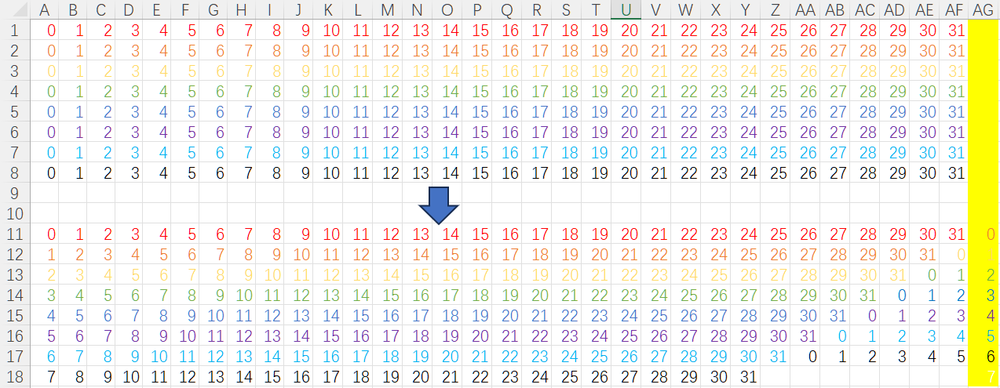

首先，回顾一下bank conflict的基本概念：当同一个warp中的多个线程在同一时钟周期内访问同一个bank的不同地址时，会发生bank conflict。

考虑一个简单的例子，假设我们有一个32个线程的warp，每个线程都访问一个32位的整数数组`data`。假设`data`的每个元素都存储在shared memory中，并且我们有32个banks。

**没有padding的情况**：

```c++
__shared__ int data[32];
```

如果线程i访问`data[i*32]`，那么所有线程都会访问bank 0，这不会导致bank conflict。

但是，如果线程i访问`data[i*32 + 1]`，那么所有线程都会访问bank 1，这同样不会导致bank conflict。

问题出现在当线程i访问`data[i*33]`时。这时，线程0访问bank 0，线程1访问bank 1，...，线程31访问bank 31，但线程0又访问bank 0（因为32 % 32 = 0）。这会导致一个2-way bank conflict。

**使用padding的情况**：

为了避免上述的bank conflict，我们可以在数组中添加一个额外的元素作为padding：

```c++
__shared__ int data[33];
```

现在，当线程i访问`data[i*33]`时，每个线程都会访问不同的bank，从而避免bank conflict。

这就是padding的基本思想：通过添加额外的空间来调整数据的布局，使得同一个warp中的线程可以并行地访问不同的banks，从而避免bank conflict。

总之，padding是一种常用的技巧，可以帮助开发者优化CUDA程序中的shared memory访问，从而提高程序的性能。

#### 2.4.8 进阶，Permute

**GEMM**： GEMM代表“General Matrix Multiply”，即通用矩阵乘法。在线性代数中，GEMM是执行两个矩阵的乘法并将结果加到第三个矩阵上的操作。数学上，它可以表示为：$C = \alpha \times A \times B + \beta \times C$ 其中，$A$ 和 $B$ 是要相乘的矩阵，而 $C$是结果矩阵。$\alpha$ 和 $\beta$ 是标量系数。

GEMM是许多科学计算、深度学习和高性能计算应用中的关键操作。因此，高效地实现GEMM对于这些应用的性能至关重要。

**TensorCore**： TensorCore是NVIDIA的Volta和后续架构中引入的一种硬件加速器，专门用于执行混合精度矩阵乘法和累加操作，从而加速深度学习训练和推理。TensorCore可以高效地执行GEMM操作，特别是在使用较低精度（如FP16）时。

**Permute在TensorCore GEMM中的作用**： 在使用TensorCore进行GEMM操作时，输入矩阵可能需要进行重新排列或转置，以确保数据的存储和访问模式与TensorCore的硬件实现相匹配。这种重新排列或转置操作通常被称为“permute”。

Permute操作确保数据在物理存储和访问时的布局能够最大化TensorCore的吞吐量。例如，为了确保连续的线程访问连续的内存地址，或为了确保数据在特定的存储块或tile中正确对齐，可能需要进行permute操作。

总的来说，permute是一个预处理步骤，用于确保数据在使用TensorCore进行GEMM操作时具有正确的布局。这有助于最大化性能并确保计算的正确性。

### 2.5 v3: 让空闲线程也干活

在V2中，我们不难发现，对于256个数据，我们启动了256个线程。

* 第一轮有128个线程在干活
* 第二轮有64个线程在干活
* 。。。

每次干活的线程都会减少一半

==我们仅考虑第一轮，第一轮占用的一半的线程完全没用，只是存储个数据，因此我们可以考虑在存储时直接将偶数位置的block值加到奇数位置==

也就是原本

```c++
__shared__ float smem[blockSize];

unsigned int tid = threadIdx.x;
unsigned int gtid = blockIdx.x * blockSize + threadIdx.x;
// load
smem[tid] = d_in[gtid];
__syncthreads();
```

变成

```c++
__shared__ float sdata[blockSize];

unsigned int tid = threadIdx.x;
unsigned int gid = blockIdx.x * (blockSize * 2) + threadIdx.x;
//load
sdata[tid] = d_in[gid] + d_in[gid+blockSize];
__syncthreads();
```

- 这里，每个线程从全局内存数组`d_in`中加载两个元素：一个位于`gid`，另一个位于`gid+blockSize`。
- 这两个元素被加在一起，并将结果存储在共享内存数组`sdata`的相应位置。


#### 2.5.1 为什么这一个简单的操作会快那么多

1. **块数、并行度和硬件利用率**：
   - 由于v3的每个线程处理两个数据元素，它只需要一半的线程和块数来完成相同的工作。这意味着，对于给定的数据集，程序一可以使用更少的资源来完成相同的工作。
   - 更少的块数意味着更少的块启动和终止开销，以及更少的上下文切换。
   - 由于v3使用更少的块来处理相同的数据量，这可能导致更高的SM（Streaming Multiprocessor）利用率。当一个SM上的线程块完成执行时，它可以迅速地启动另一个线程块，从而保持高并行度。
   - 更高的并行度意味着GPU的计算单元在任何给定时刻都有更多的工作可做，从而提高硬件利用率。

### 2.6 v4: 单一warp内部的规约操作

#### 2.6.1 什么是规约

归约操作是将一组数据元素组合成一个单一的输出值的过程。在这个例子中，归约操作是加法。

#### 2.6.2 __syncwarp()

`__syncwarp()` 和 `__syncthreads()` 都是CUDA中的同步原语，但它们的用途和行为是不同的。以下是它们之间的主要区别：

1. **同步范围**：
   - `__syncthreads()`：同步一个block中的所有线程。这意味着，当一个线程到达`__syncthreads()`调用时，它会等待该block中的所有其他线程都到达这个点，然后所有线程才会继续执行。
   - `__syncwarp()`：==仅同步当前warp中的线程==。在大多数NVIDIA GPU上，一个warp包含32个线程。这意味着，只有当前warp中的线程会在`__syncwarp()`处同步，而其他warps不受影响。
2. **使用场景**：
   - `__syncthreads()`：当你需要确保block中的所有线程都已完成某些工作，例如==填充共享内存，或者当你需要避免在block内的线程之间产生竞争条件时==，使用此函数。
   - `__syncwarp()`：在某些算法中，你可能只需要同步一个warp中的线程，而不是整个block。在这种情况下，使用`__syncwarp()`会更加高效，因为它避免了不必要的同步开销。
3. **效率**：
   - `__syncthreads()`：由于它同步了整个block中的所有线程，所以它的开销可能会更大。
   - `__syncwarp()`：由于它只同步一个warp，所以它的开销通常较小。
4. **版本和硬件要求**：
   - `__syncthreads()`：在所有CUDA版本和硬件上都可用。
   - `__syncwarp()`：这是一个相对较新的功能，需要较新版本的CUDA和硬件支持。

总的来说，`__syncthreads()` 和 `__syncwarp()` 都是用于同步线程的工具，但它们的同步范围和使用场景是不同的。选择哪一个取决于你的具体需求和算法的特点。

#### 2.6.2 v4的改进

在最后一轮迭代时，block中只有warp0还在干活，此时无需syncthreads，这一条语句造成了很大的开销，因为同步十分耗时。

* 改为s>32,单独操作最后一轮
* 使用`__syncwarp()`，因为x引入==独立线程调度==，此时warp的所有线程可能不是在同一指令上（不在指令序贯的同一个位置上，例如有的跑到了k+1,有的还在k)。
  * 例如，`当tid=0时,smem[tid+1]=smem[1],smem[tid+2]=smem[2];`
  * `当tid=1时，smem[tid] = smem[1] = smem[1] + smem[1+1]`
  * 你可以发现，这个`smem[k]`的调用是十分混乱的，考虑到==独立线程调度==的引入，有可能我`tid0`调用到`smem[1]`的时候，`tid1`还未完成对`smem[1]`的计算，这样就会导致计算错误。
  * 因此引入`__syncwarp()`作为媒介，并使用`__syncwarp()`做一个同步
* 如果不使用`__syncwarp()`，大部分情况下可能是没事的，但是对于新型GPU，有极小的概率出错，稳妥起见还是使用同步。

```c++
//latency: 0.694ms
__device__ void WarpSharedMemReduce(volatile float* smem, int tid){
    float x = smem[tid];
    if (blockDim.x >= 64) {
      x += smem[tid + 32]; __syncwarp();
      smem[tid] = x; __syncwarp();
    }
    x += smem[tid + 16]; __syncwarp();
    smem[tid] = x; __syncwarp();
    
    x += smem[tid + 8]; __syncwarp();
    smem[tid] = x; __syncwarp();
    
    x += smem[tid + 4]; __syncwarp();
    smem[tid] = x; __syncwarp();
    
    x += smem[tid + 2]; __syncwarp();
    smem[tid] = x; __syncwarp();
    
    x += smem[tid + 1]; __syncwarp();
    smem[tid] = x; __syncwarp();
}


for (int s = blockDim.x / 2; s > 32; s >>= 1) {
        if (tid < s) {
            smem[tid] += smem[tid + s];
        }
        __syncthreads();
    }
// last warp拎出来单独作reduce
if (tid < 32) {
    WarpSharedMemReduce(smem, tid);
}
```

这段代码是一个用于在warp内部进行数据归约的函数。归约操作是将一组数据元素组合成一个单一的输出值的过程。在这个例子中，归约操作是加法。

函数 `WarpSharedMemReduce` 的目的是将warp内的线程的数据相加，并将结果存储在 `smem[0]` 中。以下是代码的逐行解析：

1. `__device__ void WarpSharedMemReduce(volatile float* smem, int tid)`:
   - 这是一个设备函数，可以从CUDA内核中调用。
   - 它接受一个指向共享内存的指针 `smem` 和一个线程ID `tid`。
2. `float x = smem[tid];`:
   - 每个线程从共享内存中读取其对应的数据值。
   - 在归约操作中使用局部变量（如 `x`）而不是直接使用共享内存（如 `smem`）进行所有操作有几个原因：
     1. **寄存器访问速度更快**：局部变量通常存储在寄存器中，而寄存器的访问速度比共享内存快得多。因此，将数据从共享内存读取到寄存器，进行计算，然后再写回共享内存通常比直接在共享内存上进行多次操作更快。
     2. **减少共享内存的访问次数**：在归约操作中，每个线程需要多次读取和写入数据。使用局部变量可以减少对共享内存的访问次数，从而减少潜在的bank conflicts和访问延迟。
     3. **编译器优化**：使用局部变量可以为编译器提供更多的优化机会。编译器可能会对局部变量进行更多的优化，如指令重排、常量传播等，从而提高代码的性能。
     4. **代码可读性**：虽然这不是性能方面的考虑，但使用局部变量可以使代码更加清晰和可读。局部变量 `x` 提供了一个明确的上下文，表示正在进行的归约操作，而直接使用 `smem` 可能会使代码更加复杂和难以理解。
3. `if (blockDim.x >= 64) { ... }`:
   - 这个条件检查是否有足够的线程在block中进行归约。如果block的大小大于或等于64，那么这个条件成立。
4. `x += smem[tid + 32]; __syncwarp();`:
   - 每个线程将其数据与32个位置之后的数据相加。这是归约的第一步，它将数据的数量减半。
   - `__syncwarp();` 确保所有线程在warp中都完成了这一步。
5. `smem[tid] = x; __syncwarp();`:
   - 每个线程将其新计算的值写回共享内存。
   - 再次使用 `__syncwarp();` 确保所有线程都完成了写操作。
6. 接下来的几行代码重复了上面的步骤，但每次都将数据的数量减半，直到只剩下一个数据值：
   - `x += smem[tid + 16]; __syncwarp();`
   - `x += smem[tid + 8]; __syncwarp();`
   - `x += smem[tid + 4]; __syncwarp();`
   - `x += smem[tid + 2]; __syncwarp();`
   - `x += smem[tid + 1]; __syncwarp();`
7. 在每一步之后，每个线程都将其新计算的值写回共享内存。

最终，所有的数据都被归约到 `smem[0]` 中。这个函数使用了一个经典的并行归约算法，它利用了warp中线程的并行性来快速地归约数据。

### 2.7 v5: 融合V3与V4，完全展开for循环，省去for循环中的判断和加法指令

为什么展开一下就有提升？

* 在for循环中，不可避免的有类似`for(int s = blockDim.x/2;s > 32;s >>= 1)`
* 判断指令`s>32`和位运算`s >>=1`都会消耗大量计算量（因为所有线程都要执行这个指令）
* 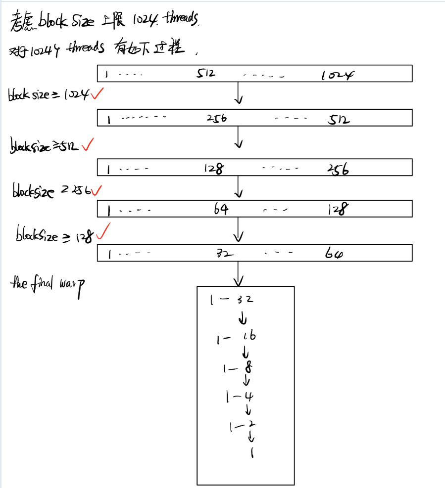

```c++
#include <bits/stdc++.h>
#include <cuda.h>
#include "cuda_runtime.h"

#define THREAD_PER_BLOCK 256
// latency: 0.656ms
template <int blockSize>
__device__ void BlockSharedMemReduce(float* smem) {
  if (blockSize >= 1024) {
    // 考虑大多数NVGPU中，blockSize线程上限是1024
    // 对于线程数=1024的情况，从512开始就是第一个情况
    // 这里虽然是>=1024，但是cover的实际上只有=1024的情况
    if (threadIdx.x < 512) {
      smem[threadIdx.x] += smem[threadIdx.x + 512];
    }
    __syncthreads();// 因为是对block层面的累加，因此需要同步线程
  }
    
  if (blockSize >= 512) {
    if (threadIdx.x < 256) {
      smem[threadIdx.x] += smem[threadIdx.x + 256];
    }
    __syncthreads();
  }
  if (blockSize >= 256) {
    if (threadIdx.x < 128) {
      smem[threadIdx.x] += smem[threadIdx.x + 128];
    }
    __syncthreads();
  }
  if (blockSize >= 128) {
    if (threadIdx.x < 64) {
      smem[threadIdx.x] += smem[threadIdx.x + 64];
    }
    __syncthreads();
  }
  // 
  // the final warp
  if (threadIdx.x < 32) {
    volatile float* vshm = smem;
    if (blockDim.x >= 64) {
      vshm[threadIdx.x] += vshm[threadIdx.x + 32];
    }
    vshm[threadIdx.x] += vshm[threadIdx.x + 16];
    vshm[threadIdx.x] += vshm[threadIdx.x + 8];
    vshm[threadIdx.x] += vshm[threadIdx.x + 4];
    vshm[threadIdx.x] += vshm[threadIdx.x + 2]; 
    vshm[threadIdx.x] += vshm[threadIdx.x + 1];
  }
}

template <int blockSize>
__global__ void reduce_v5(float *d_in, float *d_out){
    __shared__ float smem[THREAD_PER_BLOCK];

    unsigned int tid = threadIdx.x;
    unsigned int i = blockIdx.x * (blockDim.x * 2) + threadIdx.x;
    // load: 每个线程加载两个元素到shared mem对应位置
    smem[tid] = d_in[i] + d_in[i + blockDim.x];
    __syncthreads();
    // compute: reduce in shared mem
    BlockSharedMemReduce<blockSize>(smem);

    // store: write back to global mem
    if (tid == 0) {
        d_out[blockIdx.x] = smem[0];
    }
}
```

上面那种方法只能针对填满了的常规block，假如有人写了个例如blocksize=700就西巴了，因此，我对其做出改写(==待验证==)，注意，我增加了计算的步骤，实际上在编程中，我们最好是规范化blockSize为2的幂，来使得这个device函数能够跑满最大收益的，而非改写device函数让其泛化性更好。

```c++
#include <bits/stdc++.h>
#include <cuda.h>
#include "cuda_runtime.h"

#define THREAD_PER_BLOCK 256
// latency: 0.656ms
template <int blockSize>
__device__ void BlockSharedMemReduce(float* smem) {
  __shared__ int bound = blockSize;
  if (blockSize >= 512) {
    if (threadIdx.x + 512 < bound) {
      bound = 512;
      smem[threadIdx.x] += smem[threadIdx.x + 512];
    }
    __syncthreads();// 因为是对block层面的累加，因此需要同步线程
  }
    
  if (blockSize >= 256) {
    if (threadIdx.x + 256 < bound) {
      bound = 256;
      smem[threadIdx.x] += smem[threadIdx.x + 256];
    }
    __syncthreads();
  }
    
  if (blockSize >= 128) {
    if (threadIdx.x + 128 < bound) {
      bound = 128;
      smem[threadIdx.x] += smem[threadIdx.x + 128];
    }
    __syncthreads();
  }
    
  if (blockSize >= 64) {
    if (threadIdx.x + 64 < bound) {
      bound = 64;
      smem[threadIdx.x] += smem[threadIdx.x + 64];
    }
    __syncthreads();
  }
  // 
  // the final warp
  if (threadIdx.x < 32) {
    volatile float* vshm = smem;
    if (blockDim.x >= 64) {
      vshm[threadIdx.x] += vshm[threadIdx.x + 32];
    }
    vshm[threadIdx.x] += vshm[threadIdx.x + 16];
    vshm[threadIdx.x] += vshm[threadIdx.x + 8];
    vshm[threadIdx.x] += vshm[threadIdx.x + 4];
    vshm[threadIdx.x] += vshm[threadIdx.x + 2]; 
    vshm[threadIdx.x] += vshm[threadIdx.x + 1];
  }
}

template <int blockSize>
__global__ void reduce_v5(float *d_in, float *d_out){
    __shared__ float smem[THREAD_PER_BLOCK];

    unsigned int tid = threadIdx.x;
    unsigned int i = blockIdx.x * (blockDim.x * 2) + threadIdx.x;
    // load: 每个线程加载两个元素到shared mem对应位置
    smem[tid] = d_in[i] + d_in[i + blockDim.x];
    __syncthreads();
    // compute: reduce in shared mem
    BlockSharedMemReduce<blockSize>(smem);

    // store: write back to global mem
    if (tid == 0) {
        d_out[blockIdx.x] = smem[0];
    }
}
```

### 2.8 v6：优化代码结构:用少量的block串行循环计算reduce，并再调用一次kernel计算blocksum的和

* **grid_size loop**
  * 不同于v3，我们实际上是将任务分割成合适大小的小任务，串行的执行这些任务
  * **当需要处理kn个数据，但是一共分配了`blocksize*girdsize=n`个thread**：使用让`n`个线程处理`kn`个元素，用固定步长n访问后面的元素，相当于串行执行。.
  * 之前的是在一个分配好的grid/block中进行这种操作，我们这里讨论的是少分配
  * 这种方法不一定有更好的性能，只是一种实现方法
  * 好处：
    * 更灵活，可以handle大于启动的线程数量的问题
    * 复用线程，减小线程创建和销毁的开销
    * ==方便debug：在这种情况下我们可以直接将block和grid size设为1，此时为串行程序，便于debug。==
  * 坏处：
    * 需要做一个Multi block reduce(将所有的block值加起来)

写法：调用两次kernel，第一次kernel返回N个block计算得到的值，第二次kernel启动1个block，N个线程再将这些值加起来即可。

```c++
int main(){
    cudaDeviceProp deviceProp;
    cudaGetDeviceProperties(&deviceProp, 0);
    int maxblocks = deviceProp.maxGridSize[0];
    const int blockSize = 256;
    const int N = 25600000;
    int gridSize = std::min((N + blockSize - 1) / blockSize, maxblocks);

    float milliseconds = 0;
    float *a = (float *)malloc(N * sizeof(float));
    float *d_a;
    cudaMalloc((void **)&d_a,N * sizeof(float));

    float *out = (float*)malloc((gridSize) * sizeof(float));
    float *d_out;
    float *part_out;//新增part_out存储每个block reduce的结果
    cudaMalloc((void **)&d_out, 1 * sizeof(float));
    cudaMalloc((void **)&part_out, (gridSize) * sizeof(float));
    float groudtruth = N;

    for(int i = 0; i < N; i++){
        a[i] = 1;
    }

    cudaMemcpy(d_a, a, N * sizeof(float), cudaMemcpyHostToDevice);

    dim3 Grid(gridSize);
    dim3 Block(blockSize);
    

    cudaEvent_t start, stop;
    cudaEventCreate(&start);
    cudaEventCreate(&stop);
    cudaEventRecord(start);
    reduce_v6<blockSize><<<Grid, Block>>>(d_a, part_out, N);
    reduce_v6<blockSize><<<1, Block>>>(part_out, d_out, gridSize);
    cudaEventRecord(stop);
    cudaEventSynchronize(stop);
    cudaEventElapsedTime(&milliseconds, start, stop);

    cudaMemcpy(out, d_out, 1 * sizeof(float), cudaMemcpyDeviceToHost);
    bool is_right = CheckResult(out, groudtruth, 1);
    if(is_right) {
        printf("the ans is right\n");
    } else {
        printf("the ans is wrong\n");
        for(int i = 0;i < 1;i++){
            printf("%lf ",out[i]);
        }
        printf("\n");
    }
    printf("reduce_v6 latency = %f ms\n", milliseconds);

    cudaFree(d_a);
    cudaFree(d_out);
    cudaFree(part_out);
    free(a);
    free(out);
}
```

### 2.9 warp level reduce

在之前我们基本都是对block内部的线程操作，也就是block level reduce（或者shared memory层面上的reduce）。

再nvidia 新的架构中，warp操作被引入了进来。

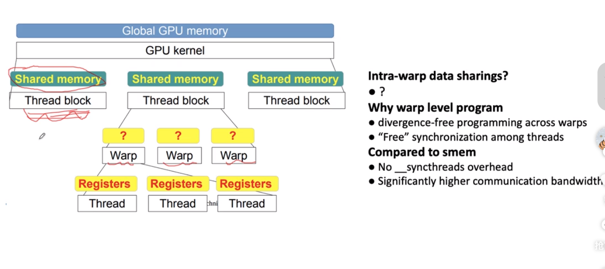

#### 2.9.1 warp level reduce的优点

* 不用考虑warp divergence

* 线程之间的同步是近乎没有消费的（比syncthread小很多）

* 更高的通信带宽

  * 确实，无论是warp级别的操作还是block级别的操作，它们都使用shared memory进行通信。但是，warp级别的操作在某些情况下可以更高效地利用shared memory，原因如下：

    1. ==**无需同步**==：在一个warp内，所有线程都是同时执行的。这意味着，当一个warp的线程写入shared memory后，其他线程可以立即读取这些值，而无需等待同步指令（如`__syncthreads()`）。这种紧密的协作可以提高通信效率。
    2. **更少的bank conflicts**：在某些操作中，warp级别的通信模式可以减少shared memory的bank conflicts。例如，当一个warp的所有线程都读取同一个shared memory地址时，这可以被视为一个广播操作，而不会引起bank conflict。
    3. **更高的指令级并行性**：由于warp内的线程是同时执行的，它们可以更好地利用指令级并行性。当一个线程等待其shared memory访问完成时，其他线程可以执行其他指令。
    4. **更少的控制流散度**：在warp内，所有线程共享相同的控制流。这意味着，当一个线程决定执行某个路径时，其他线程也会执行相同的路径。这可以减少由于控制流散度导致的性能损失。

    总的来说，尽管warp级别的操作和block级别的操作都使用shared memory，但由于warp内的线程紧密协作的特性，warp级别的操作通常可以更高效地利用shared memory。

  * 当我们说“更高的通信带宽”时，我们实际上是指更高的数据吞吐量或更快的数据交换速度。在GPU中，这通常与内存访问模式、内存访问的并行度以及内存访问的冲突（如bank conflicts）有关。

    * 在warp级别的操作中，以下因素可能导致更高的通信带宽：
      1. **连续的内存访问**：在warp中，线程的ID是连续的，这意味着它们访问shared memory的模式也是连续的。连续的内存访问可以被合并成更大的内存事务，从而提高带宽利用率。
      2. **减少的bank conflicts**：如前所述，warp级别的操作可能会减少bank conflicts。每个bank conflict都会导致额外的内存访问延迟，从而降低通信带宽。
      3. **更高的并行度**：在warp中，所有32个线程都是同时执行的。这意味着它们可以同时访问shared memory，从而实现更高的并行度和更高的通信带宽。
      4. **优化的硬件支持**：GPU的硬件设计是为warp级别的操作进行优化的。例如，广播机制允许一个warp中的所有线程在一个时钟周期内从同一个shared memory地址读取数据。
      5. **减少的同步开销**：在warp级别的操作中，由于所有线程都是同步执行的，因此可以减少显式的同步操作，如`__syncthreads()`。这可以减少同步的开销，从而提高通信带宽。

#### 2.9.2 Warp level primitive

==warp level primitive: warp 内各thread间的寄存器可以相互访问==

在早些时候，warp内的各thread只能通过shared memory来访问彼此的寄存器。

##### 2.9.2.1 shuffle down synchronize:` __shfl_down_sync` 

`__shfl_down()` 或 `__shfl_down_sync()` 是CUDA中的一个shuffle指令，它允许一个线程从同一个warp中的另一个线程中读取数据，而不需要通过共享内存或全局内存。这种直接的线程间通信是非常高效的，因为它避免了内存访问的开销。

具体来说，`__shfl_down()`函数允许一个线程读取其下方的线程的值。例如，线程0可以读取线程1的值，线程1可以读取线程2的值，依此类推。

```c++
T __shfl_down_sync(unsigned mask, T var, unsigned int delta, int width = warpSize);
```

* `mask`：一个整数，指定哪些线程参与shuffle操作。mask转换成二进制之后，为1的位就是指定的线程
* `var`：当前线程要进行shuffle的值。==考虑到每个线程都是不同的tid，在这个kernel中申请的变量应该都是一样的，例如在下面的例子中，每个thread都有两个变量，tid和value，你可以选择传递哪一个变量的值，在例子中我们传递的是下一个thread的位置==
* `delta`：指定从当前线程往下数的线程数。例如，delta为1意味着读取下一个线程的值，delta为2意味着读取距离当前线程两个位置的线程的值。
* `width`：定义参与shuffle操作的线程数。默认是warp的大小，即32。

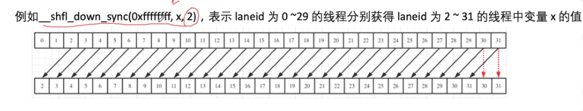

使用shuffle指令的好处是：

1. **高效的线程间通信**：不需要使用共享内存或全局内存。
2. **减少同步的需要**：在同一个warp中，线程是同时执行的，因此不需要额外的同步。
3. **减少共享内存的使用**：可以减少或避免使用共享内存，从而为其他用途释放更多的共享内存。

==一个常见的使用场景是在进行归约操作时，使用shuffle指令可以高效地合并warp中的数据。==

==函数的返回值就是所取到的值。==

###### 例子

让我们通过一个简单的例子来理解`__shfl_down_sync()`函数的工作方式。

假设我们有一个warp，其中每个线程都有一个唯一的ID作为其值（即线程0的值为0，线程1的值为1，依此类推）。我们想要每个线程都获取其下一个线程的值。例如，线程0想要获取线程1的值，线程1想要获取线程2的值，依此类推。

以下是如何使用`__shfl_down_sync()`来实现这一目标的CUDA代码：

```c++
__global__ void shuffleExample(int* output) {
    int tid = threadIdx.x;
    int value = tid; // 每个线程的初始值是其线程ID

    // 使用shuffle函数获取下一个线程的值
    int nextValue = __shfl_down_sync(0xFFFFFFFF, value, 1);

    // 将结果存储到输出数组中
    output[tid] = nextValue;
}

int main() {
    const int numThreads = 32; // 一个warp的大小
    int* d_output;
    int h_output[numThreads];

    cudaMalloc(&d_output, numThreads * sizeof(int));
    shuffleExample<<<1, numThreads>>>(d_output);
    cudaMemcpy(h_output, d_output, numThreads * sizeof(int), cudaMemcpyDeviceToHost);

    // 打印输出
    for (int i = 0; i < numThreads; i++) {
        printf("Thread %d got value: %d\n", i, h_output[i]);
    }

    cudaFree(d_output);
    return 0;
}
```

当你运行上述代码时，你会看到以下输出：

```
mathematicaCopy codeThread 0 got value: 1
Thread 1 got value: 2
Thread 2 got value: 3
...
Thread 30 got value: 31
Thread 31 got value: -1
```

注意，最后一个线程（线程31）没有下一个线程的值，所以它得到了一个未定义的值（在这种情况下是-1）。

##### 2.9.2.2 `__shfl_up_sync`

同理。

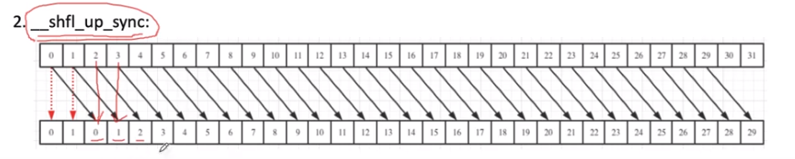

#### 2.9.3 代码例子

```c++
template<unsigned int blockSize>
__device__ __forceinline__ float warpReduceSum(float sum){
    if(blockSize >= 32) 
        sum += __shfl_down_sync(0xffffffff, sum, 16);
    if(blockSize >= 16) 
        sum += __shfl_down_sync(0xffffffff, sum, 8);
    if(blockSize >= 8) 
        sum += __shfl_down_sync(0xffffffff, sum, 4);
    if(blockSize >= 4) 
        sum += __shfl_down_sync(0xffffffff, sum, 2);
    if(blockSize >= 2) 
        sum += __shfl_down_sync(0xffffffff, sum, 1);
    return sum;
}
```

warp shuffle保证先后顺序的正确性，不用使用synchronize

注意，在`__device__或者__global__`里面，

* `__shared__`是申请一个共享内存
* `float a`是直接申请一个寄存器

```c++
//warp shuffle
#include <bits/stdc++.h>
#include <cuda.h>
#include "cuda_runtime.h"

#define WarpSize 32
//latency: 1.254ms
template <int blockSize>
__device__ float WarpShuffle(float sum) {
    //__shfl_down_sync：前面的thread向后面的thread要数据
    //__shfl_up_sync: 后面的thread向前面的thread要数据
    //返回前面的thread向后面的thread要的数据，比如__shfl_down_sync(0xffffffff, sum, 16)那就是返回16号线程，17号线程的数据
    //warp内的数据交换不会出现warp在shared memory上交换数据时的不一致现象，无需syncwarp
    if (blockSize >= 32)sum += __shfl_down_sync(0xffffffff, sum, 16); // 0-16, 1-17, 2-18, etc.
    if (blockSize >= 16)sum += __shfl_down_sync(0xffffffff, sum, 8);// 0-8, 1-9, 2-10, etc.
    if (blockSize >= 8)sum += __shfl_down_sync(0xffffffff, sum, 4);// 0-4, 1-5, 2-6, etc.
    if (blockSize >= 4)sum += __shfl_down_sync(0xffffffff, sum, 2);// 0-2, 1-3, 4-6, 5-7, etc.
    if (blockSize >= 2)sum += __shfl_down_sync(0xffffffff, sum, 1);// 0-1, 2-3, 4-5, etc.
    return sum;
}

template <int blockSize>
__global__ void reduce_warp_level(float *d_in,float *d_out, unsigned int n){
    float sum = 0;//当前线程的私有寄存器，即每个线程都会拥有一个sum寄存器

    unsigned int tid = threadIdx.x;
    unsigned int gtid = blockIdx.x * blockSize + threadIdx.x;
    unsigned int total_thread_num = blockSize * gridDim.x;

    for (int i = gtid; i < n; i += total_thread_num)
    {
        sum += d_in[i];//thread local reduce，一个block/thread处理多个元素
    }
    
    // 计算每个warp的和
    __shared__ float WarpSums[blockSize / WarpSize]; //warp数量
    const int laneId = tid % WarpSize;
    const int warpId = tid / WarpSize; 
    sum = WarpShuffle<blockSize>(sum);
    if(laneId == 0) {
        WarpSums[warpId] = sum;
    }
    __syncthreads();//考虑到warpSums是一个shared memory，我们对shared memory做读写操作的时候需要同步
    
    
    //至此，得到了每个warp的reduce sum结果
    //接下来，再使用第一个warp(laneId=0-31)对每个warp的reduce sum结果求和
    //首先，把warpsums存入前blockDim.x / WarpSize个线程的sum寄存器中
    //接着，继续warpshuffle
    sum = (tid < blockSize / WarpSize) ? WarpSums[tid] : 0;
    // 对warpsum进行reduce
    if (warpId == 0) {
        sum = WarpShuffle<blockSize/WarpSize>(sum); //这里的template原本传入的是blocksize
    }
    // write result for this block to global mem
    if (tid == 0) {
        d_out[blockIdx.x] = sum;
    }
}

bool CheckResult(float *out, float groudtruth, int n){
    float res = 0;
    for (int i = 0; i < n; i++){
        res += out[i];
    }
    if (res != groudtruth) {
        return false;
    }
    return true;
}

int main(){
    float milliseconds = 0;
    const int N = 25600000;
    cudaSetDevice(0);
    cudaDeviceProp deviceProp;
    cudaGetDeviceProperties(&deviceProp, 0);
    const int blockSize = 256;
    int GridSize = std::min((N + 256 - 1) / 256, deviceProp.maxGridSize[0]);
    //int GridSize = 100000;
    float *a = (float *)malloc(N * sizeof(float));
    float *d_a;
    cudaMalloc((void **)&d_a, N * sizeof(float));

    float *out = (float*)malloc((GridSize) * sizeof(float));
    float *d_out;
    cudaMalloc((void **)&d_out, (GridSize) * sizeof(float));

    for(int i = 0; i < N; i++){
        a[i] = 1.0f;
    }

    float groudtruth = N * 1.0f;

    cudaMemcpy(d_a, a, N * sizeof(float), cudaMemcpyHostToDevice);

    dim3 Grid(GridSize);
    dim3 Block(blockSize);

    cudaEvent_t start, stop;
    cudaEventCreate(&start);
    cudaEventCreate(&stop);
    cudaEventRecord(start);
    reduce_warp_level<blockSize><<<Grid,Block>>>(d_a, d_out, N);
    cudaEventRecord(stop);
    cudaEventSynchronize(stop);
    cudaEventElapsedTime(&milliseconds, start, stop);

    cudaMemcpy(out, d_out, GridSize * sizeof(float), cudaMemcpyDeviceToHost);
    printf("allcated %d blocks, data counts are %d \n", GridSize, N);
    bool is_right = CheckResult(out, groudtruth, GridSize);
    if(is_right) {
        printf("the ans is right\n");
    } else {
        printf("the ans is wrong\n");
        for(int i = 0; i < GridSize;i++){
            printf("resPerBlock : %lf ",out[i]);
        }
        printf("\n");
        printf("groudtruth is: %f \n", groudtruth);
    }
    printf("reduce_warp_level latency = %f ms\n", milliseconds);

    cudaFree(d_a);
    cudaFree(d_out);
    free(a);
    free(out);
}
```

#### 2.9.4 代码引出的几点思考

注意几点：

* 43行：考虑到warpSums是一个shared memory，==我们对shared memory做读写操作的时候需要同步==
* 48行，为什么要将warpsums存入sum寄存器中？因为==shuffle只能对寄存器操作，而warpsums是shared memory，shuffle读不了shared memory==
* 50行` sum = (tid < blockSize / WarpSize) ? WarpSums[tid] : 0;`
  * 这一个语句原本是`sum = (tid < blockSize / WarpSize) ? WarpSums[laneId] : 0;`。我默认最大能启动的线程数量为1024(32*32)，即最大的warp数量为32。但是在ampere里面最大的线程数量为2048，warp数量就为64，那我这种写法就不行了，得用修改后的写法
  * 这一个语句实际上选出了以下几个点
    * `(tid < blockSize/WarpSize)`:选出了warp数量个thread，并且一定是thread0到thread31(假设warp大小为32)
    * 读取为`thread i`读取`warpId==i`的sum
* 39行`sum = WarpShuffle<blockSize>(sum);`，这一个语句使用blockSize主要是为了应对blockSize<0的情况，算是一个粗略的筛选
  * 这里的blockSize其实不可以替换为：`(warpId == (blockSize/WarpSize-1)) ? blockSize - warpSize * (warpId-1) : WarpSize`
    * 即为，当前线程是否属于最后一个warp的线程？如果是的话，计算这个warp里面active的线程数量传入，如果不是的话，warp全是active的线程，传入warpsize即可。
  * 这种方法的一个问题是，==模板参数必须是编译时常量，所以你不能在运行时根据条件动态地改变它==。因此，实际上，你不能使用上述方法来动态地为`WarpShuffle`函数提供模板参数。你必须使用原始的`blockSize`参数，或者使用其他方法来处理`blockSize`小于`WarpSize`的情况。
  * 使用直接使用WarpSize传入在大多数情况下不会出问题，在blocksize<warpsize时会损失一些性能。
  * ==因此，仍然使用blockSize较好==

* 56行，仍然只计算了block的和，因此应在104行处添加第二次调用的对blocksum求和，具体见v5

* ==可以发现，warp level reduce反而不是很快，比不过shared memory的block level reduce。猜测如下：==

  * 对于你的问题，关于为什么在大数据量的 reduction 中，使用 shared memory 的 block-level reduction 可能比使用 shuffle 指令的 warp-level reduction 更快，主要原因可能是：

    1. **数据局部性**：使用 shared memory 可以更好地利用数据的局部性，因为数据被加载到 shared memory 后，可以被多次访问，而不需要从全局内存重新加载。
    2. **更少的全局内存访问**：在 block-level reduction 中，数据可以在 shared memory 中进行多次操作，从而减少对全局内存的访问。
    3. **更少的分支**：虽然 warp-level reduction 减少了对 shared memory 的依赖，但可能需要更多的条件分支来处理不同大小的数据。
    4. **硬件优化**：某些 GPU 架构可能对 shared memory 访问进行了优化，使其比 shuffle 指令更快。

    总之，虽然 warp 内部的同步开销很小，但在大规模的 reduction 中，其他因素，如数据局部性、全局内存访问和硬件优化，可能使得使用 shared memory 的 block-level reduction 更加高效。

  * 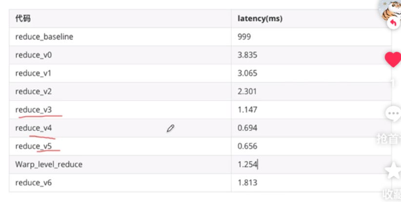


### 2.10 CUDA warp level primitive function

#### 2.10.1 Intra-warp data exchange function

##### Warp Vote Functions

[1. Introduction — CUDA C Programming Guide (nvidia.com)](https://docs.nvidia.com/cuda/cuda-c-programming-guide/index.html#warp-vote-functions)

* `__all_sync`

* `__any_sync`

* `__uni_sync`

* `__ballot_sync`: copy if 算子会用到

  * ```c++
    unsigned __ballot_sync(unsigned mask, int predicate);
    ```

  * 返回一个32位无符号整数

  * predicate为判断条件

  * thread满足该条件返回bit 0，反之返回bit1

  * 所以总体是过滤出了满足predicate条件的线程

##### Warp Reduce Functions

[1. Introduction — CUDA C Programming Guide (nvidia.com)](https://docs.nvidia.com/cuda/cuda-c-programming-guide/index.html#warp-reduce-functions)

* `__shfl_sync`:

  * ```c++
    T __shfl_sync(unsigned mask, T var, int srcLane, int width=warpSize)
    ```

  * 表示被mask指定的线程返回标号为srcLane的线程中的变量var的值，类似将srcLane的线程的值广播到指定线程

* `__shfl_up_sync`

* `__shfl_down_sync`

* `__shfl_xor_sync`

##### Warp Match Functions

https://docs.nvidia.com/cuda/cuda-c-programming-guide/index.html#warp-match-functions

* `__match_any_sync`
* `__match_all_sync`

#### 2.10.2 intra-warp aggregated atomics

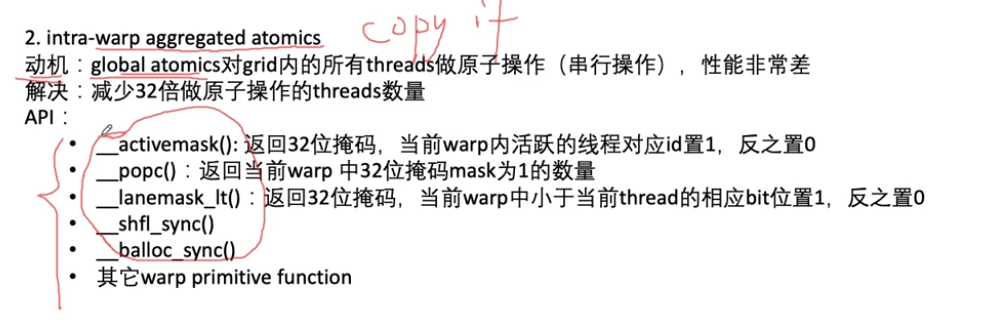

### 2.11 CUDA直方图统计数组内元素出现频次：

给定数组`hist_data`，输出数组`bin_data`,`bin_data`类似桶数组，存储对应数值出现的频次。

#### **代码1：消除竞态条件**

```c++
__global__ void gpu_count1(char *hist_data, u32 *bin_data){
    u32 x = blockDim.x * blockIdx.x + threadIdx.x;
    u32 y = blockDim.y * blockIdx.y + threadIdx.y;
    u32 tid = x + y * blockDim.x * gridDim.x;
    
    bin_data[hist_data[tid]]++;
}
```

以上代码每个线程对`hist_data`访问的时候会冲突。具体来说，当多个线程尝试同时更新同一个位置时，==会出现竞态条件，导致结果不正确。简而言之，这种方法在并行环境下是不安全的。==

总而言之，==并行的访问是没问题的，但是并行的更新同一个位置是有问题的==

- **并行访问**：当多个线程或进程只是读取共享资源，并不进行写操作时，通常是安全的。因为读操作不会改变资源的状态，所以不同的线程或进程读取同一个资源不会导致不一致或不可预测的结果。
- **并行更新**：当多个线程或进程尝试同时写入或更新同一个共享资源时，就可能出现问题。如果这些写操作没有适当地同步，那么最终的结果可能会依赖于这些操作的具体执行顺序，从而导致不可预测的行为。这就是竞态条件。

为了避免并行更新导致的竞态条件，通常需要使用某种同步机制来确保在同一时刻只有一个线程或进程可以更新共享资源。这样可以确保共享资源的状态在并发环境中始终保持一致。

> 竞态条件（Race Condition）是并发编程中的一个概念，指的是当多个线程或进程在没有适当同步的情况下访问某些共享资源时，最终的执行结果依赖于特定的执行顺序或时序，从而导致程序的行为变得不可预测或不正确。
>
> 简单来说，竞态条件发生在以下情况：
>
> 1. 两个或更多的线程或进程读取和写入某些共享数据。
> 2. 最终的结果依赖于这些线程或进程的执行顺序。
>
> 举一个简单的例子来说明竞态条件：
>
> 假设有一个共享变量`x`，其初始值为0。现在有两个线程A和B，它们都尝试增加`x`的值。
>
> 线程A的代码：
>
> ```c++
> x = x + 1;
> ```
>
> 线程B的代码：
>
> ```c++
> x = x + 1;
> ```
>
> 在没有竞态条件的理想情况下，执行完两个线程后，`x`的值应该是2。但由于竞态条件，可能会发生以下情况：
>
> 1. 线程A读取`x`的值（0）。
> 2. 在线程A更新`x`之前，线程B读取`x`的值（仍然是0）。
> 3. 线程A将`x`的值更新为1。
> 4. 线程B也将`x`的值更新为1。
>
> 结果是，尽管两个线程都尝试增加`x`，但`x`的最终值仍然是1，而不是期望的2。
>
> 为了避免竞态条件，通常需要使用同步机制，如互斥锁（mutex）、信号量（semaphore）或其他并发控制工具，确保在任何时候只有一个线程或进程可以访问共享资源。

##### 使用原子操作

`atomicAdd(二级指针，加的数)`

```c++
atomicAdd(&bin_data[hist_data[tid]],1);
```

这个版本使用`atomicAdd`函数确保当多个线程尝试同时更新`bin_data`的同一个位置时，这些更新是原子的，即在任何时候只有一个线程可以更新该位置==(或者说将更新串行化)==。这消除了竞态条件，确保结果的正确性。但是，原子操作可能会导致性能下降，特别是当有大量的线程竞争同一个位置时。

#### 代码2： 使用shared memory（并不能提升原子加法）

令每个线程处理block num个线程

```c++
template<int blockSize>
__global__ void histgram(int *hist_data, int *bin_data, int N){
    __shared__ int cache[256];
    int gtid = blockIdx.x * blockSize + threadIdx.x;
    int tid = threadIdx.x;
    cache[tid] = 0;//需要blockSize配合
    __syncthreads();
    
    // 一个线程干所有block的活
    for(int i = gtid; i< N; i+=gridDim.x * blockSize){
        int val = hist_data[i]; // 每个单线程计算全局内存中的若干个值
        //在shared memory上面原子操作
        atomicAdd(&cache[val],1);
    }
    __syncthreads();// 每个block的bin都已经统计在了cache中
    atomicAdd(&bin_data[tid],cache[tid]);
}
```

==在这里性能是反而下降了的，因为13行这一个代码，在使用了sharedMemory之后，会发生很多bank conflict，直接拉低了sharedMemory的性能==


