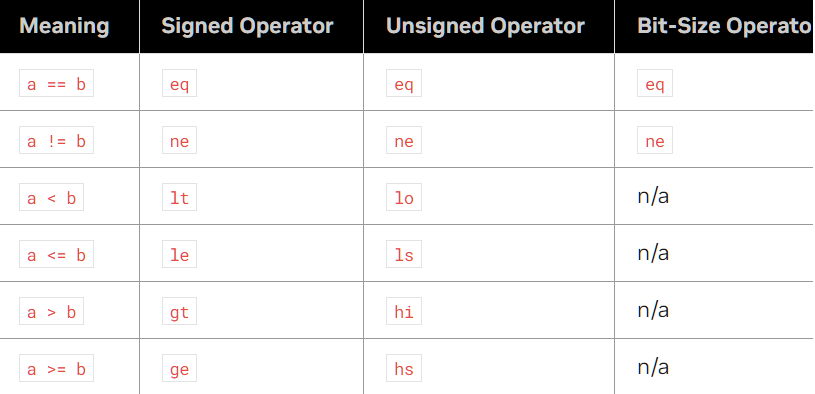
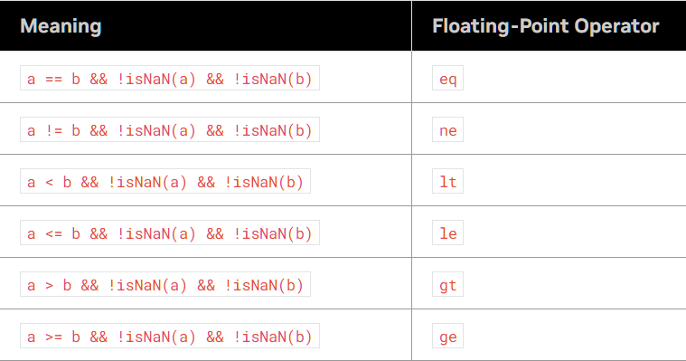
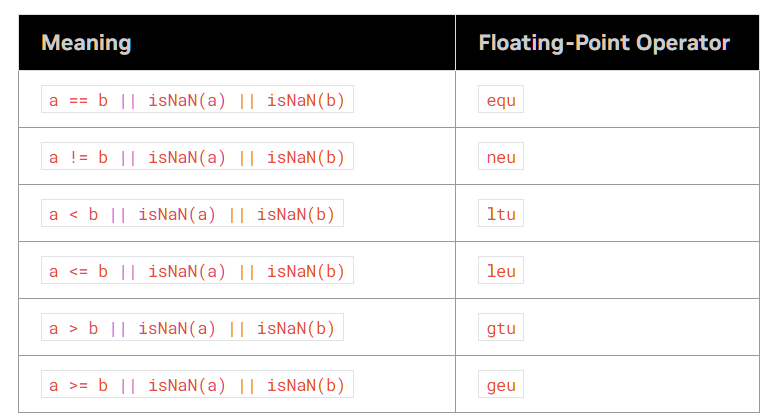
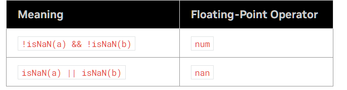

本笔记来自parallel-thread-execution的第九章,目前仅仅看到了9.3

> https://docs.nvidia.com/cuda/parallel-thread-execution/index.html#format-and-semantics-of-instruction-descriptions

PTX 是 NVIDIA GPU CUDA 编程中使用的伪汇编语言。它提供了一个低级但独立于硬件的接口。不像传统汇编依赖于CPU硬件架构，PTX 在 NVIDIA GPU 生态系统中与硬件无关。这意味着它可以在不同世代的 NVIDIA GPU 上运行。它抽象了特定的硬件细节，PTX 代码不由 GPU 直接执行。相反，它由 NVIDIA 驱动程序或针对机器上特定 GPU 的 CUDA 编译器 （ `nvcc` ） 编译为二进制机器代码。

PTX 指令旨在最大限度地提高并行执行，并且在某些方面类似于 CPU 中的 SIMD（单指令、多数据）操作。它包括用于管理 GPU 线程、内存和同步的特定说明。


## 0. asm与寄存器


```c++
asm("PTX code" : "output operands" : "input operands" : "clobbered registers");
```

%0, %1, %2

```c++
__global__ void addKernel(int *c, const int *a, const int *b, int n) {
    int idx = threadIdx.x + blockIdx.x * blockDim.x;
    if (idx < n) {
        // Inline assembly to add two numbers
        asm("add.s32 %0, %1, %2;" : "=r"(c[idx]) : "r"(a[idx]), "r"(b[idx]));
    }
}


__global__ void exampleKernel() {
    // Suppose we need to pass a configuration value to an opcode that doesn't produce output
    int config_value = 123;
    asm("some_opcode %0;" : : "r"(config_value));
}

```


| Keyword | Type                                    | Usage Context                             |
| ------- | --------------------------------------- | ----------------------------------------- |
| `r`     | integer/ pointer                        | 适用于任何不特别要求float-point计算的场景 |
| `f`     | float-point(32 bit)                     | 执行需要浮点精度的算术                    |
| `d`     | double-precision floating-point(64 bit) | 需要更高精度的浮点运算                    |
| `l`     | long integer(64 bit)                    | 适用于涉及大于标准32位整数的数据类型      |
| `h`     | half-precision floating-point(16 bit)   | half，常用于机器学习                      |
| `p`     | boolean value                           | 就是predicate register，一般用作分支决策  |

有类似%rN的写法，


## 1.PTX 指令的形式

### 1.1 `opcode` & `@p`

考虑任意一个操作`opcode`，它一般需要0-5个运算对象

`opcode;`

`opcode a;`

`opcode d, a;`

`opcode d, a, b;`

`opcode d, a, b, c;`

这些情况下都能使用一个额外的**可选保护谓词**(optional guard predicate)，一般用@p来表示, 这个词的作用是添加一个条件分支。

`@p opcode d, a, b, c;`

通常来说，如果你的`opcode`计算出了==一个==新的结果，那么d是目标操作数，而其他(a,b,c)是源操作数。

```c++
setp.gt.f32 p1, a, b;  // Set predicate p1 if a > b
@p1 add.f32 c, d, e;   // Perform c = d + e if p1 is true
```


### 1.2 组合谓词 `|`,位桶 `_`

考虑`setp.lt.s32 p, a, b`，它计算`p = (a < b)`

组合谓词能够使用一个语句获得p与!p，在一些情况下能增加代码可读性。

```c++
setp.lt.s32 p|q, a, b; // p = (a < b), q = !(a < b);
```

实际上，一般的复杂情况下，通常是如下写法，所以组合谓词并不是必须的。

```c++
.reg .s32 a;         // Register to store the integer
.reg .pred p, q, r;  // Predicate registers

// Load `a` with a value
...

// Set predicates based on the value of `a`
setp.lt.s32 p, a, 10;    // p = true if a < 10
setp.le.s32 q, a, 20;    // q = true if a <= 20
setp.gt.s32 r, a, 20;    // r = true if a > 20

// Execute different blocks based on the predicates
@p   call Label1;        // Call function Label1 if p is true (a < 10)
@q @!p call Label2;      // Call function Label2 if q is true and p is false (10 <= a <= 20)
@r   call Label3;        // Call function Label3 if r is true (a > 20)

```


`_`是代表这次计算我们可能不需要它的目标值，因此可以使用`_`(bit bucket)来向编译器表示我们不需要这个值，你不需要为我担心寄存器，数据传递等方面，能够显著增加性能。

什么时候会不需要计算值呢？例如压力测试的时候，我们只是想知道是否发生了计算，而非计算是否正确。

```c++
setp.lt.s32 _, a, b;// p = (a < b)
```

使用丢弃输出的位桶 （ `_` ） 对于旨在通过标志设置影响软件中的控制流和决策的操作特别有用。这种技术优化了计算过程，特别是在性能和效率至关重要的嵌入式系统或应用程序中。它简化了代码路径，并确保只需要影响标志的操作不会占用额外的资源。


### 1.3 再探Predicate Register

#### 1.3.1 谓词寄存器基础

> 在 PTX 中，谓词寄存器用于存储布尔值（true 或 false）。这些主要是通过 `setp` 指令使用比较操作来设置的。

在 PTX 中，谓词寄存器用于保存作为比较结果的布尔值。这些寄存器声明 `.pred` 为类型说明符，指示它们存储谓词 （true/false） 值。例如，可以按如下方式声明谓词寄存器：

```c++
.reg .pred p, q, r;
```

这些是由 PTX 汇编器和 NVIDIA 的驱动程序/编译器管理的“虚拟”寄存器。

PTX 指令可以基于谓词寄存器的值有条件地执行。这是使用 `@p` 语法指定的，其中 `p` 是谓词寄存器。如果 `p` 为 true，则执行指令;如果 `p` 为 false，则跳过该指令。

基于此道理，你也可以使用`@!p`来完成相反判断下的branch。

```c++
/*
if (i < n)
    j = j + 1;
*/
setp.lt.s32  p, i, n;    // p = (i < n)
@p    add.s32      j, j, 1;    // if i < n, add 1 to j


```

考虑如下例子，第二行的意思是如果i >= n，那么跳到L1（这里的bra是branch instruction，即为分支指令）， 也就是说如果i>=n，就会跳过第三行的增量操作。

```c++
setp.lt.s32  p, i, n;    // compare i to n
@!p   bra  L1;                 // if False, branch over
add.s32      j, j, 1;
L1:     ...

```


#### 1.3.2 Operations on Predictions

对谓词的运算： `and` `or`  `xor` `not` 和 `mov` 等运算是可以操作谓词的逻辑运算


## 2. 比较指令

### 2.1 有符号整数

`eq` (equal), `ne` (not-equal), `lt` (less-than), `le` (less-than-or-equal), `gt` (greater-than), and `ge` (greater-than-or-equal). The unsigned comparisons are `eq`, `ne`, `lo` (lower), `ls` (lower-or-same), `hi` (higher), and `hs` (higher-or-same).

其中eq和ne是bit-size comparison. 



### 2.2 Float



为了帮助在存在NaN值的情况下进行比较操作，提供了无序浮点比较:equ、new、ltu、leu、gtu和geu。如果两个操作数都是数值(不是NaN)，那么比较的结果与有序的比较结果相同。如果其中一个操作数为NaN，则比较结果为True。



为了测试NaN值，提供了两个操作符`num` (numeric)和`nan` (isNaN)。如果两个操作数都是数值(不是NaN)， num返回True，如果两个操作数都是NaN, NaN返回True。表22列出了测试NaN值的浮点比较操作符。



