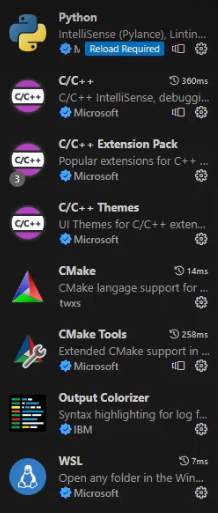

# 1. 准备工作

* 下一个CMake，(.msi，选中加入Path)

* VScode使用八个插件

  


# 2. 为什么需要CMake

## 2.1 C++编译四君子

将C++源文件转换成可执行文件的过程涉及四个步骤：**预处理，编译，汇编，链接**

### 2.1.1 预处理

==预处理==根据#开头的行处理源代码文件，包括

* **宏替换（Macro Replacement）**

  - **定义宏**：使用`#define`指令定义宏。宏可以是文本替换（例如，`#define PI 3.14159`），也可以是带有参数的宏函数（例如，`#define SQUARE(x) ((x)*(x))`）。
  - **条件编译**：`#ifdef`、`#ifndef`、`#endif`等指令根据宏的定义来决定是否编译特定部分的代码，这对于跨平台开发或启用/禁用特定功能非常有用。

*  **文件包含（File Inclusion）**

  - **头文件包含**：`#include`指令用于包含其他文件的内容。这通常用于包含头文件，它们可能包含函数声明、宏定义、模板定义等。例如，`#include <iostream>`或`#include "myheader.h"`。

  - 预处理器的`#include`指令用于文字地包含另一个文件的内容到当前文件中。这主要用于引入头文件（`.h`或`.hpp`），这些头文件通常包含函数声明、宏定义、模板定义、类型定义等。==当预处理器遇到`#include`指令时，它会将指定的文件内容直接插入到当前文件的`#include`位置。==

    > 链接（Linking）阶段发生在编译后，它的任务是将多个编译后的目标文件（`.o`或`.obj`）以及所需的库文件组合成一个单一的可执行文件或库文件。在这个过程中，链接器解决了程序中不同部分之间的相互引用，比如函数调用和全局变量的引用。

* **条件编译（Conditional Compilation）**

  - **条件指令**：`#if`、`#elif`、`#else`、`#endif`等指令根据编译时的条件来选择性地编译代码段。这允许源代码根据不同的编译条件（如宏定义）进行自定义。

* **预定义宏（Predefined Macros）**

  - **系统定义**：预处理器提供了一系列预定义的宏，如`__LINE__`（表示当前行号）、`__FILE__`（表示当前文件名）、`__DATE__`（表示编译日期）、`__TIME__`（表示编译时间）等。这些宏可以用于调试、日志记录或其他目的。

*  **行指令（Line Directive）**

  - **修改行号和文件名**：`#line`指令用于改变预处理器的当前行号和认为的当前文件名。这主要用于调试，尤其是在代码通过复杂的宏替换或文件包含路径被处理之后。

* **错误指令（Error Directive）**

  - **生成编译错误**：`#error`指令允许在遇到特定条件时产生编译错误，这对于在代码尝试使用不兼容或未实现的特性时强制编译失败非常有用。

预处理后的源代码通常不直接可见，直接作为编译步骤输入。

### 2.1.2 编译

==编译==将**预处理的源代码转换为汇编语言。**包括语法分析，语义分析，编译器优化等，它检查代码是否符合C++语法规则，确定每个元素的类型，执行循环展开，函数内联等优化。


需要注意编译的内部实现

```c++
#include<iostream>

int add(int a, int b);

int main()
{
    int c = add(1,2);
    return 0;
}
```

这个例子是可以被编译的，因为它拥有add的声明，即使是没有实现，也是符合编译规则的。

这也就是在一般实现中，#include一个自己的库，**预处理时**它会将.h的这些声明直接复制到对应的.cpp文件中，编译器并不会去探究是否存在实现(.cpp)，只要存在声明，那么你就是可以调用的。

因此，这个例子实际上偷懒，你也可以写成`int add()`被声明在一个.h头文件中，反正都一样，预处理完成后头文件就没用了，或者说头文件本身就是为了代码可读性更高才被设计出来的。


### 2.1.3 汇编

==汇编==：**将汇编语言文件转换为机器语言**。生成目标文件"Objective file"，也就是.obj,每个目标文件通常对应于源代码中的一个文件，包含了可执行的机器代码，**但是还不能独立运行。**因为它可能依赖其他文件中的代码或者系统库。

汇编将剩余的.cpp文件转换成.o的可执行文件，一般包括`main.o, function1.o, function2.o`


### 2.1.4 链接

==链接==: 链接器将所有的目标文件(.o,.obj)与所需的库文件(.dll in windows)合并成为一个可执行文件(.exe)，在这个过程中，链接器解决了文件之间的引用和依赖，**例如函数调用或者全局变量的使用**，如果有未解决的外部引用，就会发生链接错误。

```c++
#include<iostream>

int add(int a, int b);

int main()
{
    int c = add(1,2);
    return 0;
}
```

同样是这个例子，在编译时，承诺了会有一个add的函数，结果没找到，那么就会报错链接错误。

> **对于一个[main.cpp,A.h,A.cpp]的项目,链接器如何在`main.o`中确定去`A.o`中找**
>
> 1. **符号表**：当编译器处理`A.cpp`和`main.cpp`生成`A.o`和`main.o`时，它们各自的目标文件中会包含一个符号表（symbol table）。这个符号表列出了所有在该编译单元（目标文件）中定义的符号（如函数、全局变量等）和所有未解析的外部符号（即那些声明了但未在此编译单元中定义的符号）。
>
> 2. **未解析的外部符号**：在`main.cpp`中，如果你调用了`A.h`中声明的函数，但该函数的实现在`A.cpp`中，那么在编译`main.cpp`生成`main.o`时，这个函数调用会被标记为一个未解析的外部符号。
>
> 3. **符号解析**：在链接阶段，链接器的任务是查找这些未解析的外部符号的定义。==链接器会检查所有提供给它的目标文件的符号表，以找到这些未解析符号的定义==。当链接器在`A.o`的符号表中找到了`main.o`中未解析符号的定义时，它就能将这些符号“链接”起来，满足程序的依赖。
>
>    
>
>    **为什么`A.cpp`一定要`#include "A.h"`**
>
> 其实不一定需要。
>
> 换句话说，你可以没有.h头文件，直接在main.cpp中声明，然后在A.cpp中实现也是可以的。但是这样你每次需要用这个函数，都需要在那个.cpp中声明，还不如#include headfile


## 2.2 CMake与编译四君子

CMake并不直接参与编译过程中的预处理、编译、汇编和链接步骤，而是在这一过程之前提供了==必要的配置来指导这些步骤如何进行==。下面是CMake与编译过程四个步骤的关系概述：


CMake是一个跨平台的自动化构建系统，它使用CMakeLists.txt文件（或一系列这样的文件）来描述项目的构建过程，包括源文件、目标（可执行文件和库）、依赖关系、编译选项等。然后，CMake生成适合特定平台和构建环境的本地构建系统配置文件（如Unix的Makefiles、Windows的Visual Studio项目文件等）。因此，CMake并不直接参与编译过程中的预处理、编译、汇编和链接步骤，而是在这一过程之前提供了必要的配置来指导这些步骤如何进行。下面是CMake与编译过程四个步骤的关系概述：

### 1. **预处理（Preprocessing）**

- **CMake作用**：CMake可以设置预处理器定义（通过`add_definitions`或`target_compile_definitions`），以及包含目录（通过`include_directories`或`target_include_directories`），从而影响预处理步骤。

### 2. **编译（Compilation）**

- **CMake作用**：CMake通过指定编译器和编译选项（使用`set`命令设置`CMAKE_CXX_FLAGS`或通过`target_compile_options`）来影响源代码的编译。它还管理不同编译单元之间的依赖关系，确保在编译前所有需要的文件都被正确预处理和准备好。

### 3. **汇编（Assembly）**

- **CMake作用**：CMake通常不直接影响汇编步骤，因为一旦源代码被编译成汇编语言，接下来的汇编过程主要是由编译器和汇编器处理。然而，CMake确保编译器知道如何找到汇编器以及如何调用它。

### 4. **链接（Linking）**

- **CMake作用**：CMake在这一步骤中起到了至关重要的作用。它描述了如何将编译后的目标文件链接成最终的可执行文件或库。CMake配置文件中可以使用`add_executable`、`add_library`和`target_link_libraries`命令来指定需要链接的目标文件和库。


# 3. 最简CMake（不依赖第三方库）

无非做到一点

* 帮助.cpp打包其本身与需要用到的函数实现: add_executable

其余都是辅助

`add_subdirectory`:调用子文件夹的CMakeLists

`include_directories`:帮助拓宽该文件夹的编译器视野，使得能够#include别的文件夹文件

## 3.1 基础设置

考虑一个文件夹内只有

> 
>
> 一级子文件夹
>
>  * A.cpp
>
> 	* main.cpp
> 	* A.h
> 	* CMakeLists
>
> 文件夹B
>
> * main.cpp
> * CMakelists
>
> CMakeLists.txt

## 3.2 根目录CMakeLists

首先，我们要明确，我们需要什么（我会将对应的CMake固有变量放出来）

(1) 项目名(PROJECT_NAME)：用于生成输出文件（可执行文件和库文件）的默认名称

(2) CMake只能读取当前文件夹中的文件，但是不知道文件夹下的具体内容。可能CMake在的目录没有要处理的东西，因此需要找下级（上级也可能,`..`)目录，调用其CMake来处理

```cmake
cmake_minimum_required(VERSION 3.15)
# (1)
project(cmake_study)

# (2)
add_subdirectory(一级子文件夹名)
add_subdirectory(文件夹B)
```


## 3.3 所需文件在一个文件夹内

在一级子文件夹中

```cmake
# 考虑当前目录下的cpp文件加工成可执行文件
add_executable(name main.cpp A.cpp)
```

```Cmake
# 如果 A.cpp在一级子文件夹kernel内
add_executable(name main.cpp kernel/A.cpp)
```

> ==在VScode中可以点击最下栏的[ALL_build]来选择build哪一个add_executable==


如果找不到就搜cmake configuration


## 3.4 所需文件在另一个文件夹内-include_directories

如果在文件夹B中的main.cpp中，我们需要A.cpp，同时注意，这个文件夹下的main函数如果include A.h，其实是找不到的，也就是说我们在include中需要写`#include "../一级子文件夹/A.h"`

```cmake
add_executable(name main.cpp ../一级子文件夹/A.cpp)
```

当然，考虑这么#include十分麻烦，因为很容易A.h改个位置就全要手动改，==因此Cmake允许你为这个子文件夹的索引范围（本来只能索引到这个文件夹内）拓宽==

```cmake
include_directories(../一级子文件夹)
add_executable(name main.cpp ../一级子文件夹/A.cpp)
```

此时就可以直接`#include "../一级子文件夹/A.h"`

==注意，include_directories只是为了指定编译器查找头文件的目录，当你使用add_executable时，应该需要提供源文件的相对路径或者绝对路径==


# 4. 静态库与动态库（旧）

将文件编译成库而非executable

为什么会需要使用库

* 库能让我们不会每次都重新编译这些method
* 库能让我们每次调用时不用一个个输入那么多源文件
* 库能保证我们的源码不被直接看到


出现的新函数：

```cmake
# 链接库
# 写法1，不推荐，因为必须绝对路径，否则找不到
link_libraries(绝对路径/lib/add_static.lib)
# 写法2，同样不推荐
link_directories(绝对路径/lib)
add_executable(libexample main.cpp)
target_link_libraries(libexample add_static.lib)
# 或者
add_executable(libexample main.cpp)
target_link_libraries(libexample 绝对路径/add_static.lib)

# 生成库
add_library(Add add.cpp)

# 添加宏定义
target_compile_definitions(add_shared PRIVATE EXPORT)
```


## 4.1 什么是静态库，动态库

==简单来说，静态库就是编译时，像之前那样直接将库压入我们的可执行文件。动态库就是只有运行的时候，可执行文件才会动态的链接库。==

静态库（Static Libraries）和动态库（Dynamic Libraries）是两种常见的代码库，它们提供了一种将代码模块化和重用的方法。它们的主要区别在于链接到应用程序的方式和时间点。

### 静态库（Static Libraries）

- **定义**：静态库是一种包含了多个目标文件的单个文件，这些目标文件在编译时被整合（或“静态链接”）到最终的可执行文件中。
- **扩展名**：在Unix-like系统上，静态库文件通常有`.a`（archive）扩展名；在Windows上，则通常是`.lib`。
- 特点
  - 当静态库被链接到一个应用程序时，需要的代码被==复制到最终的可执行文件中==。
  - 最终的可执行文件会更大，因为它包含了库中的代码。
  - 应用程序不需要在运行时加载静态库，因为所有功能都已经内嵌在可执行文件中。
  - 应用程序与库的依赖关系在编译时确定，不需要在运行时解析。

### 动态库（Dynamic Libraries）

- **定义**：动态库是包含可被多个程序共享的代码和数据的文件。不同的程序在运行时可以加载同一个动态库的单个副本。
- **扩展名**：在Unix-like系统上，动态库的扩展名通常是`.so`（shared object）；在Windows上，则是`.dll`（dynamic-link library）。
- 特点
  - ==应用程序在运行时从动态库中加载需要的代码和数据==，这使得最终的可执行文件更小。
  - 更新或替换动态库不需要重新编译依赖它的应用程序，只要接口保持不变。
  - 同一时间，操作系统只需在内存中保留库的一个副本，即使有多个程序同时使用它，也可以节省内存。
  - 动态链接在应用程序启动或执行期间进行，需要时间解析库中的符号，可能会稍微影响启动时间或运行性能。


## 4.2 一个例子-静态库

考虑这么一个文件结构

根目录下

> DirectoryA(文件夹)
>
> * add(文件夹)
>   * add.h
>   * add.cpp
>   * CMakeLists.txt
> * main.cpp
> * CMakeLists.txt
>
> CMakeLists.txt

考虑我们希望打包add为一个**静态库**给main.cpp调用

**根目录CMakeLists.txt**

```cmake
cmake_minimum_required(VERSION 3.15)
project(lib_example)

add_subdirectory(DirectoryA)
```

**DirectoryA CMakeLists.txt**

```cmake
add_subdirectory(add)
```

**add CMakeLists.txt**

```cmake
add_library(Add add.cpp)# 这会自动生成一个命名为Add_static.lib
```

> 对于使用CMake的项目，如果没有特别配置输出路径，CMake通常会将静态库放在构建目录（即执行`cmake`命令时所在的目录）的一个子目录中。这个子目录的具体位置可能会根据平台和CMake版本稍有不同，常见的有：
>
> - 在Linux或其他Unix-like系统上，通常是`build_directory/lib`。
> - 在Windows上，构建类型（如Debug或Release）会影响输出路径，通常是`build_directory/Debug`、`build_directory/Release`等。
>
> 在大多数情况下，你可以（也应该）在你的构建脚本或项目文件中明确指定静态库的输出路径，以便更好地管理你的项目输出。例如：
>
> - **CMake中**：使用`set(LIBRARY_OUTPUT_PATH ${PROJECT_BINARY_DIR}/lib)`或`target`相关命令如`set_target_properties`来指定特定目标的输出路径。

我们先手动将根目录的lib存入DirectoryA中

根目录下

> DirectoryA(文件夹)
>
> * add(文件夹)
>   * add.h
>   * add.cpp
>   * CMakeLists.txt
> * main.cpp
> * CMakeLists.txt
> * lib(文件夹)
>   * add_static.lib
>   * add.h
>
> CMakeLists.txt

这个add.h是我们手动给他加上的，为的就是能够给IDE提供代码补全（API）。事实上，没有这个.h也不会影响你的方法在lib中被找到，但是IDE并不会为你判断这个接口是否已经被定义过，如果你将.h也一并提供过来的话就好很多了。

此时DirectoryA CMakeLists.txt

```cmake
add_subdirectory(add)
# 添加索引
include_directories(./lib)

# 有好几种写法
# 写法1，不推荐，因为必须绝对路径，否则找不到
link_libraries(绝对路径/lib/add_static.lib)
# 写法2，同样不推荐
link_directories(绝对路径/lib)
add_executable(libexample main.cpp)
target_link_libraries(libexample add_static.lib)
# 或者
add_executable(libexample main.cpp)
target_link_libraries(libexample 绝对路径/add_static.lib)
```

在链接库时，需要绝对路径是因为，可能会需要链接外部库，因此使用相对路径很容易混淆

这里使用了一个target函数，它需求一个executable name，为这个executable link

而link_libraries实际上是为后续定义的所有可执行文件link

> ### `link_libraries`
>
> - **全局链接**：`link_libraries`指令用于为后续定义的所有目标（可执行文件和库）设置要链接的库。它是一个全局设置，会影响在这条命令之后定义的所有目标。这意味着，如果你在项目的CMakeLists.txt文件中使用了`link_libraries`，它会应用于该文件中之后定义的所有目标。
> - **使用场景**：由于`link_libraries`的全局性质，它可能在一些简单的项目或者在项目初期的快速原型开发阶段比较有用。然而，在复杂的项目中，它可能导致依赖管理混乱，因为它缺乏针对特定目标的精细控制。
>
> ### `target_link_libraries`
>
> - **目标特定链接**：`target_link_libraries`指令用于为特定的目标（可执行文件或库）指定要链接的库。它允许你对每个目标的链接依赖进行精确控制，包括链接公共（public）、接口（interface）和私有（private）库等不同类型的依赖。
> - **使用场景**：`target_link_libraries`是处理复杂项目中目标链接依赖的推荐方法。它提供了更好的封装和模块化支持，使得项目的维护和扩展更加容易。


## 4.3 一个例子：动态库

考虑这么一个文件结构

根目录下

> DirectoryA
>
> * add(文件夹)
>   * add.cpp
>   * add.h
>   * CMakeLists.txt
>   * export.h
> * CMakeLists.txt
> * main.cpp
> * lib
>   * add_shared.dll(由add_library生成，其实不应该放到这)
>   * add_shared.lib
>   * add.h
>
> CMakeLists.txt

具体内容如下

```c++
// add.h
#pragma once
#include "export.h"
__declspec(dllimport) int add(int a, int b);
//注意这里是import，推荐写，因为有一些情况是必须写的，例如这是一个含有静态变量的类

// export.h
#pragma once
#ifdef EXPORT
#define CMAKE_STUDY_API __declspec(dllexport)
#else
#define CMAKE_STUDY_API __declspec(dllimport)
#endif

// add.cpp
//里面所有的函数都应使用这个宏
#include <iostream>
#include"export.h"
#include"add.h"

CMAKE_STUDY_API int add(int a,int b){
    return a+b;
}
```


根目录CMakeLists.txt

```cmake
cmake_minimum_required(VERSION 3.15)
project(cmake_study)
add_subdirectory(DirectoryA)
```

DirectoryA CMake

```cmake
add_subdirectory(add)
```

add CMake

```cmake
# 生成动态库.dll
add_library(add_shared SHARED add.cpp)
```


然后使用这个动态库

```cmake
# DirectoryA Cmake
add_subdirectory(add)
include_directories(./lib)

add_executable(dynamicLibrary main.cpp)
# target_link_libraries(dynamicLibrary 绝对路径/lib/add_shared.dll)
target_link_libraries(dynamicLibrary 绝对路径/lib/add_shared.lib)
```


那些宏定义就是windows和linux有出入的一些点。

* 对于windows且还是MSVC编译器，想生成一个动态库，不仅仅是像静态库一样写，==它要求你所有需要导出的（被调用的）函数都要有一个关键字`__declspec(dllexport)`==。考虑到我们编译时与头文件没有任何关系，这个关键字其实只需要在cpp里面加。

  这个关键字意味着这个函数是需要被导出的函数

* 同时，windows MSVC实际上如果是shared add_library，==它会同时生成.lib与.dll==，并且这个.lib必须时你的函数有`__declspec(dllexport)`关键字时才会生成。

* ==它在编译可执行文件时需要的是.lib而不是.dll==。在windows MSVC中，dll虽然是真正的动态库，但是MSVC会将你需要导出的函数写到lib，然后这个静态库再链接动态库。

  其实这个也很好理解，动态库并不是编译时需要的，而是运行时需要（临时加载到内存的），而编译时需要的是.lib，这里包含了动态库编译时所有需要的内容。

* ==dll需要放到可执行文件同一目录==，或者将其所在路径写到系统环境变量中


然后我们需要激活这个dllexport，也就是我们需要设置EXPORT标识，有以下几种方法

* 在add.cpp文件中直接设置

  ```cpp
  #include <iostream>
  # define EXPORT//这里添加EXPORT，在预处理展开后会直接满足export.h中的条件，这种写法是笃定这个.cpp就是写入动态库
  #include"export.h"
  #include"add.h"
  ```

* 在Cmake中设置

  ```cmake
  # add文件夹中的CMakeLists
  add_library(add_shared SHARED add.cpp)
  target_compile_definitions(add_shared PRIVATE EXPORT)
  ```

  这个指令指的是“添加编译器宏定义”，相当于在命令行中直接加上了-DEXPORT，也算是设置了EXPORT了

  ==需要注意的是，这个里面因为是在add文件夹下的CMakeLists，因此只是对add文件夹下的区间添加了这么一个宏定义，如果export.h放到lib里面了，那么实际上是看不到这个EXPORT的==


# 5.CMake的跨平台


