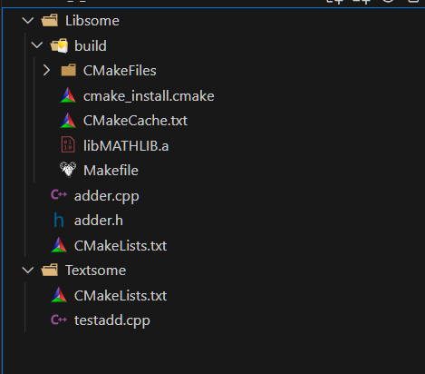
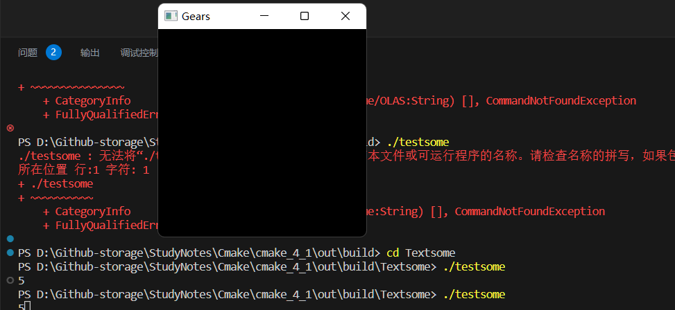

最基础的，cmake是什么，实际上cmake就是帮你生成makefile的一个抽象层

## 写在之前：CMake究竟在干什么

一个程序从C到机器码经历了四大步骤：**预处理，编译，汇编，链接**

我们以一个简单的项目为例子说明：

```css
MyProject/
├── CMakeLists.txt
├── include/
│   └── mylib.h
├── src/
│   ├── mylib.cpp
│   └── main.cpp

```

```cmake
cmake_minimum_required(VERSION 2.8)
project(MyProject)

# 指定头文件目录
include_directories(${CMAKE_SOURCE_DIR}/include)

# 添加静态库和动态库
add_library(MyStaticLib STATIC src/mylib.cpp)
add_library(MySharedLib SHARED src/mylib.cpp)

# 添加可执行文件并链接库
add_executable(MyApp src/main.cpp)
target_link_libraries(MyApp MyStaticLib MySharedLib)

# 安装库和头文件
install(TARGETS MyStaticLib MySharedLib MyApp
        RUNTIME DESTINATION bin
        LIBRARY DESTINATION lib
        ARCHIVE DESTINATION lib)
install(DIRECTORY include/ DESTINATION include)

```


* 预处理`main.cpp`

  * 编译器首先预处理`main.cpp`文件，预处理阶段会处理所有的`#include`指令，将头文件内容插入到`main.cpp`

  * 这就要求我们为编译器指明这些头文件在哪里，因为头文件不和这个root根目录在同一层

    ```cmake
    # 指定头文件目录
    include_directories(${CMAKE_SOURCE_DIR}/include)
    ```

* 编译`main.cpp`

  * 预处理后的`main.cpp`文件会被编译成目标文件`main.o`
  * 这一步将所有的C++代码转换为机器代码，但不会链接

* 编译`mylib.cpp`

  * 同样的，编译器会预处理`mylib.cpp`，它会被插入`mylib.h`的实现
  * 这里仅讨论了在根目录使用CMakeLists的情况，此时这个CMakeLists已经拥有头文件的视野，因此它也能指挥mylib.cpp的预处理
  * `mylib.cpp`被编译为`mylib.o`

* 生成库文件

  * 编译器将`mylib.o`打包成静态库(``libMyStatic.a`)和动态库(`libMySharedLib.so`)

* 链接阶段

  * 编译器将`main.o`和静态库动态库链接，生成可执行文件`MyApp`
  * **链接阶段，编译器会检查main.o中调用的所有函数在库中是否有实现**


当缕清了上面的关系之后，我们就可以发现，cmake就是在做这几件事

* 告诉根目录的CMakeLists该去哪里找头文件
* 告诉CMakeLists打包库
* 告诉CMakeLists去链接库
* CMakeLists知道了所有的信息之后，组织生成可执行文件


进阶版就是考虑不仅仅使用一个根目录的CMakeLists，而是对每个子文件夹使用CMakeLists来管理，根目录CMakeLists只需要跟这些小头目交流即可，这样增加了项目的灵活性，也引入了很多作用范围上需要注意的点，这些都会在下面的笔记中展示。


## 1. How to build

首先，假设我们已经完成CMakeLists的编写，一些基本的操作需要被注意。


从如下可以发现，cmake提供了若干选项的重载，我推荐的是第三个，它能让你更清晰的认识到cmake的构建，

* 前者-S代表项目构建的根目录，通常就是你项目结构中==最上层的CMakeLists所在的文件夹==
* 后者-B代表项目build的目标目录

很多人在根目录使用

```bash
mkdir build
cd build
cmake ..
```

这实际上就是第二个重载命令


为了更清晰的表示，我们选择另一个方式 在这个方式中问们首先创建了一个多级的文件夹（因此使用-p），然后进入这个文件夹中，我们的source就在上两级CMakeLists所在地，我们的path-to-build就在当前文件夹

```bash
mkdir -p out/build/
cd out/build/
cmake -S ../../ -B . -G "MinGW Makefiles" -DCMAKE_C_COMPILER=gcc -DCMAKE_CXX_COMPILER=g++
```


注意，这里可以添加-G来指定Generators，我们使用MinGW，如果不知道有哪些Generators直接写-G,它会列出本机所有可以使用的Generator

```bash
PS D:\Github-storage\StudyNotes\Cmake\cmake_4\out\build> cmake -S ../../ -B . -G "MinGW" -DCMAKE_C_COMPILER=gcc -DCMAKE_CXX_COMPILER=g++         
CMake Error: Could not create named generator MinGW

Generators
* Visual Studio 17 2022        = Generates Visual Studio 2022 project files.
                                 Use -A option to specify architecture.
  Visual Studio 16 2019        = Generates Visual Studio 2019 project files.
                                 Use -A option to specify architecture.
  Visual Studio 15 2017 [arch] = Generates Visual Studio 2017 project files.
                                 Optional [arch] can be "Win64" or "ARM".
  Visual Studio 14 2015 [arch] = Generates Visual Studio 2015 project files.
                                 Optional [arch] can be "Win64" or "ARM".
  Visual Studio 12 2013 [arch] = Generates Visual Studio 2013 project files.
                                 Optional [arch] can be "Win64" or "ARM".
  Visual Studio 11 2012 [arch] = Deprecated.  Generates Visual Studio 2012
                                 project files.  Optional [arch] can be
                                 "Win64" or "ARM".
  Visual Studio 9 2008 [arch]  = Generates Visual Studio 2008 project files.
                                 Optional [arch] can be "Win64" or "IA64".
  Borland Makefiles            = Generates Borland makefiles.
  NMake Makefiles              = Generates NMake makefiles.
  NMake Makefiles JOM          = Generates JOM makefiles.
  MSYS Makefiles               = Generates MSYS makefiles.
  MinGW Makefiles              = Generates a make file for use with
                                 mingw32-make.
  Green Hills MULTI            = Generates Green Hills MULTI files
                                 (experimental, work-in-progress).
  Unix Makefiles               = Generates standard UNIX makefiles.
  Ninja                        = Generates build.ninja files.
  Ninja Multi-Config           = Generates build-<Config>.ninja files.
  Watcom WMake                 = Generates Watcom WMake makefiles.
  CodeBlocks - MinGW Makefiles = Generates CodeBlocks project files.
  CodeBlocks - NMake Makefiles = Generates CodeBlocks project files.
  CodeBlocks - NMake Makefiles JOM
                               = Generates CodeBlocks project files.
  CodeBlocks - Ninja           = Generates CodeBlocks project files.
  CodeBlocks - Unix Makefiles  = Generates CodeBlocks project files.
  CodeLite - MinGW Makefiles   = Generates CodeLite project files.
  CodeLite - NMake Makefiles   = Generates CodeLite project files.
  CodeLite - Ninja             = Generates CodeLite project files.
  CodeLite - Unix Makefiles    = Generates CodeLite project files.
  Eclipse CDT4 - NMake Makefiles
                               = Generates Eclipse CDT 4.0 project files.
  Eclipse CDT4 - MinGW Makefiles
                               = Generates Eclipse CDT 4.0 project files.
  Eclipse CDT4 - Ninja         = Generates Eclipse CDT 4.0 project files.
  Eclipse CDT4 - Unix Makefiles= Generates Eclipse CDT 4.0 project files.
  Kate - MinGW Makefiles       = Generates Kate project files.
  Kate - NMake Makefiles       = Generates Kate project files.
  Kate - Ninja                 = Generates Kate project files.
  Kate - Unix Makefiles        = Generates Kate project files.
  Sublime Text 2 - MinGW Makefiles
                               = Generates Sublime Text 2 project files.
  Sublime Text 2 - NMake Makefiles
                               = Generates Sublime Text 2 project files.
  Sublime Text 2 - Ninja       = Generates Sublime Text 2 project files.
  Sublime Text 2 - Unix Makefiles
                               = Generates Sublime Text 2 project files.
```


可以发现，它已经为你在当前文件夹下自动生成了Makefile


你也可以在根目录下使用

`cmake -S . -B out/build -G "MinGW Makefiles" -DCMAKE_C_COMPILER=gcc -DCMAKE_CXX_COMPILER=g++`

这些都是合规的


## 2. 生成可执行文件：`add_executable`

1. 你需要一个`cmake_minimum_required(VERSION xxxxx)`

   此处的xxxxx通常由`cmake --version`来查询得到，一些人说你总是应该使用你当前使用的版本作为minimum requirement，但是如果在做向下兼容版本号设置的低一些也没问题，归根到底是需要有这一个东西

   

2. 第二件事就是为你的项目添加一个项目名称

   `project(NAME)`

   

3. 第三件事就是为你的project加入一个executable，也就是本项目中的main.cpp


接下来，就可以进入build的文件，然后获得编译好的文件/结果


可以发现，无论是项目名称还是结果都是正确的，鉴于main.cpp长成下面这样

```c++
#include<iostream>

int main(){
    std::cout << "!" << std::endl;
}
```


## Installation

通常，一个典型的Cmake工作流程为

```bash
cmake -S . -B build #以当前目录为src，当前目录下的build文件夹为目标build
cd build
make
```

如果你想将项目源码打包成exe，一般就需要使用到`make install`

```bash
# 在build文件夹中
make install
```

这一步将根据CMakeLists中的install命令定义的规则，将构建生成的文件复制到指定的安装目录

简单的install命令为

```cmake
add_executable(Myexec main.cpp)
install(TARGETS Myexec DESTINATION bin)
```

install指明了该将.exe安装到哪里

同时，如果有库的话，也可以使用install进行分类(to be explained)

```cmake
add_library(Mylib SHARED mylib.cpp)
install(TARGETS MyLib
		RUNTIME DESTINATION bin
		LIBRARY DESTINATION lib
		ARCHIVE DESTINATION lib/static)
```


## 3. 打包库与调用库：`add_library`

我们将在下面直接创建library，而不需要main.cpp（它就像一个调试器一样，可以不存在）。

### building: static library

我们从头建立一个static library

```c++
// header file: adder.h
#pragma once

namespace MATH{
    int add(int a,int b);
    float add(float a, float b);
}

// cpp file: adder.cpp
#include"adder.h"

int MATH::add(int a, int b){
    return a + b;
}
float MATH::add(float a, float b){
    return a + b;
}
```

```cmake
cmake_minimum_required(VERSION 2.8)
project(MATHLIB)
add_library(MATHLIB adder.cpp)
```

在这里，我们仍然像之前产生execution一样，不过这里是产生library。`add_library`将.cpp实现文件绑定给项目。


可以发现，它生成了要给static library`libMATHLIB.a`，其中`lib`和`.a`都是后来加入的，`.a`通常代表了他是一个静态库，如果有`.s`或者`.dll`代表了他是一个动态库。


## 4. unit tests： 调用库


### `target_link_libraries`


为了验证这个library是否可行，我们修改了项目的结构




我们添加了一个执行文件

```c++
//You won't want to do this, u can complete headfile finding by cmakelist
//#include"../Libsome/adder.h"

#include"adder.h"
int main(){
    return MATH::add(2,3);
}

```

并设计了`CMakeLists.txt`

```cmake
cmake_minimum_required(VERSION 2.8)
project(testsome)

add_executable(testsome testadd.cpp)

target_link_libraries(testsome MATHLIB)
```

这个显然should work，因为它有executable和library，但是我们稍微捋一下

* testadd.cpp首先需要找到头文件，显然这个CMakeLists所在目录内**没有它的头文件** 
* testadd.cpp在完成预处理之后，需要对应的库，显然我们的cmakelists告诉编译器你应该去找什么库了
* 编译器在当前目录找了一圈，**没找到这个库**


显然，我们的项目`testsome`不知道路径，因此我们手动的指定

```cmake
cmake_minimum_required(VERSION 2.8)
project(testsome)

add_executable(testsome testadd.cpp)
# for lib path
target_link_directories(testsome PRIVATE ${CMAKE_SOURCE_DIR}/../Libsome/build)
target_link_libraries(testsome MATHLIB)
```


### `target_include_directories`

==注意include通常是headerfile，而link通常是针对库文件==


别忘记了我们还想摆脱头文件的麻烦，因此有

```cmake
cmake_minimum_required(VERSION 2.8)
project(testsome)

add_executable(testsome testadd.cpp)

# for headerfile path, 必须写在add_executable之后，
target_include_directories(testsome PUBLIC ${CMAKE_SOURCE_DIR}/../Libsome)
# for lib path
target_link_directories(testsome PRIVATE ${CMAKE_SOURCE_DIR}/../Libsome/build)
target_link_libraries(testsome MATHLIB)
```

> 在 CMake 中，`target_include_directories`、`target_link_directories` 和 `target_link_libraries` 等命令应该在定义目标（如可执行文件add_executable或库add_library）之后使用。
>
> ==CMake 需要先知道目标的存在，然后才能为其设置属性或关联其他文件。`add_executable` 和 `add_library` 命令用于定义目标，在目标定义之前，CMake 并不知道这些目标的存在。==


## 总结

### `add_executable`

- **作用**: 定义一个可执行文件目标。
- **用法**: `add_executable(<name> [source1] [source2] ...)`
- **示例**: `add_executable(testsome testadd.cpp)`
- **依赖**: 无。

### `add_library`

- **作用**: 定义一个库目标，可以是静态库或动态库。
- **用法**: `add_library(<name> [STATIC | SHARED | MODULE] [source1] [source2] ...)`
- **示例**: `add_library(MATHLIB STATIC adder.cpp)`
- **依赖**: 无。

### `target_include_directories`

- **作用**: 为目标指定头文件搜索路径。
- **用法**: `target_include_directories(<target> [PRIVATE | PUBLIC | INTERFACE] [directories...])`
- **示例**: `target_include_directories(testsome PUBLIC ${CMAKE_SOURCE_DIR}/Libsome)`
- **依赖**: 需要在定义目标（例如使用 `add_executable` 或 `add_library`）之后使用。

### `target_link_directories`

- **作用**: 指定目标的库文件搜索路径。
- **用法**: `target_link_directories(<target> [PRIVATE | PUBLIC | INTERFACE] [directories...])`
- **示例**: `target_link_directories(testsome PRIVATE ${CMAKE_SOURCE_DIR}/Libsome/build)`
- **依赖**: 需要在定义目标之后使用，但一般更推荐使用 `target_link_libraries` 进行链接操作。

### `target_link_libraries`

- **作用**: 为目标链接库文件。
- **用法**: `target_link_libraries(<target> [PRIVATE | PUBLIC | INTERFACE] [libraries...])`
- **示例**: `target_link_libraries(testsome PRIVATE MATHLIB)`
- **依赖**: 需要在定义目标之后使用，通常在 `add_executable` 或 `add_library` 之后。

### 依赖关系总结

1. **定义目标**: 使用 `add_executable` 或 `add_library` 来定义目标。
2. **设置头文件路径**: 使用 `target_include_directories` 为目标指定头文件搜索路径。
3. **设置库文件路径**: 使用 `target_link_directories` 为目标指定库文件搜索路径
4. **链接库文件**: 使用 `target_link_libraries` 为目标链接所需的库。


## 5. Sub Modules: 调用github的library

### 前期准备

* 将当前项目编辑为git仓库

  ```bash
  git init
  ```

* 创建gitignore

  ```c
  
  CMakeLists.txt.user
  CMakeCache.txt
  CMakeFiles
  CMakeScripts
  Testing
  Makefile
  cmake_install.cmake
  install_manifest.txt
  compile_commands.json
  CTestTestfile.cmake
  _deps
  CMakeUserPresets.json
  
  
  
  # Prerequisites
  *.d
  
  # Compiled Object files
  *.slo
  *.lo
  *.o
  *.obj
  
  # Precompiled Headers
  *.gch
  *.pch
  
  # Compiled Dynamic libraries
  *.so
  *.dylib
  *.dll
  
  # Fortran module files
  *.mod
  *.smod
  
  # Compiled Static libraries
  *.lai
  *.la
  *.a
  *.lib
  
  # Executables
  *.exe
  *.out
  *.app
  ```

原本我们的项目结构是

```objective-c
project_root/
├── Libsome/
│   ├── CMakeLists.txt
│   ├── adder.h
│   └── adder.cpp
└── Textsome/
    ├── CMakeLists.txt
    ├── testadd.cpp

```

现在变更为

```objective-c
project_root/
├── CMakeLists.txt
├── Libsome/
│   ├── CMakeLists.txt
│   ├── adder.h
│   └── adder.cpp
└── Textsome/
│   ├── CMakeLists.txt
│   ├── testadd.cpp
└── external/build
```

此处有两处需要修改，一个是整体的CMakeLists需要包括两个子文件夹，第二个是Textsome的CMakeLists原本使用


`target_link_directories(testsome PRIVATE ${CMAKE_SOURCE_DIR}/../Libsome/build)`


现在因为root CMakeLists变更了，因此使用


`target_link_directories(testsome PRIVATE ${CMAKE_SOURCE_DIR}/Libsome/build)`。


整体的CMakeLists如下

```cmake
# root/Libsome
cmake_minimum_required(VERSION 2.8)
project(MATHLIB)
add_library(MATHLIB adder.cpp)


# root/Textsome
cmake_minimum_required(VERSION 2.8)
project(testsome)

add_executable(testsome testadd.cpp)

target_include_directories(testsome PUBLIC ${CMAKE_SOURCE_DIR}/Libsome)
target_link_directories(testsome PRIVATE ${CMAKE_SOURCE_DIR}/Libsome/build)
target_link_libraries(testsome MATHLIB)

# root/CMakeLists
# CMakeLists.txt in the root directory
cmake_minimum_required(VERSION 3.10)
project(OLAS)

add_subdirectory(Textsome)
add_subdirectory(Libsome)
add_subdirectory(external/glwf)
```


### sub module 调用

接下来，以GLFW为例（一个窗口程序库），我们使用sub module调用这个库

> https://github.com/glfw/glfw

```bash
git submodule add https://github.com/glfw/glfw.git external/glwf 
```

这个命令会将这个GLFW库导入到external/glwf中


此时能发现当前路径下多了一个.gitmodules


在cmake时，我们可以对glwf的CMAKE_OPTION值进行修改以达到某些目的，例如


我想关闭GLFW_BUILD_DOCS，我可以使用

```bash
cmake -DGLFW_BUILD_DOCS=OFF -S . -B out/build
```

不要问为什么是-D代表option，问cmake去。我猜是代表Differ，也就是修改参数的含义


到目前为止，我们只是说，让cmake编译的时候带上了这个sub module，实际上还没有使用。

为了使用，我们首先需要知道两个东西：库名和include的名称

这些一般可以在readme文档中获得，但是如果懒得找也可以直接进源文件找

* include名就是源文件include里面的名字，此处我们想调用通常使用`#include<GLFW/glfw3.h>`

  

* 库名一般会在src的CMakeLists中定义

  

  

因此，我们能够很容易的写出一个样例

**root/Textsome/testadd.cpp**

```c++
//You won't want to do this, u can complete headfile finding by cmakelist
//#include"../Libsome/adder.h"

#include"adder.h"
#include<iostream>
// 因为已经与include文件夹target include了，所以可以直接这样写
#include<GLFW/glfw3.h>
int main(){
    std::cout <<  MATH::add(2,3);


    GLFWwindow *window;

    if(!glfwInit()){
        fprintf(stderr, "Failed to initalize GLFW\n");
        exit(EXIT_FAILURE);
    }

    window = glfwCreateWindow(300, 300, "Gears", NULL, NULL);

    if(!window){
        fprintf(stderr, "Failed to open GLFW window\n");
        glfwTerminate();
        exit(EXIT_FAILURE);
    }

    while(!glfwWindowShouldClose(window)){
        glfwSwapBuffers(window);
        glfwPollEvents();
    }

    glfwTerminate();


    return 0;
}
```

**root/Textsome/CMakeLists**

```cmake
cmake_minimum_required(VERSION 2.8)
project(testsome)

add_executable(testsome testadd.cpp)


# find headerfile
target_include_directories(${PROJECT_NAME} 
    PUBLIC ${CMAKE_SOURCE_DIR}/Libsome 
    PUBLIC ${CMAKE_SOURCE_DIR}/external/glfw/include)
# find lib source
target_link_directories(${PROJECT_NAME} 
    PRIVATE ${CMAKE_SOURCE_DIR}/Libsome/build
    PRIVATE ${CMAKE_SOURCE_DIR}/external/glfw/src)
# link lib source
target_link_libraries(${PROJECT_NAME} MATHLIB glfw)
```

**root/CMakeLists**

```cmake
# CMakeLists.txt in the root directory
cmake_minimum_required(VERSION 3.10)
project(OLAS)

add_subdirectory(Textsome)
add_subdirectory(Libsome)
add_subdirectory(external/glfw)
```


```bash
cmake -G "MinGW Makefiles" -S . -B out/build
cd out/build
make
# 注意，我们是编译的Textsome中的add_executable，因此我们应当是在build/Textsome中有一个executable，名字是"testsome.exe"

./Textsome/testsome
```

理论上我们能获得要给窗口，直到我们将之关闭。




### 总结

* 抓取为子模组

```bash
git submodule add <URL> <PATH clone to>
```

* 在root/CMakeLists添加`add_subdirectory(/Path/To/source)`

* 为需要调用这个库的目录的CMakeLists（通常是有add_executable或者add_library）添加

  ```bash
  # find headerfile
  target_include_directories(${PROJECT_NAME} 
      PUBLIC ${CMAKE_SOURCE_DIR}/external/glfw/include)
  # find lib source
  target_link_directories(${PROJECT_NAME} 
      PRIVATE ${CMAKE_SOURCE_DIR}/external/glfw/src)
  # link lib source
  target_link_libraries(${PROJECT_NAME} glfw)
  ```

  
