## 1. 在linux中编译可执行文件

```bash
g++ main.cpp -o ExecutionFilename
```


```bash
stuckedcat@ubuntu:~$ mkdir cmake_tutorials
stuckedcat@ubuntu:~$ ls
cmake_tutorials  Downloads   ndiff-2.00.tar.gz            Pictures  Templates
Desktop          Music       ParallelComputing            Public    Videos
Documents        ndiff-2.00  ParallelComputingSourceCode  snap
stuckedcat@ubuntu:~$ cd cmake_tutorials
stuckedcat@ubuntu:~/cmake_tutorials$ mkdir 1.moduel1
stuckedcat@ubuntu:~/cmake_tutorials$ cd 1.moduel1/
stuckedcat@ubuntu:~/cmake_tutorials/1.moduel1$ touch main.cpp
```

```c++
#include <iostream>

int main(){
	float first_no, second_no, result_add, result_div;
	std::cout<<"Enter first number\t";
	std::cin >> first_no;
	std::cout << "Enter second number\t";
	std::cin >> second_no;
	
	result_add = first_no + second_no;
	result_div = first_no / second_no;
	
	std::cout << result_add << " " << result_div;

}
```

生成一个名为calculator的可执行文件，并执行。

```bash
stuckedcat@ubuntu:~/cmake_tutorials/1.moduel1$ g++ main.cpp -o calculator
stuckedcat@ubuntu:~/cmake_tutorials/1.moduel1$ ./calculator
Enter first number	1
Enter second number	2
3 0.5
```


多个文件链接

```bash
stuckedcat@ubuntu:~/cmake_tutorials/1.moduel1$ touch addition.cpp division.cpp print_result.cpp
```

注意，

* main中必须declare对应的函数
* 我们必须告诉g++定义的函数在哪里


```c++
//main.cpp
#include <iostream>

float addition( float, float );
float division(float, float);
void print_result( std::string, float);

int main(){

float first_no, second_no, result_add, result_div;

std::cout<< "Enter first number\t";
std::cin>> first_no;
std::cout<< "Enter second number\t";
std::cin>> second_no;

result_add = addition(first_no , second_no);
result_div = division(first_no , second_no);

print_result("Addition", result_add);
print_result("Division", result_div);
//std::cout<< "Addition result:\t"<< result_add<< "\nDivision result:\t"<< result_div<< "\n";

return 0;

}

//addition.cpp
float addition( float num1, float num2 ){
	return num1+num2+0;
}

//division.cpp
float division(float num1, float num2){
	return num1/num2+0;
}

//print_result.cpp
#include <iostream>

void print_result( std::string result_type, float result_value){
	std::cout<< result_type<< " result:\t"<< result_value<< "\n";
}

```


更推荐的方法其实是将declaration写在头文件中，然后包含这些头文件。

==头文件的作用就是将declaration复制到main.cpp中。==

最终我们会得到

```c++
// addition.h
float addition( float, float );
// division.h
float division(float, float);
// print_result.h
void print_result( std::string, float);

//main.cpp
#include <iostream>
#include "addition.h"
#include "division.h"
#include "print_result.h"
int main(){

float first_no, second_no, result_add, result_div;

std::cout<< "Enter first number\t";
std::cin>> first_no;
std::cout<< "Enter second number\t";
std::cin>> second_no;

result_add = addition(first_no , second_no);
result_div = division(first_no , second_no);

print_result("Addition", result_add);
print_result("Division", result_div);
//std::cout<< "Addition result:\t"<< result_add<< "\nDivision result:\t"<< result_div<< "\n";

return 0;

}

//addition.cpp
float addition( float num1, float num2 ){
	return num1+num2+0;
}

//division.cpp
float division(float num1, float num2){
	return num1/num2+0;
}

//print_result.cpp
#include <iostream>

void print_result( std::string result_type, float result_value){
	std::cout<< result_type<< " result:\t"<< result_value<< "\n";
}

```


## 2. 编译原理

最初，所有我呢见都是相互独立编译的。


因为main.cpp使用了其他文件中的函数，因此我们必须告诉编译器，main.cpp中的三个函数确实是存在某处的。

我们可以通过直接在使用到这些函数的文件中声明这些函数来做到这一点，我们也可以通过包含头文件来做到这一点。

头文件的作用主要是打包，实际上编译器会将头文件的声明复制到main.cpp中。


在此时，==编译器在编译阶段并不关心这些函数的定义==。编译器在编译过程中会在call function的地方放一个占位符，这些占位符告诉函数调用会在**链接**阶段得到解决。

==链接阶段==，链接器找到`addition.cpp,division.cpp,print_result.cpp`的编译二进制文件，并且将他们链接到一起生成一个可执行文件。


这里需要注意的一点是，此时你拥有

* 拥有函数声明的头文件
* .cpp文件被编译后的二进制文件。

你才能够构建该项目。


## 3.Makefile初探

通常为了构建项目，开发人员会编写makefile专门构建系统并链接源代码。

```bash
sudo apt install make
touch makefile
```


make命令将查找makefile然后根据makefile的内容构建项目。

执行后的输出意味着编译器编译了所有文件，然后将它们链接到了一起。

然后，我们就可以使用可执行文件calculator来运行程序了。


我们可以修改addition.cpp然后重新make


可以发现，现在只有被修改的文件被重新编译了。这在大型文件系统节省了我们的时间。

> 让我们使用五个文件来更加清晰地描述编译过程中的依赖关系和编译步骤：
>
> 1. **main.cpp**：这是包含 `main` 函数的源文件，假设它调用了 `function1.h` 和 `function2.h` 中声明的函数。
> 2. **function1.h**：这个头文件声明了 `function1.cpp` 中定义的函数。
> 3. **function1.cpp**：这个源文件包含 `function1.h` 中声明的函数的定义。
> 4. **function2.h**：这个头文件声明了 `function2.cpp` 中定义的函数。
> 5. **function2.cpp**：这个源文件包含 `function2.h` 中声明的函数的定义。
>
> 根据这些文件，我们来描述编译过程中的三种情况：
>
> 1. **编译项目第一次**：
>    - 你需要所有五个文件：`main.cpp`, `function1.h`, `function1.cpp`, `function2.h`, `function2.cpp`。
>    - 编译器需要头文件来了解函数的声明，需要源文件（.cpp）来获取函数的实现。
>    - 编译这些文件会生成对象文件（`.o` 或 `.obj`），然后这些对象文件被链接成最终的可执行文件。
> 2. **第二次编译时，如果头文件和源文件没有变化**：
>    - 你只需要已经编译的对象文件和任何改变的源文件。
>    - 如果 `main.cpp` 没有改变，并且 `function1.cpp` 和 `function2.cpp` 也没有改变，则无需重新编译，直接链接已有的对象文件即可生成可执行文件。
>    - 但如果 `main.cpp` 发生了改变，只需重新编译 `main.cpp`，然后用新生成的对象文件与其他旧的对象文件链接。
> 3. **第二次编译时，如果某个源文件（如 `function1.cpp`）发生了改变**：
>    - 你需要重新编译改变的源文件 `function1.cpp`，因为它的对象文件需要更新。
>    - 然后，用新生成的 `function1.o` 和旧的 `function2.o` 及 `main.o`（如果 `main.cpp` 和 `function2.cpp` 没变）链接生成最终的可执行文件。
>    - 如果只有 `function1.cpp` 发生变化，无需重新编译 `function2.cpp`，因为其对应的对象文件仍然是最新的。
>
> 简单来说，你总是需要重新编译所有改变了的源文件，以确保它们的对象文件是最新的。然后将所有相关的对象文件链接在一起，生成最终的可执行文件。未改变的源文件对应的对象文件可以重复使用，无需重新编译。

## 4. Meta Build- Cmake

==Cmake能够为我们编写makefile==

Cmake能够为我们提供跨平台的项目。

* 拥有Linux的C++程序与makefile并不能在windows上面构建该代码
* 拥有Windows上的visual studio解决方案也无法在Linux上面构建该代码

Cmake通过构建基于平台的系统文件解决了这个问题。


### 4.1 安装CMake

方法一

```bash
sudo apt install cmake
cmake --version
```

方法二：

cmake.org/download/

下载二进制发行版


进入下载文件夹


进入文件夹的bin，我们可以见到一个cmake 可执行文件

我们需要将这个可执行文件添加到系统中

即为，首先获取bin的路径

```bash
pwd
```

然后将这个路径复制到Home/.bashrc中


方法三：从官方网站下载source code


解压


进入这个文件夹，依次输入三个命令：

* ./bootstrap
* make
* sudo make install


如果boot出现错误，应该使用`./bootstrap -- -DCMAKE_USE_OPENSSL=OFF`，这是脱离OPENSSL的构建方式


## 4.2 Cmake构建流程

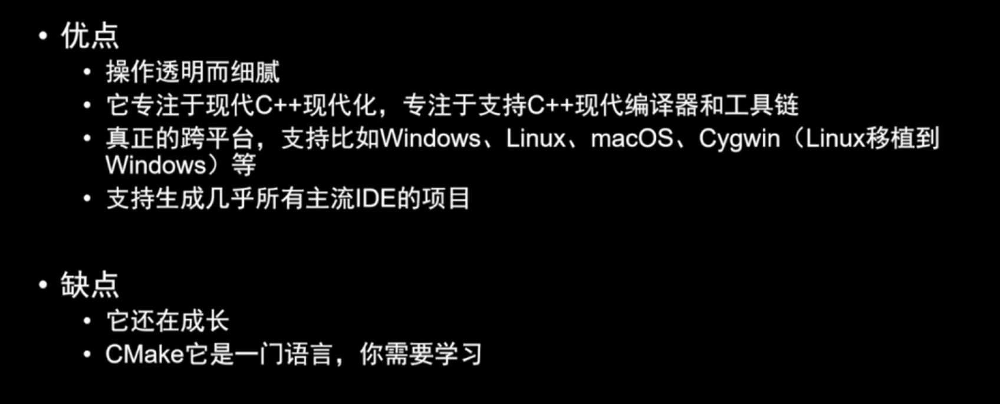


## 4.3 Cmake语法

### 4.3.1 C++源文件生成可执行程序的tool chain流程

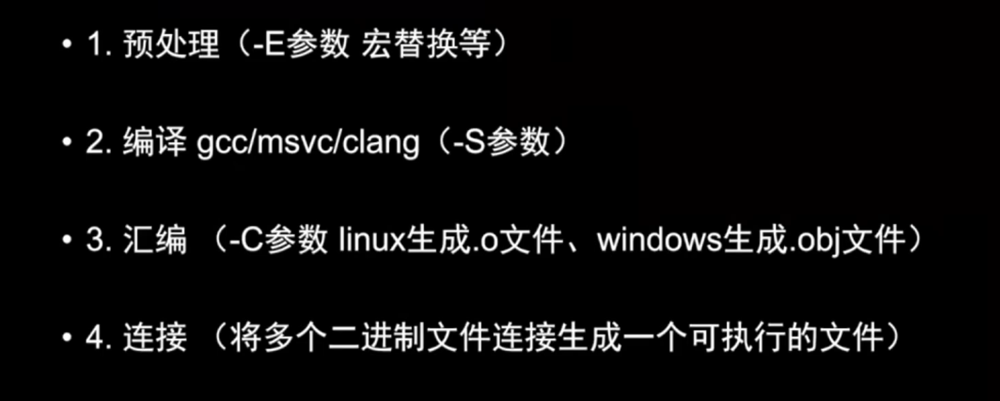

不建议使用Cmake生成makefile，然后使用make命令。

建议

```bash
cmake -B 目录名(build)
cmake --build 目录名
```


### 4.3.2 Cmake流程图

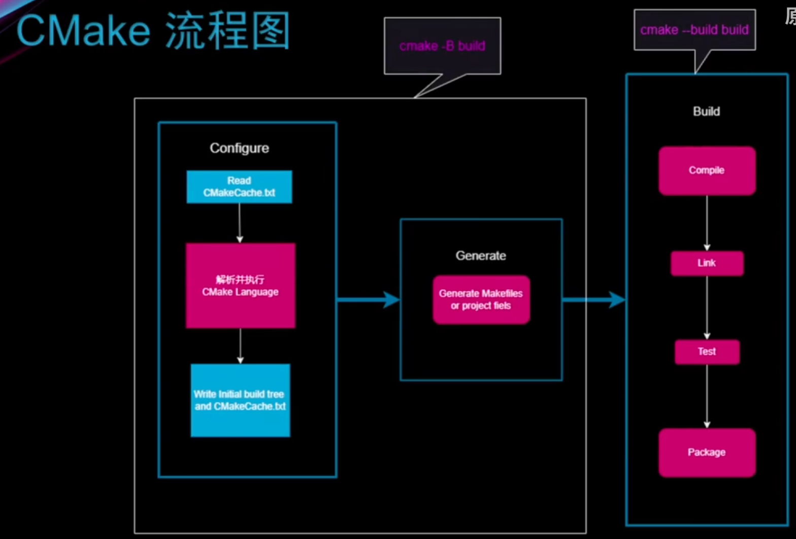


### 4.3.3 Cmake命令行执行流程

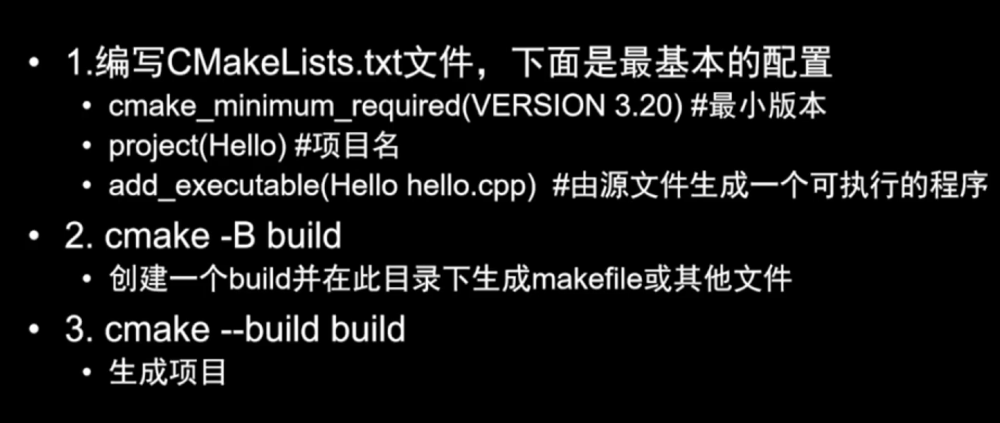


### 4.3.4 Windows下的Cmake

* 首先安装Cmake

* 然后Cmake使用的是默认MSVC，你可以安装MinGW(gcc, clang)

* 使用cmake参数更改默认编译器

  ```c++
  cmake -G <generator-name> -T <toolset-spec> -A <platform-name><path-to-source>
  ```

  通过指定`MinGW Makefiles`来指定cmake使用gcc

下面是一个 CMake 命令的例子：

```bash
cmake -G "Visual Studio 16 2019" -A x64 ../source_dir
```

这个例子中的命令做了以下几件事情：

1. `-G "Visual Studio 16 2019"`：这告诉 CMake 使用 Visual Studio 2019 作为其生成器。CMake 将生成一个 Visual Studio 解决方案文件，可以用 Visual Studio 打开和构建。
2. `-A x64`：这指定了目标平台架构为 64 位（x64）。这告诉 CMake 生成一个针对 64 位系统的 Visual Studio 解决方案。
3. `../source_dir`：这是指向源代码目录的路径，CMake 会在这个目录下查找 `CMakeLists.txt` 文件。

请注意，`-T <toolset-spec>` 参数在这个例子中没有被使用，因为它是可选的，并且通常只在你需要指定一个特定版本的编译器或工具集时才会用到。例如，如果你想使用特定版本的 MSVC 编译器工具集，你可以添加 `-T` 选项指定它。

如果你确实需要指定工具集，比如你想使用不同于 Visual Studio 默认设置的编译器，你可以添加 `-T` 选项。例如，如果你想用 Visual Studio 2019 的 LLVM 工具集来编译项目，可以这样写：

```bash
cmake -G "Visual Studio 16 2019" -T LLVM -A x64 ../source_dir
```

这告诉 CMake 使用 LLVM 作为工具集来生成 Visual Studio 解决方案。


### 4.3.5 一个例子

```bash
cmake -B build
cmake --build build
build/Hello.exe
```

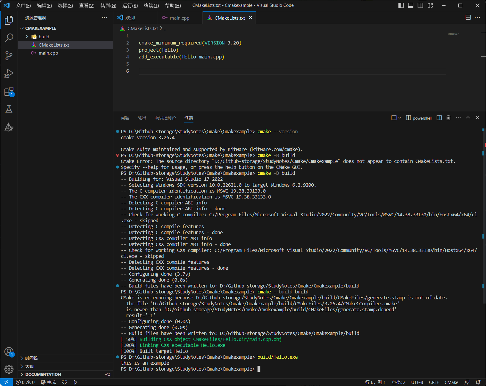


### 4.3.6 ==VScode中切换编译器==

`cmake --help`能发现许多生成器，星号是默认的，我们一般倾向于使用MinGW Makefiles，因为微软的没开源


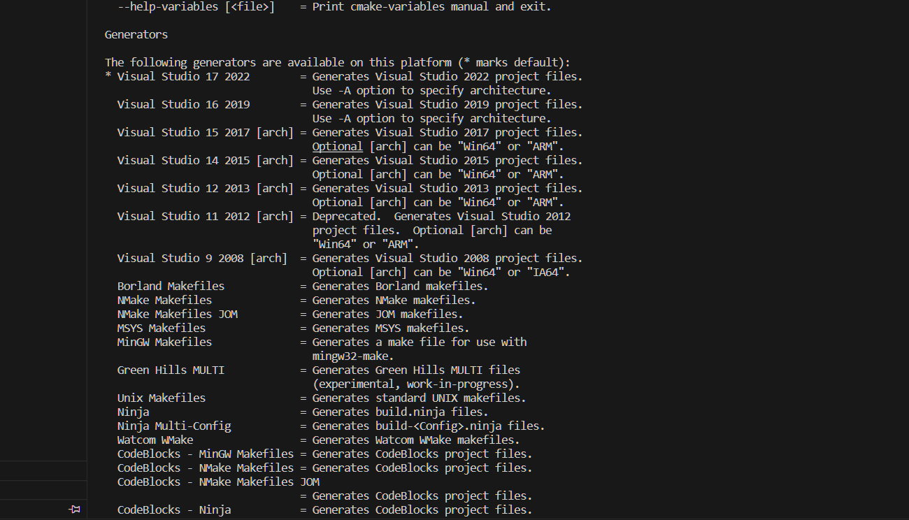


```bash
cmake -B build -G "MinGW Makefiles"
```

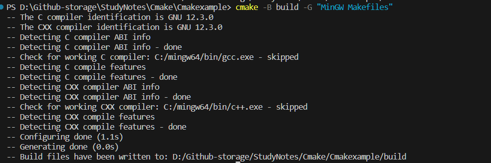


### 4.3.7 Cmake的组成与`.cmake`

* Cmake的执行从源树（CMakeLists.txt)的所在目录开始的

* Cmake命令行工具主要由五个可执行文件构成

  * cmake: `cmake -P filename.cmake`（这个命令针对.cmake文件，一般不会使用)

    * ```cmake
      cmake_minimum_required(VERSION 3.20)
      
      message("hello")
      
      message("这是一个
      换行")
      
      message([[这也是
      一个
      换行]])
      
      # 获取信息 ${}
      # 通常使用${}来获取一个变量的值，例如获取Cmake版本
      message(${CMAKE_VERSION})
      ```

      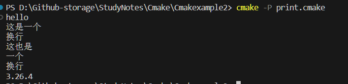

  * ctest

  * cpack

  * cmake-gui

  * ccmake


### 4.3.8 Cmake的变量操作`set`

* Cmake中的变量分为两种
  * Cmake本身提供的
  * 自定义的
* 变量名区分大小写
* 变量在存储时都是字符串
* 获取变量使用`${变量名}`
* 变量的基础操作是`set()`,`unset()`
  * 也可以用list或者string操作


#### `set()`

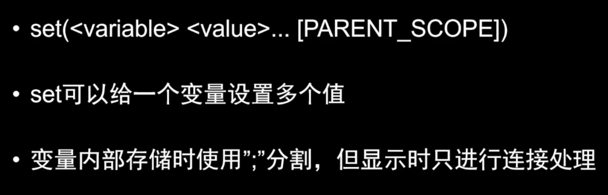


* `set(<variable><value>...[PARENT_SCOPE])`
* set可以给一个变量设置多个值
* 如果设置多个值，那么内部存储时使用`;`分割，但是显示时会直接连接着显示


```cmake

cmake_minimum_required(VERSION 3.20.0)


set(Var1 "YZZY")
message(${Var1})

# My Var因为带空格，所以作为变量名必须使用双引号，此时我们访问这个变量需要反编译符号\ 来表示空格
set("My Var" zzz)
message(${My\ Var})

# 存储多个值
set(LISTVALUE a1 a2)
set(LISTVALUE a1;a2)#一个意思
message(${LISTVALUE})

# 打印环境变量
message($ENV{PATH})# 这里的PATH是ENV环境中的变量

# 增加环境中的变量，作用域是这个cmake文件
set(ENV{CXX} "g++") #创建CXX变量值为g++
message($ENV{CXX})


# unset
unset(ENV{CXX})
message($ENV{CXX})# 因为没有设置，所以会报错

```

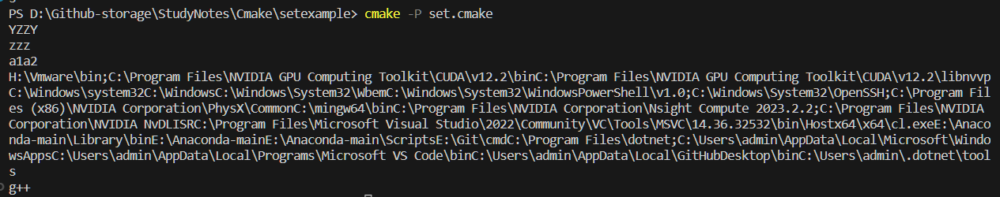


### 4.3.9 Cmake的变量操作`list`

```cmake
# 列表添加元素
list(APPEND <list> [<element>...])

# 列表删除元素
list(REMOVE_ITEM <list> <value> [value])

# 获取列表元素个数
list(LENGTH <list> <output variable>)

# 在列表中查找元素返回索引
list(FIND <list> <value> <out-var>)

# 在index位置插入
list(INSERT <list> <index> [<element> ...])

# 反转list
list(REVERSE <list>)

# 排序list
list(SORT <list> [...])

```


```cmake
cmake_minimum_required(VERSION 3.20.0)

# 两种方式创建Var
set(LISTVALUE a1 a2 a3)
message(${LISTVALUE})

list(APPEND port p1 p2 p3)
message(${port})

# 获取长度 (标识符 目标list 输出变量)
list(LENGTH LISTVALUE len)
message(${len})

# 查找(标识符 目标list 索要查找的内容 结果index)，没找到返回-1
list(FIND LISTVALUE a4 index)
message(${index})

# 删除
list(REMOVE_ITEM port p1)
message(${port})

# 添加
list(APPEND LISTVALUE a5)
message(${LISTVALUE})

# 插入 ，(标识符 目标list 插入index 插入的目标)注意，插入会发生在index这个位置上，即为插入到index这个位置旧的元素之前
list(INSERT LISTVALUE 3 a4)
message(${LISTVALUE})

# 翻转
list(REVERSE LISTVALUE)
message(${LISTVALUE})

# 排序（字典序
list(SORT LISTVALUE)
message(${LISTVALUE})

```


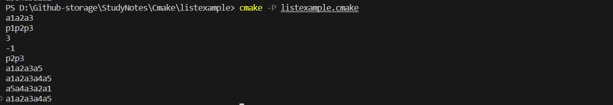


### 4.3.10 流程控制

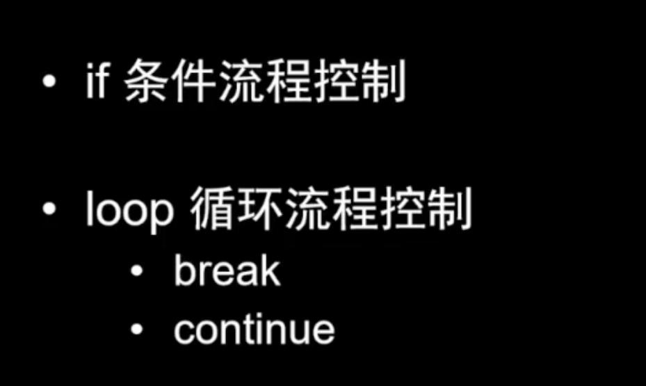

#### 基础语法

```cmake
if(<condition>)
<commands>
elseif(<condition>)
<command>
else()
<commands>
endif()
```

```cmake
foreach(<loop_var> RANGE <max>)
	command
endforeach()

foreach(<loop_var> RANGE <min> <max> [<step>])# step不设置默认步长为1
foreach(<loop_var> IN [LISTS <lists>][ITEMS<items>])# 逐元素遍历
```

```cmake
while(<condition>)
	<commands>
	endwhile()
```


#### 例子

```cmake
cmake_minimum_required(VERSION 3.20.0)

set(VARBOOL TRUE)

# if
if(VARBOOL)
  message(TRUE)
else()
  message(FALSE)
endif()


# NOT
if(NOT VARBOOL)
  message(TRUE)
else()
  message(FALSE)
endif()


# OR
if(NOT VARBOOL OR VARBOOL)
  message(TRUE)
else()
  message(FALSE)
endif()


# AND
if(NOT VARBOOL AND VARBOOL)
  message(TRUE)
else()
  message(FALSE)
endif()


if(1 LESS 2)
  message("1 < 2")
endif()

# 注意，字母字符串与数字最好不要比较，否则会比较不成功。Cmake会首先尝试将字符串转换为数字
if("o" LESS 200)
  message("o < 200")
endif()
if("o" GREATER_EQUAL 200)
  message("o > 200")
endif()
if("2" EQUAL 2)
  message("2==2")
endif()
message("After the if statement")


# for 推荐使用for不用while
foreach(VAR RANGE 3)
  message(${VAR})
endforeach()

message("------------------------------------")
set(MY_LIST 1 2 3)
# 用的比较多，因为常常增加一些东西，用完就扔了
foreach(VAR IN LISTS MY_LIST ITEMS 4 f)
  message(${VAR})
endforeach()


# zip操作
message("---------------------")
set(L1 one two three four)
set(L2 1 2 3 4 5)

foreach(num IN ZIP_LISTS L1 L2)
    message("word = ${num_0},num = ${num_1}")
endforeach()

```

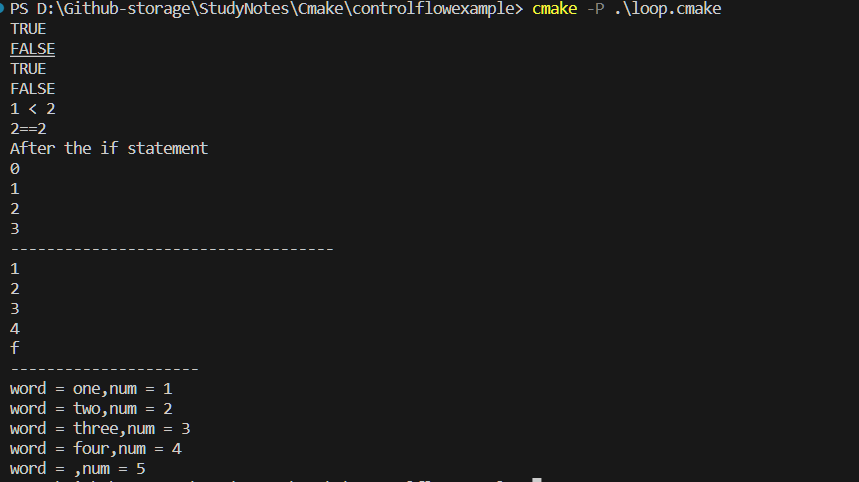


### 4.3.11 函数

```cmake
function(<name>[<argument>...])
	<commands>
endfunction()
```


```cmake
cmake_minimum_required(VERSION 3.20.0)

# 这个函数的作用是设定仅有一个参数，然后依次做如下操作
# 输出函数名，输出参数值，修改参数值，再次输出参数值，使用固有变量输出三个参数值
function(MyFunc FirstArg)
  message("MYFunc Name: ${CMAKE_CURRENT_FUNCTION}")
  message("FirstArg = ${FirstArg}")
  set(FirstArg "New value")
  message("FirstArg After change = ${FirstArg}")
  # 另一种打印参数的方式固有变量 ARGVn
  message("ARGV0 ${ARGV0}")
  message("ARGV1 ${ARGV1}")
  message("ARGV2 ${ARGV2}")
endfunction()


set(FirstArg "first value")
MyFunc(${FirstArg} "value") # 我们可以发现，即使我们只设置了一个参数，我们仍然可以传入多个参数，被固有变量捕捉
# FirstArg没有改变代表函数的FirstArg只在函数内的作用域
message("FirstArg After Function =  ${FirstArg}")
```


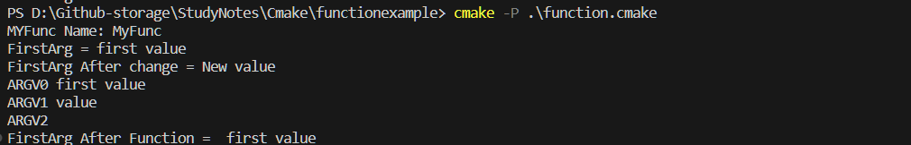


### 4.3.12 作用域

CMake有两种作用域

* 函数作用域：Function scope

  * 所调用的函数继承所有caller域的变量

  * 这些变量并不会影响caller域的变量

    ```cmake
    cmake_minimum_required(VERSION 3.20.0)
    
    project(scope)
    
    function(InFunc)
      message("-> In: ${Var}")
      set(Var 3)
      message("<- In: ${Var}")
    endfunction()
    
    
    function(OutFunc )
      message("-> Out: ${Var}") 
      set(Var 2)
      InFunc()
      message("<- Out: ${Var}")
    endfunction()
    
    
    
    set(Var 1)
    message("-> Global ${Var}")
    OutFunc()
    message("<- Global ${Var}")
    
    
    ```

    这些输出会在build的时候显示,我们可以发现

    * 尽管我们没有传入参数，在父域的参数任然可以访问
    * 子域的参数修改不会影响父域

    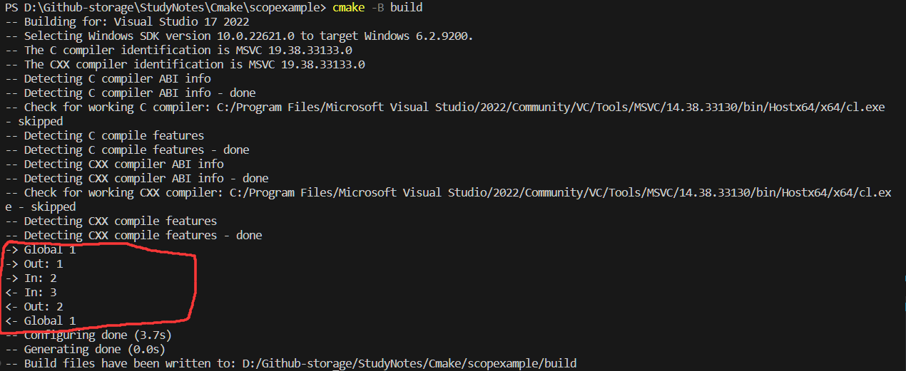

* 文件夹作用域: Directory scope

  * 也就是说，如果我们执行`add_subdirectory()`来执行嵌套目录中的CMakeLists.txt列表文件，注意父CMakeLists.txt其中的变量可以被子CmakeLists.txt使用（继承了父文件的变量)


### 4.3.13 宏

尽量不要写宏，因为宏会造成阅读困难，以及宏非常灵活，加大难度

所以保证会读就行

```cmake
macro(<name> [<argument>...])
	<commands>
endmacro()
```

宏有一个很麻烦的灵活性

在 CMake 的宏（`macro`）中，当传入的参数与全局变量同名时，您实际上不能直接修改传入的参数，但可以修改全局变量。==这是因为宏内部的参数名直接替换为了传入的实际值，而不是引用。==因此，两种情况——修改变量和输出参数——是分开的。下面是具体的解释：

1. **修改变量**：
   - 在宏内部使用 `set` 命令修改变量时，您实际上是在修改与宏参数同名的全局变量。
   - 由于宏不创建新的作用域，因此任何在宏内部对变量的修改都是针对全局作用域的。
2. **输出参数**：
   - ==当在宏内部输出参数时，由于参数的文本替换特性，您实际上是在输出传递给宏的具体值。==
   - 这意味着即使全局变量的值已被修改，`message` 命令仍然输出的是调用宏时传入的原始参数值。

所以，当传入的参数与全局变量同名时，您实际上不能通过宏内部的操作来修改传入的参数值。相反，您修改的是同名的全局变量。这种行为可能会导致混淆，因此在使用宏时需要特别注意变量的作用域和命名。

这就是下面例子中为什么宏内输出argument: value的原因，他们的改变和输出参数是分开的，这意味着当传入参数和全局参数同名时，你修改不了传入参数。

```cmake
cmake_minimum_required(VERSION 3.20.0)
# 宏名 宏参数
macro(Test myVar)
  set(myVar "new value") # 这里是创建了一个新的myVar变量
  message("argument: ${myVar}")
endmacro()

set(myVar "First value")
message("myVar: ${myVar}")
Test("value")
message("myVar: ${myVar}")
```


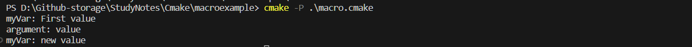


## 4.5 Cmake构建项目的四种方式

### 4.5.0 生成器与编译器

在软件构建过程中，"生成器"（Generator）和"编译器"（Compiler）是两个非常不同但又相互关联的概念。理解它们的区别对于软件开发和构建管理是很重要的。

#### 生成器（Generator）

1. **定义**：
   - 生成器是一种工具，它根据预定义的配置和脚本（如 CMakeLists.txt 文件）生成特定的构建文件。
   - 生成器不直接编译代码，而是生成可以由编译器和构建系统使用的文件（如 Makefiles、Visual Studio 解决方案文件等）。
2. **用途**：
   - 生成器用于创建适用于特定构建系统或开发环境的构建配置文件。
   - 例如，CMake 是一个流行的跨平台构建系统，它可以生成多种不同生成器的构建文件。
3. **示例**：
   - 在 CMake 中，常见的生成器包括 "Unix Makefiles"、"Ninja"、"Visual Studio" 等。
   - ==`cmake -G <generator-name>`==

#### 编译器（Compiler）

1. **定义**：

   - 编译器是一种工具，它将源代码（如 C、C++、Java 等语言编写的代码）转换成机器代码或中间表示（如字节码）。
   - 编译器通常执行语法分析、语义分析、代码优化和代码生成等任务。

2. **用途**：

   - 编译器的主要目的是将程序员编写的高级语言代码转换成可执行的程序。
   - 编译器还负责代码优化，以提高程序的性能和效率。

3. **示例**：

   - 常见的 C/C++ 编译器包括 GCC（GNU Compiler Collection）、Clang、MSVC（Microsoft Visual C++）等。

   - ==要更改 `cmake -B build` 命令使用的默认编译器==，您可以在 CMakeLists.txt 文件中设置编译器，或者在命令行上设置环境变量。以下是两种常见的方法：

     ### 方法 1：使用 CMakeLists.txt 文件设置编译器

     在 CMakeLists.txt 文件中，您可以通过设置 `CMAKE_C_COMPILER` 和 `CMAKE_CXX_COMPILER` 变量来指定 C 和 C++ 编译器。例如：

     ```cmake
     # 在 project 命令之前设置编译器
     set(CMAKE_C_COMPILER "/path/to/gcc")
     set(CMAKE_CXX_COMPILER "/path/to/g++")
     project(YourProjectName)
     ```

     这里 `/path/to/gcc` 和 `/path/to/g++` 应该被替换为您系统上相应编译器的实际路径。

     ### 方法 2：在命令行中设置环境变量

     在命令行中，您可以通过设置 `CC` 和 `CXX` 环境变量来指定 C 和 C++ 编译器，然后运行 CMake：

     ```bash
     export CC=/path/to/gcc
     export CXX=/path/to/g++
     cmake -B build
     ```

     对于 Windows 系统，您可以使用类似的方法设置环境变量，但命令语法有所不同：

     ```cmd
     set CC=/path/to/gcc
     set CXX=/path/to/g++
     cmake -B build
     ```

#### 关系和区别

- **关系**：生成器和编译器通常在软件构建过程中一起工作。生成器负责生成构建文件，这些文件定义了如何调用编译器以及其他构建工具来编译和链接源代码。
- **区别**：生成器不进行编译操作；它们生成指导编译过程的文件。编译器则直接处理源代码，生成可执行文件或库。


### 4.5.1 方法一：直接写入源码路径的方式

适用于初学者，或者项目很小的情况。

* 只需要在生成二进制可执行文件的命令`add_executable`中直接写入相对路径即可
* 同时，在源码中引入头文件时也需要写相对路径


在 CMake 中，`project(Animal CXX)` 这行代码指定了项目的名称以及支持的编程语言。

- `Animal` 是项目的名称。
- `CXX` 表示项目使用的编程语言是 C++。

在 CMake 的 `project()` 命令中，您可以指定一个或多个编程语言。常见的编程语言标识符包括 `CXX`（C++）、`C`（C语言）、`Fortran` 等。当您指定 `CXX` 作为项目语言时，CMake 会为该项目配置 C++ 编译器。

这个命令对项目进行初始化，并设置一些与项目相关的变量，例如 `CMAKE_PROJECT_NAME`。指定项目使用的语言对于 CMake 正确配置编译器和编译选项至关重要。如果您的项目同时使用多种语言，您可以在 `project()` 命令中一起指定它们，例如 `project(Animal CXX C)`。

```cmake
cmake_minimum_required(VERSION 3.20.0)

project(Animal CXX)

add_executable(Animal
main.cpp
animal/dog.cpp
)
```


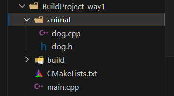

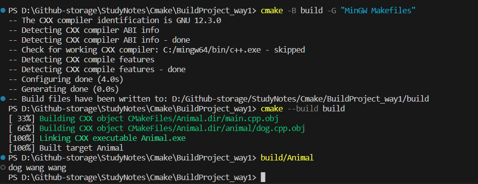


### 4.5.2 方法二：调用子目录cmake脚本

* include方法可以引入子目录中的cmake后缀配置文件
* 将配置加入到add_executable中

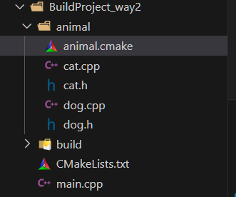

我们先在animal文件夹中加入.cmake局部文件

```cmake
set(animal_sources animal/dog.cpp animal/cat.cpp)
```

然后再CMakeLists.txt中include即可

```cmake
cmake_minimum_required(VERSION 3.20.0)

project(Animal CXX)

include(animal/animal.cmake)
message(${animal_sources})
add_executable(Animal
main.cpp
${animal_sources}
)
```

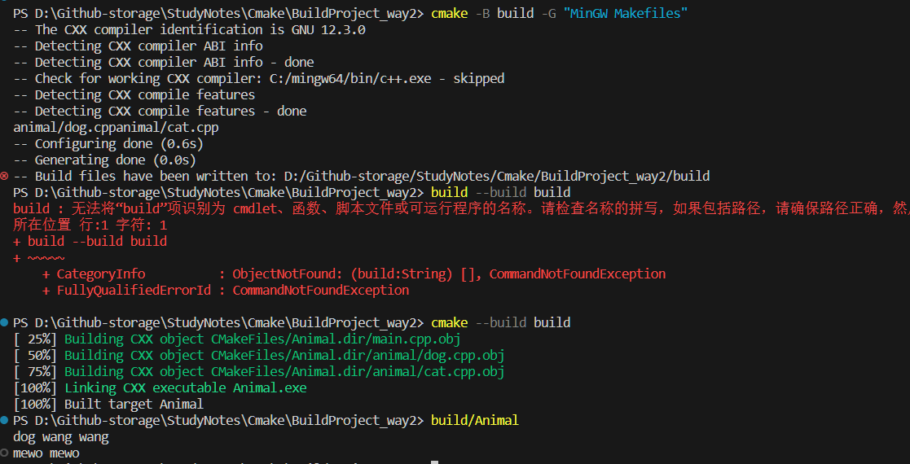


### 4.5.3 方法三：CMakeLists嵌套（最常见）

所用到的命令

* `target_include_directories`头文件目录的声明
* `target_link_libraries` 连接库文件
* `add_subdirectory` 添加子目录
* `add_library` 生成库文件
  * 默认STATIC library（静态库）


`animal/CMakeLists.txt`

```cmake
add_library(AnimalLib cat.cpp dog.cpp)
```

* 添加库`add_library(AnimalLib cat.cpp dog.cpp)`

  * 创建名为AnimalLib的库，由cat.cpp和dog.cpp编译得到

  * `add_library` 命令用于定义和创建一个库（Library）。库是一组编译后的代码，可以被其他项目或可执行文件链接和重用。这个命令指示 CMake 如何将指定的源文件编译成库文件。

  * ```cmake
    add_library(<name> [STATIC | SHARED | MODULE] <source1> <source2> ... <sourceN>)
    ```

    - `<name>`: 库的名称。
    - `STATIC`,`SHARED`,`MODULE`: 指定库的类型。
      - `STATIC`：创建静态库（.a 或 .lib 文件）。静态库在链接时完整地复制到最终的可执行文件中。
      - `SHARED`：创建共享库（.so, .dll 或 .dylib 文件）。共享库在运行时被动态链接，可以被多个程序共用。
      - `MODULE`：创建一个模块库，主要用于插件，不会被链接到其他目标中，但可以在运行时动态加载。
    - `<source1> <source2> ... <sourceN>`: 要编译进库的源文件列表。

  * 

`./CMakeLists.txt`

```cmake
cmake_minimum_required(VERSION 3.20.0)

project(Animal CXX)

add_subdirectory(animal)

add_executable(Animal
main.cpp

)

target_link_libraries(Animal PUBLIC AnimalLib)

target_include_directories(Animal PUBLIC "${PROJECT_BINARY_DIR}" "${PROJECT_SOURCE_DIR}/animal")
```


* 添加子目录`add_subdirectory(animal)`:
  * 告诉CMake查找并处理`animal`子文件夹下的CMakeLists.txt
  * 通常，子目录包含了项目的一部分，这个机制有利于增加CMakeLists的自由度
* 添加可执行文件`add_executable(Animal main.cpp)`
  * 这行命令创建了一个名为Animal的可执行文件，是由main.cpp编译得到的
* 链接库`target_link_libraries(Animal PUBLIC AnimalLib)`:
  * 将AnimalLib库链接到Animal
* 包含目录`target_include_directories(Animal PUBLIC "{PROJECT_BINARY_DIR}" "${PROJECT_SOURCE_DIR}/animal")`
  * ==上一步只是链接库，你还需要让cmake知道库该去哪里找，也就是include path，指定头文件位置==
  * 设置了项目Animal的目标包含路径：
    * `${PROJECT_BINARY_DIR}`是构建过程生成的文件所在的目录（即为build路径）
    * `${PROJECT_SOURCE_DIR}/animal`:是源码中animal子目录路径
  * ==这个命令指定了编译器在编译时查找头文件的路径==，因此我们的头文件可以不使用`# include "animal/dog.h"`而是直接用`#include "dog.h"`
    * Animal：目标，为其指定所包含的目录
    * PUBLIC: 这些目录应当在此目标及其依赖项中使用
    * `"{PROJECT_BINARY_DIR}" `：build目录，如果你的源代码需要包含这些生成的文件，那么需要包含
    * `"${PROJECT_SOURCE_DIR}/animal"`：AnimalLib的来源
  


`Animal` 可执行文件依赖于 `AnimalLib` 库，因此在构建 `Animal` 时，CMake 会先构建 `AnimalLib` 库，然后将其链接到 `Animal` 可执行文件。通过这种方式，您可以将项目分解为可管理的部分，每部分具有自己的源文件和依赖关系。

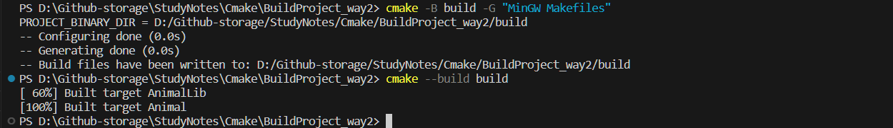


> 在 C++ 项目中，有时源文件需要用到 CMake 构建时生成的文件，主要是为了引入一些在编译时才能确定的配置信息。这种做法使得源代码能够根据构建环境的不同自动调整其行为。以下是一个常见的例子：
>
> ### 示例：生成配置头文件
>
> 假设您的项目需要根据是否为调试模式来改变行为，或者需要知道项目的版本号。您可以在 CMake 中使用 `configure_file` 命令来根据配置生成一个头文件。
>
> 1. **创建一个配置文件模板**（例如 `Config.h.in`）：
>
>    ```cpp
>    // Config.h.in
>    #cmakedefine DEBUG_MODE
>    #define VERSION @PROJECT_VERSION@
>    ```
>
>    在这个模板中，`#cmakedefine DEBUG_MODE` 会根据 CMake 变量 `DEBUG_MODE` 的值被替换为 `#define DEBUG_MODE` 或注释掉。`@PROJECT_VERSION@` 是一个变量，会被替换为项目的版本号。
>
> 2. **在 CMakeLists.txt 中配置文件**：
>
>    ```cmake
>    # 假设您已经设置了项目版本
>    set(PROJECT_VERSION "1.0.0")
>    
>    # 可能基于某些条件设置 DEBUG_MODE
>    if(CMAKE_BUILD_TYPE MATCHES Debug)
>        set(DEBUG_MODE ON)
>    endif()
>    
>    # 生成 Config.h
>    configure_file(Config.h.in Config.h)
>    ```
>
>    这段 CMake 脚本将创建一个 `Config.h` 文件，它是基于 `Config.h.in` 模板的，其中的变量被替换为实际值。
>
> 3. **在 C++ 源文件中使用生成的配置文件**：
>
>    ```cpp
>    #include "Config.h"
>       
>    int main() {
>        #ifdef DEBUG_MODE
>            std::cout << "Debug Mode" << std::endl;
>        #endif
>        std::cout << "Version: " << VERSION << std::endl;
>        return 0;
>    }
>    ```
>
>    在这个源文件中，`Config.h` 被包含，这意味着您的代码可以根据实际构建配置动态改变其行为。
>
> 这个例子展示了如何在 CMake 构建过程中生成配置文件，并且如何在 C++ 源代码中使用这些配置。这种技术尤其在大型项目或需要跨平台支持的项目中非常有用，因为它允许代码在不同环境下灵活适应。


需要注意的是，用这种方法添加的animal库，会build出来一个静态库

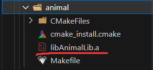


## 4.6 Cmake中的库

### 4.6.1 Object Libraries(最低版本3.12)

`OBJECT` 库将源文件编译为对象文件，但不会将它们归档为实际的库文件（如 `.a`、`.lib`、`.so` 等）。

所以，它实际上是一个可执行文件的集合。**当有多个目标（如多个可执行文件或库）需要使用相同的对象文件时，`OBJECT` 库避免了重复编译，减少了总体构建时间。**

```cmake
add_library(my_object_lib OBJECT source1.cpp source2.cpp)
```

```cmake
# ./animal/CMakeLists.txt
add_library(AnimalLib OBJECT cat.cpp dog.cpp)

target_include_directories(AnimalLib PUBLIC .)


# ./CMakeLists.txt
cmake_minimum_required(VERSION 3.20.0)

project(Animal CXX)

add_subdirectory(animal)

add_executable(Animal main.cpp)

target_link_libraries(Animal PUBLIC AnimalLib)
#message("PROJECT_BINARY_DIR = ${PROJECT_BINARY_DIR}")
#target_include_directories(Animal PUBLIC "${PROJECT_BINARY_DIR}" "${PROJECT_SOURCE_DIR}/animal")
```

我们需要注意，`target_link_libraries`是将某些路径与项目名相关联的，这里将`target_link_directories`写在子目录的CMakeLists内部，然后将当前目录"animal"与项目Animal关联，这种排布方式适用于大型项目，每个子模块单独来include，与在全局添`加"${PROJECT_SOURCE_DIR}/animal"`效果是一致的。


build后我们可以发现，这种方法构建出来的build并没有上面一节中的库文件

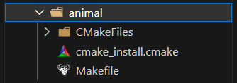


另外一种方法是分开编译

```cmake
# ./animal/CMakeLists.txt
add_library(catlib OBJECT cat.cpp)

target_include_directories(catlib PUBLIC .)


add_library(doglib OBJECT dog.cpp)

target_include_directories(doglib PUBLIC .)


# ./CMakeLists.txt
cmake_minimum_required(VERSION 3.20.0)

project(Animal CXX)

add_subdirectory(animal)

add_executable(Animal main.cpp)

target_link_libraries(Animal PUBLIC catlib doglib)
```

这种方法就生成了两个目录`catlib.dir`,`doglib.dir`，这个的好处是细粒化了library，在以后条件编译中能够避免编译不需要编译的文件。


### 4.6.2 动态库与静态库

在 CMake 和 C++ 编程中，静态库是两个很重要的库，通常来说add_library命令默认创建静态库，若是使用

```cmake
set(BUILD_SHARED_LIBS ON)
add_library(my_library source.cpp)
```

那么此时默认就是动态库。


1. **静态库（Static Library）**：

   * 在链接阶段，将汇编生成的目标文件.o与所**引用到的库**一起链接打包到可执行文件中。因此，对应的链接方式称为静态链接。
   * ==其对函数库的连接是在编译时完成的==

   - 静态库是一组编译过的代码，打包在一个单独的文件中（通常为 `.a` 或 `.lib`），在编译时整个库的内容被复制到最终的可执行文件中。
   - 静态库的优点是所有代码都在一个可执行文件中，不需要额外的运行时依赖。缺点是**每个使用静态库的应用都有一份库的副本**，增加了可执行文件的大小。
   - 静态库的命名:`lib<name>.a, lib<name>.lib`，在linux中为.a,在windows中为.lib

2. **动态库(Dynamic Library)/共享库(shared library)**：

   * 动态库不是在编译时被连接到目标代码中，而是运行时才被载入的。因为静态库对空间的浪费太大了。
   * 动态库的命名：`lib<name>.so,lib<name.dll`，在linux中是.so，在windows中是.dll


常用命令

```cmake
file() # 用于搜索源文件

# 生成静态库
add_library(animal STATIC ${SRC})
# 生成动态库
add_library(animal SHARED ${SRC})

${LIBRARY_OUTPUT_PATH} # 导出目录
```


首先我们优化一下布局，a装静态库，src装.cpp实现，include装头文件

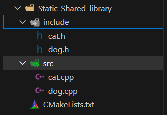

#### 创立静态库

```cmake
cmake_minimum_required(VERSION 3.20.0)
# 该CMakeLists主要是生成库
project(Animal CXX)

# add_subdirectory(animal)

# 不是生成可执行文件
# add_executable(Animal main.cpp)

# target_link_libraries(Animal PUBLIC AnimalLib)
# message("PROJECT_BINARY_DIR = ${PROJECT_BINARY_DIR}")
# target_include_directories(Animal PUBLIC "${PROJECT_BINARY_DIR}" "${PROJECT_SOURCE_DIR}/animal")

# 将所有Cpp文件加入SRC变量
file(GLOB SRC ${PROJECT_SOURCE_DIR}/src/*.cpp)

include_directories((${PROJECT_SOURCE_DIR}/include))

# 设置输出的library的路径（根目录下的a文件夹）
set(LIBRARY_OUTPUT_PATH ${PROJECT_SOURCE_DIR}/a)
add_library(animal_static STATIC ${SRC})

```

* `GLOB` 指令告诉 CMake 执行文件的全局搜索（globbing），即根据指定的模式匹配文件名。

其余的还有

* `GLOB_RECURSE`：递归地搜索匹配的文件，包括所有子目录。
* `COPY`：复制文件。
* `RENAME`：重命名文件。
* `REMOVE`：删除文件。
* `WRITE`：向文件写内容。
* `READ`：读取文件内容。

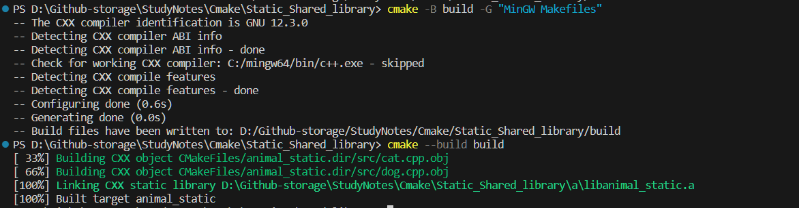


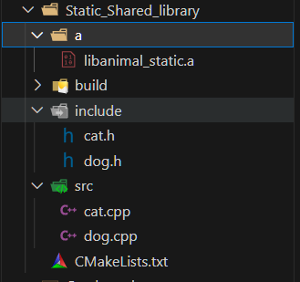


#### 生成动态库

这里我们只生成动态库，考虑到LIBRARY_OUTPUT_PATH是全局输出，因此不能同时输出动态库和静态库到两个不同的文件夹。

```cmake
# 生成动态库

file(GLOB SRC ${PROJECT_SOURCE_DIR}/src/*.cpp)

include_directories((${PROJECT_SOURCE_DIR}/include))

set(LIBRARY_OUTPUT_PATH ${PROJECT_SOURCE_DIR}/so)
add_library(animal_shared SHARED ${SRC})


```

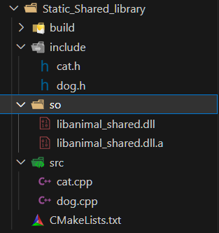


==动态库是可以执行的，但是静态库是不可以执行的==

某些操作系统（如 Linux）允许动态库作为可执行文件。这是因为动态库可以包含一个入口点（但这并不常见）。通常，动态库用于在运行时被其他可执行文件调用。

动态库有时可以是可执行的，这取决于它们是如何被构建的。在某些情况下，动态库可以包含一个入口点，使其能够像普通的可执行文件一样运行。这通常是通过在动态库中定义一个可以被操作系统识别的特殊符号（如 `main` 函数）来实现的。然而，这并非动态库的典型或建议用途。


#### 静态库调用流程

* 引入头文件
* 连接静态库
* 生成可执行二进制文件

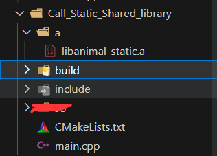

```cmake
cmake_minimum_required(VERSION 3.20.0)

project(Animal CXX)

# 引入头文件
include_directories(${PROJECT_SOURCE_DIR}/include)


# 添加静态库目录
link_directories(${PROJECT_SOURCE_DIR}/a)
# 连接静态库
link_libraries(animal_static)


add_executable(app main.cpp)

```

这里注意，我们之前创建静态库的时候就是名称为animal_static，它会自动命名乘`lib<name>.a`，我们在lin_libraries时仍然需要的是我们旧的`<name>`

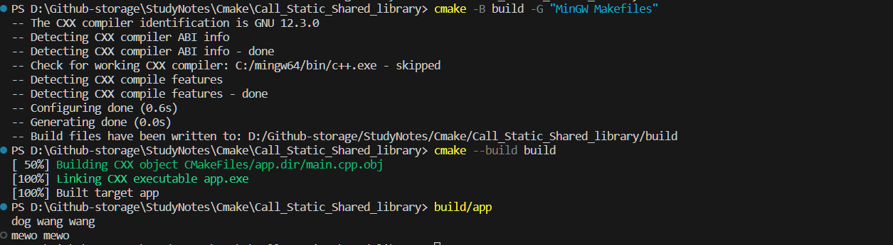


#### 动态库调用流程

* 引入头文件
* 声明库目录
* 生成可执行二进制文件
* 连接动态库（==运行时连接==）


```cmake
cmake_minimum_required(VERSION 3.20.0)

project(Animal CXX)

include_directories(${PROJECT_SOURCE_DIR}/include)

link_directories(${PROJECT_SOURCE_DIR}/so)
add_executable(app main.cpp)
target_link_libraries(app PUBLIC animal_shared)
```

注意，在windows中，动态库在执行时是需要和可执行文件在同一个文件夹中的。复制过去就行。

这也就是为什么windows中

```cmake
file(GLOB SRC ${PROJECT_SOURCE_DIR}/src/*.cpp)

include_directories((${PROJECT_SOURCE_DIR}/include))

# 静态库
set(LIBRARY_OUTPUT_PATH ${PROJECT_SOURCE_DIR}/a)
add_library(animal_static STATIC ${SRC})
# 动态库
set(LIBRARY_OUTPUT_PATH ${PROJECT_SOURCE_DIR}/so)
add_library(animal_shared SHARED ${SRC})
```

这么写之后，静态库存在a而动态库直接存在build。


> 在 CMake 中，`link_directories` 和 `link_libraries` 有特定的用途，它们与 `target_link_libraries` 的行为有所不同。让我们分别来看看这些命令的作用和使用场景。
>
> ### link_directories
>
> - `link_directories` 命令用于指定链接器搜索库文件时应查找的目录。这个命令影响所有在其之后声明的目标。
>
> - 例：
>
>   ```cmake
>   link_directories(${PROJECT_SOURCE_DIR}/so)
>   ```
>
> ### link_libraries
>
> - `link_libraries` 用于为之后定义的所有目标设置链接库。它是一种全局设置，会影响所有后续定义的目标。
> - 问题：`link_libraries` 的使用可能会导致不必要的全局影响，使得项目难以维护，特别是在大型或复杂的项目中。
>
> ### target_link_libraries
>
> - `target_link_libraries` 是更推荐的做法，它用于为特定目标（例如可执行文件或库）指定链接库。这样可以更精确地控制每个目标的链接行为。
>
> - 例：
>
>   ```cmake
>   add_executable(app main.cpp)
>   target_link_libraries(app PUBLIC animal_shared)
>   ```
>
> 在这个例子中，`target_link_libraries(app PUBLIC animal_shared)` 命令精确地指定了 `app` 可执行文件应该链接 `animal_shared` 库。
>
> ### 为什么推荐 target_link_libraries
>
> - **精确性**：`target_link_libraries` 允许您为每个特定目标定义链接库，避免全局设置可能引起的混淆和错误。
> - **可维护性**：在大型项目中，使用 `target_link_libraries` 可以更容易地追踪每个目标的依赖，使项目更加模块化和可维护。


## 4.7 `PRIVATE` 与`PUBLIC`

 `PUBLIC` 和 `PRIVATE` 关键词用于指定链接和包含依赖的范围。

在 CMake 中，`PUBLIC` 和 `PRIVATE` 关键词用于定义目标（如可执行文件或库）的依赖关系。

1. **PUBLIC**：
   - 表示链接或包含的依赖项在定义它的目标和使用该目标的其他目标中都是可见的。
   - 例如，如果您为一个库设置了 `PUBLIC` 包含目录，那么链接这个库的任何其他目标也将拥有相同的包含目录。
2. **PRIVATE**：
   - 表示链接或包含的依赖项仅在定义它的目标中可见。
   - 如果您为一个库设置了 `PRIVATE` 包含目录，那么这些目录只对这个库可见，链接这个库的其他目标不会继承这些包含目录。

选择 `PUBLIC` 或 `PRIVATE` 取决于您的代码如何组织以及您希望如何暴露您的库或可执行文件的依赖。正确使用这些关键词有助于保持清晰的依赖关系和避免不必要的重编译。

## 4.7 Cmake与源文件交互


## 4.8 Cmake条件编译


