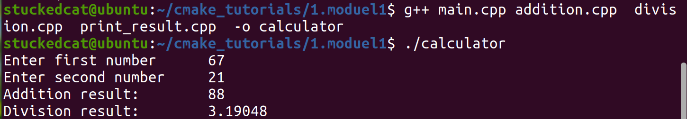
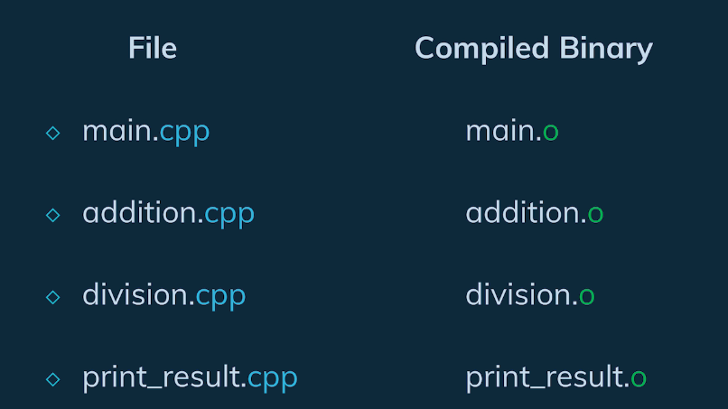
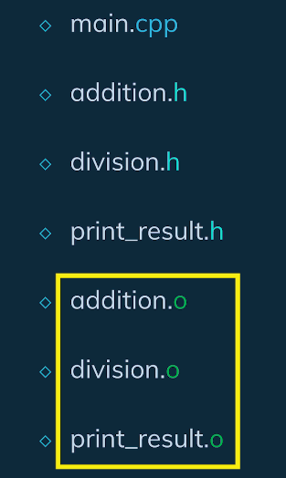
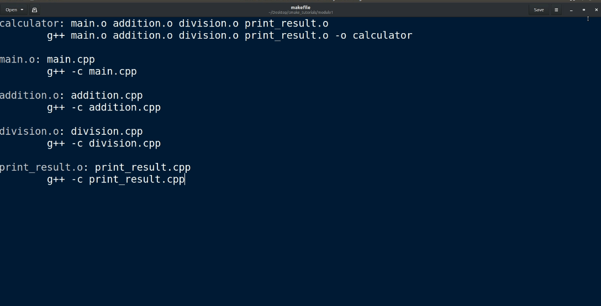
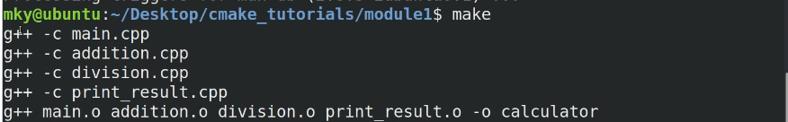
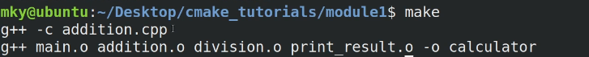
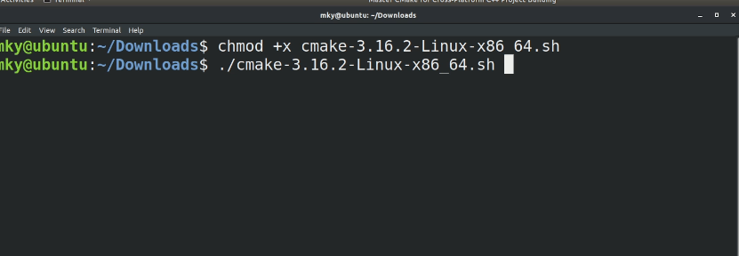
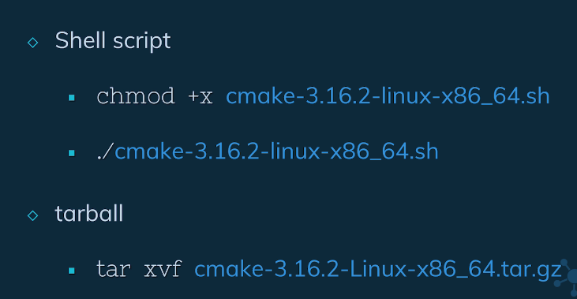
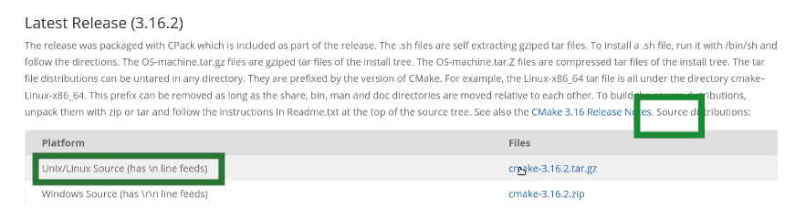
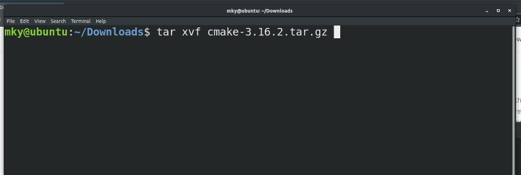

## 1. 在linux中编译可执行文件

```bash
g++ main.cpp -o ExecutionFilename
```


```bash
stuckedcat@ubuntu:~$ mkdir cmake_tutorials
stuckedcat@ubuntu:~$ ls
cmake_tutorials  Downloads   ndiff-2.00.tar.gz            Pictures  Templates
Desktop          Music       ParallelComputing            Public    Videos
Documents        ndiff-2.00  ParallelComputingSourceCode  snap
stuckedcat@ubuntu:~$ cd cmake_tutorials
stuckedcat@ubuntu:~/cmake_tutorials$ mkdir 1.moduel1
stuckedcat@ubuntu:~/cmake_tutorials$ cd 1.moduel1/
stuckedcat@ubuntu:~/cmake_tutorials/1.moduel1$ touch main.cpp
```

```c++
#include <iostream>

int main(){
	float first_no, second_no, result_add, result_div;
	std::cout<<"Enter first number\t";
	std::cin >> first_no;
	std::cout << "Enter second number\t";
	std::cin >> second_no;
	
	result_add = first_no + second_no;
	result_div = first_no / second_no;
	
	std::cout << result_add << " " << result_div;

}
```

生成一个名为calculator的可执行文件，并执行。

```bash
stuckedcat@ubuntu:~/cmake_tutorials/1.moduel1$ g++ main.cpp -o calculator
stuckedcat@ubuntu:~/cmake_tutorials/1.moduel1$ ./calculator
Enter first number	1
Enter second number	2
3 0.5
```


多个文件链接

```bash
stuckedcat@ubuntu:~/cmake_tutorials/1.moduel1$ touch addition.cpp division.cpp print_result.cpp
```

注意，

* main中必须declare对应的函数
* 我们必须告诉g++定义的函数在哪里


```c++
//main.cpp
#include <iostream>

float addition( float, float );
float division(float, float);
void print_result( std::string, float);

int main(){

float first_no, second_no, result_add, result_div;

std::cout<< "Enter first number\t";
std::cin>> first_no;
std::cout<< "Enter second number\t";
std::cin>> second_no;

result_add = addition(first_no , second_no);
result_div = division(first_no , second_no);

print_result("Addition", result_add);
print_result("Division", result_div);
//std::cout<< "Addition result:\t"<< result_add<< "\nDivision result:\t"<< result_div<< "\n";

return 0;

}

//addition.cpp
float addition( float num1, float num2 ){
	return num1+num2+0;
}

//division.cpp
float division(float num1, float num2){
	return num1/num2+0;
}

//print_result.cpp
#include <iostream>

void print_result( std::string result_type, float result_value){
	std::cout<< result_type<< " result:\t"<< result_value<< "\n";
}

```




更推荐的方法其实是将declaration写在头文件中，然后包含这些头文件。

==头文件的作用就是将declaration复制到main.cpp中。==

最终我们会得到

```c++
// addition.h
float addition( float, float );
// division.h
float division(float, float);
// print_result.h
void print_result( std::string, float);

//main.cpp
#include <iostream>
#include "addition.h"
#include "division.h"
#include "print_result.h"
int main(){

float first_no, second_no, result_add, result_div;

std::cout<< "Enter first number\t";
std::cin>> first_no;
std::cout<< "Enter second number\t";
std::cin>> second_no;

result_add = addition(first_no , second_no);
result_div = division(first_no , second_no);

print_result("Addition", result_add);
print_result("Division", result_div);
//std::cout<< "Addition result:\t"<< result_add<< "\nDivision result:\t"<< result_div<< "\n";

return 0;

}

//addition.cpp
float addition( float num1, float num2 ){
	return num1+num2+0;
}

//division.cpp
float division(float num1, float num2){
	return num1/num2+0;
}

//print_result.cpp
#include <iostream>

void print_result( std::string result_type, float result_value){
	std::cout<< result_type<< " result:\t"<< result_value<< "\n";
}

```


## 2. 编译原理

最初，所有我呢见都是相互独立编译的。



因为main.cpp使用了其他文件中的函数，因此我们必须告诉编译器，main.cpp中的三个函数确实是存在某处的。

我们可以通过直接在使用到这些函数的文件中声明这些函数来做到这一点，我们也可以通过包含头文件来做到这一点。

头文件的作用主要是打包，实际上编译器会将头文件的声明复制到main.cpp中。


在此时，==编译器在编译阶段并不关心这些函数的定义==。编译器在编译过程中会在call function的地方放一个占位符，这些占位符告诉函数调用会在**链接**阶段得到解决。

==链接阶段==，链接器找到`addition.cpp,division.cpp,print_result.cpp`的编译二进制文件，并且将他们链接到一起生成一个可执行文件。


这里需要注意的一点是，此时你拥有

* 拥有函数声明的头文件
* .cpp文件被编译后的二进制文件。

你才能够构建该项目。




## 3.Makefile初探

通常为了构建项目，开发人员会编写makefile专门构建系统并链接源代码。

```bash
sudo apt install make
touch makefile
```





make命令将查找makefile然后根据makefile的内容构建项目。

执行后的输出意味着编译器编译了所有文件，然后将它们链接到了一起。

然后，我们就可以使用可执行文件calculator来运行程序了。


我们可以修改addition.cpp然后重新make



可以发现，现在只有被修改的文件被重新编译了。这在大型文件系统节省了我们的时间。

> 让我们使用五个文件来更加清晰地描述编译过程中的依赖关系和编译步骤：
>
> 1. **main.cpp**：这是包含 `main` 函数的源文件，假设它调用了 `function1.h` 和 `function2.h` 中声明的函数。
> 2. **function1.h**：这个头文件声明了 `function1.cpp` 中定义的函数。
> 3. **function1.cpp**：这个源文件包含 `function1.h` 中声明的函数的定义。
> 4. **function2.h**：这个头文件声明了 `function2.cpp` 中定义的函数。
> 5. **function2.cpp**：这个源文件包含 `function2.h` 中声明的函数的定义。
>
> 根据这些文件，我们来描述编译过程中的三种情况：
>
> 1. **编译项目第一次**：
>    - 你需要所有五个文件：`main.cpp`, `function1.h`, `function1.cpp`, `function2.h`, `function2.cpp`。
>    - 编译器需要头文件来了解函数的声明，需要源文件（.cpp）来获取函数的实现。
>    - 编译这些文件会生成对象文件（`.o` 或 `.obj`），然后这些对象文件被链接成最终的可执行文件。
> 2. **第二次编译时，如果头文件和源文件没有变化**：
>    - 你只需要已经编译的对象文件和任何改变的源文件。
>    - 如果 `main.cpp` 没有改变，并且 `function1.cpp` 和 `function2.cpp` 也没有改变，则无需重新编译，直接链接已有的对象文件即可生成可执行文件。
>    - 但如果 `main.cpp` 发生了改变，只需重新编译 `main.cpp`，然后用新生成的对象文件与其他旧的对象文件链接。
> 3. **第二次编译时，如果某个源文件（如 `function1.cpp`）发生了改变**：
>    - 你需要重新编译改变的源文件 `function1.cpp`，因为它的对象文件需要更新。
>    - 然后，用新生成的 `function1.o` 和旧的 `function2.o` 及 `main.o`（如果 `main.cpp` 和 `function2.cpp` 没变）链接生成最终的可执行文件。
>    - 如果只有 `function1.cpp` 发生变化，无需重新编译 `function2.cpp`，因为其对应的对象文件仍然是最新的。
>
> 简单来说，你总是需要重新编译所有改变了的源文件，以确保它们的对象文件是最新的。然后将所有相关的对象文件链接在一起，生成最终的可执行文件。未改变的源文件对应的对象文件可以重复使用，无需重新编译。

## 4. Meta Build- Cmake

==Cmake能够为我们编写makefile==

Cmake能够为我们提供跨平台的项目。

* 拥有Linux的C++程序与makefile并不能在windows上面构建该代码
* 拥有Windows上的visual studio解决方案也无法在Linux上面构建该代码

Cmake通过构建基于平台的系统文件解决了这个问题。


### 4.1 安装CMake

方法一

```bash
sudo apt install cmake
cmake --version
```

方法二：

cmake.org/download/

下载二进制发行版


进入下载文件夹





进入文件夹的bin，我们可以见到一个cmake 可执行文件

我们需要将这个可执行文件添加到系统中

即为，首先获取bin的路径

```bash
pwd
```

然后将这个路径复制到Home/.bashrc中


方法三：从官方网站下载source code



解压



进入这个文件夹，依次输入三个命令：

* ./bootstrap
* make
* sudo make install


如果boot出现错误，应该使用`./bootstrap -- -DCMAKE_USE_OPENSSL=OFF`，这是脱离OPENSSL的构建方式


## 4.2 Cmake构建流程


## 4.3 Cmake语法


## 4.5 Cmake构建项目的四种方式


## 4.6 静态库与动态库


## 4.7 Cmake与源文件交互


## 4.8 Cmake条件编译


