# 00-前序

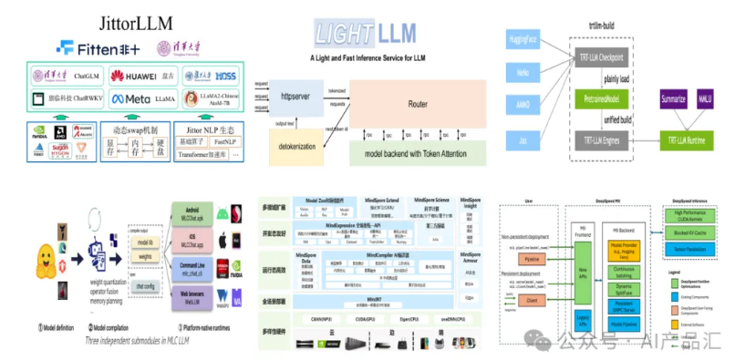

  随着ChatGPT、GPT-4等大语言模型的出现，彻底点燃了国内外的学者们与企业家们研发LLM的热情。国内外的大语言模型如雨后春笋一般的出现，这些大语言模型有一部分是开源的，有一部分是闭源的。

  伴随着大语言模型的出现，国内外基于大语言模型的上层应用产品更是层出不穷，Huggingface上每天都会有大量新奇的应用出现在我们的眼前。**对于任何一个大语言模型产品而言，都会涉及到一个很关键的步骤，如何低成本、稳定、高效的将某个大语言模型部署在特定的硬件平台上面，为了完成大语言模型的部署，LLM推理框架应运而生！**

  与传统的AI推理框架不同，基于LLM的推理框架的硬件规模更大、底层算子的复杂度更高、上层的推理形态更加多样。**随着众多优质的大语言模型逐渐开源，算法端的门槛正在逐步降低，因而不同厂家的产品壁垒主要体现在不同的LLM推理框架上面。**

  虽然当前已经出现了众多开源的LLM推理框架，但是不同的LLM推理框架有着不同的侧重点，有着不同的特点。**为了更好的节约项目成本、提升项目开发效率，根据自己的项目需求选择一个合适的LLM推理框架成为了一个至关重要的问题！由于大家可能都有自己的圈层，每个人知道或者了解到的LLM推理框架不尽相同，但是你并不能保证你了解到的就一定是最适合你的LLM推理框架！**本文小编耗费了大量的精力帮你把国内外主流的LLM推理框架整理了出来，更多的细节请看下文。

# 01-vLLM

## 01.01-简介

**链接-***https://github.com/vllm-project/vllm*

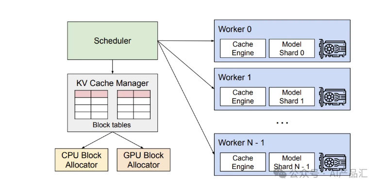

  上图展示了vLLM的整体架构。**vLLM采用集中式调度器来协调分布式GPU工作程序的执行。KV缓存管理器通过PagedAttention以分页方式有效地管理KV缓存。**具体来说，KV缓存管理器通过集中式调度器发送的指令来管理GPU工作程序上的物理KV缓存

## 01.02-特点

- **🚂推理速度足够快**
  - 支持PagedAttention
  - 连续Batch请求
  - 支持CUDA/HIP图
  - 支持GPTQ、AWQ、SequeezeLLM、FP8 KV Cache
- **🚂足够灵活与简单**
  - 与主流的Hugging face模型无缝结合
  - 具有各种解码算法的高吞吐量服务，包括并行采样、波束搜索等
  - 支持分布式推理的张量并行
  - 兼容OpenAI的API服务器
  - 支持NVIDIA与AMD GPU
- **🚂支持多种模型架构**

## 01.03-样例代码

```python
# 1-离线推理from vllm import LLM
prompts = ["Hello, my name is", "The capital of France is"]  # Sample prompts.

llm = LLM(model="lmsys/vicuna-7b-v1.3")  # Create an LLM.

outputs = llm.generate(prompts)  # Generate texts from the prompts.
# 2-在线推理
python -m vllm.entrypoints.openai.api_server --model lmsys/vicuna-7b-v1.3
```


# 02-TensorRT-LLM

## 02.01-简介

**链接-***https://github.com/NVIDIA/TensorRT-LLM*

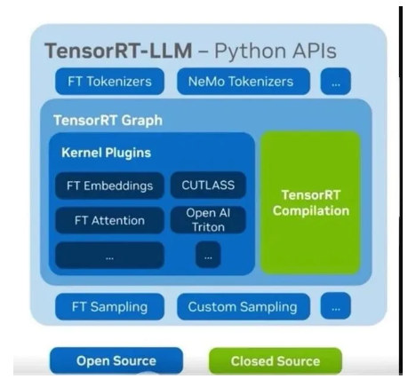

  **TensorRT-LLM为用户提供了一个易于使用的Python API，用来定义大型语言模型（LLM）并构建包含最先进优化的TensorRT引擎，从而在NVIDIA GPU上高效地执行推理。**TensorRTLLM包含用于创建执行这些TensorRT引擎的Python和C++运行时的组件。它还包括一个与NVIDIA Triton推理服务器集成的后端；为LLM服务的生产质量体系。使用TensorRT LLM构建的模型可以在各种配置上执行，从单个GPU到具有多个GPU的多个节点（使用Tensor并行性和/或管道并行性）。

  **TensorRT-LLM的Python API的架构类似于PyTorch API。**它为用户提供了一个包含einsum、softmax、matmul或view等功能的功能模块。layers模块捆绑有用的构建块来组装LLM；如注意力块、MLP或整个Transformer层。特定于模型的组件，如GPTTAttention或BertTAttention，可以在模型模块中找到。

  为了最大限度地提高性能并减少内存占用，TensorRT LLM允许使用不同的量化模式执行模型。**TensorRT LLM支持INT4或INT8权重（以及FP16激活；也就是仅支持INT4/INT8权重）以及SmoothQuant技术的完整实现。**

## 02.02-特点

- 🔥丰富的预定义模型和易于使用Python API支持的新模型
- 🔥提供高度优化的内核（FMHA、XQA for GQA、MQA）
- 🔥提供系统级调度优化、支持In-flight Batching、分页KV缓存机制等
- 🔥支持张量并行、流水线并行
- 🔥支持权重INT4/INT8量化（W4A16和W8A16）
- 🔥支持SmoothQuant、GPTQ、AWQ、FP8等多种量化方式
- 🔥支持贪婪搜索与波束搜索
- 🔥具有产品级的用户支持

## 02.03-执行流程

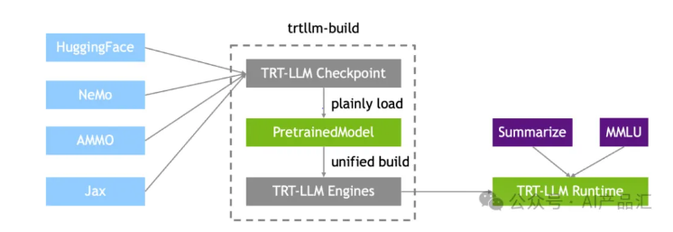

- 步骤1-**将源模型转换为TensorRT LLM支持的格式**，支持HuggingFace、NeMo、AMMO、Jax等多种格式，量化过程可选。
- 步骤2-利用统一的trtllm Build命令**构建TensorRT LLM引擎**；
- 步骤3-利用TensorRT LLM引擎来**执行模型的推理或评估操作**。

# 03-Lightllm

## 03.01-简介

**链接-***https://github.com/ModelTC/lightllm*

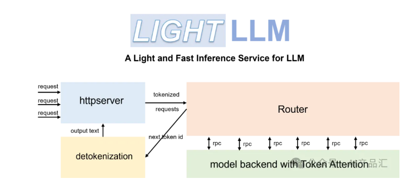

  **LightLLM是一个基于Python的LLM（大型语言模型）推理和服务框架，以其轻量级设计、易于扩展和高速性能而闻名。**LightLLM利用了许多备受好评的开源实现，包括但不限于FasterTransformer、TGI、vLLM和FlashAttention。如上图所示，该框架主要包含：httpserver、Router、带有Token注意力的模型后端、detokenization4部分组成。

## 03.02-特点

- **🤖️三进程异步协作--**标记化、模型推理和去标记化是异步执行的，这大大提高了GPU的利用率。
- **🤖️Nopad（Unpad）--**支持跨多个模型的Nopad注意力操作，以有效处理长度差异较大的请求。
- **🤖️动态批处理--**启用请求的动态批处理调度。
- **🤖️FlashAttention--**结合FlashAttendance以提高速度并减少推理过程中GPU内存占用。
- **🤖️张量并行性--**利用多个GPU上的张量并行性进行更快的推理。
- **🤖️令牌注意力--**实现令牌式的KV缓存内存管理机制，允许在推理过程中零内存浪费。
- **🤖️高性能路由器--**与Token Attention合作，精心管理每个令牌的GPU内存，从而优化系统吞吐量。
- **🤖️Int8KV缓存--**此功能将使令牌的容量几乎增加一倍。只有LLAMA支持。

03.03-样例代码

```python
# 1-运行服务
python -m lightllm.server.api_server 	\
--model_dir /path/llama-7B    			\
--host 0.0.0.0       					\
--port 8080         					\
--tp 1               					\
--max_total_token_num 120000			\

# 2-通过Python Query
import time
import requests
import json

url = 'http://localhost:8080/generate'
headers = {'Content-Type': 'application/json'}
data = {
    'inputs': 'What is AI?',
    "parameters": {
        'do_sample': False,
        'ignore_eos': False,
        'max_new_tokens': 1024,
    }
}
response = requests.post(url, headers=headers, data=json.dumps(data))
if response.status_code == 200:
    print(response.json())
else:
    print('Error:', response.status_code, response.text)
```


# 04-Text Generation Inference

## 04.01-简介

**链接-***https://github.com/huggingface/text-generation-inference*

  文本生成推理（TGI）是一个用于部署和服务大型语言模型（LLM）的工具包。**TGI能够为最流行的开源LLM实现高性能文本生成，包括Llama、Falcon、StarCoder、BLOOM、GPT-NeoX等。**它可以支持多种硬件，具体包括：NVIDIA GPU、AMD GPU、inferentia、Intel GPU、Habana Gaudi。

## 04.02-特点

- 📡 可以快速运行多种主流LLM的服务
- 📡 在多个GPU上实现张量并行性来实现更快的推理
- 📡 高度优化的transformer代码，用于在最流行的架构上使用Flash Attention和Paged Attention进行推理
- 📡 支持bitsandbytes、GPT-Q、EETQ、AWQ等多种量化方法
- 📡 安全的权重装载、能为大模型添加水印
- 📡 指定输出格式以加快推理速度，并确保输出在某些规范有效
- 📡 通过提供自定义提示来指导模型的输出，从而轻松生成文本
- 📡 支持微调支持，即利用微调模型执行特定任务，以实现更高的精度和性能

## 04.03-架构

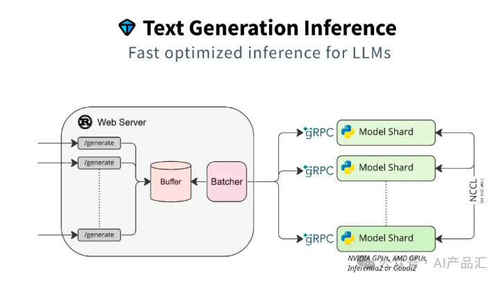

  上图展示了Text Generation Inference的整体架构，**主要包括Web Server、Buffer、Batcher、gRPC、NCCL等**。详细的步骤如下所示：

- 首先，若干个客户端同时请求**Web Server的“/generate”**服务；
- 然后，服务端会将这些请求在**“Buffer”组件处整合为一个Batch**，并通过gRPC协议转发请求给GPU推理引擎执行计算。
- 最后，通过**NCCL通信**来响应单个或者多个Model Shard的请求，这是因为显存容量有限或出于计算效率考虑，需要多张GPU进行分布式推理。

# 05-CTranslate2

## 05.01-简介

**链接-***https://github.com/OpenNMT/CTranslate2*

  CTranslate2是一个C++和Python库，用于使用Transformer模型执行高效推理。该项目实现了一个自定义运行时，该运行时应用了许多性能优化技术，如**权重量化、层融合、批量重新排序等，用来加速和减少CPU和GPU上Transformer模型的内存使用**。当前支持以下3中架构的模型：

- **编解码器架构**--Transformer base/big、M2M-100、NLLB、BART、mBART、Pegasus、T5、Whisper
- **仅解码器架构**--GPT-2、GPT-J、GPT NeoX、OPT、BLOOM、MPT、Llama、Mistral、Gemma、CodeGen、GPTBigCode、Falcon
- **仅编码器架构**--BERT, DistilBERT, XLM-RoBERTa

## 05.02-特点

- ⚡️支持在CPU和GPU上快速高效地执行
- ⚡️支持FP16、BF16、INT16、INT8多种量化方式
- ⚡️支持X86、AArch64/ARM64等多种CPU架构，支持英特尔MKL、oneDNN、OpenBLAS、Ruy和Apple Accelerate多种后端
- ⚡️根据后端CPU架构自动检测和代码调度
- ⚡️支持使用多个GPU或CPU内核并行和异步处理多个批处理
- ⚡️支持动态内存
- ⚡️几乎没有依赖项，并在Python和C++中公开了简单的API，以满足大多数集成需求
- ⚡️支持分布式推理阶段的张量并行

## 05.03-样例代码

```python

import ctranslate2
import sentencepiece as spm

translator = ctranslate2.Translator("ende_ctranslate2/", device="cpu")
sp = spm.SentencePieceProcessor("sentencepiece.model")

input_text = "Hello world!"
input_tokens = sp.encode(input_text, out_type=str)

results = translator.translate_batch([input_tokens])

output_tokens = results[0].hypotheses[0]
output_text = sp.decode(output_tokens)

print(output_text)
```


# 06-OpenLLM

## 06.01-简介

**链接-***https://github.com/bentoml/OpenLLM*

  OpenLLM是一个开源平台，旨在促进大型语言模型（LLM）在现实世界应用程序中的部署和应用。**它支持轻松地微调、服务、部署和监控任何LLM。使用OpenLLM，您可以在任何开源LLM上运行推理，将其部署在云或本地，并构建强大的人工智能应用程序。**

  OpenLLM是为人工智能应用程序开发人员设计的，他们致力于基于LLM构建可用于生产的应用程序。它提供了一套全面的工具和功能，**用于微调、服务、部署和监控这些模型，简化了LLM的端到端部署工作流程。**

## 06.02-特点

- 🚂 **最先进的LLM**--支持各种开源LLM和模型运行时，包括但不限于Llama 2、StableLM、Falcon、Dolly、Flan-T5、ChatGLM和StarCoder等。
- 🔥 **灵活的API**--使用单个命令通过RESTful API或gRPC为LLM提供服务。您可以使用Web UI、CLI、Python/JavaScript客户端或你选择的任何HTTP客户端与模型交互。
- ⛓️ **构建自由**--对LangChain、BentML、LlamaIndex、OpenAI端点和Huggingface的一流支持，使你能够通过将LLM与其他模型和服务组合来轻松创建自己的人工智能应用程序。
- 🎯 **优化部署**--通过自动生成LLM服务器Docker镜像或部署为无服务器端点☁️ BentCloud可以轻松管理GPU资源，根据流量进行扩展，并确保成本效益。
- 🤖️ **带上你自己的LLM**--支持微调任何LLM来满足你的需求。你可以加载LoRA层来微调模型，以获得特定任务的更高精度和性能。模型的统一微调API即将推出。
- ⚡ **量化**--支持LLM.int8、SpQR（int4）、AWQ、GPTQ和SqueezeLLM等量化技术，以较少的计算和内存成本运行推理。
- 📡 **流式传输**--支持通过服务器发送的事件（SSE）进行令牌流式传输。您可以使用/v1/generate_stream端点从LLM流式传输响应。
- 🔄 --通过vLLM支持连续批处理，以提高总吞吐量。

## 06.03-代码样例

```python
import transformers
agent = transformers.HfAgent('http://localhost:3000/hf/agent')  # URL that runs the OpenLLM serveragent.run('Is the following `text` positive or negative?', text="I don't like how this models is generate inputs")
```


# 07-RayLLM

## 07.01-简介

**链接-***https://github.com/ray-project/ray-llm*

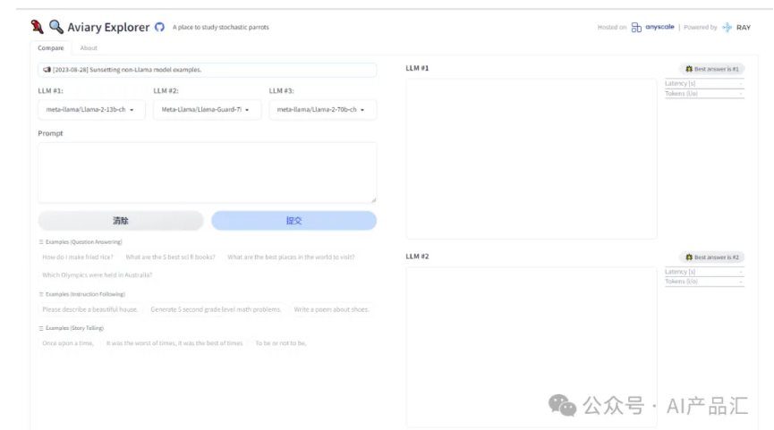

  **RayLLM（以前称为Aviary）是一种LLM服务解决方案，可以轻松地部署和管理基于Ray Serve的各种开源LLM。**

  除了LLM服务，它还包括一个CLI和一个web前端（Aviary Explorer），您可以使用它们直接比较不同型号的输出，按质量对其进行排名，获得成本和延迟估计，等等。

  RayLLM通过与vLLM集成，**支持连续批处理和量化。**与静态批处理相比，连续批处理可以获得更好的吞吐量和延迟。量化使您能够部署硬件需求更低、推理成本更低的压缩模型。有关在RayLLM上运行量化模型的更多详细信息，请参阅量化指南。

  RayLLM利用了Ray Serve，后者对自动缩放和多节点部署提供了本机支持。RayLLM可以扩展到零，并根据需求创建新的模型副本（每个副本由多个GPU工作人员组成）。

## 07.02-特点

- 🔥提供一套广泛的预配置开源LLM，默认值开箱即用。
- 🔥支持托管在Hugging Face Hub或本地磁盘上的Transformer模型。
- 🔥简化多个LLM的部署简化新LLM的添加提供独特的自动缩放支持，包括缩放到零。
- 🔥完全支持多GPU和多节点模型部署。
- 🔥提供高性能功能，如连续批处理、量化和流式传输。
- 🔥提供一个类似于OpenAI的REST API，使其易于迁移和交叉测试。
- 🔥支持开箱即用的多个LLM后端，包括vLLM和TensorRT LLM。

## 07.03-代码样例

```python
# 部署RayLLM
cache_dir=${XDG_CACHE_HOME:-$HOME/.cache}

docker run -it --gpus all --shm-size 1g -p 8000:8000 -e HF_HOME=~/data -v $cache_dir:~/data anyscale/ray-llm:latest bash
# Inside docker container
serve run ~/serve_configs/amazon--LightGPT.yaml
```


# 08-MLC-LLM

## 08.01-简介

**链接-***https://github.com/mlc-ai/mlc-llm*

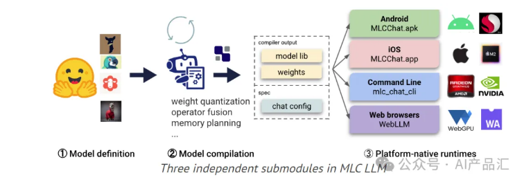

  **大型语言模型的机器学习编译（MLC LLM）是一种高性能的通用部署解决方案，它允许使用编译器加速的本地API对任何大型语言模型进行本地部署。**该项目的使命是使每个人都能使用ML编译技术在每个人的设备上本地开发、优化和部署人工智能模型。MLC-LLM项目由三个不同的子模块组成：**模型定义、模型编译和运行时**。

- **利用Python定义模型**。MLC提供各种预定义的体系结构，例如Llama（例如，Llama2、Vicuna、OpenLlama、Wizard）、GPT-NeoX（例如，RedPajama、Dolly）、RNN（例如，RWKV）和GPT-J（例如，MOSS）。**模型开发人员可以仅用纯Python定义模型，而不必涉及代码生成和运行时。**
- **利用Python执行模型编译**。模型由TVM Unity编译器编译，其中编译是用纯Python配置的。MLC LLM量化并导出基于Python的模型到模型库和量化的模型权重。量化和优化算法可以在纯Python中开发，以压缩和加速特定用例的LLM。
- **基于某平台运行**。每个平台上都提供了MLCChat的变体：C++用于命令行，Javascript用于web，Swift用于iOS，Java用于Android，可通过JSON聊天配置进行配置。应用程序开发人员只需要熟悉平台天真的运行时，就可以将MLC编译的LLM集成到他们的项目中。

## 08.02-特点

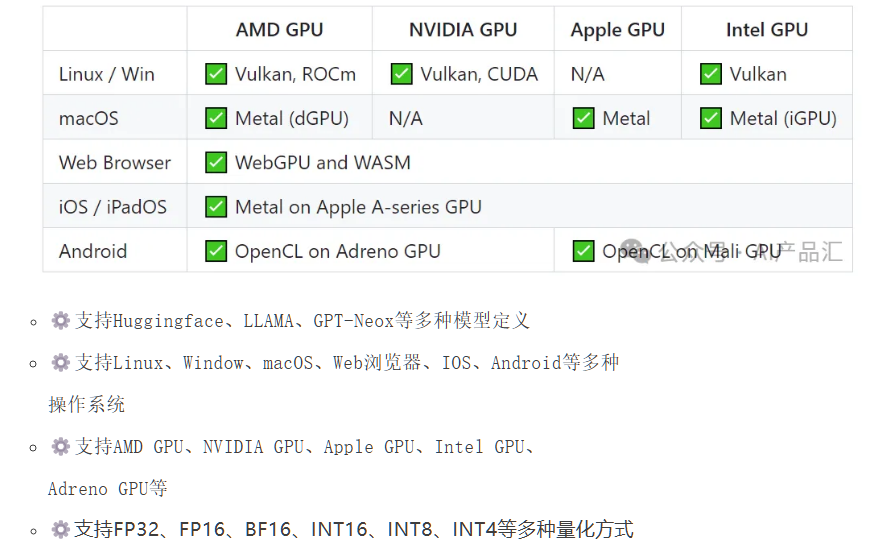

## 08.03-代码样例

```python
from mlc_llm.callback import StreamToStdout

cm = ChatModule(
    model="dist/Llama-2-7b-chat-hf-q4f16_1-MLC",
    model_lib_path="dist/prebuilt_libs/Llama-2-7b-chat-hf/Llama-2-7b-chat-hf-q4f16_1-cuda.so"
    # Vulkan on Linux: Llama-2-7b-chat-hf-q4f16_1-vulkan.so
    # Metal on macOS: Llama-2-7b-chat-hf-q4f16_1-metal.so
    # Other platforms: Llama-2-7b-chat-hf-q4f16_1-{backend}.{suffix}
)
cm.generate(prompt="What is the meaning of life?", progress_callback=StreamToStdout(callback_interval=2))
```

  上图展示了利用MLC-LLM的python接口调用Llama-2-7b模型，下图展示了相应的输出结果。

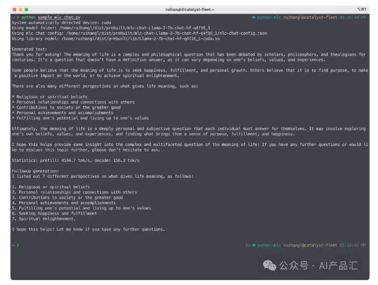

# 09-DeepSpeed-FastGen

## 09.01-简介

**链接-***https://github.com/microsoft/DeepSpeed/tree/master*

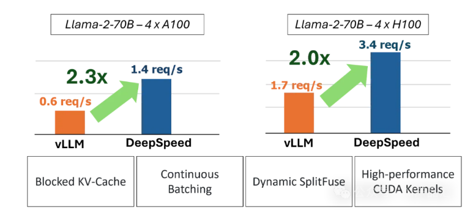

  **DeepSpeed FastGen是一个推理系统框架，可以为大型语言模型（LLM）实现简单、快速和负担得起的推理。**从通用聊天模型到文档摘要，从自动驾驶到软件栈每一层，大规模部署和服务这些模型的需求激增。DeepSpeed FastGen利用动态分割使用技术来解决为这些应用程序提供服务的独特挑战，并提供比vLLM等其他最先进的系统更高的有效吞吐量。

## 09.02-特点

- **🔌 支持新的模型家族**。作者在DeepSpeed FastGen中引入了对Mixtral（MoE）、Falcon和Phi-2模型族的支持。与vLLM等其他最先进的框架相比，作者对这些模型的推理优化提供了高达2.5倍的有效吞吐量改进。
- **🔌 性能优化**。大大降低了Dynamic SplitFuse的调度开销，并提高了令牌采样的效率。因此，我们看到了更高的吞吐量和更低的延迟，尤其是在处理来自许多客户端的并发请求时。
- **🔌 功能增强**。DeepSpeed FastGen包含一组丰富的功能，用于运行许多不同模型族和20000多个HuggingFace托管模型的推理。作者为所有模型扩展了这一功能集，以包括RESTful API、更多的生成选项，以及对使用安全张量检查点格式的模型的支持。

## 09.03-架构

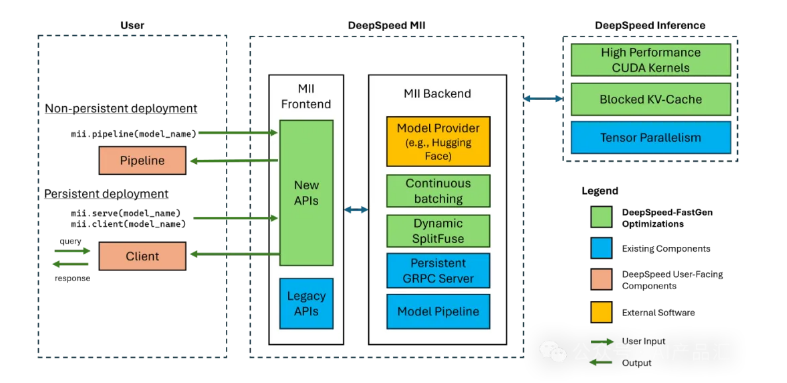

  如上图所示，DeepSpeed FastGen将DeepSpeed MII和DeepSpeed推理的协同组合在一起。这两个软件包一起提供了系统的各种组件，包括前端API、使用Dynamic SplitFuse调度批处理的主机和设备基础设施、优化的内核实现以及构建新模型实现的工具。

  **DeepSpeed MII主要包括Mll前端与Mll后端，前端支持各种API，后端支持各种优化技术。DeepSpeed Inference包括了一些针对CUDA Kernel的优化实现、基于块的KV-Cache机制和张量并行机制。**

# 10-InferLLM

## 10.01-简介

**链接-***https://github.com/MegEngine/InferLLM*

  **InferLLM 是一个非常轻量的 LLM 模型推理框架，主要参考和借鉴了 llama.cpp 工程。**llama.cpp 几乎所有核心代码和 kernel 都放在一两个文件中，并且使用了大量的宏，阅读和修改起来都很不方便，对开发者有一定的门槛。InferLLM 主要有以下特点：

- 结构简单，方便上手开发和学习，把框架部分和 Kernel 部分进行了解耦
- 运行高效，将 llama.cpp 中大多数的 kernel 都进行了移植
- 定义了专门的 KVstorage 类型，方便缓存和管理
- 可以兼容多种模型格式（支持 alpaca 中文和英文的 int4 模型）
- 目前支持 CPU 和 GPU，专门为 Arm，x86，CUDA，riscv-vector平台优化，可以在手机上部署，速度在可以接受的范围

  总而言之，**InferLLM 是一个简单高效的 LLM CPU 推理框架，可以本地部署 LLM 中的量化模型，推理速度还不错。**

## 10.02-代码样例

```
# 步骤1-从https://huggingface.co/kewin4933/InferLLM-Model/tree/main下载模型
# 步骤2-编译InferLLM
mkdir build
cd build
cmake ..
make

# 步骤3-在本地X86上面执行
./llama -m chinese-alpaca-7b-q4.bin -t 4

# 步骤4-输出效果见下图
```

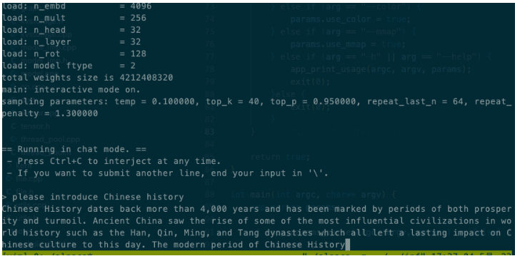

# 11-llama.cpp

## 11.01-简介

**链接-***https://github.com/ggerganov/llama.cpp*

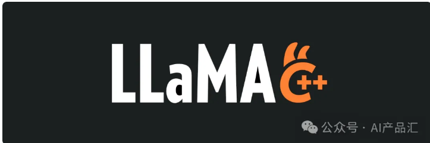

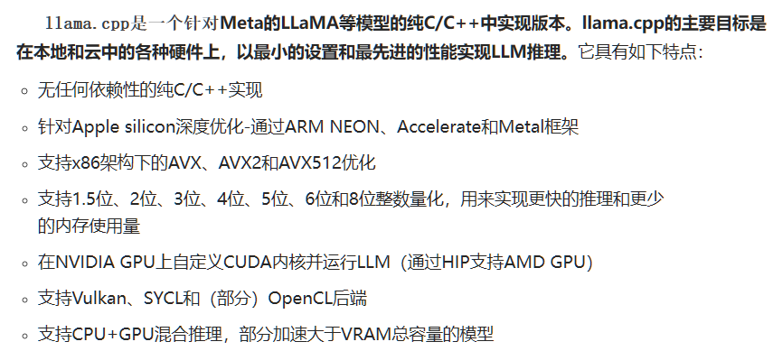


# 12-rtp-llm

## 12.01-简介

**链接***-https://github.com/alibaba/rtp-llm*


  rtp-llm 是阿里巴巴大模型预测团队开发的 LLM 推理加速引擎。rtp-llm 在阿里巴巴内部被广泛使用，**支持了包括淘宝、天猫、闲鱼、菜鸟、高德、饿了么、AE、Lazada 等多个部门的大模型推理业务。**

## 12.02-特点

- **🖥 实战验证**
  - 在多个LLM场景中得到实际应用与检验
- **🖥 高性能**
  - 使用高性能的 CUDA kernel, 包括 PagedAttention、FlashAttention、FlashDecoding 等
  - WeightOnly INT8 量化，加载时自动量化
  - 自适应 KVCache 量化
  - 框架上对动态凑批的 overhead 进行了细致优化
  - 对 V100 进行了特别优化
- **🖥 灵活易用**
  - 与HuggingFace 无缝对接，支持 SafeTensors/Pytorch/Megatron 等多种权重格式
  - 单模型实例同时部署多 LoRA 服务
  - 多模态(图片和文本混合输入)
  - 多机/多卡 Tensor 并行
  - P-tuning 模型
- **🖥 高级加速**
  - 剪枝后的不规则模型加载
  - 多轮对话上下文 Prefix Cache
  - System Prompt Cache
  - Speculative Decoding
  - Medusa

12.03-代码样例

```python

# 读取Huggingface模型

from maga_transformer.pipeline import Pipeline
from maga_transformer.model_factory import ModelFactory

if __name__ == '__main__':
    model = ModelFactory.from_huggingface("Qwen/Qwen-1_8B-Chat")
    pipeline = Pipeline(model, model.tokenizer)
    for res in pipeline(["<|im_start|>user\nhello, what's your name<|im_end|>\n<|im_start|>assistant\n"], max_new_tokens = 100):
        print(res.batch_response)
    pipeline.stop()
```

# 13-PowerInfer

## 13.01-简介

**链接**-*https://github.com/SJTU-IPADS/PowerInfer*


  **PowerInfer是一种在配备单一消费级GPU的个人计算机（PC）上的高速大型语言模型（LLM）推理引擎。**PowerInfer设计的关键是利用LLM推理中固有的高局部性，其特征是神经元激活中的幂律分布。

  这种分布表明，一小部分神经元（称为热神经元）在输入时始终被激活，而大多数神经元（冷神经元）则根据特定输入而变化。PowerInfer利用这一见解设计了GPU-CPU混合推理引擎：热激活神经元被预加载到GPU上以实现快速访问，而冷激活神经元则在CPU上进行计算，从而显著减少GPU内存需求和CPU-GPU数据输。      

  PowerInfer进一步集成了自适应预测器和神经元感知稀疏算子，优化了神经元激活的效率和计算稀疏性。评估显示，**PowerInfer在单个NVIDIA RTX 4090 GPU上的各种LLM（包括OPT-175B）中的平均代币生成率为13.20代币/s，峰值为29.08代币/s，仅比顶级服务器级A100 GPU低18%。这显著优于llama.cpp高达11.69倍，同时保持了模型的准确性。**

## 13.02-特点

- 🍭利用稀疏激活和“热”/“冷”神经元概念进行有效的LLM推理
- 🍭整合了CPU和GPU的内存/计算能力，实现了平衡的工作负载和更快的处理
- 🍭兼容流行的ReLU稀疏模型
- 🍭针对消费级硬件上的本地部署进行了设计和深度优化，实现了低延迟LLM推理
- 🍭兼容llama.cpp
- 🍭支持Windows、Linux、Macos

## 13.03-性能评估

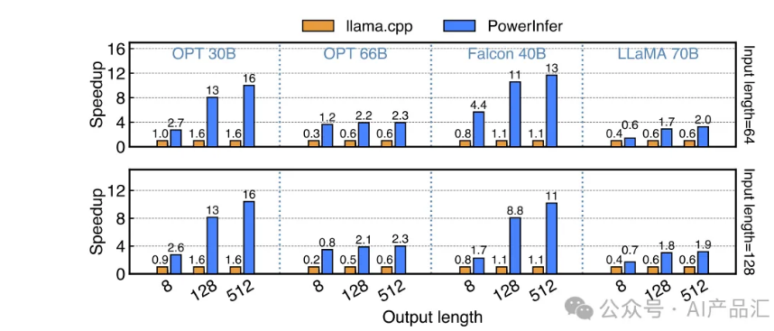

  上图展示了作者在一个RTX 4090（24G）GPU上面评估了PowerInfer与llama.cpp在长度为64的输入下的一系列FP16 ReLU模型，结果如下所示。**PowerInfer在Falcon 40B上实现了高达11倍的加速，在Llama 2 70B上实现高达3倍的加速。**

# 14-XInference

## 14.01-简介

**链接-***https://github.com/xorbitsai/inference/*

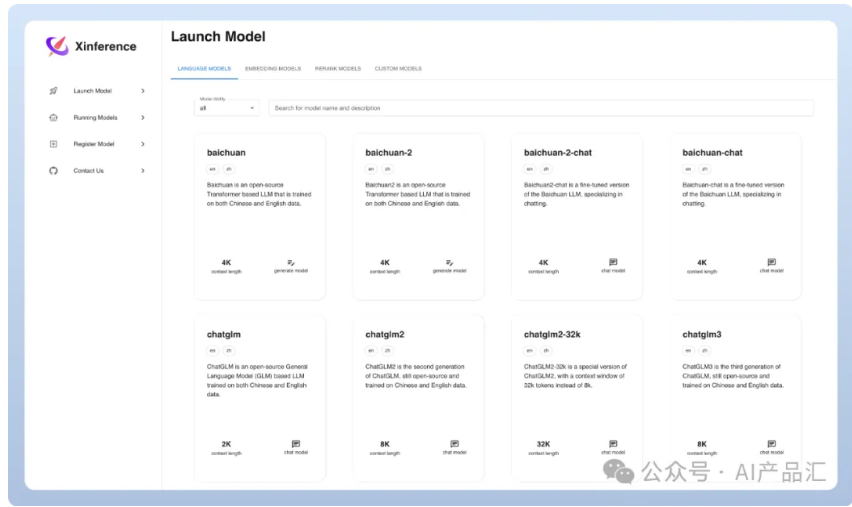

  **Xorbits Inference（Xinference）是一个性能强大且功能全面的分布式推理框架。可用于大语言模型（LLM），语音识别模型，多模态模型等各种模型的推理。**通过 Xorbits Inference，你可以轻松地一键部署你自己的模型或内置的前沿开源模型。无论你是研究者，开发者，或是数据科学家，都可以通过 Xorbits Inference 与最前沿的 AI 模型，发掘更多可能。

## 14.02-特点

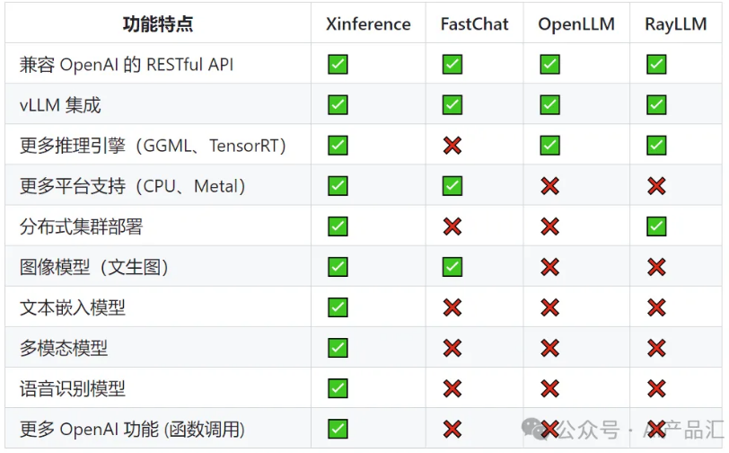

- 🌟 **模型推理，轻而易举--**大语言模型，语音识别模型，多模态模型的部署流程被大大简化。一个命令即可完成模型的部署工作。
- ⚡️ **前沿模型，应有尽有--**框架内置众多中英文的前沿大语言模型，包括 baichuan，chatglm2 等，一键即可体验！内置模型列表还在快速更新中！
- 🖥 **异构硬件，快如闪电--**通过 ggml，同时使用你的 GPU 与 CPU 进行推理，降低延迟，提高吞吐！
- ⚙️ **接口调用，灵活多样--**提供多种使用模型的接口，包括 OpenAI 兼容的 RESTful API（包括 Function Calling），RPC，命令行，web UI 等等。方便模型的管理与交互。
- 🌐 **集群计算，分布协同**--支持分布式部署，通过内置的资源调度器，让不同大小的模型按需调度到不同机器，充分使用集群资源。
- 🔌 **开放生态，无缝对接**--与流行的三方库无缝对接，包括 LangChain，LlamaIndex，Dify，以及 Chatbox。

# 15-FastChat

## 15.01-简介

**链接-***https://github.com/lm-sys/FastChat*

  **FastChat是一个用于培训、服务和评估基于大型语言模型的聊天机器人的开放平台。FastChat为聊天机器人竞技场提供动力，为50多个LLM提供超过600万个聊天请求。**Chatbot Arena从LLM的并排战斗中收集了超过20万张人类选票，编制了一个在线LLM Elo排行榜。FastChat的核心功能包括：1）最先进模型（如Vicuna、MT Bench）的培训和评估代码。2）一个分布式多模型服务系统，具有web UI和与OpenAI兼容的RESTful API。

## 15.02-模型推理

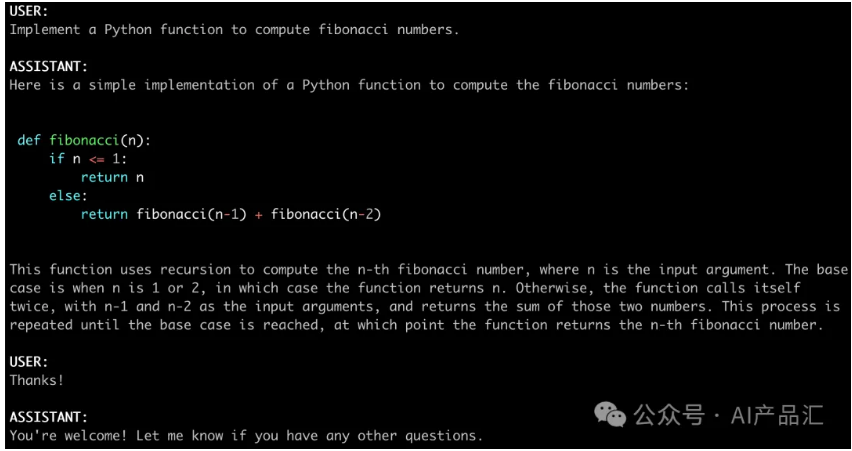

```python
# 单一GPU运行 Vicuna-7B，需要14G显存，执行Vicuna-13B需要28G显存
python3 -m fastchat.serve.cli --model-path lmsys/vicuna-7b-v1.5

# 多GPU执行
python3 -m fastchat.serve.cli --model-path lmsys/vicuna-7b-v1.5 --num-gpus 2

# 这只在CPU上运行，不需要GPU。Vicuna-7B需要大约30GB的CPU内存，Vicuna-13B需要大约60GB的CPU存储器。
python3 -m fastchat.serve.cli --model-path lmsys/vicuna-7b-v1.5 --device cpu
```

# 16-PPL_LLM

## 16.01-简介

**链接-***https://github.com/openppl-public/ppl.nn.llm*

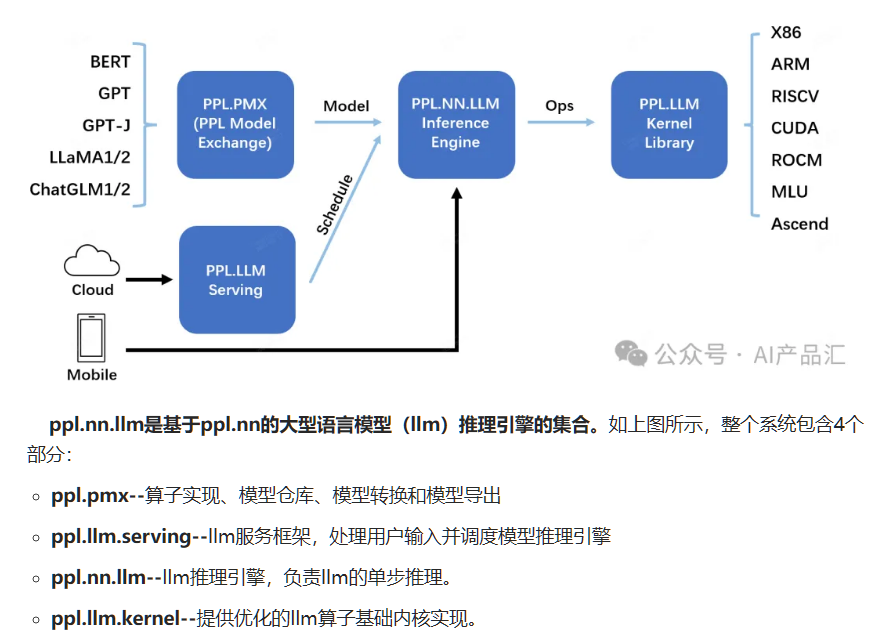

## 16.02-特点


## 16.03-性能评估

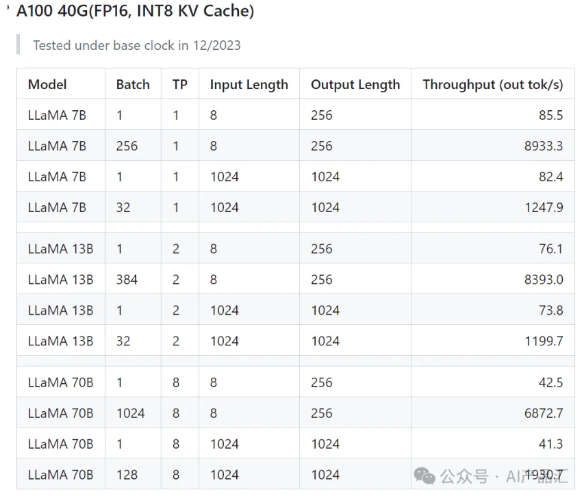

# 17-BentoML

## 17.01-简介

**链接-***https://github.com/bentoml/BentoML*

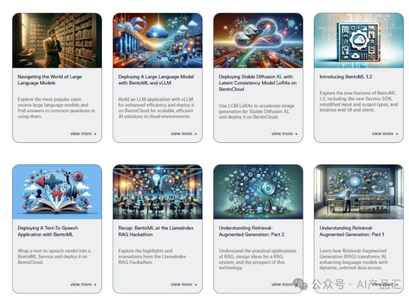

  **BentML是一个用于构建可靠、可扩展和经济高效的人工智能应用程序的框架。它提供了模型服务、应用程序打包和生产部署所需的一切。**  

  BentML提供了使用您的团队喜欢的任何工具构建任何人工智能应用程序的灵活性和易用性。无论您是想从任何模型中心导入模型，还是想自带使用PyTorch和TensorFlow等框架构建的模型，您都可以使用BentML的本地模型库来管理它们并在此基础上构建应用程序。**BentML为大型语言模型（LLM）推理、生成人工智能、嵌入创建和多模式人工智能应用程序提供原生支持。**

## 17.02-特点

- 🍱 Bento是人工智能应用程序的容器
- 🏄 支持自由构建任何人工智能模型
- 🤖️ 支持人工智能应用的推理与优化
- 🍭 简化现代人工智能应用架构
- 🚀 用户可以随时随地部署

## 17.03-部署流程

**步骤1**-安装依赖

```bash

git clone https://github.com/bentoml/quickstart.git
cd quickstart
pip install -r requirements.txt
```


**步骤2**-创建BentoML服务


```python

from __future__ import annotations
import bentoml
from transformers import pipeline

EXAMPL_INPUT = "Breaking News: In an astonishing turn of events, the small town of Willow Creek has been taken by storm as local resident Jerry Thompson's cat, Whiskers, performed what witnesses are calling a 'miraculous and gravity-defying leap.' Eyewitnesses report that Whiskers, an otherwise unremarkable tabby cat, jumped a record-breaking 20 feet into the air to catch a fly. The event, which took place in Thompson's backyard, is now being investigated by scientists for potential breaches in the laws of physics. Local authorities are considering a town festival to celebrate what is being hailed as 'The Leap of the Century."

@bentoml.service(
    resources={"cpu": "2"},
    traffic={"timeout": 10},
)
class Summarization:
    def __init__(self) -> None:
        self.pipeline = pipeline('summarization')

    @bentoml.api
    def summarize(self, text: str = EXAMPLE_INPUT) -> str:
        result = self.pipeline(text)
        return result[0]['summary_text']
```

**步骤3**-运行BentoML服务

```
bentoml serve service:Summarization
```

**步骤4**-执行交互操作

```
curl -X 'POST' \
    'http://localhost:3000/summarize' \
    -H 'accept: text/plain' \
    -H 'Content-Type: application/json' \
    -d '{
    "text": "Breaking News: In an astonishing turn of events, the small town of Willow Creek has been taken by storm as local resident Jerry Thompson'\''s cat, Whiskers, performed what witnesses are calling a '\''miraculous and gravity-defying leap.'\'' Eyewitnesses report that Whiskers, an otherwise unremarkable tabby cat, jumped a record-breaking 20 feet into the air to catch a fly. The event, which took place in Thompson'\''s backyard, is now being investigated by scientists for potential breaches in the laws of physics. Local authorities are considering a town festival to celebrate what is being hailed as '\''The Leap of the Century."
    }'
```

# 18-fastllm

## 18.01-简介

**链接-***https://github.com/ztxz16/fastllm*

  **fastllm是一个纯c++实现，无第三方依赖的高性能大模型推理库。**6~7B级模型在安卓端上也可以流畅运行。6B级int4模型单4090延迟最低约5.5ms，6B级fp16模型单4090最大吞吐量超过10000 token/s，6B级int4模型在骁龙865上速度大约为4~5 token/s。

## 18.02-特点

- 🚀 纯c++实现，便于跨平台移植，可以在安卓上直接编译
- 🚀 ARM平台支持NEON指令集加速，X86平台支持AVX指令集加速，NVIDIA平台支持CUDA加速，各个平台速度都很快就是了
- 🚀 支持浮点模型（FP32), 半精度模型(FP16), 量化模型(INT8, INT4) 加速
- 🚀 支持多卡部署，支持GPU + CPU混合部署
- 🚀 支持Batch速度优化
- 🚀 支持并发计算时动态拼Batch
- 🚀 支持流式输出，很方便实现打字机效果
- 🚀 支持python调用
- 🚀 前后端分离设计，便于支持新的计算设备
- 🚀 目前支持ChatGLM系列模型，各种LLAMA模型(ALPACA, VICUNA等)，BAICHUAN模型，QWEN模型，MOSS模型，MINICPM模型等

## 18.03-运行Demo

```python
# 步骤1-编译运行环境
cd fastllm
mkdir build
cd build
cmake .. -DUSE_CUDA=ON # 如果不使用GPU编译，那么使用 cmake .. -DUSE_CUDA=OFF
make -j

# 步骤2-安装python包
cd tools # 这时在fastllm/build/tools目录下
python setup.py install

# 步骤3-运行demo
# 这时在fastllm/build目录下
# 命令行聊天程序, 支持打字机效果 (只支持Linux）
./main -p model.flm 

# 简易webui, 使用流式输出 + 动态batch，可多路并发访问
./webui -p model.flm --port 1234 
# python版本的命令行聊天程序，使用了模型创建以及流式对话效果
python tools/cli_demo.py -p model.flm 

# python版本的简易webui，需要先安装streamlit-chat
streamlit run tools/web_demo.py model.flm
```

# 19-JittorLLM

## 19.01-简介

**链接-***https://github.com/Jittor/JittorLLMs*

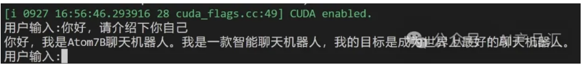

**JittorMML是一个计图大模型推理库，它的目标是让没有显卡的笔记本电脑也能跑大模型。**该框架具有如下特点：

- **🍱 成本低--**相比同类框架，本库可大幅降低硬件配置要求（减少80%），没有显卡，2G内存就能跑大模型，人人皆可在普通机器上，实现大模型本地部署；是目前已知的部署成本最低的大模型库；
- **🍱 支持广**--目前支持了大模型包括：ChatGLM大模型；鹏程盘古大模型；BlinkDL的ChatRWKV；Meta的LLaMA/LLaMA2大模型；MOSS大模型；Atom7B大模型 后续还将支持更多国内优秀的大模型，统一运行环境配置，降低大模型用户的使用门槛。
- **🍱 可移植--**用户不需要修改任何代码，只需要安装Jittor版torch(JTorch)，即可实现模型的迁移，以便于适配各类异构计算设备和环境。
- **🍱 速度快--**大模型加载速度慢，Jittor框架通过零拷贝技术，大模型加载开销降低40%，同时，通过元算子自动编译优化，计算性能相比同类框架提升20%以上。

## 19.02-架构

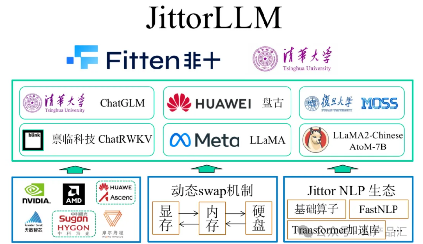

  上图展示了JittorLLM的整体框架。它的最底层是硬件层，当前支持NVIDIA GPU、AMD GPU、Ascend GPU、天数智芯、中科海光和摩尔线程。它支持动态swap机制，即在显存、内存与硬盘之间动态swap，它可以进一步的提升算法的运行速率。Jittor具有NLP生态，底层包含了一些基础算子库、FastNLP库和Transformer加速库等。**基于这些底层基建，JittorLLM上层可以支持ChatGLM、ChatRWKV、华为盘古、LLaMA、复旦的MOSS等多种大模型。**

## 19.03-部署方法

```python

# 步骤1-安装运行环境
# 国内使用 gitlink clone
git clone https://gitlink.org.cn/jittor/JittorLLMs.git --depth 1
# github: git clone https://github.com/Jittor/JittorLLMs.git --depth 1
cd JittorLLMs
# -i 指定用jittor的源， -I 强制重装Jittor版torch
pip install -r requirements.txt -i https://pypi.jittor.org/simple -I

# 步骤2-运行Demo
python cli_demo.py [chatglm|pangualpha|llama|chatrwkv|llama2|atom7b]
```

# 20-LMDeploy

## 20.01-简介

**链接-***https://github.com/InternLM/lmdeploy/*

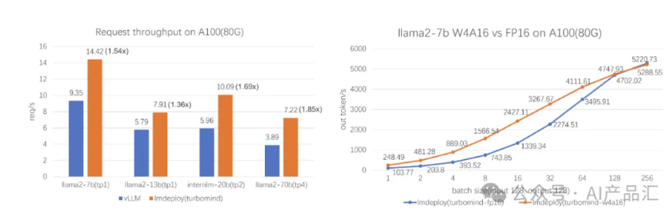

  **LMDeploy 由 MMDeploy 和 MMRazor 团队联合开发，是涵盖了 LLM 任务的全套轻量化、部署和服务解决方案。**LMDeploy支持 2.种推理引擎，即urboMind和 PyTorch它们侧重不同。前者追求推理性能的极致优化，后者用纯Python开发，着重降低开发者的门槛。这个强大的工具箱提供以下核心功能：

- **💪 高效的推理**：LMDeploy 开发了 Persistent Batch(即 Continuous Batch)，Blocked K/V Cache，动态拆分和融合，张量并行，高效的计算 kernel等重要特性。推理性能是 vLLM 的 1.8 倍
- **💪 可靠的量化**：LMDeploy 支持权重量化和 k/v 量化。4bit 模型推理效率是 FP16 下的 2.4 倍。量化模型的可靠性已通过 OpenCompass 评测得到充分验证。
- **💪 便捷的服务**：通过请求分发服务，LMDeploy 支持多模型在多机、多卡上的推理服务。
- **💪 有状态推理**：通过缓存多轮对话过程中 attention 的 k/v，记住对话历史，从而避免重复处理历史会话。显著提升长文本多轮对话场景中的效率。

  **LMDeploy TurboMind 引擎拥有卓越的推理能力，在各种规模的模型上，每秒处理的请求数是 vLLM 的 1.36 ~ 1.85 倍。在静态推理能力方面，TurboMind 4bit 模型推理速度（out token/s）远高于 FP16/BF16 推理。在小 batch 时，提高到 2.4 倍。**

## 20.02-架构

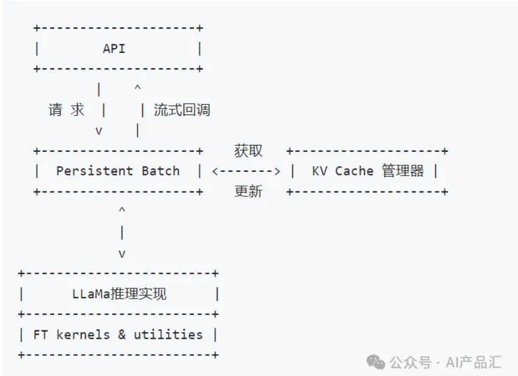

  上图展示了TurboMind 推理引擎的整体框架，它是一款关于 LLM 推理的高效推理引擎，基于英伟达的 FasterTransformer 研发而成。**它的主要功能包括：LLaMa 结构模型的支持，persistent batch 推理模式和可扩展的 KV 缓存管理器。**

  除了上文中提到的功能外，TurboMind 相较于 FasterTransformer 还有不少差别。譬如不少 FasterTransformer 的功能在 TurboMind 中都被去掉了，这其中包括前缀提示词、 beam search 、上下文 embedding、稀疏化 GEMM 操作和对应 GPT 或 T5 等结构的模型的支持等等。

## 20.03-代码样例

```python

# 步骤1-安装
pip install lmdeploy

# 步骤2-离线批处理
# LMDeploy 默认从 HuggingFace 上面下载模型，如果要从 ModelScope 上面下载模型，请通过命令 pip install modelscope 安装ModelScope，并设置环境变量：
export LMDEPLOY_USE_MODELSCOPE=True
import lmdeploy
pipe = lmdeploy.pipeline("internlm/internlm-chat-7b")
response = pipe(["Hi, pls intro yourself", "Shanghai is"])
print(response)
```

# 21-OneDiffusion

## 21.01-简介

**链接-***https://github.com/bentoml/OneDiffusion*

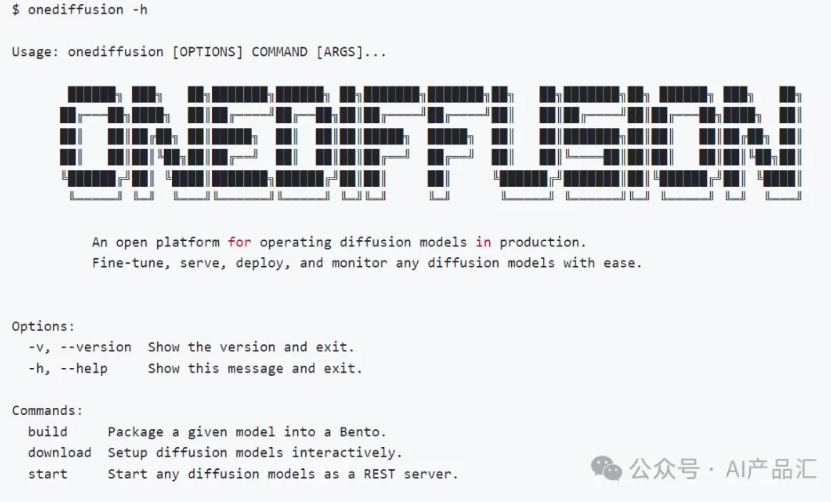

  **OneDiffusion是一个开源的一站式仓库，用于促进任何扩散模型在生产中的部署。**它专门满足了扩散模型的需求，支持使用LoRA适配器的预训练和微调扩散模型。目前，OneDiffusion支持以下型号：SDv1.4、v1.5和v2.0、SDXL v1.0稳定扩散XL Turbo。

  OneDiffusion是为人工智能应用程序开发人员设计的，他们需要一个强大而灵活的平台来在生产中部署扩散模型。**该平台提供了有效微调、服务、部署和监控这些模型的工具和功能，简化了扩散模型部署的端到端工作流程。**

## 21.02-特点

- 🌐 **强大的兼容性**--它支持预训练和LoRA自适应的扩散模型，为各种图像生成任务选择和部署合适的模型提供了灵活性。
- 💪 **优化的性能和可扩展性**--支持自动选择最佳优化，如半精度权重或xFormers，以实现开箱即用的最佳推理速度。
- ⌛️ **动态加载LoRA适配器-**-根据每个请求动态加载和卸载LoRA适配器，提供更大的适应性，并确保模型对不断变化的输入和条件保持响应。
- 🍱 **对BentML的强力支持**--与BentML生态系统无缝集成，允许您构建Bentos并将其推送到BentoCloud。

## 21.03-代码样例

```bash
# 步骤1-安装OneDiffusion
pip install onediffusion

# 步骤2-执行stable-diffusion服务
onediffusion start stable-diffusion

# 步骤3-这将在http://0.0.0.0:3000/启动服务器.您可以通过访问web UI与它进行交互，也可以通过curl发送请求。
curl -X 'POST' \
  'http://0.0.0.0:3000/text2img' \
  -H 'accept: image/jpeg' \
  -H 'Content-Type: application/json' \
  --output output.jpg \
  -d '{
  "prompt": "a bento box",
  "negative_prompt": null,
  "height": 768,
  "width": 768,
  "num_inference_steps": 50,
  "guidance_scale": 7.5,
  "eta": 0
}'
```

# 22-Neural Compressor

## 22.01-简介

**链接-***https://www.github-zh.com/projects/281528773-neural-compressor*

  英特尔的神经网络压缩器旨在为主流框架（如TensorFlow、PyTorch、ONNX Runtime和MXNet）以及英特尔扩展（如TensorFlow的英特尔扩展和PyTorch的英特尔扩展）提供流行的模型压缩技术，如量化、修剪（稀疏性）、蒸馏和神经架构搜索。特别是，该工具提供了以下关键特性：

- **支持多种英特尔硬件。**如经过广泛测试的英特尔至强可扩展处理器、英特尔至强CPU Max系列、英特尔数据中心GPU Flex系列和英特尔数据中心GPU Max系列；通过ONNX Runtime支持AMD CPU、ARM CPU和NVidia GPU，并进行有限的测试通过零代码优化解决方案神经编码器和自动精度驱动的量化策略，
- **通过利用零代码优化解决方案神经编码器和自动精度驱动的量化策略来支持主流的LLM**，如LLama2、Falcon、GPT-J、Bloom、OPT，以及来自流行模型中心的10000多个广泛模型，如Stable Diffusion、BERT Large和ResNet50，如Huggingface、Torch Vision和ONNX模型仓库。
- 与谷歌云平台、亚马逊网络服务和Azure等云市场，阿里云、腾讯TACO和微软Olive等软件平台，以及Huggingface、PyTorch、ONNX、ONNXRuntime和Lightning AI等开放人工智能生态系统合作。

## 22.02-架构

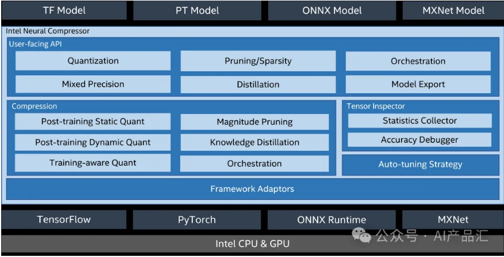

  上图展示了Neural Compressor的整体架构。该框架支持不同格式的模型，如图中的TF模型、PT模型、ONNX模型和MXNet模型。一旦将不同的模型导入之后，用户就可以执行一系列的优化操作，**主要的优化策略包括：PTQ与QAT量化、裁剪/稀疏化、蒸馏、混合精度等。除此之外，还包含一个自动微调优化策略。**紧挨着的是不同框架的适配器，包括：TensorFlow、PyTorch、ONNXRuntime、MXNet等。最底层的硬件层包含了Intel的CPU与GPU。

## 22.03-工作流

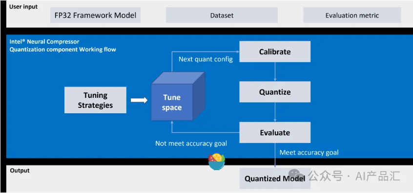

  上图展示了Neural Compressor的量化元件的具体工作流。该模块的输入包括：FP32格式的模型文件、标定数据、评估矩阵。**优化阶段会利用一些微调策略来微调搜索空间，即通过标定、量化与评估3个步骤来循环优化，直到满足精度指标。**该模块的输出是量化好的模型文件。

# 23-TACO-LLM

## 23.01-简介

**链接-***https://cloud.tencent.com/developer/article/2359653*

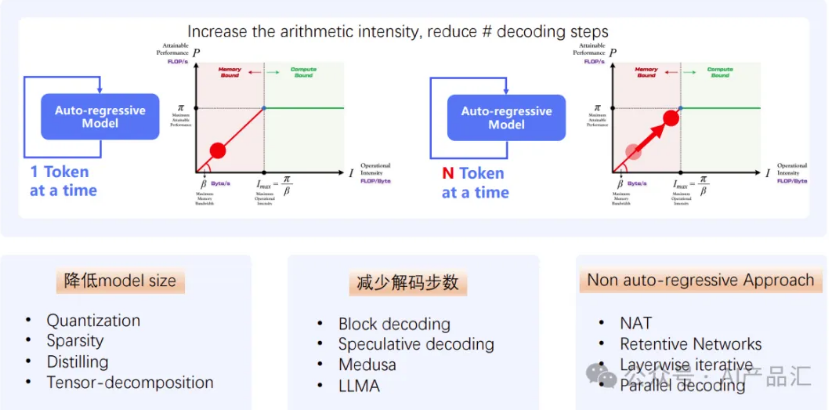

  **TACO-LLM 是基于腾讯云异构计算产品推出的一款大语言模型推理加速引擎，用于提高语言模型的推理效能。**通过充分利用计算资源的并行计算能力，TACO-LLM能够同时处理更多的语言模型推理请求，已成功为客户提供了兼顾高吞吐和低时延的优化方案，吞吐性能提高了78%。TACO-LLM可以减少生成结果的等待时间，提高推理流程效率，助您优化业务成本。**需要注意的是，该推理引擎当前并没有开源哈！**  

  TACO-LLM适用于生成式语言模型的推理加速业务，可满足多种业务场景下推理提效的需求。以下是一些典型业务场景：1) **时延敏感的在线对话系统; 2)** **高吞吐的离线文本生成; 3)****高并发的搜索工具辅助。**

## 23.02-特点

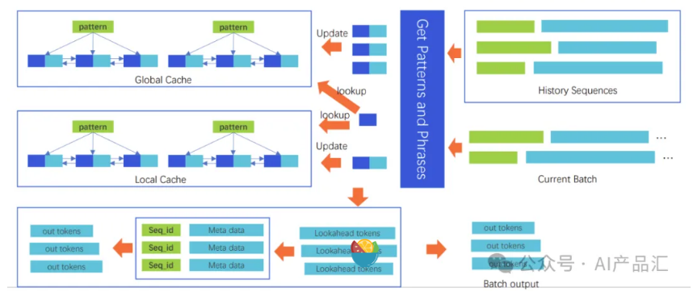

- **基于批处理的Lookahead Cache**
  - 💪一次预测批量请求；
  - 💪根据batch-size和各个请求的命中率，对copy_len自适应惩罚； 
  - 💪基于森林的多分支预测方法；

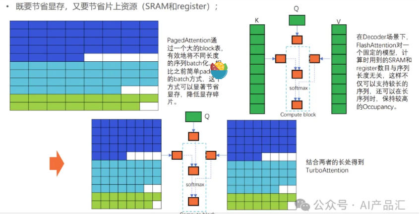

- **支持TurboAttention**
  - 💪基于Paged Attention 
  - 💪借鉴融合FlashAttention，节省显存同时解耦片上资源； 
  - 💪Lookahead将向量和矩阵运算，转化为矩阵和矩阵的运算，有效 leverage GPU tensor-core加速； 
  - 💪在Head维使用Double Buffer，实现访存与计算overlap，同时将片上资源与head-size大小解耦。

# 24-MindSpore

## 24.01-简介

**链接-***https://www.mindspore.cn/*


  **MindSpore是一种适用于端边云场景的新型开源深度学习训练/推理框架。**它提供了友好的设计和高效的执行，旨在提升数据科学家和算法工程师的开发体验，并为Ascend AI处理器提供原生支持，以及软硬件协同优化。

  **MindSpore则采用的是代码变换法。**一方面，它支持自动控制流的自动微分，因此像PyTorch这样的模型构建非常方便。另一方面，MindSpore可以对神经网络进行静态编译优化，以获得更好的性能。

  MindSpore自动微分的实现可以理解为程序本身的符号微分。**MindSpore IR是一个函数中间表达式，它与基础代数中的复合函数具有直观的对应关系。复合函数的公式由任意可推导的基础函数组成。**MindSpore IR中的每个原语操作都可以对应基础代数中的基本功能，从而可以建立更复杂的流控制。

## 24.02-特点


- ⌛️ 支持训推一体
- ⌛️ 支持细粒度调度、虚拟KV缓存、PD混合部署、前后处理Pipeline并行等
- ⌛️ 支持LIama2、GLM2、GPT2、Baichuan2、Qwen、SD等多种主流LLM
- ⌛️ 支持多维混合并行、内存优化、执行序编排等调度能力
- ⌛️ 支持自研的大模型量化、剪枝等方法，压缩率提升10倍+
- ⌛️ 支持10+个大算子融合，极大的降低了带宽负载

## 24.03-架构


  上图展示了MindSpore的整体架构。**第一层展示了该框架的应用层，它为用户提供了众多的工具链**，具体包括：视觉、NLP、Audio等模型仓库、强化学习扩展工具、科学计算扩展工具、性能调试与分析工具等。

  **第二层是API接口层，它为用户提供了全场景统一的API接口，**主要包括：NN、Ops、数据装载、模型训练与推理、Julia前端等。

  **第三层是性能优化层，它为用户提供了众多的模型优化手段，主要分为数据优化与AI编译器优化两个主要的模块。**前者关注于数据的加载、格式化、加速与增强；后者更关注于量化、蒸馏、剪枝、并行、微分、图融合等策略。

  **第四层是Runtime运行层，**该层用来给用户提供一个全场景统一部署的运行环境，用户可以利用它快速的将训练好的模型部署到不同的硬件平台上面。

  **最后一层是驱动+硬件层，它支持云+边+端等多种不同类型的硬件，具体包括：CPU、GPU以及NPU。**大到高性能的云服务器，中到各种各样的边缘计算设备，小到各种各样的端侧运行设备。

# 25-HuggingFace

## 25.01-简介

**链接-***https://huggingface.co/*


  **HuggingFace是一家总部位于纽约的聊天机器人初创服务运营商,他们的初衷是打算创业做聊天机器人，并在github上开源了一个Transformers库。**虽然聊天机器人业务并没有搞起来，但是它们的这个Transformer库在ML社区得到了快速的发展。目前已经共享了超400k+个预训练模型、150k+的应用和100k+个数据集。

  他之所以能够取得如此大的成功，主要归功于两个方面：**1）它的上手门槛比较低，可以让很多甲方企业的小白，尤其是入门者也能快速用得上科研大佬们训练出的大模型。2）另一方面是，它所倡导的开放的文化与态度，深度的吸引了很多人。**

25.02-特点


- **🌐 开源模型库**--它里面包含了许多领先的预训练语言模型,如BERT、GPT等,开发者可以直接使用这些模型,也可以基于已有模型进行进一步训练。
- **🌐 支持在线模型查询**--提供模型在线查询接口,可以查看模型详情、引用信息等。
- **🌐 支持在线模型训练--**直接在HuggingFace平台上完成模型的参数训练任务,也支持自定义模型的训练与分享。
- **🌐 支持项目管理**--支持开发者管理项目、模型版本、实验记录等。
- **🌐 提供多种SDK支持**--提供Python和JavaScript SDK,方便开发者在应用中快速加载和应用预训练模型。
- **🌐 良好的社区支持**--拥有活跃的开发者社区,包括文档、论坛、Jupyter Notebook等资源。
- **🌐 支持企业服务--**面向企业客户提供定制AI服务和技术支持。

  通过整合领先的AI技术和开源模型,HuggingFace大幅降低了NLP模型的开发门槛,帮助研发人员快速实现产品化。它也致力于构建开放和共享的AI社区生态。

25.03-代码样例

- 
- 
- 
- 
- 
- 
- 
- 
- 
- 
- 
- 
- 
- 
- 
- 
- 
- 

```
# 样例1-一个快速使用流水线去判断正负面情绪的例子>>> from transformers import pipeline
# 使用情绪分析流水线>>> classifier = pipeline('sentiment-analysis')>>> classifier('We are very happy to introduce pipeline to the transformers repository.')[{'label': 'POSITIVE', 'score': 0.9996980428695679}]
# 样例2-从给定文本中抽取问题答案 >>> from transformers import pipeline
# 使用问答流水线>>> question_answerer = pipeline('question-answering')>>> question_answerer({...     'question': 'What is the name of the repository ?',...     'context': 'Pipeline has been included in the huggingface/transformers repository'... }){'score': 0.30970096588134766, 'start': 34, 'end': 58, 'answer': 'huggingface/transformers'
```


# 26-AITemplate

26.01-简介


  **AITemplate（AIT）是一个Python框架，它可以将深度神经网络转换为CUDA（NVIDIA GPU）/HIP（AMD GPU）C++代码，用于快速的推理服务。**AITemplate亮点包括：

- 高性能：在主要型号上接近屋顶线fp16 TensorCore（NVIDIA GPU）/MatrixCore（AMD GPU）的性能，包括ResNet、MaskRCNN、BERT、VisionTransformer、Stable Diffusion等。
- 统一、开放、灵活。适用于NVIDIA GPU或AMD GPU的无缝fp16深度神经网络模型。完全开源，乐高风格易于扩展的高性能基元，支持新模型。与两种GPU平台的现有解决方案相比，支持更全面的融合。

26.02-特点

- **🍱****优秀的兼容能力**--AITemplate不依赖于第三方库或运行时，如cuBLAS、cuDNN、rocBLAS、MIOpen、TensorRT、MIGraphX等。每个模型都被编译成一个自包含的可移植二进制文件，可以在具有相同硬件的任何软件环境中使用。
- **🍱支持****水平融合**--AITemplate提供独特的水平融合功能。AITemplate可以将并行的GEMM、LayerNorm和其它具有不同输入形状的操作符融合到单个GPU内核中。
- **🍱****支持垂直融合**--AITemplate提供强大的垂直融合功能。AITemplate可以将大量操作融合到TensorCore/MatrixCore操作中，例如元素操作、缩减和布局排列。AITemplate还提供背靠背式TensorCore/MatrixCore操作融合。
- **🍱****支持内存融合**--AITemplate提供创新的内存融合能力。AITemplate可以将GEMM、LayerNorm和其他运算符融合到一个运算符中，然后将内存操作（如串联、拆分和切片）融合到单个运算符中。
- **🍱****不依赖PyTorch**--AITemplate生成的Python运行时可以将PyTorch张量作为输入和输出，而无需额外的副本。对于没有PyTorch的环境，AITemplate Python/C++运行时是自包含的。
- **🍱****不受扩展的影响**--AITemplate提供了一种在代码生成中进行扩展的直接方法。要在AITemplate中添加新的运算符或新的融合内核，大多数时候只需要添加两个Python文件：一个用于图形节点定义，另一个用于后端代码生成。文本头文件中的CUDA/HIP内核可以直接用于编解码器中。

26.03-代码样例

- 
- 
- 
- 
- 
- 
- 
- 
- 
- 
- 
- 
- 
- 
- 
- 
- 

```
# 步骤1-下载SD模型python3 scripts/download_pipeline.py \--model-name "stabilityai/stable-diffusion-2-1-base"
# 步骤2-变异AIT模块python3 scripts/compile.py --width 512 --height 512
# 步骤3-执行pipelinepython3 scripts/demo_alt.py \--hf-hub-or-path stabilityai/stable-diffusion-2-1 \--ckpt v2-1_768-ema-pruned.ckpt
# 步骤4-运行Benchmarkpython3 src/benchmark.py
# 步骤5-运行模型python3 scripts/demo.py --width 512 --height 512
```


# 27-总结


- **vLLM**适用于大批量Prompt输入，并对推理速度要求比较高的场景。
- 实际应用场景中，**TensorRT-LLM**通常与Triton Inference Server结合起来使用，NVIDIA官方能够提供更适合NVIDIA GPU运行的高效Kernel。
- **LightLLM**比较轻量、易于扩展、易于上手，集成了众多优化的开源实现。
- **Text generation inference**依赖HuggingFace模型，并且不需要为核心模型增加多个adapter的场景。
- **CTranslate2**支持用户在多种CPU架构上面进行LLM的高效推理。
- **OpenLLM**为核心模型添加adapter并使用HuggingFace Agents，不完全依赖PyTorch，支持轻松的微调、服务、部署和监控任何LLM。
- **RayLLM**支持连续批处理，可以获得更好的吞吐量和延时，支持多种LLM后端。
- **MLC-LLM**不仅支持GPU，支持在多种边缘设备（Android或iPhone平台上）本地部署LLM，但是当前支持的模型比较有限。
- **DeepSpeed-FastGen**将DeepSpeed MII与DeepSpeed结合在一起，提供了多种多样的系统组件，拥有多种优化机制。
- 虽然**InferLLM**基于llama.cpp，但是它比llama.cpp更轻量、更简洁、更容易上手。
- **llama.cpp**是一个支持纯C/C++实现的推理库，无任何依赖，当前已经从仅支持LLAMA扩展到支持其它的LLM。
- **rtp-llm**是一个已经商业应用的LLM推理框架，支持了淘宝、天猫、菜鸟、高德等多个部门的LLM推理业务。
- **PowerInfer**利用了LLM推理中固有的高局部特性，比llamca.cpp的推理速度更快、精度更高。
- **XInference**不仅支持LLM的推理，还支持文生图模型、文本嵌入模型、语音识别模型、多模态模型等。
- **FastChat**是一个用于培训、服务和评估基于大语言模型的聊天机器人的开放平台。
- **PPL-LLM**基于ppl.nn，支持多种注意力机制、支持动态batch。
- **BentoML**是一个用于构建可靠、可扩展的LLM推理框架。它提供了模型服务、应用程序打包和生产部署所需要的一切。
- **fastllm**是一个纯c++实现、无第三方依赖的高性能LLM推理库，支持INT4量化。
- **JittorLLM**可以支持在一些低性能的端侧设备上面执行LLM推理，模型迁移能力强。
- **LMDeploy**是由MMDeploy和MMRazor团队联合开发，提供了一个涵盖了LLM任务的全套轻量化、部署和服务解决方案。
- **OneDiffusion**是一个开源的一站式仓库，用于促进任何扩散模型的快速部署。
- **Neural Compressor**提供了多种模型压缩技术，包括：量化、裁剪、蒸馏、神经网络搜索。
- **TACO-LLM**是基于腾讯云异构计算产品推出的一套LLM推理框架，用来提升LLM的推理效能。
- **MindSpore**是一种适用于端边云场景的开源LLM训练与推理框架。支持多种并行优化策略，支持自研的LLM量化与剪枝方法。
- **HuggingFace**初衷是为了做聊天机器人业务，最终却成了一个优秀的开源社区，支持400k+个预训练模型、150k+个应用和100k+种数据集。
-  **AITemplate（AIT）**是一个Python框架，它可以将深度神经网络转换为CUDA（NVIDIA GPU）/HIP（AMD GPU）C++代码，用于快速的推理服务。它当前支持的大模型并不多，但是它小而美！