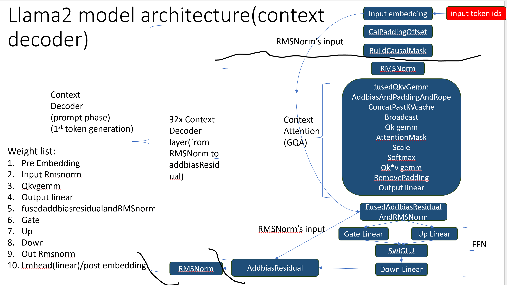
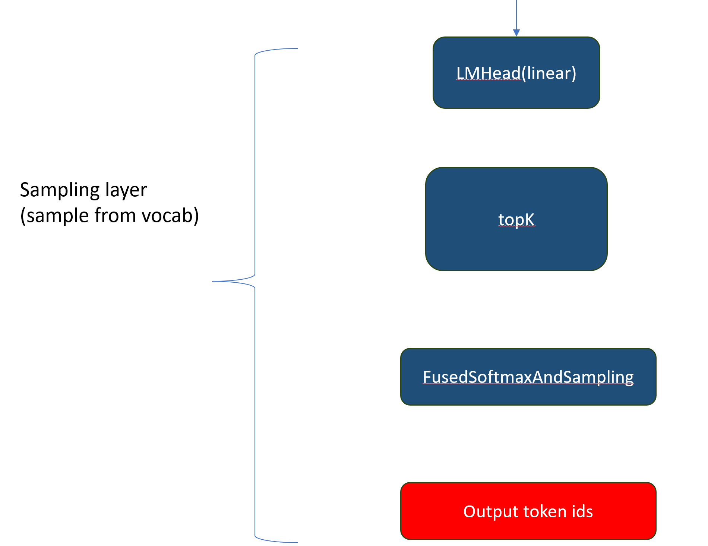
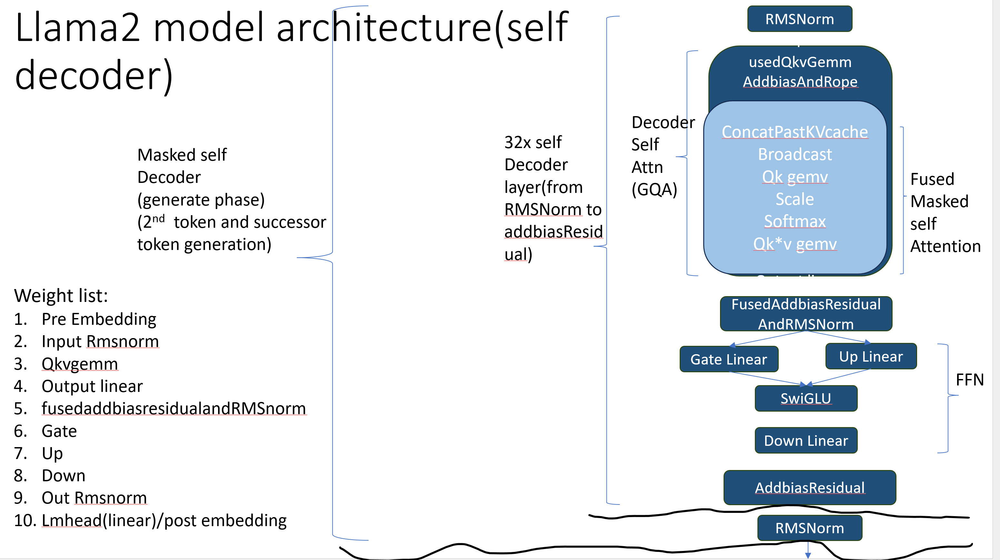
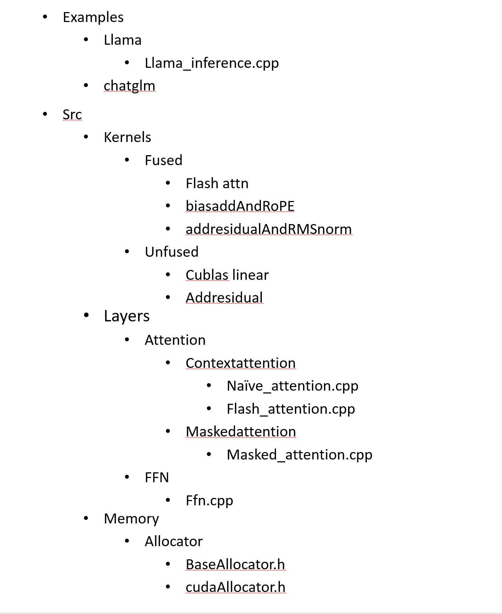
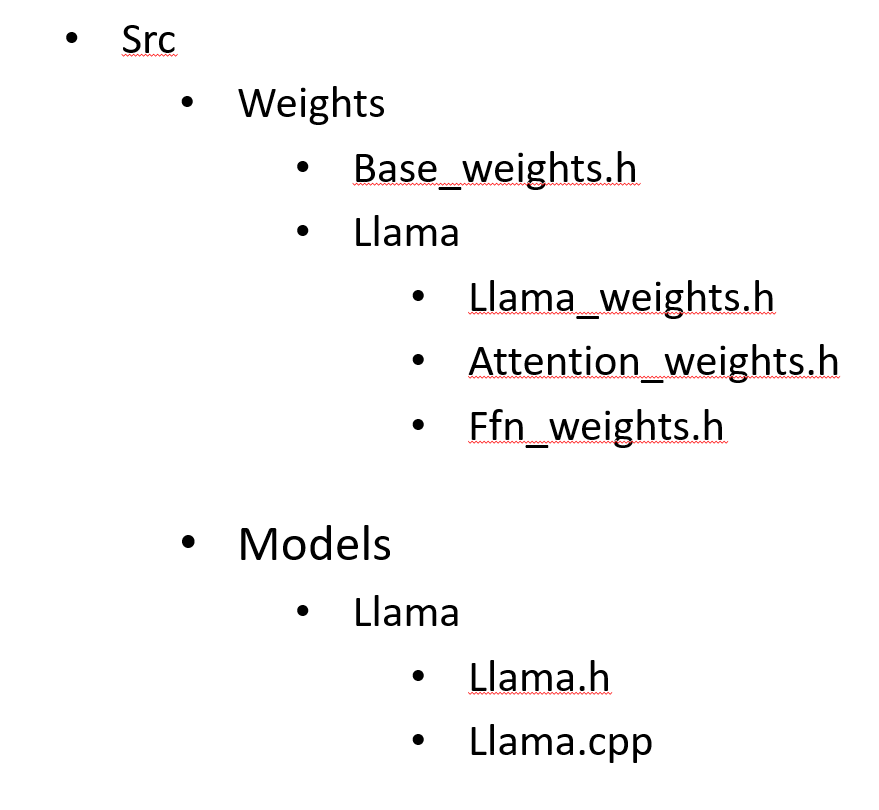

# 1. 总体的项目架构

* Kernels
  * 包括Attention，FFN等这些kernel
* Layers
  * Attention Layers，FFN layers，decoder
* Lama model
  * 存储了一个Llama需要哪些kernel以及如何组合
* Tests
  * 用以测试开发的kernel，或者Allocator的输出，做单元测试
* Allocator
  * 为数据分配Buffer
* Weights
  * Hugging Face下载的文件，将这些数据load到自己的数据结构
* utils
  * 辅助工具，包括Reduce等kernel


# 2. 生成式推理引擎架构

Decoder only

* 具有两个Decoder，

  * Context Decoder(prompt phase/prefill phase)，用于生成回答的第一个单词。

    * 可以看作Many to one
    * 可以并行计算

  * Masked self Decoder(generate phase/decode phase)，用于生成第二个及以后的token

    可以看作自回归生成的隐变量模型

    * 增量推理无法并行计算

      有人提出过Medusa作为并行解码的技术

      https://zhuanlan.zhihu.com/p/684423978

## 2.1 Context Decoder



首先规定q hidden units = q head num * hidden size

> 假设一个 Transformer 模型有 8 个头（`q_head_number = 8`），每个头的特征维度为 64（`hidden_size = 64`），那么隐藏层的总维度 `q_hidden_units` 将是 `8 * 64 = 512`。
>
> 这意味着每个输入 token 将被转换成一个 512 维的向量，这个向量是由 8 个不同的 64 维向量拼接而成的，每个向量对应一个注意力头的输出。

qkv hidden units=(q head num + 2* kv head num)*hidden_size

方便表示该算子**输出的形状**

具体的流程如右图所示

* 输入句子

* Tokenizer分词生成token ID

  ==【num tokens】，也就是一句话的长度==

* Embedding将一句话转换为token ID序列

  ==【num tokens，q hidden units】==

* CalpaddingOffset:

  * 用来处理多个句子输入（即为Batch训练）时，输入长度不一致的情况
  * GQA中的Remove padding 对应

* BuildCausalMask：下三角矩阵，与GQA中的AttentionMask对应，这个东西的作用就是掩盖部分数据。

* RMSNorm：输入到Context Attention中

  ==【num tokens，q hidden units】==

* Context Attention(GQA/MQA/MHA)：（公众号）

  >  Group query Attention组查询注意力/
  >
  > Multi query Attention多查询注意力/
  >
  > Multi Head Attention 多头注意力

  * Qkv的三个线性层:融合算子

    ==【num tokens，qkv hidden unit】==

  * AddbiasAndPaddingAndRope: Bias， Padding与旋转编码Rope，注意是k,Q经过了Rope，v并没有经过。

    因为有padding ，所以num tokens形状变为batchsize*sequence length长度

    ==【batchsize，sequence length，(kv)head num,head size】==

  * ConcatPastKVcache:节约KV读取时间

  * Broadcast：将K，V参数放入Broadcast,repeat KV(公众号)

  * Scale Dot Product Attention(SDPA)部分，包括

    > 因为context attention这个部分最后会移除padding，因此num tokens形状又变回去了

    ==【num tokens，q hidden units】==

    * QkGemm
    * AttentionMask
    * Scale
    * Softmax
    * Qk*v gemm
    * Remove padding：原因是前面的操作都是Batch Gemm，因此Padding 本质上是为了求QK gemm与QK*v gemm存在的，此时我们已经求到了需要的，我们就可以Remove掉不需要的Padding防止占用显存。

  * Output Linear

* FusedAddbiasResidualAndRMSNorm:融合算子，融合了AddBias,Add Residual（残差)，RMSNorm

  * 残差大部分都是来自上一个RMSNorm的输入，也就是Embedding的输出（这里是不考虑padding的影响的）

  ==【nums tokens，q hidden units】==

* FFN：

  * Gate Linear与Up Linear

    ==【2，batch size，inter size】==

  * SwiGLU:silu+mul

    ==【batch size，inter size】==

  * Down Linear

    ==【batch size，q hidden units】==

* FFN的输出喂到AddBiasResidual中，这里的残差来自上一个RMSNorm的输入

至此，从RMSNorm到AddBiasResidual就是一个Context Decoder，Llama使用了32个这么多的Layer，并且每个Layer的输出都将作为下一个Layer的输入

在经过了32层的Decoder之后，输出喂到RMSNorm中，我们就得到了一个隐藏层单元(hidden units)。


## 2.2 Sampling Layer



接下来，这个hidden units将被推入一个生成层/采样层单元(sampling Layer)

* Language Model head(linear 层)，得到(number tokens,vocab-size)大小的tensor

  ==【batch size，vocab size】==

* Topk：排序并筛选出概率最大的K个值

  ==【batch size，K】==

* FusedSoftmaxAndSampling:采样随机概率选出的值

  ==【batch size】==

* 输出对应tokenID


## 2.3 SelfDecoder



因为是自回归生成，所以缺少了padding（因为输入长度都为1），同时Attention部分变化了一些。

同样的，其RMSNorm的输出也会送到Sampling Layer中获取下一个输入token ID，


## 2.4 总结LLM推理引擎如何工作

* 处理请求
* tokenizer
* 分配CPU buffer与权重
* 分配GPU buffer并将所有input和权重存入GPU
* Forward：前向推理
  * embedding
  * 多个Context decoder
  * 多个self Decoder
  * Sampling
  * detokenizer


# 3. 代码结构






# 4. Hugging face llama代码简读

https://github.com/huggingface/transformers/tree/main/src/transformers/models/llama

## 4.1 RMS Norm

line 74

```python
class LlamaRMSNorm(nn.Module):
    def __init__(self, hidden_size, eps=1e-6):
        """
        LlamaRMSNorm is equivalent to T5LayerNorm
        """
        super().__init__()
        self.weight = nn.Parameter(torch.ones(hidden_size))
        self.variance_epsilon = eps

    def forward(self, hidden_states):
        input_dtype = hidden_states.dtype
        hidden_states = hidden_states.to(torch.float32)
        variance = hidden_states.pow(2).mean(-1, keepdim=True)
        hidden_states = hidden_states * torch.rsqrt(variance + self.variance_epsilon)
        return self.weight * hidden_states.to(input_dtype)

```


## 4.2 Rope

旋转编码

line 95

```python
class LlamaRotaryEmbedding(nn.Module):
    def __init__(self, dim, max_position_embeddings=2048, base=10000, device=None, scaling_factor=1.0):
        super().__init__()
        self.scaling_factor = scaling_factor
        self.dim = dim
        self.max_position_embeddings = max_position_embeddings
        self.base = base
        inv_freq = 1.0 / (self.base ** (torch.arange(0, self.dim, 2, dtype=torch.int64).float().to(device) / self.dim))
        self.register_buffer("inv_freq", inv_freq, persistent=False)
        # For BC we register cos and sin cached
        self.max_seq_len_cached = max_position_embeddings
        t = torch.arange(self.max_seq_len_cached, device=device, dtype=torch.int64).type_as(self.inv_freq)
        t = t / self.scaling_factor
        freqs = torch.outer(t, self.inv_freq)
        # Different from paper, but it uses a different permutation in order to obtain the same calculation
        emb = torch.cat((freqs, freqs), dim=-1)
        self.register_buffer("_cos_cached", emb.cos().to(torch.get_default_dtype()), persistent=False)
        self.register_buffer("_sin_cached", emb.sin().to(torch.get_default_dtype()), persistent=False)

    @property
    def sin_cached(self):
        logger.warning_once(
            "The sin_cached attribute will be removed in 4.39. Bear in mind that its contents changed in v4.38. Use "
            "the forward method of RoPE from now on instead. It is not used in the `LlamaAttention` class"
        )
        return self._sin_cached

    @property
    def cos_cached(self):
        logger.warning_once(
            "The cos_cached attribute will be removed in 4.39. Bear in mind that its contents changed in v4.38. Use "
            "the forward method of RoPE from now on instead. It is not used in the `LlamaAttention` class"
        )
        return self._cos_cached

    @torch.no_grad()
    def forward(self, x, position_ids, seq_len=None):
        if seq_len is not None:
            logger.warning_once("The `seq_len` argument is deprecated and unused. It will be removed in v4.39.")

        # x: [bs, num_attention_heads, seq_len, head_size]
        inv_freq_expanded = self.inv_freq[None, :, None].float().expand(position_ids.shape[0], -1, 1)
        position_ids_expanded = position_ids[:, None, :].float()
        # Force float32 since bfloat16 loses precision on long contexts
        # See https://github.com/huggingface/transformers/pull/29285
        device_type = x.device.type
        device_type = device_type if isinstance(device_type, str) else "cpu"
        with torch.autocast(device_type=device_type, enabled=False):
            freqs = (inv_freq_expanded.float() @ position_ids_expanded.float()).transpose(1, 2)
            emb = torch.cat((freqs, freqs), dim=-1)
            cos = emb.cos()
            sin = emb.sin()
        return cos.to(dtype=x.dtype), sin.to(dtype=x.dtype)
```

### 4.2.1 变种：Linear scaling Rope

line 150

新增了scaling factor

```python
class LlamaLinearScalingRotaryEmbedding(LlamaRotaryEmbedding):
    """LlamaRotaryEmbedding extended with linear scaling. Credits to the Reddit user /u/kaiokendev"""

    def forward(self, x, position_ids, seq_len=None):
        # difference to the original RoPE: a scaling factor is aplied to the position ids
        position_ids = position_ids.float() / self.scaling_factor
        cos, sin = super().forward(x, position_ids, seq_len)
        return cos, sin
```


### 4.2.2 变种 Dynamic NTK scaling rotary 

line 160

修改base

```python
class LlamaDynamicNTKScalingRotaryEmbedding(LlamaRotaryEmbedding):
    """LlamaRotaryEmbedding extended with Dynamic NTK scaling. Credits to the Reddit users /u/bloc97 and /u/emozilla"""

    def forward(self, x, position_ids, seq_len=None):
        # difference to the original RoPE: inv_freq is recomputed when the sequence length > original length
        seq_len = torch.max(position_ids) + 1
        if seq_len > self.max_position_embeddings:
            base = self.base * (
                (self.scaling_factor * seq_len / self.max_position_embeddings) - (self.scaling_factor - 1)
            ) ** (self.dim / (self.dim - 2))
            inv_freq = 1.0 / (
                base ** (torch.arange(0, self.dim, 2, dtype=torch.int64).float().to(x.device) / self.dim)
            )
            self.register_buffer("inv_freq", inv_freq, persistent=False)  # TODO joao: this may break with compilation

        cos, sin = super().forward(x, position_ids, seq_len)
        return cos, sin
```


### 4.2.3 通过cos与sin计算旋转编码

line 179

```python
def rotate_half(x):
    """Rotates half the hidden dims of the input."""
    x1 = x[..., : x.shape[-1] // 2]
    x2 = x[..., x.shape[-1] // 2 :]
    return torch.cat((-x2, x1), dim=-1)


def apply_rotary_pos_emb(q, k, cos, sin, position_ids=None, unsqueeze_dim=1):
    """Applies Rotary Position Embedding to the query and key tensors.

    Args:
        q (`torch.Tensor`): The query tensor.
        k (`torch.Tensor`): The key tensor.
        cos (`torch.Tensor`): The cosine part of the rotary embedding.
        sin (`torch.Tensor`): The sine part of the rotary embedding.
        position_ids (`torch.Tensor`, *optional*):
            Deprecated and unused.
        unsqueeze_dim (`int`, *optional*, defaults to 1):
            The 'unsqueeze_dim' argument specifies the dimension along which to unsqueeze cos[position_ids] and
            sin[position_ids] so that they can be properly broadcasted to the dimensions of q and k. For example, note
            that cos[position_ids] and sin[position_ids] have the shape [batch_size, seq_len, head_dim]. Then, if q and
            k have the shape [batch_size, heads, seq_len, head_dim], then setting unsqueeze_dim=1 makes
            cos[position_ids] and sin[position_ids] broadcastable to the shapes of q and k. Similarly, if q and k have
            the shape [batch_size, seq_len, heads, head_dim], then set unsqueeze_dim=2.
    Returns:
        `tuple(torch.Tensor)` comprising of the query and key tensors rotated using the Rotary Position Embedding.
    """
    cos = cos.unsqueeze(unsqueeze_dim)
    sin = sin.unsqueeze(unsqueeze_dim)
    q_embed = (q * cos) + (rotate_half(q) * sin)
    k_embed = (k * cos) + (rotate_half(k) * sin)
    return q_embed, k_embed
```


## 4.3 FFN

### 4.3.1 MLP

```python
class LlamaMLP(nn.Module):
    def __init__(self, config):
        super().__init__()
        self.config = config
        self.hidden_size = config.hidden_size
        self.intermediate_size = config.intermediate_size
        self.gate_proj = nn.Linear(self.hidden_size, self.intermediate_size, bias=False)
        self.up_proj = nn.Linear(self.hidden_size, self.intermediate_size, bias=False)
        self.down_proj = nn.Linear(self.intermediate_size, self.hidden_size, bias=False)
        self.act_fn = ACT2FN[config.hidden_act]

    def forward(self, x):
        # 使用多卡
        if self.config.pretraining_tp > 1:
            slice = self.intermediate_size // self.config.pretraining_tp
            gate_proj_slices = self.gate_proj.weight.split(slice, dim=0)
            up_proj_slices = self.up_proj.weight.split(slice, dim=0)
            down_proj_slices = self.down_proj.weight.split(slice, dim=1)

            gate_proj = torch.cat(
                [F.linear(x, gate_proj_slices[i]) for i in range(self.config.pretraining_tp)], dim=-1
            )
            up_proj = torch.cat([F.linear(x, up_proj_slices[i]) for i in range(self.config.pretraining_tp)], dim=-1)

            intermediate_states = (self.act_fn(gate_proj) * up_proj).split(slice, dim=2)
            down_proj = [
                F.linear(intermediate_states[i], down_proj_slices[i]) for i in range(self.config.pretraining_tp)
            ]
            down_proj = sum(down_proj)
        else:
            # 使用单卡进行矩阵乘法
            down_proj = self.down_proj(self.act_fn(self.gate_proj(x)) * self.up_proj(x))

        return down_proj
```


## 4.4 Repeat KV

```python
def repeat_kv(hidden_states: torch.Tensor, n_rep: int) -> torch.Tensor:
    """
    This is the equivalent of torch.repeat_interleave(x, dim=1, repeats=n_rep). The hidden states go from (batch,
    num_key_value_heads, seqlen, head_dim) to (batch, num_attention_heads, seqlen, head_dim)
    """
    batch, num_key_value_heads, slen, head_dim = hidden_states.shape
    if n_rep == 1:
        return hidden_states
    hidden_states = hidden_states[:, :, None, :, :].expand(batch, num_key_value_heads, n_rep, slen, head_dim)
    return hidden_states.reshape(batch, num_key_value_heads * n_rep, slen, head_dim)
```


## 4.5 Llama Attention

包括：

```python
 		# 常规参数
    	self.attention_dropout = config.attention_dropout
        self.hidden_size = config.hidden_size
        self.num_heads = config.num_attention_heads
        self.head_dim = self.hidden_size // self.num_heads
        # MQA，GQA参数
        self.num_key_value_heads = config.num_key_value_heads
        self.num_key_value_groups = self.num_heads // self.num_key_value_heads
        # Rope变量
        self.max_position_embeddings = config.max_position_embeddings
        self.rope_theta = config.rope_theta
        # 下三角矩阵的flag
        self.is_causal = True
```


```python
class LlamaAttention(nn.Module):
    """Multi-headed attention from 'Attention Is All You Need' paper"""

    def __init__(self, config: LlamaConfig, layer_idx: Optional[int] = None):
        super().__init__()
        self.config = config
        self.layer_idx = layer_idx
        if layer_idx is None:
            logger.warning_once(
                f"Instantiating {self.__class__.__name__} without passing a `layer_idx` is not recommended and will "
                "lead to errors during the forward call if caching is used. Please make sure to provide a `layer_idx` "
                "when creating this class."
            )

        self.attention_dropout = config.attention_dropout
        self.hidden_size = config.hidden_size
        self.num_heads = config.num_attention_heads
        self.head_dim = self.hidden_size // self.num_heads
        self.num_key_value_heads = config.num_key_value_heads
        self.num_key_value_groups = self.num_heads // self.num_key_value_heads
        self.max_position_embeddings = config.max_position_embeddings
        self.rope_theta = config.rope_theta
        self.is_causal = True

        if (self.head_dim * self.num_heads) != self.hidden_size:
            raise ValueError(
                f"hidden_size must be divisible by num_heads (got `hidden_size`: {self.hidden_size}"
                f" and `num_heads`: {self.num_heads})."
            )
		
        #定义QKV linear与output linear 
        self.q_proj = nn.Linear(self.hidden_size, self.num_heads * self.head_dim, bias=config.attention_bias)
        self.k_proj = nn.Linear(self.hidden_size, self.num_key_value_heads * self.head_dim, bias=config.attention_bias)
        self.v_proj = nn.Linear(self.hidden_size, self.num_key_value_heads * self.head_dim, bias=config.attention_bias)
        self.o_proj = nn.Linear(self.hidden_size, self.hidden_size, bias=config.attention_bias)
        self._init_rope()
	
    
    # 初始化rope所需要的变量
    def _init_rope(self):
        if self.config.rope_scaling is None:
            self.rotary_emb = LlamaRotaryEmbedding(
                self.head_dim,
                max_position_embeddings=self.max_position_embeddings,
                base=self.rope_theta,
            )
        else:
            scaling_type = self.config.rope_scaling["type"]
            scaling_factor = self.config.rope_scaling["factor"]
            if scaling_type == "linear":
                self.rotary_emb = LlamaLinearScalingRotaryEmbedding(
                    self.head_dim,
                    max_position_embeddings=self.max_position_embeddings,
                    scaling_factor=scaling_factor,
                    base=self.rope_theta,
                )
            elif scaling_type == "dynamic":
                self.rotary_emb = LlamaDynamicNTKScalingRotaryEmbedding(
                    self.head_dim,
                    max_position_embeddings=self.max_position_embeddings,
                    scaling_factor=scaling_factor,
                    base=self.rope_theta,
                )
            else:
                raise ValueError(f"Unknown RoPE scaling type {scaling_type}")
	# Llama attention forward
    def forward(
        self,
        hidden_states: torch.Tensor,
        attention_mask: Optional[torch.Tensor] = None,
        position_ids: Optional[torch.LongTensor] = None,
        past_key_value: Optional[Cache] = None,
        output_attentions: bool = False,
        use_cache: bool = False,
        cache_position: Optional[torch.LongTensor] = None,
        **kwargs,
    ) -> Tuple[torch.Tensor, Optional[torch.Tensor], Optional[Tuple[torch.Tensor]]]:
        bsz, q_len, _ = hidden_states.size()

        if self.config.pretraining_tp > 1:# 多卡时需要切分数据
            key_value_slicing = (self.num_key_value_heads * self.head_dim) // self.config.pretraining_tp
            query_slices = self.q_proj.weight.split(
                (self.num_heads * self.head_dim) // self.config.pretraining_tp, dim=0
            )
            key_slices = self.k_proj.weight.split(key_value_slicing, dim=0)
            value_slices = self.v_proj.weight.split(key_value_slicing, dim=0)

            query_states = [F.linear(hidden_states, query_slices[i]) for i in range(self.config.pretraining_tp)]
            query_states = torch.cat(query_states, dim=-1)

            key_states = [F.linear(hidden_states, key_slices[i]) for i in range(self.config.pretraining_tp)]
            key_states = torch.cat(key_states, dim=-1)

            value_states = [F.linear(hidden_states, value_slices[i]) for i in range(self.config.pretraining_tp)]
            value_states = torch.cat(value_states, dim=-1)

        else:# 单卡计算
            query_states = self.q_proj(hidden_states)
            key_states = self.k_proj(hidden_states)
            value_states = self.v_proj(hidden_states)
		
        
        # QKV旋转编码
        query_states = query_states.view(bsz, q_len, self.num_heads, self.head_dim).transpose(1, 2)
        key_states = key_states.view(bsz, q_len, self.num_key_value_heads, self.head_dim).transpose(1, 2)
        value_states = value_states.view(bsz, q_len, self.num_key_value_heads, self.head_dim).transpose(1, 2)

        past_key_value = getattr(self, "past_key_value", past_key_value)
        cos, sin = self.rotary_emb(value_states, position_ids)
        query_states, key_states = apply_rotary_pos_emb(query_states, key_states, cos, sin)

        
        # KV写入KV cache
        if past_key_value is not None:
            # sin and cos are specific to RoPE models; position_ids needed for the static cache
            cache_kwargs = {"sin": sin, "cos": cos, "cache_position": cache_position}
            key_states, value_states = past_key_value.update(key_states, value_states, self.layer_idx, cache_kwargs)
		
        
        # broadcast repeat_kv
        key_states = repeat_kv(key_states, self.num_key_value_groups)
        value_states = repeat_kv(value_states, self.num_key_value_groups)
		# QK矩阵乘
        attn_weights = torch.matmul(query_states, key_states.transpose(2, 3)) / math.sqrt(self.head_dim)
		# mask
        if attention_mask is not None:  # no matter the length, we just slice it
            causal_mask = attention_mask
            if cache_position is not None:
                causal_mask = attention_mask[:, :, cache_position, : key_states.shape[-2]]
            attn_weights = attn_weights + causal_mask

        # upcast attention to fp32
        attn_weights = nn.functional.softmax(attn_weights, dim=-1, dtype=torch.float32).to(query_states.dtype)
        attn_weights = nn.functional.dropout(attn_weights, p=self.attention_dropout, training=self.training)
        attn_output = torch.matmul(attn_weights, value_states)

        if attn_output.size() != (bsz, self.num_heads, q_len, self.head_dim):
            raise ValueError(
                f"`attn_output` should be of size {(bsz, self.num_heads, q_len, self.head_dim)}, but is"
                f" {attn_output.size()}"
            )

        attn_output = attn_output.transpose(1, 2).contiguous()

        attn_output = attn_output.reshape(bsz, q_len, self.hidden_size)

        if self.config.pretraining_tp > 1:
            attn_output = attn_output.split(self.hidden_size // self.config.pretraining_tp, dim=2)
            o_proj_slices = self.o_proj.weight.split(self.hidden_size // self.config.pretraining_tp, dim=1)
            attn_output = sum([F.linear(attn_output[i], o_proj_slices[i]) for i in range(self.config.pretraining_tp)])
        else:
            attn_output = self.o_proj(attn_output)

        if not output_attentions:
            attn_weights = None

        return attn_output, attn_weights, past_key_value
```


### 4.5.1 加速： Flash Attention

主要是pytorch调包

```python
class LlamaFlashAttention2(LlamaAttention):
    """
    Llama flash attention module. This module inherits from `LlamaAttention` as the weights of the module stays
    untouched. The only required change would be on the forward pass where it needs to correctly call the public API of
    flash attention and deal with padding tokens in case the input contains any of them.
    """

    def __init__(self, *args, **kwargs):
        super().__init__(*args, **kwargs)

        # TODO: Should be removed once Flash Attention for RoCm is bumped to 2.1.
        # flash_attn<2.1 generates top-left aligned causal mask, while what is needed here is bottom-right alignement, that was made default for flash_attn>=2.1. This attribute is used to handle this difference. Reference: https://github.com/Dao-AILab/flash-attention/releases/tag/v2.1.0.
        # Beware that with flash_attn<2.1, using q_seqlen != k_seqlen (except for the case q_seqlen == 1) produces a wrong mask (top-left).
        self._flash_attn_uses_top_left_mask = not is_flash_attn_greater_or_equal_2_10()

    def forward(
        self,
        hidden_states: torch.Tensor,
        attention_mask: Optional[torch.LongTensor] = None,
        position_ids: Optional[torch.LongTensor] = None,
        past_key_value: Optional[Cache] = None,
        output_attentions: bool = False,
        use_cache: bool = False,
        cache_position: Optional[torch.LongTensor] = None,
        **kwargs,
    ) -> Tuple[torch.Tensor, Optional[torch.Tensor], Optional[Tuple[torch.Tensor]]]:
        output_attentions = False

        bsz, q_len, _ = hidden_states.size()

        query_states = self.q_proj(hidden_states)
        key_states = self.k_proj(hidden_states)
        value_states = self.v_proj(hidden_states)

        # Flash attention requires the input to have the shape
        # batch_size x seq_length x head_dim x hidden_dim
        # therefore we just need to keep the original shape
        query_states = query_states.view(bsz, q_len, self.num_heads, self.head_dim).transpose(1, 2)
        key_states = key_states.view(bsz, q_len, self.num_key_value_heads, self.head_dim).transpose(1, 2)
        value_states = value_states.view(bsz, q_len, self.num_key_value_heads, self.head_dim).transpose(1, 2)

        cos, sin = self.rotary_emb(value_states, position_ids)
        query_states, key_states = apply_rotary_pos_emb(query_states, key_states, cos, sin)

        past_key_value = getattr(self, "past_key_value", past_key_value)

        if past_key_value is not None:
            # sin and cos are specific to RoPE models; position_ids needed for the static cache
            cache_kwargs = {"sin": sin, "cos": cos, "cache_position": cache_position}
            key_states, value_states = past_key_value.update(key_states, value_states, self.layer_idx, cache_kwargs)

        # TODO: These transpose are quite inefficient but Flash Attention requires the layout [batch_size, sequence_length, num_heads, head_dim]. We would need to refactor the KV cache
        # to be able to avoid many of these transpose/reshape/view.
        query_states = query_states.transpose(1, 2)
        key_states = key_states.transpose(1, 2)
        value_states = value_states.transpose(1, 2)

        dropout_rate = self.attention_dropout if self.training else 0.0

        # In PEFT, usually we cast the layer norms in float32 for training stability reasons
        # therefore the input hidden states gets silently casted in float32. Hence, we need
        # cast them back in the correct dtype just to be sure everything works as expected.
        # This might slowdown training & inference so it is recommended to not cast the LayerNorms
        # in fp32. (LlamaRMSNorm handles it correctly)

        input_dtype = query_states.dtype
        if input_dtype == torch.float32:
            if torch.is_autocast_enabled():
                target_dtype = torch.get_autocast_gpu_dtype()
            # Handle the case where the model is quantized
            elif hasattr(self.config, "_pre_quantization_dtype"):
                target_dtype = self.config._pre_quantization_dtype
            else:
                target_dtype = self.q_proj.weight.dtype

            logger.warning_once(
                f"The input hidden states seems to be silently casted in float32, this might be related to"
                f" the fact you have upcasted embedding or layer norm layers in float32. We will cast back the input in"
                f" {target_dtype}."
            )

            query_states = query_states.to(target_dtype)
            key_states = key_states.to(target_dtype)
            value_states = value_states.to(target_dtype)

        attn_output = self._flash_attention_forward(
            query_states, key_states, value_states, attention_mask, q_len, dropout=dropout_rate
        )

        attn_output = attn_output.reshape(bsz, q_len, self.hidden_size).contiguous()
        attn_output = self.o_proj(attn_output)

        if not output_attentions:
            attn_weights = None

        return attn_output, attn_weights, past_key_value

    def _flash_attention_forward(
        self, query_states, key_states, value_states, attention_mask, query_length, dropout=0.0, softmax_scale=None
    ):
        """
        Calls the forward method of Flash Attention - if the input hidden states contain at least one padding token
        first unpad the input, then computes the attention scores and pad the final attention scores.

        Args:
            query_states (`torch.Tensor`):
                Input query states to be passed to Flash Attention API
            key_states (`torch.Tensor`):
                Input key states to be passed to Flash Attention API
            value_states (`torch.Tensor`):
                Input value states to be passed to Flash Attention API
            attention_mask (`torch.Tensor`):
                The padding mask - corresponds to a tensor of size `(batch_size, seq_len)` where 0 stands for the
                position of padding tokens and 1 for the position of non-padding tokens.
            dropout (`int`, *optional*):
                Attention dropout
            softmax_scale (`float`, *optional*):
                The scaling of QK^T before applying softmax. Default to 1 / sqrt(head_dim)
        """
        if not self._flash_attn_uses_top_left_mask:
            causal = self.is_causal
        else:
            # TODO: Remove the `query_length != 1` check once Flash Attention for RoCm is bumped to 2.1. For details, please see the comment in LlamaFlashAttention2 __init__.
            causal = self.is_causal and query_length != 1

        # Contains at least one padding token in the sequence
        if attention_mask is not None:
            batch_size = query_states.shape[0]
            query_states, key_states, value_states, indices_q, cu_seq_lens, max_seq_lens = self._upad_input(
                query_states, key_states, value_states, attention_mask, query_length
            )

            cu_seqlens_q, cu_seqlens_k = cu_seq_lens
            max_seqlen_in_batch_q, max_seqlen_in_batch_k = max_seq_lens

            attn_output_unpad = flash_attn_varlen_func(
                query_states,
                key_states,
                value_states,
                cu_seqlens_q=cu_seqlens_q,
                cu_seqlens_k=cu_seqlens_k,
                max_seqlen_q=max_seqlen_in_batch_q,
                max_seqlen_k=max_seqlen_in_batch_k,
                dropout_p=dropout,
                softmax_scale=softmax_scale,
                causal=causal,
            )

            attn_output = pad_input(attn_output_unpad, indices_q, batch_size, query_length)
        else:
            attn_output = flash_attn_func(
                query_states, key_states, value_states, dropout, softmax_scale=softmax_scale, causal=causal
            )

        return attn_output

    def _upad_input(self, query_layer, key_layer, value_layer, attention_mask, query_length):
        indices_k, cu_seqlens_k, max_seqlen_in_batch_k = _get_unpad_data(attention_mask)
        batch_size, kv_seq_len, num_key_value_heads, head_dim = key_layer.shape

        key_layer = index_first_axis(
            key_layer.reshape(batch_size * kv_seq_len, num_key_value_heads, head_dim), indices_k
        )
        value_layer = index_first_axis(
            value_layer.reshape(batch_size * kv_seq_len, num_key_value_heads, head_dim), indices_k
        )
        if query_length == kv_seq_len:
            query_layer = index_first_axis(
                query_layer.reshape(batch_size * kv_seq_len, self.num_heads, head_dim), indices_k
            )
            cu_seqlens_q = cu_seqlens_k
            max_seqlen_in_batch_q = max_seqlen_in_batch_k
            indices_q = indices_k
        elif query_length == 1:
            max_seqlen_in_batch_q = 1
            cu_seqlens_q = torch.arange(
                batch_size + 1, dtype=torch.int32, device=query_layer.device
            )  # There is a memcpy here, that is very bad.
            indices_q = cu_seqlens_q[:-1]
            query_layer = query_layer.squeeze(1)
        else:
            # The -q_len: slice assumes left padding.
            attention_mask = attention_mask[:, -query_length:]
            query_layer, indices_q, cu_seqlens_q, max_seqlen_in_batch_q = unpad_input(query_layer, attention_mask)

        return (
            query_layer,
            key_layer,
            value_layer,
            indices_q,
            (cu_seqlens_q, cu_seqlens_k),
            (max_seqlen_in_batch_q, max_seqlen_in_batch_k),
        )

```


### 4.5.2 加速：SDPA Attention

主要是pytorch调包

```python
class LlamaSdpaAttention(LlamaAttention):
    """
    Llama attention module using torch.nn.functional.scaled_dot_product_attention. This module inherits from
    `LlamaAttention` as the weights of the module stays untouched. The only changes are on the forward pass to adapt to
    SDPA API.
    """

    # Adapted from LlamaAttention.forward
    def forward(
        self,
        hidden_states: torch.Tensor,
        attention_mask: Optional[torch.Tensor] = None,
        position_ids: Optional[torch.LongTensor] = None,
        past_key_value: Optional[Cache] = None,
        output_attentions: bool = False,
        use_cache: bool = False,
        cache_position: Optional[torch.LongTensor] = None,
    ) -> Tuple[torch.Tensor, Optional[torch.Tensor], Optional[Tuple[torch.Tensor]]]:
        if output_attentions:
            # TODO: Improve this warning with e.g. `model.config.attn_implementation = "manual"` once this is implemented.
            logger.warning_once(
                "LlamaModel is using LlamaSdpaAttention, but `torch.nn.functional.scaled_dot_product_attention` does not support `output_attentions=True`. Falling back to the manual attention implementation, "
                'but specifying the manual implementation will be required from Transformers version v5.0.0 onwards. This warning can be removed using the argument `attn_implementation="eager"` when loading the model.'
            )
            return super().forward(
                hidden_states=hidden_states,
                attention_mask=attention_mask,
                position_ids=position_ids,
                past_key_value=past_key_value,
                output_attentions=output_attentions,
                use_cache=use_cache,
                cache_position=cache_position,
            )

        bsz, q_len, _ = hidden_states.size()

        query_states = self.q_proj(hidden_states)
        key_states = self.k_proj(hidden_states)
        value_states = self.v_proj(hidden_states)

        query_states = query_states.view(bsz, q_len, self.num_heads, self.head_dim).transpose(1, 2)
        key_states = key_states.view(bsz, q_len, self.num_key_value_heads, self.head_dim).transpose(1, 2)
        value_states = value_states.view(bsz, q_len, self.num_key_value_heads, self.head_dim).transpose(1, 2)

        cos, sin = self.rotary_emb(value_states, position_ids)
        query_states, key_states = apply_rotary_pos_emb(query_states, key_states, cos, sin)

        # In case static cache is used, it is an instance attribute.
        past_key_value = getattr(self, "past_key_value", past_key_value)

        if past_key_value is not None:
            # sin and cos are specific to RoPE models; position_ids needed for the static cache
            cache_kwargs = {"sin": sin, "cos": cos, "cache_position": cache_position}
            key_states, value_states = past_key_value.update(key_states, value_states, self.layer_idx, cache_kwargs)

        key_states = repeat_kv(key_states, self.num_key_value_groups)
        value_states = repeat_kv(value_states, self.num_key_value_groups)

        causal_mask = attention_mask
        if attention_mask is not None and cache_position is not None:
            causal_mask = causal_mask[:, :, cache_position, : key_states.shape[-2]]

        # SDPA with memory-efficient backend is currently (torch==2.1.2) bugged with non-contiguous inputs with custom attn_mask,
        # Reference: https://github.com/pytorch/pytorch/issues/112577.
        if query_states.device.type == "cuda" and causal_mask is not None:
            query_states = query_states.contiguous()
            key_states = key_states.contiguous()
            value_states = value_states.contiguous()

        attn_output = torch.nn.functional.scaled_dot_product_attention(
            query_states,
            key_states,
            value_states,
            attn_mask=causal_mask,
            dropout_p=self.attention_dropout if self.training else 0.0,
        )

        attn_output = attn_output.transpose(1, 2).contiguous()
        attn_output = attn_output.view(bsz, q_len, self.hidden_size)

        attn_output = self.o_proj(attn_output)

        return attn_output, None, past_key_value

```


## 4.6 Decoder Layer

```python
class LlamaDecoderLayer(nn.Module):
    def __init__(self, config: LlamaConfig, layer_idx: int):
        super().__init__()
        self.hidden_size = config.hidden_size

        self.self_attn = LLAMA_ATTENTION_CLASSES[config._attn_implementation](config=config, layer_idx=layer_idx)

        self.mlp = LlamaMLP(config)
        self.input_layernorm = LlamaRMSNorm(config.hidden_size, eps=config.rms_norm_eps)
        self.post_attention_layernorm = LlamaRMSNorm(config.hidden_size, eps=config.rms_norm_eps)

    def forward(
        self,
        hidden_states: torch.Tensor,
        attention_mask: Optional[torch.Tensor] = None,
        position_ids: Optional[torch.LongTensor] = None,
        past_key_value: Optional[Tuple[torch.Tensor]] = None,
        output_attentions: Optional[bool] = False,
        use_cache: Optional[bool] = False,
        cache_position: Optional[torch.LongTensor] = None,
        **kwargs,
    ) -> Tuple[torch.FloatTensor, Optional[Tuple[torch.FloatTensor, torch.FloatTensor]]]:
        """
        Args:
            hidden_states (`torch.FloatTensor`): input to the layer of shape `(batch, seq_len, embed_dim)`
            attention_mask (`torch.FloatTensor`, *optional*):
                attention mask of size `(batch_size, sequence_length)` if flash attention is used or `(batch_size, 1,
                query_sequence_length, key_sequence_length)` if default attention is used.
            output_attentions (`bool`, *optional*):
                Whether or not to return the attentions tensors of all attention layers. See `attentions` under
                returned tensors for more detail.
            use_cache (`bool`, *optional*):
                If set to `True`, `past_key_values` key value states are returned and can be used to speed up decoding
                (see `past_key_values`).
            past_key_value (`Tuple(torch.FloatTensor)`, *optional*): cached past key and value projection states
        """
        if "padding_mask" in kwargs:
            warnings.warn(
                "Passing `padding_mask` is deprecated and will be removed in v4.37. Please make sure use `attention_mask` instead.`"
            )

        residual = hidden_states

        hidden_states = self.input_layernorm(hidden_states)

        # Self Attention
        hidden_states, self_attn_weights, present_key_value = self.self_attn(
            hidden_states=hidden_states,
            attention_mask=attention_mask,
            position_ids=position_ids,
            past_key_value=past_key_value,
            output_attentions=output_attentions,
            use_cache=use_cache,
            cache_position=cache_position,
            **kwargs,
        )
        hidden_states = residual + hidden_states

        # Fully Connected
        residual = hidden_states
        hidden_states = self.post_attention_layernorm(hidden_states)
        hidden_states = self.mlp(hidden_states)
        hidden_states = residual + hidden_states

        outputs = (hidden_states,)

        if output_attentions:
            outputs += (self_attn_weights,)

        if use_cache:
            outputs += (present_key_value,)

        return outputs
```


## 4.7 Llama Model结构

```python
class LlamaModel(LlamaPreTrainedModel):
    """
    Transformer decoder consisting of *config.num_hidden_layers* layers. Each layer is a [`LlamaDecoderLayer`]

    Args:
        config: LlamaConfig
    """

    def __init__(self, config: LlamaConfig):
        super().__init__(config)
        self.padding_idx = config.pad_token_id
        self.vocab_size = config.vocab_size

        self.embed_tokens = nn.Embedding(config.vocab_size, config.hidden_size, self.padding_idx)
        self.layers = nn.ModuleList(
            [LlamaDecoderLayer(config, layer_idx) for layer_idx in range(config.num_hidden_layers)]
        )
        self.norm = LlamaRMSNorm(config.hidden_size, eps=config.rms_norm_eps)
        self.gradient_checkpointing = False

        # Register a causal mask to separate causal and padding mask creation. Merging happens in the attention class.
        # NOTE: This is not friendly with TorchScript, ONNX, ExportedProgram serialization for very large `max_position_embeddings`.
        causal_mask = torch.full(
            (config.max_position_embeddings, config.max_position_embeddings), fill_value=True, dtype=torch.bool
        )
        self.register_buffer("causal_mask", torch.triu(causal_mask, diagonal=1), persistent=False)
        # Initialize weights and apply final processing
        self.post_init()

    def get_input_embeddings(self):
        return self.embed_tokens

    def set_input_embeddings(self, value):
        self.embed_tokens = value

    @add_start_docstrings_to_model_forward(LLAMA_INPUTS_DOCSTRING)
    def forward(
        self,
        input_ids: torch.LongTensor = None,
        attention_mask: Optional[torch.Tensor] = None,
        position_ids: Optional[torch.LongTensor] = None,
        past_key_values: Optional[List[torch.FloatTensor]] = None,
        inputs_embeds: Optional[torch.FloatTensor] = None,
        use_cache: Optional[bool] = None,
        output_attentions: Optional[bool] = None,
        output_hidden_states: Optional[bool] = None,
        return_dict: Optional[bool] = None,
        cache_position: Optional[torch.LongTensor] = None,
    ) -> Union[Tuple, BaseModelOutputWithPast]:
        output_attentions = output_attentions if output_attentions is not None else self.config.output_attentions
        output_hidden_states = (
            output_hidden_states if output_hidden_states is not None else self.config.output_hidden_states
        )
        use_cache = use_cache if use_cache is not None else self.config.use_cache
        return_dict = return_dict if return_dict is not None else self.config.use_return_dict

        if (input_ids is None) ^ (inputs_embeds is not None):
            raise ValueError(
                "You cannot specify both input_ids and inputs_embeds at the same time, and must specify either one"
            )

        if self.gradient_checkpointing and self.training and use_cache:
            logger.warning_once(
                "`use_cache=True` is incompatible with gradient checkpointing. Setting `use_cache=False`."
            )
            use_cache = False

        if inputs_embeds is None:
            inputs_embeds = self.embed_tokens(input_ids)

        past_seen_tokens = 0
        if use_cache:  # kept for BC (cache positions)
            if not isinstance(past_key_values, StaticCache):
                past_key_values = DynamicCache.from_legacy_cache(past_key_values)
                past_seen_tokens = past_key_values.get_seq_length()

        if cache_position is None:
            if isinstance(past_key_values, StaticCache):
                raise ValueError("cache_position is a required argument when using StaticCache.")
            cache_position = torch.arange(
                past_seen_tokens, past_seen_tokens + inputs_embeds.shape[1], device=inputs_embeds.device
            )

        if position_ids is None:
            position_ids = cache_position.unsqueeze(0)

        causal_mask = self._update_causal_mask(attention_mask, inputs_embeds)

        # embed positions
        hidden_states = inputs_embeds

        # decoder layers
        all_hidden_states = () if output_hidden_states else None
        all_self_attns = () if output_attentions else None
        next_decoder_cache = None

        for decoder_layer in self.layers:
            if output_hidden_states:
                all_hidden_states += (hidden_states,)

            if self.gradient_checkpointing and self.training:
                layer_outputs = self._gradient_checkpointing_func(
                    decoder_layer.__call__,
                    hidden_states,
                    causal_mask,
                    position_ids,
                    past_key_values,
                    output_attentions,
                    use_cache,
                    cache_position,
                )
            else:
                layer_outputs = decoder_layer(
                    hidden_states,
                    attention_mask=causal_mask,
                    position_ids=position_ids,
                    past_key_value=past_key_values,
                    output_attentions=output_attentions,
                    use_cache=use_cache,
                    cache_position=cache_position,
                )

            hidden_states = layer_outputs[0]

            if use_cache:
                next_decoder_cache = layer_outputs[2 if output_attentions else 1]

            if output_attentions:
                all_self_attns += (layer_outputs[1],)

        hidden_states = self.norm(hidden_states)

        # add hidden states from the last decoder layer
        if output_hidden_states:
            all_hidden_states += (hidden_states,)

        next_cache = None
        if use_cache:
            next_cache = (
                next_decoder_cache.to_legacy_cache() if isinstance(next_decoder_cache, Cache) else next_decoder_cache
            )
        if not return_dict:
            return tuple(v for v in [hidden_states, next_cache, all_hidden_states, all_self_attns] if v is not None)
        return BaseModelOutputWithPast(
            last_hidden_state=hidden_states,
            past_key_values=next_cache,
            hidden_states=all_hidden_states,
            attentions=all_self_attns,
        )

    # TODO: As of torch==2.2.0, the `attention_mask` passed to the model in `generate` is 2D and of dynamic length even when the static
    # KV cache is used. This is an issue for torch.compile which then recaptures cudagraphs at each decode steps due to the dynamic shapes.
    # (`recording cudagraph tree for symint key 13`, etc.), which is VERY slow. A workaround is `@torch.compiler.disable`, but this prevents using
    # `fullgraph=True`. See more context in https://github.com/huggingface/transformers/pull/29114
    def _update_causal_mask(self, attention_mask, input_tensor):
        if self.config._attn_implementation == "flash_attention_2":
            if attention_mask is not None and 0.0 in attention_mask:
                return attention_mask
            return None

        batch_size, seq_length = input_tensor.shape[:2]
        dtype = input_tensor.dtype
        device = input_tensor.device

        # support going beyond cached `max_position_embedding`
        if seq_length > self.causal_mask.shape[-1]:
            causal_mask = torch.full((2 * self.causal_mask.shape[-1], 2 * self.causal_mask.shape[-1]), fill_value=1)
            self.register_buffer("causal_mask", torch.triu(causal_mask, diagonal=1), persistent=False)

        # We use the current dtype to avoid any overflows
        min_dtype = torch.finfo(dtype).min
        causal_mask = self.causal_mask[None, None, :, :].repeat(batch_size, 1, 1, 1).to(dtype) * min_dtype

        causal_mask = causal_mask.to(dtype=dtype, device=device)
        if attention_mask is not None and attention_mask.dim() == 2:
            mask_length = attention_mask.shape[-1]
            padding_mask = causal_mask[..., :mask_length].eq(0.0) * attention_mask[:, None, None, :].eq(0.0)
            causal_mask[..., :mask_length] = causal_mask[..., :mask_length].masked_fill(padding_mask, min_dtype)

        if (
            self.config._attn_implementation == "sdpa"
            and attention_mask is not None
            and attention_mask.device.type == "cuda"
        ):
            # TODO: For dynamo, rather use a check on fullgraph=True once this is possible (https://github.com/pytorch/pytorch/pull/120400).
            is_tracing = (
                torch.jit.is_tracing()
                or isinstance(input_tensor, torch.fx.Proxy)
                or (hasattr(torch, "_dynamo") and torch._dynamo.is_compiling())
            )
            if not is_tracing and torch.any(attention_mask != 1):
                # Attend to all tokens in fully masked rows in the causal_mask, for example the relevant first rows when
                # using left padding. This is required by F.scaled_dot_product_attention memory-efficient attention path.
                # Details: https://github.com/pytorch/pytorch/issues/110213
                causal_mask = AttentionMaskConverter._unmask_unattended(causal_mask, min_dtype)

        return causal_mask
```


