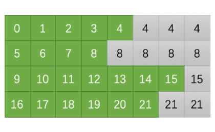

## 1. 什么是PaddingOffset

`paddingOffset` 通常在处理序列数据（如文本或时间序列数据）时使用，尤其是在深度学习和数据预处理中。它指的是在序列数据中添加的填充（padding）量，用于调整序列的长度。这样做的目的是使不同长度的序列能够统一到相同的长度，以便它们能够被批量处理，这在使用深度学习模型（如循环神经网络RNN或其变体LSTM、GRU）时非常常见。

例如，考虑一个自然语言处理任务，其中输入数据是一系列句子，这些句子具有不同的单词数量。大多数深度学习模型需要固定大小的输入，因此较短的句子需要通过添加特定的“填充”标记（如0或某个特殊符号）来增加它们的长度，直到达到一定的固定长度。`paddingOffset` 在这种情况下指的可能是：

1. **填充的位置**：标识填充是添加在序列的开始还是结束。例如，在自然语言处理中，可能会选择在句子的末尾添加填充。
2. **填充的量**：具体到某个序列，`paddingOffset` 可能表示需要添加多少填充才能达到期望的长度。

在实际应用中，正确的处理填充非常重要，因为它直接影响模型的性能。在训练过程中，通常会用掩码（masking）技术来告诉模型忽略这些填充的部分，以免它们对学习结果产生负面影响。

这个想法主要来自于github.com/bytedance/effective_transformer中

在这里，Input mask prefix sum中，数字的意义是在这个之前拥有的合法token个数。

以第八个位置为例，其padding offset就是5，但是它在padding过后是第8个位置，这意味着Removepadding就是直接将他放到位置5上。

## 2. 总体的算子结构

例如输入

[[1,1,1],[1,1],[1,1,1,1,1]]

那么传统padding得到的就是

[

​	[1,1,1,0,0],

​	[1,1,0,0,0],

​	[1,1,1,1,1]

]

batch_size = 3

seq_len = [3,2,5]

max_seq_len = 5

#### launcher

在这里我们采用offset为偏移的方式

`Tensorwrapper<int>* padding_offset`:输出的padding offset,[batch_size * max_seq_len]

以上图为例，得到的offset偏移应该为

0 0 0 0 0 

3 3 3 3 

7 7 7 7 7 7 7 

8 8 8 8 8 8

最后对于这个batch，展开后的offset应当就是0000033337777777888888

`Tensorwrapper<int>* cum_seqlens`：输出的有效句子的累积句子长度,[batch_size+1],

 以上图为例，

0

5

9

16

22(总token个数)

`Tensorwrapper<int>* input_lengths`：输入的句子长度,[batch_size]

#### kernel

* paddingoffset的结果数组
* 序列前缀和的结果数组
* 输入的真实长度数组
* batchsize
* batch最大序列长度。

