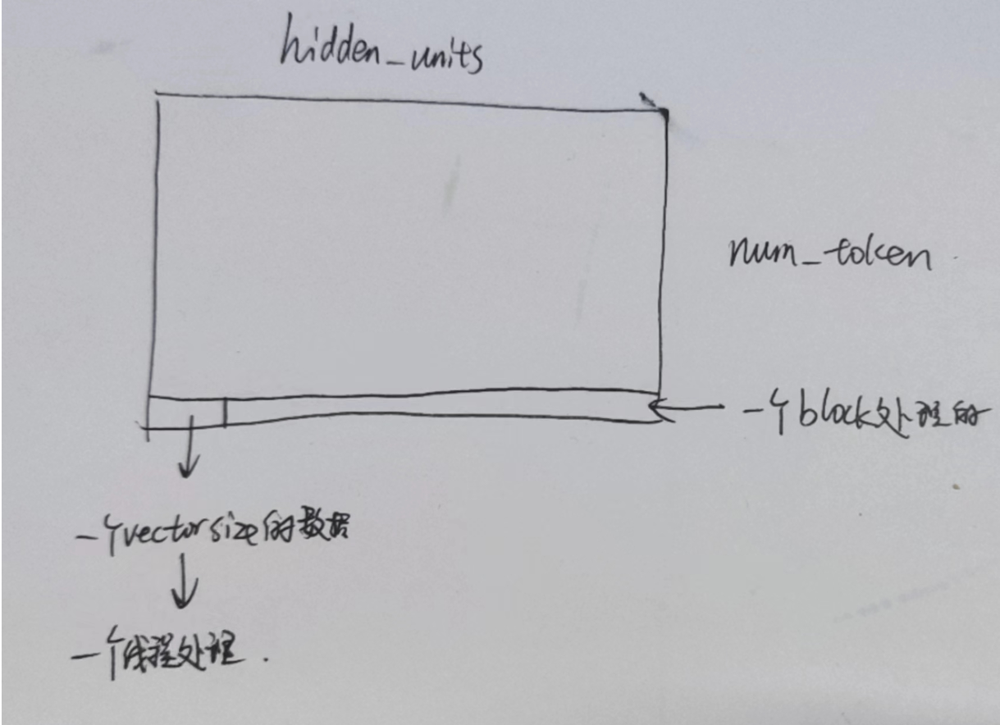

## 1. RMSNorm

RMSNorm接受的是Input Embedding的输出

因此其输入的shape就是[number_tokens, q_hidden_units]

因为其是Normalization，因此输出的shape也是q_hidden_units


因为是序列模型，考虑到一个batch内的每个sequence可能长度都不同，因此使用BatchNorm不合理，因此首先考虑使用LayerNormalization。但是，LayerNormalization的计算量十分大，因此选用RMSNormalization来加快计算。


Layer Normalization（层归一化）和 Root Mean Square Layer Normalization（RMSNorm）是两种用于深度学习模型中的归一化技术，尤其是在处理序列数据时，如在自然语言处理任务中使用的变换器（Transformer）模型。这两种技术都是为了减少训练过程中的内部协变量偏移（Internal Covariate Shift），从而加快训练速度，提高模型的稳定性和性能。下面分别介绍这两种技术。

### Layer Normalization (层归一化)

Layer Normalization 通过计算特征维度上的均值和方差来归一化网络层的激活输出。不同于批量归一化（Batch Normalization），层归一化在单个样本的层内进行，因此它独立于批量大小，并且可以很好地用于循环神经网络（RNNs）和Transformer中。

给定一个样本在网络层的输出$x$，层归一化的公式可以表示为：
$$
LN(x) = \gamma \cdot \frac{x-\mu}{\sqrt{\sigma^2 + \epsilon} }+ \beta
$$


其中，

- $\mu$ 是该层内每个样本特征的均值，
- $\sigma^2$是方差，
- $\epsilon$是一个很小的数，防止除以零，
- $\gamma$和 $\beta$是可学习的参数，用于重新缩放和位移，确保归一化操作不会破坏网络的表达能力。

### RMSNorm (根均方层归一化)

RMSNorm 是一种简化的层归一化方法，它仅使用特征维度的根均方（Root Mean Square）进行归一化，而不是使用均值和方差。RMSNorm 主要用于自然语言处理中的Transformer模型，可以减少计算量并提高性能。

RMSNorm 的公式为：
$$
RMSNorm(x) = \gamma \cdot \frac{x_i}{\sqrt{\frac{1}{H}\sum^H_{i=1}x^2_i+\epsilon}}
$$


其中，

- $H$是特征维度的数量，
- $x_i$是特征向量中的第 *i* 个元素，
- $\epsilon$ 是一个很小的数，防止除以零，
- $\gamma$ 是可学习的缩放参数（注意，与层归一化不同，这里没有位移参数 *β*）。

### 比较

#### Layer Normalization的局限性

1. **局限性描述**：LN通过计算层输出的均值（*μ*）和方差（$2σ^2$）来进行去中心化和缩放操作。这种方法可以在一定程度上使模型对输入和权重中的噪声更加鲁棒，即使是在极端分布（如99个0和1个100）下，LN通过中心化保持了分布的稳定性。然而，文中指出，尽管LN可以实现聚集中心化（re-centering），但这并不意味着它能有效减少梯度的方差。因此，LN的成功并不完全依赖于其能够减少梯度方差的能力。
2. **局限性解读**：LN的中心化过程能够调整数据分布，让每一层的输入分布更加稳定，但这种调整对于梯度方差的影响并不显著。这意味着，虽然LN有助于保持模型训练的稳定性，但它并不能直接解决训练过程中可能出现的梯度爆炸或消失问题。
3. 换句话说，LN通过稳定输入的分布，减少了不同层之间输出分布的差异，同时增加了模型对不同分布输入的稳定性，这在序列模型中其实是不需要的。

#### RMSNorm的优势

1. **优势描述**：与LN不同，RMSNorm放弃了中心化操作，只通过均方根（RMS）进行缩放。这意味着，当LN中的均值（*μ*）为0时，RMSNorm与LN实际上是相同的。RMSNorm的关键优势在于它只进行缩放操作，不改变数据的原始分布，这对于激活函数输出的稳定性非常有利。因为缩放操作不会改变向量的方向，它可以保持激活输出的相对分布不变，从而提高模型的学习效率和泛化能力。
2. **优势解读**：RMSNorm的简化过程（仅缩放，不中心化）减少了计算复杂度，同时保持了数据分布的原始特征。这种方法特别适用于深层网络和复杂模型，其中保持激活函数输出的稳定性对于避免梯度问题和加快训练速度至关重要。简言之，RMSNorm通过维持激活输出的稳定性，有助于模型更有效地学习和泛化，而无需担心输入数据分布的大幅度变化。


### RMSNorm里的灵感(待补充)


#### 最优化入门

https://www.bilibili.com/video/BV19M4y1n7M3/?spm_id_from=333.337.search-card.all.click&vd_source=61f56e9689aceb8e8b1f51e6e06bddd9

以下笔记参考d2l

#### 凸优化

#### Adam


#### RMSNorm


## 2. 实现

### 2.1 简述

RMSNorm实际存在两个地方：

* Context Encoder

  RMSNorm接受Input Embedding的输出[number tokens, q_hidden units]

  RMSNorm的输出应该也是[number tokens, q_hidden units]

* Masked self decoder

  因为是Decoder的推理部分，因此Sequence Length实际上都是1（从一个单词开始推理）

  因此，RMS部分收到的实际输入应该为`[batch_size, 1, hidden_size]`

注意，本次实现使用的公式为
$$
LN(x_i = \gamma \cdot \frac{x_i}{\sqrt{x_i^2 + \epsilon} }
$$
我们的输入参数就是$\gamma$，这是一个已经训练好的值，其长度为[q_hidden_units]，这代表它学习了不同的token应该缩放为什么程度效果最好。

> 归一化操作通常在特定的维度上进行，对于 `q_hidden_units`（即隐藏层的大小或每个 token 的特征向量维度），归一化是逐特征进行的。`gamma` 作为归一化过程中的缩放参数，其长度与 `q_hidden_units` 相同，是为了确保每个特征维度都能应用一个独立的缩放因子，从而在归一化后对每个维度进行适当的调整。
>
> 归一化后的每个特征都通过相应的 `gamma` 值进行缩放，这是一个逐元素（element-wise）的操作。如果 `gamma` 的长度为 `q_hidden_units`，这意味着每个特征都有一个唯一的 `gamma` 值。这种设计允许模型学习每个特征最优的缩放因子，提高模型的灵活性和表达能力。
>
> 在训练过程中，`gamma` 参数是可学习的，模型通过反向传播根据损失函数自动调整 `gamma` 值。这允许模型动态地优化每个特征的缩放，以达到更好的训练和泛化效果。

### 2.2 整体的流程就是

* 输入[number tokens, q_hidden_units] decoder in

* 输入一个gamma数组，这是RMSNorm的scale，这个数组的长度是q_hidden_units

* 可选输入residual，residual是代表有一个残差连接从这个层引出，因此我们需要在这个引出的层保留这个层的输入一直到残差连接的目标层

* 我们计划用num_token个block，每个block处理hidden_units个数据

  

  也就是相当于，考虑到我们是处理每个词自己的RMSNorm，我们用一个block求出这个词向量的Norm。

* 对于每个block，我们让每个线程向量化的读取float4或者half2

  * 对于每个线程，我们需要做的就是首先对输入的四个x_i，求平方和
  * 然后，对这些线程执行warp level reduce，得到总的平方和
  * 使用rsqrtf快速计算$ \frac{1}{\sqrt{x_i^2 + \epsilon} }$​
  * 修改decoder_in，使其正则化

* 对于每个warp，使用warp level reduce

```c++
#include<stdio.h>
#include"src/kernels/rmsnorm_kernel.h"

// 函数接受每个线程的val，函数返回warp内所有这些值的总和(thread0)。
template<typename T>
__device__ T warpReduceSum(T val){
    unsigned int active_mask = __activemask();
    for(int i = 32/2; i > 0; i >>=1){
        val += __shfl_xor_sync(active_mask, val, i); // Synchronize all threads in warp and get "value" from lane i
    }
    return val;// 注意，每个线程都会执行，但是只有thread0的值才是我们需要的
}


template<typename T>
__device__ T blockReduceSum(T val){
    int tid = threadIdx.x;
    int warpid = tid/32;
    int laneid = tid%32;

    int warpnum = (blockDim.x + 31) / 32;
    val = warpReduceSum<T>(val);

    /*
    // 这种方法限制了并行性
    __shared__ T warpsum = 0;
    __syncthreads();

    if(laneid == 0){
        atomicAdd(&warpsum, val);
    }
    __syncthreads();
    
    return warpsum; 
    */

    __shared__ T warpsum[32];//考虑blocksize超过1024性能下降， 因此默认blocksize最大1024，设置最大32的数组

    // 存入warpsum
    if(laneid == 0){
        warpsum[wid] = val;
    }
    __syncthreads();
    // 为block前warpnum个thread分配这些sum，然后使用warpreduce再次计算
    T sum = tid < warpnum ? warpsum[tid] : (T)0;
    sum = warpReduceSum<T>(sum);

    // 因为最大不超过32个，因此一个warpReduceSum就可以解决
    return sum;
}

// RMSNorm(x) = gamma * (x_i) / sqrt(1/H * sum(x^2_i) + epsilon) 
template<typename T>
__global__ void RMSNorm(T* decoder_in,  //[num tokens(batch size), q_hidden_units]
                        T* decoder_residual,//残差连接就相当于我们将残差输入另做备份到需要的层进行计算，nullptr意味着当前层不使用残差连接
                        T* gamma,       // [q_hidden_units], RMSNorm weights
                        float epsilon,  
                        int num_tokens, 
                        int hidden_units){
    // 平方每个数据
    int vec_size = Vec<T>::size();
    using Vec_t = typename Vec<T>::type;

    float thread_sum = 0.0f;
    // 将当前block对应的decoder_in数据切割
    Vec_t* dout = reinterpret_cast<Vec_t*>(decoder_in + blockIdx.x * hidden_units);//注意我们的blockDim.x实际上是hidden_units/vec_size，这里容易搞混
    if(decoder_residual != nullptr)
        Vec_t* rsd;
        rsd = reinterpret_cast<Vec_t*>(decoder_residual + blockIdx.x * hidden_units);
    for(int idx = threadIdx.x; idx < hidden_units/vec_size; idx+=blockDim.x){
        //每个线程取出一个float4
        Vec_t vec = dout[idx];
        if(decoder_residual != nullptr)
            rsd[idx] = vec;//保存当前值作为residual
        // 平方
        thread_sum += vec.x * vec.x;
        thread_sum += vec.y * vec.y;
        thread_sum += vec.z * vec.z;
        thread_sum += vec.w * vec.w;
    }
    thread_sum = blockReduceSum<float>(thread_sum);


    // 因为均值是block层面，因此使用shared memory
    __shared__ float inv_mean;
    // 对于每个block的
    if(threadIdx.x == 0){
        //快速计算float倒数平方根(reciprocal square root)
        inv_mean = rsqrtf(thread_sum / hidden_units + epsilon);
    }
    __syncthreads();

    //修改输出
    Vec_t* g = reinterpret_cast<Vec_t*>(gamma);
    for(int idx = threadIdx.x; idx < hidden_units / vec_size; idx += blockDim.x){
        Vec_t vec = dout[idx];
        dout[idx].x = vec.x * inv_mean * g[idx].x;
        dout[idx].y = vec.y * inv_mean * g[idx].y;
        dout[idx].x = vec.z * inv_mean * g[idx].z;
        dout[idx].x = vec.w * inv_mean * g[idx].w;
        
    }
}


//half2版本
template <>
__global__ void RMSNorm(half* decoder_out, // [num tokens, q_hidden_units]
                        half* decoder_residual,
                        half* scale, //[q_hidden_units], RMSNorm weights
                        float eps, //RMSNorm eps
                        int num_tokens, 
                        int hidden_units){
    int vec_size = Vec<half>::size;
    using Vec_t = typename Vec<half>::Type;
    int batch_id = blockIdx.x;
    int tid = threadIdx.x;
    Vec_t* s; 
    Vec_t* dout = reinterpret_cast<Vec_t*>(decoder_out + batch_id * hidden_units);
    Vec_t* rsd;
    if (decoder_residual != nullptr) {
        rsd = reinterpret_cast<Vec_t*>(decoder_residual + batch_id * hidden_units);
    }
    float thread_accm = 0.0f;
    // 考虑到blockReduceSum使用float，首先转换为float来计算
    for(int i = tid; i < hidden_units / vec_size; i += blockDim.x) {
        Vec_t out = dout[i];// note the offset should divide vec size
        if (decoder_residual != nullptr) {
            rsd[i] = out;
        }
        thread_accm += __half2float(out.x) * __half2float(out.x);
        thread_accm += __half2float(out.y) * __half2float(out.y);
    } //x^2
    
    // mean(x^2)
    float blocksum = blockReduceSum<float>(thread_accm);
    __shared__ float inv_fenmu;
    if(tid == 0){
        inv_fenmu = rsqrtf(float(blocksum / hidden_units) + eps);
    }
    __syncthreads();
    // rmsnorm，需要转换回half
    s = reinterpret_cast<Vec_t*>(scale);
    for(int i = tid; i < hidden_units / vec_size; i += blockDim.x) {
        Vec_t dout_h2 =dout[i];
        dout[i].x = s[i].x * __float2half(__half2float(dout_h2.x) * inv_fenmu);
        dout[i].y = s[i].y * __float2half(__half2float(dout_h2.y) * inv_fenmu);
    }    
}


template<typename T>
void launchRMSNorm( TensorWrapper<T>* decoder_out, //[num tokens, hidden_units]
                    TensorWrapper<T>* decoder_residual,   
                    LayerNormWeight<T>& attn_norm_weight,//RMSNorm weights
                    float eps,//RMSnorm eps
                    bool is_last// print last rmsnorm output
                    ){
    int num_tokens = decoder_out->shape[0];
    int hidden_units = decoder_out->shape[1];
    int vec_size = Vec<T>::size;

    int num_threads = hidden_units / vec_size;

    T* rsd = decoder_residual->data;

    dim3 grid(num_tokens);
    dim3 block(num_threads);
    RMSNorm<T><<<grid,block>>>( decoder_out->data,
                                rsd,
                                attn_norm_weight,
                                eps,
                                num_tokens,
                                hidden_units);

    
}


template void launchRMSNorm( TensorWrapper<float>* decoder_out, // [num tokens, hidden_units]
                    TensorWrapper<float>* decoder_residual,
                    LayerNormWeight<float>& attn_norm_weight, //RMSNorm weights
                    float eps, //RMSNorm eps
                    bool is_last
                    );
template void launchRMSNorm( TensorWrapper<half>* decoder_out, // [num tokens, hidden_units]
                    TensorWrapper<half>* decoder_residual,
                    LayerNormWeight<half>& attn_norm_weight, //RMSNorm weights
                    float eps, //RMSNorm eps
                    bool is_last
                    );


```


## 3. 涉及到的新C++语法

### 3.1 keyword `using`

#### 3.1.1. 对命名空间的使用指示和对命名空间成员的使用声明

**使用指示**：它将所有命名空间成员带入当前作用域。然而，最好谨慎使用，因为它可能导致名称冲突。

```c++
#include <iostream>

namespace utilities {
    void print() { std::cout << "Hello from utilities!" << std::endl; }
}

using namespace utilities; // 使用指示

int main() {
    print(); // 调用 utilities::print，无需前缀
}
```

**使用声明**：它将特定的命名空间成员带入当前作用域。

```c++
#include <iostream>

namespace utilities {
    void print() { std::cout << "Hello from utilities!" << std::endl; }
}

using utilities::print; // 使用声明

int main() {
    print(); // 调用 utilities::print，无需前缀
}
```

#### 3.1.2. 对类成员的使用声明

##### 解决类继承时的函数隐藏

在类的继承中，如果派生类重新定义了一个与基类同名的成员（不管是函数还是变量），基类中的同名成员将被隐藏，即使它们的参数列表不同（这对于函数来说意味着它们是重载的）。通过使用声明，可以将基类中被隐藏的成员引入派生类的作用域中，解决名称隐藏问题。

```c++
struct Base {
    void foo() {}
};

struct Derived : Base {
    using Base::foo; // 将 Base 的 foo 引入 Derived 的作用域
    void foo(int) {} // 在 Derived 中重载 foo
};

int main() {
    Derived d;
    d.foo(); // 调用 Base::foo
    d.foo(42); // 调用 Derived::foo(int)
}
```

##### 构造函数继承

默认情况下，构造函数不会被继承。这是因为构造函数特有的语义——它们的目的是初始化对象的状态。如果派生类没有显式定义构造函数，它不会自动继承基类的构造函数。C++11 引入了构造函数继承的概念，允许派生类通过`using`声明显式地继承基类的构造函数。

这里有一个简单的例子：

```c++
Base {
public:
    Base(int value) { /* 初始化 */ }
};

class Derived : public Base {
public:
    using Base::Base; // 显式继承构造函数
};
```

在这个例子中，`Derived` 使用`using`声明继承了`Base`的构造函数。如果没有这个声明，你将需要在`Derived`中手动编写一个接收相同参数的构造函数，并将其传递给`Base`的构造函数。


#### 3.1.3. 对枚举数的使用声明（自 C++20 起）

这允许你将枚举中的枚举数引入当前作用域。实际上不推荐使用，这会影响代码的可读性。

```c++
enum class Colors { Red, Green, Blue };

using enum Colors; // Colors 中的所有枚举数现在都可以不带作用域直接使用

int main() {
    auto color = Red; // 我们可以直接使用 Red 而无需 Colors:: 前缀
}
```

#### 3.1.4. 类型别名和别名模板声明（自 C++11 起）

**类型别名**：它是为另一种类型创建同义词的方法。

```c++
using Integer = int; // 类型别名

int main() {
    Integer num = 5; // Integer 是 int 的同义词
}
```

**别名模板**：类似于类型别名，但用于模板类型。

```c++
template<typename T>
using Vec = std::vector<T>; // 别名模板

int main() {
    Vec<int> numbers = {1, 2, 3}; // Vec<int> 是 std::vector<int> 的同义词
}
```

`using`关键字在C++中因此在命名空间管理、类继承、枚举数可访问性以及创建易读类型同义词方面发挥着关键作用。


### 3.2 显式模板特化2

模板特化允许您为特定类型或一组类型定义一个不同的模板实现。这在通用模板实现不适用于某些类型时非常有用，您需要为这些类型提供专门的行为。

以下是它的工作原理的简要概述：

- **主模板**：您定义了一个适用于大多数类型的通用模板。
- **显式特化**：您为需要特殊处理的特定类型提供了一个特定的实现。

在您的案例中，您有一个模板 `Vec`，该模板旨在与各种类型一起工作。然而，对于类型 `half`（我假设是表示半精度浮点数的自定义类型或第三方类型），您决定通用的 `Vec` 实现不适合或不够理想。因此，您提供了一个显式特化：

```c++
template<typename T>
struct Vec {
    // 类型 T 的通用实现
};

template<>
struct Vec<half> {
    // 为类型 `half` 提供的特殊实现
};
```

这告诉编译器，每当实例化 `Vec<half>` 时，它应该使用这个特殊的实现，而不是通用模板。这是一个强大的特性，允许 C++ 模板非常灵活地适应广泛的类型和场景。