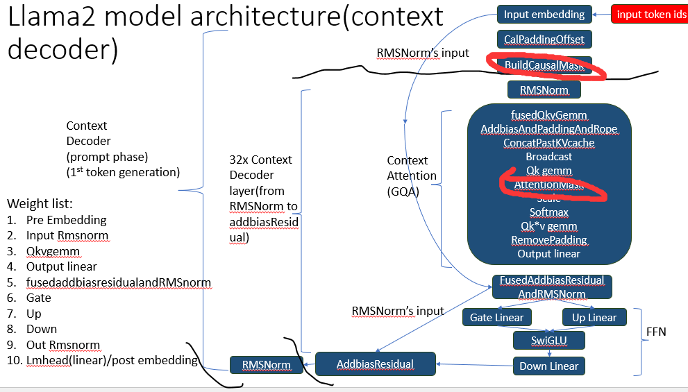
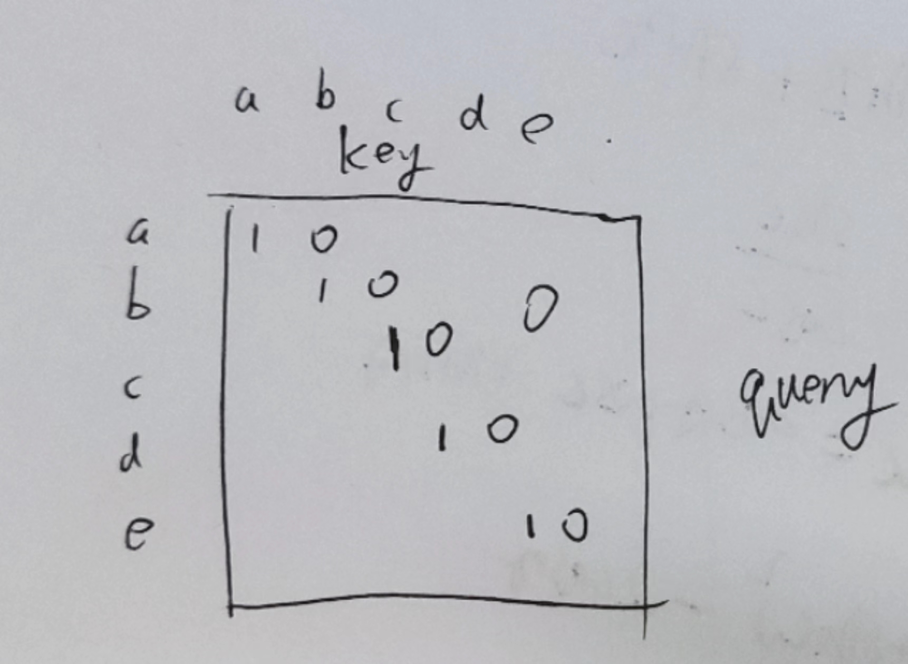
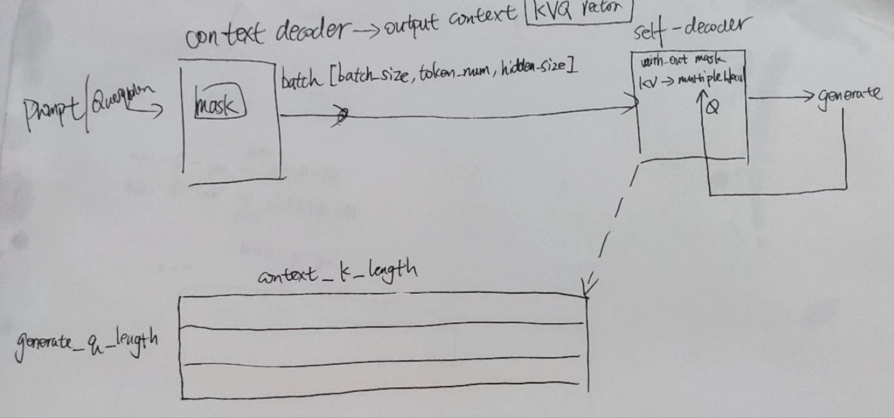
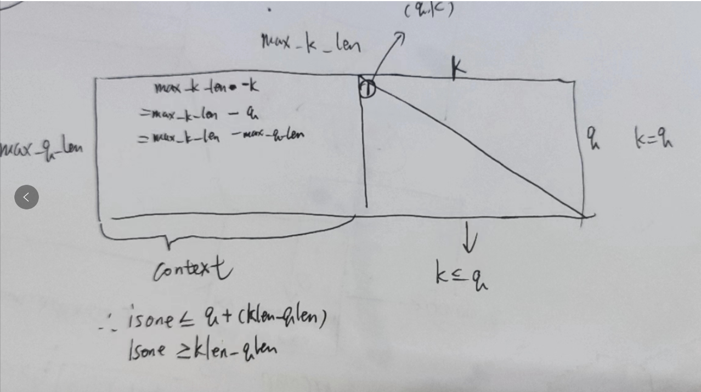

## 1. mask在哪



图中标识出了，Buildmask和使用mask的位置。

注意，mask是在context decoder部分，在selfdecoder部分是没有mask的，因为context decoder需要mask来处理prompt，而selfdecoder是一个自回归，只会给出一个单词，天然的你就看不见后面未生成的token。




在context decoder的推理阶段，用户输入一整个prompt



上面这种说法待定，因为有点问题，我认为只有一个decoder。

## 2.代码中mask矩阵的判定



```c++
 bool is_one = q < qlen && k < klen && k<= q + (klen - qlen) && k >= klen-qlen;
```

## 3. Decoder-Only structure & self-masked attention

https://www.youtube.com/watch?v=bQ5BoolX9Ag

简要说一下

Decoder-only:只使用decoder架构

self-masked attention：Decoder-only使用self-masked时候，会将prompt一同预测，如果预测错了也不管它直接跳过，直到预测到答案。

casual mask：也有一种方法，casualmask，它跳过了prompt，直接开始利用已有的prompt和预测的token作为输入，它在训练时用于遮蔽未来的词，但是在推理时，它应该会准确指向最后一个词（假装后面的全被遮蔽了，实际上后面没有，此时相当于普通自回归）


