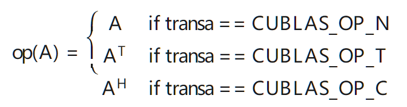

目前大概懂Linear意思就行，等学到模型数据导入再说。搞得时间有点长了。


## 1. 简介

在llama2中，linear使用的十分多，比如将input embedding转换成qkv矩阵的linear，attention输出的output linear， Gate linear,down linear,uplinear。 

考虑到矩阵乘法与linear的高度相似性，我们也将矩阵乘法整合进linear中，例如注意力分数QK，注意力权重QKV。


## 2. 大体思路

直接调用`cublasGemmEx()`和`cublasGemmStrideBatchedEx()`

实际上还有一个`cublasGemmBatchedEx()`函数，这两个函数的区别在于`cublasGemmBatchedEx()`是将矩阵离散的独立存储在内存中的，而`cublasGemmStrideBatchedEx()`是将矩阵连续的存在内存中的，这也意味着它可以使用stride来访问对应的矩阵。

- **使用`cublasGemmBatchedEx`时，批中的矩阵可以分散存储于内存中，提供了存储的灵活性，适合处理大小和布局不一致的矩阵。**
- **使用`cublasGemmStridedBatchedEx`时，批中的矩阵需要连续存储，通过固定的步长分隔，适合处理规模一致、需要高性能的场景。**


### 2.1 `cublasGemmEx()`

此处我们用到的是`cublasGemmEx`,

EX代表了它是cublasGemm的扩展，它允许

* 它允许进行混合精度计算，即输入矩阵、输出矩阵和计算中间结果可以使用不同的精度。

```c++
cublasStatus_t cublasGemmEx(cublasHandle_t handle,
                           cublasOperation_t transa,
                           cublasOperation_t transb,
                           int m,
                           int n,
                           int k,
                           const void    *alpha,
                           const void     *A,
                           cudaDataType_t Atype,
                           int lda,
                           const void     *B,
                           cudaDataType_t Btype,
                           int ldb,
                           const void    *beta,
                           void           *C,
                           cudaDataType_t Ctype,
                           int ldc,
                           cublasComputeType_t computeType,
                           cublasGemmAlgo_t algo)
```

$\alpha$与$\beta$是缩放参数，A，B，C是列主序的matrix，规定

$op(A):m\times k$

$op(B):k\times m$​

$op(C):m\times n$



$$
C = \alpha \times op(A) \times op(B) + \beta \times C
$$

这里ABC的memory必须在device上

最后，lda实际上指的是存时A本身的leading dimension, 不考虑trans影响

简单来说，leading dimension本身是一种存储属性，它代表了一个一维的向量我们应该如何读取，因此它不与操作有关。


`computeType`指定了计算类型，而`datatype`指定了数据类型，这样支持了混合精度计算

> computeType指定了执行矩阵乘法操作和累加过程中使用的数据类型。在某些情况下，即使输入矩阵使用较低精度的数据类型（如FP16），也可能希望在计算过程中使用更高精度的数据类型（如FP32），以提高计算的稳定性和减少舍入误差。这种方法被称为混合精度计算，它结合了不同数据类型的优点，即通过使用较低精度的数据类型来减少内存占用和加速计算，同时保持了计算的准确性。

`cublasGemmAlgo_t`枚举在cuBLAS库中定义了一系列的算法选项，这些算法用于控制通用矩阵乘法（GEMM）操作的具体执行策略。这些策略的不同体现在内存访问模式、计算过程中的数据重用、使用的硬件资源等方面。通过指定不同的`cublasGemmAlgo_t`值，用户可以根据具体的计算需求和硬件配置来优化GEMM操作的性能。

`cublasGemmAlgo_t`提供了多种算法选项，包括但不限于：

- `CUBLAS_GEMM_DFALT` 或 `CUBLAS_GEMM_DEFAULT`：默认算法，cuBLAS库会选择一个基于硬件和输入大小的合理默认算法。
- `CUBLAS_GEMM_ALGO0` 至 `CUBLAS_GEMM_ALGO23`：具体的算法实现，编号越大通常意味着算法越先进，但并不意味着性能一定更好。适用性取决于具体问题的大小、形状以及硬件特性。


### 2.2`cublasGemmStrideBatchedEx`

相比于cublasGemmEx，仅仅多了stride来表示每个batch的matrix该如何跳步访问

```c++
cublasStatus_t cublasGemmStridedBatchedEx(cublasHandle_t handle,
                            cublasOperation_t transa,
                            cublasOperation_t transb,
                            int m,
                            int n,
                            int k,
                            const void    *alpha,
                            const void     *A,
                            cudaDataType_t Atype,
                            int lda,
                            long long int strideA,
                            const void     *B,
                            cudaDataType_t Btype,
                            int ldb,
                            long long int strideB,
                            const void    *beta,
                            void           *C,
                            cudaDataType_t Ctype,
                            int ldc,
                            long long int strideC,
                            int batchCount,
                            cublasComputeType_t computeType,
                            cublasGemmAlgo_t algo)
```


