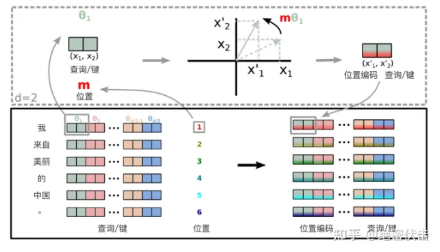
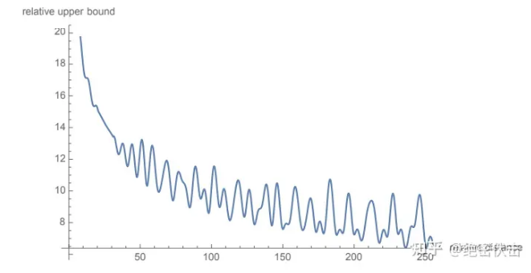

旋转位置编码（Rotary Position Embedding，RoPE）是论文[Roformer: Enhanced Transformer With Rotray Position Embedding](https://link.zhihu.com/?target=https%3A//arxiv.org/pdf/2104.09864.pdf) 提出的一种能够将相对位置信息依赖集成到 self-attention 中并提升 transformer 架构性能的位置编码方式。而目前很火的 LLaMA、GLM 模型也是采用该位置编码方式。

和相对位置编码相比，RoPE 具有更好的**外推性**，目前是大模型相对位置编码中应用最广的方式之一。

> 外推性是指大模型在训练时和预测时的输入长度不一致，导致模型的泛化能力下降的问题。例如，如果一个模型在训练时只使用了512个 token 的文本，那么在预测时如果输入超过512个 token，模型可能无法正确处理。这就限制了大模型在处理长文本或多轮对话等任务时的效果。


> Addbias在llama2中并没有实现，但是在其他模型有可能实现，因此加上。


这个算子的主要作用是

* 添加QKV的bias
* 添加Padding，为了之后QK矩阵乘
* Rope旋转位置编码为序列增加位置信息


## RoPE

### 1.0 简要介绍

旋转位置编码（RoPE）是一种在自然语言处理（NLP）中用于处理位置信息的技术，特别是在使用Transformer模型时。它的主要目标是改进模型对输入序列中各元素位置的理解，从而更好地处理词序和语义。

在处理文本或任何序列数据时，了解元素的顺序（即它们的位置）对于理解整个序列的意义至关重要。例如，在句子“猫坐在垫子上”中，单词的顺序影响了句子的意思。因此，模型需要某种方式来理解这种顺序。

想象一下，每个词或字符都被放在一个圆上，而每个词的位置都通过旋转这个圆来表示。更具体地说：

1. **位置的表示**：在RoPE中，每个位置都通过一个旋转角度来表示。这意味着，对于序列中的每个元素，我们都用一个“旋转”的方式来编码其位置。
2. **旋转的应用**：当我们需要计算词之间的关系（如在自注意力机制中）时，我们会将这些旋转应用到词的表示上。这种方式可以保证，当我们计算两个词之间的关系时，它们的位置信息是被考虑进去的。

RoPE的优势：

1. **保持相对位置信息**：通过将每个位置编码为一个旋转，RoPE可以自然地保持词之间的相对位置。这意味着，无论词与词之间的实际距离如何，模型都能有效捕捉到它们的相对次序。
2. **外推到未见长度**：RoPE允许模型处理比在训练期间见过的序列更长的序列，因为旋转编码可以无限扩展——我们可以继续旋转圆来表示更远的位置。
3. **计算效率**：与其他位置编码方法相比，RoPE可以更加高效地集成到模型中，因为它可以利用常见的数学操作（如矩阵乘法和旋转变换）进行优化。


你可以将RoPE想象为一个时钟的指针。每过一个单位时间，指针就旋转一定的角度。在处理词或字符时，每个单元就像时钟的每次滴答，通过指针的位置（即角度），我们可以知道时间的流逝，这类似于我们通过RoPE知道序列中的位置。每个词都通过这样的“时间”（位置）标记得以区分，而计算它们之间的关系就像观察两个不同时间点的指针位置一样。


### 1.1 符号定义

在介绍 RoPE 之前，先给出一些符号定义，以及基本背景。

首先定义一个长度为 N 的输入序列为：
$$
\mathbb{S}_{N}=\{ w_i \}_{i=1}^{N} \tag1
$$


其中 $w_i $表示输入序列中第 i 个 token，而输入序列 $\mathbb{S}_N$ 对应的 embedding 表示为：
$$
\mathbb{E}_{N}=\{ \mathbf{x}_i \}_{i=1}^N\\\tag2
$$


其中$ \mathbf{x}_i $表示第 i 个 token $w_i $对应的$ d $维词嵌入向量。

接着在做 self-attention 之前，会用词嵌入向量计算 $\mathbf{q,k,v}$ 向量同时加入位置信息，函数公式表达如下：
$$
\mathbf{q}_m=f_q(\mathbf{x}_m,m) \\ \mathbf{k}_n=f_k(\mathbf{x}_n,n) \\ \mathbf{v}_n=f_v(\mathbf{x}_n,n) \\\tag3
$$
其中 $\mathbf{q}_m$ 表示第 m 个 token 对应的词向量 $\mathbf{x}_m$ 集成位置信息 m 之后的 query 向量。而 $\mathbf{k}_n$ 和 $\mathbf{v}_n $则表示第 n 个 token 对应的词向量 $\mathbf{x}_n $集成位置信息 n 之后的 key 和 value 向量。

而基于 transformer 的位置编码方法都是着重于构造一个合适的 $f\left( \mathbf{q},\mathbf{k},\mathbf{v} \right) $函数形式。

而计算第 m 个词嵌入向量 $\mathbf{x}_m$ 对应的 self-attention 输出结果，就是$ \mathbf{q}_m $和其他 $\mathbf{k}_n$ 都计算一个 attention score ，然后再将 attention score 乘以对应的 $\mathbf{v}_n$ 再求和得到输出向量 $\mathbf{o}_m $​：
$$
a_{m,n}=\frac{\text{exp}(\frac{\mathbf{q}_m^{\textbf{T}}\mathbf{k}_n}{\sqrt{d}})}{\sum_{j=1}^N\text{exp}(\frac{\mathbf{q}_m^{\textbf{T}}\mathbf{k}_j}{\sqrt{d}})} \\ \mathbf{o}_m=\sum_{n=1}^Na_{m,n}\mathbf{v}_n \\\tag4
$$


### 1.2 绝对位置编码

对于位置编码，常规的做法是在计算 query, key 和 value 向量之前，会计算一个位置编码向量 $\mathbf{p}_i$ 加到词嵌入 $\mathbf{x}_i $上，位置编码向量$ \mathbf{p}_i $同样也是 d 维向量，然后再乘以对应的变换矩阵 $\mathbf{W} $​获得具有位置信息的QKV矩阵：
$$
f_{t:t\in\{q,k,v\}}(\mathbf{x}_i,i):=\mathbf{W}_{t:t\in\{q,k,v\}}(\mathbf{x}_i+\mathbf{p}_i) \\\tag5
$$
而经典的位置编码向量 $\mathbf{p}_i $​​的计算方式是使用 Sinusoidal 函数：

d为hidden_size，t为embedding中的位置，k为token的位置
$$
\mathbf{p}_{k,2t}=\text{sin}\left( k/10000^{2t/d} \right)\\ \mathbf{p}_{k,2t+1}=\text{cos}\left( k/10000^{2t/d} \right)\\\tag6
$$
其中 $\mathbf{p}_{i,2t} $表示位置 d 维度向量 $\mathbf{p}_i $中的第 2t 位置分量也就是偶数索引位置的计算公式，而$\mathbf{p}_{i,2t+1}$​就对应第 2t+1 位置分量也就是奇数索引位置的计算公式。


- **频率不同的位置信号**：通过使用不同的频率来对不同维度的位置编码进行编码，模型可以学习利用这些频率来捕捉序列中的模式。
- **无限序列的位置信息**：正弦和余弦函数是周期性的，这意味着它们可以有效地编码非常长的序列中的位置信息。

尽管Sinusoidal位置编码是有效的，并且由于其简单和无需学习的特性而被广泛使用，但是


在Sinusoidal编码中，每个位置 k 的编码是通过一系列不同频率的正弦和余弦波形成的。这些波的频率被设计为对数级别的差异，使得任意两个位置的编码可以通过这些波的相位差来区分。这种设计允许模型学习到某种程度上的相对位置信息，因为相位差提供了关于位置差的信息。

例如，两个相邻位置的编码会有一致的、小的相位变化，而两个距离较远的位置则会在一个或多个频率上有较大的相位变化。模型可以利用这些变化来推断位置之间的相对距离。

但是，Sinusoidal编码可能在不同位置间产生相似的编码，尤其是对于长序列，这可能使得模型难以区分远距离的位置。

尽管Sinusoidal编码提供了一种编码相对位置的手段，它并非专门为捕捉这类信息设计。它的相对位置表示能力比不上那些特别为此目的设计的编码方式，如RoPE或其他相对位置编码方法，这些方法通常能更直接、更有效地将相对位置信息集成到模型的注意力机制中。

相比于RoPE这样直接在注意力计算中利用位置关系的方法，Sinusoidal 编码的相对位置信息较为间接，可能不容易被模型充分利用。

==Sinusoidal编码将这个位置编码直接加上向量，而旋转编码利用复数空间的向量旋转映射让位置编码在点积过程中获得了显式相对位置信息==


### 1.3 2维旋转位置编码

考虑第$m$个token作为query，第$n$​个token作为key

它们对应的embedding分别为$x_m$,$x_n$

他们对应的QK向量分别为

$W_q x_m$,$W_k x_n$,其中$W_q$的形状为$d_q\times d$,$W_k$的形状为$d_k\times d$,token的形状为$1\times d$

==论文中提出为了能利用上 token 之间的相对位置信息==，假定 query 向量$ \mathbf{q}_m $和 key 向量 $\mathbf{k}_n $之间的内积操作可以被一个函数 g 表示，该函数 g 的**输入是词嵌入向量$ \mathbf{x}_m ， \mathbf{x}_n $和它们之间的相对位置 $m-n $​**：
$$
\left<\mathbf{f}_q(\mathbf{x}_m,m),f_k(\mathbf{x}_n,n)\right>=g(\mathbf{x}_m,\mathbf{x}_n,m-n) \\\tag7
$$
接下来的目标就是找到一个等价的位置编码方式，从而使得上述关系成立。

假定现在词嵌入向量的维度是两维 d=2 ，这样就可以利用上2维度平面上的向量的几何性质，然后论文中提出了一个满足上述关系的 f 和 g 的形式如下：
$$
f_q(\mathbf{x}_m,m)=\left(\mathbf{W}_q\mathbf{x}_m\right)e^{im\theta} \\ f_k(\mathbf{x}_n,n)=(\mathbf{W}_k\mathbf{x}_n)e^{in\theta} \\ g(\mathbf{x}_m,\mathbf{x}_n,m-n)=\text{Re}\left[(\mathbf{W}_q\mathbf{x}_m)(\mathbf{W}_k\mathbf{x}_n)^{*}e^{i(m-n)\theta}\right] \\\tag8
$$
这里面 Re 表示复数的实部。

这里就能初步窥探RoPE的工作原理

>  这里将token转换为qk向量时，为qk向量添加了基于位置的标识$e^{im\theta},e^{in\theta}$​​。也可以看成是为每个token先添加了一个基于复数乘法的位置信息$W_q(x_m e^{im\theta})$，然后再转换为qk向量
>
> 同时，将传统的qk计算attention score变为了取其实部，这一步确保了内积考虑了 token 间的相对位置差异。


由欧拉公式$(e^{i\theta}=\cos{\theta} + i \sin{\theta})$,进一步地， $f_q $​可以表示成下面的式子：
$$
\begin{align} f_q\left( \mathbf{x}_m,m \right) &= \begin{pmatrix} \cos m\theta & -\sin m\theta) \\ \sin m \theta & \cos m \theta \end{pmatrix} \begin{pmatrix} W^{(1,1)}_{q} & W^{(1,2)}_{q} \\ W^{(2,1)}_{q} & W^{(2,2)}_{q} \end{pmatrix} \begin{pmatrix} x_m^{(1)} \\ x_m^{(2)} \end{pmatrix} \\ &= \begin{pmatrix} \cos m\theta & -\sin m\theta) \\ \sin m \theta & \cos m \theta \end{pmatrix}\begin{pmatrix} q_m^{(1)} \\ q_m^{(2)} \end{pmatrix} \end{align}\tag9
$$


看到这里会发现，这不就是 query 向量乘以了一个旋转矩阵吗？这就是为什么叫做旋转位置编码的原因。

同理， $f_k$​ 可以表示成下面的式子：
$$
\begin{align} f_k\left( \mathbf{x}_m,m \right) &= \begin{pmatrix} \cos m\theta & -\sin m\theta) \\ \sin m \theta & \cos m \theta \end{pmatrix} \begin{pmatrix} W^{(1,1)}_{k} & W^{(1,2)}_{k} \\ W^{(2,1)}_{k} & W^{(2,2)}_{k} \end{pmatrix} \begin{pmatrix} x_m^{(1)} \\ x_m^{(2)} \end{pmatrix} \\ &= \begin{pmatrix} \cos m\theta & -\sin m\theta) \\ \sin m \theta & \cos m \theta \end{pmatrix}\begin{pmatrix} k_m^{(1)} \\ k_m^{(2)} \end{pmatrix} \end{align}\tag{10}
$$


最终 $g(\mathbf{x}_m,\mathbf{x}_n,m-n)$ 可以表示如下：
$$
g(\mathbf{x}_m,\mathbf{x}_n,m-n) =\begin{pmatrix} \mathbf{q}_m^{(1)} & \mathbf{q}_m^{(2)} \\ \end{pmatrix} \begin{pmatrix} \cos((m-n)\theta) & -\sin((m-n)\theta) \\ \sin((m-n)\theta) & \cos((m-n)\theta) \end{pmatrix} \begin{pmatrix} k_n^{(1)} \\ k_n^{(2)} \end{pmatrix} \\\tag{11}
$$
关于上面公式（8）~（11）的具体推导，可以参见文章最后的**附录**，或者参考文章：[一文看懂 LLaMA 中的旋转式位置编码（Rotary Position Embedding）](https://zhuanlan.zhihu.com/p/642884818)。

> 这里补充一下前面公式1.3.2节中，公式（8）~（11）是怎么推导出来的。
>
> 回到之前的公式（8），编码之后的 $\mathbf{q},\mathbf{v}$ 以及内积$ \left< \mathbf{q},\mathbf{v} \right> $​的形式如下：
> $$
> f_q(\mathbf{x}_m,m)=(\mathbf{W}_q\mathbf{x}_m)e^{im\theta} \\ f_k(\mathbf{x}_n,n)=(\mathbf{W}_kx_n)e^{in\theta} \\ g(\mathbf{x}_m,x_n,m-n)=Re[(\mathbf{W}_\mathbf{q}x_m)(\mathbf{W}_k\mathbf{x}_n)^{*}e^{i(m-n)\theta}] \\
> $$
> 上面的公式为什么满足： 
> $$
> \left<\mathbf{f}_q(\mathbf{x}_m,m),f_k(\mathbf{x}_n,n)\right>=g(\mathbf{x}_m,\mathbf{x}_n,m-n)
> $$
> 首先我们得先了解一下基本的复数相关知识。
>
> 首先看到上述 f 和 g 公式中有个指数函数： $$e^{ix} $$
>
> 这个其实是欧拉公式，其中 x 表示任意实数， e 是自然对数的底数， i 是复数中的虚数单位，则根据欧拉公式有：
> $$
> e^{ix} = \cos x + i\sin x \\
> $$
> 则是上述指数函数可以表示为实部为 $\cos x $，虚部为 $\sin x$ 的一个复数，欧拉公式建立了指数函数、三角函数和复数之间的桥梁。
>
> 则上述 f 和 g 公式的
> $$
> e^{im\theta}=\cos (m\theta) + i\sin (m\theta) \\ e^{in\theta}=\cos (n\theta) + i\sin (n\theta) \\ e^{i(m-n)\theta}=\cos ((m-n)\theta) + i\sin ((m-n)\theta) \\
> $$
> 然后我们看回公式：
> $$
> f_q(\mathbf{x}_m,m)=(\mathbf{W}_q\mathbf{x}_m)e^{im\theta} \\
> $$
> 其中 $\mathbf{W}_q $是个二维矩阵， $\mathbf{x}_m $是个二维向量，相乘的结果也是一个二维向量，这里用 $\mathbf{q}_m $​表示：
> $$
> q_m= \begin{pmatrix} q_m^{(1)} \\ q_m^{(2)} \end{pmatrix} = \mathbf{W}_q\mathbf{x}_m =\begin{pmatrix} {W}_q^{(11)} & W_q^{(12)} \\ W_q^{(21)} & W_q^{(22)} \end{pmatrix} \begin{pmatrix} x_m^{(1)} \\ x_m^{(2)} \end{pmatrix} \\
> $$
> 然后首先将 $\mathbf{q}_m $​表示成复数形式,==这里将向量用复数表示是为了将向量赋予复平面的意义，与$e^imθ$呼应，同时使得他们的相乘能够具有复平面中向量旋转的意义==
> $$
> \mathbf{q}_m = [q_m^{(1)}, q_m^{(2)}] = [q_m^{(1)} + iq_m^{(2)}] \\
> $$
> 接着
> $$
> 
> 
> \mathbf{f}_q(\mathbf{x}_m,m)=(\mathbf{W}_q\mathbf{x}_m)e^{im\theta}=\mathbf{q}_me^{im\theta} \\
> $$
> 
>
> 其实就是两个复数相乘：
> $$
> \mathbf{q}_me^{im\theta}=(q_m^{(1)} + iq_m^{(2)}) * (\cos (m\theta) + i\sin (m\theta)) \\
> $$
> 然后就有：
> $$
> \mathbf{q}_me^{im\theta}=(q_m^{(1)} + iq_m^{(2)}) * (\cos (m\theta) + i\sin (m\theta)) \\ =(q_m^{(1)}cos (m\theta) - q_m^{(2)} \sin (m\theta) ) + i(q_m^{(2)}\cos (m\theta) + q_m^{(1)}\sin (m\theta)) \\
> $$
> 
>
> 
>
> 将结果重新表达成实数向量形式就是：
> $$
> \mathbf{q}_me^{im\theta}=[q_m^{(1)} \cos (m\theta) - q_m^{(2)} \sin (m\theta), q_m^{(2)}\cos (m\theta) + q_m^{(1)}\sin (m\theta)] \\
> $$
> 
>
> **这里不难发现就是 query 向量乘以了一个旋转矩阵**。
> $$
> f_q(\mathbf{x}_m,m)=(\mathbf{W}_q\mathbf{x}_m)e^{im\theta}=\mathbf{q}_me^{im\theta}\\ =[q_m^{(1)} \cos (m\theta) - q_m^{(2)} \sin (m\theta), q_m^{(2)}\cos (m\theta) + q_m^{(1)}\sin (m\theta)] \\ = \begin{pmatrix} \cos (m\theta) & -\sin (m\theta) \\ \sin (m\theta) & \cos (m\theta) \end{pmatrix} \begin{pmatrix} q_m^{(1)} \\ q_m^{(2)} \end{pmatrix} \\
> $$
> **这就是为什么叫做旋转式位置编码的原因。**
>
> ==不难发现，实际上引入的复数空间操作在实数空间中就是旋转矩阵操作，我们也就可以得到这么一个结论：如下实数空间旋转矩阵具有如上提到的$g(\mathbf{x}_m,\mathbf{x}_n,m-n)$这种函数的作用，即将相对位置信息编入qk点积。==
>
> 同理可得 key 向量 $\mathbf{k}_n$​ ：
> $$
> f_k(\mathbf{x}_n,n)=(\mathbf{W}_k\mathbf{x}_n)e^{in\theta}=\mathbf{k}_ne^{in\theta}\\ =[k_n^{(1)} \cos (n\theta) - k_n^{(2)} \sin (n\theta), k_n^{(2)}\cos (n\theta) + k_n^{(1)}\sin (n\theta)] \\ = \begin{pmatrix} \cos (n\theta) & -\sin (n\theta) \\ \sin (n\theta) & \cos (n\theta) \end{pmatrix} \begin{pmatrix} k_n^{(1)} \\ k_n^{(2)} \end{pmatrix} \\
> $$
> 最后还有个函数 g ：
> $$
> g(\mathbf{x}_m,\mathbf{x}_n,m-n)=Re[(\mathbf{W}_q\mathbf{x}_m)(\mathbf{W}_k\mathbf{x}_n)^{*}e^{i(m-n)\theta}] \\
> $$
> 其中 $Re\left( x \right)$ 表示一个复数 x 的实部部分，而$ (\mathbf{W}_k\mathbf{x}_n)^{*} $则表示复数 $\mathbf{W}_k\mathbf{x}_n $的共轭。
>
> 复习一下共轭复数的定义： $z=a+ib\\ z^*=a-ib \\$
>
> 所以可得：
> $$
> 
> 
> \mathbf{W}_q\mathbf{x}_m = \mathbf{q}_m = q_m^{(1)} + iq_m^{(2)} \\ \mathbf{W}_k\mathbf{x}_n=\mathbf{k}_n= k_n^{(1)} + ik_n^{(2)} \\ (\mathbf{W}_k\mathbf{x}_n)^*=\mathbf{k}_n^*= k_n^{(1)} - ik_n^{(2)} \\ e^{i(m-n)\theta}=\cos((m-n)\theta) + i \sin((m-n)\theta) \\
> $$
> 
>
> 继续可得：
> $$
> \begin{align} g(\mathbf{x}_m,\mathbf{x}_n,m-n) &=Re[(\mathbf{W}_q\mathbf{x}_m)(\mathbf{W}_k\mathbf{x}_n)^{*}e^{i(m n)\theta}] \\ & = Re[(q_m^{(1)} + iq_m^{(2)})(k_n^{(1)} - ik_n^{(2)})(\cos((m-n)\theta) + i \sin((m-n)\theta))] \\ &= Re[((q_m^{(1)}k_n^{(1)} + q_m^{(2)}k_n^{(2)}) + i(q_m^{(2)}k_n^{(1)} - q_m^{(1)}k_n^{(2)}))(\cos((m-n)\theta) + i \sin((m-n)\theta))] \\ &= (q_m^{(1)}k_n^{(1)} + q_m^{(2)}k_n^{(2)})\cos((m-n)\theta) - (q_m^{(2)}k_n^{(1)} - q_m^{(1)}k_n^{(2)})\sin((m-n)\theta) \end{align}
> $$
> 接下来我们就要证明如果**直接采用旋转矩阵而不适用复数域**，函数 g 的计算公式是成立的。
>
> 首先回顾一下 attention 操作， 位置 m 的 query 和位置 n 的 key 会做一个内积操作：
> $$
> \begin{align} f_q(x_m,m)&=[q_m^{(1)} \cos (m\theta) - q_m^{(2)} \sin (m\theta), q_m^{(2)}\cos (m\theta) + q_m^{(1)}\sin (m\theta)] \\ f_k(x_n,n)& =[k_n^{(1)} \cos (n\theta) - k_n^{(2)} \sin (n\theta), k_n^{(2)}\cos (n\theta) + k_n^{(1)}\sin (n\theta)] \\ <f_q(x_m,m),f_k(x_n,n)> &= (q_m^{(1)} \cos (m\theta) - q_m^{(2)} \sin (m\theta))(k_n^{(1)} \cos (n\theta) - k_n^{(2)} \sin (n\theta)) \\ &+ (q_m^{(2)}\cos (m\theta) + q_m^{(1)}\sin (m\theta))(k_n^{(2)}\cos (n\theta) + k_n^{(1)}\sin (n\theta))\\ & =q_m^{(1)} \cos (m\theta) k_n^{(1)} \cos (n\theta) - q_m^{(1)} \cos (m\theta)k_n^{(2)} \sin (n\theta)\\ & - q_m^{(2)} \sin (m\theta)k_n^{(1)} \cos (n\theta) + q_m^{(2)} \sin (m\theta)k_n^{(2)} \sin (n\theta) \\ & + q_m^{(2)}\cos (m\theta)k_n^{(2)}\cos (n\theta) + q_m^{(2)}\cos (m\theta)k_n^{(1)}\sin (n\theta) \ + q_m^{(1)}\sin (m\theta)k_n^{(2)}\cos (n\theta) + q_m^{(1)}\sin (m\theta)k_n^{(1)}\sin (n\theta) \end{align}
> $$
> 接着进行推导，我们整理一下：
> $$
> \begin{align} <f_q(\mathbf{x}_m,m),f_k(\mathbf{x}_n,n)> &= {q}_m^{(1)}{k}_n^{(1)}(\cos(m\theta)\cos(n\theta) + \sin(m\theta)\sin(n\theta) ) \\ &+ {q}_m^{(1)}{k}_n^{(2)}(-\cos(m\theta)\sin(n\theta) + \sin(m\theta)\cos(n\theta) ) \\ & + {q}_m^{(2)}{k}_n^{(1)}(-\sin(m\theta)\cos(n\theta) + \cos(m\theta)\sin(n\theta) ) \\ &+ {q}_m^{(2)}{k}_n^{(2)}(\sin(m\theta)\sin(n\theta) + \cos(m\theta)\cos(n\theta) ) \\ & = q_m^{(1)}k_n^{(1)}\cos((m-n)\theta) \\ &+ q_m^{(1)}k_n^{(2)}\sin((m-n)\theta) \\ &- q_m^{(2)}k_n^{(1)}\sin((m-n)\theta) \\ & + q_m^{(2)}k_n^{(2)}\cos((m-n)\theta) \\ &= (q_m^{(1)}k_n^{(1)} + q_m^{(2)}k_n^{(2)})\cos((m-n)\theta) + (q_m^{(1)}k_n^{(2)}- q_m^{(2)}k_n^{(1)})\sin((m-n)\theta) \\ & = (q_m^{(1)}k_n^{(1)} + q_m^{(2)}k_n^{(2)})\cos((m-n)\theta) - (q_m^{(2)}k_n^{(1)} - q_m^{(1)}k_n^{(2)})\sin((m-n)\theta) \\ &=g(x_m,x_n,m-n) \end{align}
> $$
> 这就证明上述关系是成立的，位置 m 的 query 和位置 n 的 key 的内积就是函数 g 。
>
> 把上面的式子用矩阵向量乘的形式来表达就是：
> $$
> <f_q(\mathbf{x}_m,m),f_k(\mathbf{x}_n,n)> \\ =\begin{pmatrix} \begin{pmatrix} \cos (m\theta) & -\sin (m\theta) \\ \sin (m\theta) & \cos (m\theta) \end{pmatrix} \begin{pmatrix} q_m^{(1)} \\ q_m^{(2)} \end{pmatrix} \end{pmatrix}^T \begin{pmatrix} \begin{pmatrix} \cos (n\theta) & -\sin (n\theta) \\ \sin (n\theta) & \cos (n\theta) \end{pmatrix} \begin{pmatrix} k_n^{(1)} \\ k_n^{(2)} \end{pmatrix} \end{pmatrix} \\ = \begin{pmatrix} q_m^{(1)} & q_m^{(2)} \\ \end{pmatrix} \begin{pmatrix} \cos (m\theta) & \sin (m\theta) \\ -\sin (m\theta) & \cos (m\theta) \end{pmatrix} \begin{pmatrix} \cos (n\theta) & -\sin (n\theta) \\ \sin (n\theta) & \cos (n\theta) \end{pmatrix} \begin{pmatrix} k_n^{(1)} \\ k_n^{(2)} \end{pmatrix} \\ = \begin{pmatrix} q_m^{(1)} & q_m^{(2)} \\ \end{pmatrix} \begin{pmatrix} \cos(m\theta)\cos(n\theta) + \sin(m\theta)\sin(n\theta) & -\cos(m\theta)\sin(n\theta) + \sin(m\theta)\cos(n\theta) \\ -\sin(m\theta)\cos(n\theta) + \cos(m\theta)\sin(n\theta) & \sin(m\theta)\sin(n\theta) + \cos(m\theta)\cos(n\theta) \end{pmatrix} \begin{pmatrix} k_n^{(1)} \\ k_n^{(2)} \end{pmatrix} \\ =\begin{pmatrix} q_m^{(1)} & q_m^{(2)} \\ \end{pmatrix} \begin{pmatrix} \cos((m-n)\theta) & -\sin((m-n)\theta) \\ \sin((m-n)\theta) & \cos((m-n)\theta) \end{pmatrix} \begin{pmatrix} k_n^{(1)} \\ k_n^{(2)} \end{pmatrix} \\
> $$

### 1.4 扩展到多维

将2维推广到任意维度，可以表示如下：
$$
f_{\left\{ q,k \right\}}\left( \mathbf{x}_m,m \right)=\mathbf{R}^d_{\Theta,m}\mathbf{W}_{\left\{ q,k \right\}}\mathbf{x}_m\\\tag{12}
$$
内积满足线性叠加性，因此任意偶数维的RoPE，我们都可以表示为二维情形的拼接（一般来说embedding都会被设置为2的幂），即

> **线性叠加性**是指当你有两个向量 **a** 和 **b**，每个向量都可以分解成几个部分或子向量，那么这些子向量间的内积之和等于原始向量间的内积。

> $\mathbf{R}^d_{\Theta,m}$是一个$d\times d$的矩阵，它描述了对于位置在m的token的旋转编码。
>
> 在qk内积时，我们可以获得d/2个上面提到的二维旋转关系，里面的每个关系都描述了一个类似$cos((m-n)\theta_i),sin((m-n)\theta_i )$的含有两个token相对位置信息的旋转编码。
>
> 因为内积的线性叠加性，因此这个做法相当于与构造一个d元数（$xi_1 + yi_2 + zi_3 ... + wi_d $，其中$i_d,i_1$等为虚数）的作用相同，但是其获得的是一个稀疏矩阵。

$$
\mathbf{R}^d_{\Theta,m}=\begin{equation}\scriptsize{\underbrace{\begin{pmatrix} \cos m\theta_0 & -\sin m\theta_0 & 0 & 0 & \cdots & 0 & 0 \\ \sin m\theta_0 & \cos m\theta_0 & 0 & 0 & \cdots & 0 & 0 \\ 0 & 0 & \cos m\theta_1 & -\sin m\theta_1 & \cdots & 0 & 0 \\ 0 & 0 & \sin m\theta_1 & \cos m\theta_1 & \cdots & 0 & 0 \\ \vdots & \vdots & \vdots & \vdots & \ddots & \vdots & \vdots \\ 0 & 0 & 0 & 0 & \cdots & \cos m\theta_{d/2-1} & -\sin m\theta_{d/2-1} \\ 0 & 0 & 0 & 0 & \cdots & \sin m\theta_{d/2-1} & \cos m\theta_{d/2-1} \\ \end{pmatrix}}_{\boldsymbol{W}_m}}\end{equation}\\\tag{13}
$$

$$
\Theta=\left\{ \theta_i=10000^{-2(i-1)/d}, i \in [1,2,...,d/2] \right\} \\
$$

> 上面的$\mathbf{R}^d_{\Theta,m}$每个子块应该是相当于对每个embedding二维子向量逆时针旋转$m\theta_0$$m\theta_1$,...,$m\theta_{d/2-1}$的角度
>
> 对于$\Theta$，10000为它的尺度基数，选择一个较大的尺度基数（如10000）可以使得 $\theta_i$ 跨越一个广阔的范围，从而能够让编码过程在多个频率层次上灵活调整，确保细粒度和粗粒度的位置信息都能得到适当的编码。尺度基数决定了角度的减小速度。基数越大，对应的 $\theta_i$ 衰减得越慢，允许位置编码在更大的序列长度上保持敏感和有效。
>
> 指数$-2(i-1)/d$用于控制随着维度增加$\theta_i$的减小速度
>
> - **递减模式**：指数中的 −2 表示每增加一对维度，角度衰减的速度，这有助于快速减少基本角度，使得高维度对的旋转角度远小于低维度对。
> - **尺度调整**：除以 *d*（维度数的一半）是为了确保这种衰减跨越所有维度平滑进行，不受具体维度数量的影响。
>
> 计算出 $θ_i$ 后，它们被用于构造每个二维子矩阵的 cos⁡cos 和 sin⁡sin 函数：
>
> - $cos(m\theta_i)$和$sin(m\theta_i)$：这些值定义了旋转矩阵的具体形态，其中 *m* 是序列中元素的位置索引。这意味着每个元素在各自的二维子空间中将根据其位置 *m* 和对应的频率 $θ_i$ 被旋转。
> - **作用**：通过 ⁡cos 和 ⁡sin 函数，RoPE 实现了每个词向量分量在其对应的二维平面内的位置依赖旋转。这种旋转确保了模型不仅能够捕捉每个位置的独立特征，还能通过不同位置的相对旋转差异捕捉序列内的上下文关系。
>
> ==旋转的主要作用就是提供相对位置信息，对embedding的每个位置上，针对每个token的顺序编辑了旋转的位置信息，这样在qk点积的时候就会自动获得相对位置信息==

将 RoPE 应用到前面公式（4）的 Self-Attention 计算，可以得到**包含相对位置信息的Self-Attetion**：
$$
\mathbf{q}^{\textbf{T}}_m\mathbf{k}_n=\left( \mathbf{R}^d_{\Theta,m}\mathbf{W}_q\mathbf{x}_m \right)^{\textbf{T}}\left( \mathbf{R}^d_{\Theta,n}\mathbf{W}_k\mathbf{x}_n \right)=\mathbf{x}_m^{\textbf{T}}\mathbf{W}_q\mathbf{R}^d_{\Theta,n-m}\mathbf{W}_k\mathbf{x}_n\tag{14} 其中， \mathbf{R}^d_{\Theta,n-m}=\left( \mathbf{R}^d_{\Theta,m} \right)^{\textbf{T}}\mathbf{R}^d_{\Theta,n} 。
$$


值得指出的是，由于$\mathbf{R}^d_{\Theta}$是一个正交矩阵，它不会改变向量的模长，因此通常来说它不会改变原模型的稳定性。

### 1.5 RoPE 的高效计算

由于$\mathbf{R}^d_{\Theta,m}$​的稀疏性，所以直接用矩阵乘法来实现会很浪费算力，**推荐通过下述方式来实现 RoPE**：
$$
\mathbf{R}^d_{\Theta,m}\mathbf{x}=\begin{equation}\begin{pmatrix}x_0 \\ x_1 \\ x_2 \\ x_3 \\ \vdots \\ x_{d-2} \\ x_{d-1} \end{pmatrix}\otimes\begin{pmatrix}\cos m\theta_0 \\ \cos m\theta_0 \\ \cos m\theta_1 \\ \cos m\theta_1 \\ \vdots \\ \cos m\theta_{d/2-1} \\ \cos m\theta_{d/2-1} \end{pmatrix} + \begin{pmatrix}-x_1 \\ x_0 \\ -x_3 \\ x_2 \\ \vdots \\ -x_{d-1} \\ x_{d-2} \end{pmatrix}\otimes\begin{pmatrix}\sin m\theta_0 \\ \sin m\theta_0 \\ \sin m\theta_1 \\ \sin m\theta_1 \\ \vdots \\ \sin m\theta_{d/2-1} \\ \sin m\theta_{d/2-1} \end{pmatrix}\end{equation}\\\tag{15}
$$


其中$\otimes$是逐位对应相乘，即计算框架中的*运算。从这个实现也可以看到，RoPE 可以视为是乘性位置编码的变体。

总结来说，RoPE 的 self-attention 操作的流程是：对于 token 序列中的每个词嵌入向量，首先计算其对应的 query 和 key 向量，然后对每个 token 位置都计算对应的旋转位置编码，接着对每个 token 位置的 query 和 key 向量的元素按照 **两两一组** 应用旋转变换，最后再计算 query 和 key 之间的内积得到 self-attention 的计算结果。

论文中有个很直观的图片展示了旋转变换的过程：



### 1.6 远程衰减

可以看到，RoPE 形式上和前面公式（6） Sinusoidal 位置编码有点相似，只不过 Sinusoidal 位置编码是加性的，而 RoPE 可以视为乘性的。在$ \theta_i$ 的选择上，RoPE 同样沿用了 Sinusoidal 位置编码的方案，即$\theta_i = 10000^{-2i/d}$，它可以带来一定的远程衰减性。

具体证明如下：将$ \boldsymbol{q},\boldsymbol{k} $​两两分组后，它们加上 RoPE 后的内积可以用复数乘法表示为：
$$
\begin{equation} \left( \mathbf{R}^d_{\Theta,m}\mathbf{W}_q\mathbf{x}_m \right)^{\textbf{T}}\left( \mathbf{R}^d_{\Theta,n}\mathbf{W}_k\mathbf{x}_n \right)= \text{Re}\left[\sum_{i=0}^{d/2-1}\boldsymbol{q}_{[2i:2i+1]}\boldsymbol{k}_{[2i:2i+1]}^* e^{\text{i}(m-n)\theta_i}\right]\end{equation}\\\tag{16}
$$


记 $h_i = \boldsymbol{q}_{[2i:2i+1]}\boldsymbol{k}_{[2i:2i+1]}^*, S_j = \sum\limits_{i=0}^{j-1} e^{\text{i}(m-n)\theta_i}$，并约定$h_{d/2}=0,S_0=0$​，那么由**[Abel变换（分部求和法）](https://link.zhihu.com/?target=https%3A//zh.wikipedia.org/wiki/%E5%88%86%E9%83%A8%E6%B1%82%E5%92%8C%E6%B3%95)**可以得到：
$$
\begin{equation}\sum_{i=0}^{d/2-1}\boldsymbol{q}_{[2i:2i+1]}\boldsymbol{k}_{[2i:2i+1]}^* e^{\text{i}(m-n)\theta_i} = \sum_{i=0}^{d/2-1} h_i (S_{i +1} - S_i) = \sum_{i=0}^{d/2-1} S_{i+1}(h_{i+1} - h_i)\end{equation}\\\tag{17}
$$
所以
$$
\begin{equation}\begin{aligned} \left|\sum_{i=0}^{d/2-1}\boldsymbol{q}_{[2i:2i+1]}\boldsymbol{k}_{[2i:2i+1]}^* e^{\text{i}(m-n)\theta_i}\right| =&\, \left|\sum_{i=0}^{d/2-1} S_{i+1}(h_{i+1} - h_i)\right| \\ \leq&\, \sum_{i=0}^{d/2-1} |S_{i+1}| |h_{i+1} - h_i| \\ \leq&\, \left(\max_i |h_{i+1} - h_i|\right)\sum_{i=0}^{d/2-1} |S_{i+1}| \end{aligned}\end{equation}\\\tag{18}
$$
因此我们可以考察$ \frac{1}{d/2}\sum\limits_{i=1}^{d/2} |S_i|$ 随着相对距离的变化情况来作为衰减性的体现：



从图中我们可以看到**随着相对距离的变大，内积结果有衰减趋势**的出现。因此，选择 $\theta_i = 10000^{-2i/d}$，确实能带来一定的远程衰减性。论文中还试过以$ \theta_i = 10000^{-2i/d} $为初始化，将 $\theta_i $视为可训练参数，然后训练一段时间后发现 $\theta_i $并没有显著更新，因此干脆就直接固定$\theta_i = 10000^{-2i/d}$了。


## RoPE代码实现

Meta 的 LLAMA 使用了 RoPE 编码，下面看一下具体实现。

```python3
# 生成旋转矩阵
def precompute_freqs_cis(dim: int, seq_len: int, theta: float = 10000.0):
    # 计算词向量元素两两分组之后，每组元素对应的旋转角度\theta_i
    freqs = 1.0 / (theta ** (torch.arange(0, dim, 2)[: (dim // 2)].float() / dim))
    # 生成 token 序列索引 t = [0, 1,..., seq_len-1]
    t = torch.arange(seq_len, device=freqs.device)
    # freqs.shape = [seq_len, dim // 2] 
    freqs = torch.outer(t, freqs).float()  # 计算m * \theta

    # 计算结果是个复数向量
    # 假设 freqs = [x, y]
    # 则 freqs_cis = [cos(x) + sin(x)i, cos(y) + sin(y)i]
    freqs_cis = torch.polar(torch.ones_like(freqs), freqs) 
    return freqs_cis

# 旋转位置编码计算
def apply_rotary_emb(
    xq: torch.Tensor,
    xk: torch.Tensor,
    freqs_cis: torch.Tensor,
) -> Tuple[torch.Tensor, torch.Tensor]:
    # xq.shape = [batch_size, seq_len, dim]
    # xq_.shape = [batch_size, seq_len, dim // 2, 2]
    xq_ = xq.float().reshape(*xq.shape[:-1], -1, 2)
    xk_ = xk.float().reshape(*xk.shape[:-1], -1, 2)
    
    # 转为复数域
    xq_ = torch.view_as_complex(xq_)
    xk_ = torch.view_as_complex(xk_)
    
    # 应用旋转操作，然后将结果转回实数域
    # xq_out.shape = [batch_size, seq_len, dim]
    xq_out = torch.view_as_real(xq_ * freqs_cis).flatten(2)
    xk_out = torch.view_as_real(xk_ * freqs_cis).flatten(2)
    return xq_out.type_as(xq), xk_out.type_as(xk)

class Attention(nn.Module):
    def __init__(self, args: ModelArgs):
        super().__init__()

        self.wq = Linear(...)
        self.wk = Linear(...)
        self.wv = Linear(...)
        
        self.freqs_cis = precompute_freqs_cis(dim, max_seq_len * 2)

    def forward(self, x: torch.Tensor):
        bsz, seqlen, _ = x.shape
        xq, xk, xv = self.wq(x), self.wk(x), self.wv(x)

        xq = xq.view(batch_size, seq_len, dim)
        xk = xk.view(batch_size, seq_len, dim)
        xv = xv.view(batch_size, seq_len, dim)

        # attention 操作之前，应用旋转位置编码
        xq, xk = apply_rotary_emb(xq, xk, freqs_cis=freqs_cis)
        
        # scores.shape = (bs, seqlen, seqlen)
        scores = torch.matmul(xq, xk.transpose(1, 2)) / math.sqrt(dim)
        scores = F.softmax(scores.float(), dim=-1)
        output = torch.matmul(scores, xv)  # (batch_size, seq_len, dim)
  # ......
```

这里举一个例子，假设batch_size=10, seq_len=3, d=8，则调用函数precompute_freqs_cis(d, seq_len)后，生成结果为：

```python3
In [239]: freqs_cis
Out[239]: 
tensor([[ 1.0000+0.0000j,  1.0000+0.0000j,  1.0000+0.0000j,  1.0000+0.0000j],
        [ 0.5403+0.8415j,  0.9950+0.0998j,  0.9999+0.0100j,  1.0000+0.0010j],
        [-0.4161+0.9093j,  0.9801+0.1987j,  0.9998+0.0200j,  1.0000+0.0020j]])
```

以结果中的第二行为例（对应的 m = 1），也就是：
$$
\begin{align} cos\left( 1*\theta_0 \right)&=cos\left( 1 \right)=0.5403,&sin\left( 1*\theta_0 \right)=sin\left( 1 \right)=0.8415\\ cos\left( 1*\theta_1\right)&=cos\left( 0.1 \right)=0.9950,&sin\left( 1*\theta_1 \right)=sin\left( 0.1 \right)=0.0998\\ cos\left( 1*\theta_2 \right)&=cos\left( 0.01 \right)=0.9999,&sin\left( 1*\theta_2 \right)=sin\left( 0.01 \right)=0.0100\\ cos\left( 1*\theta_3 \right)&=cos\left( 0.001 \right)=1.0000,&sin\left( 1*\theta_3 \right)=sin\left( 0.001 \right)=0.0010 \end{align}\tag{19}
$$
最终按照公式（12）可以得到编码之后的 $\mathbf{q},\mathbf{k}$ 。

**注意：**在代码中是直接用freqs_cis[0] * xq_[0]的结果表示第一个 token 对应的旋转编码（和公式12计算方式有所区别）。其中将原始的 query 向量 $\mathbf{q}$ 转换为了复数形式。

```python3
In [351]: q_ = q.float().reshape(*q.shape[:-1], -1, 2)

In [352]: q_[0]
Out[352]: 
tensor([[[ 1.0247,  0.4782],
         [ 1.5593,  0.2119],
         [ 0.4175,  0.5309],
         [ 0.4858,  0.1850]],

        [[-1.7456,  0.6849],
         [ 0.3844,  1.1492],
         [ 0.1700,  0.2106],
         [ 0.5433,  0.2261]],

        [[-1.1206,  0.6969],
         [ 0.8371, -0.7765],
         [-0.3076,  0.1704],
         [-0.5999, -1.7029]]])

In [353]: xq = torch.view_as_complex(q_)

In [354]: xq[0]
Out[354]: 
tensor([[ 1.0247+0.4782j,  1.5593+0.2119j,  0.4175+0.5309j,  0.4858+0.1850j],
        [-1.7456+0.6849j,  0.3844+1.1492j,  0.1700+0.2106j,  0.5433+0.2261j],
        [-1.1206+0.6969j,  0.8371-0.7765j, -0.3076+0.1704j, -0.5999-1.7029j]])
```

**这里为什么可以这样计算？**

主要是利用了复数的乘法性质。

我们首先来复习一下复数乘法的性质：
$$
(a+ib) \cdot (c+id) = ac + ibc + iad + i^2bd=(ac-bd)+i(bc+ad) \\
$$


因此要计算：
$$
\begin{align} f_q\left( \mathbf{x}_m,m \right) &= \begin{pmatrix} \cos m\theta & -\sin m\theta \\ \sin m \theta & \cos m \theta \end{pmatrix}\begin{pmatrix} q_m^{(1)} \\ q_m^{(2)} \end{pmatrix} \\ &= \left( \cos m\theta *q_m^{(1)}-\sin m\theta *q_m^{(2)} ,\sin m\theta *q_m^{(1)}-\cos m\theta *q_m^{(2)} \right) \end{align}
$$
可以转化为计算：
$$
\left( \cos m\theta+i \sin m\theta \right)\cdot \left( q_m^{(1)}+i q_m^{(2)} \right)\\
$$
所以可以将公式（12）转化为两个复数的乘法运算。


## RoPE的外推性

我们都知道 RoPE 具有很好的外推性，前面的实验结果也证明了这一点。这里解释下具体原因。

RoPE 可以通过旋转矩阵来实现位置编码的外推，即可以通过旋转矩阵来生成超过预期训练长度的位置编码。这样可以提高模型的泛化能力和鲁棒性。

我们回顾一下 RoPE 的工作原理：假设我们有一个 d 维的绝对位置编码$ P_i $，其中 i 是位置索引。我们可以将$ P_i $看成一个 d 维空间中的一个点。我们可以定义一个 d 维空间中的一个旋转矩阵 $\mathbf{R} $，它可以将任意一个点沿着某个轴旋转一定的角度。我们可以用 $\mathbf{R}$ 来变换 $P_i $，得到一个新的点 $Q_i=\mathbf{R}*P_i $。我们可以发现， $Q_i $和$ P_i $的距离是相等的，即$ \left|\left| Q_i-P_i \right|\right| = 0 $。这意味着 $Q_i $和$ P_i $的相对关系没有改变。但是， $Q_i $和 $P_i $的距离可能发生改变，即$ \left|\left| Q_i-P_j \right|\right| \ne \left|\left| P_i-P_j \right|\right|$。这意味着 $Q_i$和 $P_j $的相对关系有所改变。因此，我们可以用 $\mathbf{R} $来调整不同位置之间的相对关系。

如果我们想要生成超过预训练长度的位置编码，我们只需要用$ \mathbf{R} $来重复变换最后一个预训练位置编码 $P_n$ ，得到新的位置编码 $Q_{n+1} = \mathbf{R} * P_n ，Q_{n+2} = \mathbf{R} * Q_{n+1} ， Q_{n+3} = \mathbf{R} * Q_{n+2} $，依此类推。这样就可以得到任意长度的位置编码序列$ Q_1, Q_2, …, Q_m $，其中 m 可以大于 n 。由于$ \mathbf{R} $是一个正交矩阵，它保证了 $Q_i $和 $Q_j $的距离不会无限增大或缩小，而是在一个有限范围内波动。这样就可以避免数值溢出或下溢的问题。同时，由于$ \mathbf{R} $是一个可逆矩阵，它保证了 $Q_i $和 $Q_j$ 的距离可以通过 $\mathbf{R}$ 的逆矩阵$ \mathbf{R}^{-1} $还原到$ P_i $和 $P_j $的距离，即 $||\mathbf{R}^{-1} * Q_i - \mathbf{R}^{-1} * Q_j|| = ||P_i - P_j||$ 。这样就可以保证位置编码的可逆性和可解释性。

总结而言：

**旋转编码 RoPE 可以有效地保持位置信息的相对关系**，即相邻位置的编码之间有一定的相似性，而远离位置的编码之间有一定的差异性。这样可以增强模型对位置信息的感知和利用。这一点是其他绝对位置编码方式（如正弦位置编码、学习的位置编码等）所不具备的，因为它们只能表示绝对位置，而不能表示相对位置。

**旋转编码 RoPE 可以通过旋转矩阵来实现位置编码的外推**，即可以通过旋转矩阵来生成超过预训练长度的位置编码。这样可以提高模型的泛化能力和鲁棒性。这一点是其他固定位置编码方式（如正弦位置编码、固定相对位置编码等）所不具备的，因为它们只能表示预训练长度内的位置，而不能表示超过预训练长度的位置。

**旋转编码 RoPE 可以与线性注意力机制兼容**，即不需要额外的计算或参数来实现相对位置编码。这样可以降低模型的计算复杂度和内存消耗。这一点是其他混合位置编码方式（如Transformer-XL、XLNet等）所不具备的，因为它们需要额外的计算或参数来实现相对位置编码。
