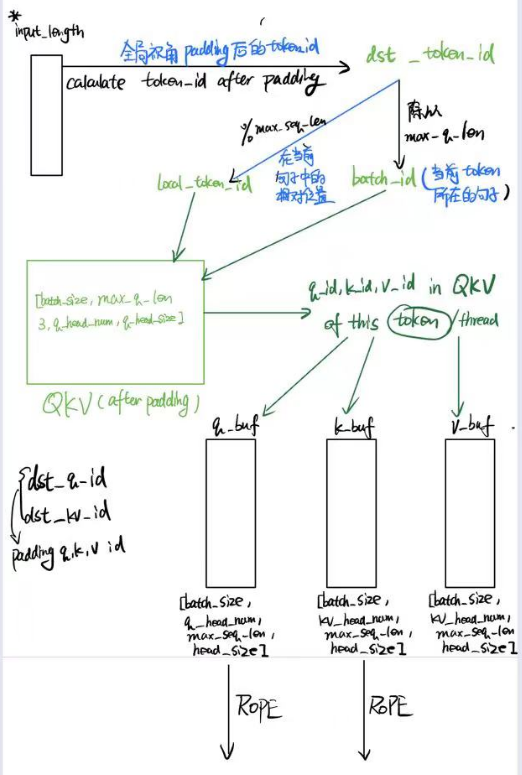

## 总览

旋转位置编码（Rotary Position Embedding，RoPE）是论文[Roformer: Enhanced Transformer With Rotray Position Embedding](https://link.zhihu.com/?target=https%3A//arxiv.org/pdf/2104.09864.pdf) 提出的一种能够将相对位置信息依赖集成到 self-attention 中并提升 transformer 架构性能的位置编码方式。而目前很火的 LLaMA、GLM 模型也是采用该位置编码方式。

和相对位置编码相比，RoPE 具有更好的**外推性**，目前是大模型相对位置编码中应用最广的方式之一。

> 外推性是指大模型在训练时和预测时的输入长度不一致，导致模型的泛化能力下降的问题。例如，如果一个模型在训练时只使用了512个 token 的文本，那么在预测时如果输入超过512个 token，模型可能无法正确处理。这就限制了大模型在处理长文本或多轮对话等任务时的效果。


> Addbias在llama2中并没有实现，但是在其他模型有可能实现，因此加上。


这个算子的主要作用是

* 添加QKV的bias(如果有)
* 添加Padding，为了之后QK矩阵乘
* Rope旋转位置编码为序列增加位置信息


#### RoPE

Rope的具体公式见1.5 RoPE高效计算


因此，对于在sequence中位于位置$i$的token，其为一个大小为[hidden_size]的embedding vector，

实际上，可以得到如下函数,$m$代表是第$m$个token，i代表第i个子频率,d代表总维度。
$$
x_d = cos\frac{m}{10000^{2(i-1)/d}} * x_d - x_{d+1}sin\frac{m}{10000^{2(i-1)/d}}
$$
这里的$\frac{m}{10000^{2(i-1)/d}}$也被称为frequency

```c++
//计算旋转矩阵所需要用到的值
inline __device__ float2 GetRoPEfreq(int zid, int rot_embed_dim, float base, float t_step)
{
    // base是10000
    // rot_embed_dim 就是d
    // zid就是2（i-1）
    // t_step就是token_id
    
    float inv_freq = t_step / powf(base, zid/(float)rot_embed_dim);
    return {cos(inv_freq),sin(inv_freq)};
}

inline __device__ float2 GetRoPEres(const float2 v, const float2 coef){
    // v:x_i,x_i+1
    
    // rot_v.x = v.x * cosmθ -v.y * sinmθ
    // rot_v.y = v.y * cosmθ +v.x * sinmθ
    float2 rot_v; 
    rot_v.x = coef.x * v.x - coef.y * v.y;
    rot_v.y = coef.x * v.y + coef.y * v.x;
}
```

这里使用Multihead，在RoPE中，对每个head(长度为64)使用RoPE，因此每个head的frequency其实是一样的。

在最先进的llm中，通常不这样做，仍然是对1-256做RoPE

#### llama RoPE

llama的rope做了一些改进，主要就是对每个head里面，0dimension与headsize/2 dimension互相旋转。

在这里，考虑qkv cache存储肯定是没有token的，因此需要考虑这种方法。

我们需要从qkv cache中读取当前句子的qkv cache，并且加入到考虑了padding的QKV中，然后依据这个cache生成token，然后按照static batch生成这一整个batch的即可。

##### Padding复习

之前的padding会返回一个**padding offset**如下。


##### QKVGemm

在QKVGemm中，他们会对padding后的矩阵分别乘上Multi-Head Attention，获得了q_buffer, k_buffer,v_buffer，**我们在之前的QKV Gemm为了快速计算可直接获得QKV矩阵**，代表即将生成的context的history，可以复用，**每次从QKV矩阵提取qkvbuff使用。**

（**注意，在MQA，GQA中可能q_head和kv_head不一样多,一般q_head更多**）,这个矩阵中qkv head num可能不一样。


此处，q_buf,k_buf,v_buf代表没有padding时连续的存储，以上一部分"Padding复习"中的例子来说，就是`(6+4+5+3+10)*(qhead_num, head_size)`,`28*kvhead_num*head_size`


$\color{red}下图QKV写错了，其实是batch_size,seq\_len,3,head_num,head\_size$


##### GPU-Kernel

我们启动一个kernel，形状如下，每一列代表一个token。


##### RoPE

考虑到QKV是padding后得到的矩阵，因此我们需要用到padding后的token_id，而非原始的token_id

通过上面的kernel我们可以知道token_id，因此我们可以对其计算padding offset获得**padding后这个token应该为的token_id: dst_token_id**

通过这个id，我们能从QKV矩阵中选到这个thread所需要的q_id,k_id,v_id，将其分别填充到q_buffer,k_buffer,v_buffer中（当然也是padding后来算的）

然后，对k_buffer和q_buffer使用RoPE即可




llama中RoPE变成了如下，rotary的对象从相邻的两个变为了前半部分后后半部分的对应位置。


## RoPE

### 1.0 简要介绍

旋转位置编码（RoPE）是一种在自然语言处理（NLP）中用于处理位置信息的技术，特别是在使用Transformer模型时。它的主要目标是改进模型对输入序列中各元素位置的理解，从而更好地处理词序和语义。

在处理文本或任何序列数据时，了解元素的顺序（即它们的位置）对于理解整个序列的意义至关重要。例如，在句子“猫坐在垫子上”中，单词的顺序影响了句子的意思。因此，模型需要某种方式来理解这种顺序。

想象一下，每个词或字符都被放在一个圆上，而每个词的位置都通过旋转这个圆来表示。更具体地说：

1. **位置的表示**：在RoPE中，每个位置都通过一个旋转角度来表示。这意味着，对于序列中的每个元素，我们都用一个“旋转”的方式来编码其位置。
2. **旋转的应用**：当我们需要计算词之间的关系（如在自注意力机制中）时，我们会将这些旋转应用到词的表示上。这种方式可以保证，当我们计算两个词之间的关系时，它们的位置信息是被考虑进去的。

RoPE的优势：

1. **保持相对位置信息**：通过将每个位置编码为一个旋转，RoPE可以自然地保持词之间的相对位置。这意味着，无论词与词之间的实际距离如何，模型都能有效捕捉到它们的相对次序。
2. **外推到未见长度**：RoPE允许模型处理比在训练期间见过的序列更长的序列，因为旋转编码可以无限扩展——我们可以继续旋转圆来表示更远的位置。
3. **计算效率**：与其他位置编码方法相比，RoPE可以更加高效地集成到模型中，因为它可以利用常见的数学操作（如矩阵乘法和旋转变换）进行优化。


你可以将RoPE想象为一个时钟的指针。每过一个单位时间，指针就旋转一定的角度。在处理词或字符时，每个单元就像时钟的每次滴答，通过指针的位置（即角度），我们可以知道时间的流逝，这类似于我们通过RoPE知道序列中的位置。每个词都通过这样的“时间”（位置）标记得以区分，而计算它们之间的关系就像观察两个不同时间点的指针位置一样。


### 1.1 符号定义

在介绍 RoPE 之前，先给出一些符号定义，以及基本背景。

首先定义一个长度为 N 的输入序列为：
$$
\mathbb{S}_{N}=\{ w_i \}_{i=1}^{N} \tag1
$$


其中 $w_i $表示输入序列中第 i 个 token，而输入序列 $\mathbb{S}_N$ 对应的 embedding 表示为：
$$
\mathbb{E}_{N}=\{ \mathbf{x}_i \}_{i=1}^N\\\tag2
$$


其中$ \mathbf{x}_i $表示第 i 个 token $w_i $对应的$ d $维词嵌入向量。

接着在做 self-attention 之前，会用词嵌入向量计算 $\mathbf{q,k,v}$ 向量同时加入位置信息，函数公式表达如下：
$$
\mathbf{q}_m=f_q(\mathbf{x}_m,m) \\ \mathbf{k}_n=f_k(\mathbf{x}_n,n) \\ \mathbf{v}_n=f_v(\mathbf{x}_n,n) \\\tag3
$$
其中 $\mathbf{q}_m$ 表示第 m 个 token 对应的词向量 $\mathbf{x}_m$ 集成位置信息 m 之后的 query 向量。而 $\mathbf{k}_n$ 和 $\mathbf{v}_n $则表示第 n 个 token 对应的词向量 $\mathbf{x}_n $集成位置信息 n 之后的 key 和 value 向量。

而基于 transformer 的位置编码方法都是着重于构造一个合适的 $f\left( \mathbf{q},\mathbf{k},\mathbf{v} \right) $函数形式。

而计算第 m 个词嵌入向量 $\mathbf{x}_m$ 对应的 self-attention 输出结果，就是$ \mathbf{q}_m $和其他 $\mathbf{k}_n$ 都计算一个 attention score ，然后再将 attention score 乘以对应的 $\mathbf{v}_n$ 再求和得到输出向量 $\mathbf{o}_m $​：
$$
a_{m,n}=\frac{\text{exp}(\frac{\mathbf{q}_m^{\textbf{T}}\mathbf{k}_n}{\sqrt{d}})}{\sum_{j=1}^N\text{exp}(\frac{\mathbf{q}_m^{\textbf{T}}\mathbf{k}_j}{\sqrt{d}})} \\ \mathbf{o}_m=\sum_{n=1}^Na_{m,n}\mathbf{v}_n \\\tag4
$$


### 1.2 绝对位置编码

对于位置编码，常规的做法是在计算 query, key 和 value 向量之前，会计算一个位置编码向量 $\mathbf{p}_i$ 加到词嵌入 $\mathbf{x}_i $上，位置编码向量$ \mathbf{p}_i $同样也是 d 维向量，然后再乘以对应的变换矩阵 $\mathbf{W} $​获得具有位置信息的QKV矩阵：
$$
f_{t:t\in\{q,k,v\}}(\mathbf{x}_i,i):=\mathbf{W}_{t:t\in\{q,k,v\}}(\mathbf{x}_i+\mathbf{p}_i) \\\tag5
$$
而经典的位置编码向量 $\mathbf{p}_i $​​的计算方式是使用 Sinusoidal 函数：

d为hidden_size，t为embedding中的位置，k为token的位置
$$
\mathbf{p}_{k,2t}=\text{sin}\left( k/10000^{2t/d} \right)\\ \mathbf{p}_{k,2t+1}=\text{cos}\left( k/10000^{2t/d} \right)\\\tag6
$$
其中 $\mathbf{p}_{i,2t} $表示位置 d 维度向量 $\mathbf{p}_i $中的第 2t 位置分量也就是偶数索引位置的计算公式，而$\mathbf{p}_{i,2t+1}$​就对应第 2t+1 位置分量也就是奇数索引位置的计算公式。


- **频率不同的位置信号**：通过使用不同的频率来对不同维度的位置编码进行编码，模型可以学习利用这些频率来捕捉序列中的模式。
- **无限序列的位置信息**：正弦和余弦函数是周期性的，这意味着它们可以有效地编码非常长的序列中的位置信息。

尽管Sinusoidal位置编码是有效的，并且由于其简单和无需学习的特性而被广泛使用，但是


在Sinusoidal编码中，每个位置 k 的编码是通过一系列不同频率的正弦和余弦波形成的。这些波的频率被设计为对数级别的差异，使得任意两个位置的编码可以通过这些波的相位差来区分。这种设计允许模型学习到某种程度上的相对位置信息，因为相位差提供了关于位置差的信息。

例如，两个相邻位置的编码会有一致的、小的相位变化，而两个距离较远的位置则会在一个或多个频率上有较大的相位变化。模型可以利用这些变化来推断位置之间的相对距离。

但是，Sinusoidal编码可能在不同位置间产生相似的编码，尤其是对于长序列，这可能使得模型难以区分远距离的位置。

尽管Sinusoidal编码提供了一种编码相对位置的手段，它并非专门为捕捉这类信息设计。它的相对位置表示能力比不上那些特别为此目的设计的编码方式，如RoPE或其他相对位置编码方法，这些方法通常能更直接、更有效地将相对位置信息集成到模型的注意力机制中。

相比于RoPE这样直接在注意力计算中利用位置关系的方法，Sinusoidal 编码的相对位置信息较为间接，可能不容易被模型充分利用。

==Sinusoidal编码将这个位置编码直接加上向量，而旋转编码利用复数空间的向量旋转映射让位置编码在点积过程中获得了显式相对位置信息==


### 1.3 2维旋转位置编码

考虑第$m$个token作为query，第$n$​个token作为key

它们对应的embedding分别为$x_m$,$x_n$

他们对应的QK向量分别为

$W_q x_m$,$W_k x_n$,其中$W_q$的形状为$d_q\times d$,$W_k$的形状为$d_k\times d$,token的形状为$1\times d$

==论文中提出为了能利用上 token 之间的相对位置信息==，假定 query 向量$ \mathbf{q}_m $和 key 向量 $\mathbf{k}_n $之间的内积操作可以被一个函数 g 表示，该函数 g 的**输入是词嵌入向量$ \mathbf{x}_m ， \mathbf{x}_n $和它们之间的相对位置 $m-n $​**：
$$
\left<\mathbf{f}_q(\mathbf{x}_m,m),f_k(\mathbf{x}_n,n)\right>=g(\mathbf{x}_m,\mathbf{x}_n,m-n) \\\tag7
$$
接下来的目标就是找到一个等价的位置编码方式，从而使得上述关系成立。

假定现在词嵌入向量的维度是两维 d=2 ，这样就可以利用上2维度平面上的向量的几何性质，然后论文中提出了一个满足上述关系的 f 和 g 的形式如下：
$$
f_q(\mathbf{x}_m,m)=\left(\mathbf{W}_q\mathbf{x}_m\right)e^{im\theta} \\ f_k(\mathbf{x}_n,n)=(\mathbf{W}_k\mathbf{x}_n)e^{in\theta} \\ g(\mathbf{x}_m,\mathbf{x}_n,m-n)=\text{Re}\left[(\mathbf{W}_q\mathbf{x}_m)(\mathbf{W}_k\mathbf{x}_n)^{*}e^{i(m-n)\theta}\right] \\\tag8
$$
这里面 Re 表示复数的实部。

这里就能初步窥探RoPE的工作原理

>  这里将token转换为qk向量时，为qk向量添加了基于位置的标识$e^{im\theta},e^{in\theta}$​​。也可以看成是为每个token先添加了一个基于复数乘法的位置信息$W_q(x_m e^{im\theta})$，然后再转换为qk向量
>
> 同时，将传统的qk计算attention score变为了取其实部，这一步确保了内积考虑了 token 间的相对位置差异。


由欧拉公式$(e^{i\theta}=\cos{\theta} + i \sin{\theta})$,进一步地， $f_q $​可以表示成下面的式子：
$$
\begin{align} f_q\left( \mathbf{x}_m,m \right) &= \begin{pmatrix} \cos m\theta & -\sin m\theta) \\ \sin m \theta & \cos m \theta \end{pmatrix} \begin{pmatrix} W^{(1,1)}_{q} & W^{(1,2)}_{q} \\ W^{(2,1)}_{q} & W^{(2,2)}_{q} \end{pmatrix} \begin{pmatrix} x_m^{(1)} \\ x_m^{(2)} \end{pmatrix} \\ &= \begin{pmatrix} \cos m\theta & -\sin m\theta) \\ \sin m \theta & \cos m \theta \end{pmatrix}\begin{pmatrix} q_m^{(1)} \\ q_m^{(2)} \end{pmatrix} \end{align}\tag9
$$


看到这里会发现，这不就是 query 向量乘以了一个旋转矩阵吗？这就是为什么叫做旋转位置编码的原因。

同理， $f_k$​ 可以表示成下面的式子：
$$
\begin{align} f_k\left( \mathbf{x}_m,m \right) &= \begin{pmatrix} \cos m\theta & -\sin m\theta) \\ \sin m \theta & \cos m \theta \end{pmatrix} \begin{pmatrix} W^{(1,1)}_{k} & W^{(1,2)}_{k} \\ W^{(2,1)}_{k} & W^{(2,2)}_{k} \end{pmatrix} \begin{pmatrix} x_m^{(1)} \\ x_m^{(2)} \end{pmatrix} \\ &= \begin{pmatrix} \cos m\theta & -\sin m\theta) \\ \sin m \theta & \cos m \theta \end{pmatrix}\begin{pmatrix} k_m^{(1)} \\ k_m^{(2)} \end{pmatrix} \end{align}\tag{10}
$$


最终 $g(\mathbf{x}_m,\mathbf{x}_n,m-n)$ 可以表示如下：
$$
g(\mathbf{x}_m,\mathbf{x}_n,m-n) =\begin{pmatrix} \mathbf{q}_m^{(1)} & \mathbf{q}_m^{(2)} \\ \end{pmatrix} \begin{pmatrix} \cos((m-n)\theta) & -\sin((m-n)\theta) \\ \sin((m-n)\theta) & \cos((m-n)\theta) \end{pmatrix} \begin{pmatrix} k_n^{(1)} \\ k_n^{(2)} \end{pmatrix} \\\tag{11}
$$
关于上面公式（8）~（11）的具体推导，可以参见文章最后的**附录**，或者参考文章：[一文看懂 LLaMA 中的旋转式位置编码（Rotary Position Embedding）](https://zhuanlan.zhihu.com/p/642884818)。

> 这里补充一下前面公式1.3.2节中，公式（8）~（11）是怎么推导出来的。
>
> 回到之前的公式（8），编码之后的 $\mathbf{q},\mathbf{v}$ 以及内积$ \left< \mathbf{q},\mathbf{v} \right> $​的形式如下：
> $$
> f_q(\mathbf{x}_m,m)=(\mathbf{W}_q\mathbf{x}_m)e^{im\theta} \\ f_k(\mathbf{x}_n,n)=(\mathbf{W}_kx_n)e^{in\theta} \\ g(\mathbf{x}_m,x_n,m-n)=Re[(\mathbf{W}_\mathbf{q}x_m)(\mathbf{W}_k\mathbf{x}_n)^{*}e^{i(m-n)\theta}] \\
> $$
> 上面的公式为什么满足： 
> $$
> \left<\mathbf{f}_q(\mathbf{x}_m,m),f_k(\mathbf{x}_n,n)\right>=g(\mathbf{x}_m,\mathbf{x}_n,m-n)
> $$
> 首先我们得先了解一下基本的复数相关知识。
>
> 首先看到上述 f 和 g 公式中有个指数函数： $$e^{ix} $$
>
> 这个其实是欧拉公式，其中 x 表示任意实数， e 是自然对数的底数， i 是复数中的虚数单位，则根据欧拉公式有：
> $$
> e^{ix} = \cos x + i\sin x \\
> $$
> 则是上述指数函数可以表示为实部为 $\cos x $，虚部为 $\sin x$ 的一个复数，欧拉公式建立了指数函数、三角函数和复数之间的桥梁。
>
> 则上述 f 和 g 公式的
> $$
> e^{im\theta}=\cos (m\theta) + i\sin (m\theta) \\ e^{in\theta}=\cos (n\theta) + i\sin (n\theta) \\ e^{i(m-n)\theta}=\cos ((m-n)\theta) + i\sin ((m-n)\theta) \\
> $$
> 然后我们看回公式：
> $$
> f_q(\mathbf{x}_m,m)=(\mathbf{W}_q\mathbf{x}_m)e^{im\theta} \\
> $$
> 其中 $\mathbf{W}_q $是个二维矩阵， $\mathbf{x}_m $是个二维向量，相乘的结果也是一个二维向量，这里用 $\mathbf{q}_m $​表示：
> $$
> q_m= \begin{pmatrix} q_m^{(1)} \\ q_m^{(2)} \end{pmatrix} = \mathbf{W}_q\mathbf{x}_m =\begin{pmatrix} {W}_q^{(11)} & W_q^{(12)} \\ W_q^{(21)} & W_q^{(22)} \end{pmatrix} \begin{pmatrix} x_m^{(1)} \\ x_m^{(2)} \end{pmatrix} \\
> $$
> 然后首先将 $\mathbf{q}_m $​表示成复数形式,==这里将向量用复数表示是为了将向量赋予复平面的意义，与$e^imθ$呼应，同时使得他们的相乘能够具有复平面中向量旋转的意义==
> $$
> \mathbf{q}_m = [q_m^{(1)}, q_m^{(2)}] = [q_m^{(1)} + iq_m^{(2)}] \\
> $$
> 接着
> $$
> \mathbf{f}_q(\mathbf{x}_m,m)=(\mathbf{W}_q\mathbf{x}_m)e^{im\theta}=\mathbf{q}_me^{im\theta} \\
> $$
> 
> 
> 其实就是两个复数相乘：
>$$
> \mathbf{q}_me^{im\theta}=(q_m^{(1)} + iq_m^{(2)}) * (\cos (m\theta) + i\sin (m\theta)) \\
> $$
> 然后就有：
> $$
> \mathbf{q}_me^{im\theta}=(q_m^{(1)} + iq_m^{(2)}) * (\cos (m\theta) + i\sin (m\theta)) \\ =(q_m^{(1)}cos (m\theta) - q_m^{(2)} \sin (m\theta) ) + i(q_m^{(2)}\cos (m\theta) + q_m^{(1)}\sin (m\theta)) \\
> $$
> 
> 
> 
>
> 将结果重新表达成实数向量形式就是：
>$$
> \mathbf{q}_me^{im\theta}=[q_m^{(1)} \cos (m\theta) - q_m^{(2)} \sin (m\theta), q_m^{(2)}\cos (m\theta) + q_m^{(1)}\sin (m\theta)] \\
> $$
> 
> 
> **这里不难发现就是 query 向量乘以了一个旋转矩阵**。
>$$
> f_q(\mathbf{x}_m,m)=(\mathbf{W}_q\mathbf{x}_m)e^{im\theta}=\mathbf{q}_me^{im\theta}\\ =[q_m^{(1)} \cos (m\theta) - q_m^{(2)} \sin (m\theta), q_m^{(2)}\cos (m\theta) + q_m^{(1)}\sin (m\theta)] \\ = \begin{pmatrix} \cos (m\theta) & -\sin (m\theta) \\ \sin (m\theta) & \cos (m\theta) \end{pmatrix} \begin{pmatrix} q_m^{(1)} \\ q_m^{(2)} \end{pmatrix} \\
> $$
> **这就是为什么叫做旋转式位置编码的原因。**
> 
> ==不难发现，实际上引入的复数空间操作在实数空间中就是旋转矩阵操作，我们也就可以得到这么一个结论：如下实数空间旋转矩阵具有如上提到的$g(\mathbf{x}_m,\mathbf{x}_n,m-n)$这种函数的作用，即将相对位置信息编入qk点积。==
>
> 同理可得 key 向量 $\mathbf{k}_n$​ ：
>$$
> f_k(\mathbf{x}_n,n)=(\mathbf{W}_k\mathbf{x}_n)e^{in\theta}=\mathbf{k}_ne^{in\theta}\\ =[k_n^{(1)} \cos (n\theta) - k_n^{(2)} \sin (n\theta), k_n^{(2)}\cos (n\theta) + k_n^{(1)}\sin (n\theta)] \\ = \begin{pmatrix} \cos (n\theta) & -\sin (n\theta) \\ \sin (n\theta) & \cos (n\theta) \end{pmatrix} \begin{pmatrix} k_n^{(1)} \\ k_n^{(2)} \end{pmatrix} \\
> $$
> 最后还有个函数 g ：
> $$
> g(\mathbf{x}_m,\mathbf{x}_n,m-n)=Re[(\mathbf{W}_q\mathbf{x}_m)(\mathbf{W}_k\mathbf{x}_n)^{*}e^{i(m-n)\theta}] \\
> $$
> 其中 $Re\left( x \right)$ 表示一个复数 x 的实部部分，而$ (\mathbf{W}_k\mathbf{x}_n)^{*} $则表示复数 $\mathbf{W}_k\mathbf{x}_n $的共轭。
> 
> 复习一下共轭复数的定义： $z=a+ib\\ z^*=a-ib \\$
>
> 所以可得：
>$$
> \mathbf{W}_q\mathbf{x}_m = \mathbf{q}_m = q_m^{(1)} + iq_m^{(2)} \\ \mathbf{W}_k\mathbf{x}_n=\mathbf{k}_n= k_n^{(1)} + ik_n^{(2)} \\ (\mathbf{W}_k\mathbf{x}_n)^*=\mathbf{k}_n^*= k_n^{(1)} - ik_n^{(2)} \\ e^{i(m-n)\theta}=\cos((m-n)\theta) + i \sin((m-n)\theta) \\
> $$
> 
> 
> 继续可得：
> $$
> \begin{align} g(\mathbf{x}_m,\mathbf{x}_n,m-n) &=Re[(\mathbf{W}_q\mathbf{x}_m)(\mathbf{W}_k\mathbf{x}_n)^{*}e^{i(m n)\theta}] \\ & = Re[(q_m^{(1)} + iq_m^{(2)})(k_n^{(1)} - ik_n^{(2)})(\cos((m-n)\theta) + i \sin((m-n)\theta))] \\ &= Re[((q_m^{(1)}k_n^{(1)} + q_m^{(2)}k_n^{(2)}) + i(q_m^{(2)}k_n^{(1)} - q_m^{(1)}k_n^{(2)}))(\cos((m-n)\theta) + i \sin((m-n)\theta))] \\ &= (q_m^{(1)}k_n^{(1)} + q_m^{(2)}k_n^{(2)})\cos((m-n)\theta) - (q_m^{(2)}k_n^{(1)} - q_m^{(1)}k_n^{(2)})\sin((m-n)\theta) \end{align}
>$$
> 接下来我们就要证明如果**直接采用旋转矩阵而不适用复数域**，函数 g 的计算公式是成立的。
> 
> 首先回顾一下 attention 操作， 位置 m 的 query 和位置 n 的 key 会做一个内积操作：
> $$
> \begin{align} f_q(x_m,m)&=[q_m^{(1)} \cos (m\theta) - q_m^{(2)} \sin (m\theta), q_m^{(2)}\cos (m\theta) + q_m^{(1)}\sin (m\theta)] \\ f_k(x_n,n)& =[k_n^{(1)} \cos (n\theta) - k_n^{(2)} \sin (n\theta), k_n^{(2)}\cos (n\theta) + k_n^{(1)}\sin (n\theta)] \\ <f_q(x_m,m),f_k(x_n,n)> &= (q_m^{(1)} \cos (m\theta) - q_m^{(2)} \sin (m\theta))(k_n^{(1)} \cos (n\theta) - k_n^{(2)} \sin (n\theta)) \\ &+ (q_m^{(2)}\cos (m\theta) + q_m^{(1)}\sin (m\theta))(k_n^{(2)}\cos (n\theta) + k_n^{(1)}\sin (n\theta))\\ & =q_m^{(1)} \cos (m\theta) k_n^{(1)} \cos (n\theta) - q_m^{(1)} \cos (m\theta)k_n^{(2)} \sin (n\theta)\\ & - q_m^{(2)} \sin (m\theta)k_n^{(1)} \cos (n\theta) + q_m^{(2)} \sin (m\theta)k_n^{(2)} \sin (n\theta) \\ & + q_m^{(2)}\cos (m\theta)k_n^{(2)}\cos (n\theta) + q_m^{(2)}\cos (m\theta)k_n^{(1)}\sin (n\theta) \ + q_m^{(1)}\sin (m\theta)k_n^{(2)}\cos (n\theta) + q_m^{(1)}\sin (m\theta)k_n^{(1)}\sin (n\theta) \end{align}
>$$
> 接着进行推导，我们整理一下：
> $$
> \begin{align} <f_q(\mathbf{x}_m,m),f_k(\mathbf{x}_n,n)> &= {q}_m^{(1)}{k}_n^{(1)}(\cos(m\theta)\cos(n\theta) + \sin(m\theta)\sin(n\theta) ) \\ &+ {q}_m^{(1)}{k}_n^{(2)}(-\cos(m\theta)\sin(n\theta) + \sin(m\theta)\cos(n\theta) ) \\ & + {q}_m^{(2)}{k}_n^{(1)}(-\sin(m\theta)\cos(n\theta) + \cos(m\theta)\sin(n\theta) ) \\ &+ {q}_m^{(2)}{k}_n^{(2)}(\sin(m\theta)\sin(n\theta) + \cos(m\theta)\cos(n\theta) ) \\ & = q_m^{(1)}k_n^{(1)}\cos((m-n)\theta) \\ &+ q_m^{(1)}k_n^{(2)}\sin((m-n)\theta) \\ &- q_m^{(2)}k_n^{(1)}\sin((m-n)\theta) \\ & + q_m^{(2)}k_n^{(2)}\cos((m-n)\theta) \\ &= (q_m^{(1)}k_n^{(1)} + q_m^{(2)}k_n^{(2)})\cos((m-n)\theta) + (q_m^{(1)}k_n^{(2)}- q_m^{(2)}k_n^{(1)})\sin((m-n)\theta) \\ & = (q_m^{(1)}k_n^{(1)} + q_m^{(2)}k_n^{(2)})\cos((m-n)\theta) - (q_m^{(2)}k_n^{(1)} - q_m^{(1)}k_n^{(2)})\sin((m-n)\theta) \\ &=g(x_m,x_n,m-n) \end{align}
> $$
> 这就证明上述关系是成立的，位置 m 的 query 和位置 n 的 key 的内积就是函数 g 。
> 
> 把上面的式子用矩阵向量乘的形式来表达就是：
> $$
> <f_q(\mathbf{x}_m,m),f_k(\mathbf{x}_n,n)> \\ =\begin{pmatrix} \begin{pmatrix} \cos (m\theta) & -\sin (m\theta) \\ \sin (m\theta) & \cos (m\theta) \end{pmatrix} \begin{pmatrix} q_m^{(1)} \\ q_m^{(2)} \end{pmatrix} \end{pmatrix}^T \begin{pmatrix} \begin{pmatrix} \cos (n\theta) & -\sin (n\theta) \\ \sin (n\theta) & \cos (n\theta) \end{pmatrix} \begin{pmatrix} k_n^{(1)} \\ k_n^{(2)} \end{pmatrix} \end{pmatrix} \\ = \begin{pmatrix} q_m^{(1)} & q_m^{(2)} \\ \end{pmatrix} \begin{pmatrix} \cos (m\theta) & \sin (m\theta) \\ -\sin (m\theta) & \cos (m\theta) \end{pmatrix} \begin{pmatrix} \cos (n\theta) & -\sin (n\theta) \\ \sin (n\theta) & \cos (n\theta) \end{pmatrix} \begin{pmatrix} k_n^{(1)} \\ k_n^{(2)} \end{pmatrix} \\ = \begin{pmatrix} q_m^{(1)} & q_m^{(2)} \\ \end{pmatrix} \begin{pmatrix} \cos(m\theta)\cos(n\theta) + \sin(m\theta)\sin(n\theta) & -\cos(m\theta)\sin(n\theta) + \sin(m\theta)\cos(n\theta) \\ -\sin(m\theta)\cos(n\theta) + \cos(m\theta)\sin(n\theta) & \sin(m\theta)\sin(n\theta) + \cos(m\theta)\cos(n\theta) \end{pmatrix} \begin{pmatrix} k_n^{(1)} \\ k_n^{(2)} \end{pmatrix} \\ =\begin{pmatrix} q_m^{(1)} & q_m^{(2)} \\ \end{pmatrix} \begin{pmatrix} \cos((m-n)\theta) & -\sin((m-n)\theta) \\ \sin((m-n)\theta) & \cos((m-n)\theta) \end{pmatrix} \begin{pmatrix} k_n^{(1)} \\ k_n^{(2)} \end{pmatrix} \\
>$$

### 1.4 扩展到多维

将2维推广到任意维度，可以表示如下：
$$
f_{\left\{ q,k \right\}}\left( \mathbf{x}_m,m \right)=\mathbf{R}^d_{\Theta,m}\mathbf{W}_{\left\{ q,k \right\}}\mathbf{x}_m\\\tag{12}
$$
内积满足线性叠加性，因此任意偶数维的RoPE，我们都可以表示为二维情形的拼接（一般来说embedding都会被设置为2的幂），即

> **线性叠加性**是指当你有两个向量 **a** 和 **b**，每个向量都可以分解成几个部分或子向量，那么这些子向量间的内积之和等于原始向量间的内积。

> $\mathbf{R}^d_{\Theta,m}$是一个$d\times d$的矩阵，它描述了对于位置在m的token的旋转编码。
>
> 在qk内积时，我们可以获得d/2个上面提到的二维旋转关系，里面的每个关系都描述了一个类似$cos((m-n)\theta_i),sin((m-n)\theta_i )$的含有两个token相对位置信息的旋转编码。
>
> 因为内积的线性叠加性，因此这个做法相当于与构造一个d元数（$xi_1 + yi_2 + zi_3 ... + wi_d $，其中$i_d,i_1$等为虚数）的作用相同，但是其获得的是一个稀疏矩阵。

$$
\mathbf{R}^d_{\Theta,m}=\begin{equation}\scriptsize{\underbrace{\begin{pmatrix} \cos m\theta_0 & -\sin m\theta_0 & 0 & 0 & \cdots & 0 & 0 \\ \sin m\theta_0 & \cos m\theta_0 & 0 & 0 & \cdots & 0 & 0 \\ 0 & 0 & \cos m\theta_1 & -\sin m\theta_1 & \cdots & 0 & 0 \\ 0 & 0 & \sin m\theta_1 & \cos m\theta_1 & \cdots & 0 & 0 \\ \vdots & \vdots & \vdots & \vdots & \ddots & \vdots & \vdots \\ 0 & 0 & 0 & 0 & \cdots & \cos m\theta_{d/2-1} & -\sin m\theta_{d/2-1} \\ 0 & 0 & 0 & 0 & \cdots & \sin m\theta_{d/2-1} & \cos m\theta_{d/2-1} \\ \end{pmatrix}}_{\boldsymbol{W}_m}}\end{equation}\\\tag{13}
$$

$$
\Theta=\left\{ \theta_i=10000^{-2(i-1)/d}, i \in [1,2,...,d/2] \right\} \\
$$

> 上面的$\mathbf{R}^d_{\Theta,m}$每个子块应该是相当于对每个embedding二维子向量逆时针旋转$m\theta_0$$m\theta_1$,...,$m\theta_{d/2-1}$的角度
>
> 对于$\Theta$，10000为它的尺度基数，选择一个较大的尺度基数（如10000）可以使得 $\theta_i$ 跨越一个广阔的范围，从而能够让编码过程在多个频率层次上灵活调整，确保细粒度和粗粒度的位置信息都能得到适当的编码。尺度基数决定了角度的减小速度。基数越大，对应的 $\theta_i$ 衰减得越慢，允许位置编码在更大的序列长度上保持敏感和有效。
>
> 指数$-2(i-1)/d$用于控制随着维度增加$\theta_i$的减小速度
>
> - **递减模式**：指数中的 −2 表示每增加一对维度，角度衰减的速度，这有助于快速减少基本角度，使得高维度对的旋转角度远小于低维度对。
> - **尺度调整**：除以 *d*（维度数的一半）是为了确保这种衰减跨越所有维度平滑进行，不受具体维度数量的影响。
>
> 计算出 $θ_i$ 后，它们被用于构造每个二维子矩阵的 cos⁡cos 和 sin⁡sin 函数：
>
> - $cos(m\theta_i)$和$sin(m\theta_i)$：这些值定义了旋转矩阵的具体形态，其中 *m* 是序列中元素的位置索引。这意味着每个元素在各自的二维子空间中将根据其位置 *m* 和对应的频率 $θ_i$ 被旋转。
> - **作用**：通过 ⁡cos 和 ⁡sin 函数，RoPE 实现了每个词向量分量在其对应的二维平面内的位置依赖旋转。这种旋转确保了模型不仅能够捕捉每个位置的独立特征，还能通过不同位置的相对旋转差异捕捉序列内的上下文关系。
>
> ==旋转的主要作用就是提供相对位置信息，对embedding的每个位置上，针对每个token的顺序编辑了旋转的位置信息，这样在qk点积的时候就会自动获得相对位置信息==

将 RoPE 应用到前面公式（4）的 Self-Attention 计算，可以得到**包含相对位置信息的Self-Attetion**：
$$
\mathbf{q}^{\textbf{T}}_m\mathbf{k}_n=\left( \mathbf{R}^d_{\Theta,m}\mathbf{W}_q\mathbf{x}_m \right)^{\textbf{T}}\left( \mathbf{R}^d_{\Theta,n}\mathbf{W}_k\mathbf{x}_n \right)=\mathbf{x}_m^{\textbf{T}}\mathbf{W}_q\mathbf{R}^d_{\Theta,n-m}\mathbf{W}_k\mathbf{x}_n\tag{14} 其中， \mathbf{R}^d_{\Theta,n-m}=\left( \mathbf{R}^d_{\Theta,m} \right)^{\textbf{T}}\mathbf{R}^d_{\Theta,n} 。
$$


值得指出的是，由于$\mathbf{R}^d_{\Theta}$是一个正交矩阵，它不会改变向量的模长，因此通常来说它不会改变原模型的稳定性。

### 1.5 RoPE 的高效计算

由于$\mathbf{R}^d_{\Theta,m}$​的稀疏性，所以直接用矩阵乘法来实现会很浪费算力，**推荐通过下述方式来实现 RoPE**：
$$
\mathbf{R}^d_{\Theta,m}\mathbf{x}=\begin{equation}\begin{pmatrix}x_0 \\ x_1 \\ x_2 \\ x_3 \\ \vdots \\ x_{d-2} \\ x_{d-1} \end{pmatrix}\otimes\begin{pmatrix}\cos m\theta_0 \\ \cos m\theta_0 \\ \cos m\theta_1 \\ \cos m\theta_1 \\ \vdots \\ \cos m\theta_{d/2-1} \\ \cos m\theta_{d/2-1} \end{pmatrix} + \begin{pmatrix}-x_1 \\ x_0 \\ -x_3 \\ x_2 \\ \vdots \\ -x_{d-1} \\ x_{d-2} \end{pmatrix}\otimes\begin{pmatrix}\sin m\theta_0 \\ \sin m\theta_0 \\ \sin m\theta_1 \\ \sin m\theta_1 \\ \vdots \\ \sin m\theta_{d/2-1} \\ \sin m\theta_{d/2-1} \end{pmatrix}\end{equation}\\\tag{15}
$$


其中$\otimes$​是逐位对应相乘，即计算框架中的*运算。从这个实现也可以看到，RoPE 可以视为是乘性位置编码的变体。

简单来说，我们可以得到一系列
$$
x_0 = x_0 \cdot \cos m\theta_0 + (-x_1 \cdot \sin m\theta_0)
\\
x_1 = x_1 \cdot \cos m\theta_0 + (x_0 \cdot \sin m\theta_0)
\\...
$$

$$
\Theta=\left\{ \theta_i=10000^{-2(i-1)/d}, i \in [1,2,...,d/2] \right\} \\
$$


总结来说，RoPE 的 self-attention 操作的流程是：对于 token 序列中的每个词嵌入向量，首先计算其对应的 query 和 key 向量，然后对每个 token 位置都计算对应的旋转位置编码，接着对每个 token 位置的 query 和 key 向量的元素按照 **两两一组** 应用旋转变换，最后再计算 query 和 key 之间的内积得到 self-attention 的计算结果。

论文中有个很直观的图片展示了旋转变换的过程：


### 1.6 远程衰减

#### 数值证明衰减

RoPE（Rotary Positional Encoding）中的“远程衰减”是指在进行自注意力计算时，两个位置之间的注意力权重随距离增加而减小的现象。这种设计模拟了人类的注意力机制，即我们倾向于更关注邻近的信息而非远处的信息。

可以看到，RoPE 形式上和前面公式（6） Sinusoidal 位置编码有点相似，只不过 Sinusoidal 位置编码是加性的，而 RoPE 可以视为乘性的。在$ \theta_i$ 的选择上，RoPE 同样沿用了 Sinusoidal 位置编码的方案，即$\theta_i = 10000^{-2i/d}$，它可以带来一定的远程衰减性。

具体证明如下：将$ \boldsymbol{q},\boldsymbol{k} $​两两分组后，它们加上 RoPE 后的内积可以用复数乘法表示为：
$$
\begin{equation} \left( \mathbf{R}^d_{\Theta,m}\mathbf{W}_q\mathbf{x}_m \right)^{\textbf{T}}\left( \mathbf{R}^d_{\Theta,n}\mathbf{W}_k\mathbf{x}_n \right)= \text{Re}\left[\sum_{i=0}^{d/2-1}\boldsymbol{q}_{[2i:2i+1]}\boldsymbol{k}_{[2i:2i+1]}^* e^{\text{i}(m-n)\theta_i}\right]\end{equation}\\\tag{16}
$$


记 $h_i = \boldsymbol{q}_{[2i:2i+1]}\boldsymbol{k}_{[2i:2i+1]}^*, S_j = \sum\limits_{i=0}^{j-1} e^{\text{i}(m-n)\theta_i}$，并约定$h_{d/2}=0,S_0=0$​，那么由**[Abel变换（分部求和法）](https://link.zhihu.com/?target=https%3A//zh.wikipedia.org/wiki/%E5%88%86%E9%83%A8%E6%B1%82%E5%92%8C%E6%B3%95)**可以得到：
$$
\begin{equation}\sum_{i=0}^{d/2-1}\boldsymbol{q}_{[2i:2i+1]}\boldsymbol{k}_{[2i:2i+1]}^* e^{\text{i}(m-n)\theta_i} = \sum_{i=0}^{d/2-1} h_i (S_{i +1} - S_i) = \sum_{i=0}^{d/2-1} S_{i+1}(h_{i+1} - h_i)\end{equation}\\\tag{17}
$$
所以
$$
\begin{equation}\begin{aligned} \left|\sum_{i=0}^{d/2-1}\boldsymbol{q}_{[2i:2i+1]}\boldsymbol{k}_{[2i:2i+1]}^* e^{\text{i}(m-n)\theta_i}\right| =&\, \left|\sum_{i=0}^{d/2-1} S_{i+1}(h_{i+1} - h_i)\right| \\ \leq&\, \sum_{i=0}^{d/2-1} |S_{i+1}| |h_{i+1} - h_i| \\ \leq&\, \left(\max_i |h_{i+1} - h_i|\right)\sum_{i=0}^{d/2-1} |S_{i+1}| \end{aligned}\end{equation}\\\tag{18}
$$
因此我们可以考察$ \frac{1}{d/2}\sum\limits_{i=1}^{d/2} |S_i|$ 随着相对距离的变化情况来作为衰减性的体现：


从图中我们可以看到**随着相对距离的变大，内积结果有衰减趋势**的出现。因此，选择 $\theta_i = 10000^{-2i/d}$，确实能带来一定的远程衰减性。论文中还试过以$ \theta_i = 10000^{-2i/d} $为初始化，将 $\theta_i $视为可训练参数，然后训练一段时间后发现 $\theta_i $并没有显著更新，因此干脆就直接固定$\theta_i = 10000^{-2i/d}$了。


#### 直观的理解衰减

在RoPE中，每个位置向量通过与旋转矩阵 $R_Θ$ 相乘，实现在复平面上的旋转。**当两个位置 $m$ 和 $n$ 距离越远时，它们对应的旋转角度 $θ$ 的差也就越大，导致它们在复平面上的指向差异增大。**

复数 $q$ 和 $k$ 的内积涉及到它们的角度差。当 $θ$ 的差异增大（即 $m−n$ 越大），==两个复数向量的角度差也增大，导致它们的实部（即内积的实数部分，关系到注意力权重）减少==。这意味着注意力机制在处理距离较远的元素时，其权重会自然衰减，符合自然语言处理中“越近越重要”的直觉。

通过 Abel 变换和分部求和法（公式17和18），可以定量地计算出随着 $m−n$ 的增大，内积的绝对值如何衰减。具体来说，每个$S_i$ 的累加（或 $S_{i+1}$ 的累减）都带来了新的旋转和变化，而这些旋转在累加后的总和中表现为内积结果的减少。


## RoPE代码实现

Meta 的 LLAMA 使用了 RoPE 编码，下面看一下具体实现。

```python3
# 生成旋转矩阵
def precompute_freqs_cis(dim: int, seq_len: int, theta: float = 10000.0):
    # 计算词向量元素两两分组之后，每组元素对应的旋转角度\theta_i
    freqs = 1.0 / (theta ** (torch.arange(0, dim, 2)[: (dim // 2)].float() / dim))
    # 生成 token 序列索引 t = [0, 1,..., seq_len-1]
    t = torch.arange(seq_len, device=freqs.device)
    # freqs.shape = [seq_len, dim // 2] 
    freqs = torch.outer(t, freqs).float()  # 计算m * \theta

    # 计算结果是个复数向量
    # 假设 freqs = [x, y]
    # 则 freqs_cis = [cos(x) + sin(x)i, cos(y) + sin(y)i]
    freqs_cis = torch.polar(torch.ones_like(freqs), freqs) 
    return freqs_cis

# 旋转位置编码计算
def apply_rotary_emb(
    xq: torch.Tensor,
    xk: torch.Tensor,
    freqs_cis: torch.Tensor,
) -> Tuple[torch.Tensor, torch.Tensor]:
    # xq.shape = [batch_size, seq_len, dim]
    # xq_.shape = [batch_size, seq_len, dim // 2, 2]
    xq_ = xq.float().reshape(*xq.shape[:-1], -1, 2)
    xk_ = xk.float().reshape(*xk.shape[:-1], -1, 2)
    
    # 转为复数域
    xq_ = torch.view_as_complex(xq_)
    xk_ = torch.view_as_complex(xk_)
    
    # 应用旋转操作，然后将结果转回实数域
    # xq_out.shape = [batch_size, seq_len, dim]
    xq_out = torch.view_as_real(xq_ * freqs_cis).flatten(2)
    xk_out = torch.view_as_real(xk_ * freqs_cis).flatten(2)
    return xq_out.type_as(xq), xk_out.type_as(xk)

class Attention(nn.Module):
    def __init__(self, args: ModelArgs):
        super().__init__()

        self.wq = Linear(...)
        self.wk = Linear(...)
        self.wv = Linear(...)
        
        self.freqs_cis = precompute_freqs_cis(dim, max_seq_len * 2)

    def forward(self, x: torch.Tensor):
        bsz, seqlen, _ = x.shape
        xq, xk, xv = self.wq(x), self.wk(x), self.wv(x)

        xq = xq.view(batch_size, seq_len, dim)
        xk = xk.view(batch_size, seq_len, dim)
        xv = xv.view(batch_size, seq_len, dim)

        # attention 操作之前，应用旋转位置编码
        xq, xk = apply_rotary_emb(xq, xk, freqs_cis=freqs_cis)
        
        # scores.shape = (bs, seqlen, seqlen)
        scores = torch.matmul(xq, xk.transpose(1, 2)) / math.sqrt(dim)
        scores = F.softmax(scores.float(), dim=-1)
        output = torch.matmul(scores, xv)  # (batch_size, seq_len, dim)
  # ......
```

这里举一个例子，假设batch_size=10, seq_len=3, d=8，则调用函数precompute_freqs_cis(d, seq_len)后，生成结果为：

```python3
In [239]: freqs_cis
Out[239]: 
tensor([[ 1.0000+0.0000j,  1.0000+0.0000j,  1.0000+0.0000j,  1.0000+0.0000j],
        [ 0.5403+0.8415j,  0.9950+0.0998j,  0.9999+0.0100j,  1.0000+0.0010j],
        [-0.4161+0.9093j,  0.9801+0.1987j,  0.9998+0.0200j,  1.0000+0.0020j]])
```

以结果中的第二行为例（对应的 m = 1），也就是：
$$
\begin{align} cos\left( 1*\theta_0 \right)&=cos\left( 1 \right)=0.5403,&sin\left( 1*\theta_0 \right)=sin\left( 1 \right)=0.8415\\ cos\left( 1*\theta_1\right)&=cos\left( 0.1 \right)=0.9950,&sin\left( 1*\theta_1 \right)=sin\left( 0.1 \right)=0.0998\\ cos\left( 1*\theta_2 \right)&=cos\left( 0.01 \right)=0.9999,&sin\left( 1*\theta_2 \right)=sin\left( 0.01 \right)=0.0100\\ cos\left( 1*\theta_3 \right)&=cos\left( 0.001 \right)=1.0000,&sin\left( 1*\theta_3 \right)=sin\left( 0.001 \right)=0.0010 \end{align}\tag{19}
$$
最终按照公式（12）可以得到编码之后的 $\mathbf{q},\mathbf{k}$ 。

**注意：**在代码中是直接用freqs_cis[0] * xq_[0]的结果表示第一个 token 对应的旋转编码（和公式12计算方式有所区别）。其中将原始的 query 向量 $\mathbf{q}$ 转换为了复数形式。

```python3
In [351]: q_ = q.float().reshape(*q.shape[:-1], -1, 2)

In [352]: q_[0]
Out[352]: 
tensor([[[ 1.0247,  0.4782],
         [ 1.5593,  0.2119],
         [ 0.4175,  0.5309],
         [ 0.4858,  0.1850]],

        [[-1.7456,  0.6849],
         [ 0.3844,  1.1492],
         [ 0.1700,  0.2106],
         [ 0.5433,  0.2261]],

        [[-1.1206,  0.6969],
         [ 0.8371, -0.7765],
         [-0.3076,  0.1704],
         [-0.5999, -1.7029]]])

In [353]: xq = torch.view_as_complex(q_)

In [354]: xq[0]
Out[354]: 
tensor([[ 1.0247+0.4782j,  1.5593+0.2119j,  0.4175+0.5309j,  0.4858+0.1850j],
        [-1.7456+0.6849j,  0.3844+1.1492j,  0.1700+0.2106j,  0.5433+0.2261j],
        [-1.1206+0.6969j,  0.8371-0.7765j, -0.3076+0.1704j, -0.5999-1.7029j]])
```

**这里为什么可以这样计算？**

主要是利用了复数的乘法性质。

我们首先来复习一下复数乘法的性质：
$$
(a+ib) \cdot (c+id) = ac + ibc + iad + i^2bd=(ac-bd)+i(bc+ad) \\
$$


因此要计算：
$$
\begin{align} f_q\left( \mathbf{x}_m,m \right) &= \begin{pmatrix} \cos m\theta & -\sin m\theta \\ \sin m \theta & \cos m \theta \end{pmatrix}\begin{pmatrix} q_m^{(1)} \\ q_m^{(2)} \end{pmatrix} \\ &= \left( \cos m\theta *q_m^{(1)}-\sin m\theta *q_m^{(2)} ,\sin m\theta *q_m^{(1)}-\cos m\theta *q_m^{(2)} \right) \end{align}
$$
可以转化为计算：
$$
\left( \cos m\theta+i \sin m\theta \right)\cdot \left( q_m^{(1)}+i q_m^{(2)} \right)\\
$$
所以可以将公式（12）转化为两个复数的乘法运算。


## RoPE的外推性

我们都知道 RoPE 具有很好的外推性，前面的实验结果也证明了这一点。这里解释下具体原因。

RoPE 可以通过旋转矩阵来实现位置编码的外推，即可以通过旋转矩阵来生成超过预期训练长度的位置编码。这样可以提高模型的泛化能力和鲁棒性。

我们回顾一下 RoPE 的工作原理：假设我们有一个 d 维的绝对位置编码$ P_i $，其中 i 是位置索引。我们可以将$ P_i $看成一个 d 维空间中的一个点。我们可以定义一个 d 维空间中的一个旋转矩阵 $\mathbf{R} $，它可以将任意一个点沿着某个轴旋转一定的角度。我们可以用 $\mathbf{R}$ 来变换 $P_i $，得到一个新的点 $Q_i=\mathbf{R}*P_i $。我们可以发现， $Q_i $和$ P_i $的距离是相等的，即$ \left|\left| Q_i-P_i \right|\right| = 0 $。这意味着 $Q_i $和$ P_i $的相对关系没有改变。但是， $Q_i $和 $P_i $的距离可能发生改变，即$ \left|\left| Q_i-P_j \right|\right| \ne \left|\left| P_i-P_j \right|\right|$。这意味着 $Q_i$和 $P_j $的相对关系有所改变。因此，我们可以用 $\mathbf{R} $来调整不同位置之间的相对关系。

如果我们想要生成超过预训练长度的位置编码，我们只需要用$ \mathbf{R} $来重复变换最后一个预训练位置编码 $P_n$ ，得到新的位置编码 $Q_{n+1} = \mathbf{R} * P_n ，Q_{n+2} = \mathbf{R} * Q_{n+1} ， Q_{n+3} = \mathbf{R} * Q_{n+2} $，依此类推。这样就可以得到任意长度的位置编码序列$ Q_1, Q_2, …, Q_m $，其中 m 可以大于 n 。由于$ \mathbf{R} $是一个正交矩阵，它保证了 $Q_i $和 $Q_j $的距离不会无限增大或缩小，而是在一个有限范围内波动。这样就可以避免数值溢出或下溢的问题。同时，由于$ \mathbf{R} $是一个可逆矩阵，它保证了 $Q_i $和 $Q_j$ 的距离可以通过 $\mathbf{R}$ 的逆矩阵$ \mathbf{R}^{-1} $还原到$ P_i $和 $P_j $的距离，即 $||\mathbf{R}^{-1} * Q_i - \mathbf{R}^{-1} * Q_j|| = ||P_i - P_j||$ 。这样就可以保证位置编码的可逆性和可解释性。

总结而言：

**旋转编码 RoPE 可以有效地保持位置信息的相对关系**，即相邻位置的编码之间有一定的相似性，而远离位置的编码之间有一定的差异性。这样可以增强模型对位置信息的感知和利用。这一点是其他绝对位置编码方式（如正弦位置编码、学习的位置编码等）所不具备的，因为它们只能表示绝对位置，而不能表示相对位置。

**旋转编码 RoPE 可以通过旋转矩阵来实现位置编码的外推**，即可以通过旋转矩阵来生成超过预训练长度的位置编码。这样可以提高模型的泛化能力和鲁棒性。这一点是其他固定位置编码方式（如正弦位置编码、固定相对位置编码等）所不具备的，因为它们只能表示预训练长度内的位置，而不能表示超过预训练长度的位置。

**旋转编码 RoPE 可以与线性注意力机制兼容**，即不需要额外的计算或参数来实现相对位置编码。这样可以降低模型的计算复杂度和内存消耗。这一点是其他混合位置编码方式（如Transformer-XL、XLNet等）所不具备的，因为它们需要额外的计算或参数来实现相对位置编码。


## RoPE 如何增强外推

现在，众多大型模型已开始支持**长文本**的推理，如最新的GPT4 Turbo能处理超过**128k**的内容，而Baichuan2也可应对最长为**192K**的文本。但受显存资源约束，这些模型在训练时并不一定会处理如此长的文本，其预训练阶段通常仅涉及约**4k**的内容。

因此，如何在**推理阶段确保模型能处理远超预训练时的文本长度**，已成为当前大型模型面临的核心问题之一，我们将此问题视为大模型的**外推性挑战**。

而为了应对这个挑战，最关键的地方就是如何优化大模型的位置编码。在之前的文章[绝密伏击：十分钟读懂旋转编码（RoPE）](https://zhuanlan.zhihu.com/p/647109286)中，我们已经介绍了目前应用最广的旋转位置编码RoPE。然而，那篇文章并未涉及RoPE在外推性方面的表现以及如何优化其外推性。恰好最近，我们组的同事在论文分享中进一步探讨了大模型位置编码的相关内容，其中包含一些我之前未曾接触的新观点。因此，本文旨在更全面地介绍位置编码及其与外推性的关系。

我们主要围绕以下两个问题展开：

1、RoPE是如何实现相对位置编码的？（如何想到的？）

2、如何通过调整旋转角（旋转角 $\omega_i = \theta_i=\frac{m}{10000^{2i/d}}$），提升外推效果

本文主要有以下几个结论：

1. 虽然RoPE理论上可以编码任意长度的绝对位置信息，但是实验发现RoPE仍然存在**外推问题**，即测试长度超过训练长度之后，模型的效果会有显著的崩坏，具体表现为**困惑度（Perplexity，PPL）**等指标显著上升。

2. RoPE做了线性内插（缩放位置索引，将位置m修改为m/k）修改后，**通常都需要微调训练**。

3. 虽然外推方案也可以微调，但是**内插方案微调所需要的步数要少得多。**

4. NTK-Aware Scaled RoPE非线性内插，是对base进行修改（base变成 $10000\cdot \alpha$ ）。

5. NTK-Aware Scaled RoPE在**不微调的情况下，就能取得不错的外推效果**。（训练2048长度的文本，就能在较低PPL情况下，外推8k左右的长文本）

6. **RoPE的构造可以视为一种** $\beta $ **进制编码**，在这个视角之下，NTK-aware Scaled RoPE可以理解为对进制编码的不同扩增方式（**扩大k倍表示范围L->k\*L**，那么原本RoPE的β进制至少要扩大成 

   $\beta\left( \sqrt[d/2]{k} \right)$ 进制）。

### 一、绝对位置编码

我们先来回顾一下绝对位置编码的问题。绝对位置编码通过可学习的Positional Embedding来编码位置信息，这种方案直接对不同的位置随机初始化一个postion embedding，然后与word embedding相加后输入模型。postion embedding作为模型参数的一部分，在训练过程中进行更新。比如下面是绝对位置编码的实现：

```python3
# 初始化
self.position_embeddings = nn.Embedding(config.max_position_embeddings, config.hidden_size)

# 计算
position_embeddings = self.position_embeddings(position_ids)
embeddings += position_embeddings
```

对绝对位置编码进行可视化，如下图所示：


图1-1 绝对位置编码可视化

可以看到每个位置都会被区分开，并且相邻的位置比较接近。这个方案的问题也非常明显，**不具备外推的性质**。长度在预设定好之后就被固定了。

### 二、正弦编码（Sinusoidal）

基于Sinusoidal的位置编码最初是由谷歌在论文Attention is All You Need中提出的方案，用于Transformer的位置编码。具体计算方式如下所示：
$$
PE_{\left( pos,2i \right)}=\text{sin}\left( pos/10000^{2i/d} \right)\\ PE_{\left( pos,2i+1 \right)}=\text{cos}\left( pos/10000^{2i/d} \right)\\\tag1
$$


其中pos是位置，i表示维度。

看起来是通过sin和cos函数将位置编码的取值固定在了[-1, 1]之前，但是为什么不用线性函数？而且这里面的10000是怎么想到的？

谷歌在论文里面给出了解释：

- 具有**相对位置表达能力**：Sinusoidal可以学习到相对位置，对于固定位置距离的k，PE(i+k)可以表示成PE(i)的线性函数。
- 两个**位置向量的内积只和相对位置 k 有关**。
- Sinusoidal编码具有**对称性**。
- 随着k的增加，内积的结果会直接减少，即会存在**远程衰减**。

下面我们来分析一下为什么会有上面四点结论。

#### 2.1 相对位置表达能力

Sinusoidal可以学习到相对位置，对于固定位置距离的k，PE(i+k)可以表示成PE(i)的线性函数。证明如下：
$$
\begin{align} &PE\left( t,2i \right)=sin\left( t*w_{2i} \right)\\ &PE\left( t,2i+1 \right)=cos\left( t*w_{2i} \right)\\ &w_{2i}=1/10000^{2i/d}\\ \end{align}\tag2
$$

$$
\begin{align} PE\left( t+k,2i \right)&=sin\left( t*w_{2i}+k*w_{2i} \right)\\ &=sin\left( t*w_{2i}\right)cos\left( k*w_{2i} \right)+cos\left( t*w_{2i}\right)sin\left( k*w_{2i} \right)\\ &=PE\left( t,2i \right)PE\left( k,2i+1 \right)+PE\left( t,2i+1 \right)PE\left( k,2i \right)\\ &=PE\left( t,2i \right)u+PE\left( t,2i+1 \right)v \end{align} \tag3
$$

$$
\begin{align} PE\left( t+k,2i+1 \right)&=cos\left( t*w_{2i}+k*w_{2i} \right)\\ &=cos\left( t*w_{2i}\right)cos\left( k*w_{2i} \right)-sin\left( t*w_{2i}\right)sin\left( k*w_{2i} \right)\\ &=PE\left( t,2i+1 \right)PE\left( k,2i+1 \right)-PE\left( t,2i \right)PE\left( k,2i \right)\\ &=PE\left( t,2i+1 \right)u-PE\left( t,2i \right)v \end{align} \tag4
$$


其中u, v为关于k的常数，所以可以证明PE(i+k)可以由PE(i)线性表示。

#### 2.2 内积只和相对位置 k 有关

Attention中的重要操作就是内积。计算两个位置的内积PE(t+k)PE(t)如下所示：
$$
\begin{align} PE\left( t \right)PE\left( t+k \right)&=\sum_{i=0}^{d/2-1}PE\left( t,2i \right)PE\left( t+k,2i \right)+\sum_{i=0}^{d/2-1}PE\left( t,2i+1 \right)PE\left( t+k,2i+1 \right)\\ &=\sum_{i=0}^{d/2-1}sin\left( t*w_{2i} \right)sin\left[ \left( t+k \right)*w_{2i} \right]+\sum_{i=0}^{d/2-1}cos\left( t*w_{2i} \right)cos\left[ \left( t+k \right)*w_{2i} \right]\\ &=\sum_{i=0}^{d/2-1}cos\left( k*w_{2i} \right) \end{align}\tag5
$$


可以看到，最终的结果是关于k的一个常数。这表明两个位置向量的内积只和相对位置k有关。

通过计算，很容易得到$PE(t+k)PE(t) = PE(t)PE(t-k)$，这表明Sinusoidal编码具有**对称性**。

#### 2.3 远程衰减

可以发现，随着k的增加，位置向量的内积结果会逐渐降低，即会存在**远程衰减**。 如下图所示：


图2-1 随着相对距离k的增加，位置向量内积PE(t)PE(t+k)逐渐降低

#### 2.4 为什么选择参数base=10000

选择sin，cos是因为可以表达相对位置，以及具备远程衰减。但是sin/cos里面的参数10000是如何来的？

这里可以从sin/cos的周期性角度进行分析。分析周期可以发现，维度i的周期为 $T=base^{\left( i/d \right)}*2\pi$ ，其中$0 <= i < d$，因此周期T的范围是$ T\in \left[ 2\pi,base*2\pi \right]$ 。

固定d为100，维度i=10，绘制不同base下的position embedding，如下图所示：


图2-2 不同base下的position embedding取值

可以看到随着base的变大，周期会明显变长。Transformer选择比较大的base=10000，可能是为了能更好的区分开每个位置。

**备注：解释下为什么周期大能更好区分位置**

从图2-2可以看出，base越大，周期越大。而周期越大，在position从0~100范围内，只覆盖了不到半个周期，这使得重复值少；而周期小的，覆盖了多个周期，就导致不同位置有大量重复的值。

#### 2.5 正弦编码是否真的具备外推性？

在前面的图2-1中，似乎Sinusoidal只和相对位置有关。但是实际的Attention计算中还需要与attention的权重W相乘，即 PE_t^T\mathbf{W}_q^{T}\mathbf{W}_kPE_{t+k} ，这时候内积的结果就不能反映相对距离，如下图所示：


图2-3 真实的q,k向量内积和相对距离之间，没有远程衰减性

### 三、旋转位置编码（RoPE）

#### 3.1 什么是好的位置编码

既然前面的绝对位置编码和Sinusoidal编码都不是好的位置编码，那么什么才是好的位置编码？

理想情况下，一个好的位置编码应该满足以下条件：

- 每个位置输出一个唯一的编码
- 具备良好的外推性
- 任何位置之间的相对距离在不同长度的句子中应该是一致的

这两条比较好理解，最后一条是指如果两个token在句子1中的相对距离为k，在句子2中的相对距离也是k，那么这两个句子中，两个token之间的相关性应该是一致的，也就是$attention_sample1(token1, token2) = attention_sample2(token1, token2)$


图3-1 平移性

而RoPE正是为了解决上面三个问题而提出的。

#### 3.2 RoPE如何解决内积只和相对位置有关

RoPE旋转位置编码是苏神在论文[RoFormer](https://link.zhihu.com/?target=https%3A//arxiv.org/pdf/2104.09864.pdf)中提出的，也是目前大模型广泛采用的一种位置编码方式。这种编码不是作用在embedding的输入层，而是作用在与Attention的计算中。

假设位置m的位置编码为 $\mathbf{p}_m$ ，位置n的位置编码为 $\mathbf{p}_n$​ ，如果使用之前的绝对位置编码方式，那么两个位置之间的attention可以表示为：
$$
\begin{align} &<f_q\left( \mathbf{x}_m,m \right),f_k\left( \mathbf{x}_n,n \right)>\\ &= \mathbf{q}_m^{\text{T}}\mathbf{k}_n\\ &=\mathbf{x}_m^{\text{T}}\mathbf{W}_q^{\text{T}}\mathbf{W}_k\mathbf{x}_n+\underbrace{\mathbf{x}_m^{\text{T}}\mathbf{W}_q^{\text{T}}\mathbf{W}_k\mathbf{p}_n+\mathbf{p}_m^{\text{T}}\mathbf{W}_q^{\text{T}}\mathbf{W}_k\mathbf{x}_n+\mathbf{p}_m^{\text{T}}\mathbf{W}_q^{\text{T}}\mathbf{W}_k\mathbf{p}_n}_{\ne g\left( \mathbf{x}_m,\mathbf{x}_n,m-n \right)}\\ \end{align} \tag6
$$


后面的三项都是和绝对位置位置m，n有关，无法表示成m - n的形式。

因此，我们需要找到一种位置编码，使得公式（6）表示为如下的形式：
$$
<f_q\left( \mathbf{x}_m,m \right),f_k\left( \mathbf{x}_n,n \right)>=g\left( \mathbf{x}_m,\mathbf{x}_n,m-n \right)\tag7
$$
接下来的目标就是找到一个等价的位置编码方式，从而使得上述关系成立。

假定现在词嵌入向量的维度是两维d=2，这样就可以利用上2维度平面上的向量的几何性质，然后论文中提出了一个满足上述关系的f和g的形式如下：
$$
f_q(\mathbf{x}_m,m)=\left(\mathbf{W}_q\mathbf{x}_m\right)e^{im\theta} \\ f_k(\mathbf{x}_n,n)=(\mathbf{W}_k\mathbf{x}_n)e^{in\theta} \\ g(\mathbf{x}_m,\mathbf{x}_n,m-n)=\text{Re}\left[(\mathbf{W}_q\mathbf{x}_m)(\mathbf{W}_k\mathbf{x}_n)^{*}e^{i(m-n)\theta}\right] \\\tag8
$$


这里面 Re 表示复数的实部。

进一步地， $f_q$ 可以表示成下面的式子：
$$
\begin{align} f_q\left( \mathbf{x}_m,m \right) &= \begin{pmatrix} \cos m\theta & -\sin m\theta) \\ \sin m \theta & \cos m \theta \end{pmatrix} \begin{pmatrix} W^{(1,1)}_{q} & W^{(1,2)}_{q} \\ W^{(2,1)}_{q} & W^{(2,2)}_{q} \end{pmatrix} \begin{pmatrix} x_m^{(1)} \\ x_m^{(2)} \end{pmatrix} \\ &= \begin{pmatrix} \cos m\theta & -\sin m\theta) \\ \sin m \theta & \cos m \theta \end{pmatrix}\begin{pmatrix} q_m^{(1)} \\ q_m^{(2)} \end{pmatrix} \\ &=\mathbf{R}^d_{\Theta,m}\begin{pmatrix} q_m^{(1)} \\ q_m^{(2)} \end{pmatrix} \end{align} \tag9
$$


其中 $\mathbf{R}^d_{\Theta,m}$ 表示位置m的旋转矩阵。

将d=2扩展到多维，旋转矩阵表示如下：
$$
\mathbf{R}^d_{\Theta,m}=\begin{equation}\scriptsize{\underbrace{\begin{pmatrix} \cos m\theta_0 & -\sin m\theta_0 & 0 & 0 & \cdots & 0 & 0 \\ \sin m\theta_0 & \cos m\theta_0 & 0 & 0 & \cdots & 0 & 0 \\ 0 & 0 & \cos m\theta_1 & -\sin m\theta_1 & \cdots & 0 & 0 \\ 0 & 0 & \sin m\theta_1 & \cos m\theta_1 & \cdots & 0 & 0 \\ \vdots & \vdots & \vdots & \vdots & \ddots & \vdots & \vdots \\ 0 & 0 & 0 & 0 & \cdots & \cos m\theta_{d/2-1} & -\sin m\theta_{d/2-1} \\ 0 & 0 & 0 & 0 & \cdots & \sin m\theta_{d/2-1} & \cos m\theta_{d/2-1} \\ \end{pmatrix}}_{\boldsymbol{W}_m}}\end{equation}\\\tag{10}
$$

$$
\Theta=\left\{ \theta_i=10000^{-2i/d}, i \in [0,1,...,d/2-1] \right\} \\
$$

总结来说，RoPE 的 self-attention 操作的流程是：对于 token 序列中的每个词嵌入向量，首先计算其对应的 query 和 key 向量，然后对每个 token 位置都计算对应的旋转位置编码，接着对每个 token 位置的 query 和 key 向量的元素按照**两两一组**应用旋转变换，最后再计算 query 和 key 之间的内积得到 self-attention 的计算结果。

**RoPE为什么会想到用** $e^{im}$ **进行位置编码？来看一下苏神现身说法（相乘后可以表达成差的形式，所以可能可以实现相对位置编码）：**


图3-2 为什么RoPE选择$e^{im}$方式进行位置编码

#### 3.3 RoPE的远程衰减


图3-3 RoPE的远程衰减

从图中我们可以看到**随着相对距离的变大，内积结果有衰减趋势**的出现。因此，选择$\theta_i = 10000^{-2i/d}$，确实能带来一定的远程衰减性。论文中还试过以$\theta_i = 10000^{-2i/d}$为初始化，将$\theta_i$视为可训练参数，然后训练一段时间后发现$\theta_i$并没有显著更新，因此干脆就直接固定$\theta_i = 10000^{-2i/d}了$。

### 四、调整旋转角提升外推效果

虽然RoPE理论上可以编码任意长度的绝对位置信息，并且sin/cos计算就能将任意长度的相对位置信息表达出来，但是实验发现RoPE仍然存在**外推问题**，即测试长度超过训练长度之后，模型的效果会有显著的崩坏，具体表现为**困惑度（Perplexity，PPL）**等指标显著上升。对此，就有很多人提出了如何扩展LLM的Context长度，比如有人实验了“位置线性内插“的方案，显示通过非常少的长文本微调，就可以让已有的LLM处理长文本。几乎同时，Meta也提出了同样的思路，在论文[Extending Context Window of Large Language Models via Positional Interpolation](https://link.zhihu.com/?target=https%3A//arxiv.org/abs/2306.15595)中提出了位置线性内插（Position Interpolation，PI）。随后，又有人提出了[NTK-aware Scaled RoPE](https://link.zhihu.com/?target=https%3A//www.reddit.com/r/LocalLLaMA/comments/14lz7j5/ntkaware_scaled_rope_allows_llama_models_to_have/)，实现了不用微调就可以扩展Context长度的效果。

从Sinusoidal编码到旋转位置编码 RoPE，\theta_i的取值一直都是$\theta_i={10000}^{-2i/d}$，也就是base = 10000。而最新的位置线性内插和NTK都打破了这一传统。

#### 4.1 位置线性内插（Position Interpolation，PI）

传统的RoPE算法在超出最大距离后，PPL就会爆炸，因此直接推广的效果一定是很差的，因此Position Interpolation绕过了推广的限制，通过内插的方法，如下图所示。


图4-1 RoPE 位置线性内插（base和位置线性内插的效果对比）

图4-1是关于“位置线性内插（Position Interpolation）”方法的图示说明。对于预训练2048长度，外推4096长度：

**左上角图示**：

- 这部分是LLM 预训练的长度。
- 蓝色点代表输入的位置索引，它们都在0到2048的范围内，即预训练范围内。
- 这意味着给模型提供的输入序列长度没有超过它预训练时的最大长度。

**右上角图示**：

- 这部分展示了所谓的“长度外推”（Extrapolation）情况。
- 在这种情况下，模型被要求处理位置索引超出2048的情况，直到4096（由红色点表示）。
- 这些位置对于模型来说是“未见过的”，因为在预训练时它们并没有涉及。
- 当模型遇到这种更长的输入序列时，其性能可能会受到影响，因为它没有被优化来处理这种情况。

**左下角图示**：

- 这部分展示了“位置线性内插”方法的应用。
- 为了解决模型处理更长序列时的问题，研究者们提出了一个策略：**将位置索引本身进行下采样或缩放**。
- 具体来说，他们将原本在[0, 4096]范围内索引（由蓝色和绿色点表示）缩放到[0, 2048]的范围内。
- 通过这种方式，所有的位置索引都被映射回了模型预训练时的范围内，从而帮助模型更好地处理这些原本超出其处理能力的输入序列。

我们再举一个例子，base = 10000， d = 2048，对于token embedding第2000维，RoPE为： $RoPE=sin\left( m*base^{-i/d} \right)=sin\left( m*10000^{-2000/4096} \right)\tag{11}$

```python3
base = 10000
i = 2000
d = 4096
pos = list(range(1, 2049))
w = math.pow(base, -i/d)
v = np.array([math.cos(p * w) for p in pos])
index = sorted(random.sample(pos, 15))

# 绘制曲线  
plt.figure(figsize=(10, 4))  # 创建一个新的图形  
plt.scatter([pos[-1]], [v[-1]])
index_to_highlight = -1    
# 添加注释显示坐标值  
plt.annotate(f'({pos[index_to_highlight]}, {v[index_to_highlight]:.2f})',  
             xy=(pos[index_to_highlight], v[index_to_highlight]),   
             xytext=(10, -10),  # 文本位置相对于注释点的偏移量  
             textcoords="offset points",  # 文本坐标的参照系（基于点的偏移）  
#              arrowprops=dict(arrowstyle="-|>", connectionstyle="arc3,rad=0.2")
            )  # 箭头样式和连接样式  

plt.plot(pos, v, '-')  # 绘制第一条曲线 
plt.scatter(index, v[index], color='blue', s=20, label='pre-trained RoPE')  # 绘制第一条曲线 


pos = list(range(2048, 4097))
w = math.pow(base, -i/d)
v = np.array([math.cos(p * w) for p in pos])
index = sorted(random.sample(pos, 15))
v_ = np.array([math.cos(p * w) for p in index])
plt.plot(pos, v, 'green')  # 绘制第一条曲线 
plt.scatter(index, v_, color='r', s=20, label='Extrapolation RoPE')  # 绘制第一条曲线 
plt.annotate(f'({pos[index_to_highlight]}, {v[index_to_highlight]:.2f})',    
             xy=(pos[index_to_highlight], v[index_to_highlight]),   
             xytext=(10, -10),  # 文本位置相对于注释点的偏移量  
             textcoords="offset points",  # 文本坐标的参照系（基于点的偏移）  
#              arrowprops=dict(arrowstyle="-|>", connectionstyle="arc3,rad=0.2")
            )  # 箭头样式和连接样式 


plt.grid(axis='y')
  
# 添加图例  
plt.legend()  
  
# 显示图形  
plt.show()
```


图4-2 RoPE位置编码

从图4-2可以看出，在外推（Extrapolation）时，红色点超出了预训练时的位置编码。

为了解决这个问题，位置线性内插的核心思想是通过**缩放位置索引**，使得模型能够处理比预训练时更长的序列，而不损失太多性能。
$$
f'\left( \mathbf{x},m \right)=f\left( \mathbf{x},\frac{mL}{L'} \right)\tag{12}
$$


其中 x 是 token embedding，m 是位置。对于一个超过之前最大长度 L 的样本 (长度为 L’)，通过缩放将所有位置映射回 L 区间，每个位置都不再是整数。通过这种方式在长样本区间训练 1000 步，就能很好的应用到长样本上。

我们看一下新的位置编码后，设 
$$
\mathbf{q}=\mathbf{W}_q\mathbf{x}_m,\mathbf{k}=\mathbf{W}_k\mathbf{x}_n 
$$
，内积可以表示为：
$$
\mathbf{A}_{m,n}=\text{Re}\left[(\sum_{i=0}^{d/2-1}\mathbf{q}_{\left[ 2i:2i+1 \right]}\mathbf{k}_{\left[ 2i:2i+1 \right]}^{*}e^{\text{i}(m-n)\frac{L}{L'}\theta_i}\right] \tag{13}
$$
其中 $\mathbf{q}_{\left[ 2i:2i+1 \right]} $可以表示为$ \mathbf{q}_{\left[ 2i:2i+1 \right]}=cos\left( m\theta_{i} \right)+\text{i}sin\left( m\theta_{i} \right) ， \mathbf{k}_{\left[ 2i:2i+1 \right]}^{*} $中的`*`表示共轭，可以表示为 $\mathbf{k}_{\left[ 2i:2i+1 \right]}^*=cos\left( n\theta_{i} \right)-\text{i}sin\left( n\theta_{i} \right) $。这里面 $\frac{L}{L'}\theta_i$ 可以改写为：

$\frac{L}{L'}\theta_i=\frac{L}{L'}\left( 10000 \right)^{-2i/d}=\left[\left( \frac{L'}{L} \right)^{d/2i}\times 10000\right]^{-2i/d}\tag{14}$ 由于 $\left( \frac{L'}{L} \right)^{d/2i}>1 $，因此相当于是扩大了base，缩小了 $\theta_i $。 $\theta_i$ 从小到大对应低频到高频的不同特征（ 周期$T=2\pi/\theta_i$ ，$频率 =1/T=\theta_i/2\pi $）。

下面是实验结果：


图4-3 微调少量长文本，位置线性内插就能推理长文本

从图4-2可以看出，使用10000条样本，直接进行微调长度为8192的文本，外推长度只能到2560；而只用1000条样本，在微调中使用位置线性内插，外推长度就可以达到8192。

#### 4.2 NTK-Aware Scaled RoPE

位置线性内插虽然效果不错，但是插值方法是线性的，这种方法在处理相近的token时可能无法准确区分它们的顺序和位置。因此，研究者提出了一种非线性的插值方案，它改变RoPE的base而不是比例，从而改变每个RoPE维度向量与下一个向量的“旋转”速度。由于它不直接缩放傅里叶特征，因此即使在极端情况下（例如拉伸100万倍，相当于20亿的上下文大小），所有位置都可以完美区分。

新的方法被称为“NTK-Aware Scaled RoPE”，它允许LLaMA模型在无需任何微调且困惑度降低到最小的情况下扩展上下文长度。这种方法基于Neural Tangent Kernel（NTK）理论和RoPE插值进行改进。

NTK-Aware Scaled RoPE在LLaMA 7B（Context大小为2048）模型上进行了实验验证，结果表明在不需要对4096 Context进行微调的情况下，困惑度可以降低到非常小。

NTK-Aware Scaled RoPE的计算非常简单，如下所示：
$$
\mathbf{A}_{t,s}=\mathrm{Re}\left[{\sum_{i=0}^{d/2-1}\tilde{q}_t^{\tiny(i)}{\tilde{k}_s^{\tiny(i)}}^{*}e^{\text{i}(t-s)\theta_i}}\right]\quad\theta_i={\left(10 000\cdot\alpha\right)}^{-2i/d} \tag{15}
$$


可以看到，公式（15）只是对base进行了放大，但是实验效果却非常好。为什么会取得这样的效果？

为了解开这个谜底，我们需要理解RoPE的构造可以视为一种 \beta 进制编码，在这个视角之下，NTK-aware Scaled RoPE可以理解为对进制编码的不同扩增方式。

**4.2.1 进制表示**

假设我们有一个1000以内（不包含1000）的整数n要作为条件输入到模型中，那么要以哪种方式比较好呢？

最朴素的想法是直接作为一维浮点向量输入，然而0～999这涉及到近千的跨度，对基于梯度的优化器来说并不容易优化得动。那缩放到0～1之间呢？也不大好，因为此时相邻的差距从1变成了0.001，模型和优化器都不容易分辨相邻的数字。总的来说，基于梯度的优化器只能处理好不大不小的输入，太大太小都容易出问题。

所以，为了避免这个问题，我们还需要继续构思新的输入方式。在不知道如何让机器来处理时，我们不妨想想人是怎么处理呢。对于一个整数，比如759，这是一个10进制的三位数，每位数字是0～9。既然我们自己都是用10进制来表示数字的，为什么不直接将10进制表示直接输入模型呢？也就是说，我们将整数n以一个三维向量[a,b,c]来输入，a,b,c分别是n的百位、十位、个位。这样，我们既缩小了数字的跨度，又没有缩小相邻数字的差距，代价是增加了输入的维度——刚好，神经网络擅长处理高维数据。

如果想要进一步缩小数字的跨度，我们还可以进一步缩小进制的基数，如使用8进制、6进制甚至2进制，代价是进一步增加输入的维度。

**4.2.2 直接外推**

假设我们还是用三维10进制表示训练了模型，模型效果还不错。然后突然来了个新需求，将n上限增加到2000以内，那么该如何处理呢？

如果还是用10进制表示的向量输入到模型，那么此时的输入就是一个四维向量了。然而，原本的模型是针对三维向量设计和训练的，所以新增一个维度后，模型就无法处理了。有一种方法是提前预留好足够多的维度，训练阶段设为0，推理阶段直接改为其他数字，这就是外推（Extrapolation）。


图4-4 直接外推

然而，训练阶段预留的维度一直是0，如果推理阶段改为其他数字，效果不见得会好，因为模型对没被训练过的情况不一定具有适应能力。也就是说，由于某些维度的训练数据不充分，所以直接进行外推通常会导致模型的性能严重下降。

**4.2.3 线性内插**

于是，有人想到了将外推改为内插（Interpolation），简单来说就是将2000以内压缩到1000以内，比如通过除以2，1749就变成了874.5，然后转为三维向量[8,7,4.5]输入到原来的模型中。从绝对数值来看，新的[7,4,9]实际上对应的是1498，是原本对应的2倍，映射方式不一致；从相对数值来看，原本相邻数字的差距为1，现在是0.5，最后一个维度更加“拥挤”。所以，**做了内插修改后，通常都需要微调训练**，以便模型重新适应拥挤的映射关系。


位置线性内插

当然，外推方案也可以微调，但是**内插方案微调所需要的步数要少得多**，因为很多场景（比如位置编码）下，相对大小（或许说序信息）更加重要，换句话说模型只需要知道874.5比874大就行了，不需要知道它实际代表什么多大的数字。而原本模型已经学会了875比874大，加之模型本身有一定的泛化能力，所以再多学一个874.5比874大不会太难。

不过，内插方案也不尽完美，当处理范围进一步增大时，相邻差异则更小，并且这个相邻差异变小集中在个位数，剩下的百位、十位，还是保留了相邻差异为1。换句话说，内插方法使得不同维度的分布情况不一样，每个维度变得不对等起来，模型进一步学习难度也更大。

**4.2.4 进制转换**

有没有不用新增维度，又能保持相邻差距的方案呢？

有，就是进制转换。三个数字的10进制编码可以表示0～999，如果是16进制呢？它最大可以表示 16^3-1=4095>1999 。所以，只需要转到16进制，如1749变为[6,13,5]，那么三维向量就可以覆盖目标范围，代价是每个维度的数字从0～9变为0～15。


图4-5 进制转换

刚才说到，我们关心的场景主要利用序信息，原来训练好的模型已经学会了875 > 874，而在16进制下同样有875 > 874，比较规则是一模一样的（模型根本不知道你输入的是多少进制）。唯一担心的是每个维度超过9之后（10～15）模型还能不能正常比较，但事实上一般模型也有一定的泛化能力，所以每个维度稍微往外推一些是没问题的。所以，这个转换进制的思路，甚至可能不微调原来模型也有效！另外，为了进一步缩窄外推范围，我们还可以换用更小的 \lceil \sqrt[3]{2000} \rceil =13 进制而不是16进制。

接下来我们将会看到，这个进制转换的思想，实际上就对应着前面的NTK-aware scaled RoPE。

**4.2.5 位置编码**

为了建立起它们的联系，我们先要建立如下结果：

> 位置n的旋转位置编码（RoPE），本质上就是数字n的β进制编码

看上去可能让人意外，因为两者表面上迥然不同。但事实上，两者的运算有着相同的关键性质。为了理解这一点，我们首先回忆一个10进制的数字n，我们想要求它的β进制表示的（从右往左数）第m位数字，方法是：
$$
\lfloor \frac{n}{\beta^{m-1}} \rfloor \text{ mod } \beta \tag{16}
$$


也就是先除以 $\beta^{m-1} $​次方，然后求模（余数）。然后再来回忆RoPE，它的构造基础是Sinusoidal位置编码，可以改写为： 
$$
\begin{align} &\mathbf{p}_n=\left[ \text{cos}\left(\theta_1\right),\text{sin}\left(\theta_1 \right), \text{cos}\left(\theta_2 \right),\text{sin}\left( \theta_2\right),...,\text{cos}\left(\theta_{d/2} \right),\text{sin}\left( \theta_{d/2} \right)\right]\\ &\theta_m=\frac{n}{\beta^{m-1}},\space\space\space\beta=10000^{2/d} \end{align} \tag{17} 
$$


对比公式（16）和（17），两者都有相同的 $\frac{n}{\beta^{m-1}} $，并且mod, cos, sin都是周期函数。所以，除掉取整函数这个无关紧要的差异外，RoPE/Sinusoidal位置编码类比为位置n的$ \beta $进制编码。

建立起这个联系后，直接外推方案就是啥也不改，位置线性内插就是将n换成n/k，其中k是要扩大的倍数，这就是Meta的论文所实验的Positional Interpolation，里边的实验结果也证明了外推比内插确实需要更多的微调步数。

至于进制转换，就是要**扩大k倍表示范围**，那么原本的β进制至少要扩大成 $\beta\left( k^{2/d} \right)=\beta\left( \sqrt[d/2]{k} \right) $进制（公式（17）虽然是d维向量，但cos,sin是成对出现的，所以相当于d/2位β进制表示，因此要开d/2次方而不是d次方），或者等价地原来的底数10000换成10000k，这基本上就是NTK-aware Scaled RoPE。跟前面讨论的一样，由于位置编码更依赖于序信息，而进制转换基本不改变序的比较规则，所以NTK-aware Scaled RoPE在不微调的情况下，也能在更长Context上取得不错的效果。

**4.2.6 NTK-Aware Scaled RoPE和RoPE β进制的关系**

所以，这跟NTK有什么关系呢？NTK全称是“Neural Tangent Kernel”，具体原理可以参考[《从动力学角度看优化算法（七）：SGD ≈ SVM？》](https://link.zhihu.com/?target=https%3A//kexue.fm/archives/8009)。要说上述结果跟NTK的关系，更多的是提出者的学术背景缘故，提出者对[《Fourier Features Let Networks Learn High Frequency Functions in Low Dimensional Domains》](https://link.zhihu.com/?target=https%3A//arxiv.org/abs/2006.10739)等结果比较熟悉，里边利用NTK相关结果证明了神经网络无法直接学习高频信号，解决办法是要将它转化为Fourier特征——其形式就跟公式（17）的Sinusoidal位置编码差不多。

所以，提出者基于NTK相关结果的直觉，推导了NTK-aware Scaled RoPE。假设要扩大k倍范围表示，根据NTK-Aware Scaled RoPE，高频外推、低频内插。具体来说，公式（17）最低频是$ \frac{n}{\beta^{d/2-1}} $，引入参数$ \lambda 变为 \frac{n}{\left( \beta \lambda \right)^{d/2-1}} $，让他与内插一致，即：
$$
\frac{n}{\\(\lambda \beta)^{d/2-1}}=\frac{n/k}{\left( \beta \right)^{d/2-1}}\tag{18}
$$


 那么得到$ \lambda=k^{2/\left( d-2 \right)}=\sqrt[\left( d-2 \right)/2]{k} $​

至于最高频是$ \frac{n}{\beta}$ 项，引入$ \lambda $变为 $\frac{n}{\beta\lambda} $，由于d很大，$ \lambda\rightarrow 1 $，所以它还是接近于初始值$ \frac{n}{\beta} $，等价于外推。

所以这样的方案简单巧妙地将外推和内插结合了起来。另外，由于d比较大，因此 $k^{2/\left( d-2 \right)}$ 跟 $k^{2/d}$ 差别不大，所以它跟前面基于进制思想提出的解 $k^{2/d} $是基本一致的。还有，从提出者这个思想来看，**任意能实现“高频外推、低频内插”的方案都是可以的，并非只有上述引入λ的方案**。

**如果从前面的进制转换的角度分析**，直接外推会将外推压力集中在“高位（m较大）”上，而位置内插则会将“低位（m较小）”的表示变得更加稠密，不利于区分相对距离。而NTK-aware Scaled RoPE其实就是进制转换，它将外推压力平摊到每一位上，并且保持相邻间隔不变，这些特性对明显更倾向于依赖相对位置的LLM来说是非常友好和关键的，所以它可以不微调也能实现一定的效果。

从公式（17）可以看出，cos, sin事实上是一个整体，所以它实际只有d/2位，也就是说它相当于位置n的d/2位 $\beta $进制。如果我们要扩展到k倍Context，就需要将 $\beta$ 进制转换为$ \lambda\beta $进制，那么 $\lambda $​应该满足：
$$
\left( \lambda\beta \right)^{d/2}-1\geq k\left( \beta^{d/2}-1 \right)\Rightarrow \lambda \geq \left( k-\frac{k-1}{\beta^{d/2}} \right)^{2/d}\tag{19}
$$


所以可以取$ \lambda=k^{2/d} $。

于是新的RoPE变为：
$$
\begin{align} &\mathbf{p}_n=\left[ \text{cos}\left(\theta_1\right),\text{sin}\left(\theta_1 \right), \text{cos}\left(\theta_2 \right),\text{sin}\left( \theta_2\right),...,\text{cos}\left(\theta_{d/2} \right),\text{sin}\left( \theta_{d/2} \right)\right]\\ &\theta_m=\frac{n}{\left( \lambda\beta \right)^{m-1}},\space\space\space\beta=10000^{2/d},\space\space\lambda=k^{2/d} \end{align} \tag{20}
$$


这样就从 $\beta $进制的思路解释了NTK-RoPE的原理。

下面我们看一下位置插值和NTK-Aware Scaled RoPE的实验效果：


图4-6 不同插值方法的效果（这里的scale是指位置插值中扩大的倍数k，alpha是指NTK中的lambda参数或者是公式（15）中的alpha参数）

从图中可以看出在$ \alpha=8$ 时，NTK可以在比较小的PPL情况下，外推8k左右的长文本。

再看一下苏神的实验结论（表中的数据表示准确率），当 k = 8时，结论如下：

| 测试长度                | 512（训练） | 4096（外推） |
| ----------------------- | ----------- | ------------ |
| Baseline                | 49.91%      | 23.16%       |
| PI-RoPE（位置线性内插） | 49.91%      | 13.54%       |
| NTK-RoPE                | 49.41%      | 39.27%       |

上面的结论是没有经过长文本微调的结果，其中Baseline就是外推，PI（Positional Interpolation）就是Baseline基础上改内插，NTK-RoPE就是Baseline基础上改NTK-aware Scaled RoPE。

从表中我们得出以下结论：

> 1、直接外推的效果不大行
> 2、内插如果不微调，效果也很差
> 3、NTK-RoPE不微调就取得了不错的外推结果

### 总结

目前大模型处理长文本的能力成为研究的热点，由于收集长文本的语料非常的困难，因此如何不用微调或者少量微调，就能外推k倍的长文本，成为大家的关注的焦点。

本文详细介绍了Meta的位置线性内插和NTK两种优化外推的方法，结合苏神对RoPE解释为一种 \beta 进制编码，那么位置线性内插和NTK都可以理解为对进制编码的不同扩增方式。
