## 1. 简介

首先定义随意线索是与我们目的相关的线索（跟随心意的线索）

不随意线索是那些相关度不高的线索。

类似池化，卷积，基本都是不随意线索，它的处理与输入无关，遵循一定规则抽选值。

注意力机制可以简化为QKV（Query,Key,Value)，显式的考虑随意线索，简单的来说就是根据Query选择某些key-value pair：

* 随意线索被称为Query
* 每个输入是一个value和不随意线索key的pair
* 通过注意力池化层来偏向性选择某些输入

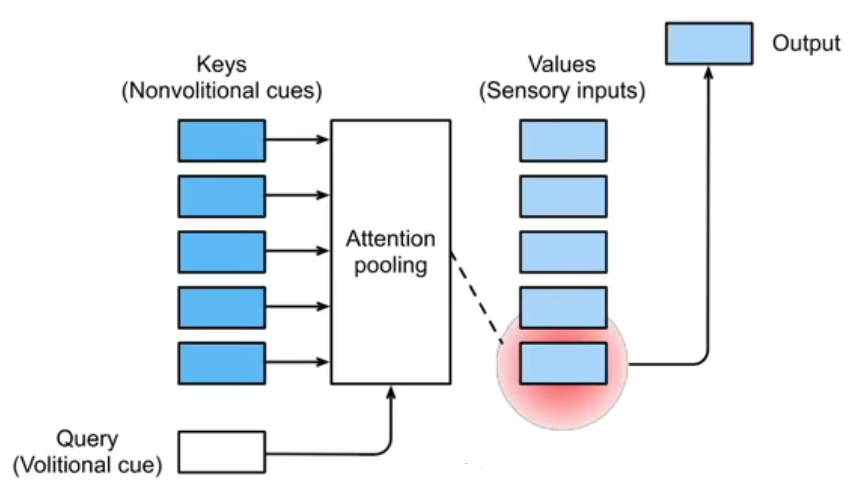

## 2. 历史进程

### 非参注意力（不需要训练）

最早的非参注意力池化层实际上就是一个查询层

给定key-value pair$(x_i,y_i),i,...,n$​，

最简单的方案，平均池化就是不管你输入什么key，获得的都是$f(x) = \frac{1}{n}\sum_i y_i$

更好的一个查询方法是   Nadaraya-Watson Kernel回归

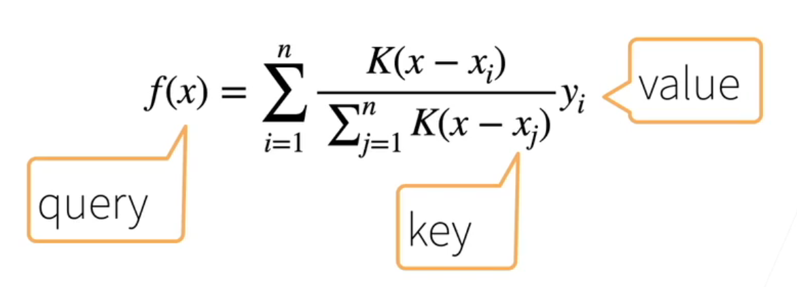

这个公式描述的是Nadaraya-Watson核回归模型，一个经典的非参数回归方法。其灵感来源于平滑局部平均的概念，这在机器学习和统计学中被广泛应用于功能估计。

在这个模型中，一个观测点的预测值是通过对其附近的观测点的响应变量值进行加权平均得到的。权重是基于每个点与预测点之间距离的函数，由核函数 *K* 决定。

这里的核函数*K(u)* 是一个高斯核，也称为正态分布核。**它基于每对点之间的距离的平方进行加权，距离越近的点有更高的权重。**

如果输入了$x_i$，那么它就是和其他所有点的距离为权重乘以其value求和。

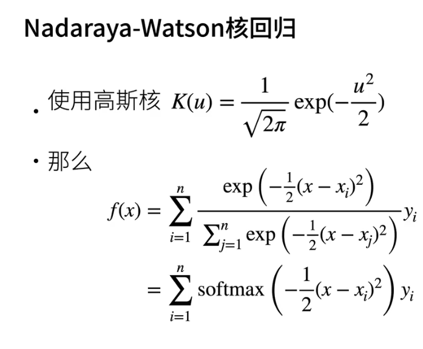

在第二张图中，核函数 *K* 应用于 $(x-x_i)^2$，这意味着权重是基于观测点$x_i$ 与查询点 $x$ 之间欧氏距离的函数。每个权重与相应的响应变量$y_i$ 相乘，然后对所有观测点进行求和，来预测查询点的值 $f(x)$。

公式的分母是对所有的$K(x-x_j)$的求和，确保权重的和为1，这是一种归一化处理。

最终，这个公式可以被理解为一个加权平均，其中权重是通过一个softmax函数决定的，softmax基本上将高斯核的输出转换成了权重。这样的权重设计能够使得查询点附近的观测点对预测值有更大的影响，而距离较远的点的影响较小。

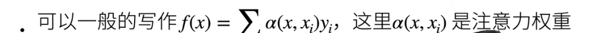

### 带参注意力

与此对应的，如果我们有些参数需要学习，那就是带参注意力了。

我们在之前的基础引入可以学习的w

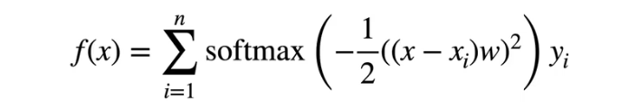

用来学习到底要对每个value学习多大才行。

## 3. 注意力分数

==注意力分数就是query和key的相似度，注意力权重就是分数的softmax结果==

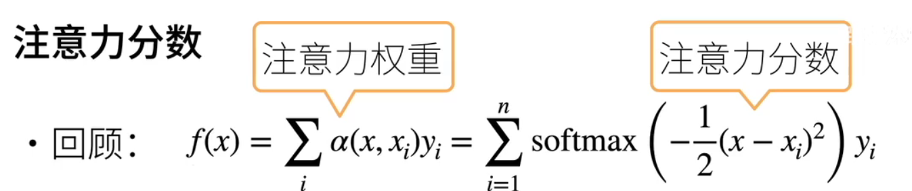

这里，$\alpha$函数是注意力权重，和为1

如果是以softmax来看的话，softmax的输入就是注意力分数了

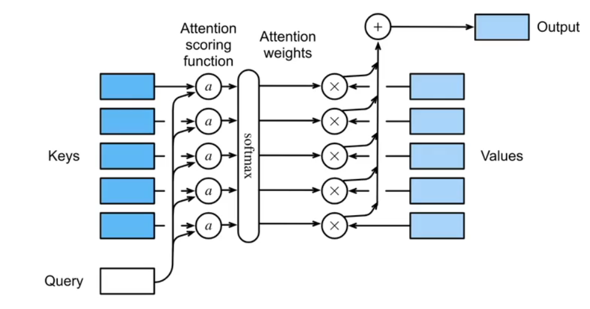

上图表示了注意力分数的运作过程：

* 首先，我们拥有若干个key-value pair
* 输入一个query
* 这个query给定一个key，这个key通过注意力分数函数，并通过softmax就变成了注意力权重
* 与value做加权和就得到了输出

上面的key-value对是一维对一维，我们也可以拓展成高维。 

假设$q\in \mathbb{R}^q , k_i\in \mathbb{R}^k, v_i\in\mathbb{R}^v$，这意味着query，key，value都可以具有不同的维度，而非一个单一的值

此时注意力池化层输入query与kv表，输出加权的value值。

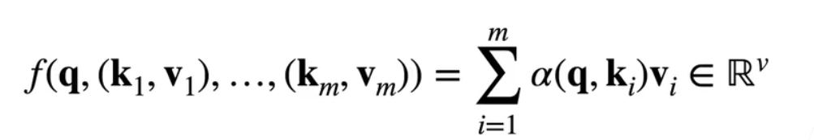

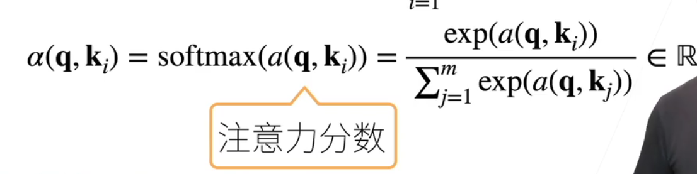

**这里的关键就是注意力分数该怎么设计**

## 4. 构建注意力分数

### Additive Attention（可加注意力）

训练参数,一下h都是超参数

$W_k\in \mathbb{R}^{h\times k}$​

$W_q\in \mathbb{R}^{h\times q}$

$v \in \mathbb{R}^{h}$

注意，key和query的维度分别为

$\mathbb{R}^k$

$\mathbb{R}^q$

同时，我们期望用这些参数构建一个h维的MLP隐藏层，输出大小为1
$$
a(k,q) = v^T tanh(W_k k+W_q q)
$$
具体的维数就是
$$
1([k\times1],[q\times1]) = ([1\times h])激活层([h\times k] \times [k \times 1] + [h\times q]\times [q \times 1])
$$

这个方法通过引入h来统一qkv不一样的长度。

### Scaled Dot-Product Attention(变尺度点积注意力)

这里针对的是key和query都是同样的长度$q,k_i\in \mathbb{R}^d$，那么可以得到
$$
a(q,k_i) = <q,k_i>/\sqrt{d}
$$
这里直接用qk做内积，然后除以其长度的根号来削弱因为维度过高所导致的注意力分数过高的影响。

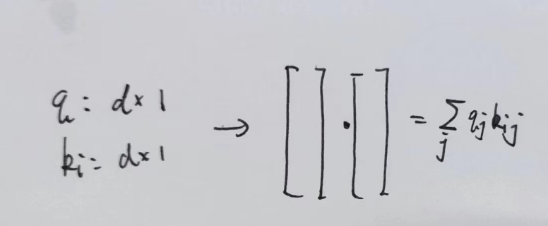

向量化版本中，存在n个query，m个key和value

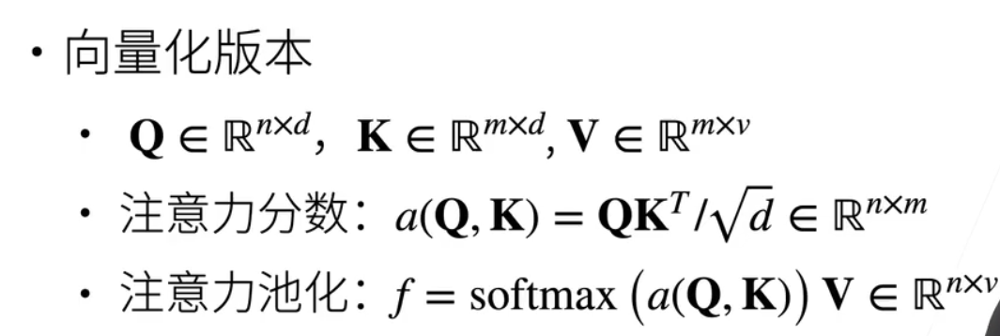

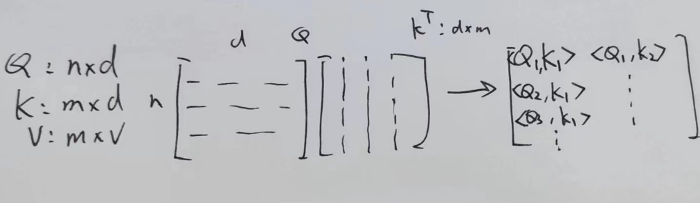