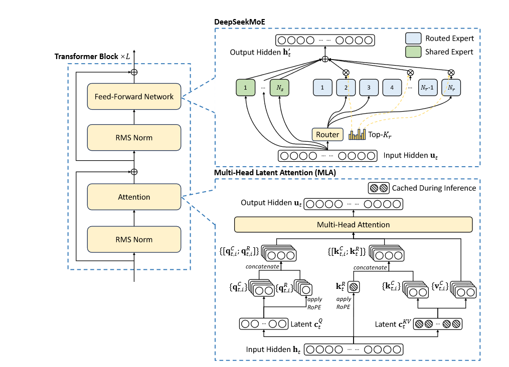
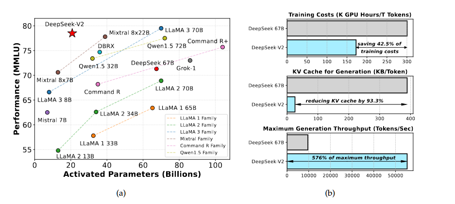
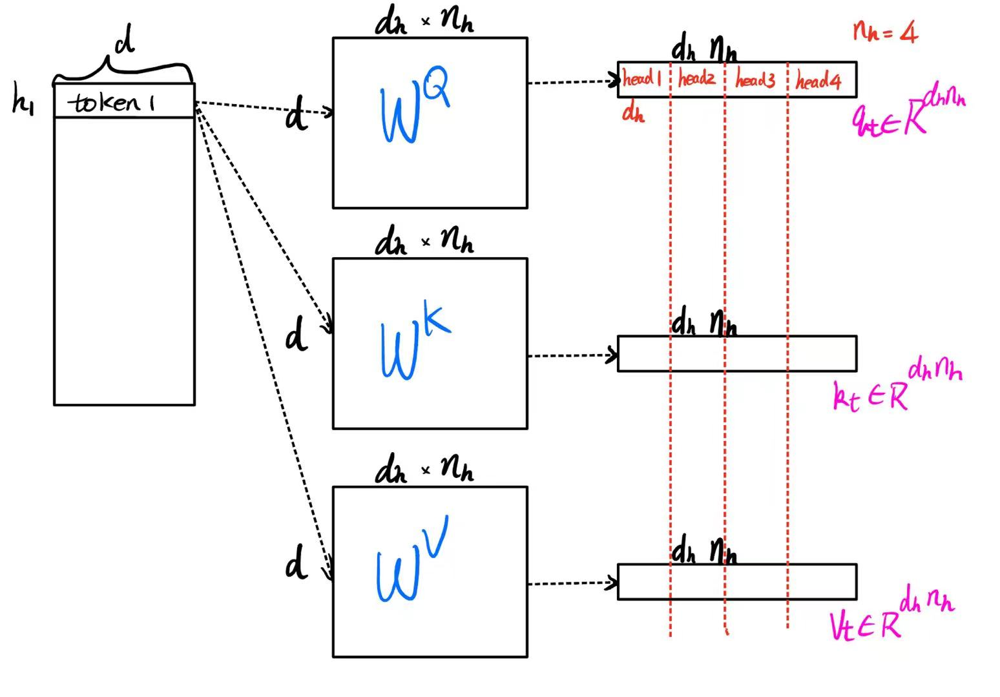
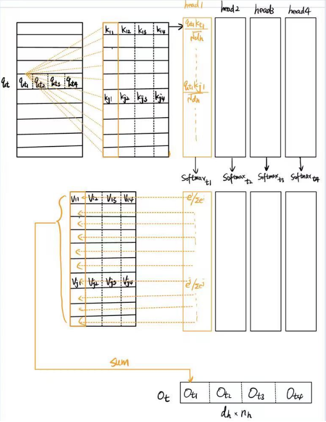
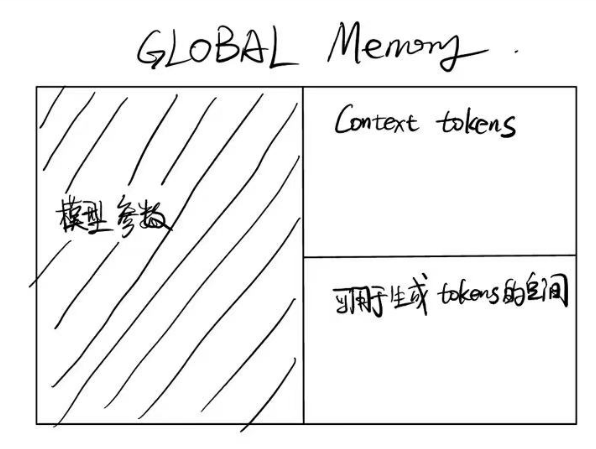
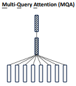
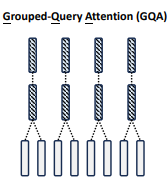
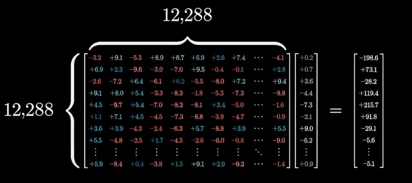
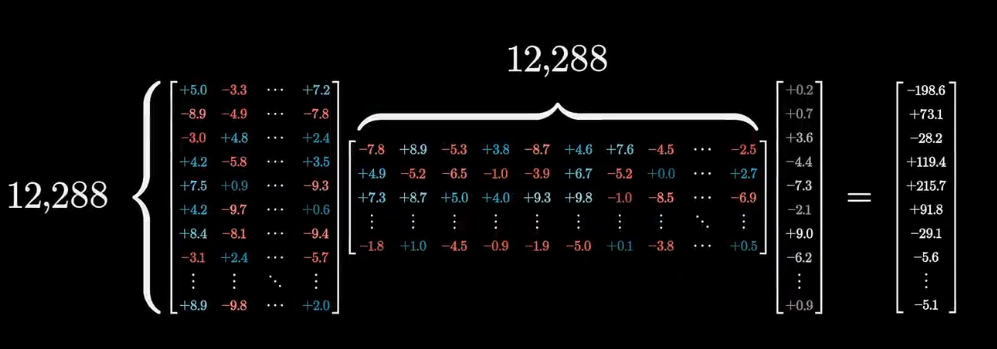

> https://arxiv.org/pdf/2405.04434

deepseek V2的核心就是MLA减少KV cache的显存占用,使得每个token激活21B个参数。

并借助YaRN(Yet another RoPE-based Interpolation Network)优化长度外推训练，将上下文能力扩展到了128k大小。

提出了新的DeepSeekMoE架构，可以通过稀疏计算以低成本训练。

总的来说，就是MLA Attention， YaRN编码，FFN-MoE三个改动

## YaRN

> https://ar5iv.labs.arxiv.org/html/2309.00071v1
>
> https://blog.eleuther.ai/yarn/

YaRN 代表“又一个基于 RoPE 的插值网络”，它是一种通过修改旋转位置嵌入 （RoPE） 来有效扩展大型语言模型 （LLMs） 的上下文窗口的方法。以下是对其改进及其背后的灵感的详细说明：

### NTK-aware in YaRN

#### Improvements in YaRN:

1. **NTK-aware Interpolation**:
   - **Problem Addressed**: Standard Position Interpolation (PI) stretches all RoPE dimensions equally, which can result in the loss of high-frequency information essential for distinguishing closely related tokens.
   - **Solution**: YaRN employs "NTK-aware" interpolation which scales high frequencies less and low frequencies more, distributing interpolation pressure more evenly. This helps preserve important high-frequency details needed for accurate token differentiation.
2. **NTK-by-parts Interpolation**:
   - **Problem Addressed**: Blind interpolation methods like PI and NTK-aware interpolation treat all RoPE dimensions equally, potentially compressing positional information and harming the model's ability to understand local token relationships.
   - **Solution**: YaRN introduces "NTK-by-parts" interpolation, which selectively interpolates dimensions based on their wavelengths relative to the context size. Dimensions with shorter wavelengths (high frequencies) are less interpolated, while those with longer wavelengths are interpolated more.
3. **Temperature Scaling**:
   - **Problem Addressed**: Uniform scaling during softmax can negatively impact model performance across different context lengths.
   - **Solution**: YaRN incorporates temperature scaling to adjust the logits before applying softmax. This involves introducing a temperature factor that adjusts the scaling of the attention weights, thus maintaining a balance in perplexity over extended context windows.

#### Inspiration and Basis:

1. **Rotary Positional Embedding (RoPE)**:
   - RoPE encodes positional information using a rotational approach similar to Fourier features. The modifications in YaRN are designed to enhance this embedding technique, allowing for more efficient handling of extended context windows.
2. **Neural Tangent Kernel (NTK) Theory**:
   - NTK theory suggests that deep neural networks struggle with learning high-frequency information if the input dimensions lack corresponding high-frequency components. YaRN's NTK-aware interpolation takes this into account by adjusting the frequency scaling during interpolation.
3. **Handling Extended Context Windows**:
   - Traditional methods require extensive fine-tuning on longer sequences, which can degrade performance on shorter sequences. YaRN addresses this by dynamically adjusting interpolation strategies and incorporating temperature scaling, thereby achieving better performance across various context lengths without extensive retraining.

YaRN represents a sophisticated approach to improving the efficiency and performance of large language models by refining how positional information is handled and interpolated, inspired by theoretical insights from NTK and practical needs for scalable and efficient model deployment.

## MLA：漫谈从MHA到MQA到GQA到MLA

我们使用我们提出的多头潜在注意力（MLA）和 DeepSeekMoE 优化 Transformer 框架（Vaswani 等人，2017）内的注意力模块和前馈网络（FFN）。 

（1）在注意力机制的背景下，多头注意力（MHA）的键值（KV）缓存（Vaswani et al., 2017）对LLM的推理效率造成了重大障碍。人们已经探索了各种方法来解决这个问题，包括分组查询注意力（GQA）（Ainslie et al., 2023）和多查询注意力（MQA）（Shazeer, 2019）。然而，这些方法在尝试减少 KV 缓存时常常会损害性能。为了实现两全其美，我们引入了 MLA，一种配备低秩键值联合压缩（low-rank key-value joint compression) 的注意力机制。从经验来看，MLA相比MHA具有更优异的性能，同时大幅减少了推理过程中的KV缓存，从而提高了推理效率。 

（2） 对于前馈网络（FFN），我们遵循 DeepSeekMoE 架构（Dai et al., 2024），该架构采用细粒度专家分割和共享专家隔离，以提高专家专业化的潜力。与 GShard（Lepikhin 等人，2021）等传统 MoE 架构相比，DeepSeekMoE 架构展示了巨大的优势，使我们能够以经济的成本训练强大的模型。由于我们在训练期间采用专家并行性，因此我们还设计了补充机制来控制通信开销并确保负载平衡。通过结合这两种技术，DeepSeek-V2 同时具有强大的性能（图 1(a)）、经济的训练成本和高效的推理吞吐量（图 1(b)）。

### MHA

#### 无基础版

$d$: embedding dimension

$n_h$: number of attention head

$d_h$: head_size, dimension per head

对于一个序列中的第t个token，定义为$h_t \in \mathbb{R}^d$

这个token经过转换矩阵($W^Q,W^K,W^V\in \mathbb{R}^{(d_h\times n_h)\times d}$)获得第t个token的q,k,v矩阵($q_t,k_t,v_t\in \mathbb{R}^{d_hn_h}$​)
$$
q_t = W^Q h_t
\\
k_t = W^K h_t
\\
v_t = W^V h_t
$$

$$
o_{t,i} = \sum_{j=1}^{t} \text{Softmax}_j \left( \frac{q_{t,i}^T k_{j,i}}{\sqrt{d_h}} \right) v_{j,i}
$$
$o_{t,i}$代表第t个token第i个head的对应的输出

总体公式代表，

* 对每个head做qk点积，以head_size缩放

* 对这一个head_size的做softmax，获得[seq_len, head_size]形状的softmax值

  这个softmax值代表了第t个token在其他所有token上的注意力分数

  每一列注意力分数之和为1

* 将这个head的每一列分数与对应的value对应头的每一列点积然后取和，得到output对应列的值，这个值代表了我们Attention输出的词某一个维度的值

最后通过输出矩阵 $u_t = W^O [o_{t,1}; o_{t,2}; \ldots; o_{t,nh}]$来获得Attention输出的预测词

由上面的过程可知，MHA需要缓存$2n_hd_hl$的元素个数,$l$代表序列长度

* K cache需要$ln_hd_h$
* V cache需要$ln_hd_h$

In model deployment, this heavy KV cache is a large bottleneck that limits the maximum batch size and sequence length.

### 降低KV cache做出的努力：MQA，GQA

众所周知，一般情况下LLM的推理都是在GPU上进行，单张GPU的显存是有限的，一部分我们要用来存放模型的参数和前向计算的激活值，这部分依赖于模型的体量，选定模型后它就是个常数；另外一部分我们要用来存放模型的KV Cache，这部分不仅依赖于模型的体量，还依赖于模型的输入长度，也就是在推理过程中是动态增长的，当Context长度足够长时，它的大小就会占主导地位，可能超出一张卡的总显存量。

减少KV Cache的目的就是减少Context tokens的占用空间大小，以及新生成的每个token的所需资源。

因此，减少KV cache的目的就是更长的context以及更低的推理成本，更大的吞吐总量。

#### MQA

> [《Fast Transformer Decoding: One Write-Head is All You Need》](https://papers.cool/arxiv/1911.02150)

MQA的思路很简单，让所有的Attention Head共享同一个KV

训练的时候，$W^K,W^V$训练时是按照所有的head都能够使用的目标训练的。

MQA直接将KV Cache减少到了原来的1/h1/ℎ，这是非常可观的，单从节省显存角度看已经是天花板了。

效果方面，目前看来大部分任务的损失都比较有限，且MQA的支持者相信这部分损失可以通过进一步训练来弥补回。此外，注意到MQA由于共享了K、V，将会导致Attention的参数量减少了将近一半，而为了模型总参数量的不变，通常会相应地增大FFN/GLU的规模，这也能弥补一部分效果损失。

#### GQA

另一种方式就是GQA，它并不会极端的只留下一个head的KV， 而是留下多个head的KV，以期望更好的效果。

GQA的思想就是，某几个query head 共用一个kv head。

### 低秩

在说明MLA之前，我们首先了解一些低秩概念

#### 低秩分解(Low rank decomposition)

低秩分解是将一个高维矩阵分解成多个低秩矩阵的乘积的方法，通常用于数据压缩、特征提取和降维等领域。具体来说，如果一个矩阵 \( A \) 可以近似表示为两个或多个低秩矩阵的乘积，那么就可以显著减少存储和计算的复杂度。 最常见的低秩分解方法包括： 

- **奇异值分解（Singular Value Decomposition, SVD）**：  
- **公式**： $A = U \Sigma V^T $
- 其中，$ U$ 和 $ V$ 是正交矩阵，$\Sigma$ 是对角矩阵，对角线元素为奇异值。
- **主成分分析（Principal Component Analysis, PCA）**：  - 通过对协方差矩阵进行特征值分解，得到主要特征向量，减少数据的维度。
- **非负矩阵分解（Non-negative Matrix Factorization, NMF）**：  - 将矩阵分解为两个非负矩阵的乘积，常用于图像处理和文本挖掘。

#### 低秩投影(Low rank Projection)

低秩投影是指将高维数据投影到一个低秩子空间中，以减少数据的维度，同时尽可能保留原始数据的结构和信息。 具体方法包括： 

* **线性投影**：  - 使用 PCA 将数据投影到主要成分上，保留最大方差的方向。
* **随机投影（Random Projection）**：  
  * 使用随机生成的矩阵进行投影，通常用于加速高维数据的处理。 

- **核 PCA（Kernel PCA）**:
  -  将数据映射到高维特征空间，然后在高维特征空间中进行PCA，以捕捉非线性特征。

#### 低秩分解和低秩投影的应用

深度学习模型（特别是卷积神经网络和变压器模型）通常包含大量的参数，导致存储和计算资源的高需求。通过低秩分解，可以将大矩阵分解成几个小矩阵的乘积，从而减少参数数量，达到压缩模型和加速计算的效果。

##### 权重矩阵压缩

将权重矩阵分解为低秩矩阵的乘积。

减少模型参数数量，提高训练和推理速度。

MobileNet、SqueezeNet等模型通过低秩分解实现了高效的参数压缩 

Attention中，也有人使用低秩分解来压缩参数的。

下面就是对Value Matrix做低秩分解的一个方法，这样显著减少了参数数量。

##### 特征提取与降维

高维数据可能包含大量的冗余信息，使用低秩投影可以提取主要特征并降维，从而提高模型的训练效率和泛化能力。

在构建网络时，通常会有先增加数据维度，然后压缩数据维度的过程（特别是CV领域），这就是特征提取的过程。

PCA这个预处理方法也是一个常用的降维方法

##### 稀疏性与高效表示

低秩分解与稀疏表示相结合，可以进一步提高深度学习模型的效率和解释性。

* 结合低秩分解与稀疏表示，进一步压缩模型参数。
* 显著减少计算和存储需求，提升模型在资源受限环境中的表现。
* 稀疏低秩分解用于优化大型预训练模型，如BERT和ResNet 

例如，推荐系统中

**问题描述** 

用户-物品评分矩阵 $R$ 通常非常大且稀疏（即大多数元素为零）。   

目标是通过稀疏低秩分解将 $R$​分解为两个低秩矩阵的乘积，从而实现数据压缩和高效表示。 

**低秩分解方法**   

使用矩阵分解技术将 $R$ 分解为两个低秩矩阵 $U$ 和 $V$：    $R \approx U \Sigma V^T$     其中，$ U$ 是用户矩阵，$V$ 是物品矩阵，$\Sigma$​是对角矩阵。 

**引入稀疏性**   

为了进一步提高效率和模型解释性，采用稀疏低秩分解方法：     

保持 $U$ 和 $V$ 的稀疏性，使得矩阵中仅存储非零元素。     

可以通过添加 $L1$ 正则化项来强制矩阵 $U$ 和 $V$​ 稀疏。 

**模型训练**   

通过优化目标函数来训练模型：     

$\min_{U, V} \|R - U \Sigma V^T\|^2_F + \lambda (\|U\|_1 + \|V\|_1) $     

其中，$\| \cdot \|_F$ 表示Frobenius范数，$\| \cdot \|_1$ 表示 \( L1 \) 范数，$\lambda$​ 是正则化参数。 

**推荐生成**   

通过训练得到的稀疏低秩矩阵 \( U \) 和 \( V \)，可以快速计算用户对未评分物品的预测评分：     

$ \hat{R} = U \Sigma V^T $   

根据预测评分为用户生成推荐列表。 

**优势与效果** 

**存储效率**：稀疏低秩分解大幅减少了存储需求，只需存储非零元素。 

**计算效率**：矩阵分解和稀疏性减少了计算复杂度，加快了模型训练和预测的速度。 

**性能提升**：在实际应用中，稀疏低秩分解能够有效捕捉用户和物品的潜在特征，提高推荐系统的准确性和可解释性。

### MLA

## FFN：DeepSeekMoE

## GRPO微调

