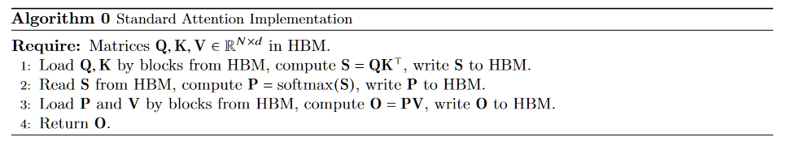
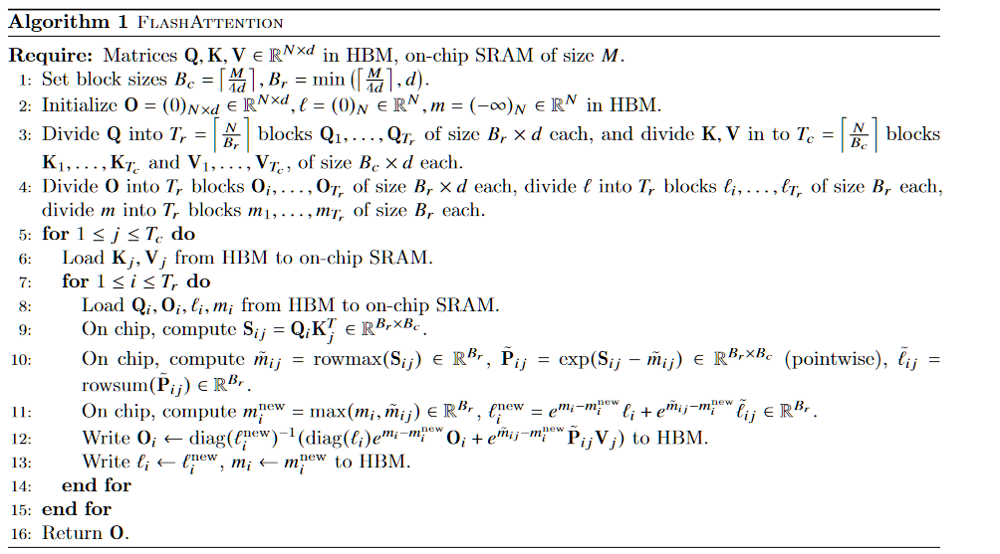

> FlashAttention: Fast and Memory-Efficient Exact Attention with IO-Awareness

Flash Attention主要针对GPU内存级别之间的读写，这是一种IO感知的精确注意算法。

它使用了平铺来减少GPU带宽内存(High bandwidth memory)和GPU片上SRAM之间的内存读写次数。

Flash Attention主要关注的不是FLOP加速，而是内存IO访问加速。

作者认为，注意力算法缺失的一个principle是 `IO-aware`能力，也就是仔细考虑对不同级别的快速内存(SRAM)和慢速内存(DRAM)的读写。

在现代GPU中，计算速度已经远远的超过了内存读写速度，并且Transformer中的大多数操作都是内存访问瓶颈。IO感知算法对于类似memory_bound的操作十分重要。

**Flash Attention的主要目标是避免从HBM（也就是global memory这种高带宽高访问时间的Memory）读取和写入注意力矩阵。**

有以下几个方面：

* 在不访问整个输入的情况下计算Softmax Reduction
  * 重构注意力计算，将输入分割成块，并对输入块进行多次传输从而逐步执行Softmax reduction（tiling）
* 不存储用于后向传递的大型中间注意力矩阵
  * 在前向传播时**存储softmax归一化因子**，以便在反向传播时快速在芯片上重新计算注意力，这比标准方法从高带宽内存（HBM）读取中间注意力矩阵要快
  * 尽管重新计算增加了浮点运算次数，但Flash Attention的算法运行速度更快

## 标准Attention

### Attention计算流程与内存操作

给定QKV矩阵${Q,K,V}\in \mathbb{R}^{N\times d}$

其中N代表序列长度，$d$代表每个head的维度(head_size)

我们希望计算其输出$O\in \mathbb{R}^{N\times d}$​
$$
S = \frac{QK^T}{\sqrt{d}}
$$

$$
P = softmax(S)\in \mathbb{R}^{N\times N}
$$

$$
O = PV = softmax(\frac{QK^T}{\sqrt{d}})V
$$

标准的Attention计算中，需要

* **从HBM中读取**Q,K矩阵，一共读取$2\times N\times d$的内存大小

* Q,K点积结果矩阵S大小为$N\times N$，**存储S到HBM中**

* 从HBM中读取S矩阵进行Softmax计算，得到结果$P\in \mathbb{R}^{N\times N}$

  对于矩阵S的每一行，计算softmax

  * 假设第$i$ 行的元素表示为$S_{i,1},S_{i,2},...,S_{i,N}$
  * 保持数值稳定性$S'_{i,j} = S_{i,j}-\max_k(S_{i,k})$
  * 计算指数以及指数和
  * 计算每个元素的softmax

* **存储P到HBM**

* **从HBM提取P**，V，一共读取$N \times N + N \times d$的内存

* **保存$O$ 到HBM，** $N\times d$的内存

这一套操作我们可以看做$O(N^2)$的Memory占用

### 推理与训练时不同的内存策略

#### 推理过程（Inference）

在推理过程中，主要需要保留的数据是 𝐾和 𝑉矩阵，因为这些数据可以用于后续的查询，而无需重复计算。具体如下：

1. **保留的数据**：
   - 𝐾 矩阵：从输入序列中计算得到的键值矩阵。
   - 𝑉矩阵：从输入序列中计算得到的值矩阵。
2. **不需要保留的数据**：
   - 𝑄矩阵：通常不需要保留，因为每次查询时会重新计算。
   - 𝑆矩阵：计算注意力得分矩阵时的中间结果，不需要保留。
   - 𝑃矩阵：softmax后的权重矩阵，不需要保留。
   - 𝑂矩阵：最终的输出矩阵，不需要保留，因为每次查询时会重新计算。

#### 训练过程（Training）

在训练过程中，反向传播需要用到前向传播中的中间结果，因此需要保留的数据更多。具体如下：

1. **保留的数据**：
   - 𝑄 矩阵：需要在反向传播中计算梯度。
   - 𝐾矩阵：需要在反向传播中计算梯度。
   - 𝑉矩阵：需要在反向传播中计算梯度。
   - 𝑆矩阵：前向传播中计算的注意力得分矩阵，在反向传播中需要用到。
   - 𝑃 矩阵：softmax后的权重矩阵，在反向传播中需要用到。
2. **不需要保留的数据**：
   - 𝑂矩阵：最终的输出矩阵，不需要保留，因为在反向传播中会重新计算。

总结如下：

| 数据 | 推理（Inference） | 训练（Training） |
| ---- | ----------------- | ---------------- |
| 𝑄    | 不需要保留        | 需要保留         |
| 𝐾    | 需要保留          | 需要保留         |
| 𝑉    | 需要保留          | 需要保留         |
| 𝑆    | 不需要保留        | 需要保留         |
| 𝑃    | 不需要保留        | 需要保留         |
| 𝑂    | 不需要保留        | 不需要保留       |

在推理过程中，KV缓存可以显著提高效率，而在训练过程中，反向传播需要前向传播的中间结果，因此需要保留更多的数据。

## Flash Attention

在上面，我们可以发现两个问题

* 因为N过大，因此需要用于计算的数据不能暂存在shared_memory中，只能直接读到register中
* 中间结果因为过大，也需要重新传输到HBM中。

Flash Attention的目的是，利用tiling将数据分块，然后利用recomputation来减少计算的数据量，这样我们就能使用shared_memory存储数据，同时因为之前说过这是memory_bound的操作，适量的recomputation并不会对性能造成影响。

简单来说，主要思想是我们将输入 Q K V 分割成块，将它们从慢速 HBM 加载到快速 SRAM，然后计算相对于这些块的注意力输出。通过在将每个块的输出相加之前按正确的归一化因子缩放，我们最终得到正确的结果。

### Softmax Tiling

**Subvector Softmax**

首先，定义对一个长度为B的向量$x$进行softmax计算

* 找到向量中的最大值
  $$
  m(x) := \max_i x_i
  $$

* 计算数值稳定后的指数向量
  $$
  f(x) := [e^{x_1 - m(x)} ,..., e^{x_B-m(x)}]
  $$

* 计算指数和
  $$
  \ell(x) := \sum_i f(x)
  $$

* 计算softmax值
  $$
  softmax(x) := \frac{f(x)}{\ell(x)}
  $$

**Combing two softmax**

现在，我们考虑一个向量$x^{(1)}, x^{(2)}\in \mathbb{R}^B$，我们可以将其拼接成一个向量$x = [x^{(1)},x^{(2)}]\mathbb{R}^{2B}$，并对这个拼接后的向量进行softmax计算

* **找到向量中的最大值**
  $$
  m(x) := max(m(x^{(1)}),m(x^{(2)}))
  $$

* **计算调整后的指数**
  $$
  f(x):= [e^{m(x^{(1)})-m(x)}f(x^{(1)}), e^{m(x^{(2)})-m(x)}f(x^{(2)})]
  $$
  这里，在subvector $x_1$中
  $$
  e^{x_i - m(x^{(1)})} * e^{m(x^{(1)}) - m(x)} = e^{x_i - m(x)}
  $$
  这样就顺利的纠正了之前计算的subvector的中间结果

* **计算指数的总和**
  $$
  \ell(x) = \ell ([x^{(1)},x^{(2)}]) = e^{m(x^{(1)}) - m(x)}\ell(x^{(1)}) + e^{m(x^{(2)}) - m(x)}\ell(x^{(2)})
  $$
  这里利用之前subvector的局部结果计算，公式如上，就是为之前的subvector加权即可
  $$
  \ell(x^{(1)}) = \sum_i f(x^{(1)})
  \\
  \ell(x^{(2)}) = \sum_i f(x^{(2)})
  \\
  \ell(x) = \sum_i e^{m(x^{(1)})-m(x)}f(x^{(1)}) +\sum_i e^{m(x^{(2)}) - m(x)}f(x^{(2)}) 
  \\=e^{m(x^{(1)}) - m(x)}\ell(x^{(1)}) + e^{m(x^{(2)}) - m(x)}\ell(x^{(2)})
  $$
  

* **计算拼接后的softmax值**
  $$
  softmax(x) = \frac{f(x)}{\ell(x)}
  $$
  

因此，我们计算一个长为N的序列的softmax，实际上可以变成对m个subvector进行计算，获得中间变量$f(x^{(1)}),...,f(x^{(m)})$,$\ell(x^{(1)}),...,\ell(x^{(m)})$,$m(x^{(1)}),...,m(x^{(m)})$

这样，我们的最终结果就是
$$
m(x) = \max(m(x^{(1)}),...,m(x^{(m)}))
\\
f(x) =[e^{m(x^{(1)})-m(x)}f(x^{(1)}),...,e^{m(x^{(m)})-m(x)}f(x^{(m)})]
\\
\ell(x) =e^{m(x^{(1)}) - m(x)}\ell(x^{(1)}) +...+ e^{m(x^{(m)}) - m(x)}\ell(x^{(m)})
\\
softmax(x) = \frac{f(x)}{\ell(x)}
$$
伪代码如下，为代码中是线性的将块加上去的。为什么不采用上面的（并行计算出所有的softmax所需，然后一次组合），是因为这样涉及的block就更多了，内存优势无法体现。一个block其实涉及多个softmax，因此使用计算一个block，就影响对应的softmax是较为高效的，即使多算了好几次指数除法。

### Tilied Softmax在推理与训练中

在前向传播与反向传播时，Tiled Softmax都存储输出O和中间结果$(m,\ell)$

* 在前向传播时，使用$(m,\ell)$​逐步计算softmax，并存储O用以后续计算

* 在反向传播中，我们需要使用$(m,\ell)$和O再次计算出$S = \frac{QK^T}{\sqrt{d}}$,$P = softmax(S)\in \mathbb{R}^{N\times N}$，然后获得梯度

  反向传播的具体方法如下所示

> 在反向传播过程中，通过存储前向传播的输出 \(O\) 以及softmax归一化统计量 \( (m, \ell) \)，我们可以重新计算中间结果，从而高效地完成梯度计算。以下是详细解释反向传播过程中如何通过这些信息完成计算的步骤：
>
> ### 1. 前向传播中的操作回顾
>
> 在前向传播过程中，我们计算了以下内容：
> $$
> S_{ij} = Q_i K_j^T 
> \\ \tilde{m}_{ij} = \text{rowmax}(S_{ij}) 
>  \\P_{ij} = \exp(S_{ij} - \tilde{m}_{ij})
> \\ \tilde{\ell}_{ij} = \text{rowsum}(P_{ij})
>  \\ O_i = \text{diag}(\ell_i)^{-1} (\text{diag}(\ell_i) e^{m_i - m_i^{\text{new}}} O_i + e^{\tilde{m}_{ij} - m_i^{\text{new}}} P_{ij} V_j) 
> $$
>
> ### 2. 反向传播的目标
>
> 反向传播的目标是计算损失函数 \(L\) 对输入 \(Q\)、\(K\)、\(V\) 的梯度：$(\frac{\partial L}{\partial Q})、(\frac{\partial L}{\partial K}) 和 (\frac{\partial L}{\partial V})$。
>
> ### 3. 存储的值
>
> 在前向传播过程中，我们存储了以下内容：
> - 输出矩阵 \( O \)
> - 归一化统计量 \( m \) 和 \( $\ell $\)
>
> ### 4. 重新计算 \( S \) 和 \( P \)
>
> 在反向传播时，我们需要重新计算中间结果 \( S \) 和 \( P \)，因为我们之前只存储了 \( O \) 和 \( ($m, \ell$) \)。
>
> #### 重新计算步骤：
>
> 1. **重新计算 \( S \)**：
>    - 利用存储的 \( Q \) 和 \( K \) 重新计算注意力得分矩阵 \( S \)：
>      $S_{ij} = Q_i K_j^T$ 
>
> 2. **重新计算 \( P \)**：
>    - 利用重新计算的 \( S \) 和存储的归一化统计量 \( m \)：
>      $P_{ij} = \exp(S_{ij} - \tilde{m}_{ij}) $
>
> ### 5. 计算梯度
>
> 利用重新计算的 \( S \) 和 \( P \)，我们可以继续反向传播过程，计算梯度。
>
> #### 反向传播步骤：
>
> 1. **计算输出 \( O \) 对 \( S \) 的梯度**：
>    - 计算损失函数 \( L \) 对输出 \( O \) 的梯度 \($\frac{\partial L}{\partial O}$\)，利用链式法则传播到 \( S \)：
>      $\frac{\partial L}{\partial S_{ij}} = \frac{\partial L}{\partial P_{ij}} \cdot P_{ij} \cdot (1 - P_{ij})$
>
> 2. **计算 \( S \) 对 \( Q \) 和 \( K \) 的梯度**：
>    - 计算损失函数 \( L \) 对 \( Q \) 的梯度 $\frac{\partial L}{\partial Q}$ 和对 \( K \) 的梯度 $\frac{\partial L}{\partial K}$
>      $$
>      \frac{\partial L}{\partial Q_i} = \sum_j \frac{\partial L}{\partial S_{ij}} K_j 
>       \\ \frac{\partial L}{\partial K_j} = \sum_i \frac{\partial L}{\partial S_{ij}} Q_i
>      $$
>    
> 3. **计算 \( S \) 对 \( V \) 的梯度**：
>    
>    - 计算损失函数 \( L \) 对 \( V \) 的梯度 $\frac{\partial L}{\partial V}$：
>      $\frac{\partial L}{\partial V_j} = \sum_i P_{ij} \frac{\partial L}{\partial O_i} $
>
> 
>
> 通过存储前向传播中的输出 \( O \) 以及softmax归一化统计量 \( $(m, \ell)$ \)，在反向传播过程中，我们可以高效地重新计算注意力矩阵 \( S \) 和软max权重矩阵 \( P \)，从而完成梯度计算。具体步骤如下：
>
> 1. 重新计算注意力得分矩阵 \( S \) 和软max权重矩阵 \( P \)。
> 2. 利用重新计算的 \( S \) 和 \( P \)，计算损失函数 \( L \) 对输入 \( Q \)、\( K \) 和 \( V \) 的梯度。
>
> 通过这种方法，可以在减少内存使用的同时，保持计算过程的数值稳定性和效率。

### CUDA Kernel

- **核融合（Kernel Fusion）**: 通过在一个CUDA核中实现所有计算步骤，包括：
  1. 从HBM加载输入。
  2. 执行计算步骤：矩阵乘法、softmax、可选的掩码和dropout、矩阵乘法。
  3. 将结果写回HBM（掩码和dropout在附录B中有详细描述）。
- **避免重复读取和写入**：这种方法避免了多次从HBM读取和写入输入和输出数据，从而提高了效率。

### Block-Sparse FlashAttention

所谓的块稀疏性，是指的引入了块稀疏性掩码M，用于指示哪些块是非零的，哪些块是0的，这样能够减少不必要的计算和内存访问，跳过拥有掩码的块。

通过仅计算非零块，大幅减少了高带宽内存（HBM）的读写次数，从而降低了I/O复杂度。

这个灵感来自于，

1. **注意力机制中的稀疏性**：
   - 现实中的许多注意力机制并不需要对所有的查询和键进行计算，特别是在长序列中，注意力矩阵往往是稀疏的。
   - 利用稀疏性可以减少不必要的计算，提升计算效率。
2. **块稀疏性结构**：
   - 将稀疏性结构化为块，可以更好地优化计算和内存访问。
   - 块稀疏性掩码 𝑀*M* 可以被设计为块状，这使得在硬件上实现更高效的计算成为可能。
3. **高效内存访问**：
   - 块稀疏性允许在计算过程中跳过大部分零块，减少了高带宽内存的读写操作，从而降低了I/O复杂度。
4. **已有的稀疏模式研究**：
   - 使用固定的稀疏模式（如蝴蝶稀疏模式）可以近似任意的稀疏结构，这在实验中被证明是有效的。