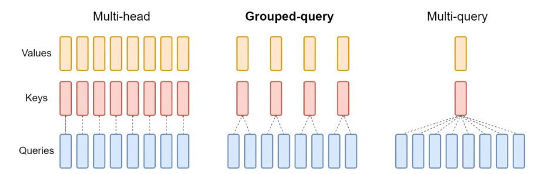

## GQA简介

https://www.bilibili.com/video/BV1fQ4y1W7Ga/?spm_id_from=333.337.search-card.all.click&vd_source=61f56e9689aceb8e8b1f51e6e06bddd9

简单来说，多个query head 公用一个kv head，这使得计算时，多个query head对同一个kv head计算。

（这里多个query head对同一个kv head计算用到的就是repeat kv，以上图为例repeak2次)

接下来就很简单了，分别于WQ,WK,WV得到QKV矩阵

$[batch\_size, seq\_len, hidden\_size] \times [hidden\_size, q\_head\_num * head\_dim]$

$[batch\_size, seq\_len, hidden\_size] \times [hidden\_size, kv\_head\_num * head\_dim]$

然后分头计算即可

