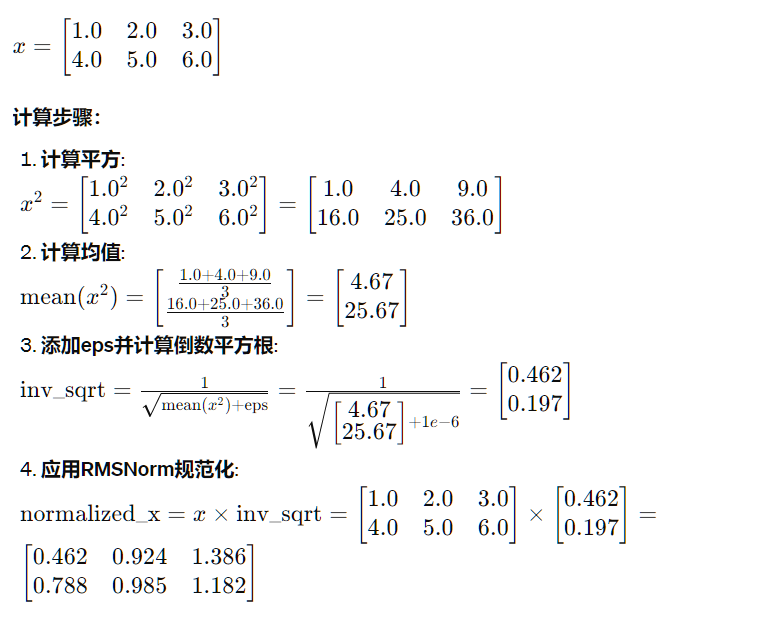
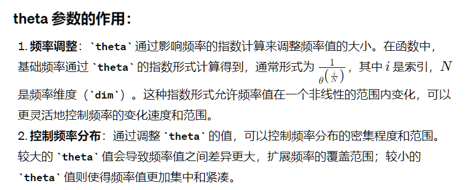

# model.py

## RMSNorm

* 初始化类时，传入dim = [hidden size]

* forward方法

  * 将输入的Tensor x转换为可以计算的float32
  * 调用norm计算
  * 乘上缩放因子weight，`self.weight` 通过为每个特征引入一个可学习的缩放因子，允许模型动态调整每个特征的重要性或影响力，使得模型可以自适应地调整特征的规模，从而优化网络的整体性能。
    * 如果x是[seq len, hidden size]，那么就将[hidden size]的self.weight broad cast到[seq len, hidden size]

* _norm方法

  * 首先考虑输入x，x实际上就是一个句子[seq len, hidden size]或者一个batch的句子[batch size, seq len, hidden size]

  * `mean(-1, keepdim=True)`代表按照最后一维求mean

    以单个句子为例，如果这个句子是两个词

    

  

  

```python
class RMSNorm(torch.nn.Module):
    def __init__(self, dim: int, eps: float = 1e-6):
        """
        Initialize the RMSNorm normalization layer.

        Args:
            dim (int): The dimension of the input tensor.
            eps (float, optional): A small value added to the denominator for numerical stability. Default is 1e-6.

        Attributes:
            eps (float): A small value added to the denominator for numerical stability.
            weight (nn.Parameter): Learnable scaling parameter.

        """
        super().__init__()
        self.eps = eps
        self.weight = nn.Parameter(torch.ones(dim))

    def _norm(self, x):
        """
        Apply the RMSNorm normalization to the input tensor.

        Args:
            x (torch.Tensor): The input tensor.

        Returns:
            torch.Tensor: The normalized tensor.

        """
        return x * torch.rsqrt(x.pow(2).mean(-1, keepdim=True) + self.eps)

    def forward(self, x):
        """
        Forward pass through the RMSNorm layer.

        Args:
            x (torch.Tensor): The input tensor.

        Returns:
            torch.Tensor: The output tensor after applying RMSNorm.

        """
        # 转换x为float32，然后确保_norm输出张量转换回x的类型
        output = self._norm(x.float()).type_as(x)
        return output * self.weight
```


## Embedding的正弦余弦位置编码生成

end可以理解为句子和输入序列的长度

dim代表[hidden size]



```python
def precompute_freqs_cis(dim: int, end: int, theta: float = 10000.0):
    """
    Precompute the frequency tensor for complex exponentials (cis) with given dimensions.

    This function calculates a frequency tensor with complex exponentials using the given dimension 'dim'
    and the end index 'end'. The 'theta' parameter scales the frequencies.
    The returned tensor contains complex values in complex64 data type.

    Args:
        dim (int): Dimension of the frequency tensor.
        end (int): End index for precomputing frequencies.
        theta (float, optional): Scaling factor for frequency computation. Defaults to 10000.0.

    Returns:
        torch.Tensor: Precomputed frequency tensor with complex exponentials.

    
        

    """
    freqs = 1.0 / (theta ** (torch.arange(0, dim, 2)[: (dim // 2)].float() / dim))
    t = torch.arange(end, device=freqs.device)  # type: ignore
    freqs = torch.outer(t, freqs).float()  # type: ignore
    freqs_cis = torch.polar(torch.ones_like(freqs), freqs)  # complex64
    return freqs_cis


```


## RoPE

```python
def apply_rotary_emb(
    xq: torch.Tensor,
    xk: torch.Tensor,
    freqs_cis: torch.Tensor,
) -> Tuple[torch.Tensor, torch.Tensor]:
    """
    Apply rotary embeddings to input tensors using the given frequency tensor.

    This function applies rotary embeddings to the given query 'xq' and key 'xk' tensors using the provided
    frequency tensor 'freqs_cis'. The input tensors are reshaped as complex numbers, and the frequency tensor
    is reshaped for broadcasting compatibility. The resulting tensors contain rotary embeddings and are
    returned as real tensors.

    Args:
        xq (torch.Tensor): Query tensor to apply rotary embeddings.
        xk (torch.Tensor): Key tensor to apply rotary embeddings.
        freqs_cis (torch.Tensor): Precomputed frequency tensor for complex exponentials.

    Returns:
        Tuple[torch.Tensor, torch.Tensor]: Tuple of modified query tensor and key tensor with rotary embeddings.

        

    """
    xq_ = torch.view_as_complex(xq.float().reshape(*xq.shape[:-1], -1, 2))
    xk_ = torch.view_as_complex(xk.float().reshape(*xk.shape[:-1], -1, 2))
    freqs_cis = reshape_for_broadcast(freqs_cis, xq_)
    xq_out = torch.view_as_real(xq_ * freqs_cis).flatten(3)
    xk_out = torch.view_as_real(xk_ * freqs_cis).flatten(3)
    return xq_out.type_as(xq), xk_out.type_as(xk)
```


## repeat_kv

```python
def repeat_kv(x: torch.Tensor, n_rep: int) -> torch.Tensor:
    """torch.repeat_interleave(x, dim=2, repeats=n_rep)"""
    bs, slen, n_kv_heads, head_dim = x.shape
    if n_rep == 1:
        return x
    return (
        x[:, :, :, None, :]
        .expand(bs, slen, n_kv_heads, n_rep, head_dim)
        .reshape(bs, slen, n_kv_heads * n_rep, head_dim)
    )
```


## Multi-head Attention

1. **初始化**：
   - 在 `__init__` 方法中，根据传入的 `ModelArgs` 参数初始化注意力模块的各种属性。
   - 设置了注意力头的数量、每个头的维度、线性变换层等。
2. **前向传播**：
   - `forward` 方法用于执行注意力模块的前向传播操作。
   - 首先，通过三个线性变换层 `wq`、`wk` 和 `wv` 分别对输入张量 `x` 进行查询、键和值的线性变换。
   - 然后，将得到的张量按照头的数量进行分组，以便后续的多头注意力计算。
   - 调用 `apply_rotary_emb` 函数，对查询和键张量应用旋转嵌入。
   - 接着，将查询、键和值张量进行缓存，以备后续使用。
   - 进行注意力计算，包括计算注意力分数、添加注意力掩码（如果有的话）和计算加权和。
   - 最后，通过线性变换层 `wo` 将加权和映射回原始维度空间。
3. **其他功能**：
   - 包括一些辅助函数，如 `repeat_kv` 和 `apply_rotary_emb`，用于处理多头注意力中的复杂操作，如重复键和值、应用旋转嵌入等。

```python
class Attention(nn.Module):
    """Multi-head attention module."""
    def __init__(self, args: ModelArgs):
        """
        Initialize the Attention module.

        Args:
            args (ModelArgs): Model configuration parameters.

        Attributes:
            n_kv_heads (int): Number of key and value heads.
            n_local_heads (int): Number of local query heads.
            n_local_kv_heads (int): Number of local key and value heads.
            n_rep (int): Number of repetitions for local heads.
            head_dim (int): Dimension size of each attention head.
            wq (ColumnParallelLinear): Linear transformation for queries.
            wk (ColumnParallelLinear): Linear transformation for keys.
            wv (ColumnParallelLinear): Linear transformation for values.
            wo (RowParallelLinear): Linear transformation for output.
            cache_k (torch.Tensor): Cached keys for attention.
            cache_v (torch.Tensor): Cached values for attention.

        """
        super().__init__()
        self.n_kv_heads = args.n_heads if args.n_kv_heads is None else args.n_kv_heads
        model_parallel_size = fs_init.get_model_parallel_world_size()
        self.n_local_heads = args.n_heads // model_parallel_size
        self.n_local_kv_heads = self.n_kv_heads // model_parallel_size
        self.n_rep = self.n_local_heads // self.n_local_kv_heads
        self.head_dim = args.dim // args.n_heads

        self.wq = ColumnParallelLinear(
            args.dim,
            args.n_heads * self.head_dim,
            bias=False,
            gather_output=False,
            init_method=lambda x: x,
        )
        self.wk = ColumnParallelLinear(
            args.dim,
            self.n_kv_heads * self.head_dim,
            bias=False,
            gather_output=False,
            init_method=lambda x: x,
        )
        self.wv = ColumnParallelLinear(
            args.dim,
            self.n_kv_heads * self.head_dim,
            bias=False,
            gather_output=False,
            init_method=lambda x: x,
        )
        self.wo = RowParallelLinear(
            args.n_heads * self.head_dim,
            args.dim,
            bias=False,
            input_is_parallel=True,
            init_method=lambda x: x,
        )

        self.cache_k = torch.zeros(
            (
                args.max_batch_size,
                args.max_seq_len,
                self.n_local_kv_heads,
                self.head_dim,
            )
        ).cuda()
        self.cache_v = torch.zeros(
            (
                args.max_batch_size,
                args.max_seq_len,
                self.n_local_kv_heads,
                self.head_dim,
            )
        ).cuda()

    def forward(
        self,
        x: torch.Tensor,
        start_pos: int,
        freqs_cis: torch.Tensor,
        mask: Optional[torch.Tensor],
    ):
        """
        Forward pass of the attention module.

        Args:
            x (torch.Tensor): Input tensor.
            start_pos (int): Starting position for caching.
            freqs_cis (torch.Tensor): Precomputed frequency tensor.
            mask (torch.Tensor, optional): Attention mask tensor.

        Returns:
            torch.Tensor: Output tensor after attention.

        """
        bsz, seqlen, _ = x.shape
        xq, xk, xv = self.wq(x), self.wk(x), self.wv(x)

        xq = xq.view(bsz, seqlen, self.n_local_heads, self.head_dim)
        xk = xk.view(bsz, seqlen, self.n_local_kv_heads, self.head_dim)
        xv = xv.view(bsz, seqlen, self.n_local_kv_heads, self.head_dim)

        xq, xk = apply_rotary_emb(xq, xk, freqs_cis=freqs_cis)

        self.cache_k = self.cache_k.to(xq)
        self.cache_v = self.cache_v.to(xq)

        self.cache_k[:bsz, start_pos : start_pos + seqlen] = xk
        self.cache_v[:bsz, start_pos : start_pos + seqlen] = xv

        keys = self.cache_k[:bsz, : start_pos + seqlen]
        values = self.cache_v[:bsz, : start_pos + seqlen]

        # repeat k/v heads if n_kv_heads < n_heads
        keys = repeat_kv(keys, self.n_rep)  # (bs, cache_len + seqlen, n_local_heads, head_dim)
        values = repeat_kv(values, self.n_rep)  # (bs, cache_len + seqlen, n_local_heads, head_dim)

        xq = xq.transpose(1, 2)  # (bs, n_local_heads, seqlen, head_dim)
        keys = keys.transpose(1, 2) # (bs, n_local_heads, cache_len + seqlen, head_dim)
        values = values.transpose(1, 2) # (bs, n_local_heads, cache_len + seqlen, head_dim)
        scores = torch.matmul(xq, keys.transpose(2, 3)) / math.sqrt(self.head_dim)
        if mask is not None:
            scores = scores + mask  # (bs, n_local_heads, seqlen, cache_len + seqlen)
        scores = F.softmax(scores.float(), dim=-1).type_as(xq)
        output = torch.matmul(scores, values)  # (bs, n_local_heads, seqlen, head_dim)
        output = output.transpose(1, 2).contiguous().view(bsz, seqlen, -1)
        return self.wo(output)
```


## FFN


```python
class FeedForward(nn.Module):
    def __init__(
        self,
        dim: int,
        hidden_dim: int,
        multiple_of: int,
        ffn_dim_multiplier: Optional[float],
    ):
        """
        Initialize the FeedForward module.

        Args:
            dim (int): Input dimension.
            hidden_dim (int): Hidden dimension of the feedforward layer.
            multiple_of (int): Value to ensure hidden dimension is a multiple of this value.
            ffn_dim_multiplier (float, optional): Custom multiplier for hidden dimension. Defaults to None.

        Attributes:
            w1 (ColumnParallelLinear): Linear transformation for the first layer.
            w2 (RowParallelLinear): Linear transformation for the second layer.
            w3 (ColumnParallelLinear): Linear transformation for the third layer.

        """
        super().__init__()
        hidden_dim = int(2 * hidden_dim / 3)
        # custom dim factor multiplier
        if ffn_dim_multiplier is not None:
            hidden_dim = int(ffn_dim_multiplier * hidden_dim)
        hidden_dim = multiple_of * ((hidden_dim + multiple_of - 1) // multiple_of)

        self.w1 = ColumnParallelLinear(
            dim, hidden_dim, bias=False, gather_output=False, init_method=lambda x: x
        )
        self.w2 = RowParallelLinear(
            hidden_dim, dim, bias=False, input_is_parallel=True, init_method=lambda x: x
        )
        self.w3 = ColumnParallelLinear(
            dim, hidden_dim, bias=False, gather_output=False, init_method=lambda x: x
        )

    def forward(self, x):
        return self.w2(F.silu(self.w1(x)) * self.w3(x))
```


## Transformer Block

一个Transformer Block包括一个Attention层与一个FFN层

```python
class TransformerBlock(nn.Module):
    def __init__(self, layer_id: int, args: ModelArgs):
        """
        Initialize a TransformerBlock.

        Args:
            layer_id (int): Identifier for the layer.
            args (ModelArgs): Model configuration parameters.

        Attributes:
            n_heads (int): Number of attention heads.
            dim (int): Dimension size of the model.
            head_dim (int): Dimension size of each attention head.
            attention (Attention): Attention module.
            feed_forward (FeedForward): FeedForward module.
            layer_id (int): Identifier for the layer.
            attention_norm (RMSNorm): Layer normalization for attention output.
            ffn_norm (RMSNorm): Layer normalization for feedforward output.

        """
        super().__init__()
        self.n_heads = args.n_heads
        self.dim = args.dim
        self.head_dim = args.dim // args.n_heads
        self.attention = Attention(args)
        self.feed_forward = FeedForward(
            dim=args.dim,
            hidden_dim=4 * args.dim,
            multiple_of=args.multiple_of,
            ffn_dim_multiplier=args.ffn_dim_multiplier,
        )
        self.layer_id = layer_id
        self.attention_norm = RMSNorm(args.dim, eps=args.norm_eps)
        self.ffn_norm = RMSNorm(args.dim, eps=args.norm_eps)

    def forward(
        self,
        x: torch.Tensor,
        start_pos: int,
        freqs_cis: torch.Tensor,
        mask: Optional[torch.Tensor],
    ):
        """
        Perform a forward pass through the TransformerBlock.

        Args:
            x (torch.Tensor): Input tensor.
            start_pos (int): Starting position for attention caching.
            freqs_cis (torch.Tensor): Precomputed cosine and sine frequencies.
            mask (torch.Tensor, optional): Masking tensor for attention. Defaults to None.

        Returns:
            torch.Tensor: Output tensor after applying attention and feedforward layers.

        """
        h = x + self.attention(
            self.attention_norm(x), start_pos, freqs_cis, mask
        )
        out = h + self.feed_forward(self.ffn_norm(h))
        return out
```


## Transformer-LLama整体架构

这是一个完整的Transformer模型，它由多个Transformer Block组成


输入tokens为[batch size, seq len], start pos是一个整数，表示注意力缓存的起始位置（KV cache）


其前向传播执行了如下几个步骤

* 首先将输入的词转换为embedding
* 根据输入的序列长度和起始位置，从预计算的频率张量 `freqs_cis` 中获取对应的频率张量。
* 如果序列长度大于 1，则创建一个注意力掩码，用于屏蔽未来信息。
* 对每个 TransformerBlock 进行前向传播操作，将注意力掩码传递给每个 TransformerBlock。
* 最后，通过层归一化层 `norm` 和输出线性层 `output` 得到最终的输出 logits。


```python
from fairscale.nn.model_parallel.layers import (
    ColumnParallelLinear,
    ParallelEmbedding,
    RowParallelLinear,
)
class Transformer(nn.Module):
    def __init__(self, params: ModelArgs):
        """
        Initialize a Transformer model.

        Args:
            params (ModelArgs): Model configuration parameters.

        Attributes:
            params (ModelArgs): Model configuration parameters.
            vocab_size (int): Vocabulary size.
            n_layers (int): Number of layers in the model.
            tok_embeddings (ParallelEmbedding): Token embeddings.
            layers (torch.nn.ModuleList): List of Transformer blocks.
            norm (RMSNorm): Layer normalization for the model output.
            output (ColumnParallelLinear): Linear layer for final output.
            freqs_cis (torch.Tensor): Precomputed cosine and sine frequencies.

        """
        super().__init__()
        self.params = params
        self.vocab_size = params.vocab_size
        self.n_layers = params.n_layers

        self.tok_embeddings = ParallelEmbedding(
            params.vocab_size, params.dim, init_method=lambda x: x
        )

        self.layers = torch.nn.ModuleList()
        for layer_id in range(params.n_layers):
            self.layers.append(TransformerBlock(layer_id, params))

        self.norm = RMSNorm(params.dim, eps=params.norm_eps)
        self.output = ColumnParallelLinear(
            params.dim, params.vocab_size, bias=False, init_method=lambda x: x
        )

        self.freqs_cis = precompute_freqs_cis(
            # Note that self.params.max_seq_len is multiplied by 2 because the token limit for the Llama 2 generation of models is 4096. 
            # Adding this multiplier instead of using 4096 directly allows for dynamism of token lengths while training or fine-tuning.
            self.params.dim // self.params.n_heads, self.params.max_seq_len * 2
        )

    @torch.inference_mode()
    def forward(self, tokens: torch.Tensor, start_pos: int):
        """
        Perform a forward pass through the Transformer model.

        Args:
            tokens (torch.Tensor): Input token indices.
            start_pos (int): Starting position for attention caching.

        Returns:
            torch.Tensor: Output logits after applying the Transformer model.

        """
        _bsz, seqlen = tokens.shape
        h = self.tok_embeddings(tokens)
        self.freqs_cis = self.freqs_cis.to(h.device)
        freqs_cis = self.freqs_cis[start_pos : start_pos + seqlen]

        mask = None
        if seqlen > 1:
            mask = torch.full(
                (seqlen, seqlen), float("-inf"), device=tokens.device
            )

            mask = torch.triu(mask, diagonal=1)

            # When performing key-value caching, we compute the attention scores
            # only for the new sequence. Thus, the matrix of scores is of size
            # (seqlen, cache_len + seqlen), and the only masked entries are (i, j) for
            # j > cache_len + i, since row i corresponds to token cache_len + i.
            mask = torch.hstack([
                torch.zeros((seqlen, start_pos), device=tokens.device),
                mask
            ]).type_as(h)

        for layer in self.layers:
            h = layer(h, start_pos, freqs_cis, mask)
        h = self.norm(h)
        output = self.output(h).float()
        return output
```


# generation.py

这个部分主要是llama利用model的几个nlp任务实现

- `build` 方法用于初始化和加载预训练模型。
- `generate` 方法用于生成文本序列，可以基于给定的提示进行文本生成。
- `text_completion` 方法用于对一组文本提示进行文本完成生成。
- `chat_completion` 方法用于对一组对话进行对话完成生成。


## generate

文本序列生成任务

```python
def sample_top_p(probs, p):
    """
    Perform top-p (nucleus) sampling on a probability distribution.

    Args:
        probs (torch.Tensor): Probability distribution tensor.
        p (float): Probability threshold for top-p sampling.

    Returns:
        torch.Tensor: Sampled token indices.

    Note:
        Top-p sampling selects the smallest set of tokens whose cumulative probability mass
        exceeds the threshold p. The distribution is renormalized based on the selected tokens.

    """
    probs_sort, probs_idx = torch.sort(probs, dim=-1, descending=True)
    probs_sum = torch.cumsum(probs_sort, dim=-1)
    mask = probs_sum - probs_sort > p
    probs_sort[mask] = 0.0
    probs_sort.div_(probs_sort.sum(dim=-1, keepdim=True))
    next_token = torch.multinomial(probs_sort, num_samples=1)
    next_token = torch.gather(probs_idx, -1, next_token)
    return next_token


def generate(
        self,
        prompt_tokens: List[List[int]],
        max_gen_len: int,
        temperature: float = 0.6,
        top_p: float = 0.9,
        logprobs: bool = False,
        echo: bool = False,
    ) -> Tuple[List[List[int]], Optional[List[List[float]]]]:
        """
        Generate text sequences based on provided prompts using the language generation model.

        参数:
            prompt_tokens (List[List[int]]): 每个输入提示由整数列表表示，这些整数是已经token化的。
            max_gen_len (int): 生成文本序列的最大长度。
            temperature (float, optional): 控制采样随机性的温度值。默认为0.6。
            top_p (float, optional): 用于核采样的top-p阈值。默认为0.9。
            logprobs (bool, optional): 是否计算生成的每个token的对数概率。默认为False。
            echo (bool, optional): 是否在生成的输出中包含输入的prompt tokens。默认为False。

        返回:
            Tuple[List[List[int]], Optional[List[List[float]]]]: 返回一个元组，包含生成的token序列和（如果请求）对应的token对数概率。

        说明:
            此方法使用提供的提示作为基础生成文本。它使用核采样策略来控制文本生成的随机性。
            如果logprobs为True，还会计算每个生成token的对数概率。
        """
        # 检验批次大小是否符合模型参数要求
        params = self.model.params
        bsz = len(prompt_tokens)
        assert bsz <= params.max_batch_size, (bsz, params.max_batch_size)

        # 计算prompt的最小和最大长度，并确保它们不超过模型的最大序列长度
        min_prompt_len = min(len(t) for t in prompt_tokens)
        max_prompt_len = max(len(t) for t in prompt_tokens)
        assert max_prompt_len <= params.max_seq_len
        total_len = min(params.max_seq_len, max_gen_len + max_prompt_len)

        # 初始化token矩阵，并用pad_id填充
        pad_id = self.tokenizer.pad_id
        tokens = torch.full((bsz, total_len), pad_id, dtype=torch.long, device="cuda")
        for k, t in enumerate(prompt_tokens):
            tokens[k, : len(t)] = torch.tensor(t, dtype=torch.long, device="cuda")

        # 如果需要计算对数概率，初始化对数概率矩阵
        if logprobs:
             # 如果需要计算对数概率，则初始化一个与tokens同形状的tensor，用于存储每个token的对数概率。
            token_logprobs = torch.zeros_like(tokens, dtype=torch.float)

        prev_pos = 0
        # 创建一个布尔型tensor，表示每个batch中的序列是否已经达到结束符。初始时设为全False。
        eos_reached = torch.tensor([False] * bsz, device="cuda")
        # 创建一个掩码，标记tokens中非填充部分（pad部分是不应该被模型处理的）。
        input_text_mask = tokens != pad_id
        
        # 如果输入prompt的长度等于允许的总长度，即没有额外空间进行文本生成，直接进行一次前向传播。
        if min_prompt_len == total_len:
            # 使用模型对当前的tokens执行一次前向计算，生成logits（未经softmax处理的原始输出）。
            logits = self.model.forward(tokens, prev_pos)
            
            # 计算对数概率。这里使用交叉熵损失函数计算，输入需要先进行转置以匹配目标tokens。
    		# reduction设置为'none'以保留每个元素的损失，而ignore_index指定pad_id为忽略的索引，不计入损失。
            token_logprobs = -F.cross_entropy(
                input=logits.transpose(1, 2),
                target=tokens,
                reduction="none",
                ignore_index=pad_id,
            )

        # 生成循环：从最短的prompt长度开始，生成直到总长度
        for cur_pos in range(min_prompt_len, total_len):
            # 从模型中获取当前位置的logits（预测的原始输出），基于之前的tokens生成当前位置的输出。
            logits = self.model.forward(tokens[:, prev_pos:cur_pos], prev_pos)
            
            # 如果温度参数大于0，使用温度调整softmax采样，增加输出的随机性
            if temperature > 0:
                # 计算softmax概率，温度调节使概率分布更宽或更窄
                probs = torch.softmax(logits[:, -1] / temperature, dim=-1)
                # 使用top-p采样，从调整后的概率分布中采样下一个token
                next_token = sample_top_p(probs, top_p)
            else:
                # 如果没有设置温度（温度为0），直接选择最高概率的token
                next_token = torch.argmax(logits[:, -1], dim=-1)
			
            # 将next_token的形状调整为一维，以便进行后续操作
            next_token = next_token.reshape(-1)
            # 使用torch.where确定是否应该插入生成的token或保留原始输入的token
    		# 如果当前位置是输入文本的一部分，就保持原始token，否则使用生成的token
            next_token = torch.where(
                input_text_mask[:, cur_pos], tokens[:, cur_pos], next_token
            )
            # 更新tokens矩阵的当前位置
            tokens[:, cur_pos] = next_token
            
            # 如果需要计算对数概率
            if logprobs:
                # 计算从prev_pos到cur_pos的每个token的交叉熵损失，获取对数概率
                token_logprobs[:, prev_pos + 1 : cur_pos + 1] = -F.cross_entropy(
                    input=logits.transpose(1, 2),
                    target=tokens[:, prev_pos + 1 : cur_pos + 1],
                    reduction="none",
                    ignore_index=pad_id,
                )
            # 更新eos_reached状态，检查是否有生成序列达到结束符
            eos_reached |= (~input_text_mask[:, cur_pos]) & (
                next_token == self.tokenizer.eos_id
            )
            # 更新prev_pos为当前位置，为下一次迭代做准备
            prev_pos = cur_pos
            # 如果所有的序列都已经到达了结束符，中断循环
            if all(eos_reached):
                break

        # 整理和格式化生成结果，根据echo和logprobs参数返回适当的输出
        if logprobs:
            token_logprobs = token_logprobs.tolist()
        out_tokens, out_logprobs = [], []
        for i, toks in enumerate(tokens.tolist()):
            start = 0 if echo else len(prompt_tokens[i])
            toks = toks[start : len(prompt_tokens[i]) + max_gen_len]
            probs = None
            if logprobs:
                probs = token_logprobs[i][start : len(prompt_tokens[i]) + max_gen_len]
            if self.tokenizer.eos_id in toks:
                eos_idx = toks.index(self.tokenizer.eos_id)
                toks = toks[:eos_idx]
                probs = probs[:eos_idx] if logprobs else None
            out_tokens.append(toks)
            out_logprobs.append(probs)
        return (out_tokens, out_logprobs if logprobs else None)

```


