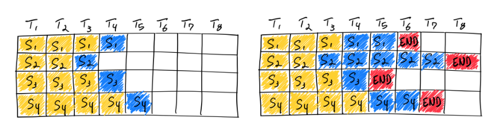
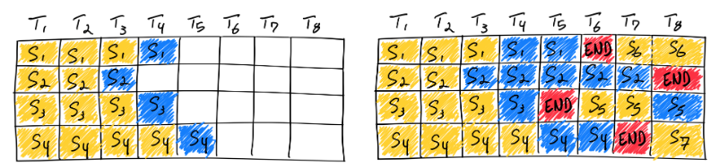
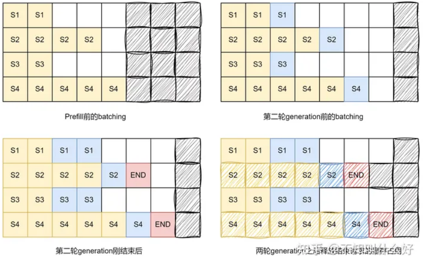
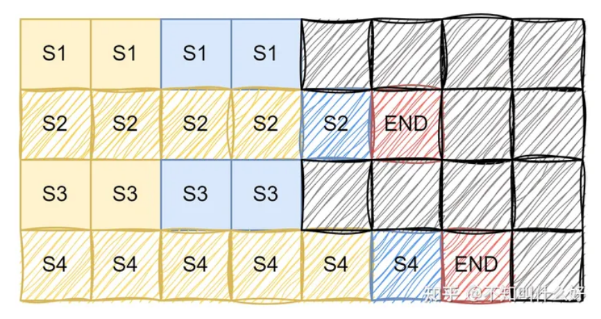
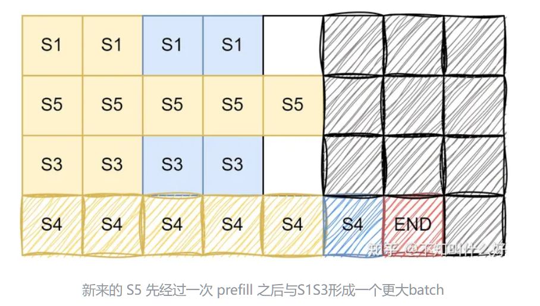
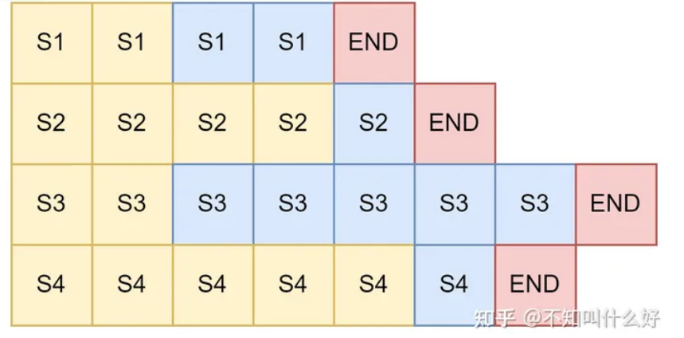
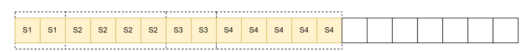
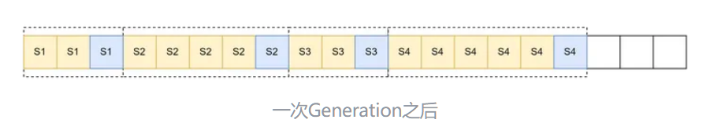
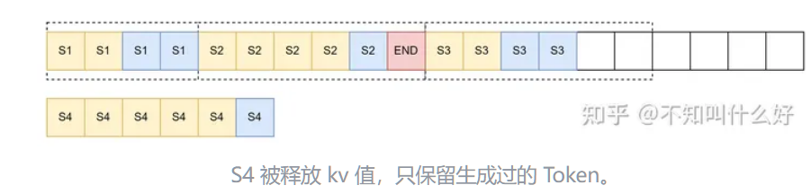
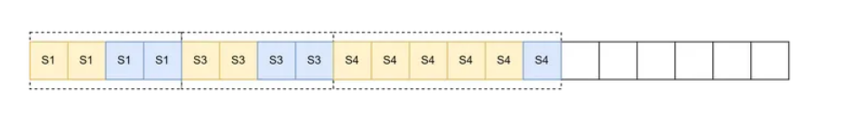

## Continuouse Batch/Dynamic Batch/Iteration Level Scheduling

> https://www.anyscale.com/blog/continuous-batching-llm-inference

### LLM推理优化基础

> https://huggingface.co/blog/bloom-inference-optimization
>
> https://huggingface.co/blog/bloom-inference-optimization

**LLM推理主要受到IO限制而非计算限制**（也就是1MB数据加载到GPU core的时间要多余1MB数据计算的时间）

这意味着LLM的推理吞吐量很大程度上取决于可以在高带宽GPU内存中容纳多大的批处理。

> https://docs.nvidia.com/deeplearning/performance/dl-performance-gpu-background/index.html#understand-perf

**消耗的GPU内存量随着基本模型大小+令牌序列的长度而变化**

在 [Numbers every LLM developer should know](https://github.com/NascentCore/llm-numbers-cn)这篇文章中，它估计了一个13B的参数模型会为序列中每个令牌消耗1MB的状态。

因此，考虑一个具有40GB的A100GPU,它的内存被分配为了

* 26GB的模型参数
* 14GB的令牌所需内存，差不多相当于$14*1024 ≈ 14k$的令牌数量

考虑到IO的限制，这其实是很少的令牌数量。如果我们将当前序列长度都设置为512， 且需要批量计算下一个token，那么实际上我们最多支持的$batch_size = 14k / 512 = 27.343$，我们算它27个序列。

当然，如果上下文长度为2048， 这意味着我们的批处理大小只能为7.

**更不要说，这里的计算并没有考虑中间计算所需资源**

这就意味着，只要你能够优化内存的使用，那么就能节省很大的空间。

* 如果你直接修改模型权重，你可以使用**量化**(16位表示量化为8位表示)，那么内存使用量就是减半，你的batchsize直接翻倍。
* **FlashAttention**提供了一种不修改模型权重也能减少内存占用的方法
  * 简单来说，Flash Attention提供了一种新的方法计算Softmax，这种犯法使得能够通过一次次Softmax局部的计算获得全局Softmax
  * 这使得我们在计算QKV矩阵的时候，可以局部的计算，不需要全部计算
  * 这使得我们可以在计算时就载入很小的一块，使用shared_memory来处理高效的处理这一块
  * 这样不仅减少了Cache miss，同时也减少了所需数据留在内存上的时间，加快了数据的流动性变相的就加快了数据的吞吐量。

* 另一种方法也是不需要修改内存优化的技术，即**Continuous Batch**

### 什么是批处理

GPU 是大规模并行计算架构，计算速率（以每秒浮点运算或浮点运算数衡量）在万亿次浮点运算 （A100） 甚至千万亿次浮点运算 （H100） 范围内。尽管有这些惊人的计算量，LLMs但很难达到饱和，因为芯片的大部分内存带宽都花在了加载模型参数上。

批处理是改善这种情况的一种方法;您可以加载一次模型参数，然后使用它们来处理多个输入序列，而不是每次都有输入序列时都加载新的模型参数。这样可以更有效地利用芯片的内存带宽，从而实现更高的计算利用率、更高的吞吐量和更低LLM的推理成本。

### 原始Batching/静态Batching

在静态批处理中，左图代表了从Prompt中最后一个标记开始自回归生成标记，直到生成END。

这意味着，在这个Batch中，提前结束的都需要等待最晚完成的句子完成了，这个Batch占用的资源才能被释放。显然，Static Batch的性能方差很大。

这里的资源是包括了申请的这一个batch所需大小的内存资源。

考虑一个batch，即使(n-1)个sequence已经到end了，一个未完成的sequence获取下一个token，那么实际上这个batch会进行下一轮的generation，那么就会按照max_seq_len来申请，也就是会多申请(n-1)个完全用不上的内存。

上面的右图中，T6就浪费了一个内存，T8就浪费了3个内存。

### Continuous Batching

Continuous Batching的想法很简单，就是这个Batch中某一个Sequence结束生成后，立马添加新的序列。

这里需要明确，在实际执行中，因为后来填入的序列进行的阶段是Prefill，而在上一个batch中未结束的序列在执行self-decoder部分，因此，一个batch中执行的方法不是同一个方法（context decoder与 self decoder)

具体来说，**考虑只有四个sequence请求**

* Batch一开始，申请[batch_size, max_seq_len]大小的内存
* 完成Prefill后，每个sequence生成了一个token，因为都没有end，因此全部申请一个内存空间
* 完成第二轮generation后，S2和S4已经结束，我们实际上已经可以将结果收集起来不参与后面的batching了，如图4所示
* 此时，**如果要开始第三轮generation**，需要重新分配一次内存，我们按照未完成的最长seq_len即可，如下图

**现在，考了我们其实还有一个sequence需要处理，我们是否可以让这个sequence进来代替一个已经完成的sequence呢**

当然可以，不过首先，这个新的sequence（例如为S5)，还未进行prefill阶段，这意味着它实际上不能直接和batch内的并行进行自回归生成。

一个很好的方案就是，你直接让batch中未完成的序列等S5 prefill完成后，再进行统一的自回归生成。

让 S1 和 S3 等 S5 一个阶段，我们就能获得更高的并行程度，一次为三个请求生成 Token，相比于等 S1, S3 生成完成之后再让 S5 参与计算，显然前者更加划算

然后，我们申请batch_size * max_seq_len即可，如下图

### Continuous Batch的工程流程

上述的 Continuous batching 其实还忽略了一些重要的**工程**上的问题，我们通过分析 vLLM 中的 batching 操作来认识更详细的 batching 策略。

vLLM接受用户的batch信息，我们称为**Query Batch**

vLLM会组织具体送入模型推理的batch组成，我们称为**Infra Batch**

vLLM使用三个双端队列维护所有用户的请求调度

* **waiting**:所有等待Prefill的请求
* **running**:所有可以进行下一个自回归生成的请求
  * 正在进行的推理
  * 刚完成Prefill的推理

接下来，我们可以从头模拟一遍这个流程

#### 问题定义

考虑如下的四个sequence以及它们可能的生成token数

#### waiting队列调度

显然，首先这个batch request会被放入waiting队列，然后判断显存是否支持

* 已有的Prefill Token数量(算上padding为4*5)已经**多于总显存**，返回“Out of Memory"
* **小于等于总显存**， 但是大于**空余显存（可支配显存）**
  * 这说明当前这个request占用的可能算很大了，我们可以尝试暂停某个比他小的batch的推理，选用这个batch进行推理，这样实际上内存占用更高
* **小于空余显存（可支配显存）**
  * 直接加入batch

#### vLLM中的batch与推理流程

首先需要注意的是，vLLM采用的是连续batch的模式，这样我们就不需要申请max_seq_len*batch_size的空间。

因为 vLLM 的**算子采用了特殊的设计**，可以把所有的多个输入当做一个 batch 考虑，不需要考虑每个 batch 具体的序列长度，因此这里采用一行的形式来展示实际的 batch 情况，更加符合 vLLM 中的设计。为了更好的视觉效果这里用虚线框显式的展示的每个请求占用的范围。

接下来进行generation，这里仍然是需要为每个seq都申请一个新的内存。

* 显存足够，直接分配
* 显存不够，我们尝试将running队列中较短的seq替换当前batch的seq
* 实在不够，那就把当前请求扔到waiting里面，之后要使用我们**需要重新prefill**

我们想要在进行一次 Generation 但是发现我们没空余空间给每个都分配一个空间，我们只好放弃 S4。才能进行下一次 Generation。如下图所示是我们放弃 S4 之后的 batching。

在进行generation 的过程中有请求生成了 “END”，即这个请求已经完成了，那么我们可以收集生成的信息然后将其所占用的显存释放。因为有释放的显存，我们可以装入更多的用户请求

我们从waiting选则适合的batch prefill，此时自回归推理暂停，等待prefill。

S4 经过单独的 Prefill 之后即可和 S1，S3一起继续下一轮 Generation，batch如下图所示。因 S4 比S1S3少一轮生成因此会少一个蓝色块。

