## 1.Transformer简介

### 1.1 RNN

* 注意力机制允许神经网络学习序列中非常长的范围中的依赖关系
  * 这个范围远远长于LSTM（RNN的一种形式）
  * Attention机制是为RNN创造的，但是transformer只使用Attention，无需使用任何RNN单元来处理输入
* Transformer十分的耗费时间，但是不同于RNN，它可以并行计算


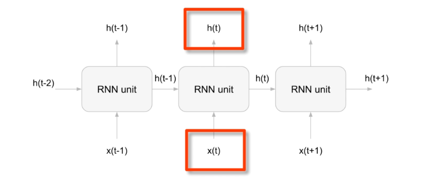

RNN是一种用于处理序列数据的神经网络，它通过在序列的每个时间步（t）上执行相同的任务，同时保持前一个输出的记忆。这种记忆称为隐藏状态（h），它允许网络捕获到目前为止的序列信息。

在这张图中，每个“RNN unit”代表网络在时间步t的一个单元，它接收两个输入：

1. **x(t)**：当前时间步的输入数据。
2. **h(t-1)**：前一个时间步的隐藏状态。

每个RNN单元根据这两个输入计算出两个输出：

1. **h(t)**：当前时间步的隐藏状态，它将被传递到下一个时间步作为输入。
2. 在图中未显示，但通常存在的输出，即当前时间步的输出（例如，用于分类的概率分布），这取决于特定应用。

RNN的关键特性是能够在隐藏状态中存储以前时间步的信息，并使用这种“记忆”影响网络的当前和未来的决策。这使得RNN特别适合于语言建模、时间序列分析、自然语言处理等需要处理序列数据的任务。


### 1.2 RNN的目标问题

RNN有多种形式，LSTM，GRU等

RNN的形式是随着其处理的目标问题相关联的，例如，

* 我们处理multi-input-single-output任务，例如垃圾邮件检测，RNN的形式是many-to-one

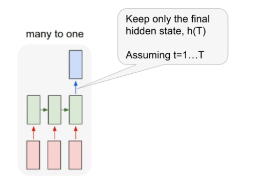

* many-to-many task，例如文本生成

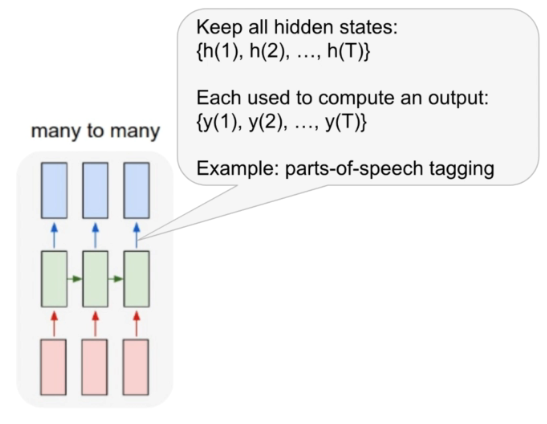


### 1.3. Seq2Seq:Encoder-Decoder

* 还有一个场景是翻译问题，其包含两个RNN需要解决的点

  * 输入输出长度不一致
  * RNN的$\hat{h}(t) = F(x_t,h(t-1))$​，这意味着实际上，这追求的是一个线性的关系，t时刻的信息只能由之前的得出，是一个标准的时间序列特性，然而翻译本身不遵守这个特性，某一个词的意思往往是基于上下文的。
  * 解决方法就是seq2seq

* seq2seq

  * 引入了编码器与解码器的概念

  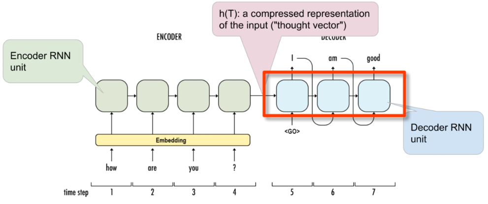

  * 编码器部分的任务是读取并处理输入序列（例如，一个句子）。在这个过程中，每个时间步对应于序列中的一个元素（通常是单词）。在处理序列时，编码器通过其RNN单元逐步构建一个内部状态。对于每个输入元素，都有一个嵌入表示（embedding），它将单词转换为向量形式，这样可以更有效地处理。

    在编码器处理完整个输入序列后，最终的内部状态（通常称为“上下文向量”或“思维向量”）被认为是输入序列的压缩表示。在图中，这表示为最后一个编码器RNN单元的输出h(T)。

    

  * 解码器部分接收编码器的最终状态并开始生成输出序列。在解码过程的开始，解码器通常接收一个特殊的开始符号（如"<GO>"），它表示输出序列的开始。在每个时间步，解码器RNN单元基于当前的内部状态和前一个时间步的输出（在训练时是真实的前一个单词，在推理时是模型自己生成的前一个单词）来生成下一个元素。

    解码器继续这个过程直到产生一个特殊的结束符号（如"<EOS>"），表示输出序列的结束。在每个时间步，解码器的输出可以是一个单词或者一个在更复杂任务中的其他类型的输出。

  * 在简单的编码器-解码器模型中，编码器产生的上下文向量是固定长度的。这意味着不管输入序列有多长，编码器总是将其压缩成一个固定大小的向量。这种方法的一个缺点是对于很长的序列，固定长度的上下文向量可能无法有效地捕获所有必要的信息。

    为了解决这个问题，注意力机制被引入到编码器-解码器架构中。注意力机制允许解码器在生成每个输出时动态地“关注”输入序列中不同的部分。这意味着解码器在每个时间步都可能基于不同的输入信息生成输出，而不是仅仅依赖于一个固定的上下文向量。这样，即使是长序列，模型也可以更好地处理，并且能够捕获更丰富的信息。

  * 一个简单的方式理解注意力

    * **不使用注意力机制的情况**：可以想象成在听某人讲述一长段故事，然后在故事讲完后立即尝试复述。在复述的每一步，我们都依赖于记忆中的故事内容以及我们已经复述的部分。这种方式可能对长段的信息回忆和复述具有挑战，尤其是当细节很多时。
    * **使用注意力机制的情况**：相比之下，使用注意力机制就像我们拥有了故事的完整副本，每次复述时，我们都能回头检视原故事的任何部分。这使得我们在复述每一个片段时都能集中注意力于故事的具体细节，即使这些细节分散在不同的地方。在翻译的过程中，这意味着模型可以“重新阅读”输入的句子的不同部分，并集中注意力于与当前生成的翻译最相关的部分。

    通过注意力机制，模型不必一次性记住所有输入信息，而是可以根据当前的上下文来动态决定输入的哪一部分最值得关注。这样做不仅提高了处理长序列的能力，还使得模型的决策过程更加透明可解释。

  * Decoder-Encoder的几种形式

    * 最后的隐藏状态（没有注意力机制）

      在不使用注意力机制的基本序列到序列模型中，编码器处理完输入序列后的最后一个隐藏状态（有时称为上下文向量或“思维向量”）被传递给解码器。解码器使用这个上下文向量作为其初始隐藏状态，并开始生成输出序列。在每个时间步，解码器都会基于当前的隐藏状态和前一个时间步生成的输出（或者在训练时是真实的前一个目标序列元素），来预测下一个元素。

    * 整个隐藏状态序列（带有注意力机制）

      当使用注意力机制时，解码器不仅接收最后的隐藏状态，还可以访问编码器的整个隐藏状态序列。在生成每个输出元素时，解码器通过注意力机制动态地加权这些隐藏状态，以便集中于与当前预测最相关的输入序列的不同部分。注意力权重决定了从编码器传递给解码器的信息的重点。


### 1.4 Attention in Seq2Seq(双向RNN)

对于编码器，我们通常使用Bi-directional RNN，这意味着我们不仅从正序的过一遍RNN，我们还倒序的过一遍RNN，这有助于我们对当前位置单词上下文关系的理解，而非像传统RNN一样我们只能得到“上文”信息。

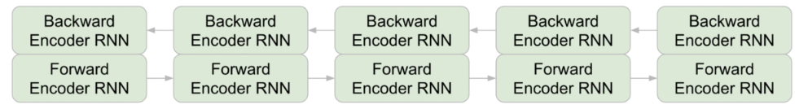

对于解码器，就是根据之前的Input一次生成一个单词的输出

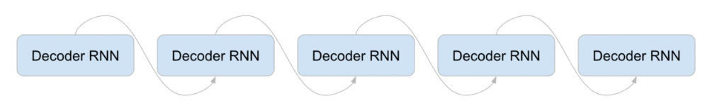

不同点在于，之前我们只会以Encoder的终态h(T)作为输入，现在我们添加了Context vector作为Output's input的一环。

这些以后再深入探究。

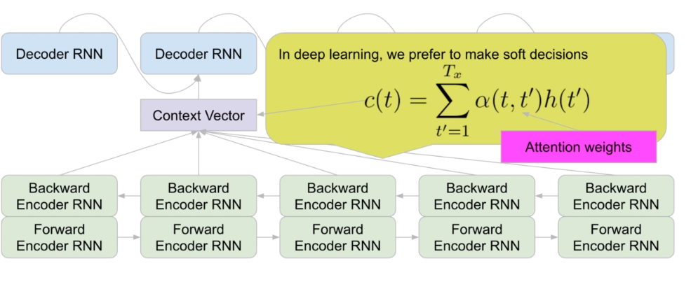

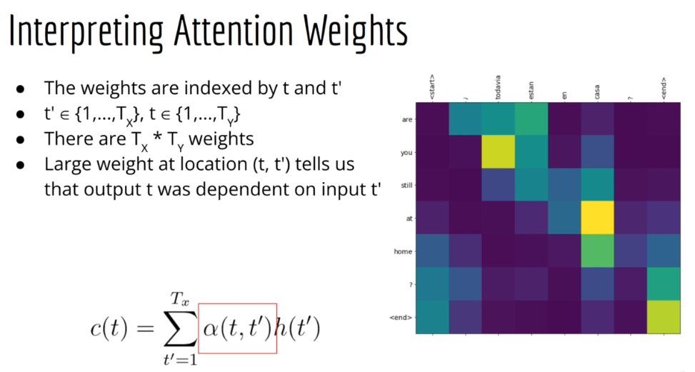


### 1.5 Transformer:Attention is all u need

这篇文章告诉你，forget abount RNN，只需要Attention就可以了。

通过这样做，我们仍然得到了翻译模型给最重要的特征，也就是每个输出都知道要注意哪个输入，因此，我们可以执行像机器翻译这样复杂的任务。

同时，RNN有两个主要的缺点：

* RNN很慢，更糟糕的是，你的下一个词一定是基于上一个词，因此不能并行化，
* 梯度消失，LSTM，GRU虽然做得很好，但是 实际上仍然存在一个极限长度，LSTM与GRU并不能很好的完成。

但是Transformer无论序列多长，其每个输入输出之间都会有直接的关系，我们不需要关心梯度消失。


唯一的缺点就是，假如Transformer只有一个Attention层，且Transformer使用attention但抛弃了RNN，那么attention的表本质上是n*m的attention weight。

更糟的是，Transformer拥有一堆Attention层，他们重复执行这么复杂的权重调整。


## 2. 情感分析(调用pipeline)

使用Hugging Face pipe line直接构建情感分析（已有的模型做二分类）。

情感分析本质是一个语言分类问题。


什么是pipline？

pipline旨在完成所有工作，包括tokenize text, converting text into integers（创建词表），使用这些词对应的整数进行推理。

```bash
pip install transformers
```

在HuggingFaceDocumentation有可用pipeline列表

```python
from transformers import pipeline
# return a model that can do prediction
classifier = pipeline("sentiment-analysis")

# 我们可以简单的输入raw text而非其他的张量来完成，因为pipeline已经为你完成了一切

classifier("This is such a great movie"，"No shit")
# return 一个字典，包括结果与置信度
```


## 3. 文本生成

### 3.1 传统的类似时间序列的文本生成:自回归模型GPT

首先我们从时间序列开始理解


对于时间序列，常常使用自回归模型，它使用以前的值来预测时间序列中的下一个值，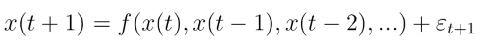

同样的，Linear model也是一种选择，它直接对数据进行线性拟合

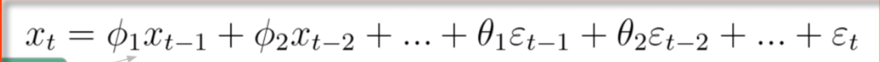

所以我们可以发现，时间序列本身就是从历史值来预测未来值


对于语言模型，实际上更趋向于对于已经出现的词语，给出其下一个词的可能性。

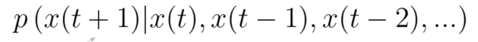

在处理自然语言处理任务时，马尔可夫假设常被用于简化问题，它假定当前词的出现仅依赖于前面有限个词的序列。这种假设基础上的模型称为n阶马尔可夫模型，其中“n”指定了依赖的步长或历史词的数量。尽管马尔可夫假设在简化模型和计算上十分有效，它却在处理长文本中的上下文信息时遇到了显著的限制。

具体来说，马尔可夫模型的一个关键局限在于其处理长范围依赖关系的能力不足。随着考虑的步长“n”增加，为了捕捉更多的上下文信息，模型的状态空间会呈指数级增长。假设我们的词汇库大小为V，步长为n，那么潜在的状态空间或分布的大小将达到$V^n$。这导致了所谓的“维度灾难”，即模型参数量和计算复杂度的爆炸性增长，使得模型变得难以训练和泛化。

此外，即使增加步长，马尔可夫模型仍然难以有效捕获文本中的长期依赖性，因为它的假设本质上限制了考虑的上下文范围。这意味着，在面对需要理解更广泛上下文以做出准确预测的复杂语言模式时，传统的马尔可夫模型可能不足以提供满意的解决方案。

为了克服这些局限，近年来的研究转向了更高级的模型，如长短期记忆网络（LSTM）和Transformer模型，它们能够通过不同的机制学习文本中的长距离依赖关系，而不受马尔可夫假设的约束。


### 3.2 基于上下文的文本生成(Masked language model)：BERT

显然，基于时间序列的Autoregressive/causal language model只会观测历史数据以生成新的。

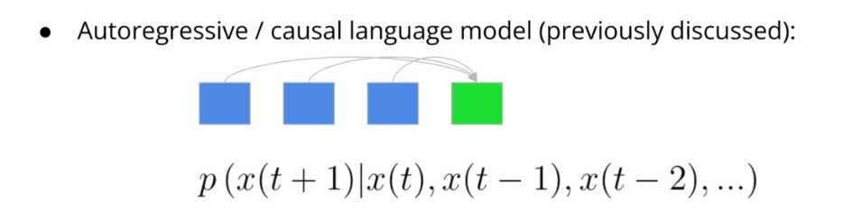

因此，我们考虑一个不同的模型，即为双向模型。具体来说，这个模型建立了一个分布来预测给定过去和未来的位置t的token。

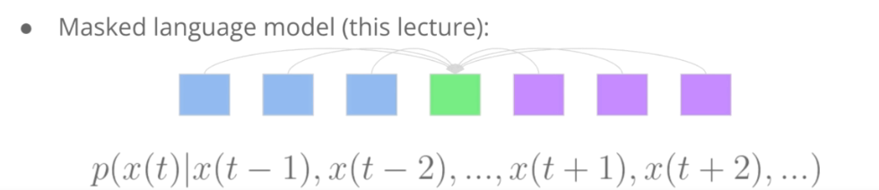


经典的Masked language model就是Bert，Bert代表了Transformer的双向编码表示，这意味着模型会从过去和未来汲取信息。

Masked Language Model (MLM) 是一种自然语言处理模型，它的训练过程包括在输入文本中随机掩盖一些词汇（即替换为特殊的[mask]标记），然后模型需要预测这些掩盖的词汇。这种模型能够深入理解语言的上下文和词汇间的关系，因此非常适合用于文章重写等任务。

在文章重写的应用中，MLM可以用来生成语义相似但在词汇和句式上有所变化的句子或段落。具体来说，可以通过以下步骤实现：

1. **文本分析**：首先分析原始文章的结构和内容，确定哪些部分或词汇可以被替换或改写，而不改变整体意义。
2. **掩盖与预测**：在可替换的词汇或短语上应用掩盖（替换为[mask]标记），然后使用MLM预测最合适的替换选项。模型会考虑到上下文，从而生成合适的、自然的替换词汇。
3. **生成新内容**：将预测的词汇填充回原文，生成新的文章版本。这个过程可以在文章的不同部分重复进行，以产生多个版本。

 优点

- **内容丰富**：MLM可以帮助快速生成大量内容，对于需要大量独特文章的应用场景（如博客、新闻网站等）尤其有用。
- **语言自然**：由于MLM基于对大量文本的学习，生成的内容在语法和语义上都较为自然和准确。
- **灵活性高**：可以根据需要调整掩盖和预测的策略，以生成不同风格或侧重点的文章。

Masked language model一个应用就是Article spinning（文章重写（Article Spinning）是一种通过对原始文本进行改写来生成新内容的技术，旨在产生多个语义相似但表达不同的文章版本。这一技术在内容创作、SEO（搜索引擎优化）和数字营销等领域尤其受欢迎，因为它可以快速生成大量独特内容，帮助网站在搜索引擎中获得更好的排名，同时节省时间和人力资源。），

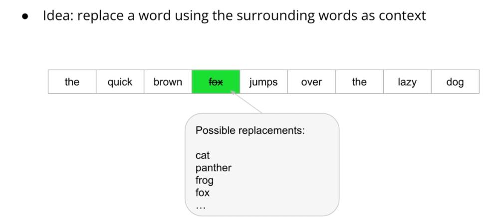


### 3.3 Auto Encoding Language Model

AutoEncoder是一种无监督深度学习模型，它的目标是学习一个数据的有效表示（编码），通常用于降维、去噪、特征学习等任务。

#### 基本原理

AutoEncoder通过两个主要部分工作：编码器（Encoder）和解码器（Decoder）。编码器的作用是将输入数据转换成一个更紧凑的形式，即“编码”。解码器则尝试从这个编码中重构原始输入数据。简而言之，AutoEncoder的目标是使输出尽可能接近输入，同时在编码过程中学习数据的有用表示。

#### 应用示例

- **去噪**：去噪自编码器（Denoising AutoEncoder）是AutoEncoder的一种变体，它在输入数据中引入噪声，然后训练模型重构原始未受损的数据。这种方式使模型能够学习到数据中更鲁棒的特征。
- **推荐系统**：AutoEncoder可以用于学习用户或物品的紧凑表示，进而用于生成推荐。
- **预训练**：在自然语言处理任务中，AutoEncoder常被用于预训练，为下游任务（如文本分类、情感分析等）提供有用的特征表示。

#### 与语言模型的联系

AutoEncoder提供了一种理解掩码语言模型（如BERT）的视角。在掩码语言模型中，部分输入（例如，文本中的单词）被掩码（即“加噪”），模型的任务是预测这些掩码位置的原始内容。这与去噪自编码器的任务相似，即从损坏的输入中恢复出完整信息。

此外，AutoEncoder的这种用法与之前学习的因果语言模型（如GPT）形成对比。因果语言模型是自回归的，依赖于先前的词来预测下一个词，而掩码语言模型（视作自编码器）则是在给定上下文中填补缺失的信息。

AutoEncoder是一种强大的深度学习工具，尤其在处理需要无监督学习的复杂任务时。通过学习输入数据的有效表示，AutoEncoder不仅能够在各种应用中实现数据的去噪和特征提取，还为理解和改进自然语言处理模型提供了有价值的洞察。在自然语言处理中，将AutoEncoder理解为一种处理文本的“去噪自编码器”，为我们提供了一种新的视角来探索和设计更高效的语言模型。
