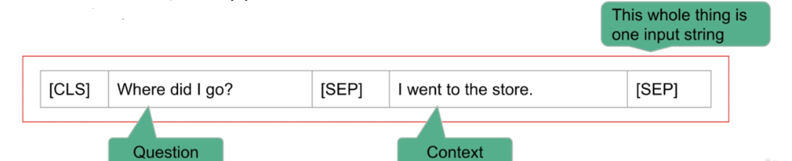

## 1.Transformer简介

### 1.1 RNN

* 注意力机制允许神经网络学习序列中非常长的范围中的依赖关系
  * 这个范围远远长于LSTM（RNN的一种形式）
  * Attention机制是为RNN创造的，但是transformer只使用Attention，无需使用任何RNN单元来处理输入
* Transformer十分的耗费时间，但是不同于RNN，它可以并行计算


RNN是一种用于处理序列数据的神经网络，它通过在序列的每个时间步（t）上执行相同的任务，同时保持前一个输出的记忆。这种记忆称为隐藏状态（h），它允许网络捕获到目前为止的序列信息。

在这张图中，每个“RNN unit”代表网络在时间步t的一个单元，它接收两个输入：

1. **x(t)**：当前时间步的输入数据。
2. **h(t-1)**：前一个时间步的隐藏状态。

每个RNN单元根据这两个输入计算出两个输出：

1. **h(t)**：当前时间步的隐藏状态，它将被传递到下一个时间步作为输入。
2. 在图中未显示，但通常存在的输出，即当前时间步的输出（例如，用于分类的概率分布），这取决于特定应用。

RNN的关键特性是能够在隐藏状态中存储以前时间步的信息，并使用这种“记忆”影响网络的当前和未来的决策。这使得RNN特别适合于语言建模、时间序列分析、自然语言处理等需要处理序列数据的任务。


### 1.2 RNN的目标问题

RNN有多种形式，LSTM，GRU等

RNN的形式是随着其处理的目标问题相关联的，例如，

* 我们处理multi-input-single-output任务，例如垃圾邮件检测，RNN的形式是many-to-one


* many-to-many task，例如文本生成


### 1.3. Seq2Seq:Encoder-Decoder

* 还有一个场景是翻译问题，其包含两个RNN需要解决的点

  * 输入输出长度不一致
  * RNN的$\hat{h}(t) = F(x_t,h(t-1))$​，这意味着实际上，这追求的是一个线性的关系，t时刻的信息只能由之前的得出，是一个标准的时间序列特性，然而翻译本身不遵守这个特性，某一个词的意思往往是基于上下文的。
  * 解决方法就是seq2seq

* seq2seq

  * 引入了编码器与解码器的概念

  

  * 编码器部分的任务是读取并处理输入序列（例如，一个句子）。在这个过程中，每个时间步对应于序列中的一个元素（通常是单词）。在处理序列时，编码器通过其RNN单元逐步构建一个内部状态。对于每个输入元素，都有一个嵌入表示（embedding），它将单词转换为向量形式，这样可以更有效地处理。

    在编码器处理完整个输入序列后，最终的内部状态（通常称为“上下文向量”或“思维向量”）被认为是输入序列的压缩表示。在图中，这表示为最后一个编码器RNN单元的输出h(T)。

    

  * 解码器部分接收编码器的最终状态并开始生成输出序列。在解码过程的开始，解码器通常接收一个特殊的开始符号（如"<GO>"），它表示输出序列的开始。在每个时间步，解码器RNN单元基于当前的内部状态和前一个时间步的输出（在训练时是真实的前一个单词，在推理时是模型自己生成的前一个单词）来生成下一个元素。

    解码器继续这个过程直到产生一个特殊的结束符号（如"<EOS>"），表示输出序列的结束。在每个时间步，解码器的输出可以是一个单词或者一个在更复杂任务中的其他类型的输出。

  * 在简单的编码器-解码器模型中，编码器产生的上下文向量是固定长度的。这意味着不管输入序列有多长，编码器总是将其压缩成一个固定大小的向量。这种方法的一个缺点是对于很长的序列，固定长度的上下文向量可能无法有效地捕获所有必要的信息。

    为了解决这个问题，注意力机制被引入到编码器-解码器架构中。注意力机制允许解码器在生成每个输出时动态地“关注”输入序列中不同的部分。这意味着解码器在每个时间步都可能基于不同的输入信息生成输出，而不是仅仅依赖于一个固定的上下文向量。这样，即使是长序列，模型也可以更好地处理，并且能够捕获更丰富的信息。

  * 一个简单的方式理解注意力

    * **不使用注意力机制的情况**：可以想象成在听某人讲述一长段故事，然后在故事讲完后立即尝试复述。在复述的每一步，我们都依赖于记忆中的故事内容以及我们已经复述的部分。这种方式可能对长段的信息回忆和复述具有挑战，尤其是当细节很多时。
    * **使用注意力机制的情况**：相比之下，使用注意力机制就像我们拥有了故事的完整副本，每次复述时，我们都能回头检视原故事的任何部分。这使得我们在复述每一个片段时都能集中注意力于故事的具体细节，即使这些细节分散在不同的地方。在翻译的过程中，这意味着模型可以“重新阅读”输入的句子的不同部分，并集中注意力于与当前生成的翻译最相关的部分。

    通过注意力机制，模型不必一次性记住所有输入信息，而是可以根据当前的上下文来动态决定输入的哪一部分最值得关注。这样做不仅提高了处理长序列的能力，还使得模型的决策过程更加透明可解释。

  * Decoder-Encoder的几种形式

    * 最后的隐藏状态（没有注意力机制）

      在不使用注意力机制的基本序列到序列模型中，编码器处理完输入序列后的最后一个隐藏状态（有时称为上下文向量或“思维向量”）被传递给解码器。解码器使用这个上下文向量作为其初始隐藏状态，并开始生成输出序列。在每个时间步，解码器都会基于当前的隐藏状态和前一个时间步生成的输出（或者在训练时是真实的前一个目标序列元素），来预测下一个元素。

    * 整个隐藏状态序列（带有注意力机制）

      当使用注意力机制时，解码器不仅接收最后的隐藏状态，还可以访问编码器的整个隐藏状态序列。在生成每个输出元素时，解码器通过注意力机制动态地加权这些隐藏状态，以便集中于与当前预测最相关的输入序列的不同部分。注意力权重决定了从编码器传递给解码器的信息的重点。


### 1.4 Attention in Seq2Seq(双向RNN)

对于编码器，我们通常使用Bi-directional RNN，这意味着我们不仅从正序的过一遍RNN，我们还倒序的过一遍RNN，这有助于我们对当前位置单词上下文关系的理解，而非像传统RNN一样我们只能得到“上文”信息。


对于解码器，就是根据之前的Input一次生成一个单词的输出


不同点在于，之前我们只会以Encoder的终态h(T)作为输入，现在我们添加了Context vector作为Output's input的一环。

这些以后再深入探究。


### 1.5 Transformer:Attention is all u need

这篇文章告诉你，forget abount RNN，只需要Attention就可以了。

通过这样做，我们仍然得到了翻译模型给最重要的特征，也就是每个输出都知道要注意哪个输入，因此，我们可以执行像机器翻译这样复杂的任务。

同时，RNN有两个主要的缺点：

* RNN很慢，更糟糕的是，你的下一个词一定是基于上一个词，因此不能并行化，
* 梯度消失，LSTM，GRU虽然做得很好，但是 实际上仍然存在一个极限长度，LSTM与GRU并不能很好的完成。

但是Transformer无论序列多长，其每个输入输出之间都会有直接的关系，我们不需要关心梯度消失。


唯一的缺点就是，假如Transformer只有一个Attention层，且Transformer使用attention但抛弃了RNN，那么attention的表本质上是n*m的attention weight。

更糟的是，Transformer拥有一堆Attention层，他们重复执行这么复杂的权重调整。


## 2. 情感分析(调用pipeline)

使用Hugging Face pipe line直接构建情感分析（已有的模型做二分类）。

情感分析本质是一个语言分类问题。


什么是pipline？

pipline旨在完成所有工作，包括tokenize text, converting text into integers（创建词表），使用这些词对应的整数进行推理。

```bash
pip install transformers
```

在HuggingFaceDocumentation有可用pipeline列表

```python
from transformers import pipeline
# return a model that can do prediction
classifier = pipeline("sentiment-analysis")

# 我们可以简单的输入raw text而非其他的张量来完成，因为pipeline已经为你完成了一切

classifier("This is such a great movie"，"No shit")
# return 一个字典，包括结果与置信度
```


## 3. 文本生成

### 3.1 传统的类似时间序列的文本生成:自回归模型GPT

首先我们从时间序列开始理解


对于时间序列，常常使用自回归模型，它使用以前的值来预测时间序列中的下一个值，

同样的，Linear model也是一种选择，它直接对数据进行线性拟合


所以我们可以发现，时间序列本身就是从历史值来预测未来值


对于语言模型，实际上更趋向于对于已经出现的词语，给出其下一个词的可能性。


在处理自然语言处理任务时，马尔可夫假设常被用于简化问题，它假定当前词的出现仅依赖于前面有限个词的序列。这种假设基础上的模型称为n阶马尔可夫模型，其中“n”指定了依赖的步长或历史词的数量。尽管马尔可夫假设在简化模型和计算上十分有效，它却在处理长文本中的上下文信息时遇到了显著的限制。

具体来说，马尔可夫模型的一个关键局限在于其处理长范围依赖关系的能力不足。随着考虑的步长“n”增加，为了捕捉更多的上下文信息，模型的状态空间会呈指数级增长。假设我们的词汇库大小为V，步长为n，那么潜在的状态空间或分布的大小将达到$V^n$。这导致了所谓的“维度灾难”，即模型参数量和计算复杂度的爆炸性增长，使得模型变得难以训练和泛化。

此外，即使增加步长，马尔可夫模型仍然难以有效捕获文本中的长期依赖性，因为它的假设本质上限制了考虑的上下文范围。这意味着，在面对需要理解更广泛上下文以做出准确预测的复杂语言模式时，传统的马尔可夫模型可能不足以提供满意的解决方案。

为了克服这些局限，近年来的研究转向了更高级的模型，如长短期记忆网络（LSTM）和Transformer模型，它们能够通过不同的机制学习文本中的长距离依赖关系，而不受马尔可夫假设的约束。


### 3.2 基于上下文的文本生成(Masked language model)：BERT

显然，基于时间序列的Autoregressive/causal language model只会观测历史数据以生成新的。


因此，我们考虑一个不同的模型，即为双向模型。具体来说，这个模型建立了一个分布来预测给定过去和未来的位置t的token。


经典的Masked language model就是Bert，Bert代表了Transformer的双向编码表示，这意味着模型会从过去和未来汲取信息。

Masked Language Model (MLM) 是一种自然语言处理模型，它的训练过程包括在输入文本中随机掩盖一些词汇（即替换为特殊的[mask]标记），然后模型需要预测这些掩盖的词汇。这种模型能够深入理解语言的上下文和词汇间的关系，因此非常适合用于文章重写等任务。

在文章重写的应用中，MLM可以用来生成语义相似但在词汇和句式上有所变化的句子或段落。具体来说，可以通过以下步骤实现：

1. **文本分析**：首先分析原始文章的结构和内容，确定哪些部分或词汇可以被替换或改写，而不改变整体意义。
2. **掩盖与预测**：在可替换的词汇或短语上应用掩盖（替换为[mask]标记），然后使用MLM预测最合适的替换选项。模型会考虑到上下文，从而生成合适的、自然的替换词汇。
3. **生成新内容**：将预测的词汇填充回原文，生成新的文章版本。这个过程可以在文章的不同部分重复进行，以产生多个版本。

 优点

- **内容丰富**：MLM可以帮助快速生成大量内容，对于需要大量独特文章的应用场景（如博客、新闻网站等）尤其有用。
- **语言自然**：由于MLM基于对大量文本的学习，生成的内容在语法和语义上都较为自然和准确。
- **灵活性高**：可以根据需要调整掩盖和预测的策略，以生成不同风格或侧重点的文章。

Masked language model一个应用就是Article spinning（文章重写（Article Spinning）是一种通过对原始文本进行改写来生成新内容的技术，旨在产生多个语义相似但表达不同的文章版本。这一技术在内容创作、SEO（搜索引擎优化）和数字营销等领域尤其受欢迎，因为它可以快速生成大量独特内容，帮助网站在搜索引擎中获得更好的排名，同时节省时间和人力资源。），


### 3.3 Auto Encoding Language Model

AutoEncoder是一种无监督深度学习模型，它的目标是学习一个数据的有效表示（编码），通常用于降维、去噪、特征学习等任务。

#### 基本原理

AutoEncoder通过两个主要部分工作：编码器（Encoder）和解码器（Decoder）。编码器的作用是将输入数据转换成一个更紧凑的形式，即“编码”。解码器则尝试从这个编码中重构原始输入数据。简而言之，AutoEncoder的目标是使输出尽可能接近输入，同时在编码过程中学习数据的有用表示。

#### 应用示例

- **去噪**：去噪自编码器（Denoising AutoEncoder）是AutoEncoder的一种变体，它在输入数据中引入噪声，然后训练模型重构原始未受损的数据。这种方式使模型能够学习到数据中更鲁棒的特征。
- **推荐系统**：AutoEncoder可以用于学习用户或物品的紧凑表示，进而用于生成推荐。
- **预训练**：在自然语言处理任务中，AutoEncoder常被用于预训练，为下游任务（如文本分类、情感分析等）提供有用的特征表示。

#### 与语言模型的联系

AutoEncoder提供了一种理解掩码语言模型（如BERT）的视角。在掩码语言模型中，部分输入（例如，文本中的单词）被掩码（即“加噪”），模型的任务是预测这些掩码位置的原始内容。这与去噪自编码器的任务相似，即从损坏的输入中恢复出完整信息。

此外，AutoEncoder的这种用法与之前学习的因果语言模型（如GPT）形成对比。因果语言模型是自回归的，依赖于先前的词来预测下一个词，而掩码语言模型（视作自编码器）则是在给定上下文中填补缺失的信息。

AutoEncoder是一种强大的深度学习工具，尤其在处理需要无监督学习的复杂任务时。通过学习输入数据的有效表示，AutoEncoder不仅能够在各种应用中实现数据的去噪和特征提取，还为理解和改进自然语言处理模型提供了有价值的洞察。在自然语言处理中，将AutoEncoder理解为一种处理文本的“去噪自编码器”，为我们提供了一种新的视角来探索和设计更高效的语言模型。


### 3.4 Text Generation using GPT2

```python
from transformers import pipeline
gen = pipeline("text-generation") # uses GPT2 in default
prompt = "Neural Networks with attention have been used with great success"

gen(prompt,num_return_sequences = 4)# 生成四个版本
gen(prompt, max_length = 30) # 设置续写最长
```

这段代码主要使用`transformers`库中的`pipeline`功能来生成文本。这里，它尝试在给定的初始文本提示（来源于`robert_frost.txt`文件中的句子）的基础上，生成续写的文本。

```python
from transformers import pipeline, set_seed
import textwrap
from pprint import pprint

# 初始化文本生成pipeline
gen = pipeline("text-generation")
set_seed(1234)  # 确保结果的可重现性

# 读取并处理robert_frost.txt文件
with open('robert_frost.txt') as file:
    lines = [line.strip() for line in file if line.strip()]  # 移除空格并过滤空行

# 定义一个函数来格式化文本输出
def wrap(text):
    return textwrap.fill(text, replace_whitespace=False, fix_sentence_endings=True)

# 基于文件中的第一行文本生成新文本，并打印结果
first_line_gen = gen(lines[0], max_length=20)
pprint(first_line_gen)

# 生成三个不同的文本序列作为示例
multi_gen_example = gen(lines[0], num_return_sequences=3, max_length=20)
pprint(multi_gen_example)

# 展示如何格式化并打印生成的文本
formatted_text = wrap(first_line_gen[0]['generated_text'])
print(formatted_text)

# 模拟更复杂的文本生成场景：结合自定义文本和引用
custom_text = 'Two roads diverged in a yellow wood, ....' + \
              'road leading to another intersection in the middle of the city.\n' + \
              '...'
complex_gen = gen(custom_text + '\n' + lines[4], max_length=90)
print(wrap(complex_gen[0]['generated_text']))

```

- `custom_text + '\n' + lines[4]`：这部分代码首先将`custom_text`变量中的字符串与`lines`列表中的第五个元素（Python中的索引从0开始，因此`lines[4]`是第五行）拼接，中间通过换行符`\n`分隔。这样做的目的是模拟一个更复杂的场景，其中`custom_text`可能是用户自己编写的或从其他来源选择的文本，而`lines[4]`是从`robert_frost.txt`文件中选取的一行文本。这个拼接后的字符串被用作生成文本的输入提示。
- `max_length=90`：这个参数指定了生成文本的最大长度，包括输入提示文本的长度。在这个例子中，生成的文本（包括输入提示）的字符数不会超过90个。
- `gen`函数调用：这个函数根据提供的输入文本（`custom_text + '\n' + lines[4]`）和参数（`max_length=90`）生成新的文本。生成的文本旨在续写或基于输入提示生成相关内容，这是通过训练有素的语言模型完成的，该模型能够理解输入文本的上下文并生成连贯的续文。
- `complex_gen`变量：生成的文本被存储在`complex_gen`变量中。这个变量包含了一个或多个生成的文本序列，具体取决于`pipeline`配置和调用时的参数。在这个案例中，由于没有指定生成多个序列的参数，`complex_gen`通常会包含一个生成的文本序列。


### 3.5 Use Transformer do Article spinning(完形填空)

```python
from transformers import pipeline
mlm = pipeline("fill-mask")

mlm("The cat <mask> over the box")>
```

> ```
> [{'score': 0.1044921725988388,
>   'token': 13855,
>   'token_str': ' jumps',
>   'sequence': 'The cat jumps over the box'},
>  {'score': 0.057583849877119064,
>   'token': 33265,
>   'token_str': ' crawling',
>   'sequence': 'The cat crawling over the box'},
>  {'score': 0.04840438812971115,
>   'token': 33189,
>   'token_str': ' leaping',
>   'sequence': 'The cat leaping over the box'},
>  {'score': 0.04716663435101509,
>   'token': 10907,
>   'token_str': ' climbing',
>   'sequence': 'The cat climbing over the box'},
>  {'score': 0.030807925388216972,
>   'token': 32564,
>   'token_str': ' leaps',
>   'sequence': 'The cat leaps over the box'}]
> ```


```python
import numpy as np
import pandas as pd
import textwrap
from pprint import pprint
from transformers import pipeline

# 下载BBC新闻数据集
!wget -nc https://lazyprogrammer.me/course_files/nlp/bbc_text_cls.csv

# 加载数据集
df = pd.read_csv('bbc_text_cls.csv')
# 展示数据集的前几行以了解其结构
df.head()

# 从数据集中提取所有唯一的标签
labels = set(df['labels'])

# 选择一个特定的标签进行分析
label = 'business'

# 挑选所有标记为'business'的文本
texts = df[df['labels'] == label]['text']
# 展示筛选后的文本的前几行
texts.head()

# 设置随机种子以确保结果的可复现性
np.random.seed(1234)

# 随机选择一个文档
i = np.random.choice(texts.shape[0])
doc = texts.iloc[i]

# 格式化并打印选定的文档
print(textwrap.fill(doc, replace_whitespace=False, fix_sentence_endings=True))

# 初始化一个masked language model (MLM) pipeline
mlm = pipeline('fill-mask')

# 用MLM模型测试一个简单的句子填空效果
mlm('Bombardier chief to leave <mask>')

# 定义一个函数用于自动改进文本
def refine_text(text, model):
    # 将文本分割成单词列表
    words = text.split()
    # 遍历每个单词，尝试用MLM替换
    for i in range(len(words)):
        # 使用mask token替换当前单词，构建新的句子
        masked_text = " ".join(words[:i] + [model.tokenizer.mask_token] + words[i+1:])
        # 使用MLM模型进行预测
        predictions = model(masked_text)
        # 如果最高分预测的得分超过0.05，则接受替换
        if predictions[0]['score'] > 0.05:
            words[i] = predictions[0]['token_str'].replace(' ', '')
    # 将处理后的单词列表重新组合成句子
    return " ".join(words)

# 使用MLM模型改进选定的文档
refined_text = refine_text(doc, mlm)
# 格式化并打印改进后的文档
pprint(refined_text)
# 为了比较，也打印原始文档
pprint(doc)

```


这段代码主要执行了以下几个任务，旨在展示如何使用一个遮蔽语言模型（MLM）来自动改进或修改指定标签下的新闻文本：

1. **下载数据集**：使用`wget`命令下载了一个包含新闻文章的CSV文件（`bbc_text_cls.csv`）。这个数据集被用于后续的文本处理和分析。
2. **加载和预览数据集**：通过Pandas库加载下载好的CSV文件，并查看数据集的前几行以获取数据集结构的初步了解。数据集包含新闻文本及其对应的标签。
3. **提取标签**：从数据集中提取所有唯一的新闻标签（类别），并保存到`labels`变量中。
4. **筛选特定标签的文本**：选择一个特定的标签（在此例中为`business`），然后从数据集中筛选出所有属于该标签的文本。
5. **随机选择一个文档并展示**：设置随机种子以确保结果可复现，然后从筛选出的文本中随机选择一个。使用`textwrap`对选定的文档进行格式化，使其更易于阅读，并打印出来。
6. **初始化Masked Language Model（MLM）**：使用`transformers`库中的`pipeline`功能创建一个遮蔽语言模型（MLM）pipeline。这个模型能够在给定包含特殊`<mask>`标记的文本时，预测`<mask>`位置最可能的单词或词组。
7. **演示MLM能力**：通过将部分句子中的某个词替换为`<mask>`，使用MLM pipeline来预测缺失的词。这展示了MLM模型如何根据上下文预测填充词。
8. **定义并使用`refine_text`函数自动改进文本**：
   - 定义了一个名为`refine_text`的函数，该函数遍历文本中的每个单词，将其依次替换为`<mask>`，并使用MLM模型预测最可能的替代词。
   - 如果模型对某个单词的预测置信度超过了设定的阈值（在这里是0.05），则用预测的词替换原文中的词。
   - 通过这种方式，`refine_text`函数尝试自动改进或修改选定文档的内容。
9. **对选定的文档应用改进并展示结果**：使用`refine_text`函数对之前随机选定的文档进行处理，然后打印改进后的文本，并与原文进行对比。

### 3.6 命名实体识别(Name Entity Recognition)


#### NER(Supervised Learning)

命名实体识别（Named Entity Recognition）是一个NLP任务，它涉及到从文本中识别出具有特定意义的实体，如人名、地名、机构名、时间表达式、数量、货币等。NER是信息提取的关键步骤，对于问答系统、搜索引擎、内容推荐、知识图谱构建等领域至关重要。

NER主要是用作较大数据集的预处理步骤，基本上的想法是，你有一份文件，你想识别所有的人物，地点和公司等专有名词。

例如，将Apple识别为公司，将Steve Jobs识别为人物，将California识别为地点。


这看起来和Speech Tagging十分相似，事实上，他们都是many-to-many的任务

> 词性标注（Part-of-Speech Tagging, POS Tagging）是自然语言处理中的一个基础任务，它涉及到阅读文本中的单词，并给它们赋予语法分类，如名词、动词、形容词等。词性标注对于很多NLP任务都是一个重要的预处理步骤，比如句法分析、实体识别、机器翻译等。
>
> 词性标注通常可以通过以下几种方法解决：
>
> 1. **规则基础的标注器**：使用特定语言的语法规则来识别不同的词性。这些标注器依赖于大量的手工编码的语法规则。
> 2. **统计标注器**：使用机器学习技术训练模型来识别词性。这些模型通常需要一个大型的、已经标注好词性的语料库。模型类型包括隐马尔可夫模型（HMM）、最大熵标注器、条件随机场（CRF）等。
> 3. **深度学习方法**：随着深度学习的发展，基于神经网络的标注器已经成为了主流。如使用双向LSTM（长短期记忆网络）结合词嵌入，比如GloVe或Word2Vec，可以得到很好的表现。近年来，BERT及其变体（如RoBERTa、ALBERT等）通过上下文相关的词嵌入进一步提升了词性标注的准确性。

但是NER通常的词性标记更定制化，这使得NER会遇到一些问题:

* 一些词本身可能具有多个token，但是只应对应一个词性：steve jobs->name

* 数据是高度不平衡的，也就是你需要tag的可能只是数据的一小部分词，其余词都是形容词，介词等

  例如考虑这一段话：**众所周知，绵羊会感染痒病，这是一种类似于疯牛病的脑萎缩疾病，据信BSE会通过含有动物粪便的饲料转移到牛身上。**

  这句话本身并不包含地点，公司，人名，因此所有的token都应该被设定为`O`，即为不符合任意一种。


#### IOB格式

为了解决一个词性对应多个token的问题，引入IOB格式，这种格式在标签中使用IOB

其思想为，每个实体(entity)都可能显示为一个块(chunk)，而(chunk)是多个token的一个序列。

以Steve jobs为例，

* Steve被认为是一个Person tag，并且是一个chunk的开头，因此，Steve被标记为`B-PER`,beginning of a person chunk
* jobs也是一个Person tag且在chunk之中，因此被标记为`I-PER`,Insider a person chunk
* 其他词单纯的使用O标记，代表outside any chunk


#### 使用ner模型

```python
from transformers import pipeline
ner = pipeline("ner",aggregation_strategy='simple')
#ner = pipeline("ner",aggregation_strategy='simple',device=0)

ner("Steve Jobs was the CEO of Apple, headquartered in California")


```

> ```
> [{'entity_group': 'PER',
>   'score': 0.9981982,
>   'word': 'Steve Jobs',
>   'start': 0,
>   'end': 10},
>  {'entity_group': 'ORG',
>   'score': 0.99860126,
>   'word': 'Apple',
>   'start': 26,
>   'end': 31},
>  {'entity_group': 'LOC',
>   'score': 0.99932134,
>   'word': 'California',
>   'start': 50,
>   'end': 60}]
> ```


以下代码详细说明了如何从Conll 2003数据集加载数据，如何使用命名实体识别（NER）模型来识别文本中的实体，并如何计算模型在一个样本和整个测试集上的准确度和F1分数。通过这种方式，代码更加易于理解，尤其是对于初学者或非专业人士。

其中`compute_prediction`接收原始的token列表（`inputs[9]`）、detokenize后的文本（`input_`）、以及NER模型的预测结果（`ner_result`）。这个函数通过比较每个token在反标记化的文本中的位置与NER模型识别的实体位置，为每个token分配一个实体标签（如"B-PER"表示人名开始的token，"I-PER"表示人名内部的token，"O"表示非实体token）。这样，`compute_prediction`函数为整个句子中的每个单词生成了一个对应的实体标签列表`ptags`。

```python
from transformers import pipeline
# 初始化命名实体识别（NER）模型
ner = pipeline("ner",aggregation_strategy='simple')
import pickle # to load our dataset

# 下载conll 2003，这是最流行的NER Dataset
# 同时，可以发现，pipeline默认的dataset是这个conll 微调过的数据集，因此表现一定很好
# 这里的数据是被处理过的pkl文件
!wget -nc https://lazyprogrammer.me/course_files/nlp/ner_train.pkl
!wget -nc https://lazyprogrammer.me/course_files/nlp/ner_test.pkl


with open('ner_train.pkl','rb') as f:
  corpus_train = pickle.load(f)

with open('ner_test.pkl','rb') as f:
  corpus_test = pickle.load(f)


# 从测试集中提取文本和对应的标签
inputs = []
targets = []

for sentence_tag_pairs in corpus_test:
  tokens = []
  target = []
  for token,tag in sentence_tag_pairs:
    tokens.append(token)
    target.append(tag)
  inputs.append(tokens)
  targets.append(target)

    
# 初始化detokenizer，用于将token列表转换回完整句子
from nltk.tokenize.treebank import TreebankWordDetokenizer
detokenizer = TreebankWordDetokenizer()
# 使用detokenizer合并第10个样本的tokens为一个字符串，并打印
detokenizer.detokenize(inputs[9])
"""
'He was well backed by England hopeful Mark Butcher who made 70 as Surrey closed on 429 for seven, a lead of 234.'
"""

# 对合并后的样本句子应用NER模型
ner(detokenizer.detokenize(inputs[9]))

"""
[{'entity_group': 'LOC',
  'score': 0.99967515,
  'word': 'England',
  'start': 22,
  'end': 29},
 {'entity_group': 'PER',
  'score': 0.99974275,
  'word': 'Mark Butcher',
  'start': 38,
  'end': 50},
 {'entity_group': 'ORG',
  'score': 0.9996264,
  'word': 'Surrey',
  'start': 66,
  'end': 72}]

"""

# 定义函数计算预测标签，补全未被模型识别为实体的token标签为"O"
# 考虑到NER模型只会输出你给定的词性，这个函数会填补status为"O"的token，以方便我们计算模型准确度
def compute_prediction(tokens, input_,ner_result):
  # map hugging face ner result to list of tags for later performance assessment
  # tokens：原始句子经过分词处理后得到的token列表。
  # input_：反标记化（detokenized）后的字符串，即原始句子。
  # ner_result：NER模型的输出结果，是一个包含识别出来的实体信息的字典列表，每个字典通常包含实体的类型、起始位置和结束位置。

  # predicted_tags：用于存储每个token对应的实体标签。
  # state：用于跟踪当前实体的状态，'O'表示非实体，'B'表示实体开始，'I'表示实体内部。
  # current_index：用于跟踪input_字符串中当前处理到的位置。
  predicted_tags = []

  state = 'O' # keep track of state, so if O-->B,if B --> I, if I-->I
  current_index = 0

  # 对于tokens列表中的每个token，在input_字符串中找到它的位置index。
  # 更新current_index以指向input_中对应token的起始位置。
  for token in tokens:
    # 从当前索引位置开始查找token
    index = input_.find(token)
    assert(index >= 0)
    current_index = index # 更新current_index到找到的token的起始位置

    # print(token,current_index)

    # 初始化tag为'O'，表示当前token默认不属于任何实体。
    tag = 'O'
    # 遍历ner_result中的每个实体，检查current_index是否在实体的起始和结束位置范围内。
    for entity in ner_result:
      # 如果在范围内，根据state更新tag为'B-实体类型'或'I-实体类型'，并更新state。
      if current_index >= entity['start'] and current_index < entity['end']:
        # then this token belongs to an entity
        if state=='O':
          state = 'B'
        else:
          state = 'I'

        tag = f"{state}-{entity['entity_group']}"
        break


    if tag == 'O':
      state='O'


    # 将tag添加到predicted_tags列表。
    predicted_tags.append(tag)

  # 断言predicted_tags和tokens的长度相等，确保每个token都有对应的标签。
  assert(len(predicted_tags) == len(tokens))

  return predicted_tags


# 对选定的样本计算预测标签
input_ = detokenizer.detokenize(inputs[9])
input_
"""
'He was well backed by England hopeful Mark Butcher who made 70 as Surrey closed on 429 for seven, a lead of 234.'
"""

ner_result = ner(input_)
ptags = compute_prediction(inputs[9],input_,ner_result)
ptags
"""
['O',
 'O',
 'O',
 'O',
 'O',
 'B-LOC',
 'O',
 'B-PER',
 'I-PER',
 'O',
 'O',
 'O',
 'O',
 'B-ORG',
 'O',
 'O',
 'O',
 'O',
 'O',
 'O',
 'O',
 'O',
 'O',
 'O',
 'O']
"""
# 计算并打印模型在选定样本上的准确度
from sklearn.metrics import accuracy_score, f1_score
accuracy_score(targets[9],ptags)
for targ, pred in zip(targets[9],ptags):
  print(targ,pred)
"""
O O
O O
O O
O O
O O
B-LOC B-LOC
O O
B-PER B-PER
I-PER I-PER
O O
O O
O O
O O
B-ORG B-ORG
O O
O O
O O
O O
O O
O O
O O
O O
O O
O O
O O
"""


# 以上代表模型work了，接下来我们应该对整个数据集使用
# get detokenized inputs to pass into ner model
detok_inputs = []
for tokens in inputs:
  text = detokenizer.detokenize(tokens) # detokenize each sentenance
  detok_inputs.append(text)
    
    
ner_results = ner(detok_inputs)# pass our detokenized input into pipeline

# 使用我们之前用过的函数补全整个句子的预测
predictions = []
for tokens,text,ner_result in zip(inputs,detok_inputs,ner_results):
  pred = compute_prediction(tokens,text,ner_result)
  predictions.append(pred)

# https//stackoverflow.com/questions/11264684/flatten-list-of-lists
# 展平这个list of list，即为提取每个list的每个词按顺序组成list
def flatten(list_of_lists):
  flattened = [val for sublist in list_of_lists for val in sublist]
  return flattened


# flatten targets and predictions
flag_predictions = flatten(predictions)
flat_targets = flatten(targets)


accuracy_score(flat_targets,flag_predictions)
"""
0.9765432827597064
"""

f1_score(flat_targets,flag_predictions,average='macro')
"""
0.9019425244482421
"""
```


### 3.7 Text Summarization

#### 为什么文本摘要实用？

文本摘要的实用性显而易见。例如，科学论文通常附有摘要，提供了论文的总结，使读者无需阅读整篇文章即可把握基本思想。类似地，专业文档有时包含执行摘要。这证明了文本摘要在现实世界中的广泛应用。

#### 文本摘要的实际应用

- **提高阅读效率**：鉴于阅读列表往往超出了我们的阅读时间，通过阅读每个文档最重要的部分达到相同的理解程度，无疑是极为有益的。
- **推动人工智能领域发展**：文本摘要是学习过程中的一个关键环节。例如，人们在日常对话中，通过总结或改述他人的话语来确认理解是否正确。这种能力对于学习系统（无论是人类还是机器）来证明其对概念的理解至关重要。
- **改善搜索引擎体验**：当我们在搜索引擎中输入查询后，展示的搜索结果通常包括网页标题、链接和针对查询定制的摘要。这突出了文本摘要在改善用户体验方面的重要性。

#### 文本摘要的分类

文本摘要可以分为两类：**提取式摘要**和**生成式摘要**。

- **提取式摘要**：这种摘要直接从原文中提取文本片段构成摘要，简单来说，摘要是给定文档的子集。
- **生成式摘要**：与提取式摘要不同，生成式摘要是新生成的文本序列，不仅仅是对给定文档的部分复制。

生成式摘要的生成难度较大，因为它不仅需要对输入有更深刻的理解，还需要将这种理解转化为连贯的文本。使用基本技术时，通常只能生成提取式摘要。要生成生成式摘要，需要模型既能理解文本，又能生成新文本。幸运的是，Seq2Seq模型和Transformers正好具备这样的能力。

#### 补充说明

- **Transformers在文本摘要中的应用**：Transformers模型通过理解原文的深层含义并生成包含相同信息精髓的新文本，为生成式摘要提供了一种有效的技术手段。
- **文本摘要的挑战**：生成式摘要需要模型不仅能够捕捉到文本中的关键信息，还要能够以一种逻辑连贯且语法正确的方式重新表达这些信息，这对模型的理解能力和文本生成能力都提出了较高的要求。


#### BART


BART的文本摘要能力基于其编码器-解码器架构，利用了自监督学习的预训练策略和针对特定任务的微调过程。这种架构允许模型理解复杂的文本输入，并生成相应的摘要输出。以下是BART执行文本摘要任务的大致流程：

##### 预训练

1. **去噪自编码预训练**：BART的预训练过程包括在大量未标记文本上应用文本去噪任务。具体来说，输入文本经过一系列的噪声函数处理（如掩码、删除单词、置换句子等），产生扰乱了的文本。然后，BART的目标是根据这些扰乱的输入重建原始文本。这一过程涉及到对输入文本进行深入理解和生成连贯文本的能力，为文本摘要等生成任务奠定了基础。
2. **编码器-解码器架构**：BART的编码器是双向的，能够捕捉输入文本中上下文的全局信息；解码器是自回归的，根据编码器的输出和已生成的文本序列预测下一个单词。这种结构使得BART能够在预训练阶段学习到强大的语言表示能力。

##### 微调

1. **针对文本摘要的微调**：预训练完成后，BART通过在特定的文本摘要数据集上进行微调，以适应文本摘要任务。在微调过程中，模型学习如何将长文本压缩成更短的形式，同时保留关键信息和总体含义。微调使用标注了原文和摘要对的数据集，使模型能够学习输入文本与其摘要之间的映射关系。

##### 文本摘要过程

1. **执行文本摘要**：文本摘要时，原始文本被输入到BART的编码器，编码器生成一组表示原始文本含义的高维向量。这些向量随后被传递给解码器，解码器根据这些向量逐步生成文本的摘要。在生成每个单词时，解码器都会考虑到已生成的摘要部分，从而确保摘要的连贯性和一致性。

##### 总结

BART通过其编码器-解码器架构和去噪自编码的预训练策略有效地学习了语言的深层次表示，微调阶段则让模型适应了特定的文本摘要任务。这种方法使得BART不仅能理解输入文本的复杂结构和含义，还能生成准确、紧凑且信息丰富的文本摘要。


#### Use pipeline do Text summarization

```python
!apt-get update
!apt-get install wget
#https://www.kaggle.com/shivamkushwaha/bbc-full-text-document-classification
!wget -nc https://lazyprogrammer.me/course_files/nlp/bbc_text_cls.csv
#基本上这个文件只有两列
#第一列是文本string
#第二列是文本类型，例如"business"
!pip install transformers

!pip install pandas

!pip install tf-keras

import pandas as pd
import numpy as np
import textwrap
from transformers import pipeline

df = pd.read_csv('bbc_text_cls.csv')

# 随机挑选一篇文章，需要labels列中值为business的行，
# df[df.labels=='business']是一个新的df:new_df
# new_df['text']意思是只选择text列
# .sample抽取某一行
doc = df[df.labels == 'business']['text'].sample(random_state=42)


# 将转义字符换为人类可阅读字符
def wrap(x):
    return textwrap.fill(x,replace_whitespace=False, fix_sentence_endings=True)

print(wrap(doc.iloc[0]))

!pip install transformers --upgrade

# 使用default distilbart-cnn来总结
summarizer = pipeline("summarization")

# doc.iloc[0]选择doc第一行
# .split("\n",1) 按照第一个换行符分割成两部分，这个方法返回一个包含两个元素的列表，换行符前与后
# [1] 选择换行符滞后的部分
# 也就是说，提取第一行之后的所有文本（也就是标题之后的所有文本）
summarizer(doc.iloc[0].split("\n",1)[1])

def print_summary(doc):
    result = summarizer(doc.iloc[0].split("\n",1)[1])
    print(wrap(result[0]['summary_text']))
    
print_summary(doc)
    
doc = df[df.labels == 'entertainment']['text'].sample(random_state=123)
print(wrap(doc.iloc[0]))

print_summary(doc)
```

> ```
> Delta Goodrem scooped one of the top individual prizes at the first
> Australian MTV Music Awards . the 21-year-old singer won the award for
> best female artist . she also performed a duet with boyfriend Brian
> McFadden .
> ```


### 3.8 Machine Translation

https://huggingface.co/models

在左侧搜索translation即可

####  文本翻译模型评估

##### 关键概念

- **评估复杂性**：评估翻译模型的过程非常复杂，因为对于给定的输入，可能存在多种有效的翻译。因此，无法简单地将每个输出令牌与目标令牌进行一对一比较。
- **有效翻译的多样性**：有效翻译的存在说明了翻译任务的固有多样性。例如，“hi”和“hello”都可以视为有效的翻译，尽管它们在字面上不完全相同。
- **表达方式的多样性**：同一概念或句子可以有多种不同的表达方式，例如，“It's Yoda”、“It is Yoda”和“Yoda it is”均为有效表达。

##### 评估指标：BLEU分数

- **定义**：BLEU（Bilingual Evaluation Understudy）分数是评估翻译模型的最流行指标之一，被认为与人类判断最相关。

- 特点

  ：

  - 能够考虑多个参考翻译，容纳多种可能的正确答案。
  - 分数范围在0到1之间，0代表最差，1代表最佳，直观地与其他常用指标在相同的比例尺度上。
  - 着眼于多个N-gram（如双词组、三词组等）的精确度，评估预测中的N-gram是否也出现在目标参考文本中。


#### Use pipeline do English-Spanish Translation

```python
# 下载spanish-English文本
!wget -nc http://storage.googleapis.com/download.tensorflow.org/data/spa-eng.zip

!unzip -nq spa-eng.zip
!head spa-eng/spa.txt
"""
Go.	Ve.
Go.	Vete.
Go.	Vaya.
Go.	Váyase.
Hi.	Hola.
Run!	¡Corre!
Run.	Corred.
Who?	¿Quién?
Fire!	¡Fuego!
Fire!	¡Incendio!

"""

# load file and store dataset in a suitable structure
eng2spa = {} # dictionary

for line in open('spa-eng/spa.txt'): #对于每一行
    # 去除尾部空格
    line = line.rstrip() 
    # 按制表符分离
    eng,spa = line.split("\t")

    # multi-unordered map
    if eng not in eng2spa:
        eng2spa[eng] = []
    eng2spa[eng].append(spa)
    
    
"""
eng2spa
{'Go.': ['Ve.', 'Vete.', 'Vaya.', 'Váyase.'],
 'Hi.': ['Hola.'],
 'Run!': ['¡Corre!'],
 'Run.': ['Corred.'],
 'Who?': ['¿Quién?'],
 'Fire!': ['¡Fuego!', '¡Incendio!', '¡Disparad!'],
 'Help!': ['¡Ayuda!', '¡Socorro! ¡Auxilio!', '¡Auxilio!'],
 'Jump!': ['¡Salta!'],
 'Jump.': ['Salte.'],
 'Stop!': ['¡Parad!', '¡Para!', '¡Pare!'],
 'Wait!': ['¡Espera!'],
 'Wait.': ['Esperen.'],
 'Go on.': ['Continúa.', 'Continúe.'],
 'Hello!': ['Hola.'],
 'I ran.': ['Corrí.', 'Corría.'],
 'I try.': ['Lo intento.'],
 'I won!': ['¡He ganado!'],
 'Oh no!': ['¡Oh, no!'],
 'Relax.': ['Tomátelo con soda.'],
 'Smile.': ['Sonríe.'],
 'Attack!': ['¡Al ataque!', '¡Atacad!'],
 'Get up.': ['Levanta.'],
 'Go now.': ['Ve ahora mismo.'],
 'Got it!': ['¡Lo tengo!'],
 'Got it?': ['¿Lo pillas?', '¿Entendiste?'],
 'He ran.': ['Él corrió.'],
 'Hop in.': ['Métete adentro.'],
...}
"""
# compute blue score
from nltk.translate.bleu_score import sentence_bleu, SmoothingFunction

# 翻译任务特有的tokenizer
from nltk.tokenize import RegexpTokenizer

tokenizer = RegexpTokenizer(r'\w+')

tokenizer.tokenize('¿Quién eres?'.lower())
#"你是谁"的西班牙语
"""
['quién', 'eres']
"""
tokens = tokenizer.tokenize('¿Quién eres?'.lower())
# []是可能的翻译，这里尝试将自己作为自己的翻译，
sentence_bleu([tokens],tokens)

sentence_bleu([['hi']],['hi'])

smoother = SmoothingFunction()
sentence_bleu(['hi'], 'hi', smoothing_function=smoother.method4)

# 也能适用于integer
sentence_bleu([[1,2,3,4]],[1,2,3,4])# 1.0


# pretokenizer targets
# 将之前的spanish-English字典转换为tokenize字典
eng2spa_tokens = {} #字典

for eng, spa_list in eng2spa.items():
    spa_list_tokens = []
    for text in spa_list:
        tokens = tokenizer.tokenize(text.lower())
        spa_list_tokens.append(tokens)
    eng2spa_tokens[eng] = spa_list_tokens
    
    
from transformers import pipeline
translator = pipeline("translation", model='Helsinki-NLP/opus-mt-en-es',device=0)

translator("I like eggs and ham")
"""
[{'translation_text': 'Me gustan los huevos y el jamón.'}]
"""
# 查看eng2spa有多少个短语
eng_phrases = list(eng2spa.keys())
len(eng_phrases)

eng_phrases_subset = eng_phrases[20000:21000]

eng_phrases_subset
"""
['Tom is in the garden.',
 'Tom is in the shower.',
 'Tom is just like you.',
 'Tom is looking at us.',
 'Tom is my only child.',
 'Tom is never on time.',
 'Tom is not a student.',
 'Tom is not religious.',
 'Tom is now in prison.',
"""

translations = translator(eng_phrases_subset)
translations[0]
# 测试翻译成果
scores = []
for eng, pred in zip(eng_phrases_subset, translations):
    matches = eng2spa_tokens[eng]

    spa_pred = tokenizer.tokenize(pred['translation_text'].lower())

    score = sentence_bleu(matches,spa_pred)
    scores.append(score)
    
    
import matplotlib.pyplot as plt
plt.hist(scores, bins=50);

import numpy as np
np.mean(scores)
np.random.seed(1)


# 旨在随机选择一个英语短语，并打印出对应的西班牙语翻译
def print_random_translation():
    i = np.random.choice(len(eng_phrases_subset))
    eng =eng_phrases_subset[i]
    print("EN:",eng)

    translation = translations[i]['translation_text']
    print("ES translation:", translation)

    matches = eng2spa[eng]
    print("Matches:", matches)

    
print_random_translation()
"""
EN: Tom isn't that young.
ES translation: Tom no es tan joven.
Matches: ['Tom no es tan joven.']

"""


```


### 3.9 Q&A

标准问答基准数据集之一：SQuAD（Stanford Question Answering Dataset)


Squad是一个抽取式问答数据集的例子，它旨在测试阅读理解能力。

Extractive意味着你的==输入同时包含了问题与包含答案的上下文==，而模型的工作就是抽取输入的回答部分。


因此，在这个问题中，模型不是在学习如何从知识数据库中获取知识，而是在学习如何阅读理解，然后回答有关它刚刚阅读的内容的问题。




```python
from transformers import pipeline

qa = pipeline("question-answering")

# 这里，我们使用purchase与buy来考验模型的理解程度
context = "Today I went to the store to purchase a carton of milk"
question = "What did I buy?"
qa(context = context, question=question)
"""
{'score': 0.7130722999572754,
 'start': 38,
 'end': 54,
 'answer': 'a carton of milk'}

"""

# 这里，因为我们的context中并没有问题的答案，因此回答的可信度只有0.46
context = "Out of all the colors, I like blue the best."
question = "What did I buy?"
qa(context = context, question=question)
"""
{'score': 0.4630676507949829,
 'start': 30,
 'end': 43,
 'answer': 'blue the best'}
"""
# 同样的，这里也会给出索引的context的index

```


### 3.10 Zero-shot Classification


零样本分类（Zero-shot classification）是深度学习时代一个新兴且有趣的应用，允许模型在没有直接从标注样本学习的情况下对未知类别进行分类。这种能力尤其适合那些难以获得标注数据或标注成本较高的任务。

#### 零样本分类的工作原理

零样本分类依赖于模型的能力，即在大量数据上的预训练知识，将这些已学习的概念迁移到新的、未见过的类别。此过程涉及到使用类别的文本描述帮助模型理解新类别的概念，即使模型之前没有直接见过该类别的数据。

#### 实际例子

考虑一个简单的场景，如果我们有一个模型，它被问及一张图片是猫还是狗，即使这个模型之前没有被明确训练识别这些类别，它也能正确识别。现在，如果使用相同的模型来判断一张图片是飞机还是船，零样本分类的目标就是让模型有足够的灵活性和泛化能力去做出准确的预测。

#### 文本为基础的例子

在NLP领域，如果输入文档是关于阿尔伯特·爱因斯坦的维基百科页面，我们想知道爱因斯坦是科学家还是画家，零样本分类允许我们询问模型这个问题，并给出正确的答案，即“科学家”。此外，使用相同的模型，我们可以输入完全不同的文档，并指定一组完全不同的类别，如生物学、数学或心理学，模型也能给出正确的分类。

#### 零样本分类的优势

零样本分类非常有用且相关，因为它模拟了人脑的工作方式。我们不需要为不同的任务准备不同的大脑；我们有一个大脑，它可以处理所有任务。如果给定一个句子，大多数情况下我们能够准确地将其归类，即使我们之前没有看过很多每个类别的例子。

#### 在代码中实现零样本分类

零样本分类可以通过调用Hugging Face的`pipeline`函数实现，指定`zero-shot-classification`。在实际应用中，这个过程可能比较慢，因此推荐使用GPU来加速。使用模型时，需要传入你想要分类的文本和你想要分类的标签列表。标签必须通过`candidate_labels`参数传递，而文本则是第一个参数。

模型的输出是一个字典，包含三个键：

- `sequence`：你传入的文本。
- `labels`：你传入的标签列表，按照得分降序排列。
- `scores`：对应于每个标签的得分，也是按降序排列。

