## 0. Attention

自注意力（Self-Attention）和传统注意力（通常称为编码器-解码器注意力或全局注意力）都是为了使模型能够从相关的数据中提取信息。它们的核心区别在于它们操作的数据范围和上下文。

### 自注意力（Self-Attention）：

- **内部序列关系**：自注意力关注于序列内部的关系，例如一个句子中的词如何关联其他词。这意味着查询（Q）、键（K）和值（V）都来自于同一个序列。
- **序列内上下文理解**：自注意力通过评估序列中每个元素（如单词）与序列中其他元素的关系，赋予每个元素一个上下文感知的表示。
- **例如**：在处理句子时，自注意力可以帮助模型理解"bank"一词在"river bank"和"financial bank"中的不同含义。

### 传统注意力（Encoder-Decoder Attention）：

- **跨序列信息提取**：传统注意力机制通常在序列到序列的任务中使用，其中查询来自于当前的目标序列（解码器端），而键和值来自于不同的序列（编码器端）。
- **编码器和解码器的桥梁**：在机器翻译任务中，编码器可能处理输入语言的句子，而解码器生成目标语言的翻译。注意力机制帮助解码器决定在生成下一个词时应该关注编码器输出的哪一部分。
- **例如**：当翻译"El banco está cerrado"时，解码器在生成"bank is closed"的翻译时会使用注意力权重来确定"banco"（可以指"bank"或"bench"）与"cerrado"（意为"closed"）之间的关系。

总结来说，自注意力关注单个序列内部的动态和关系，而传统注意力机制通常用于关联两个不同序列（如编码器和解码器处理的序列）之间的信息。两者都是为了提升模型处理和理解复杂数据结构的能力。在实践中，这两种注意力机制可以组合使用，如在Transformer模型中，编码器使用自注意力处理输入数据，解码器则使用自注意力和传统的编码器-解码器注意力来生成输出。

## 1. Self Attention

### 1.1 Self Attention in RNN

自注意力，特别是在序列到序列（Seq2Seq）模型中，是一种让模型能够关注输入序列中不同部分的技术。我们尝试计算的关键元素是上下文向量（context vector)，它是解码器在每个时间步产生输出时的输入。

如上图所示，上下文向量$c(t)$ 是在每个解码时间步 $t$​对所有输入隐状态*h*(*t')* 的加权和。这个加权和不仅仅是一个简单的求和，而是根据每个时间步对输出的重要性分配了不同的权重。这些权重被称为注意力权重，用符号 *α*(*t*,*t*′) 表示。它们的作用是告诉模型在预测输出时应该“注意”输入序列中的哪些部分。
$$
c(t)=\sum^{T}_{t'=1} {\alpha(t,t')h(t')}
$$


在实践中，这意味着对于解码时间步 *t*，模型将查看所有的输入隐状态，并决定哪些隐状态对当前要生成的输出最为重要。不同于传统的硬选择（hard selection），自注意力使用软选择（soft selection），这允许模型在多个时间步中分配关注度，并且使得梯度可以在这些权重上自由地反向传播。

### 1.2 注意力权重，注意力分数，与最简单的注意力：fixed attention

对于权重，实际上我们需要权重和为1，幸运的是softmax能够帮助我们
$$
\alpha (t,t') = \frac{e^{score(t,t')}}{\sum^T_{\tau=1}e^{score(t,\tau)}}
$$
对于注意力分数，

抛去权重需要和为一的限制，我们可以使用点积来表示$\alpha(i,j)$


点积就像相似性的一个衡量标准，它可以看作x，y两个向量的相似度，由如上公式就可以看出，当两个向量完全相同时，这个值达到最大。

这里引申出了余弦相似度和皮尔逊相关系数的联系，，这样能更好的解释点积带来的相似度。

* 余弦相似度

  * 余弦相似度是通过测量两个向量的夹角的余弦值来确定它们之间的相似度。其值的范围从-1到1。当两个向量的方向完全一致时，余弦相似度为1；当两个向量完全相反时，余弦相似度为-1；如果两个向量正交，余弦相似度为0，表示它们之间没有相关性。

    

* 皮尔逊相关系数

  * 皮尔逊相关系数衡量的是两个变量之间的线性关系的强度和方向。其值的范围同样为-1到1。相关系数为1表示变量完全正相关，-1表示完全负相关，0表示没有线性相关。

    

* 联系

  * 余弦相似度和皮尔逊相关系数在某种程度上是相似的，因为它们都是通过计算两组数据的每个对应元素的乘积来确定关系的。主要区别在于皮尔逊相关系数考虑了数据的平均值，因此它衡量的是两个变量的变化趋势是否相似，而余弦相似度仅仅考虑了方向而忽略了大小和尺度。

  * 在向量空间模型中，余弦相似度经常用于文本挖掘和信息检索中，因为它仅仅考虑了向量的方向而忽略了文档的长度。而皮尔逊相关系数经常用于统计分析中，尤其是在需要衡量两个连续变量之间线性关系强度的场合。

  * 当数据标准化处理后，也就是每个变量减去自己的均值后，皮尔逊

  * 相关系数实际上等同于标准化变量的余弦相似度。标准化处理意味着每个变量的均值被减去，因此它们都具有零均值，这时皮尔逊相关系数就变成了这些标准化分数的点积除以它们的范数，这和余弦相似度的计算方式一致。

    在这种情况下，皮尔逊相关系数可以被视为度量向量之间角度的一种方式，而余弦相似度度量的是向量在方向上的相似度。由于余弦相似度不考虑向量的幅度，当向量的长度不重要或已经在同一标准下时（例如，文本数据的词向量化），它是一个很有用的相似度度量。

  * 总结来说：

    - 余弦相似度和皮尔逊相关系数都可以用来度量两个向量之间的相似性。
    - 皮尔逊相关系数在度量相似性时会考虑数据的均值和变化范围，它关注两个变量的相对变化是否一致。
    - 余弦相似度只关注向量间的夹角，适用于长度不同或只关心方向一致性的情况。
    - 当数据中心化（减去均值）后，皮尔逊相关系数和余弦相似度在数学上等价。

因此，我们可以将score记为相似度，即点积，然后使用softmax将他们归整为权重。


### 1.3 What is query,key,value

qkv如何计算？


以"bob cashed a check at the bank"为例，如果query check，qkv做了什么？

key是所有的句子词，这里我们将虚词剔除


why we need self-attention? 

自注意力（Self-Attention），也称为内部注意力，是一种在序列模型中能够直接计算序列内不同位置之间的依赖关系的机制。

> 1. **长距离依赖问题**：传统的循环神经网络（RNN）和其变体（如LSTM和GRU）在理论上能够处理序列中的长期依赖关系，但在实践中它们经常因梯度消失或爆炸问题而失败。自注意力机制可以直接通过全序列的每对元素之间的权重来捕获远距离的依赖关系，从而有效地解决了长距离依赖问题。
> 2. **并行化计算**：与RNN这样的序列模型相比，自注意力结构没有固有的序列顺序，这意味着模型可以完全并行处理整个序列，显著加快了计算速度。这在大规模数据集上训练模型时尤其有价值。
> 3. **模型容量和表现力**：自注意力机制增加了模型的表现力，因为它可以通过自学习的注意力权重灵活地聚焦序列中的不同部分。这使得模型能够学习到更复杂的模式。
> 4. **更好的解释性**：注意力权重提供了模型决策的一种视觉解释，因为我们可以直观地看到模型在处理特定任务时实际上“关注”了序列中的哪些部分。
> 5. **更灵活的结构**：自注意力允许模型在任何组合的输入位置之间建立直接的关系，而无需考虑它们在序列中的位置。这种灵活性在处理具有复杂关系和结构的任务（如语言翻译、文本生成和理解）时尤其有用。
> 6. **扩展性和效率**：在处理非常长的序列时，RNNs变得效率低下，因为每个时间步都依赖于前一个时间步的计算结果。自注意力可以处理远远超过RNN能够有效处理的序列长度，这使得它适合于当前数据量大和模型大型化的趋势。

shape:


这意味着虽然输入向量特别大，但是他们会先被压缩成相对较小的维度向量qkv，这就是特征提取


我们考虑所有的token在embedding过后都是一个512长度的向量

在我们使用


得到这个token的qkv向量时，我们知道这些向量的长度是64

然后我们会测试每个key和当前query之间的相似度，此时我们会得到一个标量值

一个query会和所有的key获得若干个标量值，因此这个query对某一个key的权重由softmax就是qk/sum

这个权重乘以v求和即为我们这个query的上下文感知embedding向量(context aware embedding vectors)，同时，这个vector的维度与v相同，也是64

>在计算注意力分数时，查询向量 *Q* 与键向量 *K* 的点积通常会除以 *d*，其中 *d* 是这些向量的维度。这样做的主要目的是为了控制点积的量级，使得训练过程更加稳定。
>
>当我们计算两个高维向量的点积时，结果的量级（即值的大小）可能会非常大。这会导致在应用softmax函数时，我们得到的概率分布非常极端，即几乎所有的概率质量都集中在一个元素上，而其他元素几乎没有概率质量。这种情况下，梯度可能会非常小，导致梯度消失问题，使得训练过程变得缓慢或不稳定。
>
>通过除以 *d*，我们可以降低这些分数的量级，使得softmax函数的输出更加平滑，有助于梯度流动，从而有助于训练过程。直观上，这也相当于使得向量的点积不因维度的增加而无限制增长，从而使得得分的大小不随着维度 *d* 的增加而变得过于敏感。
>
>我们也可以认为，这个操作缩小了输出的方差。
>
>

这样，我们就得到了==经典的scale dot-product attention==


==向量化==

当我们看到对元素逐个进行乘积然后求和的操作时，实际上我们可以通过矩阵乘法来实现同样的效果，这也意味着这样的操作可以被向量化。

向量化通常指的是将原本的迭代或循环计算转化为向量和矩阵操作

这意味着，我们可以将一个序列直接全体转换为QKV


上图中X是T*dimension，其中T是总的时间步，dimension是embeddingvector的维度。

此时，对于
$$
\alpha(i,j) = softmax(\frac{q_i^Tk_j}{\sqrt{d_k}})
$$
对于分子，我们可以一口气计算出所有的权重

首先是$QK^T$,我们需要Q的每一行与k的每一行内积，因此T个q需要分别与T个k内积，一共得到T*T个值


更进一步的，我们可以将整个Batch vectorize

也就是输入是$N*T*d$


需要明确的是，这里我们提到的scale-dot-product attention是可以对任何query起作用的，而self attention是单纯的指qkv都在同一个输入序列上计算,这意味着qk来自同一个sequence


### self-Attention Efficiency

考虑到自注意力中，对于同一个序列的每一个词，它都需要计算对其他词的关注度，因此如果序列长度为T，那么我们的参数量就是$T^2$

### Attention可以处理变长序列

因为Q,K,V的大小实际上是固定的，($dimension*d_k,dimension*d_q,dimension*d_v$​)

具体来说，我们训练的QKV矩阵分别是

$d_{model}\times d_k$

$d_{model}\times d_k$

$d_{model}\times d_k$​

同时，我们对于每个输入的sequence，以self-attention为例，实际上我们目的是计算每个token对于其他token的注意力权重，使用的是我们训练好的这么大的三个QKV矩阵。

这就引出了以下几点：

* 所有的token都是一视同仁的，因为他们都由一个向量来表征
* 训练过的sequence中，token之间的关系能够被QKV完美表达
* 没有训练过的sequence中，因为token是一个类似[0.1,0.2,0.5]这样的向量，因此仍然能够得到一个权重，不过这个权重极有可能与我们期望的相差甚远。


所以无论你使用多长的序列，例如$T\times d_{model}$，向量化后是$T\times d_k,T\times d_q, T\times d_v$​，这个东西它只是加快计算的一种手段，即使是使用for一个一个计算也是可以的，实际上最终我们的核心是大小不变的QKV矩阵，只要这个矩阵没变，无论多长的序列都可以被处理。

换句话说，训练QKV矩阵，通过QKV矩阵计算不同序列token之间的attention 权重。 

## 2. Scaled dot-product attention


## 3. Attention mask

为什么使用Attention mask？

* 当我们成Batch的输入sequence时($Batchsize\times SequenceLength\times Dimension$),考虑到每个Batch中的每个sequence长度并不一定相同

  >"This is a test"
  >
  >"This is a new test"
  >
  >"This is it"

  如上面一个batchsize为3的例子，每个sequence的长度并不相同。

  因此，如果我们想快速的计算，即使用向量化，那么你必须让每个sequence长度先相同，这意味着我们需要使用特殊的token来填充，但是我们不希望这些token被关注，因此我们需要mask这些token。

* 第二个理由是在训练Decoder的时候通常使用自回归生成，这意味对于Decoder的label输入，当前的预测实际上只能看到当前步之前的，这意味着我们需要将所有之后的全部mask掉。


在这个scale dot product attention里面，首先进行QK矩阵乘，然后使用$\sqrt{d}$​变换尺度防止爆炸，接着是可选项mask，经过softmax之后再与Value相乘。

在实际中，被mask的值通常被设置为一个很小的负数，因此他们在softmax被$e^k$之后就会趋近于0，这样就消除了他们的影响。


## 4. Multi-head attention:

下面展示的是==使用self-dot scale attention作为build block构建Multi-head attention==

在之前的attention中，我们只训练了每个token的一个attention

举例来说

Bob cashed a check at the bank

我们可能只让bank关注了check，以辨明它是银行的bank而非堤坝的bank

这样我们实际上就忽略了这个句子中“谁需要去bank”这一层关系

因此，可以引入Multi-head attention来捕捉多个关系


操作起来很简单，我们只需要将每个token本来的一次attention改为多次attention，如果操作了H次，我们就会认为是H-head Attention


我们还需要一个方法来组合这多头的结果，以传递到后一层，简单的方法就是将这些参数组合起来然后用一个单层layer来决定输出即可


具体来说，我们以他们的特征维度将他们拼接


事实上，multi-head的每个head在concat之前都可以看作一个单独的attention从而并行计算，这大大提升了速度。


> 在给定的示例图中，我们看到了来自两个不同注意力头的权重，这些权重映射了句子中单词之间的关联。
>
> 图中下半部分显示了一个注意力头，它专注于相邻单词之间的关系。例如，“perfect”可能仅与其前面的“never”和后面的“but”有强烈的联系，这表明某些注意力头可能专注于捕捉局部语境，或者句子的即时语法结构。
>
> 相反，图中上半部分显示的另一个注意力头则呈现出更分散的注意力模式。在这种情况下，单词“application”和“just”受到更广泛上下文的关注，如“law”、“perfect”和“opinion”。这种分散的注意力可能反映了模型在理解句子整体含义和长距离依赖方面的能力。
>
> 论文的作者推测，这些注意力权重似乎在学习句子的结构特征。在深入的自然语言理解任务中，不同的注意力头可能会学习捕捉不同的语言特征，如句法结构、词义关联和指代关系。
>
> 综上所述，自注意力的可视化强调了以下几点：
>
> 1. **学习多种特征**：不同的注意力头可以专注于句子的不同方面，一些可能关注局部语法，而另一些可能捕捉更广泛的语义关系。
> 2. **理解句子结构**：通过这种方式，模型学会了如何理解和分析句子的结构，这对于执行复杂的语言理解任务至关重要。
> 3. **深度和广度的平衡**：通过结合关注近邻和远程上下文的注意力头，模型在理解句子时保持了深度和广度的平衡。
> 4. **语言的动态处理**：这种动态关注的过程允许模型根据句子的实际内容和结构调整其关注点，这是实现有效自然语言理解的关键因素。


## 5. Transformer Block

### 5.1 ANN-引入非线性

* 一个Transformer其实就是若干个TransformerBlock叠起来得到的
* 多头注意力其实也是TransformerBlock的一个组成部分


首先，一个Transformer Block不可能只有Multi-Head attention，这是因为Multi-head attention全是线性变换，然而我们知道非线性是现代神经网络中十分重要的一环，因此首先一个想法就是在Multi-head attention的后面接上一个ANN引入非线性，这个ANN通常是由inputlayer+ActivateLayer+OutputLayer构成的


传统会使用RELU，BERT使用的是GELU


### 5.2 Layer Normalization

> 正规化（Normalization）是深度学习中一项关键的技术，它通过对数据或网络层的输出进行标准化处理，保证了模型训练过程中的数值稳定性。在没有正规化的情况下，如果数据的范围（尺度）太大或太小，或者数据的分布具有很高的方差，那么模型在训练过程中容易遇到梯度消失或爆炸的问题，这会导致学习过程缓慢或者不收敛。
>
> > ### 梯度消失问题：
> >
> > 当数据通过深层神经网络时，如果每层的权重小于1，激活函数的输出值也可能逐渐减小。这样一来，到达网络较浅层的梯度可能会因连续乘以这些小于1的数而越来越小。如果梯度变得非常小，它可能会变得几乎没有影响，这就是所谓的梯度消失问题。当这种情况发生时，网络中较早的层学习得非常慢，因为几乎没有梯度可以促使权重调整。
> >
> > ### 梯度爆炸问题：
> >
> > 相反，如果权重大于1，或者激活函数的输出值过大，那么通过层传播时，梯度可能会迅速增加。这可能导致权重更新过大，网络可能无法收敛，甚至产生数值溢出，这就是梯度爆炸问题。
> >
> > ### 正规化如何帮助：
> >
> > 正规化技术通过约束数据的范围和网络层权重的大小来帮助缓解这些问题：
> >
> > 1. **批正规化（Batch Normalization）**：它通过对每个小批量数据的激活值进行正规化，保证了网络的每层都有均值为0和标准差为1的激活输出。这样做可以防止在前向传播和反向传播中值变得过大或过小。
> > 2. **权重初始化（Weight Initialization）**：适当的权重初始化，如He或Xavier初始化，可以确保网络开始时不会有过大或过小的权重，这有助于避免梯度问题的出现。
> > 3. **梯度裁剪（Gradient Clipping）**：在反向传播过程中，通过限制梯度的最大值来防止梯度爆炸
>
> 正规化通常涉及以下几个关键步骤和概念：
>
> 1. **标准化数据**：通过减去均值并除以标准差来转换数据，以便数据的分布具有零均值和单位方差。在图像处理中，这通常意味着确保像素值在0到1之间，或者是具有零均值和单位方差的正态分布。
> 2. **批正规化（Batch Normalization）**：这是一种特定的正规化技术，它对每个小批量（mini-batch）的数据进行正规化处理，以稳定学习过程。批正规化在每一层后应用，并独立地正规化每个特征通道。
> 3. **层正规化（Layer Normalization）**：与批正规化类似，层正规化在网络的每一层上应用，但是它是沿特征维度进行正规化，而不是批量维度。这对于递归神经网络（RNN）特别有用，因为RNN常常处理不同长度的序列数据。
> 4. **权重正规化（Weight Normalization）**：这是通过限制权重大小来改善优化过程的技术，通常通过将权重向量的大小约束在某个范围内实现。
> 5. **梯度裁剪（Gradient Clipping）**：在优化过程中，通过设置阈值来限制梯度值，防止在反向传播过程中出现梯度爆炸。
>
> 正规化通过以上步骤提高了模型的训练效率和泛化能力，降低了过拟合的风险，并有助于更稳定和快速地收敛到最优解。尤其是在训练深度网络和复杂模型时，正规化已成为标准做法。通过在整个模型训练过程中应用正规化技术，我们可以确保模型能在各种数据上都表现出色，提升其鲁棒性和可靠性。

不同于Batch norm 对samples执行normalization，LayerNorm主要针对Features执行Normalization。


它首先减去平均值并除以标准差，然后应用增益和自适应偏差这两个可执行参数。


### 5.3 Residual connection 残差连接


残差网络最早来自CNN的resnet，它为什么会这么有用呢？

* 梯度消失的问题

  * 没有残差连接：
    * 假设我们有一个深度神经网络，由多个连续的层组成，每一层的输出作为下一层的输入。在这种情况下，当我们执行反向传播算法来计算梯度和更新权重时，梯度必须通过所有层回传。
    * 如果网络非常深，那么梯度在回传的过程中会越来越小，最终可能接近于0。这会导致网络中较早层的权重更新非常缓慢，从而难以训练深层网络。
  * 有残差链接的情况：
    * 在残差网络中，由于存在 *F*(*x*)+*x* 的形式，即使 F*(*x) 的梯度很小，==直接路径上的梯度 1 保证了总梯度不会太小==。这样，即使在深层网络中，梯度也能有效地回传到较早的层，从而避免了梯度消失问题。

* 减小层的训练难度

  * 首先，我们要知道，以上图为例，如果我们认为$H(x) = F(x)+x$，其中$H(x)$是我们想要拟合的目标函数，那么实际上我们训练的就是$F(x) = H(x)-x$
  * 在没有残差连接时，考虑这么一种情况，就是$H(x)$与$x$很相近，例如$H(x) = x + g(x)$，那么我们就要求$F(x)$直接学习这个复杂的函数，它不仅需要学习$g(x)$，同时也需要学习输入$x$中很多复杂的细节。
  * 在拥有残差连接时，$F(x)$仅需要学习$g(x)$的特征，也就是只需要学习$H(x)$与$x$之间的差异，这省了很多冗余的学习任务，使得学习了一个更简单的函数，此时这个中间层只需要专注于这些微小的差异，而不是整个复杂的输出结构。

  >
  > 学习残差 F*(*x*)=*H*(*x*)−*x 比直接学习映射 H*(*x*) 更容易，主要基于以下几个原因：
  >
  > ### 1. 目标函数的简化
  >
  > 在许多情况下，输入 x 和输出 H*(*x*) 是非常相似的。这种情况下，直接学习从 x 到 *H*(*x*) 的映射可能涉及到大量冗余的学习任务，因为模型需要学习输入数据中已经存在的很多细节。而学习残差 F*(*x*)，即 H*(*x*) 与 *x* 之间的差异，通常是一个更加简单的函数，因为很多情况下这个差异很小，甚至接近于零。这样，模型只需要专注于这些细小的差异，而不是整个复杂的输出结构，从而简化了学习任务。
  >
  > ### 2. 更有效的梯度传播
  >
  > 在深度网络中，由于梯度是通过连续层的链式法则反向传播的，深层网络很容易遇到梯度消失或梯度爆炸的问题。当网络尝试直接学习 H*(*x*) 时，梯度需要通过所有的层回传，这可能导致梯度变得非常小或非常大。而在学习 *F*(*x*)=*H*(*x*)−*x* 的情况下，由于存在跳跃连接，梯度可以直接通过这些连接快速传播，不仅避免了梯度在反向传播过程中衰减，而且还保持了梯度的稳定性，这使得深层网络的训练变得更加容易和稳定。
  >
  > ### 3. 优化问题的条件改善
  >
  > 直接学习复杂函数 *H*(*x*) 可能导致优化过程中遇到较差的条件，比如局部最小值、鞍点等，这些都会使训练过程变得困难。相比之下，学习残差 *F*(*x*) 往往意味着优化一个更平滑、条件更好的目标函数，因为许多情况下残差接近于0，这意味着优化起点更接近于全局最优解。这样的条件改善有助于加快训练收敛速度，提高训练过程的效率。
  >
  > ### 4. 直观上的合理性
  >
  > 从直观上讲，调整小的偏差通常比构造整个输出要容易。这类似于人类在进行微调或优化某些任务时的行为，通常只需要做出小的调整而不是从头开始。在很多实际问题中，输出与输入之间的关系确实包含大量的共性，这使得残差学习成为一种更自然、更高效的学习方式。

### 5.4 all over structure


### 5.5 Positional Encodings

在Self attention中，因为是逐token的加权， 它并没有对输入序列的顺序的感知，因此就算你输入是乱序的，它也发现不了。

解决方法就是添加特定于位置的输入，通过查看这些新输入，我们就可以知道他们来自序列中哪个位置。

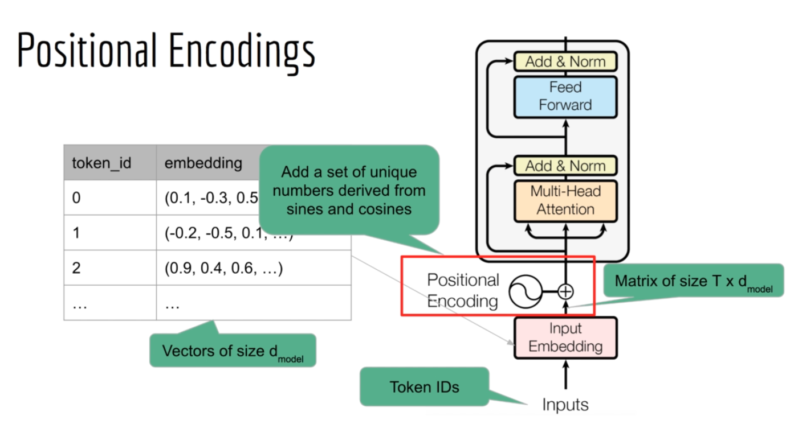

1. **Token ID**：这是序列中每个词的索引。在处理文本时，每个词首先被转换为一个唯一的数字ID。
2. **Embedding**：这个ID接着被映射到一个固定大小的向量，这个向量是通过训练学习来代表每个词的语义的。在这个例子中，向量的大小是 $d_{model}$
3. **Positional Encoding**：由于模型的自注意力机制并不直接考虑词的位置，所以为了保留序列中的词的顺序信息，我们需要向每个词的embedding添加位置信息。这是通过位置编码实现的，位置编码是一组数值，它们是根据每个位置的索引而唯一确定的。通常，这些数值是使用正弦和余弦函数的不同频率来生成的。
4. **添加位置编码**：每个词的位置编码向量和它的embedding向量相加，结果是同时包含了该词的语义和位置信息的向量。

通过这种方式，模型能够根据词的相对或绝对位置对序列进行建模，这对于很多任务（如语言翻译、文本生成等）至关重要。在加入了位置信息后，这些向量就会被送入Transformer模型的第一个block中，进行自注意力和后续的处理。


#### 5.5.1 固定位置编码

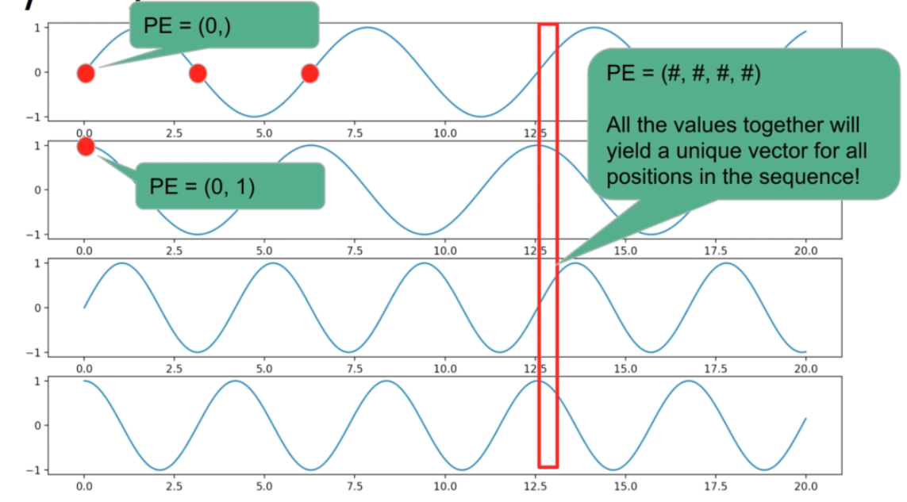

如果我们用同频率的sin和cos作为位置向量，那么他们将在一个周期后重复。

现在，我们思考，如果我们为每个位置设置一个不同的频率，这样这个向量永远都不会重复了。

位置编码通过对每个位置==使用不同频率的==正弦和余弦函数来赋予唯一的编码，确保模型能够区分不同位置的词语。

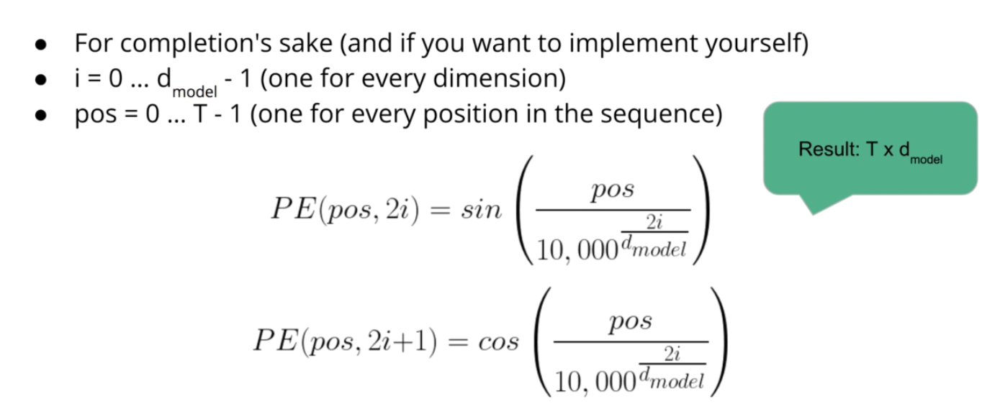

注意，我们需要编码的位置关系其实是一个有序的$T\times d_{model}$，也就是我们也需要编码出embedding vector的关系，这是十分重要的，如果识别不出embedding vector自身的vector中的顺序关系，那么对token的识别就变成了一个集合元素的识别而非一个vector的识别了。([0.1,0.2,0.3]和[0.3,0.2,0.1]两个不同的词会被识别为同一个)

因此，使用这种基于三角函数的编码

* **维度间的相位差异**：通过在偶数维度上使用正弦函数，而在奇数维度上使用余弦函数，这样做保证了每一维度的编码都有相位上的差异，这有助于模型区分不同维度的信息。

* **多尺度编码**：${10000}^{\frac{2i}{d_{model}}}$​ 这个因子使得每个维度的频率不同，它为模型提供了在多个尺度上感知位置信息的能力。较低的维度捕获了关于位置的更"粗糙"的信息，而较高的维度则提供更"精细"的信息。

* **相对位置信息**：pos作为分子，代表了相位的差异，在这种编码方式中，embedding vector的位置相同代表频率相同，因此同一个频率下，不同的pos代表了不同的相位。

  这种编码方式允许模型通过编码之间的和差来学习和推断单词间的相对位置。这是因为正弦和余弦函数具有固有的周期性和波形属性，可以通过比较波形的相位差异来推断位置关系。


同时，也有其劣势

1. **固定模式**：正弦和余弦函数是预先定义的，不是根据具体任务进行优化的。
2. **可能的位置混淆**：由于正弦和余弦函数的周期性，理论上不同位置可能具有相似的位置编码，尤其是在长序列中。


#### 5.5.2 可学习位置编码

事实上，可学习位置编码不一定更好。可学习位置编码在模型训练过程中学习到位置编码，以更好地适应特定的数据和任务。

可学习位置编码的主要优势是它们可以通过反向传播算法进行优化，使得模型能够发现并利用数据中的位置相关模式。这在特定任务中可能会带来性能上的提升。然而，可学习位置编码可能也会使得模型过度适应训练数据中的位置信息，这可能会影响其泛化能力。

事实上，作者也尝试了科学系位置编码，并没有获得更好的性能提升。


可学习位置编码直接使用一个


让我们假设我们有一个非常简单的自然语言处理任务，其中我们要处理的句子包含三个词。在这个例子中，我们将只考虑位置编码的影响，而不是词嵌入的影响。

1. **初始化位置编码**: 假设我们的模型已经经过训练，我们有以下的位置编码，每个位置编码是2维的向量（实际应用中通常维数会更高，这里为了简化使用2维）。

   ```less
   位置1的编码: [1.0, 0.0]
   位置2的编码: [0.5, 0.5]
   位置3的编码: [0.0, 1.0]
   ```

2. **训练模型**: 在模型的训练过程中，我们不需要对位置编码执行任何特殊操作。它们是在模型学习过程中自动调整的参数。以下是经过简化的例子：

   - 假设句子为 "I like NLP"，且我们已经将每个词映射到了一个Token ID，并且有对应的词嵌入向量：

     ```less
     "I" 的 Token ID: 1
     "like" 的 Token ID: 2
     "NLP" 的 Token ID: 3
     
     "I" 的词嵌入: [0.9, 0.1]
     "like" 的词嵌入: [0.8, 0.2]
     "NLP" 的词嵌入: [0.3, 0.7]
     ```

   - 在不考虑位置编码的情况下，模型可能无法区分 "I like NLP" 和 "NLP like I"。

3. **应用位置编码**: 我们将每个词的位置编码加到它的词嵌入上：

   ```less
   "I" 的最终嵌入: [0.9 + 1.0, 0.1 + 0.0] = [1.9, 0.1]
   "like" 的最终嵌入: [0.8 + 0.5, 0.2 + 0.5] = [1.3, 0.7]
   "NLP" 的最终嵌入: [0.3 + 0.0, 0.7 + 1.0] = [0.3, 1.7]
   ```

   这样，每个词不仅仅由其原始的语义嵌入表示，还包含了位置信息。模型现在可以区分 "I" 是句子的第一个词，"like" 是第二个，而 "NLP" 是第三个。

4. **前向传播**: 现在，使用这些包含了位置信息的嵌入向量作为输入，进行模型的前向传播，并执行任务（比如序列标注、翻译等）。

5. **反向传播**: 假设我们有真实的标签或目标输出，我们可以通过计算预测输出和实际输出之间的差异来获取损失，并通过反向传播来更新模型的参数，包括位置编码。

> ### 训练阶段
>
> 在**训练阶段**，可学习的位置编码确实是通过反向传播进行训练的。这意味着它们是模型参数的一部分，就像其他权重和偏置一样，通过训练数据和损失函数来进行优化。当我们说位置编码是“一开始就训练好的”，我们是指在模型的训练过程完成后，这些位置编码已经被优化并固定下来了，用于后续的模型使用（推理阶段）。
>
> - **反向传播**的作用在这里是调整位置编码的值，使得模型能够更好地理解和利用序列中元素的位置信息，从而提高任务的性能，如更准确的语言翻译、文本生成等。
> - 在训练过程中，模型学习到的位置编码反映了序列中不同位置的重要性和相对关系，这是通过大量的训练样本和迭代学习实现的。
> - ==在训练阶段，通常position embedding的长度被设置为最大值，如果碰到了一个较为短的输入序列，它照常将位置编码加上去，因为余下的部分会被padding，padding在selfattention获得了很小的权重，因此不会影响超出序列长度的position embedding==
>
> ### 推理阶段
>
> 在**推理阶段**，位置编码不再通过反向传播进行训练，因为模型不再进行参数的更新。这时候，位置编码作为训练过程中学习到的结果被直接应用到新的输入序列上。模型使用这些固定的位置编码来理解和处理不同长度的输入序列。
>
> - **无需反向传播**：在模型部署和实际应用中，位置编码作为模型的一部分被用来处理输入数据，但不会根据新数据进行更新。


## 6. Seq2Seq: Encoder-Decoder

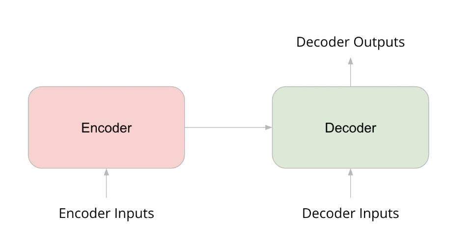


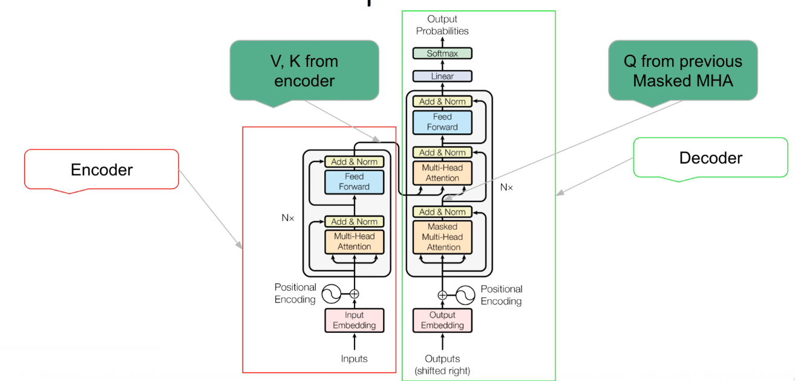

上图中，我们可以发现Decoder相比Encoder做出了一些变化，首先它的第一个Multihead-Attention是Masked，这十分容易理解，因为要保证Decoder 的input在训练时符合时序性。第一个MHA在解码器内部进行自注意力计算，帮助解码器了解到目前为止生成的翻译文本内部的词汇关系。

第二个Multihead-Attention， 它的主要目的是将解码器的输出（到目前为止给出的翻译文本）与编码器的输出（Encoder对输入文本的特征提取）整合在一起。

第二个MHA关注的是如何将编码器提供的源文本信息与解码器到目前为止的输出结合起来。它通过以下步骤实现：

- **Query** 来自于解码器前一个多头自注意力层的输出。

- **Key 和 Value** 来自于编码器的输出。这样做的目的是使解码器能够对编码器输出的每个位置进行加权，这些权重基于解码器的当前输出和编码器的输出之间的关系。

- **注意力权重计算**：模型计算Query与Key的兼容性，生成注意力权重（通过缩放点积注意力机制），然后使用这些权权重对Value进行加权求和。这一步骤确保了解码器能够关注源文本中与当前生成文本最相关的部分。

  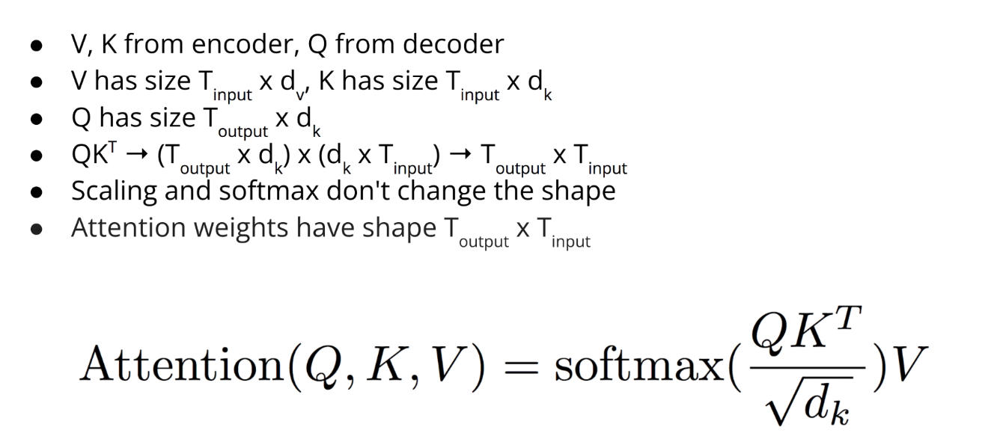

  这一个层告诉我们每个output token应该对Input token关注多少


> 总结：
>
> 这段文字是对Transformer模型整体结构的深入讨论，特别是对如何将编码器（Encoder）和解码器（Decoder）组合成一个完整的序列到序列（Sequence-to-Sequence）模型。这里提到了一些关键点和概念：
>
> 1. **Transformer的结构**：Transformer模型由一个编码器和一个解码器组成。编码器处理输入序列，解码器生成输出序列。
> 2. **编码器和解码器块的不同**：解码器包含了一个额外的多头注意力层（MHA），这个层用于引入编码器的输出。解码器的第一个MHA是一个带掩码的自注意力层，保证解码器仅基于之前（左侧）的输出生成下一个词。
> 3. **编码器输出与解码器输入的结合**：解码器的第二个多头注意力层使用来自编码器的K（Key）和V（Value），而Q（Query）来自于解码器之前的注意力层的输出。这使得解码器可以在生成新词时考虑整个输入序列。
> 4. **序列长度不一致问题**：输入和输出序列的长度通常不同。Transformer通过注意力机制处理不同长度的序列，其中每个输出单元可以与输入序列中的所有单元交互。
> 5. **推理与预测**：在推理（或预测）阶段，解码器会一步一步地生成输出，每次生成一个单词，并将之前预测的单词作为下一步的输入。这与训练时不同，训练时解码器的输入是真实目标序列的偏移版本。
> 6. **教师强制（Teacher Forcing）**：在训练过程中，解码器的输入是目标序列的“教师强制”版本，也就是说，解码器在每个时间步接收到的是前一个单词的真实值。然而，在推理时，模型需要自回归地预测，这意味着基于其自身之前的预测来生成下一个单词。


## 7. Encoder(Bert)

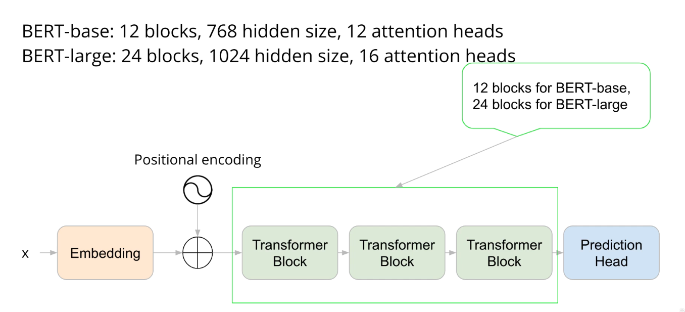

### 预训练任务

- 掩码语言模型（Masked Language Model, MLM）

  ：文档中每个token有15%的概率被选中用于预测。如果token被选中：

  - 80%的概率被替换为[MASK]标记。
  - 10%的概率被替换为语料库中的随机词。
  - 10%的概率保持不变。

- **下一句预测（Next Sentence Prediction, NSP）**：使用平衡数据集进行训练，其中正负样本比例为50:50。

> BERT模型中的Masked Language Model (MLM) 训练方法是受到了词嵌入模型如word2vec中的skip-gram模型的启发。在skip-gram模型中，目标是通过上下文预测中心词；而在BERT的MLM中，这一思想被反转了过来，模型的目标是通过其他词来预测被遮蔽的词。这种方法允许模型捕捉到双向上下文信息，这是传统的左到右或右到左语言模型所做不到的。
>
> MLM的设计解决了一个问题：如何在Transformer架构（它通常需要序列的开始和结束来进行训练）中训练一个深度双向模型。通过随机遮蔽一些词，然后要求模型预测这些遮蔽词，BERT能够有效地学习双向上下文表示。
>
> 对于Next Sentence Prediction (NSP) 的训练方法，这是BERT的另一个预训练任务，设计目的是理解两个文本片段之间的关系。具体来说，给定一对句子A和B，模型需要预测B是否是A的下文。在训练数据中，50%的情况B是A的实际下文，而另外50%的情况下，B是从语料库中随机抽取的，与A无关的句子。
>
> NSP任务的设计灵感来源于许多自然语言理解任务中对理解文本间关系的需求，比如问答系统和自然语言推理。NSP任务让BERT学会了捕捉长距离的语言依赖关系，这对于它在后续的下游任务中表现出的强大性能至关重要。
>
> 综合MLM和NSP两种方法，BERT模型在预训练阶段能够学习到丰富的语言表示，这为后续的微调阶段打下了坚实基础。在微调阶段，预训练得到的语言表示被应用到具体的下游任务中，如情感分析、问答和语言推断等。


### 数据集

- **BooksCorpus**：包含800百万单词。
- **英语维基百科**：包含25亿单词。

### 实验结果

- 去除下一句预测预训练任务后，模型性能下降。
- 去除BERT的双向特性后，模型性能同样下降。
- 添加双向LCM（Left-to-Right Context Model）后，性能进一步下降，说明即使是通过LCM引入的双向性也无法弥补Transformer中双向性的缺失。


## 8. Decoder(GPT)

### 8.1 GPT1

- GPT模型是一个以解码器为基础的模型系列，这一点从"GPT"（Generative Pre-trained Transformer）的缩写就能看出来。
- GPT模型通过无监督任务进行预训练，任务非常简单——预测给定文档中前面token后的下一个token。
- GPT模型无需标注数据集，可以使用互联网上广泛存在的未标注文本。

GPT-1在BERT发布前问世，BERT强调了其双向特性，而GPT只能从左到右阅读文档。

GPT-2和GPT-3更加强大，尽管它们仍然从左到右阅读文档，并使用相同简单的预训练任务。

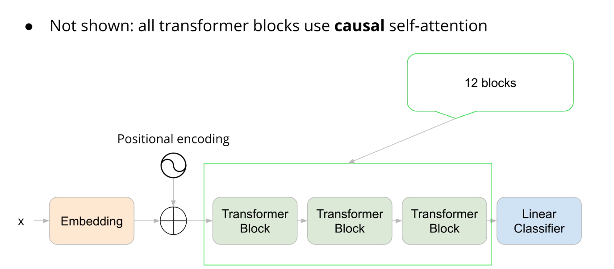

- 原始的GPT模型架构类似于我们之前描述的解码器。输入是一系列的token ID，转换为嵌入向量并添加位置编码。
- 这些嵌入向量经过多个Transformer块，这些块使用因果自注意力，使得每个token只能关注之前的token。
- GPT原始模型使用了12个Transformer块。
- 最终，模型包含一个预测头部，用作分类器来建模下一个token的概率。
  - 线性分类器的主要作用是将Transformer解码器的输出（一个向量）映射到一个概率分布上，这个概率分布代表了下一个token的可能性。
  - 线性分类器由权重矩阵和偏差向量组成。这些权重和偏差是在训练过程中学习得到的。
  - 权重矩阵的大小为D*×*V*，其中D*是隐藏层的维度，*V*是词汇表的大小。
  - GPT在其词嵌入层和线性分类器之间共享参数。这意味着，用于词嵌入的权重矩阵在分类器中被重新用作输出权重矩阵。
  - 为了将线性分类器的输出转换为概率分布，通常在权重和偏差应用于隐藏状态之后会使用Softmax函数。

==Fine tuning task==

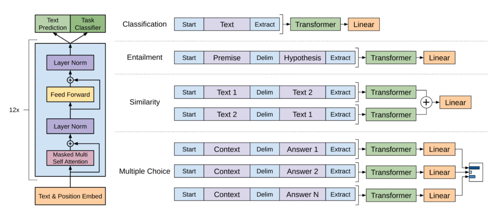

这张图展示了如何利用Transformer模型架构来处理不同的自然语言处理任务。图中的左侧是一个标准的Transformer模型，通常包含12个相同的层，每层都有自注意力机制、层归一化和前向传播网络。模型接收带有位置信息的文本嵌入作为输入。

在右侧，展示了几种不同的任务配置：

1. **分类**：输入包含起始标记和文本，模型在Transformer之后使用线性层直接进行分类。
2. **蕴涵**：给定一个前提和一个假设，任务是确定这两者之间的逻辑关系。输入在前提和假设之间插入了一个分隔符。
3. **相似性**：输入为两段文本，分隔符置于它们之间。这可能用于语义相似性任务，模型会评估两段文本的关联程度。这里使用了两个Transformer，是为了确保模型不会根据Text1和Text2先后顺序做出错误的判断。
4. **多项选择**：为多个选项的情境下设计，比如阅读理解任务。上下文和每个可能的答案之间有分隔符，并且每个可能的答案都会经过Transformer模型和线性层，最后的选择可能会使用额外的逻辑（比如softmax）从多个输出中选择最佳答案。

每个任务类型的特定输出都会经过Transformer处理并最终通过一个或多个线性层来生成预测。在某些情况下，不同的Transformer输出可能会组合在一起（如相似性任务）来提供最终预测。


GPT在微调阶段同时执行两种任务：一是特定的下游任务，二是语言模型的训练。这种方法被称为辅助语言模型。Auxiliary language model

模型具有两个头部，一个用于语言模型，另一个用于执行特定的任务。

最终的损失函数是特定任务的损失与语言模型的损失的加权和，其中语言模型的损失乘以一个小常数以平衡两个损失。

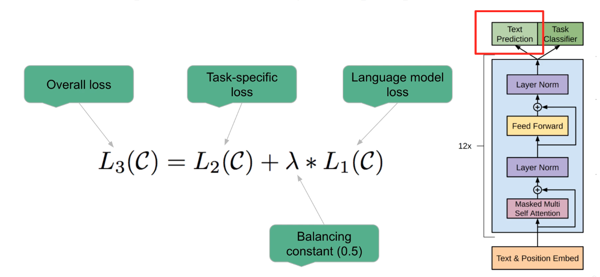

实验结果表明，这种辅助语言模型的方法有时能够提升性能，而其他时候，没有辅助语言模型的Transformer表现更佳。

所有实验中都观察到没有预训练的Transformer性能不如预训练后的模型，这强调了预训练在提升Transformer性能中的重要性。

GPT模型在微调阶段通过辅助语言模型来同时处理语言模型的训练和特定下游任务。这种方法可以提升某些任务的性能，但不是在所有情况下都有效。与未经预训练的Transformer相比，预训练的模型在性能上有明显的优势。此外，GPT-1作为序列到序列模型的先驱，虽然在模型大小上较为适中，但在多种任务上表现出色，证明了其在自然语言处理领域的应用价值。


### 8.2 GPT2

#### GPT-2模型概览

- GPT-2继承了GPT-1的基本结构，但在数据和参数上做了扩展。
- GPT-2的发布引起了广泛关注，因为它在没有针对特定任务进行微调的情况下，就能够生成连贯的长文本。
- GPT-2实现了在没有预训练的Transformer表现较差的任务上取得了良好的表现，尤其是在没有辅助语言模型的情况下。

#### GPT-2的结构和数据集

- GPT-2比GPT-1有更多的参数，GPT-1有1.1亿参数，而GPT-2有15亿参数。
- GPT-2的上下文大小（序列长度）从512增加到1024个token。
- GPT-2的数据集是基于Reddit帖子链接（获得3个或更多的赞）创建的WebText数据集，包括8百万个文档，总计40GB的数据。

#### 无需微调的性能

- GPT-2证明了它能够处理如机器翻译和文本摘要等任务，尽管它并未在这些特定任务上进行过训练。
- 它虽然没有达到最先进的性能，但令人惊讶的是它甚至能够执行这些任务。

#### 输入格式化（Prompt Engineering）

- GPT-2的性能部分归功于输入格式化的艺术，有时也被称为prompt engineering。
- 通过精心设计的输入提示（prompt），GPT-2能够完成如文本摘要和语言翻译等特定任务。
- 例如，在进行文本摘要时，可以在要摘要的文本后面添加“TLDR:”提示模型生成摘要。

#### 参数规模和实验验证

- 研究人员通过创建不同大小的模型并比较它们的性能，发现参数越多的模型通常性能越好。
- 这一发现强调了在机器学习中，尤其是在模型设计上，实验和经验通常比理论更有指导意义。

#### GPT-2的关键点总结

- GPT-2保留了作为因果语言模型的特性，并扩展了上下文长度和参数规模。
- 它使用了大量的数据进行预训练，并具有比GPT-1多十倍以上的参数量。
- 重要的是，GPT-2显示出了不需要针对特定任务微调，就能通过正确格式化的输入提示执行特定任务的能力。


### 8.3 GPT3

#### GPT-3模型概览

- GPT-3在GPT-2的基础上进一步扩大，拥有1750亿参数，比GPT-2大超过100倍。
- 上下文大小从GPT-2的1024增加到2048。

#### GPT-3的数据和训练

- GPT-3采用了Common Crawl数据集，并进行过滤以提高数据质量。
- 还使用了扩展版本的WebText（WebText2）、两个图书数据集和英文维基百科。
- 尽管GPT-3的模型规模巨大，但作者使用分布式训练在多个GPU上缩短了训练时间。
- GPT-3同样采用无监督训练，学习预测给定前面tokens的下一个token，无需针对特定任务的微调。

#### GPT-3学习任务的能力

- GPT-3能够间接学习执行多种不同任务，因为这些任务在数据集中出现过。

- 作者认为，模型通过在上下文中观察到的任务（如算术、拼写错误修正和翻译）的例子进行了内部循环学习（in-context learning），这解释了GPT-3如何在没有任何特定任务数据集或微调的情况下执行任务。

  

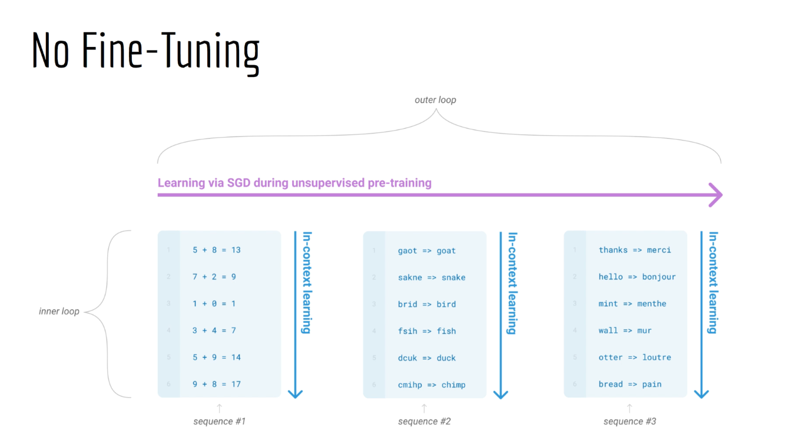


#### 转移学习策略

- 与GPT-2主要使用的零样本转移（zero-shot transfer）不同，GPT-3测试了零样本、一样本（one-shot）和少样本（few-shot）转移学习。
- 这些策略指的是在提示（prompt）中提供的例子数量，而不是训练样本。

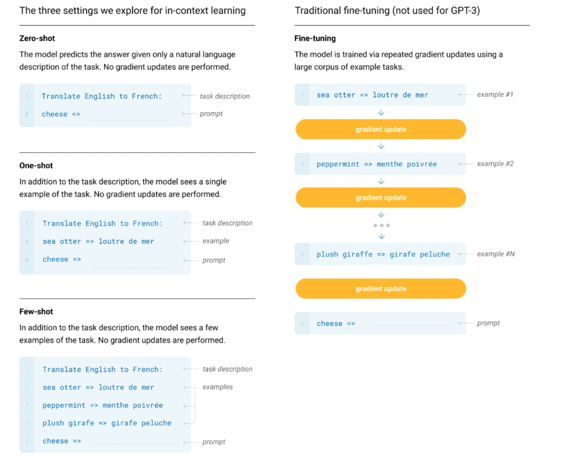

#### 示例和性能

- 对于零样本学习，GPT-3可能会接收到任务的描述，比如“将英语翻译为法语”后接上一行英文句子。
- 在一样本学习中，会在提示中提供一个相关任务的例子。
- 对于少样本学习，会在提示中提供更多的例子。

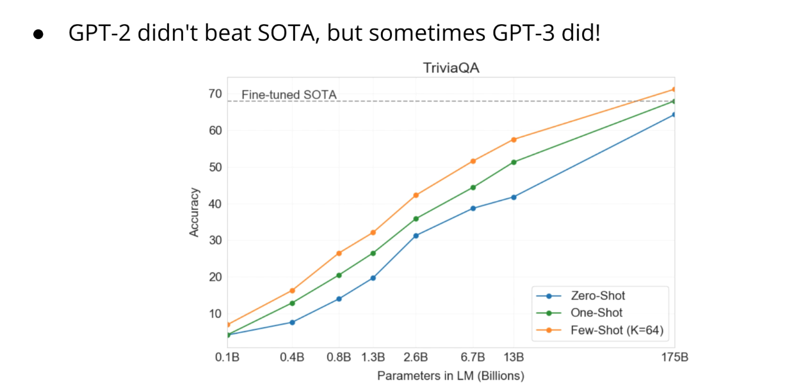

#### GPT-3的惊人表现

- GPT-3的性能出乎意料地好，尤其是在“trivia quiz”（问答任务）上，即便是零样本学习，其表现也十分出色。
- 在参数数量最大的GPT-3模型上，少样本学习的表现甚至超过了为该任务特别训练的最先进模型。

#### GPT-3的关键点总结

- GPT-3继承了GPT系列作为因果语言模型的特性，使用更大量的数据进行预训练，具有更多的参数。
- 相较于GPT-1的512个token序列长度，GPT-3使用了2048个token的更大序列长度。
- 最重要的是，GPT-3在没有特定任务微调的情况下，展示了通过正确格式化的提示执行特定任务的能力，这表明了其预训练过程中所获得的语言模型是多么强大。

GPT-3的这些特点和能力标志着在NLP领域的重要进展，它能够处理许多复杂的任务，这些任务通常需要大量的数据和专门的训练。通过有效的提示工程，GPT-3甚至能够无需任务特定训练即可执行特定的NLP任务，这展现了大规模语言模型在自然语言理解方面的潜力。


## 9. 其他话题

### 9.1 幻觉（Hallucinations）

- **定义**：在这里，幻觉指的是模型在没有充足证据支持的情况下，自信地生成错误或无意义的输出的现象。
- **影响**：这种现象可能导致用户对模型输出的可信度下降，尤其是在需要高精确度的应用场合，如医疗信息获取、法律咨询或者学术研究中，模型产生的误导性信息可能会有严重后果。
- **应对措施**：为了减少幻觉现象，可以采用多种策略，如增加数据集中的事实检查环节、调整训练算法以惩罚误导性预测、或者在模型输出前进行额外的人工审核。


### 9.2 对齐（Alignment）

- **定义**：模型对齐是指模型的行为与人类价值观和期望的一致性。对齐良好的模型应当理解和尊重用户的意图，遵守伦理标准和社会规范。
- **挑战**：随着模型规模的增大，它们变得越来越难以预测和控制。这些模型可能会在不合适的上下文中生成不准确或不合适的内容，或者在回答问题时过于自信地提供错误的信息。
- **方法**：研究者们正在开发不同的技术和方法来确保大型模型能够更好地与人类的意图和道德观念对齐，比如通过改进训练数据、调整模型架构和使用强化学习等技术。


### 9.3 RLHF

在大型语言模型（LLM）中，强化学习从人类反馈（RLHF）的应用主要目的是提升模型的性能和用户体验，尤其是在生成的文本质量、相关性和安全性方面。通过RLHF，可以更细致地调整模型的输出，使其更加符合人类用户的期望和标准。

### 技术要点

1. **人类反馈的收集**：RLHF的第一步是收集人类对模型输出的评价。这通常涉及到让人类评估者对模型生成的文本进行打分或选择偏好，评估标准可以是文本的质量、相关性、准确性等。
2. **奖励模型的设计**：根据收集到的人类反馈，设计一个奖励模型。这个模型的目的是量化模型输出的好坏，为接下来的训练过程提供明确的目标。奖励模型必须能够准确反映人类评估的结果。
3. **强化学习算法的应用**：利用设计好的奖励模型，通过强化学习算法对大型语言模型进行训练。在这个过程中，模型通过尝试不同的输出并接收奖励模型的反馈来学习如何生成更优质的文本。
4. **策略优化**：在RLHF中，重要的一步是优化决策策略，即模型如何基于当前的状态（如对话的上下文）来选择最佳的输出。策略优化旨在使模型生成的文本最大化预期奖励。
5. **安全和偏差控制**：由于人类反馈本身可能包含偏见或不准确性，RLHF在应用时还需注意控制生成内容的安全性和偏差。这可能需要额外的机制来确保反馈的质量和代表性，或是对模型的输出进行额外的过滤和调整。

RLHF在提升大型语言模型质量方面发挥着重要作用，它通过直接利用人类的偏好和评价来引导模型的学习，使模型能够生成更加人性化、高质量和符合期望的文本输出。然而，RLHF的实施需要高质量的人类反馈和精心设计的奖励系统，同时还要注意控制训练过程中可能出现的偏差和安全问题。


### 9.4 Other Advance Net

1. **迁移学习（Transfer Learning）**：这种技术允许模型将在一个任务上学到的知识应用到另一个相关任务上。这意味着模型不需要从头开始学习每项新任务，可以大大加快学习速度和效率。
2. **生成对抗网络（GANs，Generative Adversarial Networks）**：由两部分组成——生成器和鉴别器，通过相互竞争来改进性能。生成器生成尽可能接近真实的数据，而鉴别器的目标是区分真实数据和生成器产生的数据。这一技术在图像生成、视频生成等领域表现出色。
3. **自监督学习（Self-supervised Learning）**：这是一种无需或仅需要少量标注数据就能训练模型的方法。它通过学习数据本身的结构和模式来获取知识，广泛应用于语言模型训练、图像处理等领域。
4. **注意力机制（Attention Mechanisms）**：最初用于改进序列模型（如RNN和LSTM）的性能，现在已经成为许多高级模型（如Transformer）的核心组件。注意力机制能够使模型更加高效地处理长距离依赖问题。
5. **图神经网络（GNNs，Graph Neural Networks）**：这种类型的神经网络直接在图结构数据上工作，非常适合处理社交网络分析、分子结构模拟等任务，能够有效捕捉实体间的关系和互动。


