## 0. Attention

自注意力（Self-Attention）和传统注意力（通常称为编码器-解码器注意力或全局注意力）都是为了使模型能够从相关的数据中提取信息。它们的核心区别在于它们操作的数据范围和上下文。

### 自注意力（Self-Attention）：

- **内部序列关系**：自注意力关注于序列内部的关系，例如一个句子中的词如何关联其他词。这意味着查询（Q）、键（K）和值（V）都来自于同一个序列。
- **序列内上下文理解**：自注意力通过评估序列中每个元素（如单词）与序列中其他元素的关系，赋予每个元素一个上下文感知的表示。
- **例如**：在处理句子时，自注意力可以帮助模型理解"bank"一词在"river bank"和"financial bank"中的不同含义。

### 传统注意力（Encoder-Decoder Attention）：

- **跨序列信息提取**：传统注意力机制通常在序列到序列的任务中使用，其中查询来自于当前的目标序列（解码器端），而键和值来自于不同的序列（编码器端）。
- **编码器和解码器的桥梁**：在机器翻译任务中，编码器可能处理输入语言的句子，而解码器生成目标语言的翻译。注意力机制帮助解码器决定在生成下一个词时应该关注编码器输出的哪一部分。
- **例如**：当翻译"El banco está cerrado"时，解码器在生成"bank is closed"的翻译时会使用注意力权重来确定"banco"（可以指"bank"或"bench"）与"cerrado"（意为"closed"）之间的关系。

总结来说，自注意力关注单个序列内部的动态和关系，而传统注意力机制通常用于关联两个不同序列（如编码器和解码器处理的序列）之间的信息。两者都是为了提升模型处理和理解复杂数据结构的能力。在实践中，这两种注意力机制可以组合使用，如在Transformer模型中，编码器使用自注意力处理输入数据，解码器则使用自注意力和传统的编码器-解码器注意力来生成输出。

## 1. Self Attention

### 1.1 Self Attention in RNN

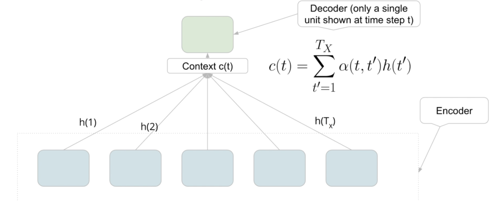自注意力，特别是在序列到序列（Seq2Seq）模型中，是一种让模型能够关注输入序列中不同部分的技术。我们尝试计算的关键元素是上下文向量（context vector)，它是解码器在每个时间步产生输出时的输入。

如上图所示，上下文向量$c(t)$ 是在每个解码时间步 $t$​对所有输入隐状态*h*(*t')* 的加权和。这个加权和不仅仅是一个简单的求和，而是根据每个时间步对输出的重要性分配了不同的权重。这些权重被称为注意力权重，用符号 *α*(*t*,*t*′) 表示。它们的作用是告诉模型在预测输出时应该“注意”输入序列中的哪些部分。
$$
c(t)=\sum^{T}_{t'=1} {\alpha(t,t')h(t')}
$$

在实践中，这意味着对于解码时间步 *t*，模型将查看所有的输入隐状态，并决定哪些隐状态对当前要生成的输出最为重要。不同于传统的硬选择（hard selection），自注意力使用软选择（soft selection），这允许模型在多个时间步中分配关注度，并且使得梯度可以在这些权重上自由地反向传播。

### 1.2 注意力权重，注意力分数，与最简单的注意力：fixed attention

对于权重，实际上我们需要权重和为1，幸运的是softmax能够帮助我们
$$
\alpha (t,t') = \frac{e^{score(t,t')}}{\sum^T_{\tau=1}e^{score(t,\tau)}}
$$
对于注意力分数，

抛去权重需要和为一的限制，我们可以使用点积来表示$\alpha(i,j)$

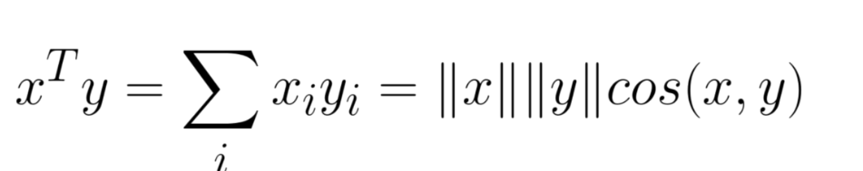

点积就像相似性的一个衡量标准，它可以看作x，y两个向量的相似度，由如上公式就可以看出，当两个向量完全相同时，这个值达到最大。

这里引申出了余弦相似度和皮尔逊相关系数的联系，，这样能更好的解释点积带来的相似度。

* 余弦相似度

  * 余弦相似度是通过测量两个向量的夹角的余弦值来确定它们之间的相似度。其值的范围从-1到1。当两个向量的方向完全一致时，余弦相似度为1；当两个向量完全相反时，余弦相似度为-1；如果两个向量正交，余弦相似度为0，表示它们之间没有相关性。

    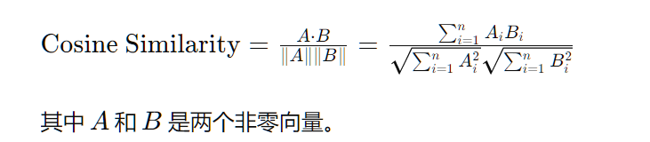

* 皮尔逊相关系数

  * 皮尔逊相关系数衡量的是两个变量之间的线性关系的强度和方向。其值的范围同样为-1到1。相关系数为1表示变量完全正相关，-1表示完全负相关，0表示没有线性相关。

    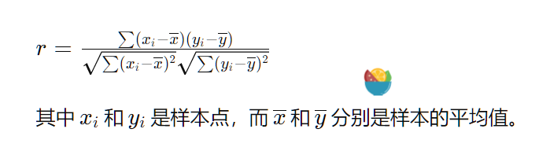

* 联系

  * 余弦相似度和皮尔逊相关系数在某种程度上是相似的，因为它们都是通过计算两组数据的每个对应元素的乘积来确定关系的。主要区别在于皮尔逊相关系数考虑了数据的平均值，因此它衡量的是两个变量的变化趋势是否相似，而余弦相似度仅仅考虑了方向而忽略了大小和尺度。

  * 在向量空间模型中，余弦相似度经常用于文本挖掘和信息检索中，因为它仅仅考虑了向量的方向而忽略了文档的长度。而皮尔逊相关系数经常用于统计分析中，尤其是在需要衡量两个连续变量之间线性关系强度的场合。

  * 当数据标准化处理后，也就是每个变量减去自己的均值后，皮尔逊

  * 相关系数实际上等同于标准化变量的余弦相似度。标准化处理意味着每个变量的均值被减去，因此它们都具有零均值，这时皮尔逊相关系数就变成了这些标准化分数的点积除以它们的范数，这和余弦相似度的计算方式一致。

    在这种情况下，皮尔逊相关系数可以被视为度量向量之间角度的一种方式，而余弦相似度度量的是向量在方向上的相似度。由于余弦相似度不考虑向量的幅度，当向量的长度不重要或已经在同一标准下时（例如，文本数据的词向量化），它是一个很有用的相似度度量。

  * 总结来说：

    - 余弦相似度和皮尔逊相关系数都可以用来度量两个向量之间的相似性。
    - 皮尔逊相关系数在度量相似性时会考虑数据的均值和变化范围，它关注两个变量的相对变化是否一致。
    - 余弦相似度只关注向量间的夹角，适用于长度不同或只关心方向一致性的情况。
    - 当数据中心化（减去均值）后，皮尔逊相关系数和余弦相似度在数学上等价。

因此，我们可以将score记为相似度，即点积，然后使用softmax将他们归整为权重。

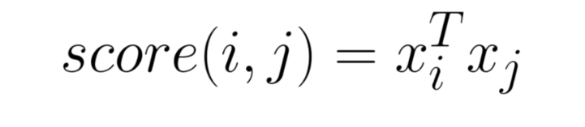

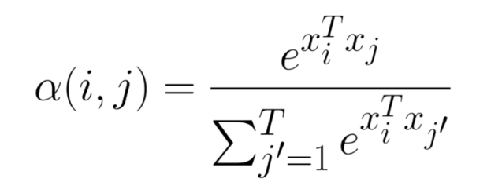

### 1.3 What is query,key,value

qkv如何计算？

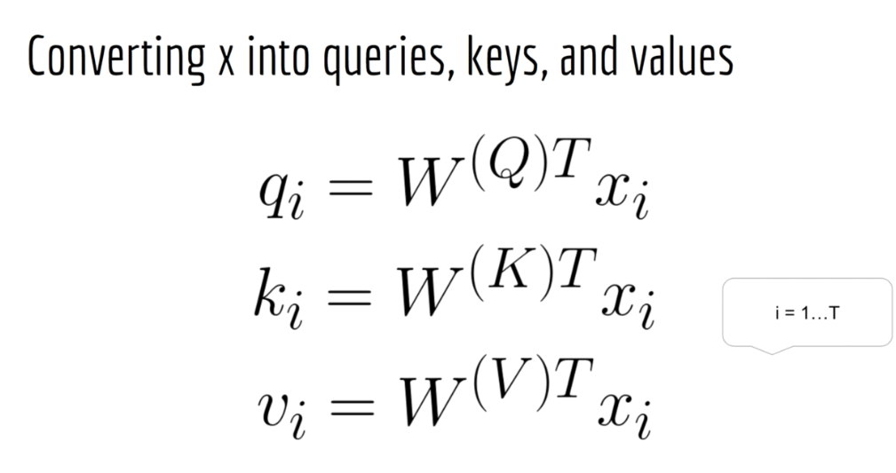

以"bob cashed a check at the bank"为例，如果query check，qkv做了什么？

key是所有的句子词，这里我们将虚词剔除

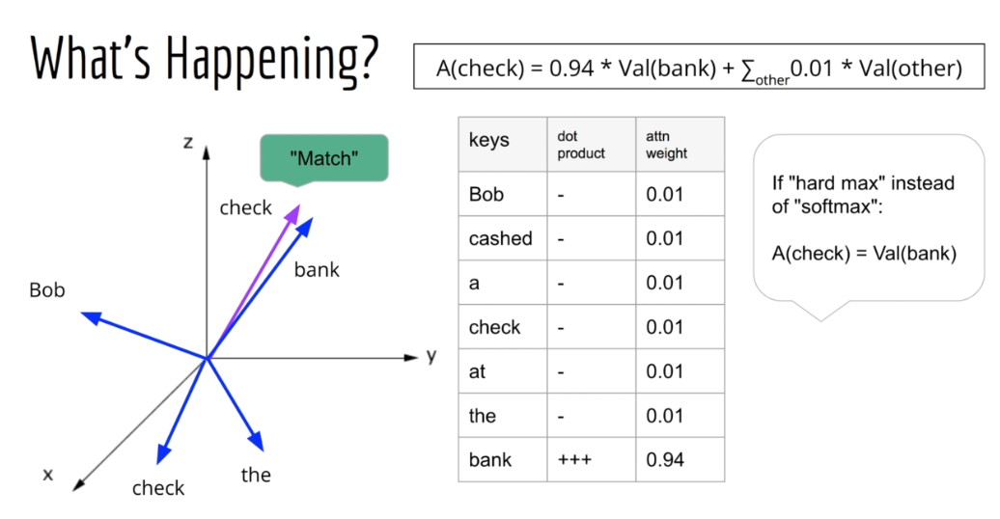

why we need self-attention? 

自注意力（Self-Attention），也称为内部注意力，是一种在序列模型中能够直接计算序列内不同位置之间的依赖关系的机制。

> 1. **长距离依赖问题**：传统的循环神经网络（RNN）和其变体（如LSTM和GRU）在理论上能够处理序列中的长期依赖关系，但在实践中它们经常因梯度消失或爆炸问题而失败。自注意力机制可以直接通过全序列的每对元素之间的权重来捕获远距离的依赖关系，从而有效地解决了长距离依赖问题。
> 2. **并行化计算**：与RNN这样的序列模型相比，自注意力结构没有固有的序列顺序，这意味着模型可以完全并行处理整个序列，显著加快了计算速度。这在大规模数据集上训练模型时尤其有价值。
> 3. **模型容量和表现力**：自注意力机制增加了模型的表现力，因为它可以通过自学习的注意力权重灵活地聚焦序列中的不同部分。这使得模型能够学习到更复杂的模式。
> 4. **更好的解释性**：注意力权重提供了模型决策的一种视觉解释，因为我们可以直观地看到模型在处理特定任务时实际上“关注”了序列中的哪些部分。
> 5. **更灵活的结构**：自注意力允许模型在任何组合的输入位置之间建立直接的关系，而无需考虑它们在序列中的位置。这种灵活性在处理具有复杂关系和结构的任务（如语言翻译、文本生成和理解）时尤其有用。
> 6. **扩展性和效率**：在处理非常长的序列时，RNNs变得效率低下，因为每个时间步都依赖于前一个时间步的计算结果。自注意力可以处理远远超过RNN能够有效处理的序列长度，这使得它适合于当前数据量大和模型大型化的趋势。

shape:

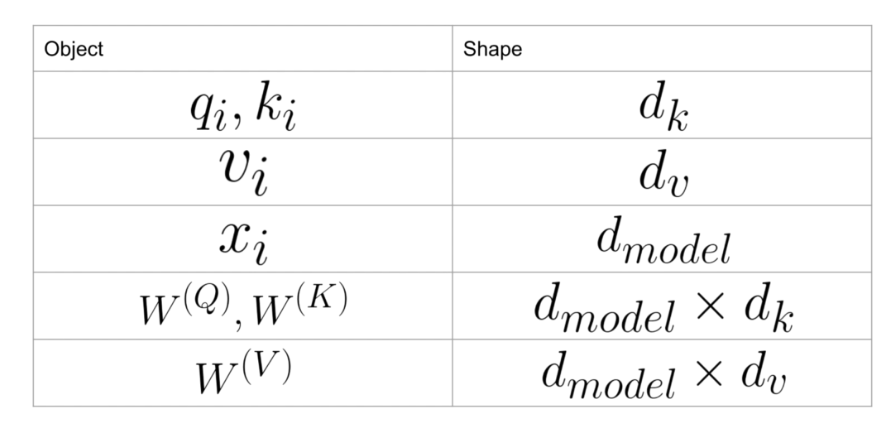

这意味着虽然输入向量特别大，但是他们会先被压缩成相对较小的维度向量qkv，这就是特征提取

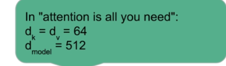

我们考虑所有的token在embedding过后都是一个512长度的向量

在我们使用

得到这个token的qkv向量时，我们知道这些向量的长度是64

然后我们会测试每个key和当前query之间的相似度，此时我们会得到一个标量值

一个query会和所有的key获得若干个标量值，因此这个query对某一个key的权重由softmax就是qk/sum

这个权重乘以v求和即为我们这个query的上下文感知embedding向量(context aware embedding vectors)，同时，这个vector的维度与v相同，也是64

>在计算注意力分数时，查询向量 *Q* 与键向量 *K* 的点积通常会除以 *d*，其中 *d* 是这些向量的维度。这样做的主要目的是为了控制点积的量级，使得训练过程更加稳定。
>
>当我们计算两个高维向量的点积时，结果的量级（即值的大小）可能会非常大。这会导致在应用softmax函数时，我们得到的概率分布非常极端，即几乎所有的概率质量都集中在一个元素上，而其他元素几乎没有概率质量。这种情况下，梯度可能会非常小，导致梯度消失问题，使得训练过程变得缓慢或不稳定。
>
>通过除以 *d*，我们可以降低这些分数的量级，使得softmax函数的输出更加平滑，有助于梯度流动，从而有助于训练过程。直观上，这也相当于使得向量的点积不因维度的增加而无限制增长，从而使得得分的大小不随着维度 *d* 的增加而变得过于敏感。
>
>我们也可以认为，这个操作缩小了输出的方差。
>
>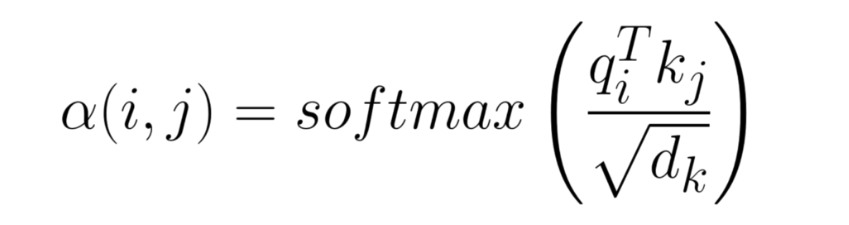

这样，我们就得到了==经典的scale dot-product attention==

==向量化==

当我们看到对元素逐个进行乘积然后求和的操作时，实际上我们可以通过矩阵乘法来实现同样的效果，这也意味着这样的操作可以被向量化。

向量化通常指的是将原本的迭代或循环计算转化为向量和矩阵操作

这意味着，我们可以将一个序列直接全体转换为QKV

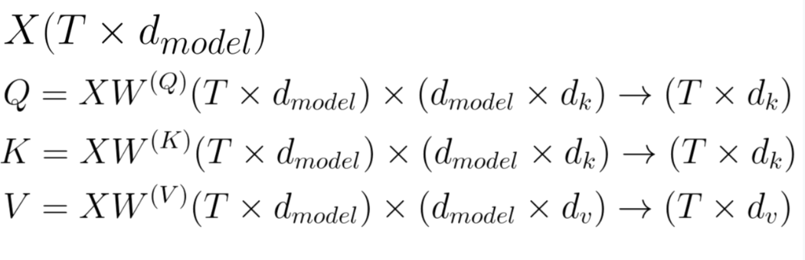

上图中X是T*dimension，其中T是总的时间步，dimension是embeddingvector的维度。

此时，对于
$$
\alpha(i,j) = softmax(\frac{q_i^Tk_j}{\sqrt{d_k}})
$$
对于分子，我们可以一口气计算出所有的权重

首先是$QK^T$,我们需要Q的每一行与k的每一行内积，因此T个q需要分别与T个k内积，一共得到T*T个值

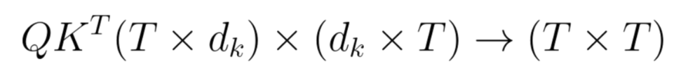

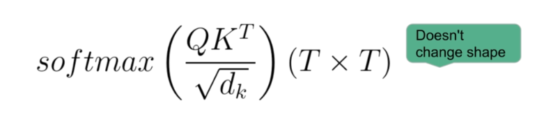

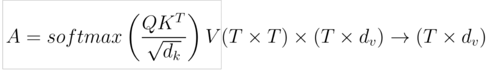

更进一步的，我们可以将整个Batch vectorize

也就是输入是$N*T*d$

需要明确的是，这里我们提到的scale-dot-product attention是可以对任何query起作用的，而self attention是单纯的指qkv都在同一个输入序列上计算,这意味着qk来自同一个sequence

### self-Attention Efficiency

考虑到自注意力中，对于同一个序列的每一个词，它都需要计算对其他词的关注度，因此如果序列长度为T，那么我们的参数量就是$T^2$

### Attention可以处理变长序列

因为Q,K,V的大小实际上是固定的，($dimension*d_k,dimension*d_q,dimension*d_v$​)

具体来说，我们训练的QKV矩阵分别是

$d_{model}\times d_k$

$d_{model}\times d_k$

$d_{model}\times d_k$​

同时，我们对于每个输入的sequence，以self-attention为例，实际上我们目的是计算每个token对于其他token的注意力权重，使用的是我们训练好的这么大的三个QKV矩阵。

这就引出了以下几点：

* 所有的token都是一视同仁的，因为他们都由一个向量来表征
* 训练过的sequence中，token之间的关系能够被QKV完美表达
* 没有训练过的sequence中，因为token是一个类似[0.1,0.2,0.5]这样的向量，因此仍然能够得到一个权重，不过这个权重极有可能与我们期望的相差甚远。

所以无论你使用多长的序列，例如$T\times d_{model}$，向量化后是$T\times d_k,T\times d_q, T\times d_v$​，这个东西它只是加快计算的一种手段，即使是使用for一个一个计算也是可以的，实际上最终我们的核心是大小不变的QKV矩阵，只要这个矩阵没变，无论多长的序列都可以被处理。

换句话说，训练QKV矩阵，通过QKV矩阵计算不同序列token之间的attention 权重。 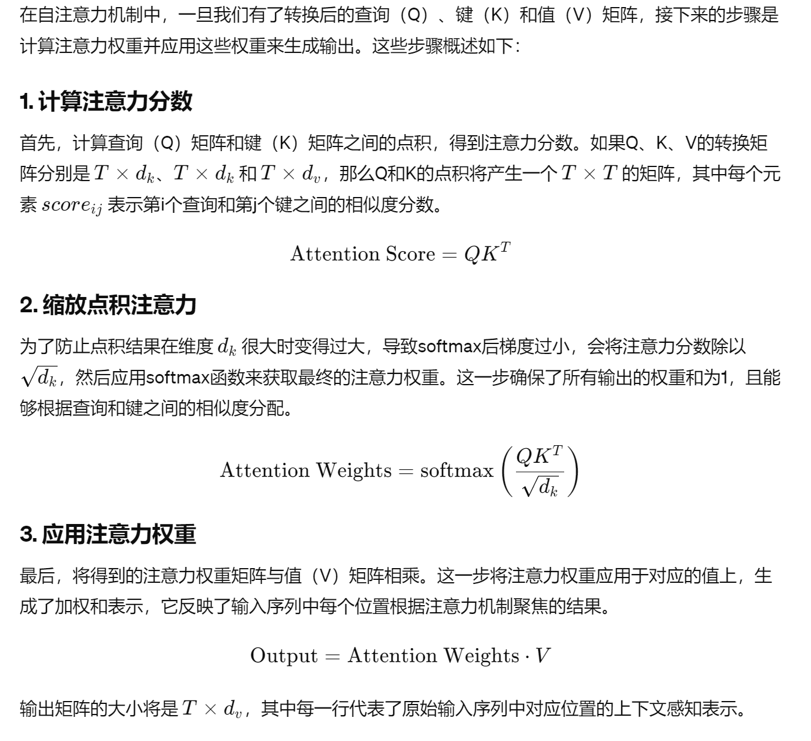

## 2. Scaled dot-product attention

## 3. Attention mask

为什么使用Attention mask？

* 当我们成Batch的输入sequence时($Batchsize\times SequenceLength\times Dimension$),考虑到每个Batch中的每个sequence长度并不一定相同

  >"This is a test"
  >
  >"This is a new test"
  >
  >"This is it"

  如上面一个batchsize为3的例子，每个sequence的长度并不相同。

  因此，如果我们想快速的计算，即使用向量化，那么你必须让每个sequence长度先相同，这意味着我们需要使用特殊的token来填充，但是我们不希望这些token被关注，因此我们需要mask这些token。

* 第二个理由是在训练Decoder的时候通常使用自回归生成，这意味对于Decoder的label输入，当前的预测实际上只能看到当前步之前的，这意味着我们需要将所有之后的全部mask掉。

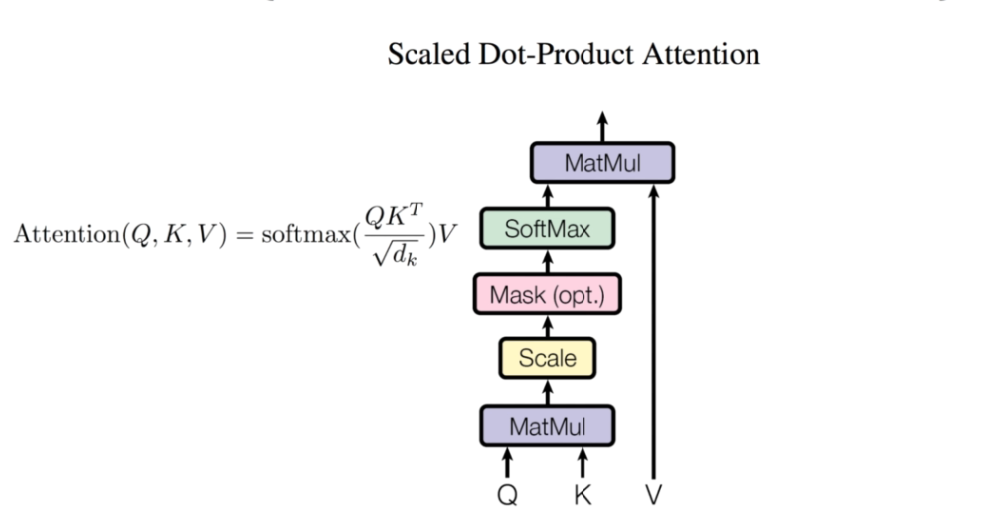

在这个scale dot product attention里面，首先进行QK矩阵乘，然后使用$\sqrt{d}$​变换尺度防止爆炸，接着是可选项mask，经过softmax之后再与Value相乘。

在实际中，被mask的值通常被设置为一个很小的负数，因此他们在softmax被$e^k$之后就会趋近于0，这样就消除了他们的影响。

## 4. Multi-head attention:

下面展示的是==使用self-dot scale attention作为build block构建Multi-head attention==

在之前的attention中，我们只训练了每个token的一个attention

举例来说

Bob cashed a check at the bank

我们可能只让bank关注了check，以辨明它是银行的bank而非堤坝的bank

这样我们实际上就忽略了这个句子中“谁需要去bank”这一层关系

因此，可以引入Multi-head attention来捕捉多个关系

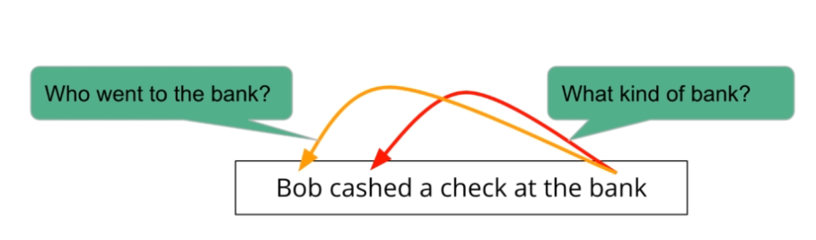

操作起来很简单，我们只需要将每个token本来的一次attention改为多次attention，如果操作了H次，我们就会认为是H-head Attention

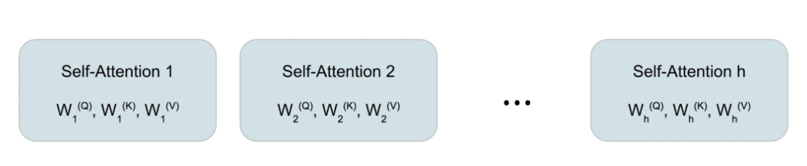

我们还需要一个方法来组合这多头的结果，以传递到后一层，简单的方法就是将这些参数组合起来然后用一个单层layer来决定输出即可

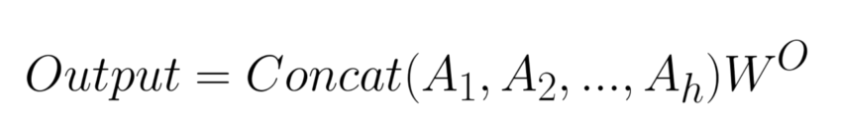

具体来说，我们以他们的特征维度将他们拼接

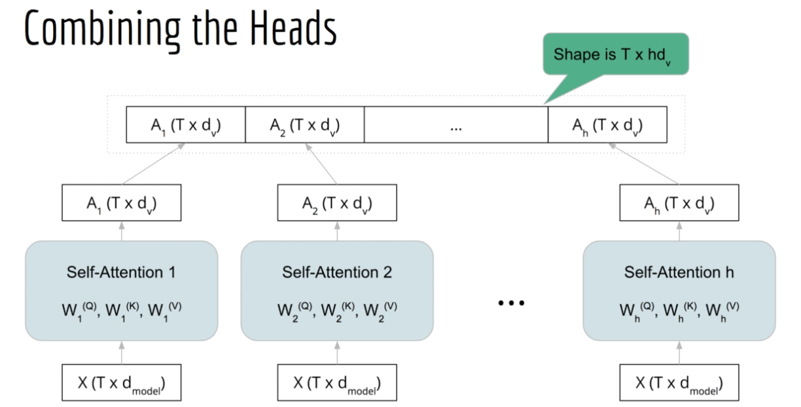

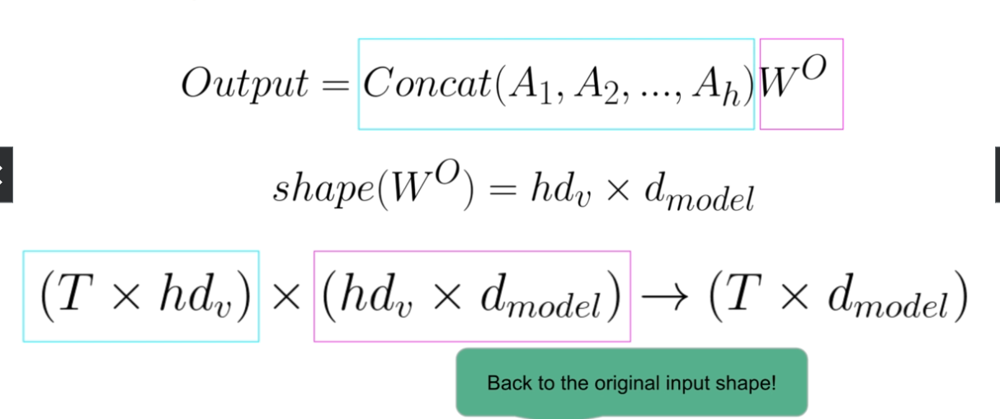

事实上，multi-head的每个head在concat之前都可以看作一个单独的attention从而并行计算，这大大提升了速度。

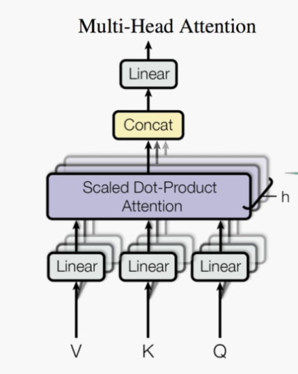

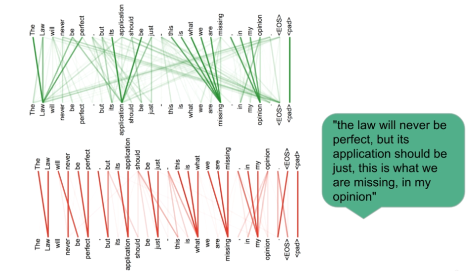

> 在给定的示例图中，我们看到了来自两个不同注意力头的权重，这些权重映射了句子中单词之间的关联。
>
> 图中下半部分显示了一个注意力头，它专注于相邻单词之间的关系。例如，“perfect”可能仅与其前面的“never”和后面的“but”有强烈的联系，这表明某些注意力头可能专注于捕捉局部语境，或者句子的即时语法结构。
>
> 相反，图中上半部分显示的另一个注意力头则呈现出更分散的注意力模式。在这种情况下，单词“application”和“just”受到更广泛上下文的关注，如“law”、“perfect”和“opinion”。这种分散的注意力可能反映了模型在理解句子整体含义和长距离依赖方面的能力。
>
> 论文的作者推测，这些注意力权重似乎在学习句子的结构特征。在深入的自然语言理解任务中，不同的注意力头可能会学习捕捉不同的语言特征，如句法结构、词义关联和指代关系。
>
> 综上所述，自注意力的可视化强调了以下几点：
>
> 1. **学习多种特征**：不同的注意力头可以专注于句子的不同方面，一些可能关注局部语法，而另一些可能捕捉更广泛的语义关系。
> 2. **理解句子结构**：通过这种方式，模型学会了如何理解和分析句子的结构，这对于执行复杂的语言理解任务至关重要。
> 3. **深度和广度的平衡**：通过结合关注近邻和远程上下文的注意力头，模型在理解句子时保持了深度和广度的平衡。
> 4. **语言的动态处理**：这种动态关注的过程允许模型根据句子的实际内容和结构调整其关注点，这是实现有效自然语言理解的关键因素。

## 5. Transformer Block

### 5.1 ANN-引入非线性

* 一个Transformer其实就是若干个TransformerBlock叠起来得到的
* 多头注意力其实也是TransformerBlock的一个组成部分

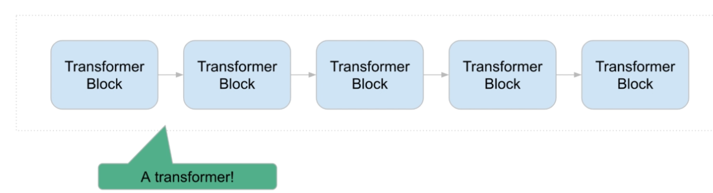

首先，一个Transformer Block不可能只有Multi-Head attention，这是因为Multi-head attention全是线性变换，然而我们知道非线性是现代神经网络中十分重要的一环，因此首先一个想法就是在Multi-head attention的后面接上一个ANN引入非线性，这个ANN通常是由inputlayer+ActivateLayer+OutputLayer构成的

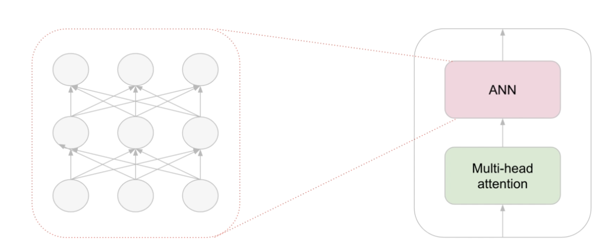

传统会使用RELU，BERT使用的是GELU

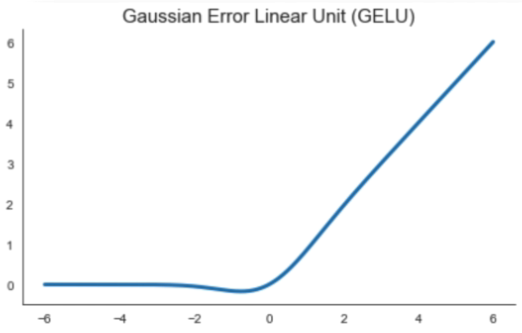

### 5.2 Layer Normalization

> 正规化（Normalization）是深度学习中一项关键的技术，它通过对数据或网络层的输出进行标准化处理，保证了模型训练过程中的数值稳定性。在没有正规化的情况下，如果数据的范围（尺度）太大或太小，或者数据的分布具有很高的方差，那么模型在训练过程中容易遇到梯度消失或爆炸的问题，这会导致学习过程缓慢或者不收敛。
>
> > ### 梯度消失问题：
> >
> > 当数据通过深层神经网络时，如果每层的权重小于1，激活函数的输出值也可能逐渐减小。这样一来，到达网络较浅层的梯度可能会因连续乘以这些小于1的数而越来越小。如果梯度变得非常小，它可能会变得几乎没有影响，这就是所谓的梯度消失问题。当这种情况发生时，网络中较早的层学习得非常慢，因为几乎没有梯度可以促使权重调整。
> >
> > ### 梯度爆炸问题：
> >
> > 相反，如果权重大于1，或者激活函数的输出值过大，那么通过层传播时，梯度可能会迅速增加。这可能导致权重更新过大，网络可能无法收敛，甚至产生数值溢出，这就是梯度爆炸问题。
> >
> > ### 正规化如何帮助：
> >
> > 正规化技术通过约束数据的范围和网络层权重的大小来帮助缓解这些问题：
> >
> > 1. **批正规化（Batch Normalization）**：它通过对每个小批量数据的激活值进行正规化，保证了网络的每层都有均值为0和标准差为1的激活输出。这样做可以防止在前向传播和反向传播中值变得过大或过小。
> > 2. **权重初始化（Weight Initialization）**：适当的权重初始化，如He或Xavier初始化，可以确保网络开始时不会有过大或过小的权重，这有助于避免梯度问题的出现。
> > 3. **梯度裁剪（Gradient Clipping）**：在反向传播过程中，通过限制梯度的最大值来防止梯度爆炸
>
> 正规化通常涉及以下几个关键步骤和概念：
>
> 1. **标准化数据**：通过减去均值并除以标准差来转换数据，以便数据的分布具有零均值和单位方差。在图像处理中，这通常意味着确保像素值在0到1之间，或者是具有零均值和单位方差的正态分布。
> 2. **批正规化（Batch Normalization）**：这是一种特定的正规化技术，它对每个小批量（mini-batch）的数据进行正规化处理，以稳定学习过程。批正规化在每一层后应用，并独立地正规化每个特征通道。
> 3. **层正规化（Layer Normalization）**：与批正规化类似，层正规化在网络的每一层上应用，但是它是沿特征维度进行正规化，而不是批量维度。这对于递归神经网络（RNN）特别有用，因为RNN常常处理不同长度的序列数据。
> 4. **权重正规化（Weight Normalization）**：这是通过限制权重大小来改善优化过程的技术，通常通过将权重向量的大小约束在某个范围内实现。
> 5. **梯度裁剪（Gradient Clipping）**：在优化过程中，通过设置阈值来限制梯度值，防止在反向传播过程中出现梯度爆炸。
>
> 正规化通过以上步骤提高了模型的训练效率和泛化能力，降低了过拟合的风险，并有助于更稳定和快速地收敛到最优解。尤其是在训练深度网络和复杂模型时，正规化已成为标准做法。通过在整个模型训练过程中应用正规化技术，我们可以确保模型能在各种数据上都表现出色，提升其鲁棒性和可靠性。

不同于Batch norm 对samples执行normalization，LayerNorm主要针对Features执行Normalization。

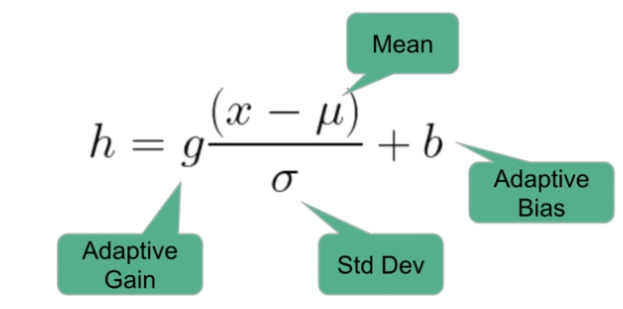

它首先减去平均值并除以标准差，然后应用增益和自适应偏差这两个可执行参数。

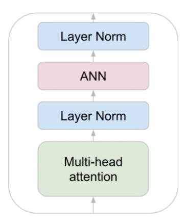

### 5.3 Residual connection 残差连接

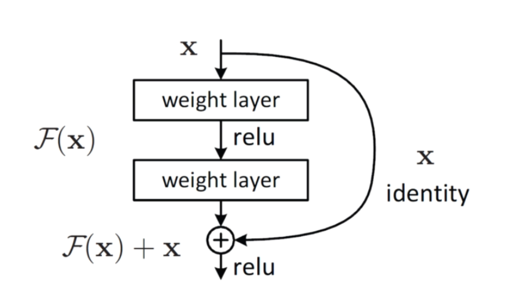

残差网络最早来自CNN的resnet，它为什么会这么有用呢？

* 梯度消失的问题

  * 没有残差连接：
    * 假设我们有一个深度神经网络，由多个连续的层组成，每一层的输出作为下一层的输入。在这种情况下，当我们执行反向传播算法来计算梯度和更新权重时，梯度必须通过所有层回传。
    * 如果网络非常深，那么梯度在回传的过程中会越来越小，最终可能接近于0。这会导致网络中较早层的权重更新非常缓慢，从而难以训练深层网络。
  * 有残差链接的情况：
    * 在残差网络中，由于存在 *F*(*x*)+*x* 的形式，即使 F*(*x) 的梯度很小，==直接路径上的梯度 1 保证了总梯度不会太小==。这样，即使在深层网络中，梯度也能有效地回传到较早的层，从而避免了梯度消失问题。

* 减小层的训练难度

  * 首先，我们要知道，以上图为例，如果我们认为$H(x) = F(x)+x$，其中$H(x)$是我们想要拟合的目标函数，那么实际上我们训练的就是$F(x) = H(x)-x$
  * 在没有残差连接时，考虑这么一种情况，就是$H(x)$与$x$很相近，例如$H(x) = x + g(x)$，那么我们就要求$F(x)$直接学习这个复杂的函数，它不仅需要学习$g(x)$，同时也需要学习输入$x$中很多复杂的细节。
  * 在拥有残差连接时，$F(x)$仅需要学习$g(x)$的特征，也就是只需要学习$H(x)$与$x$之间的差异，这省了很多冗余的学习任务，使得学习了一个更简单的函数，此时这个中间层只需要专注于这些微小的差异，而不是整个复杂的输出结构。

  >
  > 学习残差 F*(*x*)=*H*(*x*)−*x 比直接学习映射 H*(*x*) 更容易，主要基于以下几个原因：
  >
  > ### 1. 目标函数的简化
  >
  > 在许多情况下，输入 x 和输出 H*(*x*) 是非常相似的。这种情况下，直接学习从 x 到 *H*(*x*) 的映射可能涉及到大量冗余的学习任务，因为模型需要学习输入数据中已经存在的很多细节。而学习残差 F*(*x*)，即 H*(*x*) 与 *x* 之间的差异，通常是一个更加简单的函数，因为很多情况下这个差异很小，甚至接近于零。这样，模型只需要专注于这些细小的差异，而不是整个复杂的输出结构，从而简化了学习任务。
  >
  > ### 2. 更有效的梯度传播
  >
  > 在深度网络中，由于梯度是通过连续层的链式法则反向传播的，深层网络很容易遇到梯度消失或梯度爆炸的问题。当网络尝试直接学习 H*(*x*) 时，梯度需要通过所有的层回传，这可能导致梯度变得非常小或非常大。而在学习 *F*(*x*)=*H*(*x*)−*x* 的情况下，由于存在跳跃连接，梯度可以直接通过这些连接快速传播，不仅避免了梯度在反向传播过程中衰减，而且还保持了梯度的稳定性，这使得深层网络的训练变得更加容易和稳定。
  >
  > ### 3. 优化问题的条件改善
  >
  > 直接学习复杂函数 *H*(*x*) 可能导致优化过程中遇到较差的条件，比如局部最小值、鞍点等，这些都会使训练过程变得困难。相比之下，学习残差 *F*(*x*) 往往意味着优化一个更平滑、条件更好的目标函数，因为许多情况下残差接近于0，这意味着优化起点更接近于全局最优解。这样的条件改善有助于加快训练收敛速度，提高训练过程的效率。
  >
  > ### 4. 直观上的合理性
  >
  > 从直观上讲，调整小的偏差通常比构造整个输出要容易。这类似于人类在进行微调或优化某些任务时的行为，通常只需要做出小的调整而不是从头开始。在很多实际问题中，输出与输入之间的关系确实包含大量的共性，这使得残差学习成为一种更自然、更高效的学习方式。

### 5.4 all over structure

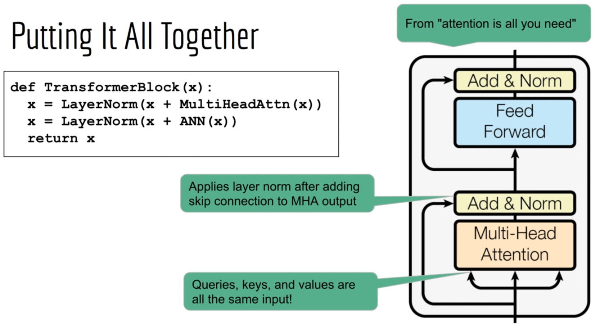

## 6. Encoder(Bert)

## 7. Decoder(GPT)

## 8. Seq2Seq: Encoder-Decoder

## 9. Specific instances on Transformers

### Bert

### GPT

### GPT2

### GPT3

