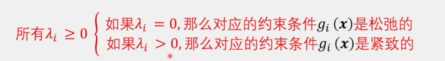

# 1.拉格朗日乘数法(Lagrange Multiplier)

## 1.1 基本概念

拉格朗日乘数法是用于在多维空间中寻找有约束条件下目标函数的极值的一种方法。这种方法非常适合于处理带有等式约束的优化问题。

## 1.2 优化问题的形式

考虑一个典型的带有约束的优化问题：

$minimize f(x) $

$subject\ to\ g_i(x) = 0, for\ i = 1, ... , m$

其中，$( f: \mathbb{R}^n \to \mathbb{R} )$ 是目标函数，而 $g_i: \mathbb{R}^n \to \mathbb{R} $ 是约束函数。

## 1.3 拉格朗日函数

为了解决上述问题，我们构造拉格朗日函数 \( L \)：
$$
L(x, λ) = f(x) + Σ λ_i g_i(x)
$$
其中，$ λ_i $ 是与约束 $g_i $ 相关联的拉格朗日乘数。

## 1.4 最优性条件

最优解需要满足拉格朗日函数的梯度等于零的条件，即：
$$
∇L(x*, λ) = 0
$$
这导致了以下方程组：
$$
∇f(x*) + Σ λ_i ∇g_i(x*) = 0
$$
对于每一个活跃的约束 $g_i $，我们都有 $ g_i(x*) = 0 $。

## 1.5 几何直观

在最优点，目标函数的等高线与活跃约束的等高线相切，这也意味着目标函数的梯度和活跃约束的梯度是线性相关的。

考虑如下这么一个问题，最优点是$x*$，因此实际上我们是在要求与$x*$强相关的约束$\alpha,\beta$的梯度线性组合与目标函数$f(x)$在此点的梯度和为零。

在 ∗*x*∗ 这一点上，我们只考虑构成这个点的两个约束直线的梯度 $\nabla g_{\alpha}(x*)$ 和 $\nabla g_{\beta}(x*)$，原因如下：

1. **活跃约束（Active Constraints）**：在最优点 $x^*$，只有与该点相切的约束被视为活跃约束或者说是约束条件。这些约束的梯度构成了可行方向的边界，并且在优化过程中起到了直接作用。

2. **非活跃约束（Inactive Constraints）**：图中未与 $x^*$ 相切的约束不是活跃的，==因为在最优点，这些约束并没有影响到解的可行性或最优性。这意味着在  $x^*$​点上，我们可以忽略它们的梯度，因为它们不限制或者不改变最优解的位置。==

   从图中来看，其余的$g_i(x^*)<0$一定是成立的(在可行域内且不在边界上)，因此我们令其scale=0来忽略这些约束
   $$
   \lambda_i \cdot \nabla g_i(x) = 0 \rightarrow \lambda_i = 0(i \neq \alpha, \beta)
   $$
   

3. **梯度和最优性条件**：在最优点，活跃约束的梯度与目标函数的梯度必须在相同或相反的方向上线性相关。这就是拉格朗日乘数法的核心，其中拉格朗日乘数$\lambda_{\alpha}$ 和 $\lambda_{\beta}$调整了这种线性关系，以满足最优性条件 
   $$
   \nabla f(x^*)+\lambda_{\alpha} \nabla g_{\alpha}(x*) + \lambda_{\beta} \nabla g_{\beta}(x*) = 0
   $$
   

4. **几何直观**：从图中可以看出，目标函数的等高线在 $x^*$​点与约束条件形成的多边形的边界相切。在这个点，你不能在不违反约束条件的情况下进一步减小目标函数的值，因为任何方向的移动要么会导致增加目标函数的值，要么会违反至少一个约束条件。

5. **顶点定理**: 在线性规划中，目标是最大化或最小化一个线性目标函数，同时满足一组线性不等式（和/或等式）约束。顶点定理告诉我们，如果线性规划问题的可行域（即所有满足约束条件的解构成的区域）是有界的，并且目标函数在可行域上有最优解，那么至少有一个最优解在可行域的顶点上。

   直观上，这是因为线性函数在任何给定方向上的增加或减少是均匀的。如果你设想沿着多边形的一条边移动，目标函数值的变化率是恒定的。因此，如果目标是最大化目标函数，你会想要移动到使该函数值增加最多的方向。在多边形的内部或边上，总有可能找到一个方向可以增加目标函数的值，直到你到达一个顶点，那里你无法再找到任何可以进一步增加函数值的方向。因此，最优解位于顶点上。

## 1.6 缺点

如下图，拉格朗日乘数法只能保证凸问题（一般定义为目标函数是凸函数）的最值是最优解，而对于如下图一般的非凸问题，它得出来的值不一定是最值，有可能是鞍点。

## 1.7 使用步骤

1. 写下原始的有约束优化问题。
2. 构造拉格朗日函数 \( L(x, λ) \)。
3. 计算 \( L \) 相对于每一个变量的梯度，并将它们设置为零（得到一组方程）。
4. 解这组方程以找到潜在的最优解和相应的拉格朗日乘数。
5. 利用第二导数测试或其他方法验证这些解的最优性。

## 1.8 注意事项

- 在实际应用中，对于不等式约束问题，可以使用KKT条件（Karush-Kuhn-Tucker Conditions）进行求解。
- 拉格朗日乘数法不能直接应用于非凸函数或存在不等式约束的情况，需要进一步的条件和技术。
- 拉格朗日乘数 \( λ_i \) 的物理意义是约束 \( g_i \) 在最优解处对目标函数值的影响。

## 1.9 进阶主题

- KKT条件的推广和应用。
- 对于不同类型的问题（如凸优化，非线性规划），拉格朗日乘数法的变体和相关技术。
- 对偶问题的理解和拉格朗日对偶性的应用。

# 2. 拉格朗日函数的对偶问题

## 2.1 为什么要构造拉格朗日对偶问题

拉格朗日对偶概念被提出的目的是解决含有约束的优化问题。在数学优化中，许多问题都受到一些约束条件的限制，而拉格朗日对偶性提供了一个强有力的框架来处理这类问题。

* 拉格朗日对偶问题提供了原始问题的下界，这一下界对理解原始问题的解结构和性质非常有帮助。
* 在很多情况下，对偶问题可能比原始问题更容易求解。例如，当原始问题是凸的且满足Slater条件时，对偶问题也是凸的，可以使用凸优化的强大工具箱求解。
* 对偶问题有时可以分解成更小、更易于解决的子问题，这在大规模优化问题中尤其有用。
* 在某些条件下，原始问题和对偶问题的解相等（强对偶性成立），这意味着通过求解对偶问题可以直接得到原始问题的解。
* 对偶性是很多高效优化算法（如支持向量机和内点法）的基础，这些算法在对偶空间中操作往往更高效。
* 拉格朗日乘数可以用来进行敏感性分析，即理解原始问题的最优值如何随约束条件的变化而变化。

## 2.2 构造拉格朗日对偶问题

### 2.2.1 原问题的另一种表达方式

原始问题是一个有约束的最优化问题，可以被表示为如下，它主要将约束分为了等式约束与不等式约束

为了解决这个问题，引入拉格朗日乘数对不等式约束进行乘法

因此原问题就被转化为了一个新的问题，在这个问题中，原问题的==约束都被整合进了目标函数==

现在对于这个问题分类讨论，

* 如果x不在可行域内，即$f_i(x)>0$，那么$max_{\lambda, \nu}L(x,\lambda,\nu) = f_0(x) + ∞ +∞ $​,

* 如果x在可行域内，那么实际上最大的情况就是所有约束都为0

  $max_{\lambda, \nu}L(x,\lambda,\nu) = f_0(x) + 0+0 $​

因此，可以发现
$$
min_x max_{\lambda, \nu} = min_x\{f_0(x), ∞\}
$$
也就是说，问题被转化为了就是求$f_0(x)$的最小值，同时我们可以解除原本的$f_i(x)$,$h_i(x)$的约束。

### 2.2.2 对偶问题

对偶问题就是将求最大和最小调换一下

首先定义拉格朗日对偶函数就是拉格朗日函数对于x的最小值($\lambda \geq 0$)
$$
g(\lambda,\nu) = min_x L(x,\lambda, \nu)
$$
因此对偶问题就为
$$
max_{\lambda, \nu} g(\lambda, \nu)=max_{\lambda,\nu}min_x L(x,\lambda,\nu)
$$
也可以写成
$$
目标函数:max_{\lambda, \nu} g(\lambda, \nu)
\\
s.t.
\\
\nabla_x L(x,\lambda,\nu) = 0
\\
\lambda\geq 0
$$

### 2.2.3 对偶问题的性质

无论原问题是不是凸问题，对偶问题都是一个凸问题。

#### 凸集/非凸集

凸集，非凸集：在图形内任意两点连线，线上的点还在图形内，就是凸集，否则就是非凸集

#### 仿射集与凸集

如果集合 C满足仿射性质，即对于任意两个点 x*1,*x*2∈*C 和任意实数 *θ*，点 $\theta x_1 + (1-\theta)x_2$​ 也在集合 *C* 内，那么 *C* 被称为仿射集。

区别于凸集的定义，凸集要求 *θ* 在闭区间 [0,1] 内，这保证了线段 *x*1*x*2 上的所有点都包含在集合 *C* 内，形成了一个凸组合。相反，仿射集没有这个限制，允许 *θ* 是任意实数，这意味着不仅 *x*1*x*2 上的点属于集合 *C*，而且这条线段可以无限延伸，所有在这条直线上的点也属于集合 *C*。

同时，不难扩展出结论，若是x为高维空间，只要满足这个仿射集在C中，那么就是凸集。

#### 仿射集的交集

如果是仿射集相交（空集，一维交成一个点，二维交成一条线，三维交成一个超平面，四维交成一个立体的），他们任然都是凸集

在高维空间中，我们实际上可以转换一下写法：

$\theta \cdot x_1 + (1-\theta) \cdot x_2 \in C$

也可以写成

$C = \{x | W^T \cdot x + b = 0\}$

这实际上定义了一个超平面。超平面是空间中的一个仿射子集，可以看作是所有满足特定线性方程的点的集合。在*n* 维空间中，一个超平面是 *n*−1 维的。如果 *x* 是一个 *n* 维向量，*W* 也是*n* 维，并且 *b* 是一个实数，那么 *W*T*⋅*x*+*b=0 描述的是一个超平面，而不是凸集。这个超平面可以看作是一个凸集，因为它满足凸集的定义

#### 半空间的交集

考虑如下一个半空间，半空间的交集也一定是凸集

#### 凸函数，凹函数

#### 为什么对偶问题一定是凸问题

$g(\lambda, \nu) = f_0(x^*) + \sum \lambda_i f_i(x^*) + \sum \nu_i h_i(x^*)$

*g* 关于拉格朗日乘数 *λ* 和 *ν* 是线性的，因为它是 $\lambda_i f_i(x^*)$和$\nu_j h_j(x^*)$ 的线性组合。
$$
g(\lambda,\nu) = min_x L(x,\lambda, \nu)
$$
由上式可知，对于 *λ* 和 *ν*，对偶函数 *g*(*λ*,*ν*) 是拉格朗日函数在*x* 上的下包络（infimum envelope）。这个下包络对于*λ* 和 *ν* 是凹函数

对于凹函数，考虑它的约束是一个半空间$\lambda \geq 0$，因此实际上与$g(\lambda,\nu)$组合成为了一个凸集。

因此，对偶函数g*(*λ*,*ν) 是凹的，这使得对偶问题的求解变成了一个寻找凹函数的最大值的问题。在凸优化问题中，这通常更易于处理，因为凹函数的局部最大值也是全局最大值。(凸优化问题指的是，目标函数为凸函数，且约束为凸集)

> 
> 

### 2.2.4 对偶问题是原问题的下界

==原问题得出的解一定大于等于对偶问题==

我们可以由

**拉格朗日函数的最大值大于等于拉格朗日函数大于等于拉格朗日函数最小值**

推导出如下几个关系

前者$P^*$其实就是传统的拉格朗日函数，后者$D^*$​其实就是拉格朗日对偶函数

接下来我们可以对拉格朗日函数做一些简化，以探明

* 强对偶:$P^* = D^*$
* 弱对偶:$P^* > D^*$

以及其内在的表示。

我们可以将拉格朗日函数分为两个部分，第一部分是目标函数，第二部分是约束。对于约束，我们又可以将等式约束单独排除，==因为等式约束的作用是给出梯度信息==，在拉格朗日函数本身来说，$h_i(x)=0$

我们用*t*表示$f_0(x)$，用*u*表示$f_i(x)$的向量，这样如果我们将向量*u*看作一个一维变量，我们就能更直观的用一个坐标图表示。

在这里，用$G_1$表示原问题的可行域，用$G_2$​表示对偶问题的可行域，需要注意的是，在对偶问题中，x的可行域是全域。

> 关于为什么对偶问题的x可行域是全域
>
> 

我们就可以通过图像看原问题和对偶问题的关系了。

首先我们假设，$L(x,\lambda,\nu) = L(t,u)$，可以被表现为如下一个非凸函数，这意味着如果x的取值可以是全域，那么拉格朗日函数可能是一个非凸函数。

那么对于原问题受限的x中($u \leq 0$)，它对应的就是左半部分。

对于原问题，t的最小值很容易就能看到

对于对偶问题，它分为两步走$min_x$,$max_{\lambda}$

> 

其目标就是一个$t + \lambda\cdot u = k$的直线与G2可行域的相交同时截距最小化，==因为截距就是$t+\lambda \cdot u$==，我们第一步就需要最小化$t + \lambda \cdot u$​。

> 以下保证了实际上我们这个操作是关于x对L(t,u)最小化
>
> 

这个直线有如下性质

* 与可行域G2相交

* 截距t最小,值为$k$
* 斜率为$-\lambda$，因为$\lambda \geq 0$，因此这个直线一定是一个向右下角斜的直线

在我们确定了这个与G2相切的交点之后，==我们以确定的x为支点，也就是确定的t和u为支点，也就是之前那个与G2的交点==，改变$\lambda$使得$L(t,u)$最大,同时与G1可行域相切。

这里为什么要与G1相切呢？因为G1才是我们真正需要的可行域，G2实际上是没有$f_i(x)\leq 0$的硬约束的，只能说我们之前得到的交点只是令$f_i(x)$尽可能小。因此，实际上我们真正需要的值是与G1相交的点，或者说相切的点。获得的新的截距$D* = t + \lambda u$就是对偶问题的解。

##### 弱对偶

这种情况也被称为弱对偶。

##### 强对偶

$P^*与D^*$相等时就被称为强对偶。

这个情况下，因为$\lambda \geq 0$，因此只能是一个水平直线。

##### 保证强对偶的条件-Slater条件

数学上严谨来说，一个凸优化问题如果是强对偶，必须满足Slater条件

* $f_0$是凸函数
* 约束是凸集
* 存在一个点，这个点是可行域相对内点（不能是边界），使得在仿射集$Ax=b$中，$f_i(x)<0$

==凸优化问题满足Slater条件一定是强对偶，但是强对偶不一定满足Slater条件==

##### 强对偶一定满足的条件-KKT条件

KKT条件有点像$f'(x)=0$，极值一定满足这个条件，但是这个条件不一定代表极值，还可能是鞍点

KKT条件符合五个子条件

原问题可行条件

对偶问题可行条件

松弛互补条件

无论是松弛还是紧致，$\lambda_i g_i(x)$一定等于0，因为对于松弛，它$\lambda$就是0，对于紧致，这个点在不等式约束的边界上，因此$g_i(x)=0$​

##### 证明

见 《最优化理论》 凌青 中国科学技术大学研究生院公开课 29集

# 3. 以最大熵为例

先看

https://www.bilibili.com/video/BV1cP4y1t7cP/?spm_id_from=333.999.0.0

再看

https://www.bilibili.com/video/BV1HP4y1Y79e/?spm_id_from=333.788.recommend_more_video.0&vd_source=61f56e9689aceb8e8b1f51e6e06bddd9

从42分30开始

