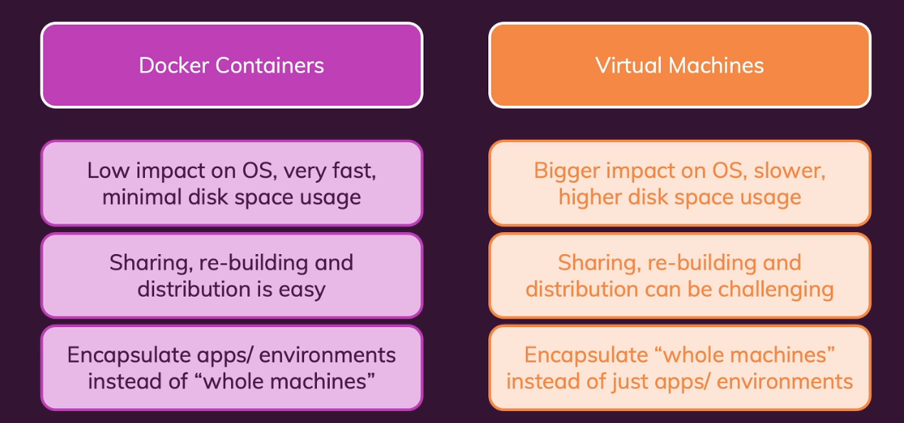

# 0. What is Docker

Docker是一种容器技术(A tool for creating and managing containers)

容器是一个标准的软件单元，也是代码与其依赖的集合。它保证了代码运行的一致性（不用配环境了，也不用理清多如牛毛的版本关系）


Docker拥有一个轻量级的操作系统以及一个Docker Engine，这使得它比虚拟机拥有更好的性能





# 1. Docker Setup

### 安装Docker


我们澄清一下，macOS和Windows本身不支持docker，因此它需要跑一个轻量级virtual os来安置docker engine,而Linux本身兼容docker engine，因此没必要。

总结一下，如果你的系统不是linux，你需要docker desktop为你安装docker engine。如果你的系统又太老，你需要docker toolbox帮助你安装docker desktop来安装docker engine。

额外的，docker hub能够允许我们在云，网络上托管映像，以方便的共享，这些是后话。

* 为Linux安装https://docs.docker.com/engine/install/ubuntu/#install-using-the-repository

  * Docker为Linux22.04即以上版本推出了其desktop，考虑到我的环境仍然为20.04，因此使用Docker Engine

  


### 使用VSCode作为编辑器


## 2. Quick Start of Docker

Container总是基于Image的，因此首先需要创建一个Image

* 创建`Dockerfile`，这就是文件名，没有后缀，我们在Dockerfile中向Docker描述容器将如何设置

* 运行`docker build .`以创建这个Dockerfile对应的Image

  * 此时，docker会抓取当前的环境变量，并且从云端下载对应的copy
  * 然后，它会给我们一个Image（ID），这个Image已经准备好开始作为一个容器
  * 我们可以使用`docker run d2cc7b04fb0a`，其中那串字符就是给出的Image ID
    * 注意，默认情况下container与当前操作系统是独立的，如果你想要和当前操作系统产生连接，例如发送HTTP请求，你需要在Dockerfile中指定local port`EXPOSE 3000`，然后使用`docker run -p 3000:3000 d2cc7b04fb0a`，其中3000:3000代表publish port 3000 on port 3000，这使得我们可以使用本地系统的本地主机访问port3000上运行的应用程序，而非容器。
  * 如果你使用desktop，你需要保证在运行这一句时，desktop已经启动并且在后台

* 终止docker:

  * `docker ps`:列出所有正在运行的容器，你会发现docker自动为这个container分配了一个名称，例如`relaxed_bartik`
  * `docker stop relaxed_bartik`


## 3. Foundation 

### 3.1 Images&Containers

#### what are they


Containers是一个运行软件的单元，包括实现和环境

Image更像Container的一个template/Blueprints，它实际上是code与运行时所需要环境的一个映射

Image并不执行与运行代码，这些将在container中发生。


这样的好处就是我们可以复用Images，Images负责存储所需要的package与环境信息，而Container将是这个Image的一个运行实例。

#### 从Dockerhub下载Image

```bash
docker run ImageName
```

`docker run` 命令是 Docker 中用来启动一个新容器的主要命令。这个命令会从指定的镜像创建一个新的容器，并执行容器内的应用。具体来说，`docker run` 可以让你做到以下几点：

1. **从镜像启动一个新容器**：当你执行 `docker run` 时，Docker 会查找本地是否存在指定的镜像，如果不存在，它会从 Docker Hub（或你d指定的其他镜像仓库）下载该镜像，然后基于这个镜像创建一个新的容器。
2. **执行命令**：在容器内执行一个指定的命令或应用。当容器启动后，默认会执行镜像中配置的默认命令。但是，你可以在 `docker run` 命令的最后指定一个新的命令来替换默认命令。
3. **资源隔离和配置**：通过 `docker run` 命令的选项，你可以配置容器的运行环境，如网络设置、卷挂载、环境变量、资源限制（CPU、内存等）以及其他安全设置等。
4. **交互式或后台运行**：你可以选择以交互模式运行容器，这样可以通过终端与容器内部进行交互；或者选择以后台模式运行，容器在后台执行且不会阻塞终端。

##### 常用的 `docker run` 选项和参数

- `-d`（或 `--detach`）：以后台模式运行容器。
- `-p`：端口映射，格式为 `宿主机端口:容器端口`。
- `-v`：挂载卷，格式为 `宿主机目录:容器目录`。
- `--name`：为容器指定一个名称。
- `-e`：设置环境变量。
- `-it`：同时使用 `-i`（或 `--interactive`）和 `-t`（分配一个伪终端）使容器以交互模式运行。
- `--rm`：容器退出时自动清理容器文件系统。

##### 示例

- **以交互模式运行 Ubuntu 容器并启动 Bash**：

  ```bash
  docker run -it ubuntu bash
  ```

- **以后台模式运行一个 web 应用，并将容器的 80 端口映射到宿主机的 8080 端口**：

  ```bash
  docker run -d -p 8080:80 --name web-server nginx
  ```

`docker run` 命令是 Docker 使用中最基础也是最频繁使用的命令之一，了解其用法对于有效地使用 Docker 来说至关重要。


#### 使用Tensorflow官方镜像

https://www.tensorflow.org/install/docker?hl=zh-cn

* 下载Image（可跳过）

  首先，我们从远程镜像库下在一个Docker镜像,这里去https://hub.docker.com/r/tensorflow/tensorflow选择自己需要的Image

  ```bash
  sudo docker pull tensorflow/tensorflow:latest-gpu-jupyter
  ```

  如果你没有sudo权限需要使用Docker组

  `docker pull` 命令拉取（下载）的 Docker 镜像被存储在本地机器上的 Docker 安装目录中。具体来说，这些镜像存放在 Docker 的镜像仓库中，这是一个本地的存储区域，用于保存所有已下载的 Docker 镜像文件。

* 为Docker安装Nvidia-docker-toolkit以让Nvidia GPU支持docker，注意，我们的host环境只需要驱动即可,==最需要注意的是，你的host环境GPU-SMI如果足够高，可以兼容所有的Tensorflow镜像，但是如果低了，就会无法兼容最新的镜像。我在ubuntu上安装最新的NVIDIA驱动只有535，但是Tensorflow2.15已经需要546了，浪费了很多时间==

  * 首先需要查看docker版本，我的是25.03，应当使用nvidia-container-toolkit,并且在docker run时候使用`--gpus all`

  * 注意，Nvidia docker已经被放弃使用，应该使用nvidia-docker-toolkit, https://github.com/NVIDIA/nvidia-container-toolkit

  * 主要步骤：https://docs.nvidia.com/datacenter/cloud-native/container-toolkit/latest/install-guide.html#installing-with-apt

    * 安装 NVIDIA Container Toolkit 的 GPG 密钥并添加其软件源到您的系统中。

      ```bash
      # 添加 NVIDIA 容器工具包的官方 GPG 密钥，添加 NVIDIA 容器工具包的仓库：
      curl -fsSL https://nvidia.github.io/libnvidia-container/gpgkey | sudo gpg --dearmor -o /usr/share/keyrings/nvidia-container-toolkit-keyring.gpg \
        && curl -s -L https://nvidia.github.io/libnvidia-container/stable/deb/nvidia-container-toolkit.list | \
          sed 's#deb https://#deb [signed-by=/usr/share/keyrings/nvidia-container-toolkit-keyring.gpg] https://#g' | \
          sudo tee /etc/apt/sources.list.d/nvidia-container-toolkit.list
      ```

    * 更新包列表

      ```bash
      sudo apt-get update
      ```

    * 安装container toolkit

      ```bash
      sudo apt-get install -y nvidia-container-toolkit
      ```

    * 安装完成后，重启电脑或 Docker 服务以确保新的配置生效：

      ```bash
      sudo systemctl restart docker
      
      ```

    * 使用 Docker 运行 NVIDIA SMI 工具

      ```bash
      sudo docker run --gpus all --rm nvidia/cuda:11.2.2-base-ubuntu20.04 nvidia-smi
      ```

      这段代码意思是启动一个新容器，使用所有可用GPU，并在容器退出后自动删除容器，其指定了一个目标cuda镜像，并输出nvidia-smi。这是为了判定docker是否支持cuda。

      这个地方输出的应该是host的smi，这是正常的，`nvidia-smi` 显示的是 NVIDIA 驱动支持的 CUDA 版本，而不是容器内部安装的 CUDA Toolkit 版本。即使容器内部包含了不同版本的 CUDA Toolkit，`nvidia-smi` 也会显示宿主机 NVIDIA 驱动所支持的 CUDA 版本。

      在 Docker 容器中使用支持 GPU 的 TensorFlow 镜像时，TensorFlow 应用并不直接依赖于宿主机上安装的 CUDA Toolkit 版本。这是因为 TensorFlow 的 GPU 支持镜像已经包含了所有必要的 CUDA 库和其他依赖项，包括特定版本的 CUDA Toolkit 和 cuDNN，这些都是编译 TensorFlow 时所使用的。

* 尝试使用TenserflowGPU

  ```bash
  docker run --gpus all -it --rm tensorflow/tensorflow:2.10.1-gpu-jupyter\   python -c "import tensorflow as tf; print(tf.reduce_sum(tf.random.normal([1000, 1000])))"
  ```
  
如果成功输出代表环境这块没问题。


然后使用docker run之前下载的Image即可，及的--gpus all

注意，使用container默认的是独立的环境，这意味着即使它里面有自己的shell，也不会给你用。因此，我们需要`-it`来修饰run，这样我们就能接管其内部的terminal并与之交互。


使用`sudo docker ps -a`显示所有已经存在的container。


我推荐2.10.1-gpu-jupyter

```bash
docker run --gpus all -it -p 8888:8888 tensorflow/tensorflow:2.15.0-gpu-jupyter
```

这个镜像是傻瓜镜像，使用后会直接给你jupyter notebook的URL，复制即可。


需要注意的是，==镜像默认的是关闭不保存，如果你需要关闭保存，你需要使用数据卷与挂载==

考虑到现在还是轻度使用，我们可以使用docker commit来快速保存更改。同时，因为docker commit会生成新的Image，我们需要定期清理旧的Image。


* 使用docke commit

  * 基本语法：

    ```bash
    docker commit [OPTIONS] CONTAINER [REPOSITORY[:TAG]]
    ```

    - `CONTAINER`：要提交的容器的ID或名称。
    - `REPOSITORY[:TAG]`：新创建镜像的仓库和标签。标签是可选的，如果不指定，默认为`latest`。

    例如，如果你有一个名为`my_modified_container`的容器，并想将其更改保存到一个名为`my_new_image`的镜像中，你可以执行：

    ```bash
    docker commit my_modified_container my_new_image:latest
    ```

    这将创建一个新的镜像`my_new_image`，标签为`latest`，包含了`my_modified_container`的所有更改。

    ### `docker commit`的选项

    `docker commit`命令支持多个选项，允许你在提交镜像时进行额外的配置。一些常用的选项包括：

    - `-a, --author=""`：作者信息，通常是姓名和邮箱地址，用于记录谁创建了这个镜像。
    - `-c, --change=[]`：在提交时应用Dockerfile指令到创建的镜像，例如`EXPOSE`、`ENV`等。
    - `-m, --message=""`：提交时的描述信息，用于记录这个镜像的更改内容或其他重要信息。
    - `--pause=true|false`：提交前是否暂停容器的运行，默认为`true`。

    例如，如果你想为新镜像设置一个作者和一个提交信息，可以这样做：

    ```bash
    docker commit -a "Your Name <your_email@example.com>" -m "Added a new web server" my_modified_container my_new_image:latest
    ```

    


#### How to build own Image based on exist Image

在创建了新的Container之后，我们需要写代码或者添加环境，将这个环境改造为我们自己的Image。


*  在项目文件中添加`Dockerfile`,该文件包含构建自己的Image时要执行的Docker指令

  ```dockerfile
  # 允许你在另一个基础映像上构建映像
  FROM tensorflow/tensorflow:2.15.0-gpu-jupyter
  
  #告诉Docker所有的后续命令在此路径执行
  WORKDIR /app
  
  # 告诉docker本地计算机上哪些文件应该放入Image
  COPY . .
  # 第一个.代表 the file should be copied into image的file的地址，如果只是.那就是这个Image在Dockerfile的父文件夹中，也就是这整个项目文件夹
  # 第二个.代表这些文件在Image中应该被存在哪里
  # 因此,考虑到之前我们将Image中的路径切换到/app，因此COPY . .可以被理解为，将这整个项目文件夹，存在image/app中
  
  #等同于COPY . /app
  
  # 让container中的port80解锁/暴露
  EXPOSE 80
  
  # 开启服务器
  CMD ["node","server.js"]
  ```

  * 每个Image以及基于Image创建的每个Container都有自己独立的文件系统，与计算机文件系统完全分离，注意这一点。
  * 默认情况下，所有的Dockerfile命令都会在Container中执行
  * `EXPOSE 80`
    - 声明容器在运行时监听 80 端口。这对于向外界表明容器将在该端口上提供服务（例如，一个 web 服务器）很有用。请注意，实际将容器端口映射到宿主机端口的操作需要在使用 `docker run` 命令时通过 `-p` 参数指定。
  * `CMD ["node","server.js"]`
    - 定义容器的默认执行命令，这里是使用 Node.js 运行 `server.js` 文件。如果容器启动时没有指定其他命令，那么这个命令将被执行。这意味着容器的主要作用是运行一个 Node.js 服务器。


Dockerfile编辑完毕后，我们进入对应文件夹使用`sudo docker build`，这样就能创建一个新的Image，完成构建后会给你ImageID


然后使用`sudo docker run -it -gpus all ImageID`即可

注意，如果你需要port，仅仅EXPOSE是不够的，你需要run的时候指明port

`sudo docker run -it -gpus all -p localport:containerport ImageID`

将localport:containerport替换为实际值，例如3000:80


##### FROM与RUN&CMD

> ### `FROM` 指令
>
> - **作用**：`FROM` 指令用于指定构建镜像的基础镜像。每个 Dockerfile 必须以一个 `FROM` 指令开始（除非使用了 `ARG` 指令作为第一条指令），因为它定义了镜像的基层。所有后续的操作（如安装软件包、复制文件等）都是在这个基础镜像的上下文中进行的。
>
> - **格式**：`FROM <image>:<tag>`，其中 `<image>` 是基础镜像的名称，`<tag>` 是镜像的标签，指定了具体的版本。如果不指定标签，将默认使用 `latest` 标签，即最新版本。
>
> - 示例
>
>   ：使用官方的 Python 镜像作为基础镜像，版本为 3.8。
>
>   ```dockerfile
>   FROM python:3.8
>   ```
>
> ### `RUN` 指令
>
> - **作用**：`RUN` 指令用于在镜像构建过程中执行命令，这些命令在基础镜像的顶层添加新的层。`RUN` 常用于安装软件包、创建文件夹、下载外部内容等操作。每个 `RUN` 指令都会创建一个新的镜像层，因此建议合理组织和合并 `RUN` 指令，以减少镜像层数，优化镜像大小。
>
> - **格式**：`RUN` 指令有两种格式：shell 格式（`RUN <command>`）和 exec 格式（`RUN ["executable", "param1", "param2"]`）。
>
> - 示例
>
>   ：在 Dockerfile 中安装 Flask。
>
>   ```dockerfile
>   RUN pip install flask
>   ```
>
>   ### 组合使用 `FROM` 和 `RUN`
>
>   在 Dockerfile 中，`FROM` 和 `RUN` 经常一起使用来构建特定需求的镜像。首先使用 `FROM` 指定基础镜像，然后通过一系列的 `RUN` 指令执行必要的安装和配置命令。
>
>   ```dockerfile
>   # 使用官方 Python 镜像作为基础镜像
>   FROM python:3.8
>         
>   # 安装 Flask
>   RUN pip install flask
>         
>   # 其他指令...
>   ```
>
>   这样，您就能构建一个包含了 Flask 的 Python 环境的 Docker 镜像，适用于运行基于 Flask 的应用。


> 在 Dockerfile 中使用 `RUN` 命令与使用 `CMD` 命令有着本质的区别，这影响了您为什么不能（或不应该）使用 `RUN node server.js` 来启动您的 Node.js 应用。
>
> ### `RUN` 命令
>
> - **用途**：`RUN` 命令用于在构建镜像的过程中执行命令。它在镜像构建时运行，并且它的结果会被包含在构建的镜像中。这通常用于安装软件包、设置配置文件、编译代码等构建时的操作。
> - **行为**：当 Dockerfile 中的 `RUN` 命令执行时，它在当前镜像层上创建一个新层，并且每个 `RUN` 命令都会提交为新的镜像层。一旦镜像构建完成，`RUN` 命令执行的结果就固定在镜像中，而不会在容器启动时重新执行。
>
> ### `CMD` 命令
>
> - **用途**：`CMD` 命令用于设置容器启动时默认执行的命令。**它不会在构建镜像的过程中执行**，而是指定了容器启动时应当运行的命令。如果用户在 `docker run` 命令中指定了其他命令，**`CMD` 指定的命令会被覆盖。**
> - **行为**：`CMD` 提供的命令仅在容器启动时执行，这意味着它是**动态执行的**，适用于启动服务、运行应用等运行时的操作。

> - **构建时 vs 运行时**：如果您使用 `RUN node server.js`，这会在**构建镜像时**尝试启动您的 Node.js 服务器。这意味着服务器将尝试启动并在构建过程中运行，而不是在容器启动时运行。构建过程完成后，服务器进程可能会终止，或者导致构建过程挂起，因为 `RUN` 命令需要完成执行才能继续到下一步。
> - **不适合的用途**：在 Docker 镜像构建过程中启动一个长期运行的进程（如 web 服务器）通常不是预期的行为。构建镜像的目的是创建一个包含所有必要依赖和配置的环境，而不是启动服务。


#### 关闭docker

首先注意，`docker ps`显示所有正在运行的容器。

`docker ps -a`显示所有容器


`docker stop Imagename`关闭容器


#### How to run and figure container based on Image

首先，你需要添加自己的用户到用户组

> - 在一些 Linux 发行版中，您可能需要手动创建 Docker 组（如果它还不存在的话）。可以使用以下命令创建 Docker 组：
>
>   ```bash
>   sudo groupadd docker
>   ```
>
> - 确保 Docker 服务已经启动。您可以使用以下命令来启动 Docker 服务：
>
>   ```bash
>   sudo systemctl start docker
>   ```
>
> - 为了确保 Docker 服务在启动时自动运行，您可以使用以下命令：
>
>   ```bash
>   sudo systemctl enable docker
>   ```
>
> - **添加用户到 `docker` 组**。使用下面的命令，将您的用户名替换为您的实际用户名。如果您不确定您的用户名，可以使用 `whoami` 命令来查看。
>
>   ```bash
>   sudo usermod -aG docker $USER
>   ```
>
> - **重新登录或重启**。为了使组变更生效，您需要注销并重新登录，或者重启您的电脑。这确保了您的用户会话包含了对新用户组的访问权限。
>
> - **验证 Docker 命令是否能够无 sudo 执行**。重新登录后，打开一个新的终端会话，并尝试运行 `docker` 命令而不使用 `sudo`，例如：
>
>   ```bash
>   docker run hello-world
>   ```
>
>   如果这个命令成功运行并输出了欢迎信息，那么说明您现在可以作为非 root 用户运行 Docker 命令了。


使用vscode扩展(Dev Containers)

这个扩展允许您使用 Docker 容器作为一个完整的开发环境，无论您是否将应用部署到容器。使用容器作为开发环境有很多好处，包括：

- 在与部署目标相同的操作系统上开发，确保了工具链的一致性和可复现性。
- 能够快速切换不同的开发环境，安全地进行更新而不用担心影响本地机器。
- 让新团队成员或贡献者快速启动并运行在一致的开发环境中。
- 尝试新技术或克隆代码库副本而不影响本地设置。

通过 Dev Containers 扩展，您可以从本地文件系统挂载或复制、克隆工作空间文件到运行中的开发容器内。扩展会安装并在容器内运行扩展，让您完全访问工具、平台和文件系统。

使用 VS Code 和 Dev Containers 扩展，您可以像在本地机器上工作一样进行编码、调试等，只是这些都在容器内隔离执行。

##### 如何使用 Dev Containers 扩展进行 TensorFlow 开发

1. **安装 Dev Containers 扩展**：确保您已经在 VS Code 中安装了 Dev Containers 扩展。
2. **准备您的项目**：为您的项目准备一个 `Dockerfile` 或使用现有的 TensorFlow Docker 镜像。如果您的项目已经包含 `.devcontainer/devcontainer.json` 配置文件，VS Code 可以自动识别并建议在容器中重新打开项目。
3. **启动容器并进行开发**：使用 Dev Containers 扩展启动容器。您可以直接在 VS Code 中进行开发，所有更改都将在容器内进行。这包括编写代码、运行和调试 TensorFlow 应用。
4. **利用 Jupyter Notebook**：如果您使用的是带有 Jupyter Notebook 的 TensorFlow 镜像，您还可以在容器中启动 Jupyter 服务器，并通过浏览器访问它进行交互式开发。

通过遵循这些步骤，您可以利用 VS Code 和 Dev Containers 扩展在 Docker 容器中为 TensorFlow 项目创建一个高效且隔离的开发环境，同时享受 VS Code 提供的完整功能集。


#### How these two pieces cooperate


### 3.2 In Container:Data&Volumes

#### How to manage data in Containers


#### How to ensure the data persists(如何确保数据持久保存)


### 3.3 Containers & Networking

#### How containers communicate with each other


## 4. Real Life Application(Advanced Concept)

### 4.1 Multi-Container Object


### 4.2 How to use Docker Compose


### 4.3 Utility Containers(实用工具容器)


### 4.4 Deploying Containers and Containlize applications(部署容器与容器化应用程序)


## 5. Kubernetes

### 5.1 Introduction & Basics


### 5.2. Data & Volumes in Kubernetes


### 5.3 Networking


### 5.4 Deploying a Kubernetes Cluster


