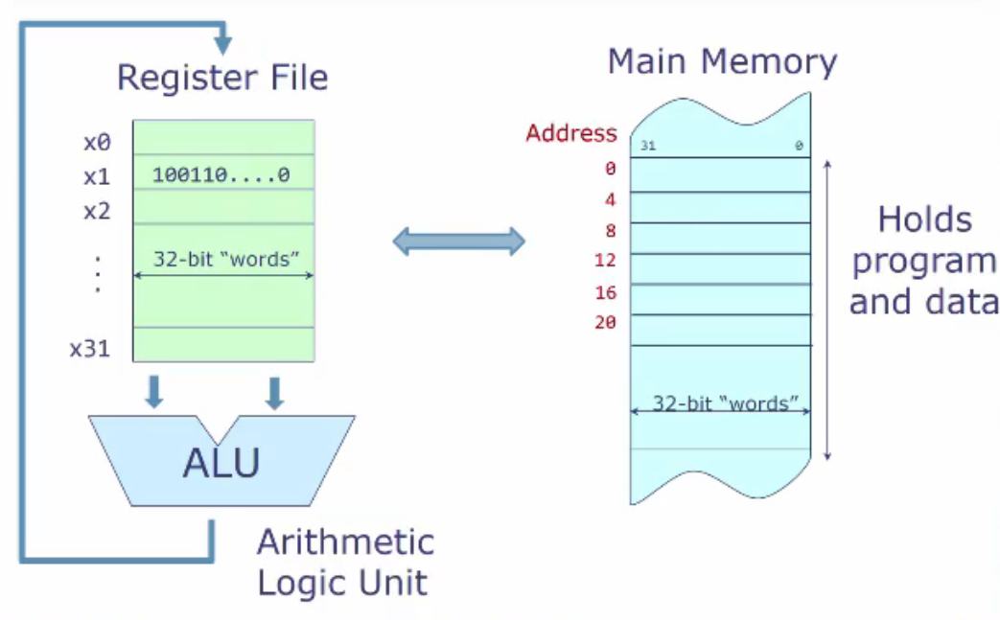

Memory->Register->ALU->Register->Memory

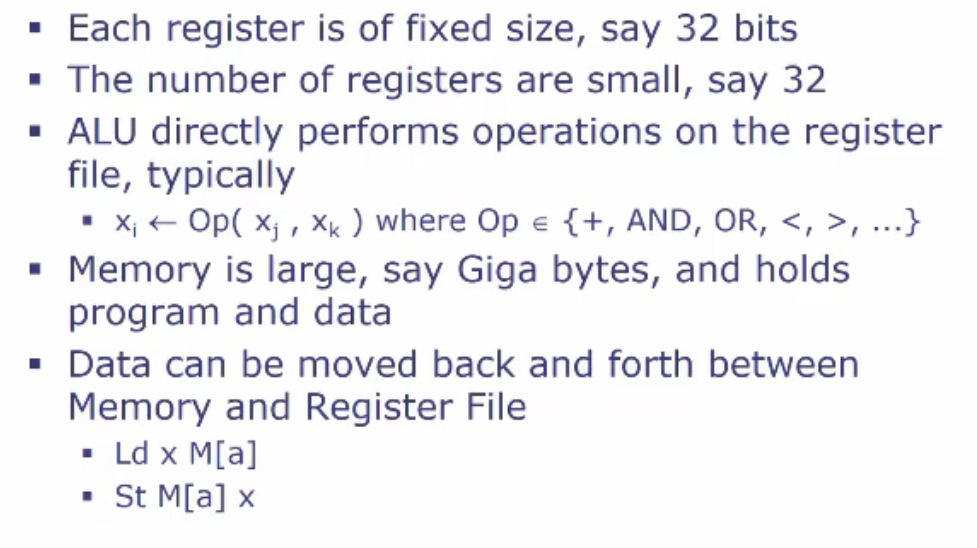

bit->Byte(8 bit,常见存储单位)

字Word通常表示计算机处理的自然单位（例如指针），在32位下就是4Byte大小的指针(`4*8`)，64位下就是8Byte大小的指针(`8*8`)

一般算法还需要判断，因此就产生了如下四大类Instruction

* 传统计算：ALU（Register to ALU to Register）
* Load (memory to Register)
* Store(Register to memory)
* Control Transfer operation
  * 考虑一个操作if(xi < xj)
  * Control Transfer Operation的作用就是 xi < xj go to label l
  * 这里，label l指的是程序中的一个位置。一般程序都是线性存储起来，线性执行的，例如`0,1,2,3,...,l,...`，如果第三步是一个Control transfer operation，那么它将控制程序继续执行第4步，还是第l步。

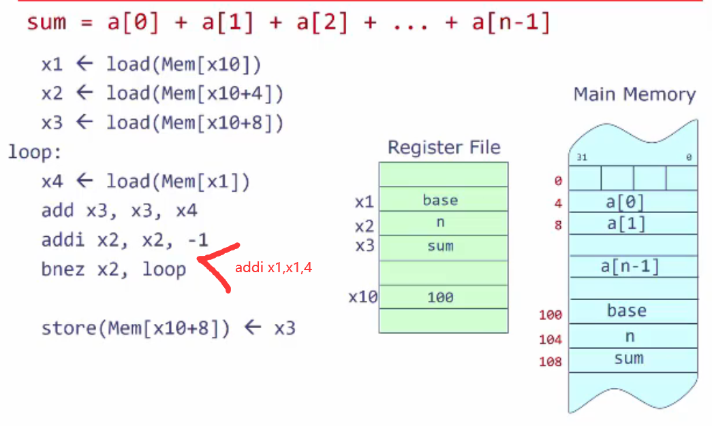

考虑一个n个数的加法，它在底层的实现应该是这样的

* 首先，register可能存不下n个数，因此需要存在memory里面

* memory中需要存储n个数，这n个数开始的位置base，这n个数的数量n，以及最终作为结果的sum

* 同时，为了能够load sum，n，base，以及将sum结果写回memory，我们需要一个固定地址，对这个固定地址施加bias来访问，这里存为100(x10)

​	对于每次加法，我们都需要base，n和sum，因此我们首先将这三个load进register file

* 然后，我们只需要将需要加的值依次load进register file，然后加到sum上面即可

上图实现了n个数加法的过程，其中

- addi(add immediate)是risc-V指令，表示寄存器值与一个立即数（常数）相加
- bnez(branch if not equal to zero)`bnez register, label`作用是检查一个寄存器值是否为零，不为0就跳转到标签(loop)

## Usage pattern of Different Types of Memory Access

### Accesssing Instructions From Memory

当程序运行时，CPU必须从内存中获取指令。这个过程是连续的，因为每条指令都需要进入CPU进行解码和执行。

**Typical Pattern:** 顺序访问(Sequential Access)，程序计数器 (PC) 递增以获取下一条指令，当遇到分支或跳转指令时，CPU 需要从非顺序内存位置获取数据，如果处理不当，可能会影响性能。

此模式很重要，因为 CPU 必须不断获取指令才能知道要执行哪些操作。高效的指令读取对于 CPU 的整体性能至关重要。

### Accessing Data from memory

程序在执行过程中需要从内存读取（加载）和写入（存储）数据。这包括访问变量、数组、对象等。

**Typical Patter:** 可以是随机的或顺序的。例如，访问数组的元素（顺序）或访问分散的变量（随机）。

由于内存层次结构（寄存器、缓存、RAM），数据访问模式会显着影响性能。高效的数据访问和引用位置对于性能优化至关重要。

经常访问的变量可以缓存在寄存器或一级缓存中，以减少访问时间。

### Using Stack for temporary storage

Using Stack for temporary storage things that don't necessarily fit into our register.

堆栈是一个特殊的内存区域，用于动态存储临时数据，例如函数参数、局部变量和返回地址。每个函数调用都会将一个新帧压入堆栈，包括返回地址、参数和局部变量。函数特定的变量存储在堆栈上，并在函数返回后清理，提供动态和临时存储解决方案。

**Typical Pattern:** 后进先出 (LIFO) 模式。数据按相反顺序压入堆栈并弹出。

堆栈对于函数调用和返回、管理局部变量以及处理递归至关重要。它允许自动管理有组织的临时存储。

### 总结

* 为什么认为这三个操作是内存的基础操作：
  * Instruction Fetch：如果不取指令，CPU 就无法执行任何操作。这是指令周期的第一步。
  * Data Access: 数据操作是任何计算的核心。读取和写入数据是程序执行的基础。
  * Stack Usage: 堆栈支持函数调用和本地存储，从而实现结构化编程、递归和高效的内存管理。
* 从性能方面考虑：
  * Instruction and Data Caching: 了解这些模式有助于设计和优化缓存，以减少访问延迟并提高速度。
  * Memory Hierarchy: 了解在什么时间数据和指令是如何被访问的，能够让我们更好的利用内存结构空间
  * 程序表现出空间和时间局部性。顺序获取指令（空间局部性）和重用数据（时间局部性）可增强缓存性能。

## Memory Hierarchy

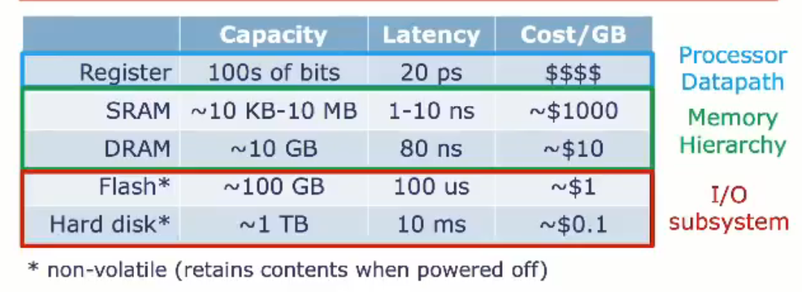

Memory的架构通常分为三个部分(Register, Memory, I/O)，如表所示，其容量和延迟逐步变大，而存储价格逐步变小。

### Register

Register 通常用作数据通路(Processor Datapath)的作用，寄存器是处理器内最快的存储单元，用于**存储指令执行过程中的临时数据和中间结果**，确保数据处理的高效性。（包括算术指令逻辑指令，能直接操作寄存器中的数据；也会存储处理器的状态信息）

### Memory & Cache

#### Memory

SRAM通常用作Cache，DRAM通常作为我们一般提到的内存。DRAM使用电容组成，而SRAM使用晶体管组成，这使得前者速度慢，功耗低，价格低，后者速度快，功耗高，价格高。

> **SRAM**对于输入地址直接通过Address Decoder解码选择特定存储单元，读操作立即进行(每个存储单元是一个由6个晶体管组成的锁存器，数据始终保持有效状态)，数据被直接通存储单元读出并传输到输出缓冲器，完成读取操作。写入同理
>
> **DRAM**：DRAM是通过电容来存储一个位上的状态的，通常来说电容如果是满电压(Vcc V)就是存的1，是无电压(0V)就是存的0。DRAM读取一行的方式是通过Bit Line与电容连通来读取的，Bit Line通常被Precharge为Vcc/2，这样与电容连通时，只需要判断BitLine的电压是上升还是下降就可以知道当前位是1还是0了。这个微小的变化通常需要放大器来捕捉。
>
> * 首先进行Row Address寻址
> * 对这一行数据Precharge，确保Bit Line处于已知状态
> * Row Activation： 通过Bit Line，将整行数据读入行缓冲器(Row buffer)，此数据被数据放大器放大(Sense Amplifier)
> * 列地址选择具体的存储单元，数据从行缓冲器传输到输出缓冲器，完成读取
> * 有时，你需要先等待刷新操作（Refresh）：为了防止电容漏电导致数据丢失，DRAM 需要定期刷新。刷新操作通常通过专用的刷新控制器完成，逐行刷新所有存储单元。
>
> 对于写入也是一样的：Precharge，Row Activation，列地址选择存储单元，新数据写入行缓冲器，行缓冲器写回存储单元。

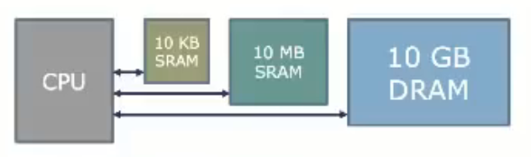

上图中组织多级Memeory的方法，CPU能够同时看到多个Memory，这对形成一个通用框架是十分不利的，因为这意味着我们将每个数据应该放在哪个memory的决定权给了程序员（这会导致ISA指令集变得更为复杂），同时这会导致不同架构的CPU（例如有的CPU有三级缓存，也就是三个SRAM）对应的High Level代码不同，其指令集也不同。

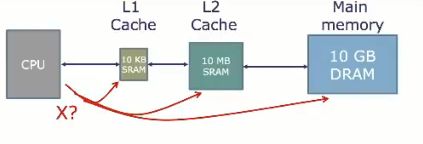

因此，目前通用的架构实际上是一个线性架构，CPU只能看到L1 Cache，L1 Cache只能从L2 Cache读取，以此类推。

CPU会依次查询L1，L2，Main Memory直到找到所需的Data。

> Why Caches Work?
>
> Cache能work是基于两个可预测的性质
>
> * 时间局部性(Temporal locality)：如果一个location最近被访问了，那么它在不远的将来很有可能被再次访问(reused)
> * 空间局部性(Spatial locality): 如果一个location最近被访问了，那么它附近的数据在不远的将来很有可能被访问。

#### Caches

==接下来介绍的Cache包括如下几个主要部分，以能够让你自主设计一个cache==

* One-way Direct mapped cache
* write back: Back end memory(Usually DRAM) is updated only when a line is evicted from the cache
* write miss allocate: cache is updated on store miss
* blocking cache: cache process one requrst at at time

##### Cache hit与Cache miss

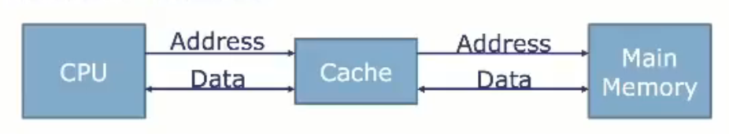

当CPU需要一个数据时，它首先向cache发送一个地址以寻找这个地址上的数据

* 如果在cache中找到了这个地址上的数据，它将会很快返回，被称为**cache hit**
* 如果在cache中没有找到这个地址上的数据，它将会向它的上一级cache/memory询问这个address，然后将获得的数据发回CPU，并将这个数据保留在Cache（replace somt other data)，这个过程称为**cache miss**

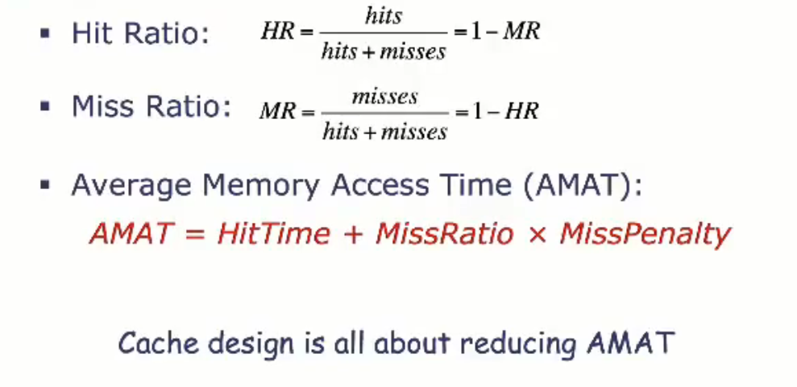

考虑一个具体的例子，如下图，单cache架构，cache访问需要4时钟周期，memory访问需要100时钟周期，下图列出了不同的Hit Ratio带来的平均内存访问时间。一般来说，普通的程序能够达到80%的Hit ratio，而精心设计过的程序能够达到99%的Hit Ratio，因此Cache架构确实能够有效的提升程序的速度。

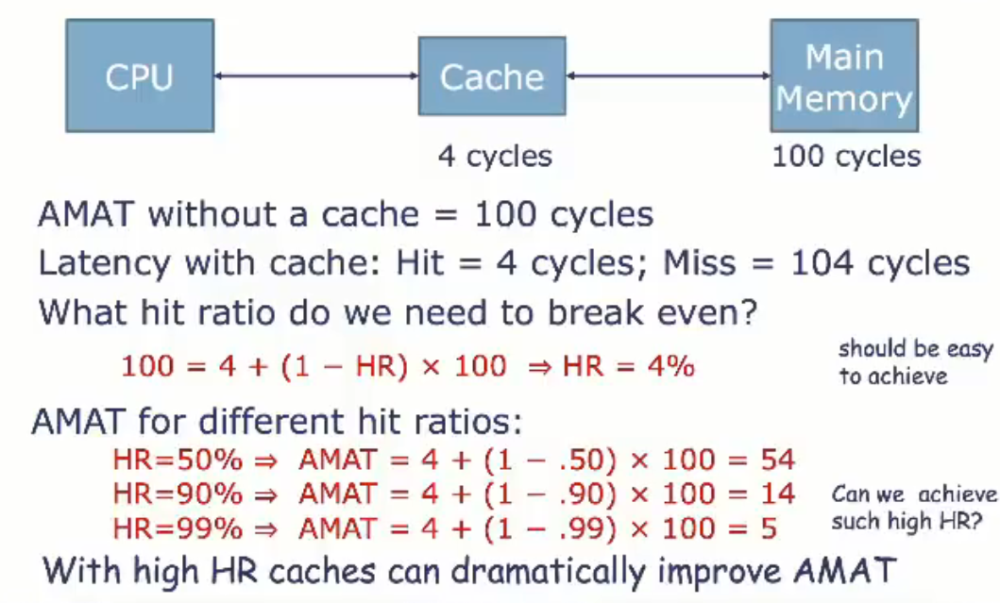

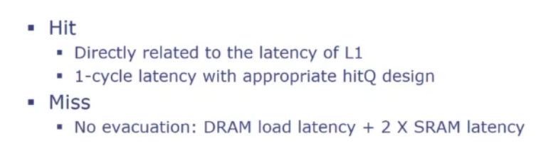

##### Cache line的结构

> 需要明确的是，cache的结构是由若干个cache line组成的，每个cache line包括了一个原本memory中的开始地址与一个cache line长度的data
>
> **cache中的一行（cache line）** 包含了多个字节的数据，这些数据是从主存中连续的一块地址范围内读取的。每一行缓存（cache line）不仅存储了数据，还存储了一个标签（tag）用于标识这些数据在主存中的地址范围。具体来说：
>
> ### Cache Line 的结构
>
> 1. **Tag（标签）**：
>    - 标签用于标识缓存行中数据在主存中的起始地址或块地址。它帮助缓存控制器识别特定缓存行对应主存中的哪个数据块。
>    - 当CPU请求一个数据时，缓存控制器会检查标签，以确定请求的数据是否在缓存中。
> 2. **Data（数据）**：
>    - 缓存行中的数据部分包含若干个字节的数据。这些数据是从主存中连续地址范围内读取的。
>    - 通常，一个缓存行包含32字节、64字节或128字节的数据，这取决于具体的缓存设计。
> 3. **Metadata（元数据）**：
>    - 缓存行还包含一些元数据，比如有效位（valid bit），用于指示缓存行是否包含有效数据。
>    - 在多核处理器中，缓存行可能还包含其他元数据，例如用于缓存一致性协议的状态位。
>
> ### 缓存行示例
>
> 假设缓存行大小为64字节，并且CPU请求的数据地址为`0x1000`，以下是缓存行的示例：
>
> - **Tag**：`0x10`（假设块地址为0x10）
> - **Data**：包含地址`0x1000`到`0x103F`范围内的64字节数据
> - **Valid Bit**：表示数据是否有效
>
> ### 数据访问过程示例
>
> 1. **CPU请求数据**：
>    - CPU请求地址为`0x1000`的数据。
> 2. **缓存查找**：
>    - 缓存控制器使用地址`0x1000`中的部分位找到对应的缓存行，然后比较标签。
>    - 假设缓存行大小为64字节，那么地址的低6位（表示64字节的偏移）不参与标签比较。
> 3. **标签比较**：
>    - 缓存控制器比较缓存行的标签（如`0x10`）和地址`0x1000`的高位部分。
>    - 如果标签匹配且有效位为真，则表示缓存命中（cache hit）。
> 4. **数据返回**：
>    - 如果缓存命中，缓存控制器从对应的缓存行中读取地址`0x1000`的数据并返回给CPU。
>    - 如果缓存未命中（cache miss），则缓存控制器从主存中读取包含地址`0x1000`的64字节数据块，填充到缓存行，并更新标签，然后将数据返回给CPU。

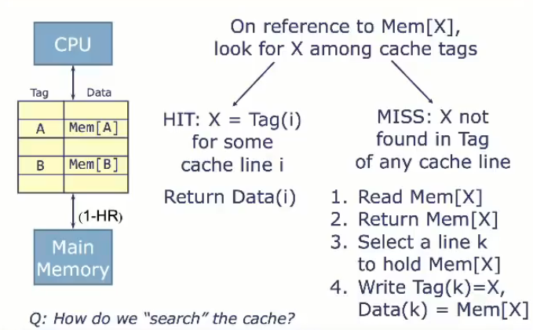

这里体现了每个Cache实际上存储的是一个(address， data) 对，

* 当Cache hit时，我们需要的地址X在cache中第i行(cache line i)，因此直接返回
* 当Cache miss时，我们需要首先从memory中读取这个数据，然后在Cache中选择一行k用以存储。

##### Cache的内部结构

考虑一个64位系统（这意味着地址空间是64位）

现有一个32KB的缓存，缓存每个缓存行大小为64byte，

##### Write Policy

对于CPU写入，此处有三种策略

* Write-through : CPU写入Cache，同时立即写入memory。这种方法下Memory总是拥有最新的content
* Write-back： CPU写入Cache，但是不立即写入memory。memory可能拥有滞后的信息。
  * 首先，使用一个dirty bit来标记当前cache line是否已经被修改过
  * 一旦当前cache line发生replacement，同时dirty bit标记这个cache line已经被修改过，

##### 地址映射方式

==事实上，当我们已经有了一个地址之后，我们不太可能一个一个与cache中的地址比较，因此，不同的cache映射方式能够帮助我们快速找到不同的地址==

###### **Direct-Mapped Caches**

直接映射缓存

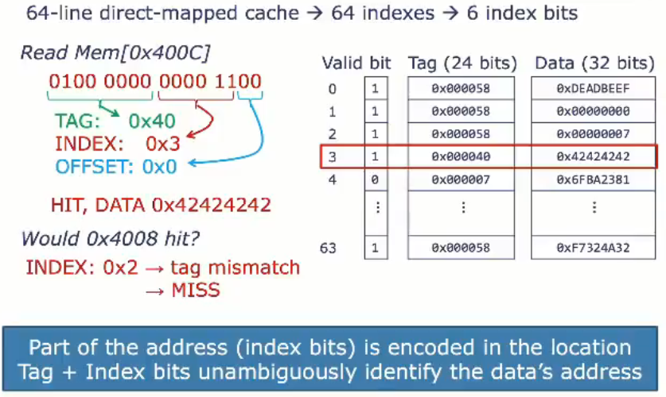

具体来说，一个Cache line被分为了三个大部分: valid bit, Tag, Data

* valid bit 表示该缓存行中的数据是否有效
* Tag表示当前存的数据属于哪一个内存块
* Data是cache中存在的数据

因此，一个Cache line的大小在本假设中为64kb + 49bit + 1bit

当CPU想要获取某一个数据时，它首先将64位地址分解为如下图的Tag，INDEX（应该在第几个缓存行）和OFFSET（应该在DATA中的哪个位置，注意这里offset是以byte为基本单位的而非bit，也就是寻找第几个字节）。

然后，对缓存中第INDEX行直接比较Tag，Tag相同为Cache Hit。

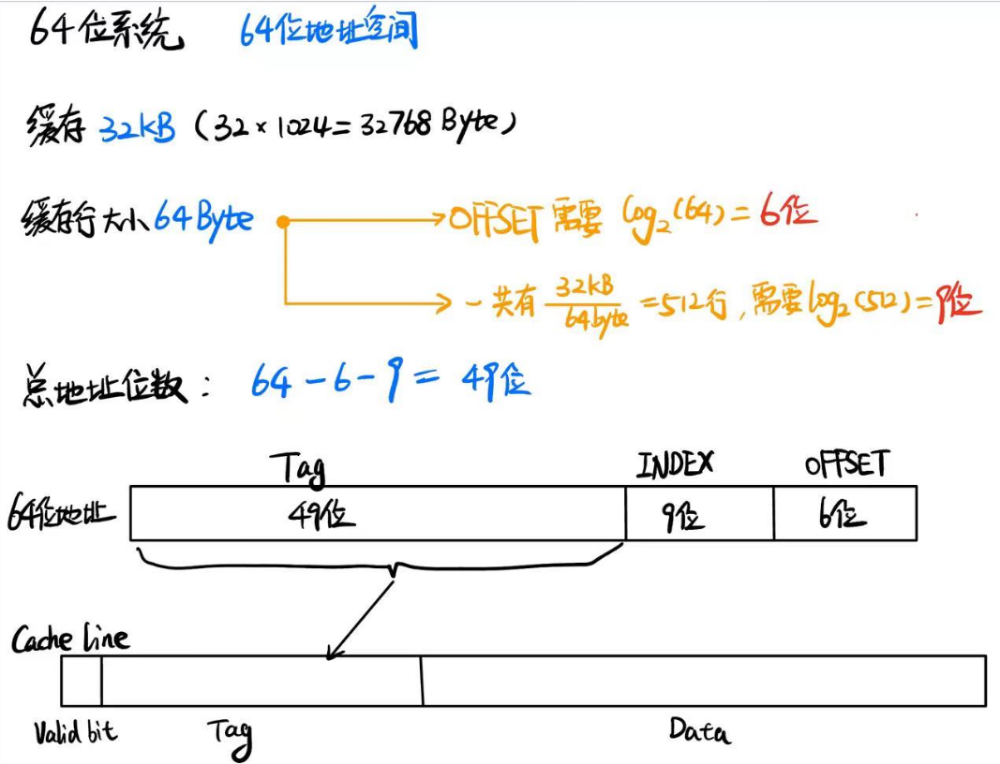

###### N-way Set Associative Cache

在上面的直接映射方式中，一个问题就是不同内存块同一个bias的数据会频繁冲突，因此一个新的N-way架构被提了出来

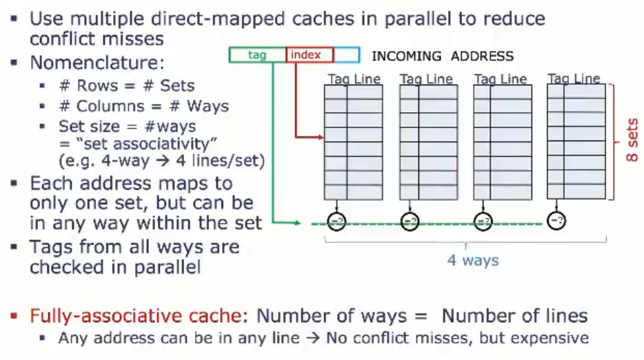

N路组相联缓存是一种折中方案，介于直接映射缓存和全相联缓存之间。它将缓存划分为若干组（Set），每组包含多个缓存行（Way）。每个内存地址会被映射到某一个特定的组中，但在组内可以存放在任意一个缓存行中，这样可以减少缓存冲突，提高缓存命中率。

在上图所示结构中，每个way中的cache line个数被称为set，cache块个数被称为way，因此上图是一个`8-way 4-set associative cache`

当`Number of ways == Number of Lines`的时候，称为Fully Associative cache

在这个框架下，每一个地址被映射到其中一个set中，当在cache中寻址时，所有ways中的对应位置的tags都会被检查。

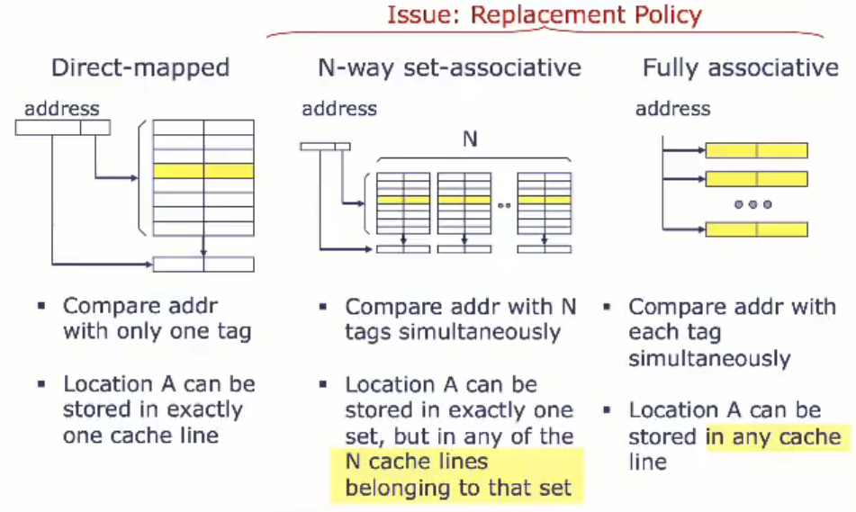

对于N-way Set Associative cache，它的load和store与1 way的类似，唯一不同的地方在于cache miss的时候，应该选择哪一个way的对应cache line进行替换

LRU策略是最常见的缓存替换策略之一。它选择最近最少使用的缓存行进行替换。具体实现方式可能涉及使用计数器或栈来跟踪每个缓存行的使用历史。

除了LRU之外，还有其他替换策略。例如：

- FIFO（First In, First Out）：替换最早进入该组的缓存行。
- 随机（Random）：随机选择一个缓存行进行替换。
- LFU（Least Frequently Used）：替换使用频率最低的缓存行。

###### Fully associative cache

全相联缓存（Fully Associative Cache）是一种缓存结构，其中任何内存块可以存储在缓存中的任何位置。相比于直接映射缓存和组相联缓存，全相联缓存的灵活性最高，因为它不受特定索引的限制。这种缓存结构常用于小型高速缓存中，例如CPU的L1缓存。

==因此，Fully associative cache仅将64位地址分为Tag和OFFSET，而不加入INDEX也就是cache line的指定==

全相联缓存（Fully Associative Cache）需要对所有缓存行进行查询，以确定是否存在匹配的标签。因此，全相联缓存的查询过程相对复杂，因为每次访问都要比较所有缓存行的标签。这种结构使得缓存的灵活性最大，但硬件实现和查询效率方面相对较复杂。

##### blocking cache

cache每秒要面对上千次询问，cache hit的我们可以不管，应对cache miss就有很多方式了，因为会存在一个情况，按顺序接受request，第一个miss了，第二个hit了，这个时候实际上暂时搁置第一个request是正确的，这就引出了cache blocking 策略

**阻塞缓存（Blocking Cache）**

1. **单次未命中处理**：
   - 阻塞缓存一次只能处理一个未命中（miss）请求。当发生缓存未命中时，缓存必须等待内存响应，处理完当前未命中请求后才能接受新的处理器请求。
2. **等待内存响应**：
   - 在等待内存响应期间，缓存停止处理来自处理器的其他请求。这意味着在未命中处理完成之前，处理器的其他内存访问请求将被阻塞。

**非阻塞缓存（Non-blocking Cache）**

1. **多次未命中处理**：
   - 非阻塞缓存能够处理多个未命中请求。它可以在等待内存响应的同时继续处理其他来自处理器的请求。
2. **并行处理**：
   - 当发生缓存未命中时，非阻塞缓存不会阻塞处理器的其他请求，而是可以并行处理多个未命中请求，提高了系统的并行度和整体性能。

### Flash& Hard disk

