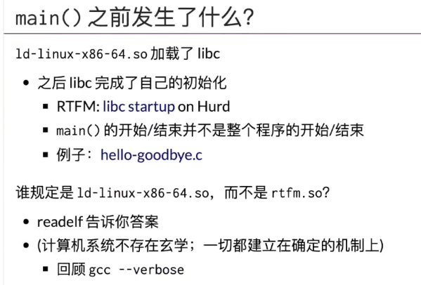

本笔记由

Linux Kernel Development

与

> 南京大学《操作系统：设计与实现》 
>
> https://www.bilibili.com/video/BV1Cm4y1d7Ur/?spm_id_from=333.788&vd_source=61f56e9689aceb8e8b1f51e6e06bddd9

总结而来


## 1. WSL环境配置

如果你不想装双系统，直接跟着

> https://blog.csdn.net/qq_39316962/article/details/139927197

即可


## 2.概述

建议看课

讲述了从最早的单任务打孔纸计算机，到多任务打孔纸计算机与Fortran命令，到内存足够存储多于一个任务的计算机，到能够切换任务的调度程序（以往处理器计算完还需等待其在打孔纸上输出完成）,到多用户操作系统（现代OS雏形，Multics，基于中断，定时切换任务而非等任务做完切换），到现代操作系统的father：UNIX（单用户操作系统）。

简单来说，当计算机完成固件初始化之后，它就成为了一个interrupt/trap/fault handler


## 3.程序

### 程序是状态机

这里就写几个比较典型的操作

```c
# include<stdio.h>

#define REGS_FOREACH(_) _(X) _(Y)
#define RUN_LOGIC       X1 = !X && Y;\
                        Y1 = !X && !Y;
#define DEFINE(X)       static int X, X##1;
#define UPDATE(X)       X = X##1;
#define PRINT(X)        printf(#X " = %d; ", X);

int main(){

        REGS_FOREACH(DEFINE);
        while(1){
                RUN_LOGIC;
                REGS_FOREACH(PRINT);
                REGS_FOREACH(UPDATE);
                putchar('\n');sleep(1);
        }

}
```

上面是一个状态机的代码，拥有X,Y两个寄存器，他们的状态循环为

$0,0\rightarrow 0,1\rightarrow 1,0\rightarrow 0,0$

用vim打开(`i`,`esc`,`:wq`)

然后可以使用gcc编译，`:!`为在vim中使用外部命令

`:!gcc basic.c -o basic`,`./basic`


这里的宏定义可能难以阅读，gcc提供了-E参数展示预处理之后的结果

`gcc -E basic.c`


### 什么是二进制程序


指令分为两种，计算与syscall。

例如，你想计算并输出一个图片，进程能够帮助你计算图片中每个像素的rgb值，但是输出的操作进程是做不到的（因为访问不了对应资源）。因此，必须将自己的计算结果和进程所有的状态转移给os，让os做。


总结一下，程序就是状态机。

你可以看作是有两个层面的，即C语言层级和硬件层级

C语言层级的状态机是抽象的，variable和stack frame组成的状态机。

而硬件层面的状态机是底层的，即为(M,R)的状态转换，当然是通过calculator转换的。

> (M,R)指的是Memory and Register


### 编译与优化

如果你将程序理解成状态机的话，那么你也能理解编译。

编译是将C语言层级的抽象状态机转化到硬件层面（汇编）状态机的过程。


* 正确的编译：C代码中所有不可优化的部分都被照搬到汇编状态机中
  * 不可优化的部分其实就是`asm volatile`,它既可以代表一个状态转移过程不能改变，也可以代表一个值不可被忽略（例如`volatile int x`，如果后续没有使用x那么编译器就会自动忽略这个值，但是如果这个值是一个寄存器值，我们就希望使用volatile阻止编译器优化。换句话说，我希望改变寄存器的值，并且这个寄存器在后文没有显式调用，你就会使用volatile）。


所谓的rewriting包括

* 内联
* 常量传播
* 代码消除


考虑一个简单的程序

```c++
extern int g;

void foo(){
    g++;
    g++;
}
```

编译器不会删除这个`g`，因为他是一个全局变量，编译器认可其潜在被使用的可能性。

但是对于`foo()`中的两次自加，编译器会做优化

```bash
root@Stuckedcat-4090:/home/stuckedcat/os/class2Demo# gcc -O2 -c compileOptimDemo.c && objdump -d compileOptimDemo.o

compileOptimDemo.o:     file format elf64-x86-64


Disassembly of section .text:

0000000000000000 <foo>:
   0:   f3 0f 1e fa             endbr64
   4:   83 05 00 00 00 00 02    addl   $0x2,0x0(%rip)        # b <foo+0xb>
   b:   c3                      retq
```

使用O2优化(compile only no link) 并反编译(decompile)obj文件为汇编之后，可以发现编译器直接优化为`g+=2`


编译器不仅会顺序优化（也就是合并状态机），它其实也会乱序优化

例如，此时加入一个volatile（编译器不可优化指令）

```c
extern int g;

void foo(int x){
    g++;
    asm volatile("nop" : : "r"(x));
    g++;
}
```

```bash
root@Stuckedcat-4090:/home/stuckedcat/os/class2Demo# gcc -c -O2 compileOptimDemo.c && objdump -d compileOptimDemo.o

compileOptimDemo.o:     file format elf64-x86-64


Disassembly of section .text:

0000000000000000 <foo>:
   0:   f3 0f 1e fa             endbr64
   4:   90                      nop
   5:   83 05 00 00 00 00 02    addl   $0x2,0x0(%rip)        # c <foo+0xc>
   c:   c3                      retq
```

此时编译器仍然能够将两个g++合并


能够阻止这一优化的方式有两个：compiler barrier与memory barrier

**compile barrier**

```c
extern int g;

void foo(int x){
    g++;
    asm volatile("nop" : : "r"(x) : "memory");
    g++;
}
```

```bash
root@Stuckedcat-4090:/home/stuckedcat/os/class2Demo# gcc -c -O2 compileOptimDemo.c && objdump -d compileOptimDemo.o

compileOptimDemo.o:     file format elf64-x86-64


Disassembly of section .text:

0000000000000000 <foo>:
   0:   f3 0f 1e fa             endbr64
   4:   83 05 00 00 00 00 01    addl   $0x1,0x0(%rip)        # b <foo+0xb>
   b:   90                      nop
   c:   83 05 00 00 00 00 01    addl   $0x1,0x0(%rip)        # 13 <foo+0x13>
  13:   c3                      retq
```

此时可以发现，compile barrier前后块的相对执行顺序保持一致（但是前后块内部实际上是可以执行优化的）。


**memory barrier**

在并发一节会具体说明

```c
extern int g;
void foo(int x){
    g++;
    __sync_synchronize();
    g++;
}
```

```bash
root@Stuckedcat-4090:/home/stuckedcat/os/class2Demo# gcc -c -O2 compileOptimDemo.c && objdump -d compileOptimDemo.o

compileOptimDemo.o:     file format elf64-x86-64


Disassembly of section .text:

0000000000000000 <foo>:
   0:   f3 0f 1e fa             endbr64
   4:   83 05 00 00 00 00 01    addl   $0x1,0x0(%rip)        # b <foo+0xb>
   b:   0f ae f0                mfence
   e:   83 05 00 00 00 00 01    addl   $0x1,0x0(%rip)        # 15 <foo+0x15>
  15:   c3                      retq
```


further reading包括了 证明一个永不出错的编译器(2) 以及 使用已有编译器生成更好的编译器(3)。


### 操作系统中的程序

#### 程序的本质是计算与syscall

本质上是`程序 = calculation -> syscall -> calculation -> syscall ...`

os收编了所有的硬件软件资源，这意味着

* 只能用操作系统允许的方式访问操作系统中的对象
* 操作系统管理所有的进程（状态机）


在下面的例子中，进程的两次syscall都被否决了。

```c
#include<unistd.h>
#include<stdio.h>
#include<fcntl.h>

void try_open(const char* fname){
    int fd = open(fname, O_RDWR);
    printf("open(\"%s\") returns %d\n", fname, fd);
    
    if(fd < 0){
        perror(" FAIL");
    }else{
        printf(" SUCCESS!\n");
        close(fd);
    }
}

int main(){
    
    // access to something not exist
    try_open("/something/not/exist");
    
    // access to hard disk(no authority)
    try_open("/dev"); // hard drive
}
```

```bash
root@Stuckedcat-4090:/home/stuckedcat/os/class2Demo# gcc syscallDemo.c -o syscallDemo.o
root@Stuckedcat-4090:/home/stuckedcat/os/class2Demo# ls
basic  basic.c  basic.o  compileOptimDemo.c  compileOptimDemo.o  syscallDemo.c  syscallDemo.o
root@Stuckedcat-4090:/home/stuckedcat/os/class2Demo# ./syscallDemo.o
open(" /something/not/exist ") returns -1
 FAIL: No such file or directory
open(" /dev ") returns -1
 FAIL: Is a directory
```


#### 程序的一切行动都是确定的(strace)


程序的开头是确定的

```bash
root@Stuckedcat-4090:/home/stuckedcat/os/class2Demo# ls
basic  basic.c  basic.o  compileOptimDemo.c  compileOptimDemo.o  syscallDemo.c  syscallDemo.o
root@Stuckedcat-4090:/home/stuckedcat/os/class2Demo# gdb basic.o
GNU gdb (Ubuntu 9.2-0ubuntu1~20.04.2) 9.2
Copyright (C) 2020 Free Software Foundation, Inc.
License GPLv3+: GNU GPL version 3 or later <http://gnu.org/licenses/gpl.html>
This is free software: you are free to change and redistribute it.
There is NO WARRANTY, to the extent permitted by law.
Type "show copying" and "show warranty" for details.
This GDB was configured as "x86_64-linux-gnu".
Type "show configuration" for configuration details.
For bug reporting instructions, please see:
<http://www.gnu.org/software/gdb/bugs/>.
Find the GDB manual and other documentation resources online at:
    <http://www.gnu.org/software/gdb/documentation/>.

For help, type "help".
Type "apropos word" to search for commands related to "word"...
Reading symbols from basic.o...
(gdb) starti
Starting program: /home/stuckedcat/os/class2Demo/basic.o

Program stopped.
0x00007ffff7fd0100 in _start () from /lib64/ld-linux-x86-64.so.2
(gdb) info proc mappings
process 1219
Mapped address spaces:

          Start Addr           End Addr       Size     Offset objfile
      0x555555554000     0x555555555000     0x1000        0x0 /home/stuckedcat/os/class2Demo/basic.o
      0x555555555000     0x555555556000     0x1000     0x1000 /home/stuckedcat/os/class2Demo/basic.o
      0x555555556000     0x555555557000     0x1000     0x2000 /home/stuckedcat/os/class2Demo/basic.o
      0x555555557000     0x555555559000     0x2000     0x2000 /home/stuckedcat/os/class2Demo/basic.o
      0x7ffff7fc9000     0x7ffff7fcd000     0x4000        0x0 [vvar]
      0x7ffff7fcd000     0x7ffff7fcf000     0x2000        0x0 [vdso]
      0x7ffff7fcf000     0x7ffff7fd0000     0x1000        0x0 /usr/lib/x86_64-linux-gnu/ld-2.31.so
      0x7ffff7fd0000     0x7ffff7ff3000    0x23000     0x1000 /usr/lib/x86_64-linux-gnu/ld-2.31.so
      0x7ffff7ff3000     0x7ffff7ffb000     0x8000    0x24000 /usr/lib/x86_64-linux-gnu/ld-2.31.so
      0x7ffff7ffc000     0x7ffff7ffe000     0x2000    0x2c000 /usr/lib/x86_64-linux-gnu/ld-2.31.so
      0x7ffff7ffe000     0x7ffff7fff000     0x1000        0x0
      0x7ffffffde000     0x7ffffffff000    0x21000        0x0 [stack]
(gdb)
```




程序的初始化过程是确定的，包括main的初始化过程

```c++
#include<stdio.h>

__attribute__((constructor)) void hello(){

        printf("Hello, World\n");
}
__attribute__((destructor)) void goodbye(){
        printf("Goodbye, Cruel OS World!\n");
}


int main(){

}
```

```bash
gcc libc_startup.c -o libc_startup.o && ./libc_startup.o
Hello, World
Goodbye, Cruel OS World!
```


甚至，程序的链接是确定的，你可以通过更改二进制文件的ld-linux-x86-64.so的链接到任意的文件任意的后缀(P2 1:37:13)。


既然计算机就是状态机，甚至启动编译这些都是已经写入文件的前置状态，那么我们就应该有一些方法来准确的跟踪。


这个工具就是==`strace`==，你可以通过strace看到一个程序执行的所有系统调用，而每一个系统调用都对应了一个syscall指令。

```bash
root@Stuckedcat-4090:/home/stuckedcat/os/class2Demo# strace ./libc_startup.o
execve("./libc_startup.o", ["./libc_startup.o"], 0x7ffd7725e240 /* 29 vars */) = 0
brk(NULL)                               = 0x55b6642be000
arch_prctl(0x3001 /* ARCH_??? */, 0x7ffd0ee66ba0) = -1 EINVAL (Invalid argument)
access("/etc/ld.so.preload", R_OK)      = -1 ENOENT (No such file or directory)
openat(AT_FDCWD, "/usr/local/cuda/lib64/tls/haswell/x86_64/libc.so.6", O_RDONLY|O_CLOEXEC) = -1 ENOENT (No such file or directory)
stat("/usr/local/cuda/lib64/tls/haswell/x86_64", 0x7ffd0ee65df0) = -1 ENOENT (No such file or directory)
openat(AT_FDCWD, "/usr/local/cuda/lib64/tls/haswell/libc.so.6", O_RDONLY|O_CLOEXEC) = -1 ENOENT (No such file or directory)
stat("/usr/local/cuda/lib64/tls/haswell", 0x7ffd0ee65df0) = -1 ENOENT (No such file or directory)
openat(AT_FDCWD, "/usr/local/cuda/lib64/tls/x86_64/libc.so.6", O_RDONLY|O_CLOEXEC) = -1 ENOENT (No such file or directory)
stat("/usr/local/cuda/lib64/tls/x86_64", 0x7ffd0ee65df0) = -1 ENOENT (No such file or directory)
openat(AT_FDCWD, "/usr/local/cuda/lib64/tls/libc.so.6", O_RDONLY|O_CLOEXEC) = -1 ENOENT (No such file or directory)
stat("/usr/local/cuda/lib64/tls", 0x7ffd0ee65df0) = -1 ENOENT (No such file or directory)
openat(AT_FDCWD, "/usr/local/cuda/lib64/haswell/x86_64/libc.so.6", O_RDONLY|O_CLOEXEC) = -1 ENOENT (No such file or directory)
stat("/usr/local/cuda/lib64/haswell/x86_64", 0x7ffd0ee65df0) = -1 ENOENT (No such file or directory)
openat(AT_FDCWD, "/usr/local/cuda/lib64/haswell/libc.so.6", O_RDONLY|O_CLOEXEC) = -1 ENOENT (No such file or directory)
stat("/usr/local/cuda/lib64/haswell", 0x7ffd0ee65df0) = -1 ENOENT (No such file or directory)
openat(AT_FDCWD, "/usr/local/cuda/lib64/x86_64/libc.so.6", O_RDONLY|O_CLOEXEC) = -1 ENOENT (No such file or directory)
stat("/usr/local/cuda/lib64/x86_64", 0x7ffd0ee65df0) = -1 ENOENT (No such file or directory)
openat(AT_FDCWD, "/usr/local/cuda/lib64/libc.so.6", O_RDONLY|O_CLOEXEC) = -1 ENOENT (No such file or directory)
stat("/usr/local/cuda/lib64", {st_mode=S_IFDIR|0755, st_size=4096, ...}) = 0
openat(AT_FDCWD, "tls/haswell/x86_64/libc.so.6", O_RDONLY|O_CLOEXEC) = -1 ENOENT (No such file or directory)
openat(AT_FDCWD, "tls/haswell/libc.so.6", O_RDONLY|O_CLOEXEC) = -1 ENOENT (No such file or directory)
openat(AT_FDCWD, "tls/x86_64/libc.so.6", O_RDONLY|O_CLOEXEC) = -1 ENOENT (No such file or directory)
openat(AT_FDCWD, "tls/libc.so.6", O_RDONLY|O_CLOEXEC) = -1 ENOENT (No such file or directory)
openat(AT_FDCWD, "haswell/x86_64/libc.so.6", O_RDONLY|O_CLOEXEC) = -1 ENOENT (No such file or directory)
openat(AT_FDCWD, "haswell/libc.so.6", O_RDONLY|O_CLOEXEC) = -1 ENOENT (No such file or directory)
openat(AT_FDCWD, "x86_64/libc.so.6", O_RDONLY|O_CLOEXEC) = -1 ENOENT (No such file or directory)
openat(AT_FDCWD, "libc.so.6", O_RDONLY|O_CLOEXEC) = -1 ENOENT (No such file or directory)
openat(AT_FDCWD, "/etc/ld.so.cache", O_RDONLY|O_CLOEXEC) = 3
fstat(3, {st_mode=S_IFREG|0644, st_size=41229, ...}) = 0
mmap(NULL, 41229, PROT_READ, MAP_PRIVATE, 3, 0) = 0x7fd9b3592000
close(3)                                = 0
openat(AT_FDCWD, "/lib/x86_64-linux-gnu/libc.so.6", O_RDONLY|O_CLOEXEC) = 3
read(3, "\177ELF\2\1\1\3\0\0\0\0\0\0\0\0\3\0>\0\1\0\0\0\300A\2\0\0\0\0\0"..., 832) = 832
pread64(3, "\6\0\0\0\4\0\0\0@\0\0\0\0\0\0\0@\0\0\0\0\0\0\0@\0\0\0\0\0\0\0"..., 784, 64) = 784
pread64(3, "\4\0\0\0\20\0\0\0\5\0\0\0GNU\0\2\0\0\300\4\0\0\0\3\0\0\0\0\0\0\0", 32, 848) = 32
pread64(3, "\4\0\0\0\24\0\0\0\3\0\0\0GNU\0\7\2C\n\357_\243\335\2449\206V>\237\374\304"..., 68, 880) = 68
fstat(3, {st_mode=S_IFREG|0755, st_size=2029592, ...}) = 0
mmap(NULL, 8192, PROT_READ|PROT_WRITE, MAP_PRIVATE|MAP_ANONYMOUS, -1, 0) = 0x7fd9b3590000
pread64(3, "\6\0\0\0\4\0\0\0@\0\0\0\0\0\0\0@\0\0\0\0\0\0\0@\0\0\0\0\0\0\0"..., 784, 64) = 784
pread64(3, "\4\0\0\0\20\0\0\0\5\0\0\0GNU\0\2\0\0\300\4\0\0\0\3\0\0\0\0\0\0\0", 32, 848) = 32
pread64(3, "\4\0\0\0\24\0\0\0\3\0\0\0GNU\0\7\2C\n\357_\243\335\2449\206V>\237\374\304"..., 68, 880) = 68
mmap(NULL, 2037344, PROT_READ, MAP_PRIVATE|MAP_DENYWRITE, 3, 0) = 0x7fd9b339e000
mmap(0x7fd9b33c0000, 1540096, PROT_READ|PROT_EXEC, MAP_PRIVATE|MAP_FIXED|MAP_DENYWRITE, 3, 0x22000) = 0x7fd9b33c0000
mmap(0x7fd9b3538000, 319488, PROT_READ, MAP_PRIVATE|MAP_FIXED|MAP_DENYWRITE, 3, 0x19a000) = 0x7fd9b3538000
mmap(0x7fd9b3586000, 24576, PROT_READ|PROT_WRITE, MAP_PRIVATE|MAP_FIXED|MAP_DENYWRITE, 3, 0x1e7000) = 0x7fd9b3586000
mmap(0x7fd9b358c000, 13920, PROT_READ|PROT_WRITE, MAP_PRIVATE|MAP_FIXED|MAP_ANONYMOUS, -1, 0) = 0x7fd9b358c000
close(3)                                = 0
arch_prctl(ARCH_SET_FS, 0x7fd9b3591540) = 0
mprotect(0x7fd9b3586000, 16384, PROT_READ) = 0
mprotect(0x55b66315c000, 4096, PROT_READ) = 0
mprotect(0x7fd9b35ca000, 4096, PROT_READ) = 0
munmap(0x7fd9b3592000, 41229)           = 0
fstat(1, {st_mode=S_IFCHR|0600, st_rdev=makedev(0x88, 0x6), ...}) = 0
brk(NULL)                               = 0x55b6642be000
brk(0x55b6642df000)                     = 0x55b6642df000
write(1, "Hello, World\n", 13Hello, World
)          = 13
write(1, "Goodbye, Cruel OS World!\n", 25Goodbye, Cruel OS World!
) = 25
exit_group(0)                           = ?
+++ exited with 0 +++
```


### 使用strace展示编译器的过程

我们可以使用strace来展示gcc是如何编译的。

* `-f` strace同时跟踪fork和vfork出来的进程
* `-o xxx.txt`  输出到某个文件
* `-e` execve 只记录execve这类系统调用

```bash
strace -f gcc libc_startup.c 2>&1 | vim -
```

我们使用vim打开查看，可以发现很长，我们利用正则匹配过滤

在vim中

```bash
:%!grep execve
:set nowrap
```

* `:`代表进入vim命令模式
* `%`代表整个文件，vim中的范围标志
* `!`代表接下来的命令是一个外部命令，并将结果替换当前的文件内容
* `grep execve`：搜索包含字符串execve的行
* `:set nowrap`禁用换行


```bash
:%! grep -v ENOENT
```

将不包含ENOENT(e noentry)的行保留在文件中，删除包含的行

ENOENT代表Error No Entry，表示文件或者目录不存在


```bash
:%s/, /\r /g
```

* `:`vim 命令模式下，`%`整个文件，`s` substitute(替换命令)
* `/, /`要替换的模式，也就是将逗号空格替换
* `\r `这是一个换行符，将找到的模式提汉城换行符加上一个空格
* `/g` 这是一个全局标志，代表在每一行中进行全局替换，即替换行中所有出现的匹配模式，而不仅仅是第一个。


我们分解一下


包括图形界面程序，你也可以追踪，本质上都是系统调用

```bash
strace xedit
```


## 4. 多处理器编程

此节包括：

* 并发程序的状态机模型
* 线程库`thread.h`
* 多线程带来的麻烦

### 4.1 回顾

之前讲的单线程程序的状态机转移如下所示


那么，对于现代多处理器，其能处理多个线程，状态机模型是什么


### 4.2 什么是并发

并发的基本单位是线程，也就是这个进程的共享内存中有多个执行流

* 执行流拥有独立的堆栈/寄存器
* 共享全部的内存（指针可以互相引用）

用状态机的视角来理解就好像如下


如上图所示，可以看作每一步会有一个决策器决定执行哪一个thread的下一步（每一次状态机选择一个西安城走一步），此时每个stack frame都只能看到自己的thread的local var以及全局的variable。


### 4.3 一个自定义线程库

以下代码定义了一个最多容纳6400个线程的线程库，包括创建线程，组织其生命周期

==此处规定了线程调用的函数仅被传入一个int参数，这个参数代表在自己的线程池中该线程的id==

注意，因为使用了线程库，编译的时候需要增加`-lpthread`

```c
# include<stdlib.h>
# include<stdio.h>
# include<stdatomic.h>
# include<assert.h>
# include<unistd.h>
# include<pthread.h>


# define NTHREAD 6400		// maximum number of threads


//  possible states of a thread(free, live or dead)
// T_FREE explicitly set to 0, others automatically increment to 1 and 2
// T_FREE for not in use
// T_LIVE for thread is current running
// T_DEAD for thread has completed its execution
enum {T_FREE = 0, T_LIVE, T_DEAD,};

// contains a pthread handle, ID, status 
// and a function pointer for the thread's entry function
struct thread{
    int id, status;
    pthread_t thread;
    // a ptr to a funciton who takes an `int` as argument and returns void
    // similar to how you might store a method in C++
    // syntax: return_type (*pointer_name)(parameter_types);
    void (*entry)(int);
};

// tpool is an array of 'thread' structure
// tptr is "thread pointer to current position"
// In c u need to use `struct` keyword when declaring a variable of struct type
struct thread tpool[NTHREAD], *tptr = tpool;


// takes a thread structure as an argument
// calls thread's entry function and returns 'NULL'
// This function is passed to `pthread_create`

// this function return a ptr of (void*)
void *wrapper(void *arg){
    //  In C, you can name a variable the same as the struct type. The context (struct definition vs. variable declaration) makes it clear which is which.
    struct thread *thread = (struct thread *)arg;
    thread->entry(thread->id);
    return NULL;
}

// `create` take a function pointer fn
// Better with void create(void (*fn)(int))
void create(void *fn){
    
    // 1. Ensures there is room in the thread pool
    assert(tptr - tpool < NTHREAD);
    // 2. Initialize a new thread structure with a unique ID
    // The . notation is used for designated initializers in C, allowing specific members of the struct to be initialized.
    // Initializes the struct and assigns it in one step
    *tptr = (struct thread){
        .id = tptr - tpool + 1,
        // 3. Sets its status to live 
        .status = T_LIVE,
        // 4. assigns the entry function
        .entry = fn,
    };
    
	// create a new pthread, passing wrapper function and thread structure
    // pthread_create(pthread_t *thread, const pthread_attr_t *attr,void*(*start_routine)(void* ), void *arg);
    // pthread_t *thread: Pointer to the pthread_t structure that will hold the thread ID.
	// const pthread_attr_t *attr: Thread attributes (NULL for default attributes).
	// void *(*start_routine)(void *): Function to be executed by the thread.
	// void *arg: Argument to be passed to the start_routine function.
    // only one parameters allowed to pass,  typically encapsulate the parameters in a structure and pass a pointer to this structure.
    //The thread function then casts the void * argument back to a pointer to the structure and accesses the members of the structure.
    // thread function's parameters is forced to set to void*, so is return type. which means it must look like
    // void* thread_function(void* para){
    //		set (void*) para to pointer of your structure
	//} 
    pthread_create(&(tptr->thread), NULL, wrapper, tptr);
    ++tptr;
}


// iterates over all threads in the pool and joins any live threads
// ensuring they complete execution before setting status to dead
void join(){
    for(int i = 0; i < NTHREAD; i++){
        struct thread *t = &tpool[i];
        if(t->status == T_LIVE){
            // waits for the specified thread to terminate
            // second parameter can receive the return value(void*) and transfer to what u want
            pthread_join(t->thread, NULL);
            t->status = T_DEAD;
        }
    }
}

// `((destructor))` means it will be automatically called when the program exits
__attribute__((destructor)) void cleanup(){
    join();
}

```


简单来说，这个库完成了如下。

* 建立了一个thread pool
* create 函数获得一个线程应该做的事情，向thread pool申请一个可用线程，将任务给线程(entry func)，然后启动线程
* 线程会首先执行一个wrapper函数，在这个函数中执行具体的任务。wrapper函数的作用是作为启动的接口函数统一化编程。
* 程序结束时，调用`join func`等待线程池所有线程结束

> join在主线程中的作用好像
>
> `while(other threads is not finished);`
>
> 它会卡在这个循环直到其他线程完成。


可以写一个简单的程序来跑

```c++
#include "thread.h"

void Ta(){while(1){printf("a");}}
void Tb(){while(1){printf("b");}}

int main(){
    create(Ta);
    create(Tb);
}
```

```bash
gcc -g demo.c -lpthread -o demo.o && ./demo.o
```

这里虽然有两个死循环，但是他们是同时执行的，因此a，b都能输出。

此时我们新开一个窗口，使用

```bash
top
```


.可以发现CPU占用率超过了100%，这里没到200%是因为输出到命令行会有一些延迟导致CPU跑不满，注释掉printf即可。

单线程程序最高只能占用到100%


### 4.4 证明线程确实共享内存

我们只需要让每个线程试图修改全局函数即可。

```c++
#include "thread.h"

int x = 0;

void Thello(int id){
    // 每个线程sleep不同微秒数，防止数据竞争
    usleep(id* 100000);
    // 理论上能按线程id输出1 2 3 4 ...
    printf("Hello from thread #%c\n", "123456789ABCDEF"[x++]);
}

int main(){
    for(int i = 0; i < 16; i++){
        // 按理来说thread库会从线程库依次取线程。
        create(Thello);
    }
}
```


### 4.5 证明线程拥有独立堆栈

```c
# include "thread.h"

__thread char *base, *cur; // thread-local variables
__thread int id;


// objdump to see how thread-local variables are implemented
// 防止编译器内联优化
__attribute__((noinline)) void set_cur(void *ptr){cur = ptr;}
__attribute__((noinline)) char *get_cur() {return cur;}


void stackoverflow(int n){
    set_cur(&n);
    
    if(n%1024 == 0){
        int sz = base - get_cur();// Byte差，1KB=1024B
        printf("Stack size of T%d >= %d KB\n", id, sz / 1024);
    }
    stackoverflow(n+1);
}


void Tprobe(int tid){
    id = tid;
    base = (void*) &tid;
    stackoverflow(0);
}

int main(){
    setbuf(stdout, NULL);
    for(int i = 0; i < 4; i++){
        create(Tprobe);
    }
}
```


在多线程编程中，特别是使用POSIX线程（pthread）时，一个进程内的多个线程共享同一个代码空间和大部分内存空间。这包括代码段（text segment）、全局变量（global variables）、堆（heap），以及共享同一个地址空间。每个线程有自己的栈空间和线程局部存储。

```diff
+--------------------+
|  代码段（共享）     |
+--------------------+
|  全局变量（共享）   |
+--------------------+
|      堆（共享）     |
+--------------------+
|  线程1栈（私有）    |
+--------------------+
|  线程2栈（私有）    |
+--------------------+
|  线程3栈（私有）    |
+--------------------+

```


此处,申请了==线程局部的全局变量==，线程内全局可见，线程外不可见

```c
__thread char *base, *cur; // thread-local variables
__thread int id;
```


这张图展示了这个程序的一个基本思路：

* 创建四个线程
* 每个线程会先通过`create()` in `thread.h`分配一个pthread，并获取线程池中的tid。然后，create函数调用Trobe函数

> 首先需要知道，这里都是pass by value，这意味着在调用新的函数时，int n会被首先复制到新的栈帧存储，因此我们可以使用这个值的地址作为栈帧起始地址。
>
> 栈是向下增长的，同时我们可以通过地址的变更获得栈的大小

* Trobe函数首先设置线程的全局id与在当前栈帧时的tid地址为base，然后调用一个会使得栈溢出的函数stackoverflow
* stackoverflow无限的递归会无限的创建栈帧，直到栈爆了

因此，这个程序能够反映两件事

* 进程默认分配给线程的栈空间是多少
* 每个线程的栈是否独立（只需要看每个线程各自的栈帧地址是否交汇即可）


稍显杂乱，可以使用sort对输出排序

```bash
./thread_dependent_stack.o | sort -nk 6
```

这个命令代表对输出的pipeline排序，具体来说是对第6列(coloumn，从1开始算),将其看作integer排序


此时我们能发现一个线程分配的是大于8160KB的


### 4.6 Race condition

#### 分析1

```c++
# include "thread.h"

unsigned long balance = 100;

void Alipay_withdraw(int amt){
    if(balance >= amt){
        usleep(1);
        balance -= amt;
    }
}

void Talipay(int id){
    Alipay_withdraw(100);
}


int main(){
    create(Talipay);
    create(Talipay);
    join();
    printf("balance = %lu\n", balance);
}
```

```bash
gcc -g race_condition.c -lpthread -o race_condition.o

while true; do ./race_condition.o; done
```


我电脑太快了，它sleep长一点可能会出现0，但是这里它输出的全是下位溢出（unsigned int under flow)的结果，这代表

* 每个线程在其他线程执行完`balance-=amt`之前都完成了`if(balance >= amt)`的判定
* 因此，balance被减了两次。

这就是一个典型的race_condition


同理，求和也会出现类似的问题

```c
#include "thread.h"
#define N 100000000

long sum = 0;

void Tsum(){
    for(int i = 0; i< N; i++){
        sum++;
    }
}

int main(){
    create(Tsum);
    create(Tsum);
    join();
    printf("sum = %ld\n", sum);
}
```

```bash
gcc -g race_condition_sum.c -lpthread
-o race_condition_sum.o
```


理论上应该得到2e8

查看汇编

```bash
objdump -d race_condition_sum.o
```

这是因为sum++包括

* load `sum` value to local register
* add value in local register
* store `sum` value to global register

这里最大的问题就是

**线程1**读取`sum`的值（假设此时`sum`是10）。

**线程2**读取`sum`的值（此时`sum`仍然是10，因为线程1还没有写回）。

**线程1**增加寄存器中的值（现在寄存器中的值是11）。

**线程2**增加寄存器中的值（寄存器中的值也是11）。

**线程1**将寄存器中的值（11）写回内存。

**线程2**将寄存器中的值（11）写回内存。


#### 分析2：gdb多线程调试

无基础可从急速入门开始

[入门](#汇编分析急速入门)

通过调试可以发现，存在一个情况，两个线程同时步进时，理论上sum应该+2，实际上只有+1

需要使用bus lock 才能够完成原子加一

```c
void Tsum(){
    for(int i = 0; i < N; i++){
        asm volatile("add $1, %0" : "+m"(sum));
    }
}
```


#### 分析3： 万恶的编译器优化

其实多处理器编程本身还是可分析的，但是最万恶的就是不同的编译器优化。以gcc为例


这是因为编译器遵循eventual consistency。

首先看O0优化的汇编

```sh
 gcc -c -O0 race_condition_sum.c -lpthread -o a.o && objdump -d a.o
```


在O1优化中，编译器认为， 你不停的修改sum的值，但是你修改了之后又没有使用sum的值做其他运算，编译器认为你这个线程中的for循环可以直接修改为sum+=N也不会影响

```sh
 gcc -c -O1 race_condition_sum.c -lpthread -o a.o && objdump -d a.o
```


简单来说，O1级别优化了如下：

* **寄存器使用**：将全局变量`sum`加载到寄存器`rdx`中，并在寄存器中进行操作，减少了内存访问。

* **简化循环**：将循环中的加法操作简化为减法操作，并通过条件跳转来实现循环控制。

* **有效地址计算**：使用`lea`指令计算最终的结果，将计算后的值存回内存。

此处循环没有完全被消除，是因为O1优化主要关注减少代码大小和执行时间，通常会保留代码结构和程序逻辑一致性。

O1保证了每个线程算完是10000000，但是两个线程仍然会因为race condition同时写入。


如果使用O2优化就能很明显的看出我们之前的思路了

```sh
 gcc -c -O1 race_condition_sum.c -lpthread -o a.o && objdump -d a.o
```


考虑到多线程，O2优化自己添加了锁机制，保证sum操作是原子的，这是O1没有的。


> 编译器优化是一个常见的问题，特别是对于多线程
>
> ```c
> extern int done;
> void join(){
>     while(!done){
>     }
> }
> ```
>
> 这个程序是会被编译器优化为`if(!done) while(1)`的逻辑的，这是与我们的期望相悖的。
>
> 
>
> 因为编译器是以一个串行的视角来优化，它认为这里可以简化为”不执行“或者”执行死循环“两种情况，而我们的done其实是可以被修改的
>
> 这是一个之后写代码需要被重视的问题，即编译器优化会与你的意思相悖
>
> 通常这里通过添加**compiler barrier**来解决，它告诉编译器，执行到这条语句的时候，有可能有别人改这个值，别tm优化了
>
> ```c
> void join(){
>     while(!done) {asm volatile("":::"memory");}
> }
> ```
>
> 还有一个方法就是让done不做编译优化
>
> ```c
> extern int volatile done;
> 
> void join(){
>     while(!done){}
> }
> ```
>
> 


### 4.7 现代处理器原子性的丧失

”程序（甚至是一条指令）独占处理器执行“的基本假设在现代多处理器系统上不再成立

* 多处理器多线程：线程直接就是并行执行，完全丧失原子性

* 单处理器多线程：实际上单处理器多线程也会丧失原子性

  首先要清楚，操作系统通过时间片轮转机制调度线程，每个线程被分配一段时间片来运行

  原子性的丧失主要来自于上下文的切换以及临界区的共享。

  举一个例子，

  考虑之前的pay程序，线程1在完成判断之后，进入了load指令，此时线程1的时间片结束，切换到线程2，线程2完成了判断、load、计算和store，并返回修改了sum，然后时间片结束。此时线程1重新活跃，因为它已经执行过load指令，因此它的上下文中的sum实际上是之前load进来的旧sum值。

  这个例子中，线程调度时的**上下文切换**与两个线程同时修改的**临界区（sum）**共同导致了程序原子性的丧失。

  

> Tips: 原子性是一个巨tm难的东西，在1960s，有很多针对在共享内存上的原子性（互斥）的研究，但是直到Dekker's Algorithm之前都是错的，但是Dekker‘s Algorithm只能保证两个线程的互斥。这一点直到Peterson Algorithm才被解决。


可以发现，这里的**原子性丧失**下限可不止是我们展现的”AB做事顺序错了“，它的下限可能导致我一个寄存器修改到一半，结果被进行其他操作了。

要知道，load， store这些操作的原子性保证，是建立在**”大多数现代处理器“**和**”常见数据类型（32位/64位）“**这种假设下的，那么对于不对齐变量（128位），或者我就直说了，对于一个struct，它的操作就不保证原子性了。

这里不只是修改，也包括最常用的printf，理论上你多个线程printf("aaaaaaaaaaaaaaaabbbbbbbbsadf"); 这种长字符，它其实是会因为load的非原子性而造成输出到一半切换另一个线程输出，但是实际上我们却发现没有这种问题。


这是因为printf被实现为了线程安全的。通过查询手册

```sh
man 3 printf
```

可以发现


这里就说明了printf是线程安全的，它不会将长字符串分割。

但是，这都是在printf静态数据的时候，只要你printf的对象涉及共享区域操作`printf("%d",buf[pos++])`，那么它的原子性就由这些操作破坏了。

这也就是为什么printf会被标记为MT-safe locale，这代表如果一个线程改变了语言环境，可能会影响其他线程的输出格式。


### 4.8 现代处理器顺序的丧失

#### Demo

```c++
#include "thread.h"

int x = 0, y = 0;

atomic_int flag;
#define FLAG atomic_load(&flag)
#define FLAG_XOR(val) atomic_fetch_xor(&flag, val)
#define WAIT_FOR(cond) while (!(cond)) ;

 __attribute__((noinline))
void write_x_read_y() {
  int y_val;
  asm volatile(
    "movl $1, %0;" // x = 1
    "movl %2, %1;" // y_val = y
    : "=m"(x), "=r"(y_val) : "m"(y)
  );
  printf("%d ", y_val);
}

 __attribute__((noinline))
void write_y_read_x() {
  int x_val;
  asm volatile(
    "movl $1, %0;" // y = 1
    "movl %2, %1;" // x_val = x
    : "=m"(y), "=r"(x_val) : "m"(x)
  );
  printf("%d ", x_val);
}

void T1(int id) {
  while (1) {
    WAIT_FOR((FLAG & 1));
    write_x_read_y();
    FLAG_XOR(1);
  }
}

void T2() {
  while (1) {
    WAIT_FOR((FLAG & 2));
    write_y_read_x();
    FLAG_XOR(2);
  }
}
void Tsync() {
  while (1) {
    x = y = 0;
    __sync_synchronize(); // full barrier
    usleep(1);            // + delay
    assert(FLAG == 0);
    FLAG_XOR(3);
    // T1 and T2 clear 0/1-bit, respectively
    WAIT_FOR(FLAG == 0);
    printf("\n"); fflush(stdout);
  }
}

int main() {
  create(T1);
  create(T2);
  create(Tsync);
}
                          
```

考虑这么一个并发程序，他们分别是修改x为1，读取y的值，与修改y为1，读取x的值


可以预见的，输出的应该只有

`x=0,y=1`

`x=1,y=0`

`x=1,y=1`

我们知道，这是由于上下文切换与临界区的访问导致的两个线程指令执行顺序不能保证

但是，我们可以确定的就是

`x=0,y=0`

是绝对不可能发生的，**因为每个线程中自己的执行顺序保证了在printf之前一定能够修改一个值。**


这是真的吗？

```sh
gcc mem-order.c -lpthread -o a.o
```

我们运行一下，理论上会输出很多组合，例如0 1， 1 1这种，我们使用unix的指令来让其输出前1000000个结果，排序并统计每个的数量


可以发现，居然出现了很多 0 0


为了理解这一个现象，首先得理解CPU的运行逻辑

#### 现代x86CPU

我们仅以x86CPU为例说明，实际上，**处理器也是一个编译器**

当C程序被翻译成汇编后，一个个汇编代表的一个个指令，其实还会被CPU翻译成四个operations，称为μop(micro-operations)，包括**fetch, Decode, Issue, Execute, Commit**

**Fetch（取指）**：

- **描述**：从内存中获取指令并放入指令缓存（Instruction Cache）。
- **操作**：处理器从程序计数器（Program Counter，PC）指示的内存地址读取指令，并更新PC以指向下一条指令。

**Decode（译码）**：

- **描述**：将取到的指令翻译成处理器可以执行的微操作（μops）。
- **操作**：处理器将指令分解成一个或多个微操作，并确定操作数和目标寄存器。

**Issue（发射）**：

- **描述**：将微操作发射到适当的执行单元。
- **操作**：处理器根据资源的可用性将微操作分配给不同的执行单元（如ALU、浮点单元、载入/存储单元等）。

**Execute（执行）**：

- **描述**：在执行单元中执行微操作。
- **操作**：执行单元对操作数进行计算或内存访问，根据指令类型执行相应的运算。

**Commit（提交）**：

- **描述**：将指令的执行结果写回寄存器或内存，并确保程序状态的一致性。
- **操作**：处理器将执行结果写回到目标寄存器或内存，更新程序状态以反映指令的完成。


现代编译器将μops存在一个μops pool中，根据一定规则选择μops执行


需要注意的是

* Issue能够同时issue多个μops到pool

* μops pool是一个有向无环图（DAG），它存储了μops以及它们之间的dependency和instruction order

  dependency指的是同一个变量的一些操作（例如读写计算），CPU严格按照dependency顺序执行

  instruction order指的是不同μops代表的instruction的相对顺序，因为没有依赖关系所以可以乱序执行

* 在一个时钟周期内，CPU目的是尽可能多的取指令与处理指令

  具体来说，在不违反编译正确性的前提下，**尽可能多的选择μop执行**

  这也就是所谓的**乱序执行，按序提交**

> 计算机体系结构其实就是建立在这个架构上的，然后就是补短板，内存慢补内存，取指慢了就添加分支预测


#### 分析

因此，对于如下的一个指令顺序

```c
movl $1, (x)
movl (y), %eax
```

如果

* 写x发生cache miss
* 下一条指令的μop已被加入pool
* 下一条指令处于cache line共享状态

那么CPU没有理由不先处理下一条指令，因为他们之间没有dependency

这就是我们提供的Demo代码中的现状，当你对x或者y写入的时候，你很有可能处于cache miss的状态，因此会先执行printf。因此会出现0 0.


x86的模型就是你有很多线程，每个线程有一个write buffer，在延迟任意长时间后才写入memory

而ARM和RISC是每一个内存都有一个内存副本，内存副本之间可以任意同步数据，根本没有一致性可言。


这也就使得intel性能没有RSICV强，但是它写汇编更好写


处理器恢复执行顺序也是可能的，例如

```c
asm volatile(
"movl $1, %0;"
"mfence;"
"movl %2, %1;")
    :"=m"(x),"=r"(y_val),:"m"(y)
);

```

`mfence`保证了这里两个语句的顺序性（通过添加dependency）


* Memory barriar: `__sync_synchronize()`(RTFM)
  * Compiler barrier + fence 指令
* 原子指令(lock prefix, lr/sc)
  * `stdatomic.h`


### 4.9 总结


具体关于memory order可以看

https://research.swtch.com/

https://research.swtch.com/hwmm


## 汇编分析急速入门

对于非科班出身的同学，我会首先简要的介绍gdb汇编入门，名词解释以及基础的堆栈

==本文全部是基于x86-64的架构基础，也就是意味着**栈空间从高到低，**64位的地址(8字节) 以及8位的字==

对于某一个地址`0x00007fffffffdd10`，它能存储`0xff`，也就是至多$16^2-1=2^8-1$的范围，也就是8位二进制的范围，我们称他能表示一个字节

因此8字节就是8个这样的地址中的寄存器的总表示范围，也就是8*8=64位，表示地址空间

### gdb入门

可以通过`objdump -d target.o`来反汇编对应的object文件

同时通过使用`-g`编译的.o使用gdb调试

在 `gdb` 中，你可以使用 `x`（examine memory）命令来查看任意内存地址的值。这个命令有多种格式选项，可以根据需要查看不同格式和长度的数据。

常用的有

* `x <address>`: 查看一个地址的内容
* `x/4x`: 查看以这个地址为起始，四个连续地址的内容（打印），同理8x代表8个连续地址

以上两条简单的命令足够完成基本调试


常用的gdb调试命令包括

* `l`/`list`:展示源码
* `r`/`run`:开始运行
* `break linenumber`/ `break function`:为当前文件第linenumber行/函数function设置断点
* `c`/`continue`:运行到下一个断点
* `s`/`step`:单步调试，遇到函数进入

* `p`:打印，常见用法包括
  * `p $register`:打印某个寄存器的值
  * `p variable`: 打印某个变量
  * `p &var`：打印某个变量的地址


* `info frame`：打印当前栈帧信息
* `info stack`：打印当前函数调用堆栈
* `info locals`:打印当前有效的局部变量


### 堆栈逻辑

此处仅简要介绍一些基本逻辑，具体将在下一节展示说明


* 程序运行基本需要三个部分，代码段（取指令），栈（跟踪代码状态），以及通用寄存器（维护当前状态），（有些还有堆空间，这里不论）。

* 在x86-64架构中，我们称一个地址`address`上的数据为`address to address+type_info`范围内的值

  * 例如，已知一个4字节的`int`变量存在`0x7fffffffdd40`，值为100。那么实际上，它占用了`0x7fffffffdd40 - 0x7fffffffdd43`的地址空间，且

    `0x7fffffffdd40` = 0x64

    `0x7fffffffdd41` = 0x00

    `0x7fffffffdd42` = 0x00

    `0x7fffffffdd43` = 0x00

    

* 当调用一个函数时，会创建一个栈帧，栈帧由上到下包括

  * `return address`(8字节)： 返回地址是指调用函数后，需要返回的位置的地址。具体来说，当一个函数被调用时，调用者会**将当前指令的下一条指令地址（即返回地址）压入栈中**。
  * `rbp`(8字节):当前栈基指针，用以访问栈内变量
  * `Arg`(8字节起)：传入参数分配的空间。注意，在x86-64中，Arg参数分配的空间是8字节起分配空间，**低地址到高地址依次分配了（填充数据，第一个参数，第二个参数）**
  * `local var`: 函数内部的局部变量


### 奶奶都能懂的单线程程序运行的基本逻辑

我们考虑一个极其简单的程序，我计划使用func1说明局部变量的存储，func2说明传入参数的存储

```c++
# include<stdio.h>

int sum;
void func2(int N){
    sum += N;
}

void func1(){
    for(int i = 0; i < 100; i++){
        sum++;
    }
    
    int a=1+1;
    
    func2(100);
}

int main(){
    sum = 0;
    func1();
    sum += 1;
}
```

通过`objdump -d`获得的部分汇编如下，首先介绍基础汇编

* `0000000000001129 <func2>` :函数标签和函数入口地址
* `endbr64`：分支预测增强，忽略
* `1129`: 该指令在程序地址空间中的位置，这是程序计数器PC当前指向的位置，实际上就是rip的值
* `f3 0f 1e fa`：代表某条汇编指令
* 一些指令
  * `push %rbp`：将寄存器rbp值压入栈
  * `pop %rbp`: 从栈中弹出一个值并存在寄存器rbp
  * `mov %rsp,%rbp`：将rsp值**复制**到rbp
  * `movl %eax, %ebx`:将eax值复制到ebx，但是32位数据
  * `add %edx, %eax`:将两者相加，结果存在后者`%eax`
  * `sub $4, %rsp`:将rsp减去自然数4
  * `nop`: 无操作指令，对齐或者占位
  * `retq`:从栈中弹出返回地址并跳转到该地址
  * `jmp 1170`: 跳转到程序1170处
  * `cmpl %eax, %ebx` 比较 `%eax` 和 `%ebx`，将值存在**状态标志寄存器**
  * `jle 1170`: 条件跳转，**状态标志寄存器**小于等于零标志位设置则跳转
  * `callq <address>`: 调用在`<address>`位置的函数，将放回地址压入栈
  * `leaveq`清理栈帧
  * nopl：无操作指令（32位)

```
0000000000001129 <func2>:
    1129:       f3 0f 1e fa             endbr64
    112d:       55                      push   %rbp
    112e:       48 89 e5                mov    %rsp,%rbp
    1131:       89 7d fc                mov    %edi,-0x4(%rbp)
    1134:       8b 15 da 2e 00 00       mov    0x2eda(%rip),%edx        # 4014 <sum>
    113a:       8b 45 fc                mov    -0x4(%rbp),%eax
    113d:       01 d0                   add    %edx,%eax
    113f:       89 05 cf 2e 00 00       mov    %eax,0x2ecf(%rip)        # 4014 <sum>
    1145:       90                      nop
    1146:       5d                      pop    %rbp
    1147:       c3                      retq

0000000000001148 <func1>:
    1148:       f3 0f 1e fa             endbr64
    114c:       55                      push   %rbp
    114d:       48 89 e5                mov    %rsp,%rbp
    1150:       48 83 ec 10             sub    $0x10,%rsp
    1154:       c7 45 f8 00 00 00 00    movl   $0x0,-0x8(%rbp)
    115b:       eb 13                   jmp    1170 <func1+0x28>
    115d:       8b 05 b1 2e 00 00       mov    0x2eb1(%rip),%eax        # 4014 <sum>
    1163:       83 c0 01                add    $0x1,%eax
    1166:       89 05 a8 2e 00 00       mov    %eax,0x2ea8(%rip)        # 4014 <sum>
    116c:       83 45 f8 01             addl   $0x1,-0x8(%rbp)
    1170:       83 7d f8 63             cmpl   $0x63,-0x8(%rbp)
    1174:       7e e7                   jle    115d <func1+0x15>
    1176:       c7 45 fc 02 00 00 00    movl   $0x2,-0x4(%rbp)
    117d:       bf 64 00 00 00          mov    $0x64,%edi
    1182:       e8 a2 ff ff ff          callq  1129 <func2>
    1187:       90                      nop
    1188:       c9                      leaveq
    1189:       c3                      retq

000000000000118a <main>:
    118a:       f3 0f 1e fa             endbr64
    118e:       55                      push   %rbp
    118f:       48 89 e5                mov    %rsp,%rbp
    1192:       c7 05 78 2e 00 00 00    movl   $0x0,0x2e78(%rip)        # 4014 <sum>
    1199:       00 00 00
    119c:       b8 00 00 00 00          mov    $0x0,%eax
    11a1:       e8 a2 ff ff ff          callq  1148 <func1>
    11a6:       8b 05 68 2e 00 00       mov    0x2e68(%rip),%eax        # 4014 <sum>
    11ac:       83 c0 01                add    $0x1,%eax
    11af:       89 05 5f 2e 00 00       mov    %eax,0x2e5f(%rip)        # 4014 <sum>
    11b5:       b8 00 00 00 00          mov    $0x0,%eax
    11ba:       5d                      pop    %rbp
    11bb:       c3                      retq
    11bc:       0f 1f 40 00             nopl   0x0(%rax)
```

具体汇编代码就不再赘述了，直接看即可，接下来我们用gdb来验证下堆栈逻辑


我将整个过程画了一张草图，可以对应看

**记住，rsp是用于初始化的指针，它随着程序添加偏置，初始化对应值**


**在main处设置断点，运行。**

此时，程序到达函数门口停止（也就是`int main()`)

* 调用了main，因此创建了一个新栈帧，并且这个栈帧在栈顶(stack level 0)。栈帧地址为`dd40`
* rsp基于栈帧地址下移8字节空间指向rip(return address),此时指向dd40-8=dd38`
* rip获得了 main返回后，下一条指令的地址(在代码段)，压入栈

此处我们测试了未初始化的sum地址为`0x0000555555558014`


**下一步，运行`sum=0`**

这一步仅赋值sum=0，但是这一步同时代表了栈创建完成之后的第一步，因此隐含了rbp压栈

* rsp下移8字节空间(%rsp-8)，指向rbp的地址
* rbp代表了当前函数参数与局部变量存储的开始，因此rbp的值就是rsp当前的地址
* 可以发现，这一步对sum和rbp完成了赋值

> 这里sum地址并没有变动，我预想是它会从bss变动到data，实际上
>
> 全局变量和静态变量在未初始化时存储在 BSS 段，在初始化后存储在数据段（.data 段）。虽然这两个段的逻辑位置不同，但它们的物理地址并不一定会在程序运行时改变。编译器和链接器在编译和链接过程中确定这些变量的最终地址，而这些地址在程序加载到内存中时已经确定。因此，当你在代码中对全局变量进行初始化时，其地址不会改变，因为地址已经在程序加载时确定。


**下一步，跳转指令**

这里程序侦测到了跳转指令，仅将pc指针指向函数,rsp和rbp没有变化


**下一步，访问函数**

这里创建了函数func1的栈帧

可以发现，这一步完成了这么几个操作

* rsp 下移8字节

* 推入return address，你可以发现，这个return address在上面的汇编中正好对应的就是func1返回后的第一个指令地址

  `11a6:       8b 05 68 2e 00 00       mov    0x2e68(%rip),%eax        # 4014 <sum>`

* 此时的rbp没有被更新，仍然处于dd30

* 此时程序未初始化，rsp没有指到过对应值，因此`a`和`i`虽然有空间，但是`i`作为循环变量暂时不可知，a未初始化


**下一步，进入循环**

需要注意，在进入循环前，完成了rsp申请8字节空间以及赋值rbp的过程

在这里，对`i`的初始化使用rbp-8来初始化（见汇编）

接下来，对a的初始化使用rbp-4来初始化（见汇编）

都与rsp无关

rsp直接移动到栈末尾待命（也就是局部变量末尾，这里16字节是最小申请大小）

**所谓待命，意思就是等待将自己的值赋给栈开始**


**直接运行到局部变量a的初始化**

为了简便，我们跳过循环部分，这部分就是不断地修改i值，判断，然后做add


可以发现，i已经被gdb踢出局部变量了，但是栈帧中还保留着它的信息，只是它不被人认为是局部变量了。我们直接查询该位置，可以发现i的最后值100


**func2**

接下来会执行jump，我们就掠过直接到func2函数指针处了

* 创建栈帧，同时压入rip，rip对应的是

  

* 没有local变量

* rbp未更新


此处rbp被push

由汇编可得

```
1131:       89 7d fc                mov    %edi,-0x4(%rbp)
```

这一行代码将传递给函数的第一个参数 `N`（存储在 `%edi` 寄存器中）保存到当前栈帧的 `-0x4(%rbp)` 位置。

可以发现，在info frame中，Arglist起始位置是dcf8，这是正确的，

因为从`dcf8->dcfb`都是填充，真正的N是从`dcfc`开始的四个字节


==可以发现，因为func2是最后一个执行的函数，因此rsp停在了rbp的位置==


我们总结一下


* 函数调用时创建栈帧，**栈帧大小在创建时确定**

* rsp从栈帧初始位置开始，首先-8，推入返回地址

* rsp-8，将rsp当前值推入rbp

* 高地址空间永远是满的，只有低地址空间可能是空的

  * 如果有args，rsp至少-8，推入值

  * 如果有局部变量，rsp至少-16，推入局部变量初始化


### 多线程调试入门


有几点需要注意

* 为特定线程设置断点
  * `break [location] thread [id]`。
  * `break [location] thread [id] if...`。
    1. location：表示设置断点的具体位置；
    2. id ：表示断点要作用的线程的编号；
    3. `if...` ：作用指定断点激活的条件，即只有条件符合时，断点才会发挥作用。

* `info threads `可以使用`info threads [id1 id2 ..]`，id作为可选参数表示要查看的线程编号

* `thread apply [id...] command `: 如果想要控制所有线程可以使用all代替

* **当前运行线程只能有一个，GDB不会同时将多个线程标记为当前运行线程。**

* 在调试多线程程序时，GDB 提供了两种模式来控制线程的执行：**全停止模式**（all-stop mode）和 **非停止模式**（non-stop mode）。

  * 在**全停止模式下（默认）**，当调试器遇到断点、单步执行、或任何其他需要暂停程序执行的操作时，它会暂停所有线程或进程。这是GDB的默认模式。这种模式的优点是简单易懂，但在调试多线程或多进程应用时可能显得不够灵活。

    假设有一个多线程程序，有两个线程分别执行不同的函数。在全停止模式下，如果在某个线程的特定位置设置断点，所有线程都会被暂停。

    > ==此时，触发断点的线程会被自动标记为当前线程==
    >
    > all-stop 模式一旦某个线程启动（借助 next、step、continue 命令），其它线程也随即启动。

  * **非停止模式**`(gdb) set non-stop on`

    在非停止模式下，当一个线程或进程遇到断点或其他调试事件时，只有该线程或进程会被暂停，其他线程或进程仍然继续运行。

  all stop 模式next step continue是全局的，而non stop不是

* 线程锁：

* - 作用：使用 GDB 调试多线程程序时，默认的调试模式为一个线程暂停运行，其它线程也随即暂停；一个线程启动运行，其它线程也随即启动。设置线程锁则可以实现只让某一特定线程运行，其它线程仍维持暂停状态。
  - 命令：`set scheduler-locking [mode]`。
    - 参数mode：值有 3 个，分别为 off、on 和 step。
      1. off：不锁定线程，任何线程都可以随时执行；
      2. on：锁定线程，只有当前线程或指定线程可以运行；
      3. step：当单步执行某一线程时，其它线程不会执行，同时保证在调试过程中当前线程不会发生改变。但如果该模式下执行 continue、until、finish 命令，则其它线程也会执行，并且如果某一线程执行过程遇到断点，则 GDB 调试器会将该线程作为当前线程。
  - 示例：`set scheduler-locking on`。
  - **查看各个线程锁定的状态**：`show scheduler-locking`。

  


直接进入[Race condition](#Race condition)
