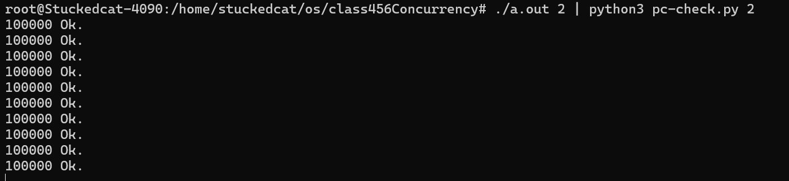

## 1. Peterson Algorithm

### 问题

考虑对于之前的Race Condition的代码

```c
#include "thread.h"

#define N 10000000

void Tsum(){
    for(int i = 0; i < N; i++){
        sum++;
    }
}

int main(){
    create(Tsum);
    create(Tsum);
    join();
    printf("sum = %ld\n", sum);
}
```

现在我们希望给这个sum++加一个互斥锁

```c
#include "thread.h"

#define N 10000000

void Tsum(){
    for(int i = 0; i < N; i++){
        lock();
        sum++;
        unlock();
    }
}

int main(){
    create(Tsum);
    create(Tsum);
    join();
    printf("sum = %ld\n", sum);
}
```

互斥锁的作用是，当进入lock之后，告诉其他线程不允许并发执行某一个代码段（或者访问特定的资源），也就是执行某一段时强制串行，以避免race condition。

一个简单的想法是使用一个值来表示是否解锁，不是的话就死循环，为了简便起见，我们以一次sum++为例

```c
#include "thread.h"

#define N 10000000

int locked = UNLOCK;
void Tsum(){
retry:
    if(locked != UNLOCK){
        goto retry;
    }
    locked = LOCK;
    
    sum++;
    
    locked = UNLOCK;
}

int main(){
    create(Tsum);
    create(Tsum);
    join();
    printf("sum = %ld\n", sum);
}
```


这个方式看起来很美好，实际上是错的，原因是和之前fake alipay的例子一样，==判断的过程是一个非原子性的操作==

例如有两个线程T1，T2

* T1执行第8行，判断成功，进入第十行，但是没有lock上
* 此时，切换上下文，T2判断第8行，判断成功，进入第十行，此时，T1和T2都进入了lock后的环境，这是一个失败的锁

事实上，上面提到的是单处理器的情况，如果你是多处理器并行的情况，两个处理器同时进入lock是很常见的。

因此，普通的操作是无法模拟锁的，归根到底是他们不能原子的完成，只要不是原子的操作（非一步完成），就会出问题。因此通常需要用到硬件底层的lock命令。那么有没有只使用非原子性的操作完成的锁的方式呢？是有的，这就是Peterson算法。


**写在前面，Peterson算法的要求十分苛刻，包括但不限于**

* **变量的变化需要保证缓存一致性**

  在多处理器系统中，每个处理器都有自己的缓存。Peterson算法依赖于共享变量的更新，这些变量需要在各个处理器的缓存中保持一致。这会导致大量的缓存一致性流量，影响性能。

* **严格的内存顺序保证**

  现代处理器可能会重新排序指令以优化性能。Peterson算法需要严格的内存顺序保证，以确保标志变量和轮转变量的操作按预期顺序发生。否则，可能会出现无法预料的竞态条件。这需要使用内存屏障或编译器指令来保证顺序一致性，这在实际编程中增加了复杂性。

* **仅适用于两个线程**


**同时，说明多处理器下的一个load操作(暂时认为是原子操作)是如何发生的**

* 当多个处理器同时尝试写入同一个变量时，系统会进行仲裁，确保只有一个处理器能成功执行写操作。

  - **仲裁机制**：硬件使用仲裁机制来决定哪个处理器优先进行写操作，==其他处理器会被暂时阻塞，直到写操作完成。==

* 让我们具体分析一下在两个处理器同时向变量 `A` 写入值时可能发生的情况：

  1. **同时写入尝试**：

     - 处理器 P1 和 P2 都尝试写入变量 `A`，假设写入的值分别是 `1` 和 `2`。

  2. **缓存一致性协议作用**：

     - 两个处理器的缓存控制器会通过缓存一致性协议来协调写入操作。

       > **缓存行无效**：如果一个处理器修改了某个缓存行，其他处理器中的该缓存行会被标记为无效。
       >
       > **缓存行更新**：当一个处理器写入共享变量时，它会向其他处理器发送消息，更新它们的缓存或使它们的缓存行无效。

     - 如果 P1 先获取到写入权限，它将写入 `1`，并通过一致性协议通知 P2，使 P2 的缓存行无效。

     - 接下来，P2 尝试写入 `2` 时，必须先从内存读取最新的值，或直接进行写入。

  3. **仲裁机制**：

     - 处理器之间通过仲裁机制决定写入的顺序。假设 P1 获胜，它完成写入 `1` 后，P2 再进行写入 `2`。
     - 最终内存中的值是 `2`，因为 P2 的写入覆盖了 P1 的写入。

  4. **总线锁或缓存锁**：

     - 确保写入操作的原子性，通过锁住总线或缓存行，防止其他处理器干扰。

==这体现了多处理器的load操作实际上也是一个原子操作，我们可以将其与单处理器并发看作是类似的操作，即为“处理器每次选择一个线程的一个指令运行”，一同讨论。==（因为主要发生争议的点就是涉及到共享内存修改的部分，其余部分是完全并行还是单处理器并发无关紧要）


### Peterson算法

Peterson算法提出了一种互斥的协议，它的模型是基于共享内存模型，

简单来说，为了解决之前提到的“两个线程同时进入了锁”的情况，Peterson算法使用了一次额外的判断来处理这种情况。

* 两个线程若是需要进入锁都需要声明(flag = true)
* 两个线程在进行操作前需要首先在一个公共board上写上对方线程的名字
* 两个线程在进行操作前需要判断
  * 对方是否也进入锁（flag == true)
  * 如果对方也进入锁，判断board是否为自己的名字，如果不是则等待（谦让）
  * 如果对方未进入锁，直接执行
  * 结束后重置自己的flag=false

```c
#include "thread.h"

#define A 1
#define B 2

atomic_int nested;
atomic_long count;

/*
    这个函数实现了一个对count原子加和原子减的过程，用于验证对临界区的访问控制。
    - `count` 变量用于记录进入临界区的次数。
    - `nested` 变量用于确保临界区的互斥访问，即同一时间只有一个线程在临界区内。

    具体步骤如下：
    1. 将count的值增加1，返回增加前的值，并将其赋给`cnt`。
    2. 将nested的值增加1，并断言增加前的值为0（确保没有其他线程在临界区内）。
    3. 将nested的值减少1，以表示线程离开了临界区。
    
    如果有两个线程在临界区，那么程序就会触发断言assert，这个函数一定程度上能展现程序的状态机，但是并不能保证算法的正确性
*/
void critical_section(){
    long cnt = atomic_fetch_add(&count, 1);
    assert(atomic_fetch_add(&nested, 1) == 0);
    atomic_fetch_add(&nested, -1);
}

// volatile关闭了编译器优化，主要目的是防止编译器缓存这些变量到寄存器中
// 这就可能会导致，一个线程对变量的修改对另一个线程不可见
// volatile强制保证两个线程从内存读取
int volatile x = 0, y = 0, turn = A;


void TA(){
    while(1){
        x = 1;					// 声明需要写入
        turn = B;				// 将共享状态转换为B
        while(y && turn == B);	// 判断是否可以进入锁区
        critical_section();		// 执行任务
        x = 0;					// 声明任务完成
    }
}

void TB(){
    while(1){
        y=1;					
        turn = A;
        while(x && turn == A);
        critical_section();
        y=0;
    }
}
```

可以发现，Peterson算法通过一个“谦让”机制，巧妙地抹去了之前`x=1`和`turn = B`的非原子性

如果没有这个谦让机制（例如对于ThreadA`x = 1;turn=A;while(y && turn==B);`)，此时存在一个执行顺序

`TA:x=1`

`TB:y=1`

`TA:turn=A`

`TA:while(y && turn==B);`:此时turn=A，因此直接进入锁

`TB:turn=B`

`TB:while(x && turn==A);`：此时turn=B,因此直接进入锁


这里并不假定 `while (flag[1] && turn == 1);` 是原子的。相反，**Peterson算法利用了现代处理器提供的基本内存操作的原子性来实现它的互斥机制。**或者说Peterson算法的基础是读写操作在现代处理器中的串行性（即两个线程对一个共享变量的写入一定会让这个共享变量经历两次状态的变换）


具体的peterson算法的状态树可以被画出以证明其正确性，状态太多懒的画了


### 现代处理器上Peterson算法的局限性

它的局限性就体现在沟槽的编译器优化和乱序执行

换句话说，它的内存序无法被保证

可以发现


它运行了大概22359328次就会出错，也就是它内部运行时根本不跟着状态机已有状态来执行


这个的解决方式是添加barrier

```c++

#include "thread.h"

#define A 1
#define B 2

#define BARRIER __sync_synchronize()

atomic_int nested;
atomic_long count;

void critical_section() {
  long cnt = atomic_fetch_add(&count, 1);
  int i = atomic_fetch_add(&nested, 1) + 1;
  if (i != 1) {
    printf("%d threads in the critical section @ count=%ld\n", i, cnt);
    assert(0);
  }
  atomic_fetch_add(&nested, -1);
}

int volatile x = 0, y = 0, turn;

void TA() {
  while (1) {
    x = 1;                   BARRIER;
    turn = B;                BARRIER; // <- this is critcal for x86
    while (1) {
      if (!y) break;         BARRIER;
      if (turn != B) break;  BARRIER;
    }
    critical_section();
    x = 0;                   BARRIER;
  }
}

void TB() {
  while (1) {
    y = 1;                   BARRIER;
    turn = A;                BARRIER;
    while (1) {
      if (!x) break;         BARRIER;
      if (turn != A) break;  BARRIER;
    }
    critical_section();
    y = 0;                   BARRIER;
  }
}

int main() {
  create(TA);
  create(TB);
}
```

这里添加BARRIER之后，可以发现，while中的判断顺序也是需要人为规定的。必须是先判断flag后判断turn。


此时就能正常执行了。

`__sync_synchronize()`不仅不允许编译器随意reorder，同时也是一个memory_barrier


## 2. 并发控制：互斥（自旋锁，互斥锁与Futex）


### 2.1 Motivation

Peterson的并发实现是很低效的，真正的并发

但是Peterson算法给互斥提供了一个代码层面的实现


互斥（mutual exclusion）基本上就是实现一个lock/unlock的API，这个lock/unlock之间是锁的对象，这是一个具有排他性的锁，这意味着对于锁的对象，如果某个线程持有锁，则其他线程的lock**不能返回。**


从第一章中Peterson算法的示例可以看出，实现互斥锁的根本困难在于load和store是分开的，也就是不能同时读写共享内存，这导致了程序获得的所有信息都是“历史信息”，你并不能保证它在当前情况下与需求符合。


现在，你需要做的就是对于符合要求的多个线程，让他们进入等待区（锁），保证同一时间只有一个线程能够操作。


要完成这个目标，

* 要么是提出算法（Peterson），

* 要么就是求己不如求人（我们**直接让硬件多一个操作，使得store和load能够成为原子操作**）

  换句话说，此时有多个线程请求将sum+1，在这一个时间步，硬件直接时停，它会看一看有哪些线程请求+1，然后选一个幸运儿在这个时间步完成`load,calculate,store`，并将其他请求延后。这样就完美的解决了race condition的问题

  > 这也是x86架构的哲学，既然这个实现很麻烦，那不如加一条指令交给硬件做

```c++
#include "thread.h"

#define N 10000000

long sum = 0;

void Tsum(){
        for(int i = 0; i < N; i++)
        {
                asm volatile("lock addq $1, %0" : "+m"(sum));
        }

}

int main(){
        create(Tsum);

        create(Tsum);

        join();

        printf("sum = %ld\n", sum);

}
```


此处的lock是一个**x86汇编指令前缀**，用于确保后续指令在多处理器环境中的原子性。具体来说，这意味着 `lock` 前缀使得随后的指令在执行过程中不会被其他处理器中断，从而确保对共享内存的操作是原子的。

* `addq $1, %0` 的意思是将立即数 1 加到操作数 `%0` 上。
* `%0` 是内联汇编中的占位符，由 `"+m"(sum)` 指定。`sum` 是一个全局变量，`+m` 表示该操作数是内存操作数，并且将被读写。


### 2.2 自旋锁 (Spin lock)

> **简单来说，自旋锁就是，你自己状态为lock，有一个公共状态为unlock，每个线程死循环的与公共状态交换，若自己的状态变为unlock即视为进入锁。**
>
> 这里是利用了原子指令xchg实现的

`xchg`

```c
// 该操作将一个新值存储到指定的内存位置，并返回该位置之前的旧值。让我们详细解析这段代码：
int xchg(volatile int *adder, int newval){
    // 这里xchg本来就是原子的，可以不用lock
	asm volatile("lock xchg %0, %1" : "+m"(*adder), "=a"(result) : "1"(newval));
    return result
}
```

具体的原子指令参考手册`stdatomic.h`

利用这些原子指令，我们就可以简化之前的协议

```c
int table  = YES;
void lock(){
retry:
    // 将flag通过交换设置为NOPE并获取原本table中的值
    int got = xchg(&table, NOPE);
    // got == YES则进入锁
    if(got == NOPE){
        goto retry;
    }
    assert(got == YES);
}

void unlock(){
    xchg(&table, YES);
}
```

更简化一些可以获得

```c
int lock = 0;
void lock(){while(xchg(&locked,1));}
void unlock(){xchg(&locked,0);}
```

这就获得了一个自旋锁


### 2.3 原子指令的模型

#### 指令前缀lock


所有的原子指令，包括lock 声明，对于单处理器和多处理器模型都满足两条定律：

* **lock满足原子性：**即同一种类型的lock必定串行处理

* **lock保证相对内存序：**对于一个线程上不同的lock（例如先执行lock1，后执行lock2），后执行的lock2必定能保证先执行的lock1之前的所有指令已执行

  这里相对内存序表示的是

  * lock1之前的已完成
  * lock2到lock1之间的内存序无法保证


#### x86的原子指令实现

原子指令通常是通过Bus Lock实现的。


例如，对于一个多处理器单memory的模型，每个处理器通过总线向memory发出指令请求。

以add为例，通常是`load->calculate->store`

为了应对多处理器模型中对同一个变量的多个add请求，x86在硬件上实现了锁，具体来说，是为memory添加了锁（1bit的指示位），当总线中有多个请求时，总线决定让一个处理器的请求通过。

对于一个`lock [instruction]`语句，它通常首先读取lock，在获取到memory lock权限之后才会执行后面的instruction。这种实现早期在8086和一些服务器上出现。


现代Intel CPU具有极重的历史包袱，这是因为每个处理器都有一个cache。当每个处理器的cache都hit了共享变量时，bus会首先选择一个处理器（一个线程）允许其访问memory，并为memory上锁，同时，删除其他cache中的对应cache line，强迫他们在锁结束后触发cache miss，从memory重新读取最新的值。

* L1 cache层保持一致性

  * 每个cache line有分别的锁
  * store(x)进入L1缓存即保证对其他处理器可见，需要小心store buffer和乱序执行

* L1 cache line根据状态进行协调

  状态包括

  * **M**odifies， dirty bit，表示是否修改
  * **E**xclusive, 独占访问
  * **S**hared, 只读共享
  * **I**nvalid, cache line无效


#### RISCV的原子指令设计

不同于x86的总线锁，RSIC-V使用了另一种方式更细粒化的完成了一个锁。

观察之前提到的几个原子操作

* atomic test-and-set: `reg = load(x); if(reg == xx){store(x,YY);}`
* lock xchg: `reg = load(x); store(x,XX);`
* lock add:`t = load(x); t++; store(x,t);`

可以发现，所有的race condition归根到底是”来自load到寄存器“ 后，共享变量可能被其他人修改，导致”store回去“的时候本地变量和共享变量对应的初始状态不一致。

x86做的是只允许一个线程`读取，处理，写回`共享变量

而RISC-V做的事允许所有线程`读取`共享变量并在本地`处理`，但是写回时，若是共享变量已经被处理过，那么就重新`读取`并`处理`，否则直接写回。

容易发现，标记不能是1bit标志位，它应该是一个线程数位数的标志组。否则会存在线程A打上reserved标记，线程B写回消除reserved标记，线程C load又打上reserved标记，这会导致线程A认为共享变量未被修改。


RISC-V有**Load-Reserved(LR)**和**Store-Conditional**，当一个线程读取共享变量时，它会在内存上打上标记（reserved），其他线程的写入都会导致标记消除。

```
lr.w rd, (rs1)
rd = M[rs1]
reserve M[rs1]
```

当该线程处理完共享变量后，若是reserved标记存在则直接写回，否则重新执行读取处理。

```
sc.w rd, rs2, (rs1)
if still reserved:
	M[rs1] = rs2
	rd = 0
else；
	rd = nonzero
```


一个简单的实现如下

```c
int cas(int *addr, int cmp_val, int new_val){
    int old_val = *addr;
    if(old_val == cmp_val){
        *addr = new_val; return 0;
    }else{
        return 1;
    }
}
```


### 自旋锁的劣势

**低性能**：自旋锁因为在不停的修改共享变量（标志位），在现代多处理器（带cache）中会因为缓存同步导致延迟增加，性能下降。

**无效负载**：在自旋锁中，只有获取锁的线程才是有效负载，其他线程只是在空转，占用CPU资源。这意味着争抢锁的处理器越多，利用率越低。

**占着茅坑不拉屎**：在自旋锁中，获得自旋锁的线程$\color{red}{可能被操作系统切换出去}$。因为轮转时间片机制，在操作系统眼里，每个线程都有要忙的事，有些忙空转，有些忙正事，但是操作系统不知道，如果把自旋锁切出去了，这下就是100%的资源浪费了。


因此，自旋锁的应用场景是作为”很少发生冲突的场景“中使用。

* 临界区几乎不拥堵
* 持有自旋锁时该线程禁止执行流切换（因此普通进程是不可能的）

自旋锁通常用于**操作系统内核的并发数据结构**，这些数据结构具有短临界区，也就是从任务队列中取可能需要100ns，计算可能需要100ms，很不频繁的取任务时，任务冲突就很少此时就是一个短临界区。

* 操作系统可以关闭中断和抢占，保证锁的持有者在很短的时间内可以释放锁


### 性能维度：Scalability

对于同一份计算任务，时间（CPU cycles）和空间（mapped memory）会随处理器数量的增长而变化。

根据2.2，我们可以获得一份自旋锁的实现

```c
#include <semaphore.h>

// Spinlock
typedef int spinlock_t;
#define SPIN_INIT() 0

static inline int atomic_xchg(volatile int *addr, int newval) {
  int result;
  asm volatile ("lock xchg %0, %1":
    "+m"(*addr), "=a"(result) : "1"(newval) : "memory");
  return result;
}

void spin_lock(spinlock_t *lk) {
  while (1) {
    intptr_t value = atomic_xchg(lk, 1);
    if (value == 0) {
      break;
    }
  }
}
void spin_unlock(spinlock_t *lk) {
  atomic_xchg(lk, 0);
}

// Mutex
typedef pthread_mutex_t mutex_t;
#define MUTEX_INIT() PTHREAD_MUTEX_INITIALIZER
void mutex_lock(mutex_t *lk)   { pthread_mutex_lock(lk); }
void mutex_unlock(mutex_t *lk) { pthread_mutex_unlock(lk); }

// Conditional Variable
typedef pthread_cond_t cond_t;
#define COND_INIT() PTHREAD_COND_INITIALIZER
#define cond_wait pthread_cond_wait
#define cond_broadcast pthread_cond_broadcast
#define cond_signal pthread_cond_signal

// Semaphore
#define P sem_wait
#define V sem_post
#define SEM_INIT(sem, val) sem_init(sem, 0, val)
~                                                     
```

使用一个简单的例子来测试性能

```c
#include "thread.h"
#include "thread-sync.h"

#define N 10000000
spinlock_t lock = SPIN_INIT();
long n, sum = 0;

void Tsum(){
    // 自旋锁保护下的sum++
    for(int i = 0; i < n; i++){
        spin_lock(&lock);
        sum++;
        spin_unlock(&lock);
    }
}

int main(int argc, char*argv[]){
    assert(argc==2);
    // 分配nthread个线程分别完成n次sum++
    int nthread = atoi(argv[1]);
    n = N/nthread;
    for(int i = 0; i < nthread; i++){
        create(Tsum);
    }
    join();
    assert(sum == n * nthread);
}
```


可以发现，线程越多，耗时越长


### 睡眠锁/互斥锁：实现自旋锁长临界区的互斥

这里的想法是，让空转的线程放权，将资源(CPU)让给其他作业（线程）执行。

可以发现，这里存在”出让资源“的行为，这个行为一定不是进程本身（出让CPU资源控制权）可以做的，这个行为是操作系统进程才能做的（C语言代码只能计算）

因此，通常这些进程会使用system call

* `syscall(SYSCALL_lock, &lk);`

  试图获得lk，但如果失败，就切换到其他线程

* `syscall(SYSCALL_unlock,&lk);`

  释放lk，如果有等待锁的线程就唤醒

> * 先到的线程进入锁，`lk=🔒`，系统调用直接返回
> * 其他的线程发现`lk=🔒`，线程进入等待队列，执行线程切换(yield)
> * 当第一个线程完成
>   * 若等待队列不空，从等待队列取出一个线程允许执行
>   * 若等待队列为空，设置`lk=空`
> * OS使用自旋锁保证自己处理lk的过程是原子的


### 自旋锁与睡眠锁

**自旋锁**（线程直接共享locked）

* 更快的fast path
  * xchg成功（仅一条原子指令后）$\rightarrow$ 立即进入临界区，开销很小
* 更慢的slow path
  * xchg失败$\rightarrow$ 浪费CPU自旋


**睡眠锁**（通过系统调用访问locked)

* 更快的slow path
  * 上锁失败线程不再占用CPU
* 更慢的fast path
  * 即使上锁成功也需要进出内核(syscall)


### 折中的方案：Futex(Fast Userspace muTexes)

Fast Path：一条原子指令，上锁成功立即返回

Slow Path：上锁失败，执行系统调用睡眠

这个方法分离了上锁和syscall，避免了睡眠锁上锁成功也需要syscall，也避免了自旋锁上锁失败持续占用CPU

> ### 工作机制
>
> 1. **用户空间的自旋锁**： 在大多数情况下，线程在用户空间使用自旋锁进行同步。如果锁很快可用，线程只在用户空间自旋几次，不会进入内核，从而减少了上下文切换的开销。
> 2. **内核空间的睡眠锁**： 当线程在用户空间自旋一段时间后仍未获取到锁，就会通过`futex`系统调用进入内核。内核中的`futex`机制会将线程置于睡眠状态，等待锁变得可用。当锁可用时，内核会唤醒等待的线程。
>
> ### 详细步骤
>
> 1. **尝试获取锁**：
>    - 线程在用户空间尝试获取锁。如果成功，则进入临界区。
>    - 如果锁被其他线程持有，则进行自旋等待。
> 2. **用户空间自旋**：
>    - 线程在用户空间自旋一段时间，尝试多次获取锁。如果在指定的自旋次数内获取到锁，则进入临界区。
>    - 如果自旋等待超过指定次数仍未获取到锁，则进入内核态。
> 3. **进入内核态**：
>    - 线程调用`futex`系统调用，将自身阻塞在锁上，进入睡眠状态，等待锁变得可用。
> 4. **锁释放和唤醒**：
>    - 当持有锁的线程释放锁时，会通过`futex`系统调用通知内核，内核会唤醒等待锁的线程。
>    - 被唤醒的线程从内核态返回用户空间，重新尝试获取锁。

```c
#include "thread.h"
#include "thread-sync.h"

#define N 10000000
mutex_t lock = MUTEX_INIT();
long n, sum = 0;

void Tsum(){
    // 自旋锁保护下的sum++
    for(int i = 0; i < n; i++){
        mutex_lock(&lock);
        sum++;
        mutex_unlock(&lock);
    }
}

int main(int argc, char*argv[]){
    assert(argc==2);
    // 分配nthread个线程分别完成n次sum++
    int nthread = atoi(argv[1]);
    n = N/nthread;
    for(int i = 0; i < nthread; i++){
        create(Tsum);
    }
    join();
    assert(sum == n * nthread);
}
```

性能提升是非常明显的


这里就是调用的线程库中的锁

如果使用strace看这个程序所有子进程的话

```bash
strace -f ./a.out 64
```


可以发现调用的是futex


## 3. 同步控制

包括典型的同步问题：生产者消费者；哲学家吃饭

同步的实现方法：信号量，条件变量


### 3.1 同步

两个或两个以上随时间变化的量在变化的过程中保持一定的相对关系

>  异步(Asynchronous) = 不同步

线程同步意味着$\color{red}{在某个时间点同时达到互相已知的状态}$


### 3.2 Naive Producer-Consumer Model

```c
void Tproduce(){while(1) printf("(");}
void Tconsume(){while(1) printf(")");}
```

这里的括号匹配要求

* 右括号一定能找到对应的左括号
* 总的未匹配左括号数不超过n

所以左括号可以看作一个producer，而右括号可以看作是一个consumer


这个问题模拟了生产者消费者模型，其中你需要有左括号的生产才能有右括号的消费

考虑这么一个模型如何应对并发状况

一个想法是使用互斥锁

* 每当Producer添加任务时
  * 任务池上锁
  * 判断队列深度是否大于n，若小于n则给一个到达Producer线程解锁，给该线程写入权限
* 当Consumer获取任务时
  * 任务池上锁
  * 判断队列是否为空，不为空则给一个到达的consumer线程解锁，给该线程读取权限

使用互斥锁来保持条件成立

```c++
#include "thread.h"
#include "thread-sync.h"

int n, count = 0;
mutex_t lk = MUTEX_INIT();

void Tproduce(){
    while(1){
    retry:
        mutex_lock(&lk);
        
        if(count == n){
            mutex_unlock(&lk);
            goto retry;
        }
        count++;
        printf("(");
        mutex_unlock(&lk);
    }
}


void Tconsume(){
    while(1){
    retry:
        mutex_lock(&lk);
        if(count == 0){
            mutex_unlock(&lk);
            goto retry;
        }
        
        count--;
        printf(")");
        mutex_unlock(&lk);
    }
}


int main(int argc, char* argv[]){
    assert(argc == 2);
    n = atoi(argv[1]);
    setbuf(stdout, NULL);
    for(int i = 0; i < 8; i++){
        create(Tproduce);
        create(Tproduce);
    }
}
```

```bash
gcc -pc.c -lpthread && ./a.out 1
```

这里传入参数1表示任务池最多只能接受一个任务，至少从这里看起来还是没问题的，没有类似`(())`或者更多的情况


当然，更高的参数人眼就识别不出来了，所以可以用脚本语言写一个简单的checker

```py
import sys
# limit read from input, represents the max job num in poll
limit = int(sys.argv[1])
# n 设置为 100000，这是每次从标准输入读取的字符数量。
count, n = 0, 100000

while True:
    # 从标准输入读取 n 个字符，并逐个处理
    for ch in sys.stdin.read(n):
        if ch == '(': count += 1
        if ch == ')': count -= 1
        # 断言 count 的值在 0 和 limit 之间。如果 count 超出此范围，程序会抛出 AssertionError 并终止。
        assert 0 <= count <= limit
    print(f'{n} Ok.')

```

```bash
./a.out 1 | python3 pc-check.py 1
```

首先可以发现，这个程序是当a.out输入为2，py设定为1时是会报错的，这说明大概率程序是没bug的


### 3.3 改进1：Conditional valuable(条件变量cv)

#### 3.3.1 futex/mutex实现的劣势

在上面的实现中，可以发现

* 就算任务队列满了，假如没有空闲的consumer，此时producer仍然会不停的去获取锁试图往里面加任务

  具体来说，

  producer thread 1获取锁，其余producer thread试图获取锁被沉睡**（futex)**

  producer thread 1 释放锁，唤醒其余producer thread**(futex)**

  这是很无意义很耗时间的，同时可能说100个producer试图往满的pool里推入任务，使得刚醒来的consumer thread被卡很久，因为他们使用的同一个锁

* 同理，就算任务队列是空的，consumer也会不停的去申请，producer可能被严重阻塞


重新分析一下之前问题的写法(futex)

* 线程获取锁，仅有一个线程能够获取到锁，其余被futex沉睡
* 获取到锁的线程判断某一个条件是否成立
  * 不成立的话释放锁，该线程retry，futex唤醒其他线程
  * 成立的话直接进行下一步操作
* 每次锁因为各种原因被释放后，**所有线程都会再试图去获取锁**


我们期待的是优化去这个**许多线程同时获取锁的过程**，更准确的说，是不必要的锁的获取过程

例如，我现在任务池已经满了，还是有铺天盖地的producer thread试图添加任务，这就是浪费CPU资源的行为，因为注定是失败的

优化的思路就是，既然你成为了幸运儿，你获取到锁了，那么如果你没有能够满足条件（例如任务池满了），那么你就应该沉睡，直到任务池有空位你才能够参与锁的竞争


#### 3.3.2 条件变量

条件变量API包括

* `wait(cv,mutex)`
  * wait until wake
  * 调用时必须保证已经获得mutex
  * 释放mutex，进入睡眠状态
  * 相当于`mutex_unlock_and_sleep`
* `signal(cv)`
  * Notification
  * 如果有一个线程正在等待cv，唤醒其中一个
  * 相当于wake_up()
* `broadcast(cv)`
  * 唤醒全部正在等待cv的线程


#### 3.3.3 一个错误的例子

在[6. 并发控制](https://www.bilibili.com/video/BV17T4y1S7RS/?p=6&spm_id_from=pageDriver&vd_source=61f56e9689aceb8e8b1f51e6e06bddd9)中提出了一个错误的策略，它期待让所有满足条件的线程沉睡，一次唤醒一个线程，以减少线程间的mutex竞争，因此获得了错误的结果，可以看一下


```c++
#include "thread.h"
#include <semaphore.h>

int n, count = 0;

mutex_t lk = PTHREAD_MUTEX_INITIALIZER;
cond_T cv = PTHREAD_COND_INITIALIZER;

void Tproduce(){
    while(1){
        pthread_mutex_lock(&lk);
        if(count == n){
            pthread_cond_wait(&cv, &lk);
        }
        printf("(");count++;
        pthread_cond_signal(&cv);
        pthread_mutex_unlock(&lk);
    }

}


void Tconsume(){
    while(1){
        pthread_mutex_lock(&lk);
        if(count == 0){
            pthread_cond_wait(&cv, &lk);
        }
        printf(")");count--;
        pthread_cond_signal(&cv);
        pthread_mutex_unlock(&lk);
    }
}


int main(int argc, char* argv[]){
    assert(argc==2);
    
    n = atoi(argv[1]);
    // 设置标准输出为无缓冲
    setbuf(stdout, NULL);
    for(int i = 0; i < 8; i++){
        create(Tproduce);
        create(Tconsume);
    }
}
```

> 在代码中使用 `setbuf(stdout, NULL);` 将标准输出设置为无缓冲模式。这样做的目的是确保每次调用 `printf` 时，输出立即被写入到目标（如终端），而不是先存储在缓冲区中。这在调试和实时输出时非常有用，因为可以确保所有输出按顺序立即显示，而不会因为缓冲而延迟。

这里的`pthread_cond_wait`做了三个操作

* 释放锁
* 睡眠等待wake
* wake后试图获取锁
* 获取锁成功则继续后面的，否则仍然处于cv的等待队列


这里可以发现一个很明显的逻辑漏洞了，==它并没有再次判断count==


显然，它第一个十万用例都没撑过去


##### 分析1：重复判断条件

以producer为例，它在沉睡时代表任务池为满，但是可能醒来后任务池仍然为满，但是此时这个线程所需要做的就是获得唾手可得的控制权（因为只有它一个苏醒了），它并不用重新判断任务池，因此就会出现错误

同理，对于consumer也是这样

**因此，一个较为通用的使用condition variable的方式就出来了，即为使用while重复判断条件**

此时cv运作的过程是这样的

* 判断条件，若符合则进入

* 释放锁
* 睡眠等待wake
* wake后试图获取锁
* 获取锁成功，重新判断条件

```c++
#include "thread.h"
#include <semaphore.h>

int n, count = 0;

mutex_t lk = PTHREAD_MUTEX_INITIALIZER;
cond_T cv = PTHREAD_COND_INITIALIZER;

void Tproduce(){
    while(1){
        pthread_mutex_lock(&lk);
        //改成while，在这样在cond wait获取锁之后仍然能够判断
        while(count == n){
            pthread_cond_wait(&cv, &lk);
        }
        assert(count != n);//用于压力测试
        printf("(");count++;
        pthread_cond_signal(&cv);
        pthread_mutex_unlock(&lk);
    }

}


void Tconsume(){
    while(1){
        pthread_mutex_lock(&lk);
        while(count == 0){
            pthread_cond_wait(&cv, &lk);
        }
        printf(")");count--;
        pthread_cond_signal(&cv);
        pthread_mutex_unlock(&lk);
    }
}


int main(int argc, char* argv[]){
    assert(argc==2);
    
    n = atoi(argv[1]);
    // 设置标准输出为无缓冲
    setbuf(stdout, NULL);
    for(int i = 0; i < 8; i++){
        create(Tproduce);
        create(Tconsume);
    }
}
```

经过测试，这个方法会概率出现一个bug


它会在某一个时间点死锁了

这是因为我们使用的是signal，这意味着每次一个线程完成操作，仅能唤醒一个线程，很容易出现卡住，出现死锁

具体来说，


解决方法就是每次都是全部唤醒，而非仅唤醒一个

即替换`pthread_cond_signal`为`pthread_cond_broadcast`



==这也是一种很常见的使用条件变量实现并行计算的方式，即==

```c++
struct job{
    void (*run)(void *arg);
    void *arg;
}


while(1){
    struct job* job;
    mutex_lock(&mutex);
    while(!(job=get_job())){
        wait(&cv,&mutex);
    }
    
    mutex_unlock(&mutex);
    job0>run(job->arg);
}
```


另一种做法就是不能同类唤醒，即为Consumer不能唤醒consumer，Producer不能唤醒producer，因为他们的资源是一个相互depend，而同类是竞争的。


### 3.4 一个简单的并行题目：画🐟

考虑一个并行程序，它要求你画出`<><_`或者`><>_`的组合


如图所示，每个线程认领一个字符，并通过barrier按顺序输出他们

基本的思想很简单，就是状态机，我们使用状态机来确定下一个打印哪一个字符，然后使用condition variable来确保持有该字符的线程输出。

可以发现，代码实现中一共拥有三次阻塞机会，两次是futex，一次是cv

cv保证了只有

* 获得输出权限的线程(quota==1)
* 在状态机中找到了下一个有效状态(next != 0)

时才能输出

状态机如下


具体来说，程序的思想就是通过condition variable同步线程输出

同时注意，为了保证输出时(putchar)不会有干扰导致输出混乱，因此添加了quota来标志一个线程是否输出完成

即，使用fish_before作为producer，如果该线程满足条件则允许其发布任务

使用fish_after作为consumer，用来确保该线程输出时不会受到干扰

任务队列仅允许一个任务


代码如下

对于每个线程，首先判断是否能获取锁，获取锁的线程判断该线程持有的char是否满足当前打印到的位置所需要的条件，若是满足则持有输出权（quota--），然后释放锁（此时释放锁，因为占有了输出权，因此其他线程也没有办法通过while）

该线程输出char

该线程重新尝试获取锁，并将输出权归还（quota++），然后唤醒在while中沉睡的线程

```c++
#include "thread.h"

#define LENGTH(arr) (sizeof(arr) / sizeof(arr[0]))

enum { A = 1, B, C, D, E, F, };

struct rule {
  int from, ch, to;
};

struct rule rules[] = {
  { A, '<', B },
  { B, '>', C },
  { C, '<', D },
  { A, '>', E },
  { E, '<', F },
  { F, '>', D },
  { D, '_', A },
};
int current = A, quota = 1;

pthread_mutex_t lk   = PTHREAD_MUTEX_INITIALIZER;
pthread_cond_t  cond = PTHREAD_COND_INITIALIZER;

int next(char ch) {
  for (int i = 0; i < LENGTH(rules); i++) {
    struct rule *rule = &rules[i];
    if (rule->from == current && rule->ch == ch) {
      return rule->to;
    }
  }
  return 0;
}

void fish_before(char ch) {
  pthread_mutex_lock(&lk);
  while (!(next(ch) && quota)) {
    // can proceed only if (next(ch) && quota)
    pthread_cond_wait(&cond, &lk);
  }
  quota--;
  pthread_mutex_unlock(&lk);
}

void fish_after(char ch) {
  pthread_mutex_lock(&lk);
  quota++;
  current = next(ch);
  assert(current);
  pthread_cond_broadcast(&cond);
  pthread_mutex_unlock(&lk);
}

const char roles[] = ".<<<<<>>>>___";

void fish_thread(int id) {
  char role = roles[id];
  while (1) {
    fish_before(role);
    putchar(role); // can be long; no lock protection
    fish_after(role);
  }
}

int main() {
  setbuf(stdout, NULL);
  for (int i = 0; i < strlen(roles)-1; i++)
    create(fish_thread);
}
```


### 3.5 信号量

在某些情况下，我们希望避免同类线程唤醒而使用双 condition variable（条件变量），但是这种方法依赖于锁的存在。有一种机制可以在不使用锁的情况下简单地维护 condition variable，这就是信号量。信号量通常用于资源型的生产者-消费者问题中，可以不使用锁来实现同步。

信号量是一种用于同步并发操作的机制，它的底层实现通常涉及以下几个关键部分：

1. **计数器**：信号量维护一个整型计数器，用于表示资源的可用数量。对于二元信号量（binary semaphore），这个计数器要么是0要么是1；对于计数信号量（counting semaphore），这个计数器可以是任意非负整数。
2. **等待队列**：当信号量的计数器值为0时，试图减小信号量的线程会被阻塞并放入等待队列。等待队列通常是一个FIFO队列，以确保公平性。
3. **原子操作**：为了确保信号量操作的原子性，通常会使用硬件提供的原子操作指令，如Test-and-Set、Fetch-and-Add、Compare-and-Swap等。这些指令确保在多线程环境下对信号量计数器的操作是不可分割的。


下面是一个简单的使用信号量实现生产者-消费者模型的代码示例：

```c++
#include "thread.h"
#include <semaphore.h>
// 使用fill和empty来为producer和consumer维护两个状态，具体来说
// 使用empty来表示还能发布的任务数，每次发布一个任务则为fill加一，empty减一
// 使用fill来表示还能领取的任务书，每次领取任务fill减一，empty加一
sem_t fill, empty;

void producer() {
  while (1) {
    // 阻塞直到empty大于0
    // 如果empty大于0，减1继续
    sem_wait(&empty);
    printf("(");
	// 增加fill的计数
    sem_post(&fill);
  }
}

void consumer() {
  while (1) {
    //调用 sem_wait(&fill) 来等待已填充的缓冲区单元。
    //如果 fill 信号量的值大于 0，则减 1 并继续；
    //否则，消费者会阻塞直到 fill 信号量的值大于 0。
    sem_wait(&fill);
    printf(")");
    //调用 sem_post(&empty) 来增加空的缓冲区单元的计数，即将 empty 信号量的值加 1。
    sem_post(&empty);
  }
}

int main(int argc, char *argv[]) {
  assert(argc == 2);
  //使用 sem_init(&fill, 0, 0) 初始化 fill 信号量为 0，表示初始时没有已填充的缓冲区单元
  sem_init(&fill, 0, 0);
  //使用 sem_init(&empty, 0, atoi(argv[1])) 初始化 empty 信号量为命令行参数指定的值，表示初始时有多少空的缓冲区单元。
  sem_init(&empty, 0, atoi(argv[1]));
  for (int i = 0; i < 8; i++) {
    create(producer);
    create(consumer);
  }
}

```

- `sem_wait(&empty)`：阻塞直到 `empty` 信号量的值大于 0，然后将 `empty` 减 1。这表示生产者等待空的缓冲区单元。
- `sem_post(&fill)`：增加 `fill` 信号量的值 1。这表示生产者生产了一个新的缓冲区单元。
- `sem_wait(&fill)`：阻塞直到 `fill` 信号量的值大于 0，然后将 `fill` 减 1。这表示消费者等待已填充的缓冲区单元。
- `sem_post(&empty)`：增加 `empty` 信号量的值 1。这表示消费者消费了一个缓冲区单元，使其变为空。

通过使用信号量，可以有效地管理生产者和消费者之间的同步，而无需使用锁。这种方法简化了代码，并且在某些情况下可以提高性能。

* `int sem_init(sem_t *sem, int pshared, unsigned int value)`: 
  * sem指向信号量对象的指针，
  * pshared指示信号量是用于进程间共享还是线程间共享
    * pshared=0代表信号量线程间共享，仅能够在单个进程的线程间使用
    * pshared=1代表信号量进程间共享
  * `value`表示资源的初始可用数量
  * 成功返回0，失败返回-1并设置`errno`指示错误


### 信号量与条件变量


信号量更适合在==计数资源==情况下取代条件变量。

* 信号量更适合用于计数资源的可用性（如有多少空缓冲区单元）。

  信号量通常实现通常较为简单，它通过对一个虚拟资源池的维护来实现类似锁的效果。它通常不涉及共享变量，而只是维护一个虚拟权限的分配。

```c++
sem_t empty, full, mutex;

void producer() {
    while (1) {
        sem_wait(&empty);
        // 生产产品
        sem_post(&full);
    }
}

void consumer() {
    while (1) {
        sem_wait(&full);
        // 消费产品
        sem_post(&empty);
    }
}

```


* 条件变量更适合用于等待某个特定的状态或条件。

  条件变量通常会维护一个共享变量，因此必须搭配锁来实现。它不止能够完成虚拟权限的分配（计数的资源），也能够完成复杂状态的维护。

```c++
pthread_mutex_t mutex = PTHREAD_MUTEX_INITIALIZER;
pthread_cond_t cond_producer = PTHREAD_COND_INITIALIZER;
pthread_cond_t cond_consumer = PTHREAD_COND_INITIALIZER;
int count = 0;
int buffer_size = 10;

void producer() {
    while (1) {
        pthread_mutex_lock(&mutex);
        while (count == buffer_size) {
            pthread_cond_wait(&cond_producer, &mutex);
        }
        // 生产产品
        count++;
        pthread_cond_signal(&cond_consumer);
        pthread_mutex_unlock(&mutex);
    }
}

void consumer() {
    while (1) {
        pthread_mutex_lock(&mutex);
        while (count == 0) {
            pthread_cond_wait(&cond_consumer, &mutex);
        }
        // 消费产品
        count--;
        pthread_cond_signal(&cond_producer);
        pthread_mutex_unlock(&mutex);
    }
}

```


### 3.6 哲学家吃饭问题:信号量的局限


#### 问题描述

这是另一个经典的并发问题，这个问题要求两个锁的持有权


#### 信号量解法

一个简单的想法是使用容量为1的信号量来为每个叉子上锁

```c++
#include "thread.h"
#include <semaphore.h>

#define N 3

sem_t locks[N];

// id in {1,2,...}
void Tphilosopher(int id){
    int lhs = (id - 1) % N;
    int rhs = (id) % N;
    
    while(1){
        sem_wait(&locks[lhs]);
        printf("T%d Got %d\n", id, lhs + 1);
        sem_wait(&locks[rhs]);
        printf("T%d Got %d\n", id, rhs + 1);
        
        sem_post(&locks[lhs]);
        sem_post(&locks[rhs]);
    }
}

int main(int argc, char *argv[]){
    for(int i = 0; i < N; i++){
        sem_init(&locks[i],0,1)
    }
    
    for(int i = 0; i < N; i++){
        create(Tphilosopher);
    }
}


```

可以发现，很快卡死，这是因为很容易出现一个情况，每个人都拿了一个叉子，这样就死锁了


信号量只能处理单一资源的分配，这里多资源分配就过于复杂了。还好，有万能的方法，就是cv。


#### condition variable解法

一个简单的想法就是用一个锁==允许一个人用餐==（即为设置available为false，即分配任务），然后让这个人用餐（也就是处理任务），等待它完成任务后，它会再次尝试获取锁，将叉子还回去（重置任务池），注意此时因为叉子已经可用，所以可以唤醒那些沉睡线程了。

```c++
#include "thread.h"
#include <semaphore.h>
#include <stdio.h>
#include<string.h>
#define N 3

pthread_cond_t cv = PTHREAD_COND_INITIALIZER;
pthread_mutex_t lk = PTHREAD_MUTEX_INITIALIZER;

int available[N];

void Tphilosopher(int id) {
  int lhs = (id - 1) % N;
  int rhs = id % N;
  while (1) {
    pthread_mutex_lock(&lk);
    while(!(available[lhs] && available[rhs])){
        pthread_cond_wait(&cv, &lk);
    }
    available[rhs] = 0;
    available[lhs] = 0;

    pthread_mutex_unlock(&lk);


    printf("T%d Got %d\n", id, lhs + 1);
    printf("T%d Got %d\n", id, rhs + 1);


    pthread_mutex_lock(&lk);
    available[rhs] = 1;
    available[lhs] = 1;
    pthread_cond_broadcast(&cv);
    pthread_mutex_unlock(&lk);
  }
}

int main(int argc, char *argv[]) {

  memset(available, 1, sizeof(available));
  for (int i = 0; i < N; i++) {
    create(Tphilosopher);
  }
}
```


==有通用的就别整精巧的方法了，太难了==

这个方法使用的是每个Philosopher自发的去申请叉子的使用权，实际上我们之前说过了，99%的并发问题都可以使用生产者消费者模型来解决。


#### 生产者消费者的一种：Master-Slave解法

这里我们设置**一个**生产者（Master）来判断是否能够分发叉子，和**N个Philosopher**（Slave）接受Master的调度

这是一个分布式系统中非常常见的解决思路，因为这里有很大的操作空间，Master能够方便的设置优先级和偏好（例如有人上一次吃饭用了很久，下一次可能我就偏向于收到它的请求之后晚一些给他叉子的权限）

大体思路如下

```c++
void Tphilosopher(int id){
    send_request(id, EAT);
    P(allowed[id]);
    philosopher_eat();
    send_request(id,DONE);
}

void Twaiter(){
    while(1){
        (id,status) = reveive_request();
        if(status == EAT){}
        if(status == DONE){}
    }
}
```

这里存在几个动作

* Philosopher请求拿叉子，这个动作必须加锁，因为这个动作不仅修改了philosopher本身的请求状态，同时也修改了一个共享变量（request_id，用于通知waiter）
* Philosopher等待waiter（服务生/Master）允许，这是一个二元变量，可以信号量来维护，当然也可以使用condition variable维护
* Philosopher请求还叉子，这个动作同理
* waiter获取请求，


## 并发程序调试

使用.py遍历状态树

> https://www.bilibili.com/video/BV15T4y1Q76V/?spm_id_from=333.788&vd_source=61f56e9689aceb8e8b1f51e6e06bddd9
>
> 55:18

Model Checker的通常**假设是每一行的操作是原子的**（或者也可以手动包含若干个连续操作为原子的），然后通过generator的方式获取状态队列。