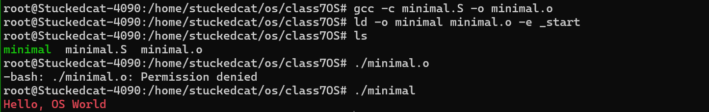
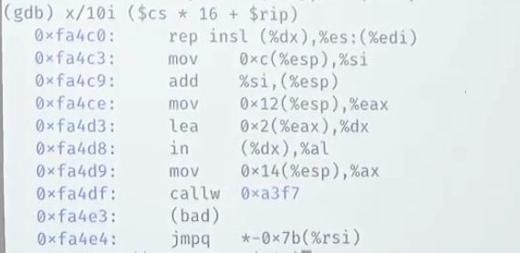

在4.Concurrency中，我们获取了所有之后可能需要的技能，因此从这一章开始，进入深挖OS的节奏


## 0. 前言

### 0.1 最小C程序回顾

在之前尝试过写一个“最小的C语言程序”，这个程序的作用是打印Hello, OS world到控制台

这个程序完全使用了汇编，这是因为汇编程序不需要标准库，可以直接使用系统调用完成任务。

使用 C 语言编写的程序通常需要链接标准库，即使是最简单的程序也需要依赖一些库函数。


程序如下:

```c++
#include <sys/syscall.h>

// 定义全局符号`_start`作为程序入口
.globl _start 
// 程序起始，操作系统加载程序时从这里开始执行
_start:
  // 设置系统调用号，write存入rax中
  movq $SYS_write, %rax   // write(
  // 设置文件描述符为1，即标准输出
  movq $1,         %rdi   //   fd=1,
  // 设置要写入的字符串地址为$st
  movq $st,        %rsi   //   buf=st,
  // 设置要写入的字节数为$(ed-st)
  movq $(ed - st), %rdx   //   count=ed-st
  // 执行系统调用
  syscall                 // );
  // 设置系统调用号退出系统
  movq $SYS_exit,  %rax   // exit(
  // 设置退出状态码`1`
  movq $1,         %rdi   //   status=1
  // 调用syscall
  syscall                 // );

// 定义字符串常量，并使用st和ed标记其开始和结束      
st://st代表一个标签
  //通过.ascii伪指令在数据段中定义字符串，类似的有.asciz,.string
  .ascii "\033[01;31mHello, OS World\033[0m\n" 
ed://
```

> 系统调用号（system call number）是操作系统内核用来识别和执行系统调用的编号。每个系统调用都与一个唯一的系统调用号相关联，当程序需要请求操作系统执行特定的操作（如文件操作、进程控制、网络通信等）时，它会将对应的系统调用号放入指定的寄存器中，然后触发系统调用。
>
> ### 系统调用的工作机制
>
> 1. **用户态到内核态的转换**： 用户程序运行在用户态（user mode），而操作系统内核运行在内核态（kernel mode）。为了执行系统调用，用户程序需要从用户态切换到内核态。
> 2. **系统调用号传递**： 用户程序通过将系统调用号和必要的参数放入指定的寄存器中，然后触发一个特殊的指令（如 `syscall` 或 `int 0x80`）来请求操作系统服务。
> 3. **内核处理**： 内核接收到系统调用请求后，通过系统调用号来查找并执行对应的内核函数。
> 4. **返回用户态**： 系统调用执行完成后，内核返回结果，并将控制权交还给用户程序。
>
> ### 在 x86-64 架构上的系统调用约定
>
> 在 x86-64 架构上，使用 `syscall` 指令来触发系统调用，常见的寄存器约定如下：
>
> - `rax`：存放系统调用号。
> - `rdi`：第一个参数。
> - `rsi`：第二个参数。
> - `rdx`：第三个参数。
> - `r10`：第四个参数。
> - `r8`：第五个参数。
> - `r9`：第六个参数。
> - 系统调用返回值也存放在 `rax` 寄存器中。


> ### 段的定义
>
> 在汇编程序中，通常会定义以下几种段：
>
> - **`.text` 段**：存储代码（指令）。
> - **`.data` 段**：存储初始化的全局和静态变量。
> - **`.bss` 段**：存储未初始化的全局和静态变量。
> - **`.rodata` 段**：存储只读数据，如常量字符串。
>
> 在我们的示例中，字符串定义在 `.text` 段之后，通常这会被链接器处理为只读数据段的一部分。
>
> ### 具体示例
>
> 假设我们扩展 `minimal.s` 来显示各个段的定义：
>
> ```assembly
> section .data
>   ; 可以在这里定义初始化数据，但当前未使用
> 
> section .bss
>   ; 可以在这里定义未初始化数据，但当前未使用
> 
> section .text
>   global _start
> 
> _start:
>   movq $SYS_write, %rax   ; 系统调用号
>   movq $1, %rdi           ; 文件描述符（标准输出）
>   movq $st, %rsi          ; 字符串的起始地址
>   movq $(ed - st), %rdx   ; 字符串的长度
>   syscall                 ; 执行系统调用
> 
>   movq $SYS_exit, %rax    ; 系统调用号
>   movq $1, %rdi           ; 退出状态码
>   syscall                 ; 执行系统调用
> 
> st:
>   .ascii "\033[01;31mHello, OS World\033[0m\n"
> ed:
> ```
>
> ### 字符串在内存中的存储
>
> 当程序被加载到内存中时，字符串会被映射到某个内存地址。在执行 `movq $st, %rsi` 指令时，标签 `st` 的地址会被放入 `rsi` 寄存器，这个地址指向内存中存储字符串的起始位置。


### 0.2 最小C程序的编译原理

使用

```bash
gcc -c minimal.S
ld minimal.o
```

来编译

> 使用`gcc minimal.S -o a.out`会导致报错
>
> 这是因为，默认情况下，`gcc` 编译器会试图链接标准C运行时库，并且会寻找一个 `main` 函数作为程序的入口点。而在 `minimal.S` 程序中，定义了一个 `_start` 入口点，这与默认的 C 运行时入口点冲突了。你需要告诉 `gcc` 使用你定义的 `_start` 作为入口点，**并且不链接标准C运行时库。**
>
> 
>
> 为了正确编译和链接你的汇编程序，你需要告诉 `gcc` 不使用标准C库，并指定你的 `_start` 作为入口点。
>
> * 使用 `gcc -c` 命令将汇编代码编译为目标文件：
>
>   ```bash
>   gcc -c minimal.S -o minimal.o
>   ```
>
> * 使用 `ld` 命令链接目标文件，并指定入口点为 `_start`
>
>   ```bash
>   ld -o minimal minimal.o
>   ```
>
>   `ld`是一个链接器，它的主要作用是将编译器生成的目标文件和库文件链接在一起，生成最终的可执行文件。
>
>   它允许使用`-e`指定程序的入口点
>
>   因此，上面的代码可以看作如下，它代表将目标文件 `minimal.o` 链接成可执行文件 `minimal`，并指定入口点为 `_start`。
>
>   ```bash
>   ld -o minimal minimal.o -e _start
>   ```
>
>   在大多数情况下，省略 `-e` 选项也是可以的，主要是因为 GNU 链接器（`ld`）和 `gcc` 默认会寻找并使用 `_start` 作为入口点。如果 `_start` 存在于目标文件中，链接器会自动将其用作程序的入口点
>
> 
>
> > 其实也可以直接使用 `gcc` 完成这一步，同时指定不使用标准启动文件和标准库，并指定入口点：
> >
> > 此处还需要额外禁用PIE文件生成，具体可以查询资料，这是现代编译器的一个防御性设计
> >
> > ```bash
> > gcc -nostartfiles -nostdlib -no-pie -o minimal minimal.S -e _start
> > ```
> >
> > 


### 0.3 内部运行


反汇编目标文件或可执行文件的内容，显示每个函数的机器代码和对应的汇编指令。

* `| less`：管道符号 `|` 将 `objdump` 命令的输出传递给 `less` 命令。
  - `less` 是一个分页程序，允许你逐页查看长输出内容，非常适合查看大量反汇编代码。

```bash
objdump -d minimal | less
```


也可以通过gdb调试看


可以使用layout指令，特别是layout src指令，显示当前执行的源代码，更直观跟踪

注意使用`starti`(start instruction)和`si`(step instruction)

```bash
layout src
starti
si
```


很明显的可以发现，执行了syscall之后，os打印了字符串


### 0.4 能否不用操作系统，使这段代码跑在裸机

我们之前提到，程序就是状态机，或者说寄存器具体的操作状态转换。

那么会带来更多的疑问

* 具体到打印这个行为，谁将syscall转换为状态机的？

  * 毫无疑问是操作系统

* 这个程序可以在没有操作系统的硬件上运行吗

  首先我们要知道这个程序启动经历了什么

  * ”启动“状态机是由加载器完成的
  * 加载器也是一段状态机
  * 这个程序由操作系统加载


要实现这段代码跑在裸机，我们首先需要知道裸机需要做什么

简单来说就是，**加载操作系统**，**操作系统获取并执行代码**


## 1. 操作系统的加载

#### 加载操作系统:BIOS

首先，CPU就是一个处理器，它只能做

* 从PC处取指
* 译码
* 执行

这三个操作


PC指针（或者EIP,Extended Instruction Pointer）是一个寄存器，主要功能是指向当前处理器正在执行的指令的内存地址，处理器就从此处获取下一条指令。当一条指令执行完成后，EIP通常会自动递增，某些指令（jmp，call，ret）会直接修改EIP的值。EIP是一个**只读寄存器**，除了特殊指令之外其他不可修改。

> reset通常是将EIP寄存器的值重置为`0xfff0`，这个地址存储的指令是指向主板firmware的jmp指令

在计算机刚启动时，EIP被设置为`0xfff0`，这个地址存储的指令是向主板firmware jmp的指令。也就是所有系统的启动都从firmware开始。

> firmware通常是存储在硬件的ROM(Read-Only memory)，EEPROM（可擦写ROM）中的一段程序，它直接与硬件交互，执行硬件初始化，系统启动以及低级别的硬件控制。**断电时数据不会丢失。**
>
> firmware通常包含了主板外插设备的软件抽象，支持系统管理程序运行。

计算机首先负责执行一系列初始化任务（通过firmware，如检测内存、初始化硬件设备等），**然后进入BIOS或者UEFI模式启动操作系统**（取决于motherboard firmware type是BIOS还是UEFI）。


在BIOS模式中，寻找一个可引导的存储设备并加载其 MBR。

对于老式的legacy bios，其主要过程包括

* **以Real Mode唤醒计算机**

  > 实模式(Real Mode)
  >
  > 这来源于为了与早期软件和OS的向前兼容
  >
  > 最早IBM使用Intel8088处理器(16位)
  >
  > 在Real Mode下，处理器访问1MB内存，16位寄存器，地址空间基于段（段偏移访问）
  >
  > RealMode下，BIOS代码可以直接访问硬件与IO端口（实模式无保护）

* **扫描硬件:SSD,FLASH,HDD(floppy,软盘)**，找到存有OS的硬件

  具体来说，所有的硬件的firmware约定开头512字节（也就是第一个扇区的第一个512字节）是主引导区（MBR,Master Boot Record）

  MBR通常包含

  * 引导代码区（Bootloader code）：用于存放引导加载程序的第一部分代码。在系统启动时，这段代码被加载到内存中，并执行以启动操作系统。
  * 分区表（Partition Table）：64 字节，用于描述硬盘上的分区信息。分区表可以包含最多 4 个主分区（或者 3 个主分区加一个扩展分区）。
  * Magic Number：一个2字节的标识符（通常是`0x55AA`），这个Magic Nunmber如果存在就代表该硬件存在OS，也就代表BIOS可加载该硬件

* **转移控制权**：firmware与OS第一次也是唯一一次交互

  具体来说，legacy bios把第一个可引导设备的MBR加载到物理内存==0x7c00==（因此双系统需要手动处理优先级）。这段代码可能加载了1MB的其他代码，例如跳转到OS，或者包括将CPU模式重新设置为32bit mode或者64bit mode，与进入保护模式。

  在加载完成后，PC指针指向此处

  * 执行MBR引导区代码，这是系统启动过程中第一个被执行的代码
  * MBR引导代码查找分区表中的“启动分区”，这个分区包含了操作系统
  * 读取启动分区的第一个扇区（512字节），这包含了操作系统的引导加载程序
  * **firmware将控制权转移到启动分区引导代码**，该代码通常会加载更多引导加载程序，或者直接加载操作系统内核

==下图中EIF应该是EIP==


#### 使用qemu看到boot加载过程

> 以下模拟来自于qemu，使用开源firmware SeaBIOS
>
> https://www.bilibili.com/video/BV1yP4y1M7FE/?spm_id_from=333.880.my_history.page.click&vd_source=61f56e9689aceb8e8b1f51e6e06bddd9

理论上，我们可以通过调试qemu来看到上述boot加载过程

具体来说

```bash
#!/bin/bash
qemu-system-x86_64 \
  -machine accel=tcg \
  -S -s \
  -drive format=raw,file=build/thread-os-$ARCH & 
pid=$!
gdb -x bootloader.gdb
kill -9 $!
```

`qemu-system-x86_64`启动qemu

- `-machine accel=tcg`: 选择 QEMU 使用的加速器，`tcg` 是 QEMU 的默认 CPU 仿真器（Tiny Code Generator）。
- `-S`: 告诉 QEMU 在启动后立即暂停 CPU。这允许你在 QEMU 运行之前连接调试器。
- `-s`: 启动一个默认监听在端口 1234 的 GDB 服务器。GDB 可以通过这个端口连接到 QEMU。
- `-drive format=raw,file=build/thread-os-$ARCH`: 指定虚拟硬盘映像文件，这里假设是编译生成的 `thread-os` 可执行文件。

最后一个 `&` 符号将 QEMU 进程放入后台运行，并将进程 ID 存储在 `pid` 变量中。

`-x bootloader.gdb`: 告诉 GDB 在启动后执行指定的 GDB 脚本。这个脚本通常包含一些初始化命令，如设置断点、加载符号表等。

当 GDB 调试会话结束后，使用 `kill -9` 命令强制终止之前启动的 QEMU 进程。`$!` 是前一个后台进程（QEMU）的进程 ID。


bootloader.gdb脚本通常，包含一些用于初始化调试会话的 GDB 命令，例如加载符号表、设置断点和其他调试设置。一个示例 `bootloader.gdb` 可能包含以下内容：

```gdb
target remote :1234

# 打印初始的 0x7c00 位置的值（显示16个字节）
x/16xb 0x7c00

# 设置 watchpoint 监控 0x7c00 位置
watch *0x7c00

# 继续运行，直到触发 watchpoint
continue

# 打印 0x7c00 位置的指令
x/i 0x7c00

```

1. **`target remote :1234`**:
   - 连接到 QEMU 提供的 GDB 远程调试服务器。
2. **`x/16xb 0x7c00`**:
   - 打印 `0x7c00` 位置开始的 16 个字节的内存内容，格式为十六进制字节（`b` 表示字节，`x` 表示十六进制）。
3. **`watch \*0x7c00`**:
   - 设置 `watchpoint`，当 `0x7c00` 位置的内容发生变化时，GDB 会自动暂停程序并通知你。
4. **`continue`**:
   - 继续执行程序，直到触发 `watchpoint` 或下一个断点。
5. **`x/i 0x7c00`**:
   - 当程序因为 `watchpoint` 暂停后，打印 `0x7c00` 位置处的反汇编指令。


事实上，可以再次手动打印对应的指令

```bash
x/10i ($cs * 16 + $rip)
```

该指令的作用是显示从指定内存地址开始的10条反汇编指令

**`x/10i`**:

- `x` 是 `gdb` 中用于检查内存内容的命令，表示“examine memory”。
- `/10` 表示显示 10 个单元的内容。在这个上下文中，它指 10 条指令。
- `i` 指的是以反汇编指令的格式显示内存内容，`i` 表示“instruction”（指令）。

**`($cs * 16 + $rip)`**:

- `$cs` 是代码段寄存器的值，它保存了当前代码段的基地址。
- `$rip` 是指令指针寄存器的值，它保存了当前指令的偏移地址（在 64 位模式下）。
- 在 16 位实模式或保护模式下，物理地址是通过 `cs` 和 `rip` 的组合计算得出的：`物理地址 = 段基址 * 16 + 段内偏移`。

> 在实模式下，段地址实际上只定义了段的起始地址，而偏移量则用于在该段内定位具体的内存单元。乘以 16 是因为每个段可以覆盖 64KB（`0x10000`）的内存范围，段地址左移 4 位（乘以 16）后才能得到实际的段基址。**换句话说，原本段地址每个地址代表内存空间中的一段16字节内存。**
>
> 具体解释：
>
> - 段地址是一个16位值，表示 0x0000 到 0xFFFF 之间的值。
> - 由于段的边界是以 16 字节（2^4）对齐的，段地址必须乘以 16 才能转换为实际的物理内存地址。
>
> 例如：
>
> - 如果 `CS = 0x07C0`，那么段基址为 `0x07C0 * 16 = 0x07C00`。
> - 如果 `IP = 0x0000`，那么物理地址就是 `0x07C00 + 0x0000 = 0x07C00`。




**地址（左侧）**:

- `0xfa4c0`, `0xfa4c3`, `0xfa4c9` 等是指令的内存地址。这些地址是在段基址（由 `$cs * 16` 计算得到）加上指令指针（`$rip`）的结果。

**指令（中间部分）**:

- `rep insl (%dx),%es:(%edi)`：这是一个重复前缀 `rep`，结合 `insl` 指令，表示重复执行从 `DX` 寄存器指定的 I/O 端口读取数据，并存入 `ES:EDI` 指定的内存位置。
- `mov 0xc(%esp),%si`：将栈指针 `ESP` 偏移 12 (`0xc`) 的内存值加载到 `SI` 寄存器中。
- `add %si,(%esp)`：将 `SI` 寄存器的值加到栈顶（`ESP` 指向的内存）上。
- `mov 0x12(%esp),%eax`：将 `ESP` 偏移 18 (`0x12`) 的内存值加载到 `EAX` 寄存器中。
- `lea 0x2(%eax),%dx`：加载 `EAX` 偏移 2 (`0x2`) 的地址到 `DX` 寄存器中，`lea` 是“装入有效地址”的缩写。
- `in (%dx),%al`：从 `DX` 指定的 I/O 端口读取一个字节并存入 `AL` 寄存器。
- `mov 0x14(%esp),%ax`：将 `ESP` 偏移 20 (`0x14`) 的内存值加载到 `AX` 寄存器中。
- `callw 0xa3f7`：调用一个函数，跳转到地址 `0xa3f7` 执行。
- `(bad)`：表示这是一个非法指令，或者 gdb 识别为无法解码的字节序列。
- `jmpq *-0x7b(%rsi)`：跳转到 `RSI` 寄存器值减去 `0x7b` 的地址。

> 这些指令通常用于较底层的操作，可能是在一个操作系统或引导加载程序的上下文中。例如：
>
> - `rep insl` 表示从端口中批量读取数据，这通常是在处理硬件 I/O 操作时使用。
> - `mov`, `add`, `lea` 等指令则是基本的内存操作和地址计算，操作栈和寄存器。
> - `callw` 是调用另一个函数或跳转到另一段代码的指令。
> - `(bad)` 表示在反汇编时遇到无法识别的字节序列，可能是由于内存数据被错误解释为指令，或者它是一个实际上无效的操作码。
> - `jmpq` 是一个无条件跳转，`q` 表示该跳转是针对 64 位寄存器的。


#### 调试总结

```bash
info registers
```

这个命令用于查看 CPU 的所有寄存器的当前状态。特别是在 CPU 重置（Reset）后，寄存器会被设置为特定的值，例如 `CS`（代码段寄存器）和 `IP`（指令指针）会被设置到初始值，指向 BIOS 入口点。通过查看寄存器，可以了解 CPU 目前的状态，包括当前的代码段和指令指针的位置。


```bash
watch *0x7c00
```

 这个命令设置了一个 `watchpoint`，用于监控 `0x7C00` 地址的内存内容变化。当该地址的内容发生变化时，`gdb` 会自动暂停程序执行，并通知你。这通常用于检测引导加载程序何时被加载到内存中的 `0x7C00` 位置。


```bash
x/i ($cs * 16 + $rip)
```

这个命令用于显示当前指令的反汇编代码。`$cs * 16 + $rip` 是计算当前物理地址的表达式，`$cs` 是代码段寄存器的值，`$rip` 是指令指针。这个命令帮助你了解当前 CPU 正在执行哪条指令。


```bash
x/16xb 0x7c00
```

这个命令会打印从 `0x7C00` 开始的 16 个字节的内存内容，格式为十六进制字节。这个命令可以用于检查引导加载程序被加载到 `0x7C00` 后的具体内容，帮助你确认加载是否成功。


```bash
b *0x7c00
```

这条命令在 `0x7C00` 位置设置了一个断点（`b` 是 `break` 的缩写），当程序执行到这个位置时，`gdb` 会自动暂停执行。这个地址通常是引导加载程序的起始位置，设置断点后可以一步步调试引导加载程序的执行过程。


#### BIOS有什么坏处

> https://www.geeksforgeeks.org/uefiunified-extensible-firmware-interface-and-how-is-it-different-from-bios/

事实上，在1998年，Intel 430TX的芯片组允许写入Flash ROM用于更新firmware，通过一个特定的序列能够设置FlashROM为可写，这个序列在文档中可查。这就导致了一个新的病毒CIH出现。

CIH能够自我复制潜伏传播，直到4.26日向firmware写入一段无意义字符串，直接让电脑变砖。

该病毒被称为史上造成经济损失最高的病毒。

这里管中窥豹其实能够发现一些BIOS的坏处，包括但不限于：

* 由于 BIOS 固件设计为在 IBM PC 的 16 位 8086 处理器上运行，因此 BIOS 固件特定于 x86 CPU 架构，仅支持 16 位处理器模式。16 位处理器模式通常称为“实模式”，因为内存地址直接对应于内存中的物理位置，并且不使用分页和虚拟内存。这意味着 BIOS 只能使用 1MB 的可寻址内存空间;这将可寻址内存限制为 64KB，这意味着所有预操作系统设备驱动程序（如 RAID 控制器）也必须以 16 位模式运行。
* BIOS的另一个限制是缺乏定义的标准，因此在计算机上可以找到许多不同的BIOS固件变体。这可能会使支持硬件变得更加困难，因为不同版本的 BIOS 可能需要同一驱动程序的多个版本。
* 同时，BIOS并没有对每个传入的程序进行数字签名认证，这使得黑客行为变得十分容易。


#### 加载操作系统: UEFI

**UEFI 的特点**

1. **支持现代硬件**：UEFI 支持新的硬件技术和功能，例如更大的硬盘、更快的启动时间以及改进的安全措施。
2. **图形用户界面（GUI）**：与基于文本的 BIOS 界面不同，UEFI 通常包含图形界面，使得访问和编辑系统设置更加容易。
3. **安全启动（Secure Boot）**：UEFI 包含了一个安全启动功能，**通过检查引导加载程序和操作系统组件的数字签名，防止恶意软件在启动过程中安装。**
4. **兼容的磁盘大小**：UEFI 支持 GUID 分区表（GPT）磁盘，与较旧的主引导记录（MBR）分区方案相比，允许更大的分区和更多的分区。
5. **网络功能**：UEFI 固件可以支持网络功能，使其能够通过网络操作，类似于其他固件。

**UEFI 相对于 BIOS 的优势**

1. **打破大小限制**：UEFI 固件可以从 2.2 TB 或更大的硬盘启动，理论上的上限为 9.4 ZB（zettabytes），大约是互联网上所有信息的三倍。这是因为 GPT 使用 64 位条目，大大扩展了可能的启动设备大小。
2. **速度和性能**：UEFI 可以在 32 位或 64 位模式下运行，并且具有比 BIOS 更大的可寻址空间，这意味着启动过程更快。
3. **更友好的用户界面**：由于 UEFI 可以在 32 位和 64 位模式下运行，它提供了更好的 UI 配置，具有更好的图形界面，并且支持鼠标光标。
4. **安全性**：UEFI 提供了安全启动功能，它只允许经过认证的驱动程序和服务在启动时加载，确保计算机启动时不会加载恶意软件。它还要求驱动程序和内核具有数字签名，使其成为对抗盗版和引导扇区恶意软件的有效工具。
5. **使用 GPT 而非 MBR**：如前所述，UEFI 固件会扫描系统中所有可启动的存储设备以查找有效的 GUID 分区表（GPT），这比 BIOS 使用的主引导记录（MBR）有所改进。GPT 更先进，支持更大的驱动器和分区，以及每个驱动器更多的分区。
6. **管理多个操作系统**：使用 UEFI，可以在单个硬盘或 SSD 上安装多个操作系统，固件可以管理它们。这是因为 UEFI 保持了一个启动管理器，可以选择在启动时加载哪个操作系统。
7. **更详细的机器统计信息**：UEFI 可以提供更详细的关于系统硬件和固件配置的信息，包括关于 CPU、内存、存储设备和固件设置的信息。这些信息对于故障排除和诊断非常有用。
8. **支持网络启动**：UEFI 固件支持网络启动，这意味着操作系统可以从网络服务器而不是本地存储加载。这对于远程管理和操作系统的部署非常有用。
9. **支持更现代的技术**：UEFI 支持更新的技术，例如 USB 3.0、NVMe 和 PCIe，与 BIOS 相比，可以提高性能和功能。

**BIOS 的局限性**

1. **BIOS 只能从小于 2 TB 的驱动器启动**。3 TB 驱动器很常见，但具有 BIOS 的系统无法从它们启动。
2. **BIOS 运行在 16 位处理器模式下，并且只有 1 MB 的空间来执行**。
3. **它不能同时初始化多个硬件设备，因此导致启动过程缓慢**。
4. **BIOS 在配置选项方面受到限制，并且对于高级用户可能难以使用**。
5. **BIOS 易受恶意软件攻击，例如 rootkit，它们可以利用固件中的漏洞**。

 **UEFI 与 BIOS 的区别**

1. 系统初始化的处理方式
   - **使用 BIOS 的启动过程**：当 BIOS 开始执行时，它首先进行加电自检（POST），以确保硬件设备正常工作。之后，它会检查所选启动设备的主引导记录（MBR）。从 MBR 中检索引导加载程序的位置，然后由 BIOS 将其加载到计算机的内存中，再加载操作系统到主内存中。
   - **使用 UEFI 的启动过程**：与 BIOS 不同，UEFI 不会查找启动设备第一个扇区中的 MBR。它维护一个称为 EFI 系统分区的有效启动卷列表。在 POST 过程中，UEFI 固件会扫描所有连接到系统的可启动存储设备以查找有效的 GUID 分区表（GPT），这是对 MBR 的改进。与 MBR 不同，GPT 不包含引导加载程序。固件本身扫描 GPT 以找到 EFI 系统分区并从正确的分区直接加载操作系统。如果找不到，则返回到称为“传统启动”的 BIOS 类型启动过程。

**FAT32 文件系统在 UEFI 中的作用**

在 UEFI 系统中，EFI 系统分区（ESP）通常使用 **FAT32** 文件系统格式。FAT32 是一种广泛兼容的文件系统，支持跨多个操作系统和设备使用，尤其适合用于启动相关的存储需求。UEFI 系统使用 FAT32 文件系统存储 EFI 应用程序（如引导加载程序），确保系统启动过程的跨平台兼容性。

| UEFI                                                         | BIOS                                                         |
| ------------------------------------------------------------ | ------------------------------------------------------------ |
| UEFI acts as the first software that runs when the computer is powered on, providing the necessary functions to initialize the operating system and the hardware components | BIOS stands for Basic Input/Output System. It is a firmware interface that acts as the first software layer between hardware components and the operating system of a computer system |
| It provides a unified driver model, which allows drivers to be used for both firmware and operating systems. | The drivers are specific to the BIOS firmware and may not be compatible with the operating system. |
| Start hardware in parallel, which speeds up boot time        | Slowly start the hardware, which can cause slow boot times.  |
| A graphical user interface (GUI) is often included for easy navigation and configuration. | Often, they are text-based, which can be very difficult for users. |
| GUID supports Partition Table (GPT) disks, allowing larger partitions and more partitions to be created. | Usually it is limited to the Master Boot Record (MBR) partition setting, with limitations on partition size and number. |
| It can be a communication capability for performing firmware updates and other tasks on the network. | Generally, lack of network capabilities, requiring manual firmware updates. |


## 2. 操作系统的实现：调用API来在高层次逻辑实现一个操作系统

在完成了操作系统的代码加载之后，PC指向操作系统的第一行代码。因此，操作系统也是一个C程序。我们可以写一个多处理器上能够的创建并发执行任务的操作系统，

这个操作系统的目的是，对于一个成环的任务链，分配给每个处理器

每个处理器上如果触发中断，那么就暂停当前处理器上的任务并切换到下一个任务。

```c++
#include <am.h>
#include <klib.h>
#include <klib-macros.h>

#define MAX_CPU 8

typedef union task {
  struct {
    // Task名字  
    const char *name;
    // 下一个Task的指针
    union task *next;
    // Task任务入口地址
    void      (*entry)(void *);
    Context    *context;
  };
  // 每个CPU上当前运行的任务的指针。每个CPU都有其对应的current任务。
  uint8_t stack[8192];
} Task;
// 假设有MAX_CPU个TASK
Task *currents[MAX_CPU];
#define current currents[cpu_current()]

// user-defined tasks

int locked = 0;
// 自旋锁，通过exchange flag实现
void lock()   { while (atomic_xchg(&locked, 1)); }
void unlock() { atomic_xchg(&locked, 0); }

// task
/*
    这是任务的入口函数。
    
    它运行一个无限循环，在循环中打印任务的名称和CPU编号，使用自旋锁来保护输出，防止多个CPU同时写入时输出混乱。
    
    打印后，它执行一个忙等待循环来模拟工作。
*/
void func(void *arg) {
  while (1) {
    lock();
    // 代表获取任务并分配到哪个CPU上
    printf("Thread-%s on CPU #%d\n", arg, cpu_current());
    unlock();
    for (int volatile i = 0; i < 100000; i++) ;
  }
}

/*
	任务数组，每个任务初始化了名称和`func`入口点
*/
Task tasks[] = {
  { .name = "A", .entry = func },
  { .name = "B", .entry = func },
  { .name = "C", .entry = func },
  { .name = "D", .entry = func },
  { .name = "E", .entry = func },
};

// ------------------
/*
	处理任务切换。
	
	保存当前任务上下文，选择下一个要运行的任务。
	
	任务按照循环调度的方式进行调度，指针移动到task数组的下一个待接受任务
*/
Context *on_interrupt(Event ev, Context *ctx) {
  extern Task tasks[];
  // 如果当前currents[cpu_current()]不为空，则不需要切换
  if (!current) current = &tasks[0];
  else          current->context = ctx; // 如果有任务，先将其保存在正在运行的任务(Task）自身的数据结构，也就是current->context中，以便于恢复状态
  do {
    //这里的中断目的是将任务切换到下一个可执行任务
    current = current->next;
  } while ((current - tasks) % cpu_count() != cpu_current());// 此处是一个简易的分配，判断该任务是否是当前CPU上该执行的任务。
  return current->context;
}

void mp_entry() {
  // 启用中断
  iset(true);
  // 控制权交给调度器
  yield();
}

int main() {
  // 初始化中断处理机制，将on_interrupt作为中断处理函数
  cte_init(on_interrupt);
	
  // 循环初始化每个任务的上下文，将其链接为循环链表，每个任务指向数组中下一个任务  
  for (int i = 0; i < LENGTH(tasks); i++) {
    Task *task    = &tasks[i]; 
    Area stack    = (Area) { &task->context + 1, task + 1 };
    task->context = kcontext(stack, task->entry, (void *)task->name);
    task->next    = &tasks[(i + 1) % LENGTH(tasks)];
  }
    
  // 通过调用mp_entry初始化多处理器环境，启动多个CPU上的任务  
  mpe_init(mp_entry);
}
```

> 这里面涉及到了几个AbstractMachine对C程序语义做出的扩充
>
> * TRM+MPE
>   * 等同于多线程（一个处理器作为一个线程）-L1/native
>   * IOS API：普通的库函数
>     * 同一个设备的数据竞争在这里是undefined behavior
> * CTE
>   * 允许创建多个执行流（类比协程）-M2
>   * yield 主动切换；会被中断被动打断
>   * `on_interrupt`会拦截到中断事件
>     * 拦截到中断事件后，会挑选一个启用了中断的处理器，保存其上下文并处理中断
>
> * VME
>   * 允许创建一个“经过地址翻译的执行模式”
>   * 通过CTE API管理


## Tips:更好的查看编译过程

命令 `make -nB` 是 `make` 工具的一个组合选项，用来在执行构建过程时显示计划执行的命令，而不实际执行这些命令，同时强制重新构建所有目标。让我们分解这个命令中的选项：

1. **`-n` 选项**

   - **`-n`** 代表 "dry-run" 模式。使用这个选项时，`make` 会显示出它将要执行的所有命令，但不会实际执行它们。

   - 这个选项通常用于调试 `Makefile`，以便你可以看到 `make` 计划运行的所有步骤，而不会对文件系统进行任何更改。

2. **`-B` 选项**

   - **`-B`** 代表 "always-make" 模式。使用这个选项时，`make` 会强制认为所有目标文件都是过时的，并且需要重新构建。

   - 即使目标文件看起来是最新的，`make -B` 也会忽略时间戳，重新运行所有规则。


通常可以将这个结果使用sed正则处理之后，来了解其中做了什么

> 一般来说,有这么一个命令行的trick可以简化make -nB的输出，使得其可读性上升
>
> ```bash
> make -nB\
> |grep -E -ve '^(#|echo|mkdir|make)'\ #排除所有包含echo，#，mkdir，make的行
> |sed 's/$AM_HOME/\$AM_HOME/g'\ #替换$AM_HOME为\$AM_HOME防止 $AM_HOME 在后续处理中被解释为一个环境变量，确保它保留为字面字符串。
> |sed 's/$PWD/./g' \ # 替换PWD为当前目录.
> |vim - # 打开一个空的vim会话并写入，-通常表示stdin
> 
> ```
>
> 在vim中
>
> ```bash
> :set nowarp
> %s/ /\r /g #空格换成换行
> ```
>
> > **`\r` 在 `vim` 中用于插入新行**:
> >
> > - 在 `vim` 的替换命令中，**`\r` 是插入新行的正确方式**。当你想将一个字符替换为多个行（即换行）时，使用的是 `\r` 而不是 `\n`。
> > - 例如，命令 `%s/ / \r /g` 的作用是将每个空格替换为一个换行符，使每个空格后的字符移到下一行。这是通过插入回车符 `\r` 实现的。
> >
> > **`\n` 的使用**:
> >
> > - 在 `vim` 中，`\n` 通常表示行尾，或者在某些情况下表示新行的开始，但在替换命令中，它不会像 `\r` 那样插入一个新行。**`\n` 更常用于匹配换行符或在多行模式下工作。**
>
> 接下来就很容易可以区分这些指令了
>
> 常见的有
>
> * `-I`：include path设置
> * `-D`：Definition宏的设置
> * `-c`,`-o`

经过上面的操作，应该能够看到前面最简C程序的编译过程

### Abstract Machine的编译

其中有这么一段


这是qemu虚拟机的内部流程，包括

* 使用 `cat` 命令将 `bootblock.o` 文件的内容输出到标准输出（stdout）。这个文件通常是一个可引导的二进制文件，包含引导程序的代码。

* **`head -c 1024 /dev/zero;`**：

  - 使用 `head` 命令从 `/dev/zero` 中读取 1024 字节的零字节数据。这些数据通常用于填充，确保文件的大小对齐或占位。

    `/dev/zero` 是一个特殊的文件，它会无限生成零字节。

* **`cat ./build/thread-os-x86_64-qemu.elf;`**：

  - 使用 `cat` 命令将 `thread-os-x86_64-qemu.elf` 文件的内容追加到输出中。这个 ELF 文件可能包含一个可执行的操作系统内核或应用程序。

* **重定向输出 `>`**：

  - `>` 用于将前面所有命令的输出重定向到一个文件中。
  - 将前面三个命令的输出重定向到 `./build/thread-os-x86_64-qemu` 文件中。这个文件很可能是要写入到虚拟硬盘或作为 QEMU 虚拟机的引导磁盘使用的映像文件。

这段 `make` 输出的含义是：

- 将引导块 (`bootblock.o`) 的内容、1024 字节的零填充（用 `head` 和 `/dev/zero` 生成），以及 ELF 文件 (`thread-os-x86_64-qemu.elf`) 的内容依次连接起来。
- 最终，这些内容会被写入到 `./build/thread-os-x86_64-qemu` 文件中。


**`echo -n Hello;`**:

- `echo` 是一个简单的命令，用于在终端输出文本。
- `-n` 选项告诉 `echo` 不要在输出末尾添加换行符。
- 这条命令的作用是输出字符串 `"Hello"`，并且光标不会换行。这个命令用分号 `;` 结尾，表示该命令执行完毕后将继续执行下一个命令。

**`dd if=/dev/stdin of=./build/thread-os-x86_64-qemu bs=512 count=2 seek=1 conv=notrunc status=none`**:

-  `dd` 命令在做的是将标准输入（`/dev/stdin`）的数据写入到指定的文件（`./build/thread-os-x86_64-qemu`），并且进行了特定的块大小、计数和偏移等操作。

- **`if=/dev/stdin`**: 输入文件（input file）为标准输入，即前面的 `echo` 命令的输出将作为输入。

- **`of=./build/thread-os-x86_64-qemu`**: 输出文件（output file）为 `./build/thread-os-x86_64-qemu`。

  > - **`bs=512`**: 指定块大小为 512 字节。
  > - **`count=2`**: 仅复制两个块（即 1024 字节）。
  > - **`seek=1`**: 在输出文件中跳过一个块（512 字节），==从第一个块之后的位置开始写入数据==。
  > - **`conv=notrunc`**: 告诉 `dd` 命令不要截断输出文件，如果输出文件已经存在，则保留其大小，只覆盖指定的位置。
  > - **`status=none`**: 不显示任何过程信息，保持命令执行的安静状态。

这个命令的作用是将 `"Hello"` 写入到 `./build/thread-os-x86_64-qemu` 文件（用于模拟硬件）的特定位置，而不是覆盖整个文件。


