## 操作系统概述

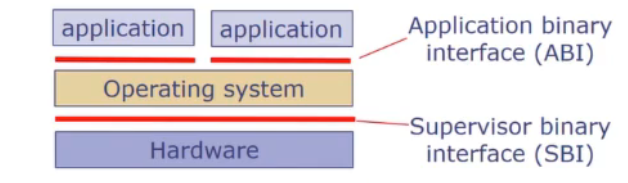

现代计算机结构一般分为三层，应用层，操作系统与硬件层。

通常来说，应用层需要对硬件资源的分配和调度，但是直接对硬件操作显得过于繁琐，因此引入操作系统层对常用硬件操作进行抽象(abstraction)， 使得application层能够更简便的使用硬件。

* **应用程序**通过应用程序二进制接口**(Application Binary Interface, ABI)**与操作系统进行交互

* **操作系统**通过主管二进制接口**(Supervisor Binary Interface, SBI)**与硬件进行交互

  操作系统提供的服务允许应用程序访问I/O设备，由于I/O设备的访问延迟非常长（以毫秒为单位），操作系统可以通过多进程程序设计（multiprogramming)来在等待I/O操作时切换到另一个程序执行

* **硬件提供**基础资源，例如处理器计算资源，内存存储资源与IO设备


## 进程，程序与处理器

### 基础概念与进程的切换

进程(Process), 程序(Program)与处理器(Processor)是操作系统中常见的几个名词。

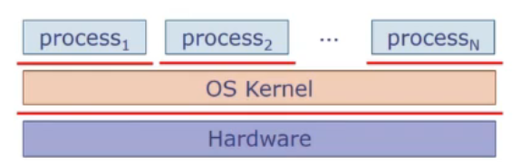

* 一个**Program**是Instructions和data的集合，也就是你的机器码程序

* 一个**Processor**是用于执行程序(program)的硬件

* 一个**Process**(进程)是一个程序的实例，它以Program为蓝本创建，并拥有自己独特的状态

  * **进程的状态**：

    进程本身包括*程序(program)，处理器状态(processor state: registers, memory .etc)与IO 设备状态*

    **寄存器**通常包括通用寄存器（存储临时数据）， 程序计数器（PC，指示吓一跳要执行的指令地址）和堆栈指针（SP，指向当前堆栈帧的顶端），**这些寄存器在进程切换时需要保存或者恢复**

    **内存**通常包括进程的代码段，数据段和堆栈段，内存状态在进程切换时需要管理，每个进程都有自己独立的地址空间。

  * **进程的切换**：

    操作系统进行进程切换（上下文切换）时，一般的做法是保存当前进程状态与恢复下一个进程状态。

    具体来说，对于*切换出去的进程*

    * 将**当前进程**使用的

      **寄存器状态**

      

      *通用寄存器(临时数据和指针)*，

      *程序计数器*，

      *堆栈指针*

      保存到该进程的进程控制块(PCB,Process Control Block)。PCB是进程中专门用于管理进程信息的数据结构，存储在OS kernel专用的快速内存空间，以便高效快速访问。Kernel为每个进程分配PCB，在内存空间存为一个*进程表（Process Table）*，通过进程ID(PID)快速查找和访问。

      

      **内存状态**

      每个进程都有自己的地址空间（代码段，数据段，堆栈段）

      切换进程时*无需复制内存内容*，因为内存状态由MMU（虚拟内存单元）管理，并由页表指针（Page Table Pointer）指向，页表指针也存在PCB中

    

    对于*切换进来的进程*

    * 从PCB中读取并恢复所有寄存器的内容
    * OS通过MMU设置下一个进程的页表指针，从而映射该进程的地址空间到物理内存，这样内存访问就会正确指向该进程的地址空间。

* **OS kernel**时一个具有额外权限的特殊进程，kernel负责管理系统资源和为用户进程提供服务。


### 操作系统的目标

* $\textcolor{red}{Protection\ and\ privacy}$: 进程仅能访问自己的数据，不能访问其他的数据
* $\textcolor{red}{Abstraction}$：OS隐藏了底层硬件活动的细节
* $\textcolor{red}{Resource\ management}$:由OS kernel控制，包括分配资源，调度进程以及控制进程如何共享硬件


### 进程的私有空间简介

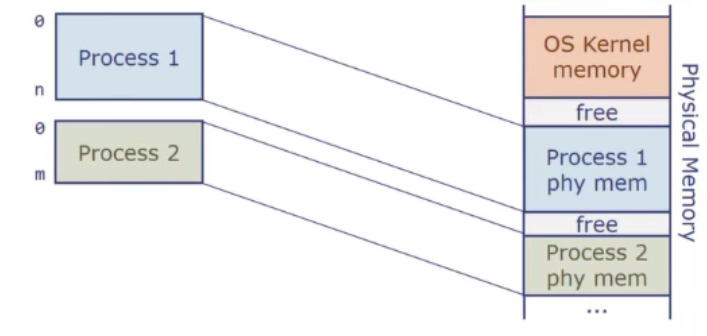

考虑每个进程（Program），他们看到的地址都是从零开始的地址空间，但是不同的进程又不能互相干扰，因此OS引入了address mapping的机制，进程（程序）看到的是虚拟地址，他们会被OS转换为物理地址。

* OS kernel会为每一个进程在物理地址空间中分配空间

* A process is not allowed to access the memory of other processes or the OS

* 程序和数据地址独立于进程在物理内存中所分配的地址是十分方便的，通常由Dynamic address translation完成。

  * 如果程序和数据地址不依赖于进程在内存中的分配位置，那么编写和调试程序就会更加方便。这意味着，无论程序实际加载到物理内存中的哪个位置，其逻辑地址空间都是一致的。

    地址独立性使得程序可以更容易地在不同的内存位置之间移动，而不需要修改程序中的地址引用。

  * Dynamic address translation将程序生成的地址（逻辑地址或者虚拟地址）映射到物理内存地址

    


### 进程的调度简介

OS kernel 调度这些进程，使他们进入CPU

* 每个进程被分配了一部分CPU时间
* 一个进程不能使用多于它所被允许的CPU时间

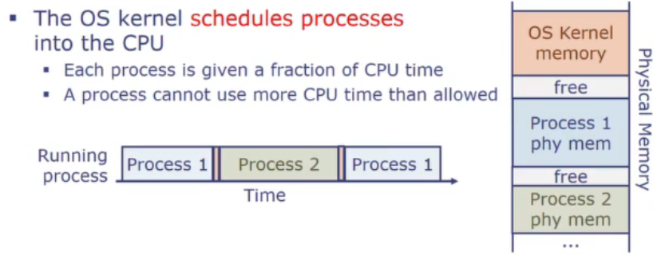


### System Call简介

系统调用是由操作系统提供的一组接口，允许用户空间的程序请求内核提供的服务。*系统调用是一种特殊的指令*，它们将执行从用户模式切换到内核模式，从而可以执行受保护的操作(通常是定义好的系统操作，例如访问文件或者network socket）。


在这其中，ABI（Application Binary Interface）定义了进程和内核如何传递参数和结果，通常类似于函数调用约定。系统调用的参数和返回值通过特定的寄存器传递。


系统调用的过程为：

* 用户发起系统调用（`syscal`,`int 0x80`等特殊指令），系统调用号和参数被存储在特定的寄存器中
* 系统调用指令出发从用户态到内核态的切换，CPU将控制权转移到OS kernel，触发process switch
* OS kernel根据系统调用号查找对应的OS kernel function，并执行
* 系统调用完成后，OS kernel恢复之前保存的context，将结果存在指定的寄存器中，CPU切回用户态，进程继续


### 进程生命周期

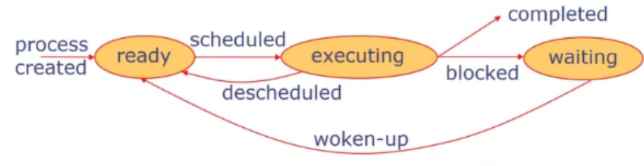

OS维护所有进程的状态：`{READY,EXECUTING,WAITING}`

* `READY`:进程已经被创建且准备好执行，但是尚未分配CPU时间，在就绪队列中等待被调度执行
* `Executing`: 进程正在CPU上运行，执行其代码，占用CPU资源
* `WAITING`: 进程由于某些条件无法继续执行（等待IO操作完成或者某个事件发生）。在等待队列中等待条件满足后会被唤醒(Woken-up)


进程的状态转换包含以下几种

* Scheduled：`READY` $\rightarrow$ `EXECUTING`
* Descheduled: 执行中的进程被中断或者分配给他的时间片用完了，返回就绪状态等待再次调度。
* Blocked：执行中的进程发出需要等待的系统调用，无法立即完成，进程状态转为等待
* Woken-up:`WAITING`$\rightarrow$ `READY`
* Completed：执行状态的进程完成其全部任务


### ISA Extension

ISA(指令集架构)通常需要一些额外的功能与机制来支持OS


当进程执行时，通常有两种形式：$\textcolor{red}{user}$ 和$\textcolor{red}{supervisor}$

* 只有OS kernel在supervisor mode中运行
* 其他所有的进程都在user mode中运行

> supervisor mode 也被称为内核模式(kernel mode)，时操作系统内核运行的模式。代码可以执行$\textcolor{red}{特权指令}$并具有完全的系统资源访问权限。


ISA的扩展指令集包括

* **Privileged Instructions and registers**

  * **特权指令(Privileged Instructions)**：

    * 特权指令只有在Supervisor mode下才能执行，这些指令通常涉及对硬件的直接控制，包括I/O操作，内存管理，CPU状态设置

      例如，加载页表基址，设置中断向量表，启用/禁用中断等指令

  * **特权寄存器(Instruction Registers)**
    * 特权寄存器只有在Supervisor mode下才能*访问和修改*，这些寄存器用于存储和控制系统的关键状态信息。

* **Interrupts and exceptions**
  * 中断：
    * 中断要求处理器暂停当前执行的任务，转而处理中断请求
    * *终端可以安全的从user mode转到supervisor mode，处理完成后再返回user mode*
  * 异常：
    * 异常是由当前执行的指令引发异常情况（非法操作，除0，页面错误）
    * 异常也有中断的作用，只不过是从user mode转换到supervisor mode以处理异常，这种情况


* **virtual memory**
  * 虚拟内存是一种内存管理技术，它为每个进程提供一个独立的地址空间，并抽象出物理内存的细节
  * 虚拟内存通过页表(Page Table)将虚拟内存映射到物理地址，从而提供内存保护，允许进程拥有**私有地址空间**
  * 虚拟内存可以使用磁盘空间来扩展物理内存的容量


# ISA Extension： Exception

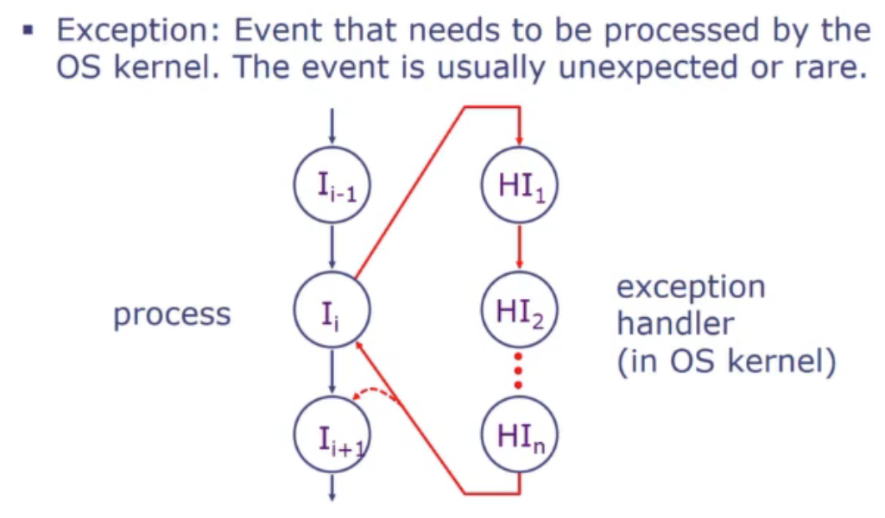

左边是Normal flow of the program ，当发生Exceptions时，当前进程就会被叫停，同时OS kernel接手CPU资源完成一些其他操作。完成后，跳转到当前Instruction，下一个Instruction或者其他地方（取决于该Exception的具体作用）

Exception通常指的是同步时间(Synchronous events)，因为异常是由当前执行的指令主动调用的（需要OS kernel处理的指令），因此与指令流是同步的，是由进程行为引起的。

> 常见的Exception包括Illegal instruction（未定义或受保护指令），Divide-by-0，Illegal memory address（访问未分配或受保护的内存地址），system call（进程主动请求操作系统服务）


与之对应的是Interrupts，中断通常是异步事件，由IO设备生成，这些事件独立于指令流，不可预测。

> 例如定时器中断，按键输入触发中断，网络数据包到达，磁盘传输完成。


Exception的具体过程如下

* 处理器在指令$I_i$处停止当前进程的执行，并完成所有到$I_{i-1}$为止的指令(Precise exceptions)
* 将指令$I_i$的程序计数器(PC)和异常原因保存到Privilege Register中
* 处理器启动Supervisor模式，金钟中断，并将控制权转移给预设的异常处理程序地址（PC）


在OS kernel处理完毕后，将控制权返回给进程，并继续执行。如果异常是由非法操作引起且无法修复，操作系统会终止该进程。


## 异常处理的两个例子

### Case1： CPU scheduling

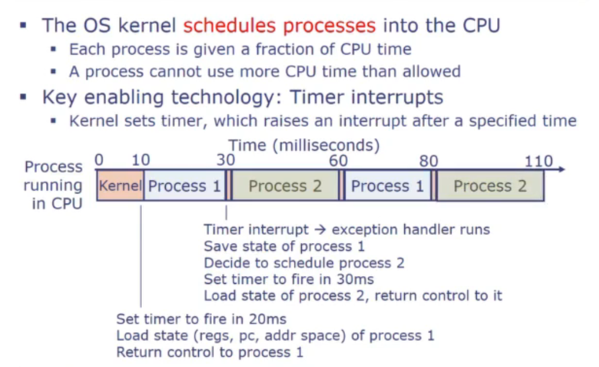

OS kernel调度processes时，通常每个process会被给与一段CPU使用时间的权限。

通常来说，到达时间时对process的叫停是由Timer interrupts来实现的。在上图中，kernel首先接管了CPU，然后设定20ms的Timer interrupts，将权限交给进程1，到达时间时，os kernel发起了一个**interrupt**，迫使进程中断（进程1的状态被保存，CPU资源还给了kernel，kernel决定下一个时间给进程2，设定timer计时30ms，加载进程2的状态，并将控制权转交给进程2）


### Case2:模拟指令

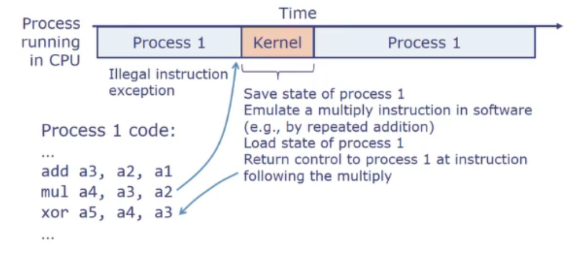

考虑我们进程中使用这么一个指令`x1 := x2 * x3`，如果乘法是没有被硬件实现的，那么`*`就是一个非法指令。

此时，进程执行了这个指令，触发了`illegal instruction`的exception，OS kernel接手发现这个指令不存在，准备给你进程停了。

等一下，有人写kernel的时候写过一个软件的实现，它通过组合已有的instruction获得了乘法的结果，因此OS kernel决定不给你进程停了，而是帮你算出来这个结果，然后返回给进程。进程什么都不知道，它只知道提交上去一个乘法指令，上面的大人突然接手了，处理的格外慢，然后给了他结果让他好好干。


模拟指令会带来两个弊端，一个就是很慢（毕竟是软件模拟的），第二个就是Program（Process/程序员）本身无法知晓它是使用了软件模拟，可能会以为本来就有乘法的硬件实现，因此大胆的大规模使用，导致软件更慢了。


## 典型的异常处理程序结构

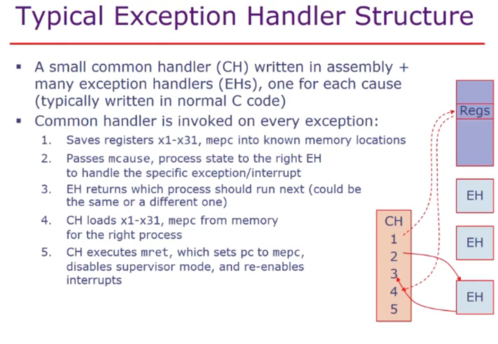

当一个Exception被call时，通常都会通过Common Handler来依次执行需要的动作（相当于一个通用预案）

* **保存寄存器和状态：**
  * 将寄存器`x1`到`x31`和机器异常程序计数器（保存引发异常的指令地址）`mepc`
* **传递状态给特定的异常处理程序EH**
  * 将*异常原因寄存器*`mcause`、进程状态传递给正确的异常处理程序EH以处理特定的异常和中断,`mcause`指示发生异常的类型和原因
* **异常处理程序返回结果**
  * EH处理完异常后，返回应该运行的进程（可以是相同的进程或是不同的进程）
* **恢复进程状态**
  * CH从内存中加载寄存器`x1`到`x31`和`mepc`的值，为正确的进程恢复状态 
* **恢复执行**
  * CH执行`mret`指令，将`pc`设置为`mpec`，==禁用supervisor mode并重新启用中断==
  * 处理器从引发异常的指令出重新执行

以下是一个简易的汇编

```c
common_handler:
	// save x1 to mscratch to free up a register
	csrw mscratch, x1 
	// get pointer for current process's state
    lw x1, curProcState
    
    // save registers x2 - x31
    sw x2, 8(x1)
    sw x3, 12(x1)
    ...
    sw x31, 124(x1)
    
    // now registers x2 - x31 are free for the kernel
    // save original x1(now in mscratch)
    csrr t0, mscratch
    sw t0, 4(x1)
    
    // finally, save mepc
    csrr t1, mepc
    sw t1,0(x1)
    
    
    
    // pass interrputed process state and cause to eh_dispather
    mv a0, x1 // arg 0: pointer interrupted process state
    csrr a1, mcause  // arg 1: exception cause
    lw sp, kernelSp	 // use the kernel's stack
    
    // calls the appropriate handler
    jal eh_dispatcher
    
    // returns address of state of process to schedule
    // restore return PC in mepc
    lw t0, 0(a0)
    csrw mepc, t0
    // restore x1-x31
    mv x1,a0
    lw x2, 8(x1); lw x3, 12(x1);...; lw x31, 124(x1)
    lw x1,4(x1) //restore x1 last
    
    
    
    
        
```


# Virtual Memory

## 回顾

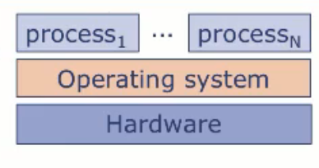

**Goals of OS:**

* **Protection and privacy:** Process cannot access each other's data
* **Abstractions:** Hide away details of underlying hardware
  * e.g. processes open and access files instead of issuing raw commands to hard drive
* **Resource management/Scheduling:** Controls how processes share hardware resources(CPU, memory, disk, etc.)


**Key enabling technologies:**

* User mode + supervisor mode
* Interrupts to safely transition into supervisor mode(for example a keyboard input, mode will safely transfer to supervisor mode, OS will take over and figure out exactly how to transmit this io information to one of the user processes)
* $\textcolor{red}{Virtual\ memory\ to\ abstract\ the\ storage\ resources\ of\ the\ machine}$


## 什么是Virtual memory

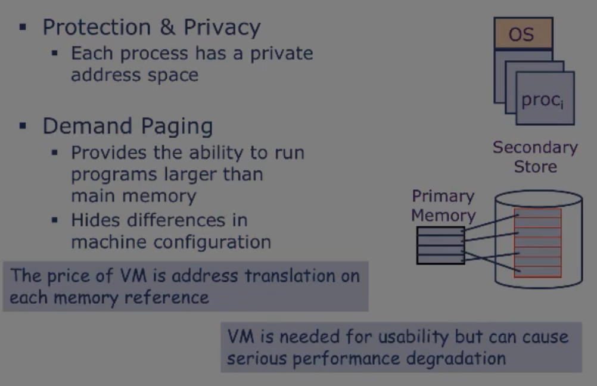

Virtual memory and OS are going to allow us to have each process think of the entire address space as being its own


Demand paging enables to run programs that are larger than the size of main memory on our computer, also hides difference in machine configuration(both work on memory 1gb and memory 10gb, demand paging makes program not to think about how big main memory is, rather it only thinks about its entire address space which includes a memory store, such as hard disk)


为了达成这个目的，地址映射是必不可少的。考虑一个program需要读取0x100的数据，首先必须找到program所在的现实空间，才能将0x100作为bias映射过来。


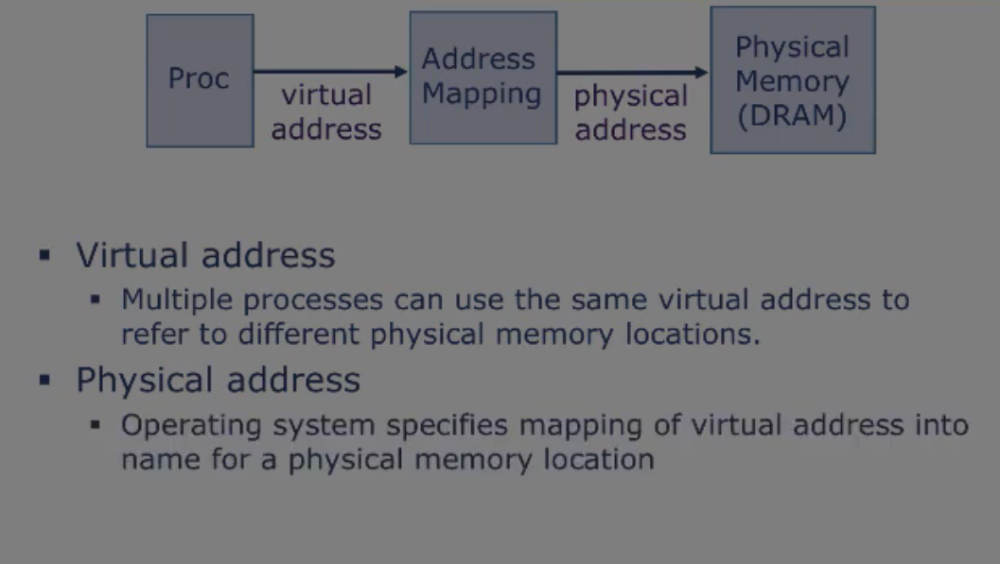

每个process有自己的地址空间，称为virtual address， 通过address mapping映射到物理地址上


## Base and Bound address translation AKA Segmentation

### Base and Bound: one segmentation

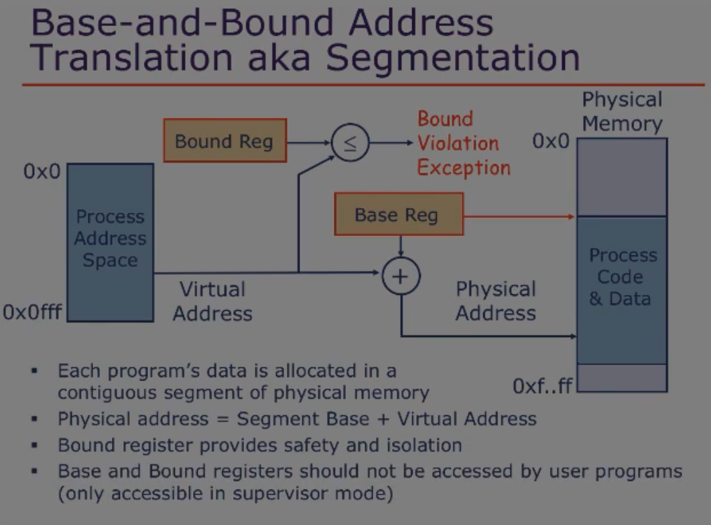

* Base Register存储了Pointer，指向与你这个Process Address Space相关的Physical Memory的区域的起始地址
* Virtual Address提供偏置，与Base Register相加即得到Physical Memory

* 为了提供保护（限制该Process只能访问自己的区域），存在一个Bound Register用来判定偏置是否超出虚拟地址的总大小，超过了会引发一个Exception

需要注意的是，这些register都是special register，只有OS才能够访问（user mode无法访问）


### Base and Bound: Separate Segments for code and data

考虑main memory不仅仅是作为一整个segmentation，而是划分成多个segmentation block，具有不同的特定功能

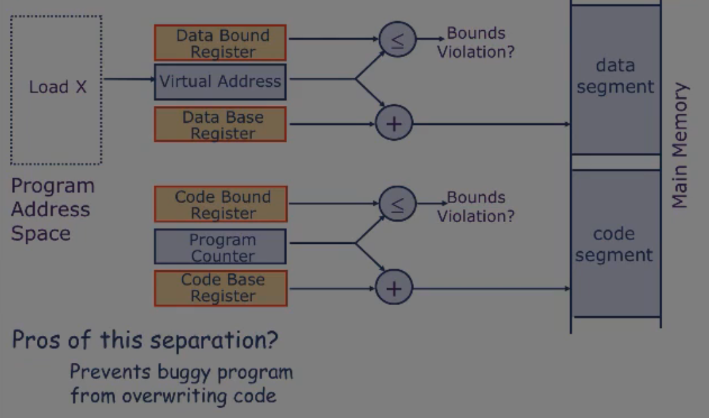


这样做有什么好处：

* 首先，避免了你代码写错导致的对code存储部分的修改（毕竟之前在同一个segment里面）
* 在这种结构下，同一个program派生的process实际上可以共享code segment，仅保留其data segment的protection。


### Base and Bound: 内存碎片（Memory fragmentation)

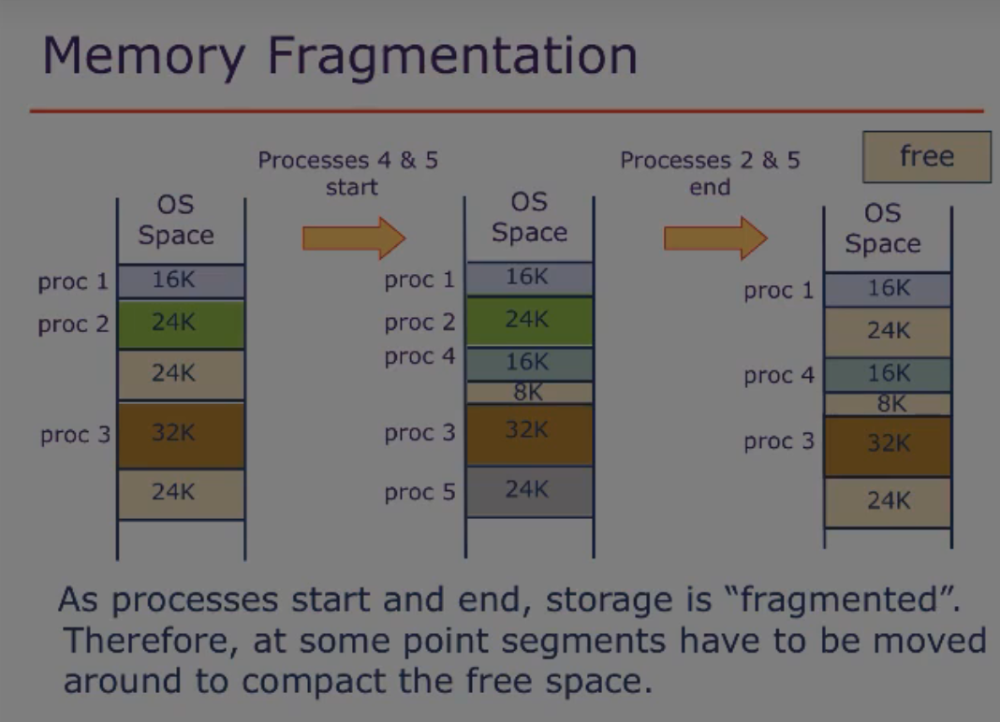

如图所示，对于base&bound映射，当执行multiprocess时，内存的空间很容易发生这么一种情况：总空闲内存足够，但是他们不连续，使得一个需要较大内存空间的process并不能直接获得内存分配。因此，在这种情况下一般会让所有已有的process挤一挤（重新调整位置），这是一个很costly的行为。


## Paged Memory system

### Single process 

为了解决Base and Bound架构容易形成memory fragmentation的缺点，不同于segmentation那样直接分配一个大的chunk，而是预先将main memory分成很多小的chunk，称为page。

一个page通常小于一个process所需要的内存空间，一般为4KB。

将内存划分为page，然后将这些page分配给process，使得一个process所需要的内存空间不再是连续的而可以是离散的。

为此，Paged memory提供了一个新的机制，它不再是对Base register添加virtual memory 的偏置来寻址physical memory，

而是首先通过virtual page找到对应的physical page，然后添加偏置

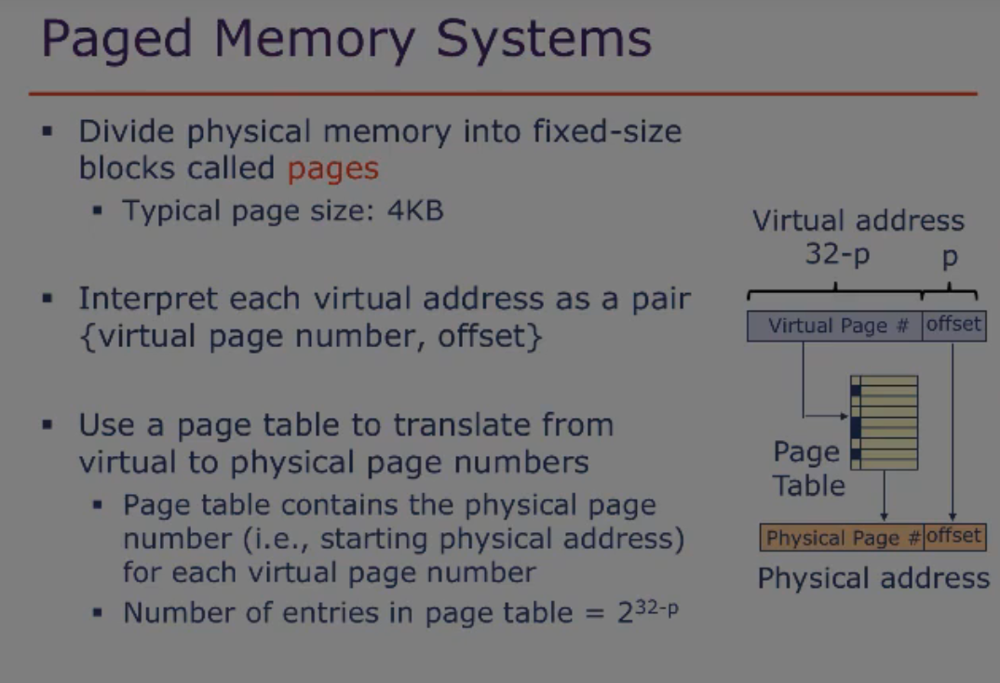

对于page table，实际上它只用存储Physical page以及一些*标志位*，因为Virtual Page本身是作为index的作用。

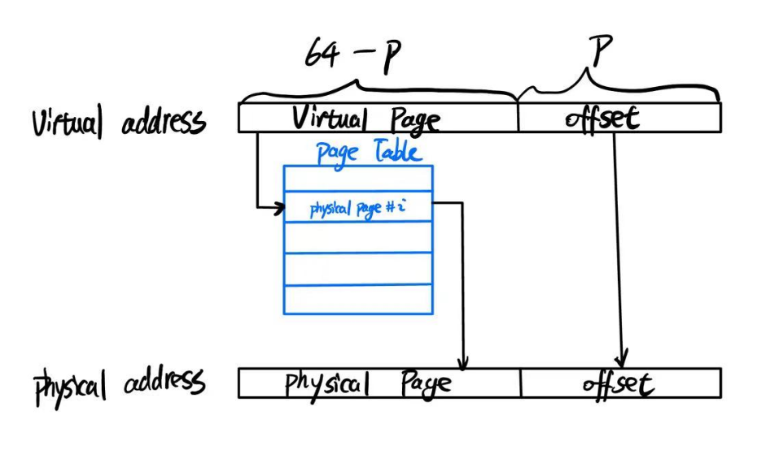


### Multi process

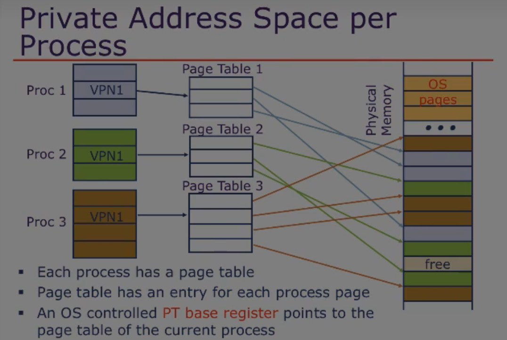

对于multi process的情况下，每个process按需从physical memory中索取page，加入到自己的page table中，这使得*从虚拟地址的角度来看，它是连续的，总大小是Page Table size $\times$ 4kb，而从physical memory的角度来看，它是离散的，这也规避了base and bound的缺点*


在Paged Memory system中，因为每个process拥有自己的page table，因此在switch的时候，os需要重新指向page table，也就是修改$\textcolor{red}{PT\ based\ register}$​寄存器内的数据。


### Where to store Page Tables

Page Table一样需要存储起来，一种方式是存储在main memory中，如图所示

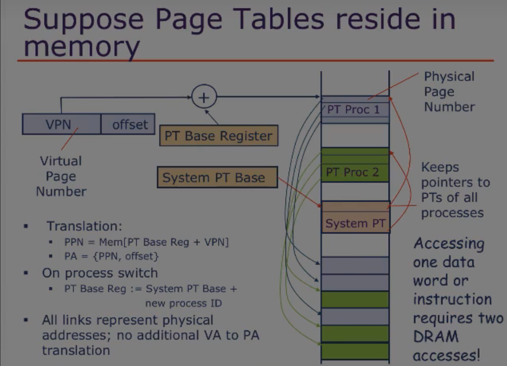

在这个图中，我们拥有一片专门的Page table存储区域，

* 当你切换到一个新的process，需要访问其数据时
* 首先，你从System Page Table获得你当前process的page table的PT Base Register
* 然后，以virtual memory的偏置加上PT Base Register获得对应的Physical address


可以发现，这种方法虽然可能有效，但是具有以下几个问题

* page table本身的存储可能具有 segment fragmentation，因为page table本身要求一段连续的内存空间，而system PT不足以支撑page table使用类似page的方式（这是可以改进的，因此是一个小问题）
* 第二个问题就是，我每次访问，都会至少需要两次main memory load，第一次是mapping的开销，访问Page Table获得数据的真正地址，第二次是访问这个真正的地址，取得所需的数据，如果涉及process switch，实际上还有一次访问system page table的开销。


### TLB

众所周知，访问main memory的开销是很大的，因此我们才会开发出cache。

因此，一个改进的方式是添加一个special cache来存储virtual page到physical page的映射。我们称这个cache 为**Translation Lookaside Buffer(TLB)**

==这个cache 存储了memory 中page table的一部分==

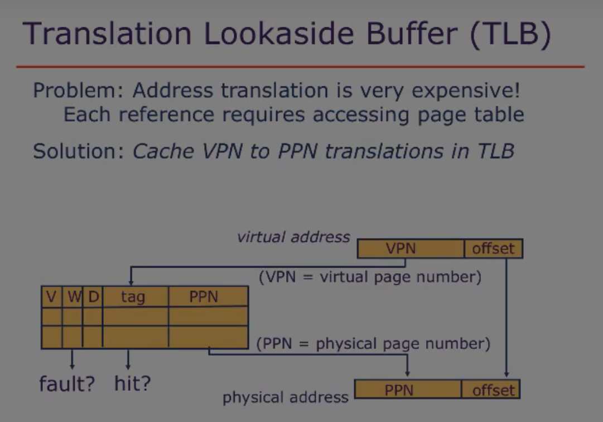

在TLB中，具体是这样的：

* 对于一个Process，首先获得Virtual Page number，在TLB中查询
* 对于TLB中的每一条，首先判断*Valid*位是否有效，有效则比较Tag位，若相同则完成转换
* 若没有发现Valid且Tag符合的cache line，则发生cache miss，需要上一节中提到的两次memory access获得对应值，同时更新cache状态

也就是，如果cache hit的话，你的消耗基本就是遍历一遍的消耗，但是如果cache miss的话，你的消耗就是两次memory call的消耗。

> 在TLB中，除了VPN和PPN，还有三个标识位，分别为V(Valid),W(Write-enable)以及D(Dirty)
>
> * Valid位通常用于标识该page table条是否有效，
>
>   使page table条无效的操作有很多，包括switch process，将内存存储到硬盘，这些都是代表当前VPN与PPN的对应关系失效
>
> * Write-enable位通常是为了提早检验写权限，避免每次写操作都需要查page table来确认。
>
>   例如一个进程尝试写入一个标记为只读的页面时，processor会检查TLB中的write-enable bit，如果为0就触发保护异常，*而无需访问页表*
>
> * Dirty
>
>   当进程对页面进行写入操作时，如果该页面对应的TLB条目存在，处理器将Dirty设为1.
>
>   Dirty位通常用于跟踪页面是否被修改，当页面被换出内存时，OS需要知道这个页面是否需要更新到内存，或者写回磁盘，Dirty位避免了每次写操作都访页表
>
> 可以发现，在寻址时，只有valid位是作用最大的，其他两个标识位都是后续优化


### TLB Design

* 通常是32-128 entries，4 to 8-way set-associative，一些现代架构会为TLB使用多级缓存
* 当TLB 发生cache miss时，它会一级一级缓存逐个寻找，直到寻找到main memory。
  * 当找到时，它会将相对应的VPN与PPN的映射加载到TLB中
  * 当然，如果在main memory中都找不到的话（也就是所谓的 the page is missing)，这就会引发一个十分昂贵的操作了(to be explained)
* 在发生process switch的时候，TLB会发生**flush**操作，基本上就是将当前TLB中的所有valid位设置为0
  * 也存在TLB的设计中直接记录process ID的架构，这种架构的好处是每次process switch不需要flush TLB，坏处是可用的TLB有效位变少了，这意味着更少的page table被存储，更多的cache miss。


## Demand Paging

Demand Paging被提出用来应对一个program所需要的可能比main memory要大的情况。

考虑这么一个常识，DISK的capacity几乎是可以算作无限的，而DRAM的capacity是有限的（因为更大的DRAM capacity可能会让DRAM本身更慢）

因此，如果我们将DRAM（main memory）看作是一个cache to DISK，那么我们的可用空间也是无限的。


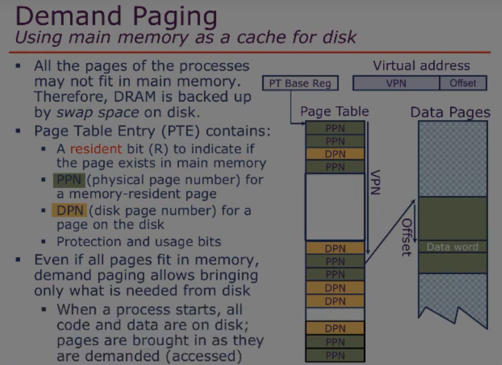

如上图所示，PTE包括了一个resident bit（用于标识是否在main memory中）

### 模拟

下面通过一个例子来模拟这整个过程


假设Virtual Address是一个12bit的地址，其中offset为8bit，Virtual Page Number为4bit， 这意味着一共有16个virtual page

假设Physical Address是一个11bit的地址，其中offset为8bit，Physical Page number为3bit，这意味着一共有8个physical page

对于如下的一个Page table，若是给出一个查询`VA = 0x2C8`，那么易得VPN=0x2, 因此可以从查表得知PPN处在0x4，因此PA=0x4C8

当然，这里需要Dirty Write-enable Resident位都符合。

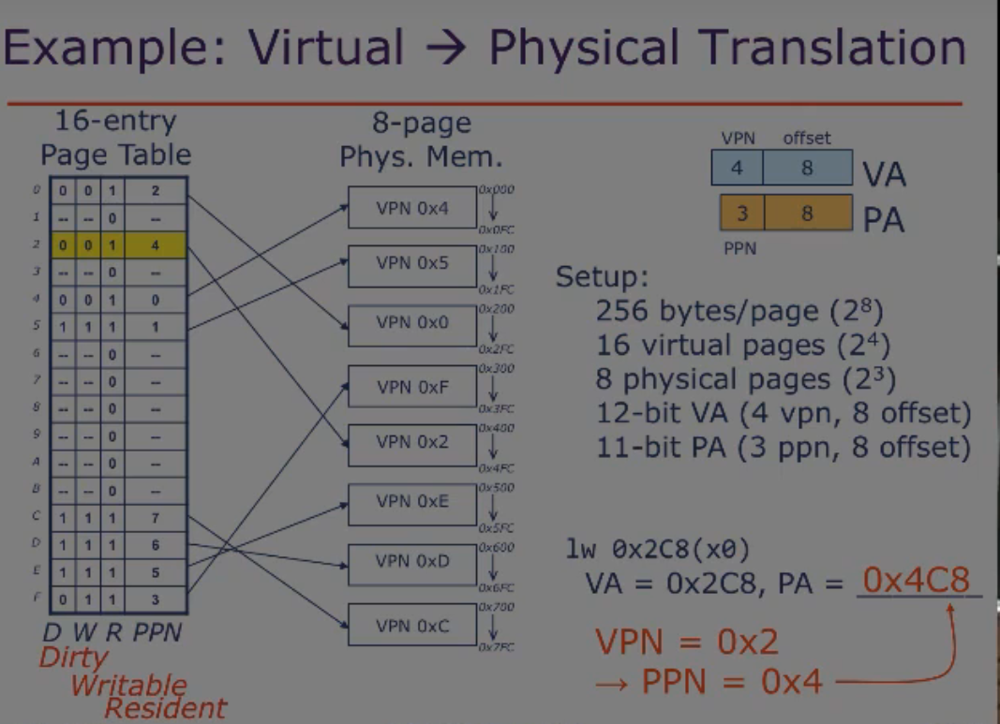

根据上面的假设，实际上Physical memory并不足以cover VA所有的需求地址，因此必然有一部分是存在DISK里面的。

对于这些地址，在Page Table中会用Resident标记出来。

接下来，我们将阐述当访问遇到的是存在DISK中该如何操作（也就是page fault exception），记得我们使用的是一个16entry4way的架构

* 首先，选择一个page进行replace，检查其dirty位，如果为1，将其对应的数据写回DISK，并重新标记为no resident
* 从disk去读对应的page，将其写入physical page中（替换之前写回的page）

* 更新Page table，主要是更新这个地址对应的physical page number
* os将控制权返回program，程序将重新执行memory access


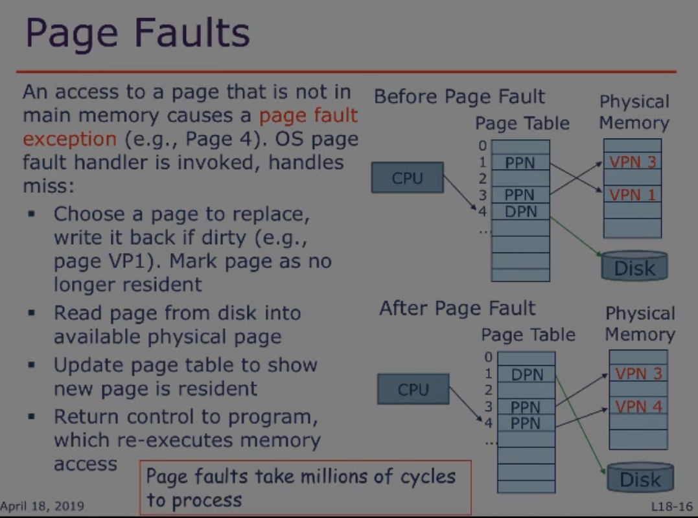


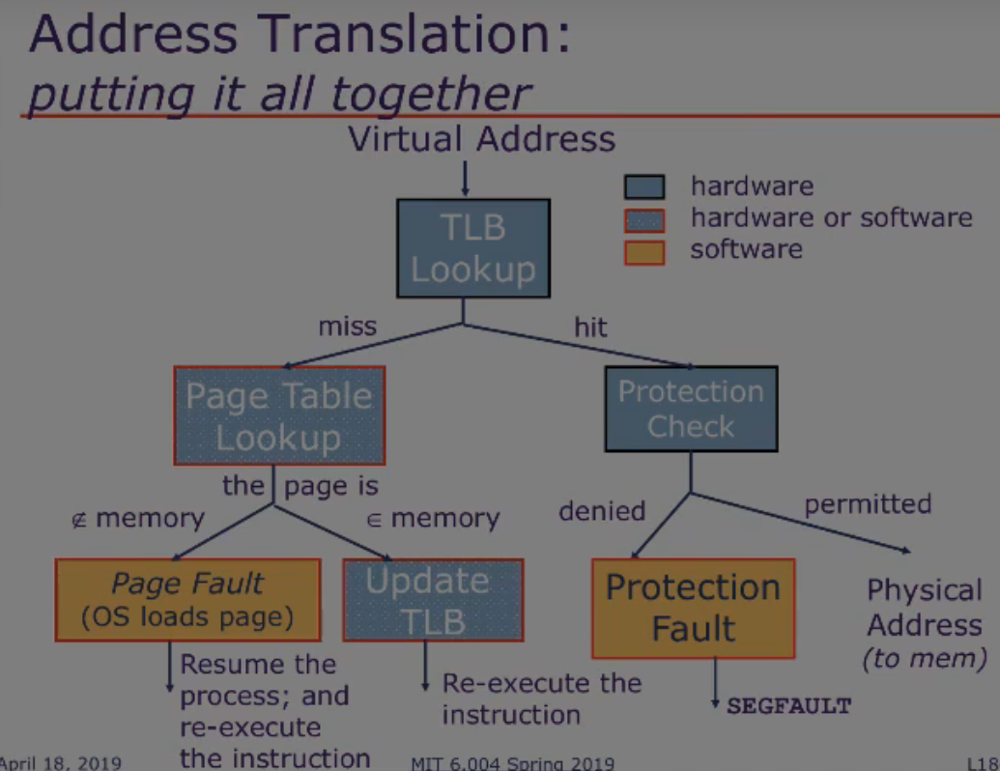


