# 快捷键

1. 按住Alt拖动，会自动复制object
2. QWER能够快速切换选择，平移，旋转，变形。

# 蓝图

## 蓝图组件

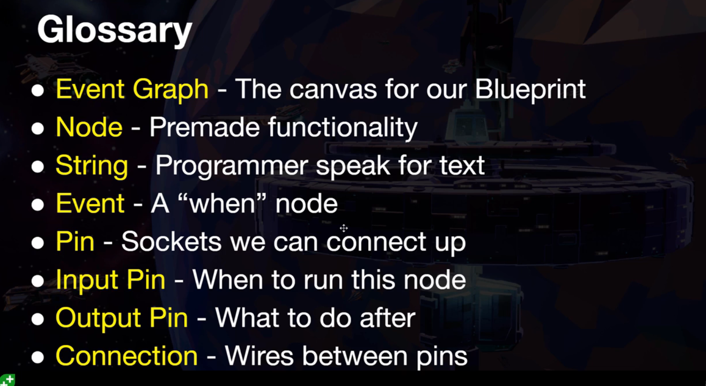

### Actor物件的physic

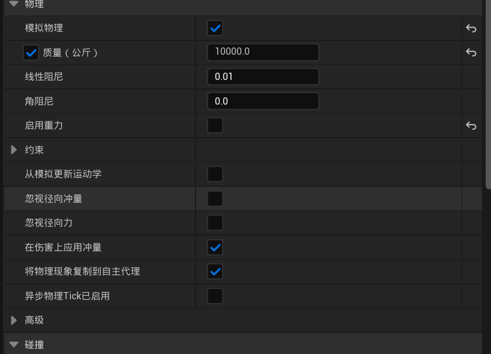

* 开启模拟物理，才会添加物理仿真
* 开启启用重力，才会添加重力仿真，否则只有碰撞仿真（类似太空）

### Ojbect and reference

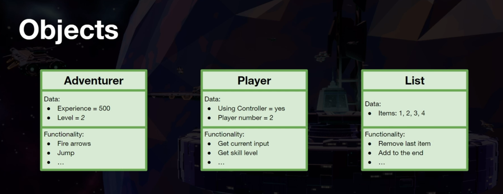

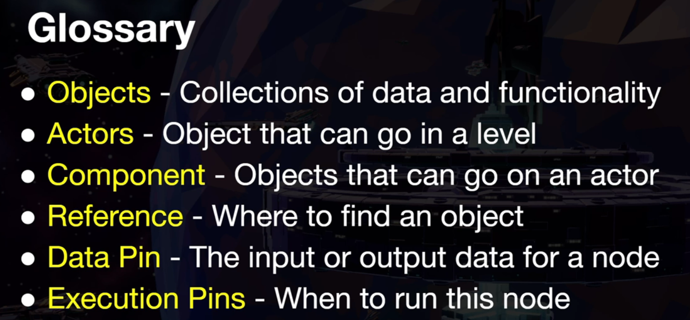

* Component:添加到object上的组件

* Reference的创建：在map中选中一个对象（例如cube)，进入蓝图，右键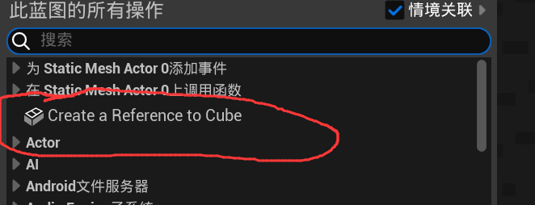

* Data pin:相当于对这个对象的一个引用拉出去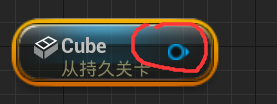

* Execution Pin:就是常规的白箭头

* 一个object Data pin通常用法就是拉出去，找这个object的成员函数，得到return，把return扔给execution pin，下图中的奇怪节点是类型转换。

  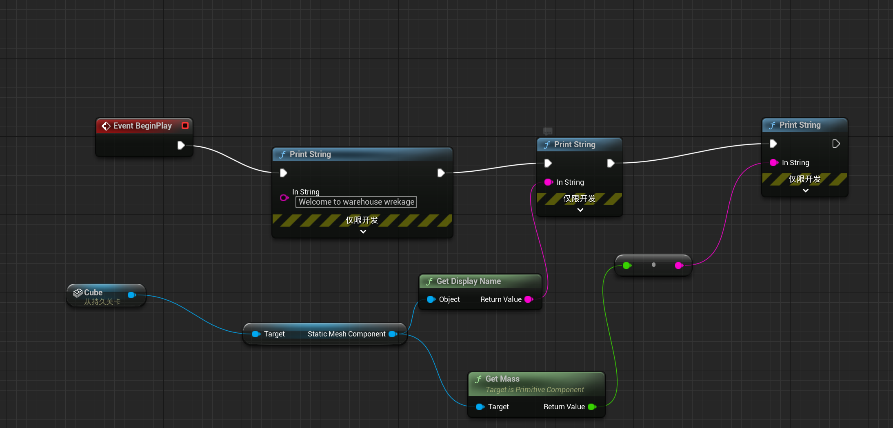

### 为对象添加冲量

即为按动空格为对象添加一个瞬时（趋向于0）的作用时间的力量。

记住几个公式
$$
Force(F) = Mass(M) \times Acceleration(a)
$$

$$
Impulese(I) = Mass(M) \times VelocityChange(\Delta v)
$$

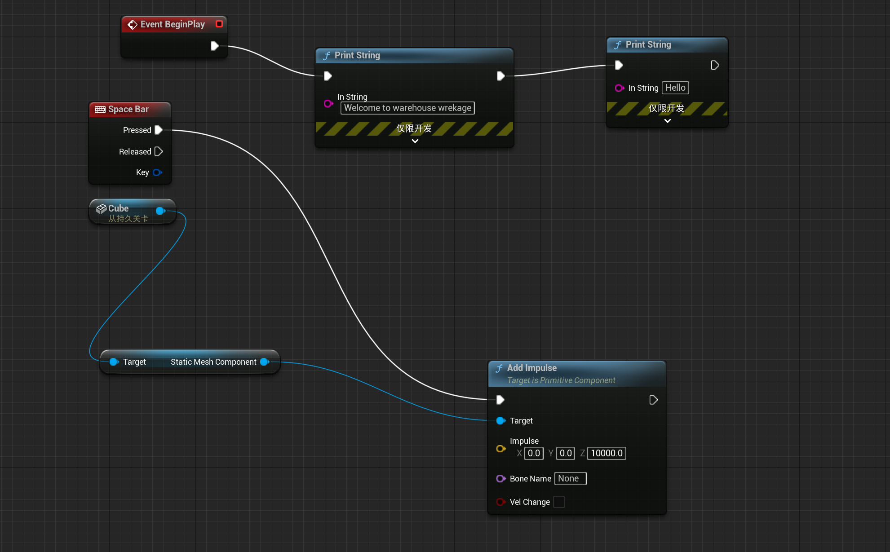

底下的Vel change如果选中，就不会考虑物体的质量，Z轴直接给的就是该方向上物体的速度，减少了人为计算，400cm/s

### 类与实例

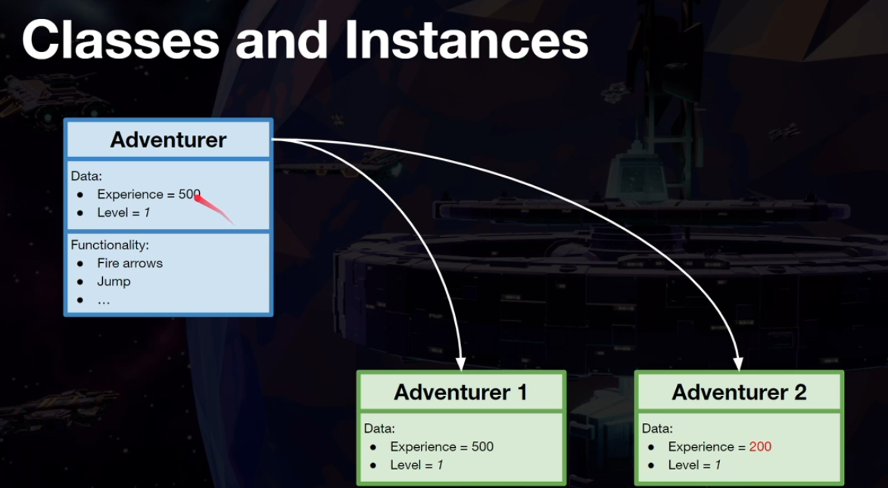

* 创建一个类

* 名字改为BP_projectile，代表这个是抛射体(projectile)的蓝图(blue print)

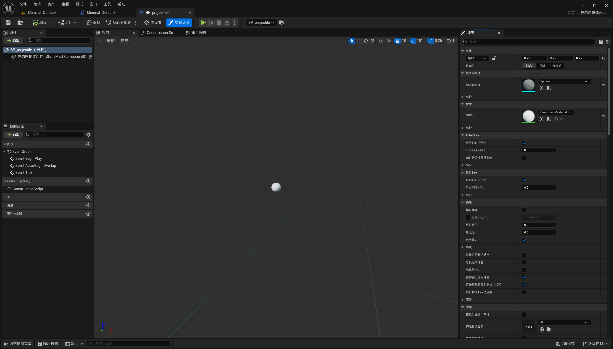

* 创建该类实例的方法，如下图，直接将这个类拉上去即为实例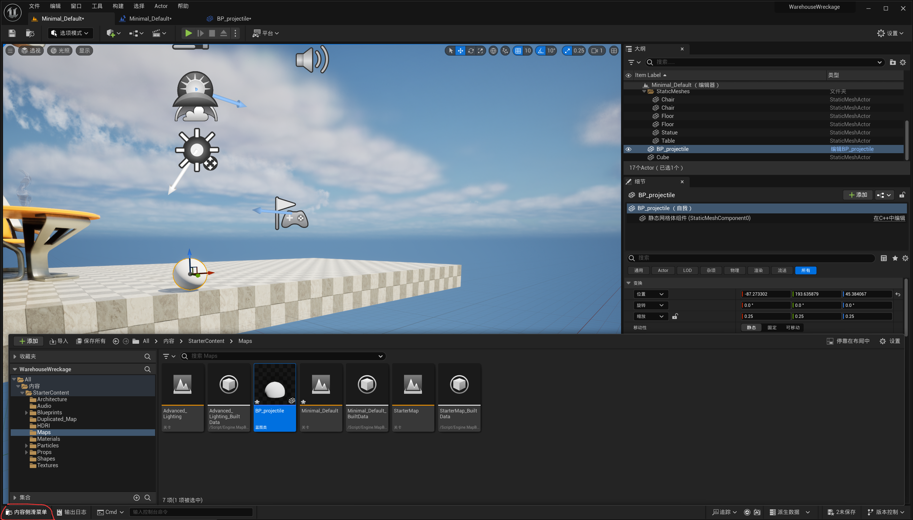

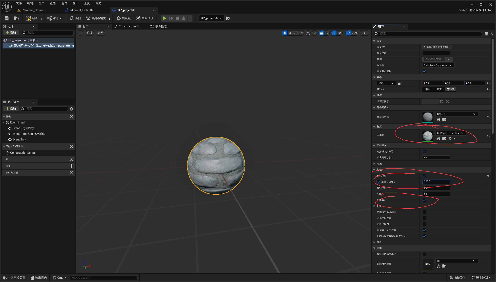

注意，这个改动是blue print改动，如果想对某个实例改动，直接在这个界面改，不用进”编辑此actor的蓝图"

### 按键生成对象

* 蓝图，spawn actor from class

  * spawn transform就是location，rotation，scale的合集，右键选择split struct pin(分割结构体引脚)以展开编辑

    * location：这个对象出现的初始位置

    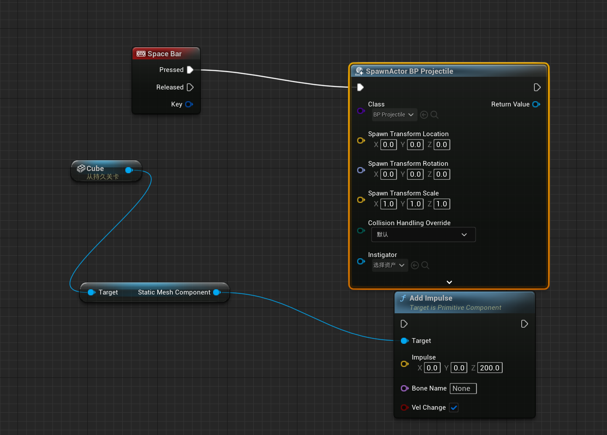

    这样按一次空格就会出现新的object

  * 如何令这些对象拥有一次冲量

    * 首先，这个spawn actor返回新创建的对象，因此我们直接为这个对象添加冲量即可
      * 具体来说，我们首先获得这个新对象的static mesh component，然后给他一个冲量
      * 当然，保险起见，我们将execution pin也连接到impulse上，保证是在创建新对象之后才会impulse

    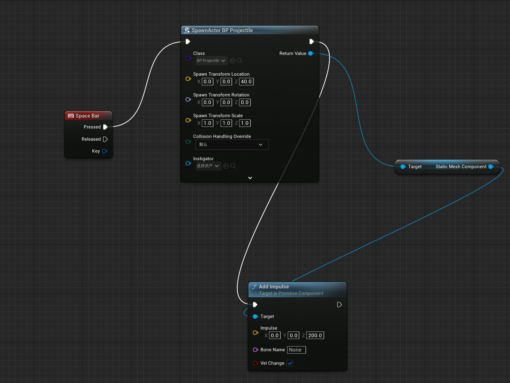

    
