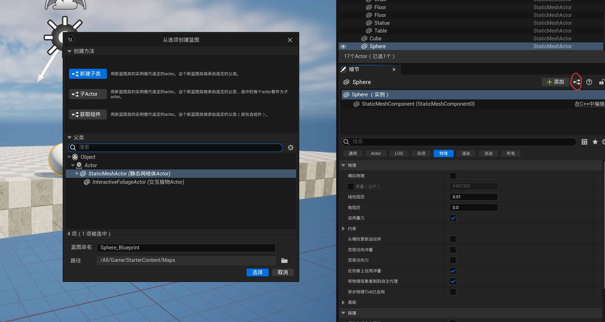

# 快捷键

1. 按住Alt拖动，会自动复制object
2. QWER能够快速切换选择，平移，旋转，变形。

# 蓝图

## 蓝图组件

### Actor物件的physic

* 开启模拟物理，才会添加物理仿真
* 开启启用重力，才会添加重力仿真，否则只有碰撞仿真（类似太空）

### Ojbect and reference

* Component:添加到object上的组件

* Reference的创建：在map中选中一个对象（例如cube)，进入蓝图，右键

* Data pin:相当于对这个对象的一个引用拉出去

* Execution Pin:就是常规的白箭头

* 一个object Data pin通常用法就是拉出去，找这个object的成员函数，得到return，把return扔给execution pin，下图中的奇怪节点是类型转换。

  

### 为对象添加冲量

即为按动空格为对象添加一个瞬时（趋向于0）的作用时间的力量。

记住几个公式
$$
Force(F) = Mass(M) \times Acceleration(a)
$$

$$
Impulese(I) = Mass(M) \times VelocityChange(\Delta v)
$$

底下的Vel change如果选中，就不会考虑物体的质量，Z轴直接给的就是该方向上物体的速度，减少了人为计算，400cm/s

### 类与实例

* 创建一个类

* 名字改为BP_projectile，代表这个是抛射体(projectile)的蓝图(blue print)

* 创建该类实例的方法，如下图，直接将这个类拉上去即为实例

注意，这个改动是blue print改动，如果想对某个实例改动，直接在这个界面改，不用进”编辑此actor的蓝图"

### 按键生成对象

* 蓝图，spawn actor from class

  * spawn transform就是location，rotation，scale的合集，右键选择split struct pin(分割结构体引脚)以展开编辑

    * location：这个对象出现的初始位置

    

    这样按一次空格就会出现新的object

  * 如何令这些对象拥有一次冲量

    * 首先，这个spawn actor返回新创建的对象，因此我们直接为这个对象添加冲量即可
      * 具体来说，我们首先获得这个新对象的static mesh component，然后给他一个冲量
      * 当然，保险起见，我们将execution pin也连接到impulse上，保证是在创建新对象之后才会impulse

    

### 数据类型

基本上就是

* 紫色 class
* 黄色 vector
* 红色 bool
* 蓝色 object
* 绿色 int
* 

### 从主视角发射球

在当前视界中按==f8==，然后移动，就能看到我们原来位置充当主视角的object，名字叫做default pawn

它是游戏世界中玩家的物理表示。

**但是当我们停止游戏，或者escape，我们就会发现我们搜不到这个object**

实际上，我们的初始位置在`player start`

==defualt pawn就是我们发射小球的地方==

* 进入蓝图搜索get player pawn,它没有执行pin，只有一个输入数据pin(int,0代表单人游戏，其余代表多人游戏的索引)和一个输出数据pin（object)

* 拉出这个object，找到**get actor location**

* 问题是只能向固定方向发射
* 获得相机的rotation信息，并让发射随视角转动，简单来说
  * 首先，将目标物体按camera(pawn object)的rotation角度旋转自身，考虑到我们物体是球，因此这个转动效果不明显，但是这个步骤对其他不规则物体是很必要的
  * 其次，给它施加一个向量冲量（从BP Projectile拉出Get actor forward vector)，既然这是一个向量，代表它的值非常小，因此需要将其增幅,从GetActorForwardVector拉一条Multiply出来即可，默认是做向量乘法，但是你可以点击左侧第二个pin，在“引脚转换”找到TO float即可。

