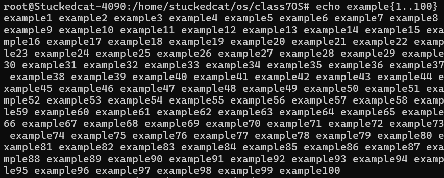
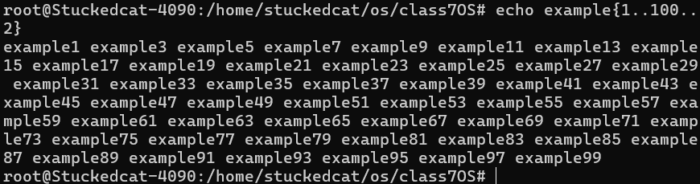
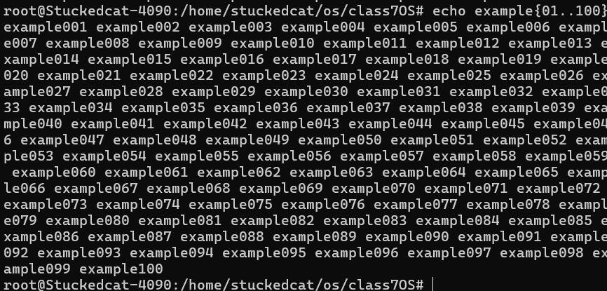
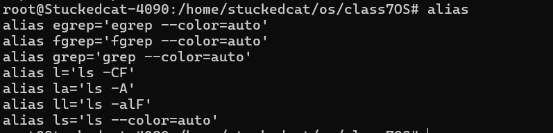
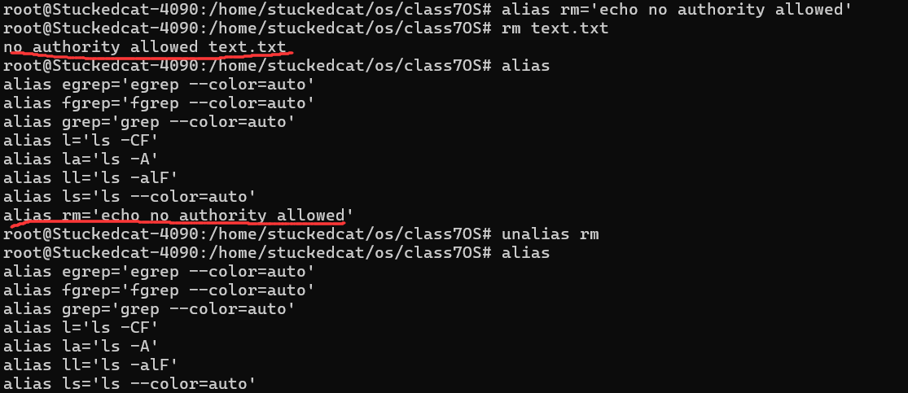

bash

## 命令行展开{}

```bash
echo example{1..100}
echo example{1..100..2}
echo example{01..100}
```








## 别名alias



这代表`ll`实际会使用`ls -alF`命令


可以使用`unalias`解除绑定，也可以使用alias重新绑定

例如`alias rm='echo no authority allowed'`




## 命令历史history

`history`调出命令历史记录

`!1`代表重现第一条命令

`!!`代表上一条命令


## 快捷键

`ctrl+a`：移到行首,ahead

`ctrl+e`：移到行尾,end

`ctrl+u`：删除光标之前的字符,up to start

`ctrl+k`：删除光标之后的字符,kill to end

`ctrl+l`：清除终端内容，类似clear,clear

`tab`：命令补全

