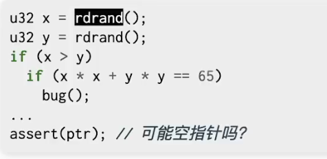
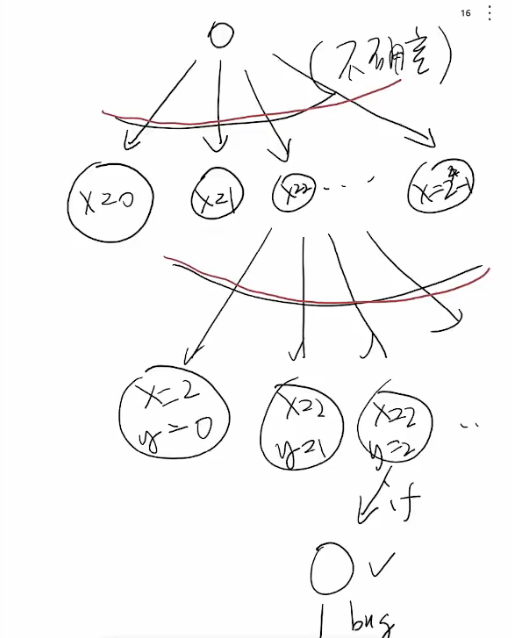
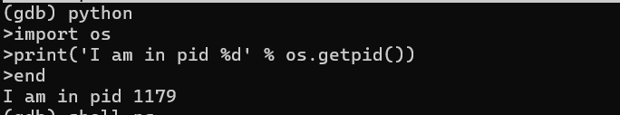
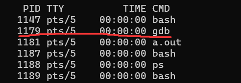
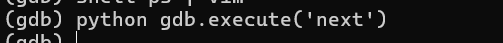
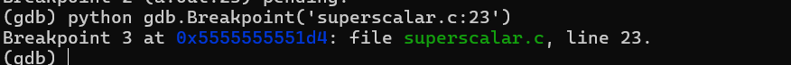
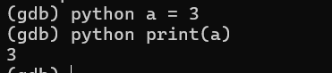
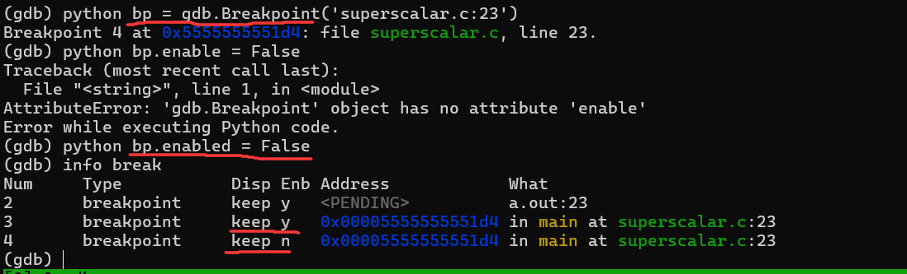
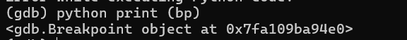

观察查看状态机

record full&rsi 

* 不是万能的，syscall会对状态机有很大影响，而record不会记录syscall

layout

multi-process

断点

查看值

修改值

$是什么

如何访问寄存器

性能优化

profiler

perf stat 性能指标记录

perf record

perf report

perf list

flame graph for profiler

并发model checker（https://jyywiki.cn/pages/OS/2022/demos/model-checker.py）

py model checker

spinroot.com 最古老的，自己创建了一个语言

NASA：Java PathFinder：检测所有的java 并发 model

TLA+：验证分布式协议正确性，枚举分布式调度，做有界的模型检验

> 并发保证每一个线程正常工作，而分布式需要假设节点会丢失

单线程程序的状态机

单线程程序也能具有不确定性（I/O，随机数）。以上图为例，假设出现`x^2+y^2==65`就会出现bug，那么对于这个状态机，我们综合上面的做法，能有两个方法检查模型

* 利用一些工具record所有的非确定量，这样在发生bug时候我们能回溯确定所发生的bug其涉及的量
* 考虑随机性有界，我们可以使用model checker枚举所有的可能组合排查bug

上面这个例子如果需要完全遍历需要多少个状态？

应该是(`2*2e32*2e32`)种。说实话，这么简单的问题能有这么多状态，modelchecker也就没有那么好用了。

一种方法是剪枝+状态的延迟展开。例如，标记x，y为u32的随机数，但是并不展开，也就是在if(x>y)那一步，我们只知道x,y是某个u32随机数。

这样，截至目前，无论有多少分支，状态数只有分支数个，而非`分支数*2e32*2e32`

直到我们遇到bug前一刻，可以展开u32，或者直接抽象为一个有界的数学模型，使用约束求解器求解(SMT solver)，这样整体的状态模型就不会很大。

[KLEE: Unassisted and automatic generation of high-coverage tests for complex systems programs](https://dl.acm.org/doi/10.5555/1855741.1855756) 

## GDB调试基础

layout(layout next)/ ctrl+x+a/

ctrl+p for previous command(upper arrow not work when layout )

break funcname , start

run,next(step over),nexti,s(step into),si

ref

x/i $pc  (examine)

info registers,...

gdb python comman ->do python command
or 

gdb python->open python env set in gdb

(runing python in gdb process instead of fork another new process)

(gdb) shell ps | vim - (因为shell不是为了在TUI中的，对齐没有调整，输出可能乱)

python in gdb has gdb class to do gdb command

在gdb中通过python创建的变量会保留

