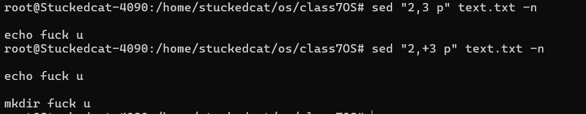

# 0. 总览

* grep：是文本过滤工具，从目标中提取符合条件的文本行，通过pattern匹配
* sed：是stream editor，流编辑器，是文本编辑工具
* awk：Linux的文本报告生成器（格式化文本），Linux上这个命令指向的是gwak(gnu awk)
* 正则表达式：一套字符匹配的规则

linux仅接受`grep`,`sed`,`awk`使用正则表达式。

> [04 sed与正则表达式_哔哩哔哩_bilibili](https://www.bilibili.com/video/BV1LV4y1M7zM/?p=4&spm_id_from=pageDriver&vd_source=61f56e9689aceb8e8b1f51e6e06bddd9)
>
> 本笔记来自于该合集并作出对应修改


# Regular Expression

分为基本正则表达式(Basic Regular Expression)和扩展正则表达式(Extend Regular Expression)

* 基本正则表达式(BRE)

  对应的元字符有`^$.[]*`

* 扩展正则表达式(ERE)

  在BRE基础上增加`(){}?+|`等字符

## 1. BRE


**基础字符**

*  `a`: 匹配字符`a`
* `.`: 匹配**除了换行符**以外的任何**单个字符**
* `^`：匹配行开头
* `$`：匹配行尾

> `^$`可以匹配空行，通常配合`grep -v ^$`来找出所有的非空行

* `\`：转义字符，让有特殊含义的字符还原本义

==关于转义字符有一个很容易混淆的用法，**在BRE中**，它修饰BRE的特殊字符代表转回普通字符，而如果修饰ERE的字符，则表示使用ERE中该字符的特殊用法（也就是由普通字符转换为特殊字符）==

例如，下面的一个例子能够很清晰的展示这一点


**量词**

* **`*`：前一个元素的所有重复集合（可以为空集）**

  例如，`grep 'a*b' file.txt` 会匹配文件中所有`a,ab,abb,abbb..`这样的组合

  > `.*`代表匹配所有内容
  >
  > `^.*`匹配任意多个字符开头内容
  >
  > `.*$`匹配任意多个字符结尾内容


**Character Classes：仅字符匹配**

主要作用是匹配一组特定字符的任何一个字符，因为是匹配单个字符所以很少用

* `[abc]`：匹配`a`,`b`,`c`的任何单个字符

  `grep '[abc]' file.txt` 将会匹配`file.txt`中包含字符`a`,`b`或者`c`的所有行

* `[a-z]`：匹配所有小写字母

* `[A-Z]`：匹配所有大写字母

* `[0-9]`：匹配所有数字

* `[^abc]`：匹配**除了a，b，c**之外的字符


## 2. ERE

> 扩展正则必须使用grep -E才能生效

**量词**

* **`+`：前一个元素所有重复集合（不可以为空集）**

  `grep 'ab+' file.txt` 会匹配文件中所有`ab,abb,abbb,..`这样的组合 

  > `[:\]+`：匹配中括号内字符一次或者多次

* **`?`：前一个元素的0次或者1次出现**

  `grep 'ab?' file.txt` 匹配`a`或者`ab**`**

* **`{n}`：前一个元素恰好n次出现**

  `grep 'a{3}' file.txt` 匹配`aaa`

* **`{n,}`：前一个元素至少出现n次**

  `grep 'a{3,}' file.txt` 匹配`aaa,aaaa,...`

* **`{,n}`：前一个元素至多出现n次**

  `grep 'a{3,}' file.txt` 匹配`aaa,aaaa,...`

* `{n,m}`：前一个元素出现n次到m次

  `grep 'a{2,4}' file.txt` 匹配`aa,aaa,aaaa`

* `()`：代表将括号中元素视为一个整体处理

  `grep 'ab(abc)?' file.txt` 匹配`ab,ababc`

  > 几个使用的例子
  >
  > 例如需要匹配good和glad，使用`g(oo|la)d`
  >
  > 一个比较高阶的用法是**向后引用**，指的是**括号内的内容可以被后面的`\n`，正则引用**
  >
  > * `\1`表示从左侧起第一个括号中的模式所匹配的字符
  > * `\2`同理
  >
  > 例如，为例匹配类似`I love my lover`这样xxx AWord xxx AWord的形式
  >
  > `(l..e).*\1`会匹配到`love my love`

* `|`：代表取一种情况，相当于字符匹配中的`[]`

  `grep 'cat|dog' file.txt`匹配行中出现cat或者dog的行

常见的字符串匹配例子有

`grep '(cat|dog)s?' file.txt` 匹配`cat,cats,dog,dogs`


## 5.Escape Sequence

这里介绍了各种通配符，这是最常见的字符匹配方式


* `\d`：等同于`[0-9]`，匹配任何数字

* `\w`：`\word`,等同于`[a-zA-Z0-9_]`，匹配任何字母，数字，下划线

* `\s`：`\space`,匹配任意的空格字符，包括`spaces,tab`

* `\b`：匹配一整个单词

  例如`\bcat\b`，这意味着匹配`cat`这个单词，而非其他含有cat的单词，例如`concatenate`

  与`\s(cat)\s`不太像，`\b`允许单词的前后为其他非单词字符，例如空格，标点符号，字符串的开头结尾

* `\t`：仅匹配制表符

* `\`转义符用于和special character组合，==使其在匹配该字符本身和特殊作用匹配符中相互转换==


> **`\.`**: 匹配任意单个字符（除换行符以外）。
>
> - 例如：`a.c` 可以匹配 `"abc"` 或 `"a9c"`，但不能匹配 `"ac"`。
>
> **`\^`**: 匹配字符串的开头。
>
> - 例如：`^hello` 匹配 `"hello world"` 中的 `"hello"`，但不匹配 `"a hello"`。
>
> **`$`**: 匹配字符串的结尾。
>
> - 例如：`world$` 匹配 `"hello world"` 中的 `"world"`，但不匹配 `"world peace"`。
>
> **`*`**: 匹配前面的字符或子表达式0次或多次。
>
> - 例如：`ab*c` 可以匹配 `"ac"`、`"abc"` 或 `"abbc"`。
>
> **`+`**: 匹配前面的字符或子表达式1次或多次。
>
> - 例如：`ab+c` 可以匹配 `"abc"` 或 `"abbc"`，但不能匹配 `"ac"`。
>
> **`?`**: 匹配前面的字符或子表达式0次或1次。
>
> - 例如：`ab?c` 可以匹配 `"ac"` 或 `"abc"`，但不能匹配 `"abbc"`。
>
> **`[]`**: 匹配方括号内的任意一个字符。
>
> - 例如：`[aeiou]` 匹配任何一个元音字母。
>
> `()`：用于分组或者捕获
>
> `{}`：用于指定匹配次数
>
> **`|`**: 表示“或”的关系，用于选择多个模式中的一个。
>
> - 例如：`cat|dog` 可以匹配 `"cat"` 或 `"dog"`。
>
> `\`：转义符本身
>
> 同理`\\b`转义`\`并让b作为一个正常的字符来匹配，因此`\\b`匹配`\b`
>
> | 字符 | 正则表达式中的功能      | 字面匹配的转义形式 |
> | ---- | ----------------------- | ------------------ |
> | `.`  | 匹配任意单个字符        | `\.`               |
> | `^`  | 匹配字符串的开头        | `\^`               |
> | `$`  | 匹配字符串的结尾        | `\$`               |
> | `*`  | 匹配前一个元素0次或多次 | `\*`               |
> | `+`  | 匹配前一个元素1次或多次 | `\+`               |
> | `?`  | 匹配前一个元素0次或1次  | `\?`               |
> | `(`  | 分组                    | `\(`               |
> | `)`  | 分组                    | `\)`               |
> | `{`  | 匹配次数                | `\{`               |
> | `}`  | 匹配次数                | `\}`               |
> | `[`  | 定义字符类              | `\[`               |
> | `]`  | 定义字符类              | `\]`               |
> | `\`  | 转义字符                | `\\`               |


一个例子：

> `grep -ve '^\(\#\|echo\|mkdir\|make\)' `
>
> 用于匹配 作为行开头的`(#)或者(echo)或者(mkdir)或者(make)`


# grep:文本内容筛选

## 什么是grep

**grep** searches the input files for lines containing a match to a given pattern list. When it finds a match in a line, it copies the line to standard output (by default), or whatever other sort of output you have requested with options.

Though **grep** expects to do the matching on text, it has no limits on input line length other than available memory, and it can match arbitrary characters within a line.**If the final byte of an input file is not a *newline*, grep silently supplies one.** Since newline is also a separator for the list of patterns, ==there is no way to match newline characters in a text.==


## grep的参数

* `-n`：显示行号
* `-v`：reverse，输出不包含所匹配字符的行

```bash
grep -v 'bash' /etc/passwd | grep -v nologin
```

检查所有没有bash和没有nologin的行


* `-c`：统计出现次数
* `-i`：ignore，忽略大小写的匹配
* `-w`：匹配整个单词，即只匹配那些被空格或其他非字母数字字符包围的单词。
* `-o`：仅显示匹配到的字符串本身
* `-E`：扩展


# sed：文本数据加工

## 语法

> `sed [Options] [范围 内置命令字符] [输入文件]`

## 工作流程


## 参数选项

| 参数选项 | 功能                                                   |
| -------- | ------------------------------------------------------ |
| `-n`     | 取消默认的sed输出（无论是否满足条件），通常与p联合使用 |
| `-i`     | 直接将修改结果写入文件                                 |
| `-e`     | 多次编辑不需要管道符                                   |
| `-r`     | 支持正则扩展                                           |


内置命令符

| 内置命令符              | 解释                                                         |
| ----------------------- | ------------------------------------------------------------ |
| `a`                     | append，文本追加。在指定行**后面**添加一行或者多行文本       |
| `d`                     | Delete，删除匹配行                                           |
| `i`                     | insert，表示插入文本，在指定行**前面**添加一行或者多行文本   |
| `p`                     | print，打印匹配行的内容，通常与-n                            |
| `s/正则匹配/替换内容/g` | 匹配正则内容，然后替换内容，结尾g代表全局匹配。**sed允许任何非字母数字单字符作为分隔符，不局限于/，因此这里可以写为s###g**。另外,g表示匹配行中所有的对应模式而非仅第一个。 |


sed的匹配范围

| 范围        | 解释                                                         |
| ----------- | ------------------------------------------------------------ |
| 空地址      | 默认全局处理                                                 |
| 单地址      | 指定文件的某一行                                             |
| `/pattern/` | 被模式匹配到的每一行，类似grep重定向                         |
| 范围区间    | 10，20:十行到二十行                                          |
|             | 10,+5：第10行向下五行                                        |
|             | 10，$：第十行到末尾                                          |
|             | `/pattern1/,/pattern2/`：满足多个模式匹配的行                |
| 步长        | 1~2，表示从1开始步长为2，通常使用`1~2`表示奇数行，`2~2`表示偶数行 |


## 例子

### 匹配范围


==注意使用-n,否则全部输出，这也就是为什么-n和p通常联合使用==

输出2到3行，和输出2以及往后三行



使用匹配范围，注意pattern如果需要ERE也需要添加-E的options


### 删除

==这里，删除的是sed读到内存中的数据，而非原始文件数据==，因此，经过如下的删除操作之后，源文件不变


### 替换模式

**范围**: 在 `sed` 脚本中，你可以指定范围（行号范围、模式范围等）来限制替换操作只在特定的行上进行。

- **行号范围**: 例如 `sed '2,5s/pattern/replacement/g' file.txt` 只会在第 2 到第 5 行之间进行替换。
- **模式范围**: 例如 `sed '/start/,/end/s/pattern/replacement/g' file.txt` 只会在匹配到 `start` 和 `end` 之间的行进行替换。

**`/g` 选项的影响**:

- `/g` 选项影响的是**在指定范围内的每一行**，是否替换所有匹配的实例。即使你指定了范围（行号范围或模式范围），`/g` 选项仍然会在该范围内的每一行中全局替换。


如果指定范围第六行到末尾


### 插入

1i代表在第一行前插入，-i代表直接写入文件


==没有指定范围时，代表每一行都插入==


