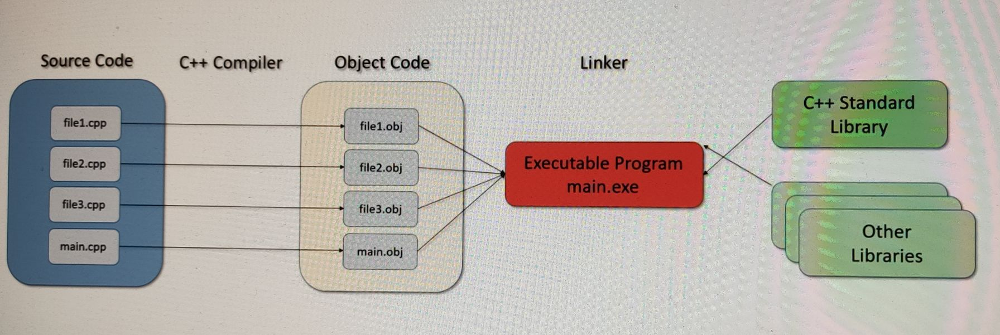

# 1. 编程语言排行网站

> https://www.tiobe.com/tiobe-index/
>
> https://redmonk.com/sogrady/2017/06/08/language-rankings-6-17/
>
> https://www.zdnet.com/article/which-programming-languages-are-most-popular-and-what-does-that-even-mean/
>
> https://spectrum.ieee.org/the-2017-top-programming-languages
>
> https://pypl.github.io/PYPL.html

# 2. C++的发展

* Classic C++ -> C++ 11
* Modern C++ -> C++ with new features

- **1970年代**: 在这个时期，C语言变得越来越受欢迎。然而，Bjarne Stroustrup认为C语言缺乏面向对象的功能，所以他开始对C语言进行扩展。
- **1979年**: Bjarne Stroustrup开始在贝尔实验室开发一种新的语言，名为"C with Classes"，即"C带有类"。这个项目的初衷是为了在C语言的基础上添加面向对象的功能。
- **1983年**: "C with Classes"被重新命名为C++。在这个版本中，Stroustrup添加了虚函数，也就是可以在子类中重写的函数，以及函数和运算符重载等特性。
- **1989年**: C++ 2.0发布，其中引入了多重继承、抽象类、静态成员函数等特性。
- **1998年**: C++标准库（STL）成为语言的一部分，成为第一个官方的ISO标准版本ISO/IEC 14882:1998，通常称为C++98。C++98是C++的第一个国际标准，提供了大量的库，如字符串，容器，算法等。
- **2001年**: 由于C++98标准的一些问题，ISO在2001年发布了一个修订版，称为C++03。这个版本主要是对C++98进行了一些修改和改进，但并未引入新的语言特性。
- **2003年**: C++03是C++98的小修订，修复了一些C++98的漏洞和不明确的内容，虽然修订的内容不多，但是这个版本稳定性较好，被广泛接受。
- **2011年**: 经过多年的发展和讨论，ISO发布了新的C++标准，被称为C++11。这个版本的改动非常大，加入了很多新的特性，比如新的字符串类型，自动类型推断，nullptr，lambda表达式，智能指针等。
- **2014年**: 为了修复C++11中发现的一些问题和不足，ISO在2014年发布了新的标准，称为C++14。这个版本主要是对C++11的改进和优化，比如泛型的改进，lambda表达式的扩展，新增了二进制字面量、通用后缀等特性。
- **2017年**: C++17标准发布。此版本相较于C++14进一步增强了C++语言和库的功能，引入了例如if constexpr、结构化绑定、内联变量、std::optional、std::variant、std::any等新特性，以及更多标准库的增强。此外，对于模板编程提供了更强大的支持。
- **2020年**: C++20标准发布，这是迄今为止最大的一次更新。C++20中引入了模块（modules）、概念（concepts）、三元运算符范围（three-way comparison operator）、format库等一系列新特性，以及对一些旧有特性的改进，比如更好的并发和协程支持，增强的constexpr，新的标准属性等。这些新增特性极大地提高了C++的表现力和效率。

# 3.C++流程

**编程语言 (Programming Language)**: 编程语言是一种用来指示计算机执行特定任务的形式化语言。它可以被分为多种类型，包括但不限于面向对象的语言（如Java和C++）、函数式语言（如Haskell和Lisp）、以及过程式语言（如C和Pascal）。编程语言是程序员与计算机交流的基础。

**编辑器 (Editor)**: 编辑器是用来编写和修改代码的工具。它们可以是简单的文本编辑器（如Notepad或Vim），也可以是复杂的集成开发环境（IDE，例如Visual Studio或Eclipse），提供自动补全、语法高亮等功能。

**机器语言 (Machine Language)**: 机器语言是一种能直接被计算机硬件解读和执行的低级编程语言。每种计算机架构都有自己的机器语言，它通常是二进制的形式。

**编译器 (Compiler)**: 编译器是一个将高级编程语言（如C++或Java）翻译成低级语言（如机器语言）的程序。它进行词法分析、语法分析、语义分析和优化等步骤，最后生成可执行的机器语言代码。

**链接器 (Linker)**: 链接器是编译过程的最后一步。它将编译器产生的多个对象文件（object files）链接在一起，生成一个可执行的程序。链接器解决了代码模块化带来的问题，使得各个模块可以相互引用。

**测试 (Test)**: 测试是软件开发过程中的一个重要环节，它用于检查程序的功能是否符合预期，以及是否存在错误或缺陷。测试可以分为单元测试（针对单个模块或函数）、集成测试（针对多个模块的组合）和系统测试（针对整个系统）等。

**调试 (Debugging)**: 调试是找出和修复代码错误的过程。程序员通常使用调试器（debugger）来逐行运行代码，观察变量的值和程序的执行流程，以找出导致错误的部分。

## 3.1 IDE

Function： 

* Editor
* Compiler
* Linker
* Debugger
* Keep everything in sync

IDEs:

* CodeLite
* Code::Blocks
* NetBeans
* Eclipse
* Clion
* Dev-C++
* KDevelop
* Visual Studio
* Xcode

IDE，全称是“集成开发环境”（Integrated Development Environment），是用于提供程序开发环境的应用程序，一般包括代码编辑器、编译器、调试器和图形用户界面等工具。有些IDE还包含了版本控制、类浏览、对象浏览和对象查找等功能。

IDE主要用于简化软件开发过程。通过整合常用的开发工具，IDE能够帮助程序员更加高效地编写、调试和维护代码。它通常提供如语法高亮、自动补全、智能提示等功能，帮助程序员更容易地理解和编写代码。

# 4.C++的特性

以下是C++各个标准中一些常用特性的概述：

1. **C++98/C++03**
   - **STL (Standard Template Library)**: STL提供了一套模板类和函数，用于处理数据结构和算法，包括向量（vector）、列表（list）、队列（queue）、栈（stack）、算法（algorithm）等。
   - **异常处理 (Exception Handling)**: 引入了try, catch, throw等关键字，提供了一种标准的错误处理机制。
2. **C++11**
   - **自动类型推断 (auto)**: 关键字auto可以用来自动推断变量的类型，简化了代码的编写。
   - **范围for循环 (Range-based for loop)**: 用于简化对容器的遍历。
   - **nullptr**: nullptr是一个指针常量，用于表示空指针，取代了之前的NULL和0。
   - **Lambda表达式**: 提供了一种方便的匿名函数的写法。
   - **智能指针 (Smart pointers)**: 智能指针如unique_ptr, shared_ptr, weak_ptr提供了一种自动管理内存的机制。
3. **C++14**
   - **泛型Lambda**: C++14进一步增强了Lambda表达式，允许Lambda函数的参数自动推断类型。
   - **编译时常数表达式 (constexpr)**: constexpr关键字用于声明可以在编译时求值的常数，C++14放宽了constexpr函数的限制，允许包含多个语句。
4. **C++17**
   - **结构化绑定 (Structured bindings)**: 允许一次声明多个变量，对结构体或元组进行解包。
   - **内联变量 (Inline variables)**: 使得在头文件中定义的变量不会引起多重定义错误。
   - **if constexpr**: 允许在编译时根据条件选择执行代码。
5. **C++20**
   - **模块 (Modules)**: 提供了一种新的组织代码的方式，可以提高编译速度，改善代码隔离。
   - **概念 (Concepts)**: 提供了对模板参数类型进行约束的能力，增强了模板的可读性和错误信息的可理解性。
   - **范围 (Ranges)**: 提供了一种新的处理序列数据的方式，可以链式调用算法。

以上只是C++各个标准中的一部分特性，C++是一门非常复杂且功能强大的语言，其特性远不止这些。

# 5. 所涉及的c++特性

## Basic

* structure of c++ program
* * include
  * namespace
  * comments
  * main
  * cin & cout
* Variables and Constants
* * declare
* * use
* * name
* * basic type
  * * int 
    * float 
    * character 
    * etc

* Arrays and Vector and Multi-dimensional structure

* Strings

* Statements and Operators

* Determining Control Flow

* Functions

* Pointers and References

## OOP

* OOP-Classes and Objects
* Operator Overloading
* Inheritance(继承)
* Polymorphism(多态)

## More advanced

* Smart Pointers(simplify memory management)
* Standard Template Library(STL)
* I/O Stream
* Exception Handling