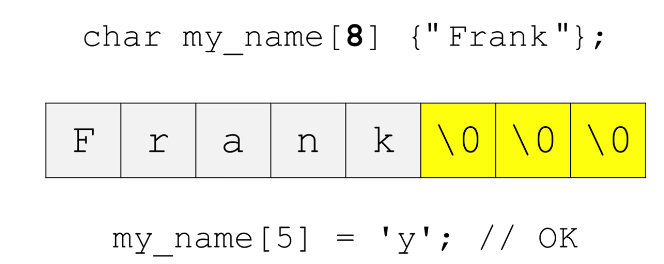
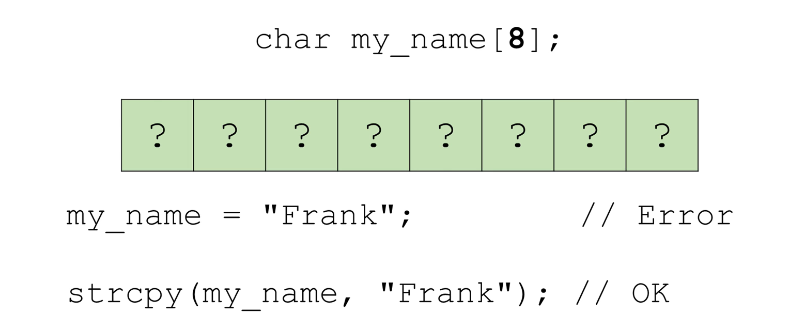
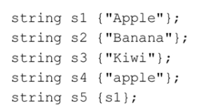

## 1. CCTYPE Library

```c++
#include<cctype>
```

### Testing Characters


### Converting characters


###  `<cctype>` 常用函数

#### 字符分类

1. **`isalpha(int c)`**:
   - 检查字符是否为字母（a-z, A-Z）。
   
2. **`isdigit(int c)`**:
   - 检查字符是否为数字（0-9）。

3. **`isalnum(int c)`**:
   - 检查字符是否为字母或数字。

4. **`isspace(int c)`**:
   - 检查字符是否为空白字符（如空格、制表符、换行符等）。

5. **`ispunct(int c)`**:
   - 检查字符是否为标点符号。

6. **`islower(int c)`**:
   - 检查字符是否为小写字母。

7. **`isupper(int c)`**:
   - 检查字符是否为大写字母。

#### 字符转换

8. **`tolower(int c)`**:
   - 如果字符是大写字母，则返回其小写形式，否则返回原始字符。

9. **`toupper(int c)`**:
   - 如果字符是小写字母，则返回其大写形式，否则返回原始字符。

#### 其他

10. **`iscntrl(int c)`**:
    - 检查字符是否为控制字符。

11. **`isgraph(int c)`**:
    - 检查字符是否有图形表示（即它是可打印的，并且不是空格）。

12. **`isprint(int c)`**:
    - 检查字符是否是可打印的，包括空格。

13. **`isxdigit(int c)`**:
    - 检查字符是否为十六进制数字。

> 注意：这些函数通常用于单个字符，但它们接受的参数是 `int`。通常，你会传递一个 `char` 值给它们，但是这个 `char` 值会被自动转换为 `int`。


## 2. C style strings

> 所有的操作都依赖于null terminate string

* Sequence of Characters

  * 在内存中连续存储的character

  * 表现为字符的数组

  * null 字符 或是 0字符作为终止符

* String Literal
  * 字符串文字，即用双引号括起来的字符序列
  * **常量**，我们不能改变
  * 以 null 字符终止
  * 
  * c会自动为这个字符串插入一个终止符，但是你如果对终止符的位置赋值，并不会得到一个报错，进而这个字符串也没有了终止符，并且这种操作也在array bound中
  * 如果我们预先指定了字符串长度，则可以在范围内进行修改
  * 若是我们申请一个空的array，我们不能直接为它赋值，因为其内容是不确定的，它除了最后有一个终止符号，之前也有，导致print不全，并且它本身是一个常量，这样就像10=12一样，并不合法。我们只能采用stringcopy函数来赋值。当然，如果所复制的字符串并不是以null终止，那么可能会因为越界导致程序崩溃。我们可以将其以char my_name[8] {};初始化

### `<cstring>` 常用函数

#### 字符串操作

1. **`strcpy(char* dest, const char* src)`**:
   - 将 `src` 字符串复制到 `dest`。

2. **`strncpy(char* dest, const char* src, size_t n)`**:
   - 将 `src` 的前 `n` 个字符复制到 `dest`。

3. **`strcat(char* dest, const char* src)`**:
   - 将 `src` 字符串追加到 `dest` 之后。

4. **`strncat(char* dest, const char* src, size_t n)`**:
   - 将 `src` 的前 `n` 个字符追加到 `dest` 之后。

5. **`strlen(const char* str)`**:
   - 返回 `str` 的长度。

#### 字符串比较

6. **`strcmp(const char* str1, const char* str2)`**:
   - 比较两个字符串。如果相等返回0，`str1` 小于 `str2` 返回负值，否则返回正值。

7. **`strncmp(const char* str1, const char* str2, size_t n)`**:
   - 比较两个字符串的前 `n` 个字符。

#### 字符串查找

8. **`strchr(const char* str, int c)`**:
   - 返回一个指针，指向 `str` 中第一次出现字符 `c` 的位置。

9. **`strrchr(const char* str, int c)`**:
   - 返回一个指针，指向 `str` 中最后一次出现字符 `c` 的位置。

10. **`strstr(const char* haystack, const char* needle)`**:
    - 返回一个指针，指向 `haystack` 中第一次出现字符串 `needle` 的位置。

11. **`strspn(const char* str1, const char* str2)`**:
    - 返回 `str1` 的前缀长度，该前缀中的所有字符都包含在 `str2` 中。

12. **`strcspn(const char* str1, const char* str2)`**:
    - 返回 `str1` 的前缀长度，该前缀中的所有字符都不包含在 `str2` 中。

#### 其他

13. strlen(string) 返回size_t类型，该类型类似无符号整数，其范围随着系统变化，因此能够在任何系统适配

14. **`memset(void* ptr, int value, size_t num)`**:
    - 将 `ptr` 指向的前 `num` 个字节设置为 `value`。

15. **`memcpy(void* dest, const void* src, size_t num)`**:
    - 从 `src` 复制 `num` 个字节到 `dest`。

16. **`memmove(void* dest, const void* src, size_t num)`**:
    - 与 `memcpy` 类似，但可以处理源和目标区域重叠的情况。

17. **`memcmp(const void* ptr1, const void* ptr2, size_t num)`**:
    - 比较两块内存。

> 注意：使用 `<cstring>` 中的函数时要特别小心，因为它们不会自动处理字符串的结束。如果不小心，很容易导致缓冲区溢出或其他错误。

### `<cstdlib>` 常用函数

#### 动态内存管理

1. **`malloc(size_t size)`**:
   - 分配 `size` 字节的未初始化内存。

2. **`free(void* ptr)`**:
   - 释放之前由 `malloc`, `calloc`, 或 `realloc` 分配的内存。

3. **`calloc(size_t num, size_t size)`**:
   - 分配 `num` 个元素，每个元素 `size` 字节，并初始化为零。

4. **`realloc(void* ptr, size_t size)`**:
   - 重新分配指定的内存块的大小。

#### 程序控制

5. **`exit(int status)`**:
   - 终止程序执行并返回状态值。

6. **`abort()`**:
   - 异常终止程序执行。

7. **`atexit(void (*func)())`**:
   - 注册一个函数，该函数在程序正常终止时调用。

#### 字符串和数值转换

8. **`atoi(const char* str)`**:
   - 将字符串转换为整数。

9. **`atol(const char* str)`**:
   - 将字符串转换为长整数。

10. **`atof(const char* str)`**:
    - 将字符串转换为浮点数。

11. **`strtol(const char* str, char** endptr, int base)`**:
    - 将字符串转换为长整数，并提供基数和错误检查。

12. **`strtod(const char* str, char** endptr)`**:
    - 将字符串转换为双精度浮点数，并提供错误检查。

#### 其他

13. **`rand()`**:
    - 返回一个伪随机整数。

14. **`srand(unsigned int seed)`**:
    - 设置伪随机数生成器的种子。

15. **`system(const char* command)`**:
    - 执行一个系统命令。

16. **`getenv(const char* name)`**:
    - 返回一个环境变量的值。

> 注意：虽然 `<cstdlib>` 提供了许多有用的函数，但在 C++ 中，有些功能有更安全或更现代的替代品。例如，对于动态内存管理，建议使用 `new` 和 `delete` 而不是 `malloc` 和 `free`。

### 读取

* cin 读不了空格
* cin.getline(name, maxsize) 能读一整行

## 3. C++ string

* #include <string>
* std namespace
* continuous in memory
* **dynamic size**
* work with input and output streams
* useful member functions
* reload operators(+,=,<,<=,>,>=,+=,==,!=,[]...)
* safer

### input

```c++
//input: Hello smith\n
cin >> s1;// Hello
getline(cin, s1);// Hello smith
getline(cin, s1, 'x');//x 被设置为为分隔符，读到这个值就会终止，同时这个值不会被读取
```


### Delcaring and initializing

```c++
#include <string>
using namespace std;

string s1; // string always initialize, in this case is empty
string s2 {"Frank"};
string s3 {s2}; //copy
string s4 {"Frank",3}; //“Fra"
string s5 {s3,0,2}; // 从s3中复制从0开始长度为2的string，"Fr"
string s6 (3,'X'); // "XXX" 三个X
```

### Assignment

```c++
string s1;
s1 = "C++ RP";

string s2{"Hello"};
s2 = s1;
```

### Concatenation

```c++
string part1 {"C++"};
string part2 {"powerful"};

string sentence;

sentence = part1 + " " + part2 + "language";
//但是不能如下两个，因为这是两个cstyle string相加，其中没有c++ string
sentence = "c++" + "is powerful"
sentence = "c++" + "is powerful" + part1
```

### Accessing

```c++
string s1;
string s2 {"Frank"};

cout << s2[0] << endl;
cout << s2.at(0) << endl; // contain bound check

s2[0] = 'f';//frank
s2.at(0) = 'p'; //prank
```

### Comparing

比较的两方含有一个string就可以比较



```c++
s1 == s5;//True
s1 == s2;//False
s1 != s2;//True
s1 < s2;// ascii中A < B,True
s2 > s1;// True
s4 < s5; // False,a > A
s1 == "Apple"; //True


```

### 构造和赋值

1. **`string()`**:
   - 默认构造函数，创建一个空字符串。

2. **`string(const string& str)`**:
   - 拷贝构造函数。

3. **`string(const char* s)`**:
   - 从 C 风格字符串构造。

4. **`operator=(const string& str)`**:
   - 赋值运算符。

### 元素访问

5. **`operator[](size_t pos)`**:
   - 访问指定位置的字符。

6. **`at(size_t pos)`**:
   - 访问指定位置的字符，带边界检查。

7. **`front()`**:
   - 返回第一个字符。

8. **`back()`**:
   - 返回最后一个字符。

### 容量

9. **`empty()`**:
   - 检查字符串是否为空。

10. **`size()` / `length()`**:
    - 返回字符串的长度。

11. **`capacity()`**:
    - 返回字符串可以容纳的最大长度。

12. **`resize(size_t n)`**:
    - 调整字符串的长度。

13. **`clear()`**:
    - 清除字符串内容。

### 修改

14. **`append(const string& str)`**:
    - 追加字符串。

15. **`insert(size_t pos, const string& str)`**:
    - 在指定位置插入字符串。

16. **`erase(size_t pos, size_t len)`**:
    - 删除子字符串。

17. **`replace(size_t pos, size_t len, const string& str)`**:
    - 替换子字符串。

### 查找和比较

18. **`find(const string& str, size_t pos)`**:
    - 查找子字符串。

19. **`compare(const string& str)`**:
    - 比较字符串。

### 其他

20. **`substr(size_t pos, size_t len)`**:
    - 返回子字符串。

21. **`c_str()`**:
    - 返回 C 风格字符串。

22. **`data()`**:
    - 返回字符串的内部数据。

23. **`swap(string& str)`**:
    - 交换两个字符串的内容。

> 注意：`std::string` 提供了大量的功能，上面列出的只是其中的一部分。使用 `std::string` 可以简化许多字符串操作，并提供了比 C 风格字符串更高的安全性和便利性。