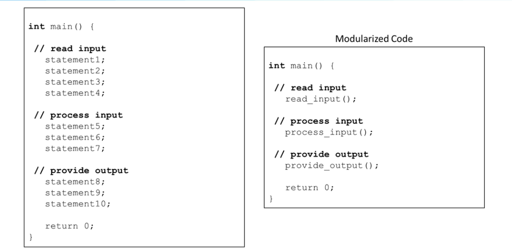
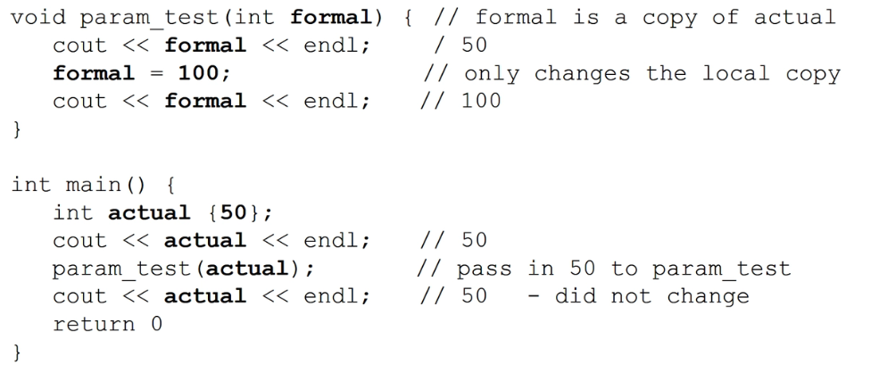
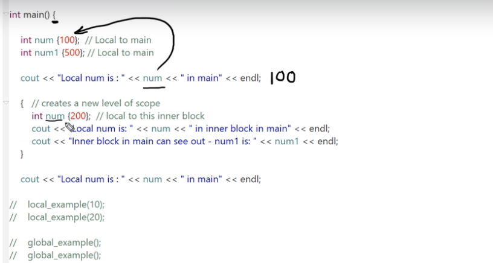
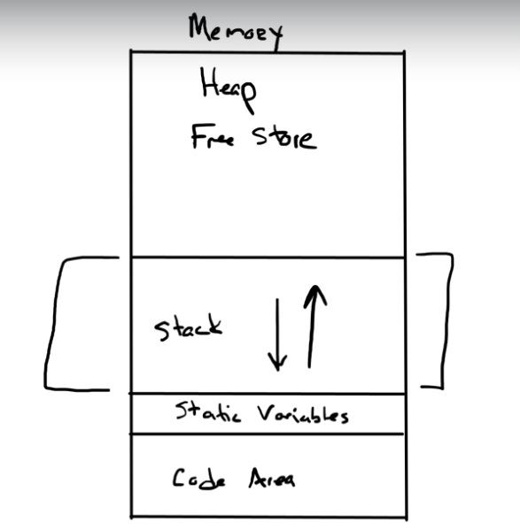
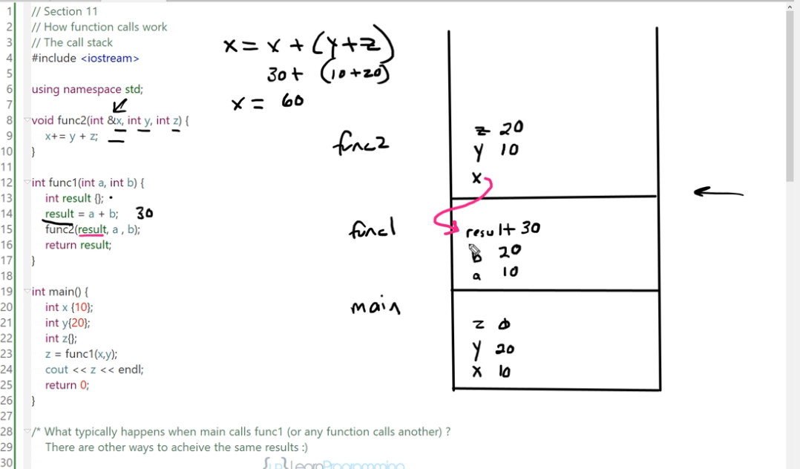

## 1. What is function?

函数允许我们 使我们程序模块化｡



## 2.以random为例，函数的引用

```c++
int max{6};
int min{1};
srand(time(nullptr));

for (size_t i{1};i<= count; i++){
    random_number = rand() % max + min;
    cout << random_number << endl;
}
```

### srand

`std::srand(time(nullptr))` 是一个常用的方法来为随机数生成器设置种子，从而使得每次程序运行时产生的随机数序列都是不同的。

让我们分解这个表达式：

1. **`time(nullptr)`**:
   - `time()` 是一个函数，它返回当前的日历时间（从 1970 年 1 月 1 日至今的秒数）。
   - `nullptr` 是 C++11 引入的一个关键字，表示空指针。在这里，它告诉 `time()` 函数我们不需要存储时间的输出，只是想要返回值。
2. **`srand(unsigned int seed)`**:
   - `srand()` 是一个函数，用于设置随机数生成器的种子。
   - 为随机数生成器设置种子是很重要的，因为它决定了随机数序列的起点。如果你每次都使用相同的种子，那么每次程序运行时产生的随机数序列都会是相同的。
   - 通过使用当前时间作为种子，我们确保每次程序启动时都有一个不同的种子，从而产生不同的随机数序列。

使用这种方法可以确保，例如，每次运行一个游戏或模拟时，都会得到不同的随机事件。但请注意，这种方法并不适用于需要真正随机性的应用，如密码生成或加密。对于这些应用，应该使用更加复杂和安全的随机数生成方法。

### nullptr

`nullptr` 是 C++11 引入的一个新特性，它代表指针的空值。在 C++11 之前，C++ 程序员通常使用字面值 `0` 或宏 `NULL` 来表示空指针。但这两种方法都有其问题和局限性，因此 C++11 引入了 `nullptr` 来提供一个明确、类型安全的空指针表示。

以下是关于 `nullptr` 的一些关键点：

1. **类型安全**：

   - `nullptr` 的类型是 `std::nullptr_t`，这意味着它不能随意地被转换为其他类型。这与 `0` 或 `NULL` 不同，因为它们可以被转换为任何整数类型，这可能会导致错误或模糊的代码。

2. **函数重载**：

   - 由于 `nullptr` 的类型安全性，它在函数重载中表现得很好。考虑以下代码：

     ```c++
     void foo(int);
     void foo(char*);
     ```

     如果你调用 `foo(NULL)`，编译器可能会感到困惑，因为 `NULL` 可以是 `int` 也可以是指针。但如果你调用 `foo(nullptr)`，编译器知道你想调用的是 `foo(char*)`。

3. **与所有指针类型兼容**：

   - `nullptr` 可以被赋值给任何指针类型，无论是原始指针还是智能指针，如 `std::shared_ptr` 或 `std::unique_ptr`。

4. **不可以被赋值给非指针类型**：

   - 你不能将 `nullptr` 赋值给整数、浮点数或其他非指针类型。

5. **比较操作**：

   - 你可以使用 `nullptr` 与任何指针进行比较，以检查该指针是否为空。

总的来说，`nullptr` 提供了一种明确、类型安全的方式来表示和处理空指针，它解决了早期 C++ 中使用 `0` 或 `NULL` 的一些问题和模糊性。

`time(nullptr)` 是 C++ 中获取当前时间的常用方法。让我们分解这个表达式：

1. **`time()` 函数**:
   - `time()` 是 C 和 C++ 标准库中的一个函数，它返回当前的日历时间。具体来说，它返回从 1970 年 1 月 1 日 00:00:00（称为 Unix 纪元或 POSIX 时间）到现在的秒数。
   - 这个函数的原型是：`time_t time(time_t* timer);`
2. **参数 `nullptr`**:
   - ==`time()` 函数可以接受一个指向 `time_t` 类型变量的指针作为参数==。如果这个指针不是空指针，那么 `time()` 函数会将当前时间的值存储在这个指针指向的变量中。
   - 但是，如果你只是想获取当前时间并不需要存储它，你可以传递 `nullptr` 作为参数。这意味着你不关心存储时间的输出，只是想要返回值。
   - 在 C++11 之前，你可能会看到 `time(NULL)` 而不是 `time(nullptr)`，但在现代 C++ 中，`nullptr` 是推荐的方式，因为它提供了类型安全。

因此，`time(nullptr)` 的意思是：“调用 `time()` 函数，获取当前的日历时间，并返回它，但我不需要将它存储在任何地方。”

这个返回的时间通常用于为随机数生成器设置种子（如 `srand(time(nullptr))`），因为这样可以确保每次程序运行时都得到一个不同的随机数序列。

## 3. Define function

* 函数名
  * 取名规则与变量名规则相同
  * 应当有意义
  * 应当尽量设置为一个动词或是动词片段的形式
* 参数列表
* 返回类型
* 代码主体

```c++
int function_name()
{
    statements(s);
    return 0;
}
void function_name(int a, std::string b)
{
    return;
}
```

### Function Prototypes函数原型

c++中函数引用通常需要在其之前已经有过定义（The compiler must know about a function before it is used)，对于大型项目在debug时十分不友好。


因此，引入function prototypes。

* Tell compiler what it needs to know without a full function definition
* Called forward declarations
* Placed at the beginning of the program
* Used in our own header files(.h)

```c++
#include<iostream>
using namespace std;

int function_name(int a); // prototype

int function_name(int a)
{
    return 0;
}

// compiler只关心类型，不关心名字，因此也可以写为如下，但是推荐加上参数用于文档的撰写
int function_name(int，std::string);

int function_name(int a, std::string b){
    return 0;
}
```

## 4. Parameters

* 若是输入的参数不满足预定参数，compiler会首先尝试转化。例如

  * ```c++
    void say_hello(std::string name){
        return;
    }
    
    say_hello("Frank");//并不会报错，因为compiler将cstyle string 转化成了c++ string
    //同理还有双精度，char等
    ```
  
* 设置默认参数

  * ```c++
    double calc_cost(double base_cost, double tax_rate = 0.06, double shipping=3.50);
    ```

  * 所有默认参数必须位于末尾

  * ==如果有预声明，仅在预声明中设置默认值，一方面方便调试，另一方面如果在预声明和正式声明都设置默认值会报错。==

  * 在Python中，你可以使用关键字参数来在函数调用中指定参数的值，这样你就可以按任意顺序传递参数。例如：

    ```c++
    def print_grocery_list(mangos=13, apples=3, oranges=7):
        print(apples, "apples")
        print(oranges, "oranges")
        print(mangos, "mangos")
    
    print_grocery_list()
    print_grocery_list(apples=5)
    print_grocery_list(apples=7, oranges=11)
    ```

    这在Python中是完全有效的。

    但在C++中，情况并不是这样。虽然C++支持默认参数，但它不支持像Python那样的关键字参数。在C++中，你必须按照函数声明中的顺序传递参数，并且不能使用`parameter_name=value`的形式。

    ==因此，为了在C++中实现类似的功能，你需要确保你按照正确的顺序传递参数，并为任何你想跳过的默认参数提供值。==

  

### 参数的传输

* 当传入参数时是pass-by-value，即为复制数值，新建变量传入（函数不会更改传入的原函数）
  * 好处：安全
  * 坏处：expensive on copying data, storaging data
  * 由此引出Formal Parameter and Actual Paramters
    * 
    * 在上述代码中，function call会将`实参actual`复制到`形参formal`

#### 引用传递和指针传递

引用传递和指针（地址）传递在C++中都允许函数访问和修改调用者的数据，但它们在语法和使用上有一些关键差异。以下是它们之间的主要区别：

1. **语法和可读性**：
   - **引用传递**：当你使用引用传递时，函数内部的操作看起来就像是在操作普通的变量，没有任何特殊的语法。
   - **指针传递**：使用指针传递时，你需要使用解引用操作符 (`*`) 来访问或修改指针指向的值，并使用地址操作符 (`&`) 来获取变量的地址。
2. **可选性**：
   - **引用**：一旦初始化，引用就不能重新绑定到另一个对象，它始终引用其初始化时引用的对象。
   - **指针**：指针可以重新指向另一个对象或设置为 `nullptr`。
3. **空值**：
   - **引用**：引用必须始终绑定到一个有效的对象，不能为“空”。
   - **指针**：指针可以指向一个对象、指向`nullptr`或未初始化。
4. **传递数组**：
   - **引用**：可以使用引用传递整个数组，而不仅仅是指向数组第一个元素的指针。
   - **指针**：传递数组的名称实际上是传递一个指向数组第一个元素的指针。
5. **语义**：
   - **引用**：通常用于实现别名或函数的返回值。
   - **指针**：更为通用，可以用于动态内存分配、数组、链表等数据结构的操作。

示例：

```
cppCopy codevoid byReference(int &ref) {
    ref = 10;  // 直接修改引用的值
}

void byPointer(int *ptr) {
    *ptr = 20;  // 使用解引用操作符修改指针指向的值
}

int main() {
    int a = 5;
    int b = 5;

    byReference(a);  // a 现在是 10
    byPointer(&b);   // b 现在是 20
}
```

总之，引用和指针都提供了访问和修改变量的能力，但它们的语法和用途有所不同。选择使用哪一个通常取决于特定的需求和编程风格。

## 5. Overloading Functions

我们可以用同一个函数名，对不同的输入进行不同的处理。

这种方法利用了c++的特性:function template,这个特性允许我们只编写一个通用版本的add number函数，通过输入它会负责提供正确的版本。

这也是多态(polymorphism)的一种，意味着":We can have the same name work with different data types to execute similar behavior";

```c++
int add_numbers(int,int);
double add_numbers(double,double);

int add_numbers(int a,int b){
    return a+b;
}
double add_numbers(double a, double b){
    return a+b;
}

int main(){
    cout << add_numbers(10,20) << endl;
    cout << add_numbers(10.2,20.0) << endl;
    return 0;
}
```

* parameter list must differ
* 编译器会根据输入自动选择对应的函数
* 如果其不能匹配，或是不能将参数转换为匹配的参数，那么会产生编译错误。
* ==编译器仅仅通过parameter list选择，与return type无关==

```c++
void print(int);
void print(double);
void print(string);
void print(string,string);
void print(vector<string>);

print('A');// character always promot to integer
print(123.3F);// promote float to double
print("c-style string"); // c-style string is converted to a c++ string

```

==注意==:

* 对overload函数使用默认值时，如果有多个默认值，编译器会返回"ambiguous"错误，即为编译器不知道返回哪个默认值


## 6. 传递数组

```c++
void print_array(int numbers[]);
```

* 仅传递数组起始地址(数组名)，而非数组元素
* 传入的数组可以被改变，
  * 若是不想被改变，应该加入const将其转变为readonly

```c++
void print_array(const int numbers [], size_t size);
```

### 6.1 数组的几种传递方式

对于一个数组，例如 `int arr[]`，当你想将其作为参数传递给函数时，有几种常见的方法：

1. **传递为指针**: 这是最常见的方法。当数组传递给函数时，它会被解析为指向其第一个元素的指针。

   ```c++
   void function(int* arr) {
       // ...
   }
   ```

2. **传递为固定大小的数组**: 你可以指定数组的大小。

   ```c++
   void function(int arr[10]) {
       // ...
   }
   ```

3. ==**传递为引用**==: 使用模板，你可以传递数组的引用，这样你可以在函数内部获取数组的大小。

   ```c++
   template<size_t N>
   void function(int (&arr)[N]) {
       // ...
   }
   ```

4. **使用`std::array`或`std::vector`**: 虽然这不是传统的数组，但`std::array`和`std::vector`是C++标准库中的容器，它们提供了更多的功能和灵活性。

   ```c++
   void function(std::vector<int>& arr) {
       // ...
   }
   
   void function(std::array<int, 10>& arr) {
       // ...
   }
   ```

5. **传递数组和其大小**: 传递数组的指针或引用以及其大小，这样函数知道数组的长度。

   ```c++
   void function(int* arr, int size) {
       // ...
   }
   ```

在选择如何传递数组时，考虑你的需求。例如，如果你需要知道数组的大小，第三种方法（传递为引用）或第五种方法（传递数组和其大小）可能是最佳选择。如果你想要更多的灵活性和功能，考虑使用`std::vector`或`std::array`

## 7. Pass by Reference：引用传递

* 值传递会复制一份参数副本，这会产生额外的空间性能消耗

  * ```c++
    int main(){
        vector<int> data{1,2,3,4,5};
        function(data);
    }
    
    void function(vector<int> &v)
    ```

* 利用&生成原函数的引用
* 当利用引用传递给函数传递参数时，former parameter改变了，actual parameter也会改变
* 如果想令function不改变值，那么同样可以在type前面加上`cosnt`,也可以使用值传递，但是值传递可能会太过昂贵。

```c++
void function(int &a);

int main(){
    int a;
    function(a);
}
```

### 7.1 指针传递与引用传递

在C++中，`void function(int *a)` 和 `void function(int &a)` 都允许你传递一个变量的引用，从而使得函数能够修改传递的变量的值。但是，它们的方式和语法有所不同。以下是它们之间的主要区别：

1. **指针传递 (`void function(int \*a)`)**:

   - 你传递的是变量的地址。
   - 在函数内部，你需要使用解引用操作符 (`*`) 来访问和修改原始变量的值。
   - 调用函数时，你需要使用地址操作符 (`&`)。

   ```c++
   void modifyValue(int *a) {
       *a = 10;  // 修改指针指向的值
   }
   
   int main() {
       int x = 5;
       modifyValue(&x);  // 传递x的地址
       cout << x;  // 输出10
   }
   ```

2. **引用传递 (`void function(int &a)`)**:

   - 你传递的是变量的引用，不是地址。
   - 在函数内部，你可以直接使用变量名，无需使用任何特殊的操作符。
   - 调用函数时，你直接传递变量，无需使用任何特殊的操作符。

   ```c++
   void modifyValue(int &a) {
       a = 10;  // 直接修改变量的值
   }
   
   int main() {
       int x = 5;
       modifyValue(x);  // 传递x的引用
       cout << x;  // 输出10
   }
   ```

**总结**:

- 使用引用传递通常更直观，因为你不需要处理指针和解引用操作符。它也使得语法更简洁。
- 使用指针传递给你更多的灵活性，例如，你可以传递`nullptr`或检查指针是否为`nullptr`。
- 在某些情况下，例如当与C语言的代码互操作时，你可能需要使用指针。
- 选择使用哪种方法取决于你的具体需求和编程风格。

## 8.C++ 作用域

在C++中，作用域是一个程序区域，其中声明的标识符具有其意义和生命周期。作用域决定了在哪里可以使用标识符。

#### 1. **Static (or Lexical) 作用域**

- **定义**：静态或词法作用域是在编译时确定的，基于源代码中的位置。

- **特点**：函数和变量有静态存储期，这意味着它们在程序的生命周期内保持其值。

- **关键字**：`static` 关键字用于声明具有静态存储期的变量或函数。

- 在C++中，`static`关键字有多种用途，具体取决于它的上下文。以下是`static`的主要用途和它们的详细解释：

  1. **\*静态局部变量**：behave like a global and scope like local

     - 当`static`用于函数内的局部变量时，它会改变该变量的存储期和初始化方式。静态局部变量在程序的执行期间只被初始化一次，并且它们的生命周期持续到程序结束。
     - 这意味着静态局部变量会保留其值，即使函数调用结束后也是如此。当函数再次被调用时，该变量将保持上次调用结束时的值。

     ```c++
     void counter() {
         static int count = 0;
         count++;
         cout << count << endl;
     }
     ```

     在上述函数中，每次调用`counter`时，`count`的值都会增加，而不是重新初始化为0。

  2. **静态类成员**：

     - 当`static`用于类的成员变量时，该变量变成了类的静态成员。这意味着无论创建了多少个类的对象，静态成员都只有一个实例。
     - 静态成员必须在类定义外部进行初始化。
     - 静态成员函数也是可能的，这些函数可以访问类的静态成员，但不能访问非静态成员。

     ```c++
     class MyClass {
     public:
         static int staticVar;
         int nonStaticVar;
         
         static void staticFunction() {
             // can access staticVar but not nonStaticVar
         }
     };
     
     int MyClass::staticVar = 0;  // Initialization outside the class
     ```

  3. **静态全局变量**：

     - 在文件级别，`static`可以用于全局变量或函数，使其的链接性变为内部的。这意味着该变量或函数只能在定义它的文件中访问，而不能在其他文件中访问。

     ```c++
     static int staticGlobalVar = 0;  // Only accessible within this file
     ```

  4. **静态成员函数**：

     - 在类中，静态函数是不依赖于类的任何特定对象的。这意味着静态成员函数不能访问类的非静态成员，因为非静态成员需要一个对象实例。
     - 静态成员函数可以通过类名直接调用，而不需要对象实例。

  总之，`static`关键字在C++中有多种用途，具体取决于它的使用上下文。它可以用于控制变量的存储期、类成员的共享性以及函数和全局变量的链接性。

#### 2. **Local (or Block) 作用域**

- **定义**：局部或块作用域是由花括号 `{}` 定义的区域，通常在函数内部。
- **特点**：在块作用域中声明的变量只在该块内可见。当控制流离开该块时，这些变量将被销毁。当然，嵌套在一个`{}`内的`{}`也可以看到其上一个`{}`内的变量
- **例子**：函数参数、在循环或条件语句内部声明的变量。

#### 3. **Global 作用域**

- **定义**：全局作用域是在所有块之外的区域。在此作用域中声明的标识符在整个文件中都是可见的。
- **特点**：全局变量在程序的整个生命周期中都存在。它们在程序开始时初始化，在程序结束时销毁。
- **注意事项**：过度使用全局变量可能导致代码难以维护和理解，因为它们可以在文件的任何地方被修改。

------

**建议**：尽量减少全局变量的使用，优先考虑局部变量和函数参数。当需要跨多个函数或文件共享数据时，考虑使用类和对象。


每次使用block`{}`，都会代表有一个新的scope，这个block不一定要是if或者while，可以只是单纯的{}

顺序：局部变量同名优先局部变量



## 9. Function Calls

* 函数调用使用"function call stack"

  * Last In First Out
  * Push and Pop

  * 过程
    * 函数被调用
    * 创建激活记录
    * 将函数推送到调用堆栈上
    * 函数被终止
    * 将其激活记录弹出调用堆栈
  * 调用堆栈有限，当调用太多函数，会造成“堆栈溢出(stackoverflow”错误

* 深入了解函数调用的背后原理和为什么需要激活记录（也称为堆栈帧或调用帧）。

  1. **什么是激活记录（Activation Record）？**

     当一个函数被调用时，它需要一些存储空间来保存其局部变量、参数、返回地址以及其他与函数调用相关的信息。这个存储空间被称为激活记录或堆栈帧。

  2. **为什么要将前一个激活记录的地址推入栈？**

     这是为了保持栈的连续性。当一个函数调用另一个函数时，新函数的激活记录被推入栈顶。但是，当新函数返回时，我们需要知道从哪里恢复执行。为此，我们需要知道前一个激活记录的位置，这样我们就可以正确地弹出当前函数的激活记录并恢复前一个函数的执行。

     保存前一个激活记录的地址（通常称为帧指针或基指针）允许我们在函数调用链中导航，这在调试、异常处理和其他需要知道调用历史的场景中非常有用。

  3. **为什么使用栈来管理这些激活记录？**

     栈是一个后进先出（LIFO）的数据结构，非常适合管理函数调用。当一个函数被调用时，其激活记录被推入栈顶；当函数返回时，其激活记录从栈顶被弹出。这种结构确保了函数的执行顺序和返回顺序是正确的。

  总的来说，将前一个激活记录的地址推入栈是为了保持函数调用的组织和结构，确保当一个函数返回时，我们知道应该恢复执行的位置。这是计算机如何跟踪函数调用和返回的基本机制。

* 我们讨论的就是Memory中的stack area

  

* 针对如下代码讲述内存call的过程

  * ```c++
    # include<iostream>
    void func2(int &x, int y, int z){
        x += y+z;
    }
    
    int func1(int a, int b){
        int result{};
        result = a+b;
        func2(result,a,b);
        return result;
    }
    
    int main(){
        int x{10};
        int y{20};
        int z{};
        z = func1(x,y);
        cout << z << endl;
        return 0;
    }
    ```

  * ```html
    when main calls func1
    
    main:
    	为返回值预留空间:
    	push space for the return value
    
    	为参数预留空间:
    	push space for the parameters
    
    	main将返回地址（即func1调用后应该返回到的main中的位置）推入栈:
    	push the return address
    
    	控制权限通过跳转转移给func1
    	transfer control to func1(jmp)
    
    fun1:
    	首先将前一个激活记录的地址推入栈。激活记录包含关于函数调用的所有信息，如参数、局部变量和返回地址：
    	push the address of the previous activation record
    
    	如果func1使用了某些寄存器，并且这些寄存器在函数返回前需要恢复其原始值，那么这些寄存器的值将被推入栈：
    	push any register values that will need to be restored before returnning to the caller
    
    	执行代码：
    	perform the code in func1
    
    	恢复寄存器值：
    	restore the register values：
    	
    	恢复前一个激活记录（这实际上是移动栈指针到前一个激活记录的开始位置）：
    	restore the previous activation record(move the stack pointer)
    	
    	func1将其结果存储在为返回值预留的空间中：
    	store any function result
     
        控制权返回到main（通过跳转）：
    	transfer control to the return address(jmp)
    
    main:
    	pop the parameters
    	pop the return value
    	
    ```

  * 例如，从main到func1到func2的内存活动如下所示，注意func2中的x是result的引用，以及func2和func1在完成后都会从内存pop除去，同时将返回值传给之前申请好的位置(例如main的z), 这就是active record作用的地方。

## 10.Inline Functions

* 从function call section中我们可以知道，function的调用也有开销

* 一个简单的函数可能函数本身的开销还比不上function的开销

* 此时我们对简单的函数可以使用inline code将其内联

  * ```c++
    inline int add_numbers(int a, int b){
        return a+b;
    }
    ```

  * inline function通常位于header中

  * 内联函数会被直接复制到对应位置，滥用内联函数会使得二进制文件变得很大

  * 内联函数更快

  * 现在的编译器即便你不写，也会自动将一些函数编译为inline

## 11.递归函数(Recursive Functions)

* function call it self directly or in directly


