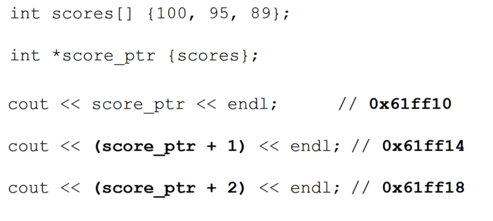

在本课程的这一部分，你将学习如何使用C++编程语言中的最强大的元素之一——指针。

指针赋予程序员直接操作计算机内存的能力。

这包括在程序需要时在运行时动态地分配和释放内存。

你可能听过其他程序员关于指针的恐怖故事，关于它们如何难以使用，以及当使用不当时它们可能造成的损害。你可能还听说过Java、Python和其他编程语言没有指针，因为它们可能导致很多问题。

C++的指针比你在Java和Python等语言中所能获得的对机器的控制权更强大。

这并不是对Java或Python的贬低，这完全取决于这些语言的创建目的以及它们通常用于哪些领域。

C++程序被广泛用于开发操作系统、系统软件、设备驱动程序、嵌入式系统等。

对于这些系统，我们希望完全控制硬件。

我们不希望有一个虚拟机来处理内存或检查可能出错的每一件事。

我们简单地承受不起运行时的额外开销。

拥有这种能力也带来了责任。

这是理解如何有效且正确地使用和释放内存的责任。

这也是指针的主要用途之一。

==指针是一个变量==

==主要介绍的是Raw Pointer，C++也有smart pointer，smart pointer是更安全的高级用法，在这里只会做一个概述==

## 1. What is a pointer

* pointer is a **variable**, whose value is an **address**
* **Another variable or a function** can be at that address
* pointer is a variable has memory bound with, it has specific type


why we use pointer?

* 如果有一个复杂的数据结构是在函数之外被定义的，我们一般不使用值传递（消耗太大），而是使用引用或是指针来在函数内部访问这个数据。
* 指针能够十分高效的对array操作

* 我们可以从堆或者free store中动态的分配内存，这些内存可能根本没有一个对应的variable name与之对应，唯一可以访问到的方法就是指针。
* 嵌入式系统访问具体的地址


## 2. Declaring variable

```c++
variable_type* pointer_name;

//always initialize the pointer or it will contain garbage data
variable_type* pointer_name	{nullptr}; //point to nowhere
```


## 3.获得指针地址与存储地址

* address operator `&`

> 1. **sizeof(pointer)**:
>
>    - 无论指针指向哪种数据类型，指针本身的大小通常都是固定的。这是因为指针只存储内存地址，而不考虑它所指向的数据的大小。
>    - 在32位系统上，指针通常是4字节大小；在64位系统上，指针通常是8字节大小。但这取决于具体的编译器和操作系统。
>
>    ```c++
>    int* pInt;
>    double* pDouble;
>    char* pChar;
>    cout << sizeof(pInt) << endl;      // 输出指针的大小，例如8（在64位系统上）
>    cout << sizeof(pDouble) << endl;   // 同样的输出，例如8
>    cout << sizeof(pChar) << endl;     // 同样的输出，例如8
>    ```
>
> 2. **sizeof(point to)**:
>
>    - 这表示指针所指向的对象的大小。这个大小取决于指针所指向的数据类型。
>    - 例如，一个`int`指针指向一个整数，那么`sizeof`该指针所指向的对象将是`int`的大小。
>
>    ```c++
>    int x = 10;
>    int* pInt = &x;
>    cout << sizeof(*pInt) << endl;     // 输出int的大小，例如4
>             
>    double y = 5.5;
>    double* pDouble = &y;
>    cout << sizeof(*pDouble) << endl;  // 输出double的大小，例如8
>    ```
>
> 总结：`sizeof(pointer)`给出的是指针本身的大小，而`sizeof(point to)`（或更准确地说，`sizeof(*pointer)`）给出的是指针所指向的对象的大小。

==这进一步说明了pointer只是一个variable,==

==但是pointer还是与类型绑定的==(typed pointer)

```c++
int score{10};
double high_temp{100.7};
int* score_ptr{nullptr};

score_ptr = &score; // OK
score_prt = &high_temp; // Compile error,类型冲突
```

-----------

## 4.阶段总结

* pointers are variables so then can change
* pointers can be null
* pointers can be uninitialized

---------


## 5. Dereference pointer

* 正常就是对地址用解地址符号`*`即可

* 对于类似vector的指针

  * ```c++
    vector<string> stooges{"first", "second", "third"};
    vector<string> *vector_ptr
    
    cout << (*vector_ptr).at(0);//应当如此访问
    ```


## 6. 动态内存分配

* ==数组名虽然也是个地址，但是相比pointer不可改变，只能用来操作==

* 通常我们事先不知道需要多大内存
* 我们可以运行时动态的为变量申请内存
* 虽然已经有了vector，但是我们也可以对array动态的申请内存，以达到我们的需求--这也是vector和其他容器中做的。
* 我们可以使用指针访问新分配的heap storage

```c++
// allocate single integer
int *int_ptr {nullptr};
int_ptr = new int;// allocate an integer on the heap

delete int_ptr;

// allocate intire array
int* array_ptr {nullptr};
int size{};

array_ptr = new int[size];

delete [] array_ptr;
```

有如下几点需要注意：

* new出来的空间充满了无意义数据，需要自己初始化
* 只有你申明时用的指针能指向这个地方，丢失了就找不到了，同时就出现了一个=="memory leak"==
* 当使用完内存时，应当释放这个内存。

如下图，memory中包括code的存储，global 变量的存储，函数调用的stack，以及Free store Heap。所有的动态内存请求都在heap中处理。


> `malloc` 和 `new` 都是用于在动态内存中分配空间的，但它们之间存在一些关键的区别。以下是它们的主要区别和联系：
>
> ### 区别：
>
> 1. **来源**：
>
>    - `malloc`：来源于 C 语言，定义在 `<cstdlib>`（或 `<stdlib.h>`）中。
>    - `new`：是 C++ 引入的，提供了类型安全的内存分配。
>
> 2. **返回类型**：
>
>    - `malloc`：返回 `void*`，需要显式地转换为所需的指针类型。
>    - `new`：返回适当类型的指针，无需进行类型转换。
>
> 3. **初始化**：
>
>    - `malloc`：仅分配内存，不初始化它。
>    - `new`：对于非内置数据类型，会调用对象的构造函数进行初始化。
>
> 4. **错误处理**：
>
>    - `malloc`：在分配失败时返回 `NULL`。
>    - `new`：在分配失败时抛出 `std::bad_alloc` 异常（除非使用 `new(std::nothrow)`，这种情况下会返回 `NULL`）。
>
> 5. **大小计算**：
>
>    - `malloc`：需要手动计算所需的内存大小，例如 `malloc(5 * sizeof(int))`。
>    - `new`：自动计算所需的内存大小，例如 `new int[5]`。
>
> 6. **释放内存**：
>
>    - `malloc`：使用 `free` 来释放内存。
>    - `new`：使用 `delete` 或 `delete[]` 来释放内存，并自动调用对象的析构函数（如果适用）。
>
> 7. **数组分配**：
>
>    - `malloc`：没有专门为数组分配的版本。
>
>    - `new`：有 `new[]` 用于数组分配。
>
>    - 当我说 "`malloc` 没有专门为数组分配的版本" 时，我的意思是在 C++ 中，`new` 和 `new[]` 之间有一个明确的区别，其中 `new` 用于单个对象的分配，而 `new[]` 用于数组的分配。这种区分在释放内存时也很重要，因为对于通过 `new` 分配的内存，我们使用 `delete`，而对于通过 `new[]` 分配的内存，我们使用 `delete[]`。
>
>      而对于 `malloc`，没有这样的区分。`malloc` 只是为你分配指定字节的内存，并返回一个指向它的指针。它不知道你是否打算在这块内存中存储一个对象还是多个对象（即数组）。因此，当你使用 `malloc` 为数组分配内存时，你需要手动计算所需的总字节大小。
>
> ### 联系：
>
> 1. **目的**：两者都是用于动态内存分配的，允许在运行时分配和释放内存。
> 2. **内部实现**：在许多 C++ 实现中，`new` 和 `delete` 底层可能使用 `malloc` 和 `free`。但这不是标准所规定的，只是实现细节。
>
> ### 使用建议：
>
> 在 C++ 中，建议使用 `new` 和 `delete`，因为它们提供了类型安全、自动大小计算和对象生命周期管理（构造和析构）。但如果你正在与 C 代码库交互或有特定的原因需要使用 `malloc` 和 `free`，则应确保正确地使用它们。

### 6.1 数组中的pointer

如下所示，pointer按照类型自动对地址加上一个typesize，对改变后的pointer解地址就能遍历数组




## 7.  pointer算数符

### 7.1 ++ & --

* ++ 运算符将pointer增加到下一个array element
* -- 运算符将pointer减少，索引到上一个element
* 增加减少对应的地址与data type有关


### 7.2 + & -


### 7.3 指针减法

* 若是两个指针类型相同，则返回n，代表其相差的位置，地址上差了`n*sizeof(type)`

* 如果类型不同，那么会有编译器错误


### 7.4 指针比较

* ==
* ！=
* 注意比较的是指针还是其指向的值

常用作用：遍历数组，例如以下-1为终止符


#### *ptr++与(\*ptr)++

表达式 `*ptr++` 是一个常见的指针操作，经常在 C 和 C++ 中出现。为了理解这个表达式，我们需要考虑两个运算符的优先级和结合性：`*`（解引用）和 `++`（后置递增）。

1. **优先级**：
   - 后置递增（`ptr++`）的优先级高于解引用（`*ptr`）。
2. **结合性**：
   - 两者都是右结合的，但由于优先级的差异，后置递增会先于解引用操作。

因此，表达式 `*ptr++` 的执行顺序如下：

1. `ptr++`：首先，指针 `ptr` 会递增。但是，由于这是后置递增，所以递增操作返回的是递增前的原始值。这意味着，尽管 `ptr` 的值已经增加，但表达式的结果仍然是递增前的指针值。
2. `*`：然后，使用递增前的 `ptr` 值进行解引用。

例如，如果 `ptr` 指向一个整数数组的开始，并且该数组的第一个元素是 `5`，那么 `*ptr++` 的结果是 `5`，但之后 `ptr` 将指向数组的下一个元素。

总结：`*ptr++` 返回指针当前指向的值，并将指针移动到下一个位置

## 8. Const 与 Pointer

以下出错都是compiler error

* Pointers to constants: 指针所指向的数据是常量数据，该数据不能被改变，但是指针本身可以改变

  * ```c++
    int high_score {100};
    int low_score {65};
    const int *score_ptr {&high_score};
    
    *score_ptr = 86; // ERROR
    score_ptr = &low_score; // OK
    ```

* Constant pointers: 指针所指向的数据可以被改变，但是指针本身（指向）不可以被改变

  * ```c++
    int high_score {100};
    int low_score{65};
    int *const score_ptr {&high_score};
    
    *score_ptr = 86; //OK;
    score_ptr = &low_score; //ERROR
    ```

* Constant pointers to constants:二者皆不可改变

  * ```c++
    int high_score {100};
    int low_score{65};
    int *const score_ptr {&high_score};
    
    *score_ptr = 86; //ERROR
    score_ptr = &low_score; //ERROR
    ```

    

## 9. 指针传递

```c++
void double_data_by_pointer(int *data){
    *data *= 2;
}


int main(){
	int value {10};
    
    double_data_by_pointer(&value);// 20
    
    
}
```


指针能做到而vector做不到的

```c++
int scores[] = {1,2,3,4,5};
vector<int> s {1,2,3,4,5};

template<total_size>;
void display(int *array){
    while(*array != total_size){
        cout << *array++;
    }
}
display<5>(scores);//OK
display<5>(s);//ERROR，因为s是一个对象而非指针
/*可以使用如下
vector<int>::iterator it = s.begin();
while(it != str.end()) {
    cout << *it << endl;
    it++;
}
或者
for(auto a : s){
	cout << a << endl;
}
*/
```

## 10. 函数返回指针

```c++
int *largest_int(int *a, int *b){
    return *a > *b ? a : b;
}

```

返回一个动态申请的空间（注意这个空间虽然是在局部申请，但是全局存在）

```c++
int *create_array(size_t size, int init_value = 0){
    int *new_storage{null_ptr};
    new_storage = new int[size];
    for(size_t i{0}; i < size; i++){
        *(new_storage + i) = init_value;
    }
    return new_storage;
}

newarray = create_array(10,0);
delete[] newarray;
```

==不要返回一个局部值的pointer，因为这样会让指向的数据无意义==

```c++
int *dont_do_this(){
    int size{};
    ...
    return &size;
}

int *or_this(){
	int size {};
    int *int_ptr{&size};
    ...
    return int_ptr;
}
```

1. **问题描述**：当你从函数中返回一个局部变量的指针或引用时，你实际上是在返回一个已经超出其生命周期的变量的地址。这是因为局部变量存储在堆栈上，当函数结束时，这些变量的存储空间就被释放了。
2. **后果**：当你再次调用该函数或其他任何函数时，堆栈的这部分空间可能会被重新使用。这意味着原先返回的指针现在可能指向一个完全不同的函数的激活记录（即函数的局部变量、参数等的存储区域）。
3. **潜在的危险**：如果你试图通过这个已经失效的指针访问或修改数据，你可能会破坏堆栈上的其他数据，如其他函数的激活记录。这可能导致程序崩溃或出现难以预测的错误。更糟糕的是，如果你修改的数据当前没有被使用，程序可能会正常工作一段时间，然后突然出现问题。这种错误很难追踪和修复。
4. **示例**：文中提到了两个函数，都存在上述问题。第二个函数特别指出，它返回了一个指向局部变量的指针，这个局部变量的大小是指定的。
5. **结论**：从函数返回局部变量的指针或引用是一个坏主意，应该避免这样做。

造成上面两个区别的就在于

* ==local parameter跟着函数走，存在stack中==
* ==new出来的内存是从heap中申请的==
* 函数没了stack跟着销毁
* heap却不会，因此如果我们没有将new出来的内存的指针送出函数，我们会得到一个leak。

## 11. 指针的陷阱

* 未初始化的指针：包含垃圾信息（十分严重）
* Dangling Pointer：
  * 悬空指针，这些指针指向的位置不再有效。例如局部变量的指针，在函数返回后，该堆中函数不再有效，这个指针如果被传出函数将会成为悬空指针
  * 或者说，两个指针指向同一个数据，一个指针release data， 另一个指针因此获得了release之后的data。

* 不检查是否new失败了：

  * 如果new无法分配 在程序中引发异常的存储将终止｡
  * 我们可以使用异常处理 以便对这些异常情况进行更细粒度的控制｡
  * 对一个null pointer解地址可以导致程序崩溃

* 内存泄漏

  * 忘记使用delete来release 所分配的内存
  * 如果我们失去了对所分配memory的pointer，我们就永远无法获得那个storage了
  * 泄露了足够的memory，就会栈溢出

  

## 12. Reference

* 变量的一个别名(alias)

* 声明时必须使用一个变量初始化

* 不能为空(null)

* 一旦声明，不能再成为另一个变量的引用

* 常常作为函数参数传参

* 可以被视为一个自动dereference的constant pointer

  

```c++
#include <iostream>

int main() {
    int x = 10;          // x 是一个整数变量，值为10
    int& ref_x = x;      // ref_x 是 x 的引用

    std::cout << "x: " << x << " ref_x: " << ref_x << std::endl;

    ref_x = 20;          // 通过引用修改 x 的值

    std::cout << "x: " << x << " ref_x: " << ref_x << std::endl;

    int y = 30;
    // ref_x = y;        // 这行代码并不会使 ref_x 引用 y，而是将 y 的值赋给 x

    // std::cout << "x: " << x << " y: " << y << " ref_x: " << ref_x << std::endl;

    return 0;
}

```


### 12.1 Using references in ==range-based for loop==

* ==避免了copy的消耗==

```c++
vector<string> stooges{"Larry", "Moe", "Curly"};
//str是一个copy，不能改变stooges
for(auto str: stooges){
    str = "Funny";
}

// &str是一个reference 可以改变
for(auto &str: stooges){
    str = "funny";
}
```

> ```c++
> int& str = stooges[1];
> int& str = stooges[2];
> ```
>
> 你的代码示例中有一个问题。你试图为同一个引用变量 `str` 分配两次，这是不允许的。
>
> 在C++中，一旦一个引用被初始化并绑定到一个对象，你就不能再改变它引用的对象了。换句话说，引用一旦被初始化，就不能重新绑定到另一个对象。
>
> 以下是你可能想要的代码：
>
> ```
> cppCopy codeint& str1 = stooges[1];
> int& str2 = stooges[2];
> ```
>
> 在这里，`str1` 引用 `stooges` 容器中的第二个元素，而 `str2` 引用第三个元素。


> ==`for` 循环中的情况与普通的引用初始化是不同的.==当我们使用范围基础的 `for` 循环（range-based for loop）时，每次迭代都会重新绑定引用到容器的下一个元素。==这是范围基础的 `for` 循环的设计特性。==
>
> 考虑以下代码：
>
> ```c++
> std::vector<int> numbers = {1, 2, 3, 4, 5};
> for (int& num : numbers) {
>     num *= 2;
> }
> ```
>
> 在这个例子中，`num` 是一个引用，它在每次迭代时都会重新绑定到 `numbers` 容器的下一个元素。因此，我们可以修改容器中的每个元素。
>
> 但是，这并不意味着我们在循环体内部可以改变 `num` 引用的绑定。它只是在每次迭代开始时自动重新绑定。
>
> ==这与你之前的示例不同，因为在普通的代码块中，一旦引用被初始化并绑定到一个对象，你就不能再改变它引用的对象了。但在范围基础的 `for` 循环中，这个绑定在每次迭代时都会自动发生。==

### 12.2 是不是只需要referencec

确实，引用传递（pass by reference）在许多情况下都是非常有用的，特别是当你想避免数据的复制时。但是，`pass by value`、`pass by pointer`和`pass by reference`各有其适用场景和优势。以下是为什么你可能想要使用这三种参数传递方式的原因：

1. **Pass by Value**:
   - **简单性**：对于基本数据类型（如`int`、`char`、`double`等），值传递通常是最简单和最直接的方式。
   - **安全性**：当你不想让函数修改传入的参数时，值传递是安全的。因为它传递的是原始数据的一个副本，所以原始数据不会被修改。
   - **独立性**：==在某些情况下，你可能希望函数有其自己的数据副本来操作，而不是直接操作原始数据==。
2. **Pass by Pointer**:
   - **明确的意图**：使用指针通常意味着你可能会修改所指向的数据，或者你正在处理动态分配的内存。
   - **空指针**：指针可以是`nullptr`，这意味着它可能不指向任何东西。这是一个有用的特性，因为它允许你表示“没有值”或“无效值”的概念。
   - **动态内存分配**：当你与动态分配的内存（如使用`new`或`malloc`分配的内存）打交道时，通常会使用指针。
3. **Pass by Reference**:
   - **效率**：对于大型数据结构，如`std::vector`或自定义类，使用引用可以避免不必要的复制。
   - **修改原始数据**：当你想在函数内部修改传入的参数并反映到调用者那里时，引用是有用的。
   - **const引用**：当你想避免数据的复制，但又不想修改它时，`const`引用是一个好选择。

总之，虽然在许多情况下使用引用是有益的，但其他传递方式在特定的场景中可能更为合适。选择哪种参数传递方式取决于你的具体需求和你想要达到的目的。

## 13. Const的位置

首先明确以下，const位置只有以下几种：

* `const int *ptr`与`int const *ptr`相同

  * `const int *name`与`int const *name`是等价的

  * ==const 修饰 *ptr==

  * `const int * ptr` 或 `int const * ptr`: 这里，`ptr`是一个==指向常量整数的指针==。这意味着你不能通过`ptr`来修改其指向的值，但你可以改变`ptr`所指向的地址。

    ```c++
    int x = 10;
    int y = 20;
    const int * ptr = &x;
    *ptr = 30;  // 错误: 不能通过ptr修改值
    ptr = &y;  // OK: 可以修改ptr的指向
    ```

* `const int &s`tr 与 `int const &str`相同

  * ==const 修饰 &str==

  * `int const &str` 和 `const int &str` 是等价的，它们都表示一个指向常量整数的引用。这意味着你可以通过这个引用读取整数的值，但不能修改它。

    这里的关键是 `const` 的位置。无论它出现在类型名的前面还是后面，它都修饰紧随其后的部分。因此，以下两种声明方式都是正确的，并且具有相同的含义：

    1. `int const &str`
    2. `const int &str`

    ==在这两种情况下，`str` 都是一个引用，它引用一个不能被修改的整数。==

    通常，`const int &str` 的形式更为常见，因为它更容易阅读（尤其是对于初学者）。但两种形式在功能上是完全相同的。

* `int * const ptr`存在

  * ==const 修饰 ptr==

  * `int * const ptr`: 这里，`ptr`是一个指向整数的常量指针。这意味着你不能改变`ptr`所指向的地址，但你可以改变该地址处的值。

    ```c++
    int x = 10;
    int y = 20;
    int * const ptr = &x;
    *ptr = 30;  // OK: 修改ptr指向的值
    ptr = &y;  // 错误: 不能修改ptr的指向
    ```

* `int &const name`不存在

  * ==const 修饰 name,其中name是引用（别名）==
  * `int & const str`: 这种声明实际上是不合法的。引用本身就是一个常量==（或者说引用本身这个绑定关系是不可变的)==，意味着一旦它被初始化，你不能更改它引用的对象。因此，尝试声明一个常量引用是多余的，并且编译器会报错。


## 14. 左值，右值与左值

### 14.1 L value

* 左值有名称，并且可以寻址
* 如果他并非constant，那么一定可编辑/改变


### 14.2 R value

* R-value无地址指向，不可赋值(non-assignable)
* 所有不是L值的都是R值
* R值是一个被暂时提出的值，并且不可修改


### 14.3 左值引用

我们对左值进行引用称为左值引用

我们对右值是无法引用的


同样的，对于引用传递，仅能传递左值，而非右值


