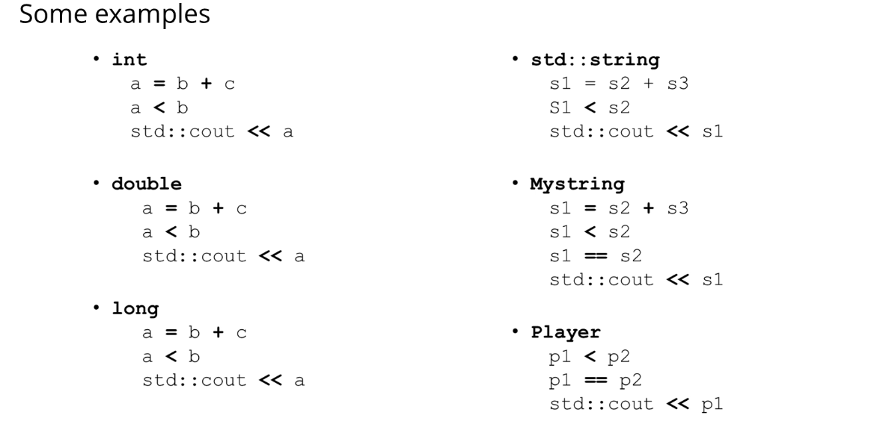
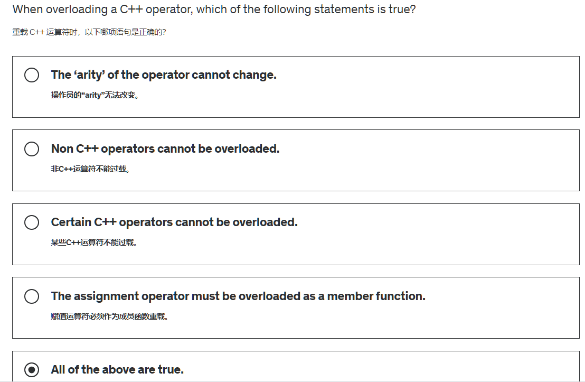

# 14. Overload Operator

==可以重载并不代表需要重载，只有能让你代码more useable, more readable and more writeable的重载才是好重载==

在C++中，运算符重载允许程序员为用户定义的数据类型指定运算符的操作。这意味着我们可以为自定义的类或结构体定义加法、减法等运算符的行为。

* **重载赋值运算符(=)**

  * **复制语义**: 当我们使用赋值运算符将一个对象的值复制给另一个对象时，我们使用复制语义。这通常涉及到创建对象的深拷贝。

  * **移动语义**: C++11引入了移动语义，允许我们在不实际复制数据的情况下转移资源。这通过使用特殊的引用类型——右值引用来实现。

* **作为成员函数重载运算符**
  * 当我们在类内部重载运算符时，它作为成员函数存在。这意味着它可以直接访问类的私有和受保护的成员。

* **作为全局函数重载运算符**
  * 有时，将运算符重载为全局函数可能更有意义，尤其是当我们希望左操作数不是类的对象时。

*  **重载流插入(<<)和提取(>>)运算符**
  * 流插入和提取运算符通常与C++的I/O流一起使用，如`std::cout`和`std::cin`。通过重载这些运算符，我们可以直接输出和输入用户定义的类型。


## 14.1 What is Overload Operator

* 类是用户自定义的type
* 重载使得我们类型的行为和感觉类似于内置类型(int,double)
* make code more readable and writable
* 编译器提供预设的重载算子仅有`=`,因为编译器必须能够将一个对象赋值给另一个对象，其他可以重载的运算符必须由程序员显式的定义


**例子：原本我们使用函数或是成员函数**:不可读且难以维护

```c++
Number result = multiply(add(a,b),divide(c,d));
```

```c++
Number result = (a.add(b)).multiply(c.divide(d));
```

**使用overloaded operators**

```c++
Number result = (a+b)*(c/d);
```

### 14.1.1 可以被重载的操作符

事实上，只有少数操作符不能被重载

| Operator |                      |
| :------: | -------------------- |
|    ::    | 作用域解析运算符     |
|    :?    | 条件运算符           |
|    .*    | 指向成员的指针运算符 |
|    .     | 点运算符             |
|  sizeof  | sizeof运算符         |


==可以重载的运算符==

| 运算符类别 | 运算符名字             | 运算符符号 |
| ---------- | ---------------------- | ---------- |
| 算术运算符 | Addition               | `+`        |
|            | Subtraction            | `-`        |
|            | Multiplication         | `*`        |
|            | Division               | `/`        |
|            | Modulus                | `%`        |
| 关系运算符 | Equal to               | `==`       |
|            | Not equal to           | `!=`       |
|            | Greater than           | `>`        |
|            | Less than              | `<`        |
|            | Greater than or equal  | `>=`       |
|            | Less than or equal     | `<=`       |
| 逻辑运算符 | Logical AND            | `&&`       |
|            | Logical OR             | `||`       |
|            | Logical NOT            | `!`        |
| 位运算符   | Bitwise AND            | `&`        |
|            | Bitwise OR             | `|`        |
|            | Bitwise XOR            | `^`        |
|            | Bitwise NOT            | `~`        |
|            | Left shift             | `<<`       |
|            | Right shift            | `>>`       |
| 赋值运算符 | Assignment             | `=`        |
|            | Add and assign         | `+=`       |
|            | Subtract and assign    | `-=`       |
|            | Multiply and assign    | `*=`       |
|            | Divide and assign      | `/=`       |
|            | Modulus and assign     | `%=`       |
|            | Bitwise AND and assign | `&=`       |
|            | Bitwise OR and assign  | `|=`       |
|            | Bitwise XOR and assign | `^=`       |
|            | Left shift and assign  | `<<=`      |
|            | Right shift and assign | `>>=`      |
| 其他运算符 | Dereference            | `*`        |
|            | Address-of             | `&`        |
|            | Subscript              | `[]`       |
|            | Function call          | `()`       |
|            | Increment              | `++`       |
|            | Decrement              | `--`       |
|            | Type cast              | `(type)`   |
|            | Comma                  | `,`        |


### 14.1.2 使用重载操作符的一些基础规则

* **优先级和结合性不能被改变**

  * 无论如何重载，运算符的优先级和结合性都是固定的，不能被修改。

  * **例子**：假设我们有一个类`Complex`，我们为它重载了`+`和`*`运算符。即使我们重载了这些运算符，`*`仍然比`+`有更高的优先级。

    ```c++
    Complex a, b, c;
    auto result = a + b * c; // 即使重载了+和*，b*c仍然先于a+b执行
    ```

* **不能改变'arity'**

  * 'arity'是指运算符的操作数数量。例如，我们不能将二元的除法运算符改为一元运算符。

  * **例子**：我们不能将除法运算符`/`重载为只接受一个操作数。

    ```c++
    Complex a;
    // 以下是错误的，因为我们不能将/重载为一元运算符
    // auto result = a /;
    ```

* **不能为基本类型重载运算符**

  * 例如，我们不能为`int`、`double`等基本数据类型重载运算符。

  * **例子**：我们不能为两个整数定义一个新的加法运算。

    ```c++
    // 这是错误的，因为我们不能为int类型重载+
    // int operator+(int a, int b) { return a - b; }
    ```

* **不能创建新的运算符**

  * 我们只能重载已经存在的运算符，不能创造全新的运算符。

  * **例子**：我们不能创建一个新的运算符，如`@@`。

    ```c++
    // 这是错误的，因为@@不是一个有效的C++运算符
    // Complex operator@@(const Complex &a, const Complex &b) { /*.
    ```

* **[],(),->和赋值运算符(=)必须声明为成员方法**

  * 这些运算符由于其特殊性，必须在类内部作为成员方法进行重载。

  * **例子**：我们为一个`Array`类重载`[]`运算符。

    ```c++
    class Array {
    public:
        int& operator[](size_t index) { return data[index]; } // 必须为成员方法
    private:
        int data[10];
    };
    ```

* **其他运算符可以声明为成员方法或全局函数**

  *  除了上述特定的运算符外，其他运算符可以在类内部作为成员方法重载，也可以作为全局函数进行重载。

  * **例子**：我们为`Complex`类重载`+`运算符。

    作为成员方法：

    ```c++
    class Complex {
    public:
        Complex operator+(const Complex &other) { /*...*/ }
    };
    ```

    作为全局函数：

    ```c++
    Complex operator+(const Complex &a, const Complex &b) { /*...*/ }
    ```


### 14.1.3 一些例子




## 14.2 重载赋值操作符(copy)

### 14.2.1 C++默认的赋值操作

* C++提供了一个默认的赋值操作符，被用于将一个对象assign to 另一个

==注意赋值的情况是哪些==

```c++
Mystring s1 {"Frank"};
Mystring s2 = s1; // NOT assignment,same as Mystring s2{s1}

s2 = s1; // assignment
```

* 默认的是memberwise assignment(shallow copy)
* 如果我们有raw pointer，必须采用deep copy


### 14.2.2 重载Deep copy 到 "="

* 将赋值运算符重载为成员函数

  * ```c++
    Type &Type::operator=(const Type &rhs);
    operator+();//重载+
    operator*();//重载*
    operator[]();//重载[]，重载数组索引运算符
    ```

  * ```c++
    Mystring &Mystring::operator=(const Mystring &rhs);
    
    s2=s1;	
    s2.operator=(s1); //operator= method is called
    ```

    * 声明时返回的是一个==对当前对象的引用==：不使用按值返回，是因为我们希望避免额外的副本，并且我们也希望支持链式计算(p1+p2+p3)
    * 当我们使用s2+s1时，编译器会自动使用`s2.operator+(s1)`;

* **定义deep copy assignment**

  * ```c++
    class Mystring{
        
        char *str;
        
        Mystring &operator=(const Mystring &rhs);//使用const因为我们不想对其修改
        
    }
    Mystring &Mystring::operator=(const Mystring &rhs){
        if(this == &rhs)
            return *this;
        
        delete [] str;
        str = new char[std::strlen(rhs.str)+1];
        std::strcpy(str,rhs.str)
    }
    ```

    * 以s1=s2为例子，首先判断是否自赋值，如果是自赋值就不用麻烦了
    * 首先需要==清空s1的空间==
    * 然后需要新建一个空间来装目标的str（此处`std::strlen(rhs.str)` 返回的是 `rhs.str` 中字符的数量，不包括结束的空字符`\0`。因此，我们需要加1来为这个空字符分配空间。)
    * 最后因为是cstyle的数组，可以直接使用strcpy
    * ==这也就是为什么(a=b=c)被设定为从右到左的结算顺序==

* **具体实现**

  * ```c++
    // Mystring.h
    #ifndef _MYSTRING_H_
    #define _MYSTRING_H_
    
    class Mystring
    {
    private:
        char *str;//holds cstyle string
        
    public:
        Mystring();							//No-args constructor
        Mystring(const char*s);				//Overloaded constructor
        Mystring(const Mystring &source);	//Copy constructor
        ~Mystring();						//Destructor
        
        Mystring &operator=(const Mystring &rhs);	//Copy assignment
        
        void display() const;
        
        int get_length() const;
        
        const char *get_str() const;
        
    };
    
    #endif 
    ```

  * ```c++
    // Mystring.cpp
    
    //Copy constructor
    Mystring::Mystring(const Mystring &source)
        :str{nullptr}{
            str = new char[std::strlen(source.str)+1];
            std::strcpy(str,source.str);
        }
    
    //Destructor
    Mystring::~Mystring(){
        delete [] str;
    }
    
    // Copy assignment
    Mystring &Mystring::operator=(const Mystring &rhs){
        std::cout << "Copy assignment" << std:endl;
        if(this == &rhs)
            return *this;
        
        delete [] this->str; 
        str = new char[std::strlen(rhs.str) + 1];//allocate
        std::strcpy(this->str,rhs.str);
        return *this;  
    }
    ```

  * ```c++
    Mystring a{"Hello"};
    Mystring b;
    b=a;//copy assignment
    ```

  

  * 我们再看一个赋值方法，这个方法虽然assign的是cstyle string，但是仍然能够正确调用copy assignment，这就是==隐式构造函数调用==。

    ```c++
    Mystring b;
    b = "This is a test"; // 调用assignment，创建一个临时的对象传入
    ```

### 14.2.3 隐式构造函数调用

隐式构造函数调用与隐式类型转换类似，

当你这样做：

```
b = "This is a test";
```

以下是发生的事情：

1. `"This is a test"` 是一个C风格的字符串，它是 `const char*` 类型。

2. `Mystring` 类可能有一个接受 `const char*`

    参数的构造函数，例如：

   ```c++
   Mystring::Mystring(const char *s) {
       // 对字符串进行深拷贝或其他初始化操作
   }
   ```

3. ==当你尝试使用 `=` 运算符将 `const char*` 赋给 `Mystring` 对象时，C++编译器会查找一个可以将 `const char*` 转换为 `Mystring` 的方法。在这种情况下，它找到了上面的构造函数。==

4. 编译器隐式地创建一个临时的 `Mystring` 对象，使用上述构造函数和给定的C风格字符串进行初始化。

5. 然后，拷贝赋值运算符 (`operator=`) 被调用，将这个临时对象的内容赋给 `b`。

6. 临时对象在语句结束后被销毁。

所以，实际上，你首先通过隐式构造函数调用创建了一个临时的 `Mystring` 对象，然后使用拷贝赋值运算符将其内容赋给 `b`。这就是为什么你可以将一个C风格的字符串直接赋给一个 `Mystring` 对象，即使拷贝赋值运算符期望一个 `Mystring` 引用作为参数。

### 14.2.4 Copy assignment 与 Copy Constructor

* **与拷贝构造函数的区别**

  * |            |                        拷贝赋值运算符                        |                         拷贝构造函数                         |
    | ---------- | :----------------------------------------------------------: | :----------------------------------------------------------: |
    | 调用       |           当一个已经存在的对象被赋予另一个对象的值           | ==当一个新对象被创建并从另一个对象初始化时==，拷贝构造函数被调用。这包括：==通过另一个对象直接初始化新对象==。 一个对象作为函数参数==按值传递==。 ==从函数返回一个对象==。 |
    | 声明和定义 |       `ClassName &operator=(const ClassName &source);`       |            `ClassName(const ClassName &source);`             |
    | 默认       | 编译器会为你提供一个默认的拷贝赋值运算符，它执行==逐成员的浅拷贝。== | 编译器会为你提供一个默认的拷贝构造函数，它也执行==逐成员的浅拷贝。== |
    | 用途       |         用于将一个对象的值赋给另一个已经存在的对象。         |      用于初始化一个新对象，使其与现有对象具有相同的值。      |
    | 移动语义   |                        移动赋值运算符                        |                         移动构造函数                         |

    

## 14.3 重载赋值操作符(move)

### 14.3.1 重载move assignment到`=`

```c++
Mystring s1;

s1 = Mystring{"Frank"};
```

* `Mystring{"Frank"}`必须要被build，且没有名称，这样他就是一个==右值==
* 这样，一个右值被assign到s1，调用了move assignment


**重载操作展示**：

```c++
Type &Type::operator=(Type &&rhs);

Mystring &Mystring::operator=(Mystring &&rhs);

s1 = Mystring{"Joe"};
s1 = "Frank";
```

**重载语法**：

```c++
Mystring &Mystring::operator=(Mystring &&rhs){//这里右值已经给了一个左值名称rhs，因此可以对rhs寻址
    if(this == &rhs){
        return *this;
    }
    
    delete [] str;
    str = rhs.str;
    
    rhs.str = nullptr;
    
    return *this;
}
```

```c++
class Mystring{
private:
    char *str;
public:
    Mystring();
    Mystring(const char *s);
    Mystring(const Mystring &source);
    Mystring(Mystring &&source);
    ~Mystring();
    
    Mystring &operator=(const Mystring &rhs); 	// copy assignment
    Mystirng &operator=(Mystring &&rhs);		// move assignment
    void display() const;
    
    int get_length() const;
    const char *get_str() const;
    
}


Mystring &Mystring::operator=(Mystring &&rhs){
    if(this == &rhs)
        return *this;
    
    delete [] str;
    str = rhs.str;
    rhs.str = nullotr;
    return *this;
}

```


==对于简单的内置类型（如 `int`、`double` 等），这两种操作的性能差异可能微乎其微。但对于管理大量资源的复杂对象，移动赋值可能会提供显著的性能优势。==

## 14.4 重载操作符为成员函数

C++允许我们将算子当作==成员方法==或是==全域非成员函数(global functions)==

### 14.4.1 Unary operators(一元)

Unary operator包括(`++,--,-,!`)

* 考虑到我们需要返回一个结果对象，我们需要==return by value==

* 这些操作都是对当前对象的操作，因此==参数列表为空==

* ```c+
  ReturnType Type::operatorOP();
  ```

* 我们可以重载前置和后置递减递增的运算符


一个简单的例子,这里可能没有意义，但是是一种可能的写法：

```c++
Mystring larry_upper{"LARRY"};
Mystring larry_d;

larry_d = -larry_upper;	//转化为全小写
```

其具体实现为return一个新对象，是现有对象的小写副本：

```c++
Mystring Mystring::operator-() const{
    char *buff = new char[std::strlen(str)+1];
    std::strcpy(buff,str);
    for(size_t i = 0; i < std::strlen(buff);i++){
        buff[i] = std::tolower(buff[i]);
    }
    Mystring temp {buff};
    delete[] buff;
    return temp;
}
```

* const：我们不想修改当前类的参数，我们想create new object

这就是通常重载一元操作符的过程


### 14.4.2 Binary operators(二元操作符)

二元操作运算符应用于两个操作数，(`+,-,==,!=,<,>,etc.`)

与一元操作符类似，但是现在的==参数列表中有了一个参数，我们用rhs(right hand side)代表，即为运算子右边的参数,因此`this`指针指向的是运算子左边的参数==

* `+,-`返回新创建的和或者差，按值返回
* 比较运算符返回boolen


```c++
ReturnType Type::operatorOP(const Type &rhs);
```

以`==`为例

```c++
bool Mystring::operator==(const Mystring &rhs) const{
    if(std::strcmp(this->str,rhs.str)==0)
        return true;
    else
        return false;
}
```

==二元操作符的一个限制是left hand side必须是所重载的对象==

right hand side可以隐式调用构造函数，left hand side不可以

```c++
Mystring larry{"Larry"};
Mystring moe{"Moe"};
Mystring stooges{" is one of the three stooges"};

Mystring result = larry + stooges; // larry.operator+(stooges);

result = moe + "is also a stooge";//OK moe.operator+("is also a stooge");

result = "Moe" + stooges;			//ERROR, "Moe".operator+(stooges)
```

```c++
Mystring Mustring::operator+(const Mystring &rhs) const{
    size_t buff_size = std::strlen(this->str) + std::strlen(rhs.str) + 1;
    
    char *buff = new char[buff_size];
    std::strcpy(buff,str);
    std::strcat(buff,rhs.str);
    Mystring temp{buff};
    delete [] buff;
    return temp;
}
```


### 14.4.3 总框架

```c++
#ifndef _MYSTRING_H_
#define _MYSTRING_H_

class Mystring
{
private:
    char *str;
public:
    Mystring();								//No-args constructor
    Mystring(const char *s);				//Overloaded constructor
    Mystring(const Mystring &source);		//Copy constructor
    Mystring(Mystring &&source);			//Move constructor
    ~Mystring();							//Destructor
    
    Mystring &operator=(const Mystring &rhs);//Copy assignment
    Mystring &operator=(Mystring &&rhs);	 //Move assignment
    
    Mystring operator-() const;				 //make lowercase
    Mystring operator+(const Mystring &rhs) const; //concatenate
    bool operator==(const Mystring &rhs) const;
    
    void display() const;
    
    int get_length() const;
    const char *get_str() const;
    
};

#endif
```

在C++中，对于类的成员函数（特别是重载的运算符），返回类型的选择是基于所需的语义和效率。让我们详细分析你给出的`Mystring`类中的运算符重载：

1. **赋值运算符（Assignment Operators）**:

   - `Mystring &operator=(const Mystring &rhs);` (Copy assignment)
   - `Mystring &operator=(Mystring &&rhs);` (Move assignment)

   这些运算符返回一个引用（`Mystring &`），==这样你就可以进行连续的赋值操作，例如`a = b = c;`。返回引用也避免了不必要的复制操作。==

2. **一元运算符**:

   - `Mystring operator-() const;` (Make lowercase)

   这是一个一元运算符，它返回一个新的`Mystring`对象。因为它创建并返回一个新对象，所以不返回引用。

3. **二元运算符**:

   - `Mystring operator+(const Mystring &rhs) const;` (Concatenate)

   这个运算符也返回一个新的`Mystring`对象，表示两个字符串的连接。因此，它不返回引用。

4. **比较运算符**:

   - `bool operator==(const Mystring &rhs) const;`

   这个运算符返回一个布尔值，所以没有引用。

总结：是否返回引用取决于函数的语义和效率。对于可能进行连续操作或希望避免不必要的复制的操作（如赋值），返回引用是有意义的。对于创建新对象的操作（如字符串连接或转换为小写），返回一个新对象（而不是引用）是有意义的。

```c++
//Mystring.cpp

// compare two string
bool Mystring::operator==(const Mystring &rhs) const{
    
    return (std::strcmp(this->str, rhs.str) == 0);
}

// Make lower case
Mystring Mystring::operator-() const{
    char *buff = new char[std::strlen(str) + 1];
    
    std::strcpy(buff, str);
    for (size_t i=0; i < std::strlen(buff);i++){
        buff[i] = std::tolower(buff[i]);
    }
    
    Mystring temp {buff};
    delete [] buff;
    return temp;
}

// Concatenate
Mystring Mystring::operatpor+(const Mystring &rhs) const{
    char *buff = new char[std::strlen(this->str) + std::strlen(rhs.str) + 1];
	std::strcpy(buff, str);
    std::strcat(buff, rhe.str);
    Mystring temp {buff};
    delete [] buff;
    return temp;
}


```


## 14.5 重载操作符为全局函数

* 不再需要this指针
* 因为我们经常需要访问类，所以这个global function常常被声明为友元，这不是必须的，因为我们通过getter也可以读取

### 14.5.1 Unary operators

`(++,--,-,!)`

```c++
ReturnType operatorOP(Type &obj);
```


```c++
//假设该函数已经被声明为友元
Mystring operator-(const Mystring &obj){
    char *buff = new char[std::strlen(obj.str)+1];
    std::strcpy(buff,obj.str);
    for(size_t i=0;i < std::strlen(buff);i++){
        buff[i] = std::tolower(buff[i])；
    }
    Mystring temp {buff};
    delete [] buff;
    reutrn temp;
}
```

### 14.5.2 Binary operator

`(+,-,==,!=,<,>,...)`

```c++
ReturnType operatorOP(const Type &lhs, const Type &rhs);
```


```c++
bool operator==(const Mystring &lhs, const Mystring &rhs){
    if(std::strcmp(lhs.str,rhs.str)==0){
        return true;
    }else{
        return false;
    }
}
```


```c++
Mystring operator+(const Mystring &lhs,const Mystring &rhs){
    size_t buff_size = std::strlen(lhs.str) + std::strlen(rhs.str)+1;
    char *buff = new char[buff_size];
    std::strcpy(buff,lhs.str);
    std::strcat(buff,rhs.str);
    Mystring temp{buff};
    delete [] buff;
    return temp;
}
```

### 14.5.3 总览

```c++
class Mystring{
    friend bool opreator==(const Mystring &lhs,const Mystring &rhs);
    friend Mystring operator+(const Mystring &lhs,const Mystring &rhs);
    
    ....rest
}
```


## 14.6 重载输入流以及输出流

用法：

```c++
Mystring larry{"Larry"};

cout << larry << endl;
cin >> larry;
Player hero{"Hero",100,33};
cout << hero << endl;
cin >> hero;
```


==在重载流时将>>和<<重载为member method是毫无意义的==

* member method operator的left hand side必须为user defined class
* 这明显不是我们通常使用>>和<<的方法
* (当然重载为位运算除外)

例如

```c++
Mystring larry;
cout << larry;//Normal
larry << cout;// Not normal
```


### 14.6.1 输出流<<

```c++
std::ostream &operator<<(std::ostream &os, const Mystring &obj){
    os << obj.str;
    return os;
}
```

* `std::ostream &os`:流对象，如 `std::ostream`，==常是不可复制的==。这意味着你不能创建一个流对象的副本。因此，你需要通过引用传递它们。

* `&operator<<`:

  * **允许连续操作**:使用引用返回流对象允许你进行连续的插入操作。例如：

  ```c++
  std::cout << "Hello" << " " << "World!";
  ```

  ​	在上面的代码中，每个 `<<` 操作都返回一个	对 `std::cout` 的引用，这允许你连续地调	用 `operator<<`。

  * **修改流的状态**：在某些情况下，你可能想修改流的状态或属性。例如，你可能想设置某些格式标志。通过引用传递流对象，你可以确保对流所做的任何修改都会反映在原始对象上，而不仅仅是其副本上。

* ==既然使用了流引用，对流的修改会直接反应到原变量，为什么还需要return？==

  * **链式操作**：返回流对象的引用允许进行连续的插入或提取操作。例如：

    ```c++
    std::cout << "Hello" << " " << "World!";
    ```

    在这个例子中，第一个 `<<` 操作返回 `std::cout` 的引用，这使得第二个 `<<` 操作可以继续使用相同的流。==如果没有返回值，这种链式操作就不可能实现。==

  * **条件检查**：对于输入流（如 `std::cin`），链式操作可以与条件检查结合使用。例如：

    ```c++
    if (std::cin >> var1 >> var2) {
        // Process var1 and var2
    } else {
        // Handle input error
    }
    ```

    在这个例子中，如果输入操作成功，`std::cin` 会在条件上下文中被评估为 `true`。如果输入失败，它会被评估为 `false`。这种行为是通过流的 `operator bool()` 或类似的转换函数实现的，它依赖于连续的提取操作返回流的引用。

  * **一致性**：==大多数流操作，无论是内置的还是用户定义的，都返回流的引用。这为使用流提供了一致的接口。==

  * **允许进一步的流操作**：==返回流的引用允许进行进一步的流操作，例如设置或查询格式标志。==


也就是说,如果你这样定义，确实，你会失去链式操作的能力。但是也仅仅是失去链式操作的能力。

```c++
void operator<<(std::ostream &os, const Mystring &obj)
```


### 14.6.2 重载extraction >>

```c++
std::istream &operator>>(std::istream &is,Mystring &obj){
    //char *buff = new char[1000]; //不泛用
    string buff;
    is >> buff;
    obj = Mystring {buff};//如果定义了move assignment就很完美
    
    delete [] buff;
    return is;
}
```

* 我希望将数据存入object，因此这里object不是const


## 14.7 重载的几个补充点

### 14.7.1 二元操作符与流操作符重载

1. **二元运算符重载返回类型**：

   - 对于二元运算符如 `+` 或 `-`，通常会返回一个新的对象，而不是对象的引用。所以，它们的重载通常看起来像这样：

   ```c++
   Type operator+(const Type& lhs, const Type& rhs);
   ```

   或者如果是成员函数形式的重载：

   ```c++
   Type Type::operator+(const Type& rhs);
   ```

2. **`void` 返回类型**：

   - 对于二元运算符，使用 `void` 作为返回类型通常是不合适的，==因为这样的运算符通常应该返回一个结果==。例如，加法和减法运算符应该返回操作数的和或差。
   - 但对于某些特定的运算符，如插入运算符 (`<<`) 和提取运算符 (`>>`)，通常用于流处理，返回 `void` 将使它们失去链式操作的能力。这些运算符通常会返回流的引用，以支持链式操作：

   ```c++
   std::ostream& operator<<(std::ostream& os, const Type& obj);
   ```

3. **`void &operator`**：

   - 您正确指出，==`void &operator` 是非法的，因为 `void` 是不完全类型，不能被引用。==

综上所述，运算符重载的返回类型应根据期望的运算符行为和用途来选择。例如，对于应该产生新值的运算符（如 `+` 和 `-`），应返回一个新的对象。而对于应支持链式操作的运算符（如流插入和提取运算符），应返回一个引用。


### 14.7.2 成员函数二元操作符的默认左操作数

对于二元操作符重载，第一个参数通常是左操作数（left-hand side, lhs），而第二个参数是右操作数（right-hand side, rhs）。例如，对于 `a + b`，`a` 是lhs，`b` 是rhs。

但是，==当你在类内部重载一个二元操作符时，lhs是隐式的`this`指针==。例如：

```c++
class MyClass {
public:
    MyClass operator+(const MyClass &rhs) {
        // this 指针代表 lhs
        // rhs 是明确的右操作数
        // ...
    }
};
```

在这个例子中，如果你有两个 `MyClass` 对象 `a` 和 `b`，并且你执行 `a + b`，那么 `a` 是隐式的 `this` 指针（lhs），而 `b` 是传递给 `rhs` 的参数。


### 14.7.3 `++，--`前置与后置的区别方法

==**前置返回引用，后置返回副本**==

在C++中，==后置运算符的重载是通过添加一个额外的整数参数（通常写作`int`）来区分的==，而前置运算符的重载则没有这个参数。这个整数参数不会被使用，它只是一个重载解析的占位符，用于区分前置和后置版本的运算符重载。

以下是前置和后置运算符重载的通常写法：

1. **前置递增和递减**:

```c++
class Counter {
public:
    Counter& operator++() {  // 前置递增
        // ...
        return *this;
    }
    Counter& operator--() {  // 前置递减
        // ...
        return *this;
    }
};
```

2. **后置递增和递减**:

```c++
class Counter {
public:
    Counter operator++(int) {  // 后置递增
        // ...
        return *this;
    }
    Counter operator--(int) {  // 后置递减
        // ...
        return *this;
    }
};
```

这种区别使得编译器能够根据您的代码正确地解析您是想调用前置版本还是后置版本的运算符重载。


至于前置返回引用，后置返回副本，十分好理解

* **前置中操作数需要的是++后的数，完全不需要++前的**：
  * 前置递增运算符先增加变量的值，然后返回增加后的值。因此，它返回一个引用到原始对象是合理的，因为这样做可以避免不必要的对象复制，并且能够反映出该运算符的语义。
  * 返回引用也提供了对原始对象的直接访问，允许进一步的操作，如赋值或其他运算符操作。
* **后置中，用于操作的是操作数++前的，然后才需要++后的操作数**
  * 后置递增运算符先返回变量的当前值，然后再增加该变量的值。为了实现这种行为，它需要返回原始值的一个副本，而不是一个引用。
  * 如果后置递增运算符返回一个引用，那么当原始对象的值改变时，返回的引用也会反映出这种改变，这与后置递增运算符的期望行为不符。

这种区别确保了前置和后置递增运算符的正确语义，同时还提供了一些效率优势。具体来说，前置递增通常比后置递增更高效，因为它不需要创建和返回对象的临时副本。


### 14.7.4 何时返回==类的引用==

类似`+=`与`*=`的==成员函数重载==需要返回一个类的引用。

==类的引用通常是为了链式赋值与性能优化==。


在C++中，通常会将复合赋值运算符（如 `+=` 和 `*=`）重载为成员函数，并且通常会返回一个类的引用。这样做有两个主要原因：

1. **链式赋值**： 通过返回类的引用，您可以支持链式赋值操作，这是一种常见的编程习惯。例如：

```c++
Mystring str1, str2, str3;
str1 += str2 += str3;  // 链式赋值，从右到左
```

2. **性能优化**： 返回类的引用可以避免不必要的对象复制，从而提高代码的效率。

下面是一个简单的示例，展示了如何为自定义类重载 `+=` 运算符，并返回类的引用：

```c++
class Mystring {
private:
    std::string str;
public:
    Mystring& operator+=(const Mystring& rhs) {
        str += rhs.str;  // 连接字符串
        return *this;  // 返回 *this 以支持链式操作
    }
};

int main() {
    Mystring str1("Hello, "), str2("world"), str3("!"), str4;
    str4 = str1 += str2 += str3;  // 链式赋值
    return 0;
}
```

在这个示例中，`operator+=` 的重载返回 `Mystring&`，允许链式赋值操作。这是复合赋值运算符重载的典型和推荐的做法。


1. **返回引用（使用 `&`）**：
   - **赋值操作符** (`operator=`)：通常返回对左侧操作数的引用。这允许链式赋值（例如 `a = b = c;`）。
   - **流操作符**（如 `operator<<` 和 `operator>>`）：通常返回对流的引用，以支持连续的流操作。
   - **下标操作符** (`operator[]`)：如果您希望允许对通过下标访问的元素赋值（例如 `myArray[5] = value;`），则需要返回引用。
2. **不返回引用（不使用 `&`）**：
   - **算术和比较操作符**（如 `operator+`, `operator-`, `operator<`, `operator==` 等）：通常返回一个新值（而非引用），因为它们通常不修改操作数，而是产生一个新的结果。
   - **一元操作符**（如 `operator++` 后置版本）：后置递增和递减操作符返回对象的一个副本，而不是引用，因为它们需要返回修改前的值。


### 14.7.5 流重载通常被重载为global function,位运算通常被重载为member function

1. **位操作重载**
   - 当`<<`和`>>`被重载为位操作时，它们通常作为类的成员函数实现，以便直接访问类的内部状态。

```c++
class Bitwise {
public:
    Bitwise& operator<<(int shift_amount);  // 位左移
    Bitwise& operator>>(int shift_amount);  // 位右移
};
```

2. **流插入和提取重载**

- 当`<<`和`>>`被重载用于流插入和提取时，它们通常作为全局函数实现。这样做的原因是，流插入和提取运算符需要能够访问流对象（例如 `std::ostream` 或 `std::istream`）和自定义类型的对象。==由于流对象通常是标准库类型，您不能将这些运算符重载为它们的成员函数。==但是，您可以通过将它们重载为全局函数并将自定义类型的对象作为参数传递来实现此目的。

```c++
std::ostream& operator<<(std::ostream& os, const MyType& obj);
std::istream& operator>>(std::istream& is, MyType& obj);
```

这种区别使得`<<`和`>>`运算符能够在不同的上下文中有不同的行为，同时还保留了C++对运算符重载的灵活性。通过将流插入和提取运算符重载为全局函数，您可以轻松地定义自定义类型如何与C++的流对象交互，而无需修改流类本身。


### 14.7.6 `=`中自赋值的检查

我们倾向于使用`this = &rhs`而非`*this = rhs`，这是因为如果我们尝试使用`*this == rhs`，==我们实际上是在尝试比较两个对象的内容，这需要类重载`==`运算符。==但在自赋值检查中，==我们不关心对象的内容是否相等==，我们只关心它们是否是同一个对象（即它们的地址是否相同）。


### 14.7.7 重载的几个rule




# 14章挑战

```c++
//Mystring.cpp
#define _CRT_SECURE_NO_WARNINGS//消除strcat,strcpy的警告
#include"Mystring.h"
#include<iostream>


using namespace std;


std::ostream& operator<<(std::ostream& os, const Mystring& rhs)
{
	os << rhs.str << endl;
	return os;
}

std::istream& operator>>(std::istream& in, Mystring& rhs)
{
	char* buff = new char[1000];
	in >> buff;
	rhs = Mystring{ buff };
	delete[] buff;
	return in;
}


Mystring::Mystring()	//No-args constructor
	:str{nullptr}		//好习惯，防止野指针
{
	str = new char[1];
	*str = '\0';
}
Mystring::Mystring(const char* s)//Overloaded constructor
	:str{nullptr}
{
	if (s == nullptr) {
		str = new char[1];
		*str = '\0';
	}
	else {
		str = new char[strlen(s) + 1];
		strcpy(str, s);
	}
}

Mystring::Mystring(const Mystring& source)	//Copy constructor
{
	str = new char[strlen(source.str) + 1];
	strcpy(str, source.str);
}

Mystring::Mystring(Mystring&& source)		//Move constructor
	:str{source.str}
{
	source.str = nullptr;
}

Mystring::~Mystring()						//Destructor
{
	delete [] str;
}

Mystring& Mystring::operator=(const Mystring& rhs)	//Copy assignment
{
	if (this == &rhs) {
		return *this;
	}
	else {
		delete[] str;
		str = new char[strlen(rhs.str) + 1];
		strcpy(str, rhs.str);
		return *this;
	}
}

Mystring& Mystring::operator=(Mystring&& rhs)		//Move assignment
{
	if (this == &rhs) {
		return *this;
	}
	delete [] str;
	str = rhs.str;
	rhs.str = nullptr;
	return *this;
}

Mystring Mystring::operator-() const // return lowercase version of object's string
{
	//提供一个处理好的副本，不改变原序列：snew = -s_old
	char* buff = new char[strlen(str) + 1];
	strcpy(buff, str);
	for (size_t i = 0; i < strlen(buff); i++) {
		buff[i] = tolower(buff[i]);
	}
	Mystring temp{ buff };
	delete [] buff;
	return temp;
}

bool Mystring::operator==(const Mystring& rhs) const // return if two strings are not equal
{
	return (strcmp(str, rhs.str)==0);
}

bool Mystring::operator!=(const Mystring& rhs) const
{
	return !(*this == rhs);
}

bool Mystring::operator<(const Mystring& rhs) const// if lhs lexically less than rhs
{
	return (strcmp(str, rhs.str) < 0);
}

bool Mystring::operator>(const Mystring& rhs) const// if lhs lexically greater than rhs
{
	return (strcmp(str, rhs.str) > 0);
}

Mystring Mystring::operator+(const Mystring& rhs) const// concatenates
{
	char* buff = new char[strlen(str) + strlen(rhs.str) + 1];
	strcpy(buff, str);
	strcat(buff, rhs.str);
	Mystring temp{ buff };
	delete[] buff;
	return temp;
}

Mystring& Mystring::operator+=(const Mystring& rhs)//concatenate
{
	*this = *this + rhs;
	return *this;
}

Mystring Mystring::operator*(const int& repeat_num)const
{
	char* buff = new char[strlen(str) * repeat_num + 1];
	strcpy(buff, str);
	for (int i = 1; i < repeat_num; i++) {
		strcat(buff, str);
	}
	/*
	Mystring temp;
    for (int i=1; i<= n; i++)
        temp = temp + *this;
	*/
	return buff;
}

Mystring& Mystring::operator*=(const int& repeat_num)
{
	*this = *this * repeat_num;
	return *this;
}

Mystring& Mystring::operator++()//pre
{
	for (int i = 0; i < strlen(str); i++) {
		str[i] = toupper(str[i]);
	}
	return *this;
}

Mystring Mystring::operator++(int)//post-increment,返回原对象副本，然后将对象++
{
	Mystring temp{ *this };
	operator++();
	return temp;
}

// Display method
void Mystring::display() const {
	std::cout << str << " : " << get_length() << std::endl;
}

// getters
int Mystring::get_length() const { return strlen(str); }
const char* Mystring::get_str() const { return str; }
```

```c++
//Mystring.h
#ifndef MYSTRING_H_
#define MYSTRING_H_
#include<string>
// overload by member method
class Mystring {
	friend std::ostream& operator<<(std::ostream& os, const Mystring& rhs);
	friend std::istream& operator>>(std::istream& in, Mystring& rhs);
private:
	char* str;
public:
	Mystring();							//No-args constructor
	Mystring(const char* s);			//Overloaded constructor
	Mystring(const Mystring& source);	//Copy constructor
	Mystring(Mystring&& source);		//Move constructor
	~Mystring();						//Destructor

	Mystring& operator=(const Mystring& rhs);	//Copy assignment
	Mystring& operator=(Mystring&& rhs);		//Move assignment

	Mystring operator-()const; // return lowercase version of object's string
	bool operator==(const Mystring &rhs)const; // return if two strings are not equal
	bool operator!=(const Mystring &rhs)const;
	bool operator<(const Mystring &rhs)const;// if lhs lexically less than rhs
	bool operator>(const Mystring &rhs)const;// if lhs lexically greater than rhs
	Mystring operator+(const Mystring& rhs)const;// concatenates
	Mystring& operator+=(const Mystring& rhs);//concatenate
	Mystring operator*(const int& repeat_num)const;
	Mystring& operator*=(const int& repeat_num);
	Mystring& operator++();
	Mystring operator++(int);

	void display() const;

	int get_length() const;                                                // getters
	const char* get_str() const;

};


#endif


```

