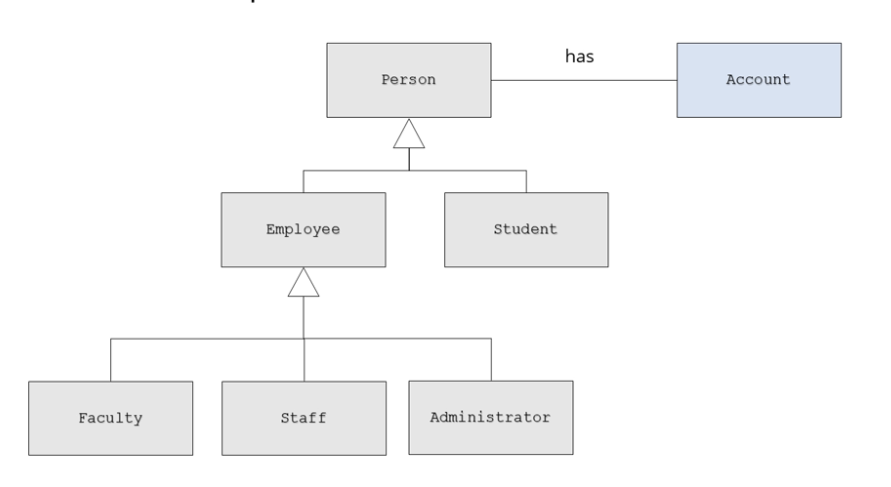
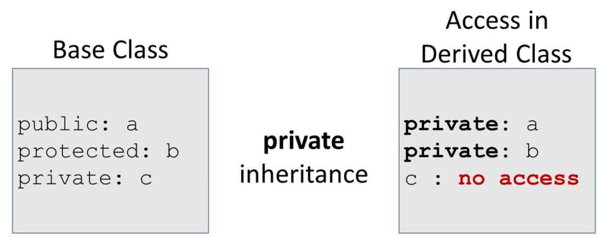

# 15. Inheritance(继承)

## 15.1 What is Inheritance

面向对象中最有用的一个特性就是继承

* 继承提供了一个方法，使得我们能以已经存在的类为来源，创建新的类
* 新的类包含了已存在类的data和behavior
* 这意味着我们能够复用已经经过测试的行为
* 继承允许新创建的类修改已存在的类的方法（当然原来类不会受影响），使得其成为一个独有的方法


我们举一个关联类的例子

* 例如Player,Enemy, Level Boss, Hero, Super Player类，

  * 这些类可能拥有相同的属性，例如health，xp等
  * 这些类也有不同属性，例如技能

* 同样的，Account,Saving Account, Checking Account, Trust Account等

  * 这些类拥有相同的balance，存款取款操作

  * 这些类又有不同的功能和限制

  * 未使用继承前的排布

    	

  * 使用继承后的排布

    ```c++
    class Account{
        //balance, deposit, withdraw
    };
    
    class Savings_Account : public Account{
        //interest rate, specialized withdraw
    };
    
    class Checking_Account : public Account{
        //minimum balance, per check fee, specialized withdraw
    };
    
    class Trust_Account : public Account{
        //interest rate, specialized withdraw, ...
    };
    ```

    

## 15.2 继承的术语(Terminology)

### 15.2.1 从继承方法的角度

* Inheritance
  * 从现有类创建新类的过程
  * 用于机制复用
* Single Inheritance
  * 一个新的类是从一个单一的已有类创建来的
* Multiple Inheritance
  * 一个新的类是从多个已有类创建而来的

### 15.2.2 从继承结构的角度

* Base Class（基类）/Parent Class（父类）/ super class(超类)
  * 被扩展或者被继承的类
* Derived Class(派生类) / Child Class（子类） / sub class
  * 扩展的类

uml类图


### 15.2.3 从继承结构搭建的角度

* **"Is-A" Relationship（"Is-A"关系）**

  - **这种关系描述了子类与父类之间的关系。**例如，如果我们有一个名为 `Bird` 的类和一个名为 `Sparrow` 的子类，那么 `Sparrow` 是一个 `Bird`。这表示 `Sparrow` 继承了 `Bird` 的属性和方法，并可能有其自己的额外属性和方法。

* **Generalization（泛化）**

  - **泛化是从多个类中提取共同特性来创建一个通用的父类的过程。**例如，如果我们观察 `Sparrow` 和 `Eagle` 这两个类，我们可能会发现它们都有飞翔和鸣叫的能力。因此，我们可以创建一个通用的 `Bird` 类，其中包含这些共同特性。

* **Specialization（特化）**

  - **特化是基于一个通用类来创建一个具有特定特性的子类的过程。**继续上面的例子，`Sparrow` 和 `Eagle` 都是 `Bird` 的特化，因为它们除了继承自 `Bird` 的通用特性外，还可能有自己独特的特性，如 `Sparrow` 的鸣叫声可能与 `Eagle` 的不同。

* **Inheritance or Class Hierarchies（继承或类层次结构）**

  - 继承是面向对象编程中的一个核心概念，它允许一个类（子类）继承另一个类（父类）的属性和方法。类层次结构描述了类之间的继承关系，通常用树状结构表示。在这种结构中，父类位于顶部，子类位于下方。例如，`Bird` 可能位于层次结构的顶部，而 `Sparrow` 和 `Eagle` 作为其子类位于下方。

    

### 15.2.4 从公有继承，保护继承，私有继承的角度看

当我们谈论继承时，我们通常指的是public继承，因为它是最常用的，并且它真正体现了面向对象编程中的“is-a”关系。

让我们来看一下这三种继承的区别：

1. **Public Inheritance（公有继承）**:

   - 表示“is-a”关系。
   - 子类是基类的一个特化版本。
   - 子类可以被视为基类的一个实例。
   - 例如，`Bird`是一个基类，`Sparrow`是一个子类。我们可以说“Sparrow是一个Bird”。

2. **Protected 继承（保护继承）**:

   - **意义**：当你想要表示 "is-implemented-in-terms-of"（基于...实现的）关系而不是 "is-a"（是一个）关系时，可以使用保护继承。

   - **特点**：基类的公有和保护成员在派生类中都变为保护成员。

   - **使用场景**：当你希望派生类能够访问基类的功能，但不希望外部代码这样做时，可以使用保护继承。

   - 假设我们有一个基类`Vehicle`和一个子类`Car`。在某些情况下，我们可能不希望外部代码将`Car`视为一个通用的`Vehicle`，但我们仍然希望在`Car`内部使用`Vehicle`的功能。

     ```c++
     class Vehicle {
     public:
         void startEngine() {
             cout << "Engine started." << endl;
         }
     };
     
     class Car : protected Vehicle {
     public:
         void drive() {
             startEngine();
             cout << "Car is driving." << endl;
         }
     };
     
     int main() {
         Car myCar;
         myCar.drive();
         // myCar.startEngine(); // 错误：startEngine() 是受保护的
     }
     ```

3. **Private 继承（私有继承）**:

   - **意义**：私有继承表示 "is-implemented-in-terms-of" 关系。它意味着派生类是通过基类的功能实现的，但派生类并不继承基类的接口。

   - **特点**：基类的公有和保护成员在派生类中都变为私有成员。

   - **使用场景**：当你希望完全隐藏基类的功能，并且只在派生类内部使用它时，可以使用私有继承。

   - 考虑一个`Timer`类，它提供了基本的计时功能。我们可能有一个`Stopwatch`类，它需要计时功能，但我们不希望外部代码将`Stopwatch`视为一个通用的`Timer`。

     ```c++
     class Timer {
     public:
         void start() {
             cout << "Timer started." << endl;
         }
         void stop() {
             cout << "Timer stopped." << endl;
         }
     };
     
     class Stopwatch : private Timer {
     public:
         void begin() {
             cout << "Stopwatch begins." << endl;
             start(); // 使用Timer的start()方法
         }
         void end() {
             cout << "Stopwatch ends." << endl;
             stop(); // 使用Timer的stop()方法
         }
     };
     
     int main() {
         Stopwatch sw;
         sw.begin();
         sw.end();
         // sw.start(); // 错误：start() 是私有的
         // sw.stop();  // 错误：stop() 是私有的
     }
     ```

**为什么要使用它们？**

- **封装**：这两种继承方式都提供了更强的封装。它们允许派生类使用基类的功能，但可以限制外部代码的访问。
- **抽象**：它们可以帮助表示不同的关系。当你不想表示 "is-a" 关系，而是想表示派生类是基于基类实现的时，这两种继承方式都很有用。
- **避免误用**：通过限制基类功能的可见性，你可以确保它们不会被误用。

然而，大多数情况下，==组合（Composition）是一个更好的选择，因为它提供了更大的灵活性。在很多设计中，组合被认为是比私有或保护继承更好的选择。==

## 15.3 Composition

Composition与继承同级，它常常与继承一起使用以构建复杂的结构，它是代码复用的另一重要方法


在一些场景中，我们可以说Employee "is-A" Persion，这构建了继承结构

在一些场景中，我们只能说Person      "has-A" Account，这便是Composition结构




同样的，还有Aggregation， Association ，与Composition

==在使用Inheritance之前，永远先考虑Aggregation，Associtation and Composition==

### 15.3.1 Aggregation, Association and Composition

**Aggregation（聚合）**

- **定义**：聚合是一种表示“拥有”或“整体/部分”关系的对象之间的关系。在聚合关系中，一个类的对象（通常称为“整体”）包含另一个类的对象（通常称为“部分”）的引用。
- 特点
  - 聚合关系通常使用“拥有”来描述。
  - 聚合关系中的部分可以存在于多个整体对象中。
  - 如果整体对象被销毁，部分对象不一定会被销毁。
- **示例**：考虑一个大学和学生的关系。一个大学有很多学生，但学生毕业后，他们不再属于任何大学，但仍然存在。在这种情况下，大学与学生之间的关系是聚合关系。大学“拥有”学生，但学生的存在并不完全依赖于大学。

```c++
class Student {
    string name;
    // ...
};

class University {
    vector<Student*> students;  // 大学包含学生的引用
    // ...
};
```

**Association（关联）**

- **定义**：关联是对象之间的一种通用关系，表示一个对象与另一个对象之间的某种活动或连接。
- 特点
  - 关联关系可以是单向的或双向的。
  - 关联关系可以有多重性，例如“一个学生可以注册多门课程”。
- **示例**：考虑一个医生和病人的关系。医生可以治疗多名病人，而病人可以被多名医生治疗。他们之间的关系是双向的，并且是关联关系。

```c++
class Patient;

class Doctor {
    vector<Patient*> patients;  // 医生知道他的病人
    // ...
};

class Patient {
    vector<Doctor*> doctors;    // 病人知道治疗他的医生
    // ...
};
```

**Composition（组合）**

- **定义**：组合是一种强烈的“拥有”关系，其中一个主体对象（通常称为“整体”）包含另一个对象（通常称为“部分”）。组合关系比聚合关系更强，因为部分的生命周期完全依赖于整体的生命周期。
- 特点
  - 组合关系通常使用“由...组成”来描述。
  - 如果整体对象被销毁，部分对象也会被销毁。
  - 部分对象只能属于一个整体对象。
- **示例**：考虑一个计算机系统和它的各个部件，如CPU、RAM和硬盘。计算机由这些部件组成，如果计算机被销毁，这些部件也会被销毁。这是一个组合关系。

```c++
class CPU {
    // ...
};

class RAM {
    // ...
};

class HardDrive {
    // ...
};

class Computer {
    CPU cpu;          // 计算机包含CPU
    RAM ram;          // 计算机包含RAM
    HardDrive hd;     // 计算机包含硬盘
    // ...
};
```

总结：

- **聚合**和**组合**都是关于“拥有”关系的，但组合关系比聚合关系更强。
- **关联**是一种更为通用的关系，表示对象之间的某种连接或活动。


## 15.4 如何从existing class创建Deriving class

```c++
class Base{
    
};

class Derived :access-specifier Base{
  //Derived class members  
};

//Access-specifier can be public, private or protected
// if not provide then it is private

Derived temp1 {};
Derived *temp2 = new Derived();

Derived.mthod1();
temp2->method2();

delete temp2;
```


## 15.5 Protected成员以及类的访问

### 15.5.1 Protected

* Protected member能对类本身的所有方法访问
* Protected member**也能访问所有此类的子类**
* Protected  member**不能由对象/实例访问**
* Protected member就是可以访问子类成员的private member


### 15.5.2 类的访问

#### 15.5.2.1 Access with public Inheritance


* 可以继续访问的有
  * Base class中的public member，	并且在子类中保持其public身份
  * Base class中的protected member， 并且在子类中保持其protected身份
* 不可以继续访问的有
  * Base clas中的private member，虽然private member也是被继承的，但是访问base class private member会导致编译器错误
  * ==这意味着如果在base class设置了private，那意味着base class的开发者不希望任何人（包括子类的开发者）能够访问其member==


#### 15.5.2.2 Access with protected Inheritance

protected Inheritance 不是 "is A" 继承


* Base class 中的 public member在 Derived class中转变为protected
* Base class 中的 private member在 Derived class中仍然无法访问


#### 15.5.2.3 Access with private Inheritance

private Inheritance 不是 "is A" 继承

==注意，private 的not accessable并不是delete private member。我们不能访问并不代表子类中它不在那里。==



* Base class 中的 public member 和 protected member全部都在Derived class中变为private
* Base class中的private仍然不能访问

这意味着如果在这个子类中没有新的public和protected，那么这个子类的子类就没有意义。

private继承很少见，通常是用于完成细节的添加。


## 15.6 构造函数在继承中的机制

* 子类中的父类部分在子类被初始化之前被初始化
* 当一个子类实例被创建后
  * 基类构造函数执行
  * 子类构造函数执行
* 当一个子类实例被销毁时
  * 子类析构函数先执行
  * 基类析构函数后执行


## 15.7 不会被继承的Base class member

以下四个不会被继承，但是构造函数，析构函数和重载可以被调用

* **基类构造函数：**派生类的构造函数通常会调用基类的构造函数来确保基类部分的正确初始化。

  ```c++
  class Base {
  public:
      Base(int x) { /*...*/ }
  };
  
  class Derived : public Base {
  public:
      Derived(int x, int y) : Base(x) { /*...*/ }
  };
  
  ```

  

* **基类析构函数：**当派生类对象被销毁时，首先调用其析构函数，然后**自动**调用基类的析构函数来清理基类部分,无需显式调用。

* **基类重载运算符**：运算符重载是类特定的，不会自动继承。但是，派生类可以调用基类的重载运算符，或者定义自己的版本来覆盖或扩展基类的行为。

  ```c++
  Derived& Derived::operator=(const Derived& other) {
      if (this == &other)
          return *this;
      Base::operator=(other);  // Call base class assignment operator
      // ... additional assignment for Derived class ...
      return *this;
  }
  
  ```

* **基类友元：**友元关系是不能被继承的。如果一个类被声明为另一个类的友元，这并不意味着派生类也是那个类的友元。


tips：**使用`using Base::Base;`**：C++11引入了一个新特性，允许派生类显式地继承基类的非特殊构造函数。这意味着派生类可以使用基类的构造函数，而不需要重新定义。但是，这个特性有很多规则和限制，所以在许多情况下，自己定义构造函数可能更为清晰和简单。

## 15.8 继承与调用

* 当我们说继承时，我们通常说的是**数据成员与成员函数的继承**。
  * 内存上：当我们说一个类（派生类）继承另一个类（基类）时，意味着**派生类的对象在内存中包含了基类的所有数据成员**。这就是为什么我们说派生类“是一个”基类的实例。
  * 关于成员函数，情况有些不同。**成员函数不是存储在每个对象中的。它们存储在内存的一个单独位置，并由所有对象共享。**当派生类继承基类时，它继承了基类的所有公共和受保护的成员函数。这意味着派生类的对象可以调用这些函数，就好像它们是派生类自己的函数一样。
  * 继承不同于复制。继承是一种关系，表示一个类是另一个类的特化。**它不是简单地将基类的代码复制到派生类中。**
* 当我们说**构造函数、析构函数、重载的赋值运算符和基类的友元函数**没有被继承时，我们通常指的是==**这些函数不会自动为派生类创建新的版本**==
* 但是，派生类对象在内存中包含了一个基类对象的部分，因此它仍然可以访问和调用基类的这些函数。


## 15.9 继承中的构造函数

### 15.9.1 未指定调用Base 构造器

==这种方法常常只能初始化Base相关参数，或者仅仅只能初始化派生类相关参数，而不能二者兼得==

```c++
Class Base{
    int value;
public:
    Base():value{0}{cout << "Base no-args constructor" << endl}
    Base(int x):value{x}{cout << "Base (int) overloaded constructors" << endl;}
    ~Base(){cout << "Base destructor" << endl;}
};

class Derived:public Base{
private:
    int double_value;
public:
    Derived():double_value{0}{cout << "Derived no-args constructor" << endl;}
    Derived(int x):doubled_value{x*2}{cout << "Derived (int) overloaded constructor" << endl;}
}

int main(){
    Derived d{1000};//调用了Base()以及Derived(1000)
    //假如没有重载Derived(int x)，那么编译器会报错
}
```


在C++11及以后的版本中，**`using Base::Base;`**语法允许派生类继承其基类的构造函数。这意味着，使用这种语法，派生类可以直接使用基类的构造函数，而无需重新定义它们。

注意，仅仅能继承非special constructor.

“非special constructor”是指除了派生类特有的那些构造函数,即

* 如拷贝构造函数、:拷贝涉及到派生类独有的member复制

* 移动构造函数：移动涉及到派生类独有member的移动

* 默认构造函数：默认构造函数与派生类的默认构造函数构造对象不一样，冲突

  之外的所有构造函数。这是因为这些“特殊”构造函数通常需要为派生类的新成员变量进行特定的初始化操作。

让我们通过一个例子来理解这一点：

```c++
class Base {
public:
    Base(int x) { /*...*/ }
    Base(double y, double z) { /*...*/ }
};

class Derived : public Base {
public:
    using Base::Base;  // Inherit constructors of Base
    // Derived class may have its own members and methods
};
```

在上面的例子中，`Derived`类通过`using Base::Base;`语法继承了`Base`类的所有构造函数。因此，我们可以这样创建`Derived`类的对象：

```c++
Derived d1(5);         // Calls Base(int x)
Derived d2(3.14, 2.71); // Calls Base(double y, double z)
```

但是，**如果`Derived`类有自己的成员变量，那么这些成员变量需要在`Derived`类的构造函数中进行初始化**，这可能会导致某些问题。为了解决这些问题，通常建议在派生类中明确定义所需的构造函数，而不是简单地继承基类的构造函数。


### 15.9.2 向Base Constructor传参

和委托构造函数差不多，不过委托的是Base

```c++
class Base{
public:
    Base();
	Base(int);
    ...
};
Derived::Derived()
    :Base{},doubled_balue{0}{
        
    }
    
Derived::Derived(int x)
    :Base{x}，doubled_value{x^2}{}
```


## 15.10 Copy and Move

* 复制与移动构造函数不会从Base继承
* 大多数时间compiler所提供的就是你所需要的全部

### 15.10.1 Copy Constructor

我们主要需要复制两个部分，Base以及Derive

```c++
class Base{
    int Value;
public:
    //略
    Base(const Base &other) :value{other.value}{
        cout << "Base copy constructor" << endl;
    }
};

class Derived:public Base{
    int double_value;
public:
    Derived(const Derived &other)
        :Base(other),double_value{other.doubled_value}{
            cout << "Derived copy constructor" << endl;
        }
}

```

==虽然Base期待一个Base obj，但是由于public继承的is-A特性，Derive就是一个Base==

因此，我们可以pass一个Derive obj到Base 的Copy Contructor中，编译器会自动使用切片并切除派生对象的Base部分

> Home:Derive没有访问Base中private数据的权限，是如何切片复制Base的呢？
>
> 首先，我们需要理解两个关键概念：
>
> 1. **访问权限**：当我们说派生类不能“访问”基类的私有成员时，我们是指派生类不能直接读取或修改这些私有成员。但这并不意味着派生类不知道这些私有成员的存在。实际上，派生类知道基类的完整布局，包括私有成员，但它不能直接操作它们。
> 2. **对象切片**：当派生类对象被当作基类对象使用时，只有基类部分被考虑，而派生类特有的部分被忽略。这并不涉及到“访问”基类的私有成员，而是涉及到对象的内存布局。当你传递一个派生类对象给一个期望基类对象的函数时，该函数只“看到”和操作基类部分，无论这部分是公有的、保护的还是私有的。
>
> 具体到你的问题，当你调用`Base(other)`时，你实际上是传递了整个`Derived`对象给`Base`的拷贝构造函数。但由于拷贝构造函数只期望一个`Base`对象，它只会处理这个对象的`Base`部分。这并不涉及到“访问”私有成员的问题，因为拷贝构造函数是基类的一部分，它有权访问其自己的私有成员。
>
> ==简而言之，对象切片是基于对象的内存布局进行的，而不是基于访问权限。==


### 15.10.2 Move Constructor

类似


### 15.10.3 `=` Overloading

```c++
class Base{
    int value;
public:
    //略
    Base &operator=(const Base &rhs){
        if(this != &rhs){
            value = rhs.value;
        }
        return *this;
    }
}


class Derived:public Base{
    int doubled_value;
public:
    //略
    Derived &operator=(const Derived &rhs){
        if(this != &rhs){
            Base::operator=(rhs);//Assign Base part
            doubled_value = rhs.doubled_value;//Assign Derived part 
            
        }
        return *this;
    }
}
```


### 15.10.4 注意事项

* 通常你不需要自己设置这些
* 如果没有定义，那么编译器会自动创建并自动调用base
* 如果定义了，那你必须手动调用base
* 小心raw pointer，Base和Derive如果含有raw pointer需要提供深copy版本


## 15.11 重定义基类函数

### 15.11.1 重新定义基类函数的方法

* 派生类可以直接引用基类方法
* 派生类可以**重写**或**重新定义**基类

```c++
class Account{
public:
    void deposit(double amount){balance += amount;}
};

class Savings_Account:public Account{
public:
    void deposit(double amount){
        //redefine base class method
        amount += some_interest;
        Account::deposit(amount); //invoke call Base class method
    }
}
```

1. **派生类可以直接引用基类方法**:
   - 这意味着，如果你创建了一个`Savings_Account`对象，你可以直接调用`deposit`方法，即使这个方法在`Savings_Account`类中没有明确定义。这是因为`Savings_Account`继承了`Account`类，所以它也继承了`Account`类中的所有公有和保护成员。
2. **派生类可以重写或重新定义基类**:
   - 在这里，`Savings_Account`类重新定义了`deposit`方法。这意味着，当你对一个`Savings_Account`对象调用`deposit`方法时，你实际上是调用`Savings_Account`类中的版本，而不是`Account`类中的版本。
   - 但是，注意在`Savings_Account`类的`deposit`方法中，我们仍然可以通过`Account::deposit(amount);`来调用基类的`deposit`方法。这是一个常见的模式，允许我们在派生类中扩展或修改基类方法的行为，而不是完全替换它。

### 15.11.2 编译器对函数的绑定

```c++
Base b;
b.deposit(1000.0);			//Base::deposit

Derived d;
d.deposit(1000.0);			//Derived::deposit	
```


1. **C++使用静态绑定 (Static Binding) **:
   - 当我们在代码中调用一个方法时，编译器需要决定应该执行哪个方法的具体实现。静态绑定意味着这个决定是在编译时做出的，而不是在运行时。
2. **在编译时确定使用哪个方法 (Binding of which method to use is done at compile time)**:
   - 这意味着，当你编译你的程序时，编译器已经确定了每个方法调用应该执行哪个方法的实现。这是基于方法的签名和对象的类型来决定的。
3. **C++的默认绑定是静态的 (Default binding for C++ is static)**:
   - 除非明确指定，否则C++默认使用静态绑定。这意味着，除非你使用特定的关键字和技术（如虚函数），否则方法调用的绑定都是在编译时确定的。
4. **派生类对象将使用 derived::deposit (Derived class objects will use derived::deposit)**:
   - 如果你有一个派生类`derived`，并且它重写了一个基类`base`中的方法`deposit`，那么当你对派生类对象调用`deposit`方法时，它将使用派生类中的实现。
5. **我们可以从 derived::deposit 明确地调用 base::deposit (We can explicitly invoke base::deposit from derived::deposit)**:
   - 即使派生类重写了基类的方法，我们仍然可以在派生类的方法中明确地调用基类的方法实现。这是通过使用`base::methodName`的语法来实现的。
6. **静态绑定是有限的 (OK, but limited)**:
   - 静态绑定虽然简单和高效，但它的灵活性有限。特别是，它不允许我们在运行时基于对象的实际类型来动态地选择方法的实现。
7. **动态绑定 (Dynamic Binding)**:
   - 这是一个更强大的方法绑定技术，它允许我们在运行时根据对象的实际类型来选择方法的实现。在C++中，这是通过使用虚函数来实现的。这段内容提到，动态绑定将在下一节中讨论。


```c++
Base *ptr = new Derived(); //因为*ptr指向的是Base，所以绑定的是Base::deposit
ptr->deposit(1000.0);	
```

关于这个`deposit`方法调用的行为，它取决于`deposit`方法是否在`Base`类中被声明为`virtual`。

- 如果`Base::deposit`是一个`virtual`函数，并且`Derived`类重写了这个函数，那么`ptr->deposit(1000.0);`将调用`Derived::deposit`。
- 如果`Base::deposit`不是一个`virtual`函数，那么`ptr->deposit(1000.0);`将调用`Base::deposit`，即使`Derived`类有自己的`deposit`方法。

==所以，注释“因为*ptr指向的是Base，所以绑定的是Base::deposit”是不完全正确的。真正决定调用哪个`deposit`方法的是`virtual`关键字，而不是指针的类型。==


### 15.11.3 一个例子

```c++
//account.h
#ifndef _ACCOUNT_H_
#define _ACCOUNT_H_
#include<iostream>

//simple Account class
class Account{
    friend std::ostream &operator<<(std::ostream &os,const Account &account);
protected:
    double balance;
public:
    Account();
    Account(double balance);
    void deposit(double amount);
    void withdraw(double amount);
}
#endif //_ACCOUNT_H_
```

```c++
// account.cpp
#include"Account.h"

Account::Account()
    :Account(0.0){
        
    }

Account::Account(double balance)
    :balance{balance}{
        
    }

void Account::deposit(double amount){
    balance += amount;
}

void Account::withdraw(double amount){
    if(balance - amount >= 0)
        balance -= amount;
    else
        std::cout << "Insufficient funds" << std::endl;
}

std::ostream &operator<<(std::ostream &os, const Account &account){
    os << "Account balance" << account.balance;
    return os;
}
```

```c++
// savings_account.h
#ifndef _SAVINGS_ACCOUNT_H_
#define _SAVINGS_ACCOUNT_H_
#include "Account.h"

class Savings_Account:public Account{
    friend std::ostream &operator<<(std::ostream &os, const Savings_Account &account);
protected:
    double int_rate;
public:
    Savings_Account();
    Savings_Account(double balance, double int_rate);
    void deposit(double amount);
    //withdraw is inherited
    
    
};

#endif
```

```c++
#include "Savings_Account.h"

Savings_Account::Savings_Account(double balance, double int_rate)
    :Account(balance),int_rate{int_rate}{
        
    }

Savings_Account::Savings_Account()
    :Savings_Account{0.0,0.0}{
        
    }

void Savings_Account::deposit(double amount){
	amount += amount + (amount * int_rate/100);
    Acount :: deposit(amount);
}

std::ostream &operator<<(std::ostream &os, const Savings_Account &account){
    os << "Savings account balance" << account.balance << "interest rate" << account.int_rate;
    return os;
}
```


## 15.12 Multiple Inheritance

* 一个派生类从至少两个基类同时继承
* 这些基类可能是不相关的类层次结构


### 15.12 语法

```c++
class Department_Chair:
	public Faculty, public Administrator{
        
    };


```

多重继承可能会变得很复杂

多重继承常常可以被优化成单继承


## 15.13 升级过后的例子


```c++
//Account.h
#ifndef _ACCOUNT_H_
#define _ACCOUNT_H_
#include <iostream>
#include <string>

class Account{
    friend std::ostream &operator<<(std::ostream &os, const Account &account);
private:
    //constant available only for class
    static constexpr const char *def_name = "Unnamed Account";
    static constexpr double def_balance = 0.0;
protected:
    std::string name;
    double balance;
public:
    Account(std::string name = def_name, double balance = def_balance);
    
    bool deposit(double amount);
    bool withdraw(double amount);
    double get_balance() const;
}
#endif
```

1. `static`: 这个关键字表示这是一个静态成员。静态成员与类关联，而不是与类的实例关联。==这意味着无论你创建了多少个该类的对象，静态成员只有一个副本。它们在所有对象中是共享的。==
2. `constexpr`: 这是C++11引入的关键字，表示该变量是一个编译时常量。==这意味着它的值在编译时是已知的，并且在程序的整个生命周期中不会改变。==
3. `const char *def_name = "Unnamed Account";`: 这定义了一个指向常量字符的指针，该指针指向一个字符串字面值"Unnamed Account"。因为这是一个字符串字面值，所以它是不可变的，这就是为什么我们使用`const char*`而不是`char*`。
4. `double def_balance = 0.0;`: 这定义了一个`double`类型的编译时常量，其值为0.0。

总结：这两行代码定义了两个静态的、编译时的常量。一个是字符串常量，表示默认的账户名；另一个是双精度浮点数，表示默认的账户余额。这些常量在类的所有实例中是共享的，并且它们的值在程序的整个生命周期中都是不变的。


```c++
// Account.cpp
Account::Account(std::string name, double balance)
    :name{name},balance{balance}{
}

bool Account::deposit(double amount){
    if(amount < 0){
        return false;
    }else{
        balance += amount;
        return true;
    }
}

bool Account::withdraw(double amount){
    if(balance-amount >= 0){
        balance-=amount;
        return true;
    }else
        return false;
}

double Account::get_balance() const{
    return balance;
}

std::ostream &operator<<(std::ostream &os, const Account &account){
    os << "[Account:" << account.name << ":" << account.balance << "]";
    return os;
}
```

```c++
//Savings_Account.h
#ifndef _SAVINGS_ACCOUNT_H_
#define _SAVINGS_ACCOUNT_H_
#include "Account.h"

class Savings_Account:public Account{
    friend std::ostream &operator<<(std::ostream &os, const Savings_Account &account);
private:
    static constexpr const char *def_name = "Unnamed Savings Account";
    static constexpr double def_balance = 0.0;
    static constexpr double def_int_rate = 0.0;
public:
    Savings_Account(std::string name = def_name, double balance = def_balance, double int_rate = def_int_rate);
    bool deposit(double amount);
    //Inherits the Account::withdraw methods
};

#endif
```

```c++
// Savings_Account.cpp

#include "Savings_Account.h"

Savings_Account::Savings_Account(std::String name,double balance, double int_rate)
    :Account{name, balance},int_rate{int_rate}{
        
    }

bool Savings_Account::deposit(double amount){
    amount += amount * (int_rate/100);
    return Account::deposit(amount);
}

std::ostream &operator<<(std::ostream &os, const Savings_Account &account){
    os << "[Savings_Account:" >> account.name << ":" << account.balance << "," << account.int_rate << "%]";
    return os;
}
```

