# 16. Polymorphism

## 16.1 What is Polymorphism

* 实际上，我们已经学习了两种多态：重载函数与重载运算符，这也被称为Compile Time Polymorphism
  * **Compile time/Early binding/static binding**表达的都一样，都表达的是在执行程序前（编译器在程序执行前处理
  * **Run time /late binding/dynamic binding**表达的是程序在执行时处理
* 多态帮助我们更抽象的去看待一个模型。例如，我们向一个Account存入1000，多态允许我们不去细想到底存入哪一种Account，并且这些选择都是在执行时决定的
* 有时我们希望在运行时执行某些东西，我们可以通过**使用基类指针或引用，并声明虚函数**来实现这种行为。

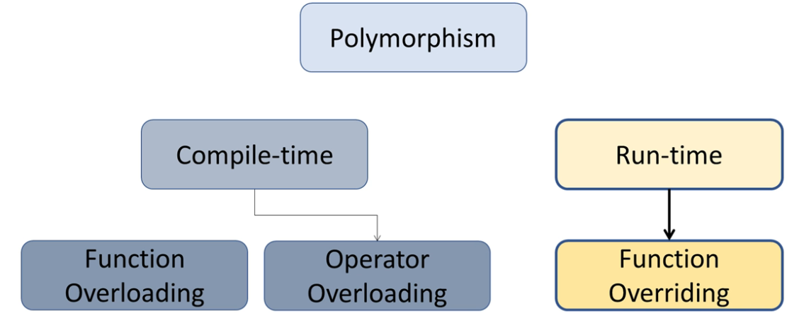

多态分为两大类，compile time以及run time


### 16.1.1 Common Static binding with 基类指针

首先看一下一个静态绑定的例子，**a,b,c,d,p**都有一个自己的方法。编译器在执行前将withdraw绑定给对应的class。==这五个都是静态绑定==

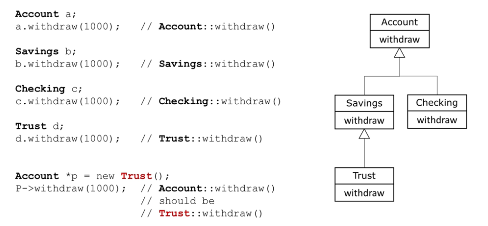

有点特殊的就是`Account *p = new Trust()`，`Trust` 是一个 `Account`。这意味着 `Trust` 类继承了 `Account` 类的所有属性和方法（除了私有成员），因此它可以被看作是一个特殊类型的 `Account`。

* 在内存中，一个 `Trust` 对象的开始部分是一个完整的 `Account` 对象。这意味着一个指向 `Account` 的指针可以指向 `Trust` 对象的这部分，而不会出现任何问题。
* 我们实际上是将 `Trust` 对象在内存中的起始地址赋给了 `Account` 指针 `p`。这个地址指向的内存位置是 `Trust` 对象中 `Account` 部分的开始。因此，通过这个指针，我们可以访问 `Trust` 对象中的所有 `Account` 成员。
* ==我们不能通过这个 `Account` 指针直接访问 `Trust` 特有的成员，除非我们进行类型转换。==
* ==同时，如果Trust是private继承，那么实际上指向的Account部分全是private，那p就什么都指向不了了。其他非Is-A的继承也都会出现问题==
* **其实，在继承的子类中所谓的“重写”与重定义并不会影响其基类的继承部分，只是提供了一个新的实现，因此我们对切片的访问=对基类的访问**


### 16.1.2 Static binding with reference

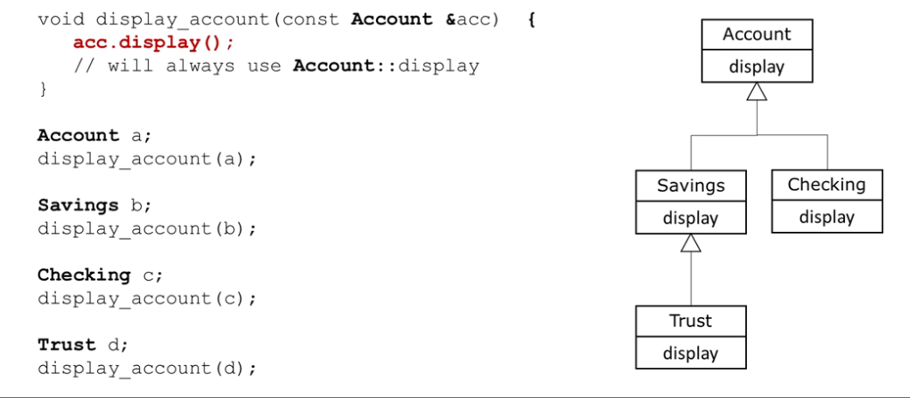

因为我们输入的是是Account，因此相当于将所有Is-A子类切片，然后只给出其Account部分的访问。

同理，全部输出的都是**Account的display版本**

### 16.1.3 Dynamic binding

==将withdraw method在Account中设置为虚函数==，这允许我们在使用**基类指针或引用**时的多态性，以及runtime binding。

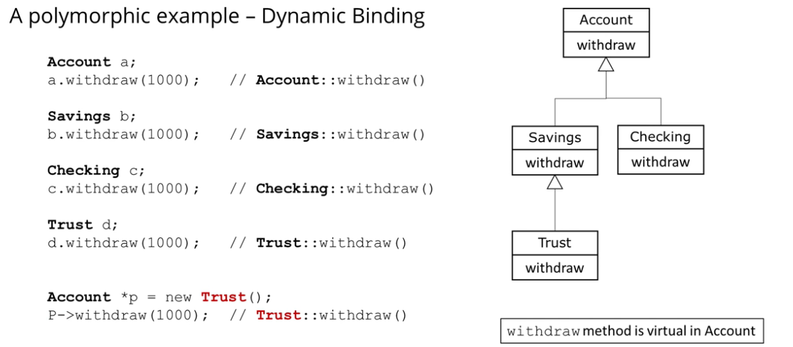

在这个例子中

* `a,b,c,d`仍然都是静态绑定（因为没有使用基类指针或引用）
* 但是此时，指针p==会调用Trust withdraw==
  * 因为withdraw是虚函数，因此这个函数不会在编译时绑定到具体的类。
  * ==在我们调用withdraw时，编译器会“看到”这个p指向的到底是什么，然后调用该对象方法。==


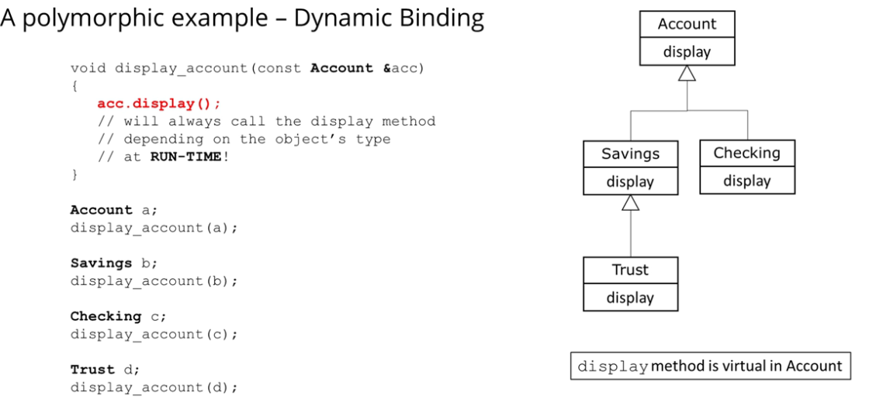

同理，这里的acc会在运行时==依据传入的数据类型==决定调用的是哪个对象的display。


## 16.2 使用动态绑定-Base class pointer

==为了使用一个动态绑定，我们必须有==

* ==一个继承层次结构==
* ==一个基类指针或基类引用==
* ==需要动态绑定的方法是被声明为虚拟的==


### 16.2.1 动态绑定令Base Class Pointer变得更强大

多态如何让Base Class Pointer更加强大？如下二图，它能十分简便的完成一次遍历操作。

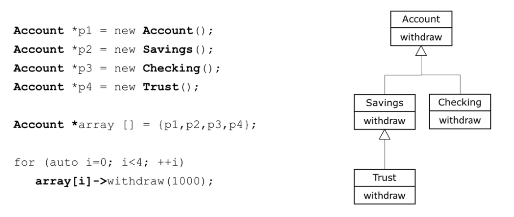

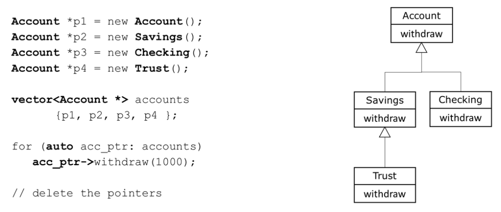

### 16.2.2 Virtual and Override

#### 16.2.2.1 Override与Redefine

当我们谈论函数在面向对象编程中的重新定义（redefined）和重写（overridden），我们通常是在讨论继承和多态。这两个概念在不同的上下文中有不同的含义和用途。让我们详细了解它们：

1. **Overridden Function (重写函数)**:

   - 重写是子类为了改变从父类继承的方法的行为而提供的新实现。

   - 重写的方法必须和基类中被重写的方法有相同的方法名、参数列表和返回类型。

   - 重写的方法通常使用关键字 `override`（在某些语言中）进行标记，以明确表示意图。

   - 在多态的上下文中，基类的指针或引用可以用来调用重写的方法，而实际执行的方法版本是由对象的运行时类型决定的。

     ```c++
     class Base {
     public:
         virtual void show() {
             cout << "Base" << endl;
         }
     };
     
     class Derived : public Base {
     public:
         void show() override {
             cout << "Derived" << endl;
         }
     };
     ```

2. **Redefined Function (重新定义函数)**:

   - 重新定义是子类提供了一个与基类中同名的方法，但这不是为了改变其行为。这只是一个新的方法，与基类中的方法没有直接关系。

   - 重新定义的方法不会考虑基类中的方法签名，它只是一个新的、独立的方法。

   - 如果基类方法不是虚函数，那么子类中的同名方法会隐藏基类中的方法，这就是重新定义。

   - 使用基类的指针或引用调用这样的方法时，会调用基类版本的方法，而不是子类版本。

     ```c++
     class Base {
     public:
         void show() {
             cout << "Base" << endl;
         }
     };
     
     class Derived : public Base {
     public:
         void show(std::string name) {
             cout << "Derived"<< name << endl;
         }
     };
     ```

总结：重写是为了实现多态，允许子类改变从父类继承的方法的行为。而重新定义是子类为了提供一个新的、与基类中同名的方法，但这两个方法之间没有直接关系。

#### 16.2.2.2 Virtual functions

* Redefined 函数会被静态绑定
* Overridden函数会被动态绑定
* 虚函数是被overridden的
* 它允许我们通过将层次结构中的所有对象视为基类的对象来进行抽象思考，但是执行的是特定对象的版本


##### 声明虚函数

* 虚函数在hierarchy中自该类往下全都是虚函数
  * 虽然子类中是隐式virtual的，但是为了代码清晰度仍然希望加上virtual关键字
* **动态多态仅能通过base pointer或reference实现**
* ==重写函数的signature（函数名称以及参数列表）和返回类型必须完全一致。==如果不完全一致，那么编译器会将其视为redefine并静态绑定它。

```c++
class Account{
    public:
    virtual void withdraw(double amount);
}
```


#### 16.2.2.3 Virtual与override

在C++中，`virtual` 和 `override` 关键字都与虚函数和多态有关，但它们的用途和意图略有不同：

1. **virtual**:

   - `virtual` 关键字用于声明一个函数为虚函数。这意味着该函数可以在派生类中被重写。

   - 在基类中，你使用 `virtual` 来声明一个函数，以表示该函数可以（并且可能会）在任何派生类中被重写。

   - 一旦一个函数在基类中被声明为 `virtual`，在派生类中它仍然是虚函数，即使你没有再次使用 `virtual` 关键字。

     ```c++
     class Base {
     public:
         virtual void show() {
             cout << "Base" << endl;
         }
     };
     ```

2. **override**:

   - `override` 关键字在C++11及更高版本中引入，用于明确表示派生类中的函数旨在重写基类中的虚函数。

   - 使用 `override` 可以帮助编译器捕获错误。例如，==如果你在派生类中误拼写了函数名或错误地更改了参数类型，编译器会发出错误消息。==

   - 使用 `override` 是一种明确的表达意图，使代码更易读和维护。

     ```c++
     class Derived : public Base {
     public:
         void show() override {
             cout << "Derived" << endl;
         }
     };
     ```

为什么有时只看到 `virtual` 而不是 `override`？

- 在C++11之前，`override` 关键字并不存在。因此，早期的C++代码只使用 `virtual` 来声明和重写虚函数。
- 即使在C++11及更高版本中，使用 `override` 仍然是可选的（但建议使用），因为它提供了额外的类型检查和明确性。
- 有些程序员可能还不习惯使用 `override`，或者他们可能正在为旧版本的C++编写代码。

总之，`virtual` 用于声明虚函数，而 `override` 用于明确表示一个函数是重写的虚函数。使用 `override` 可以提高代码的清晰度并帮助捕获潜在的错误。


#### 16.2.2.4 Virtual destructors

* 考虑这么一种情况，如果一个子类的销毁是通过删除它的指针，而这个指针式base class pointer类型，并且这个类没有virtual destructor，==这个行为在C++中是未定义的==

* 子类必须被以正确的顺序（也就是正确的析构函数）来销毁

* 解决方法很简单

  ```c++
  virtual ~Account();
  ```

  一旦父类的析构函数是virtual的，子类的也就是隐式virtual的了

  但是我们仍然应该为了代码可读性加上virtual


#### 16.2.2.5 Override

Override常常用于指定这个函数一定是virtual的，以避免因为function signature写错带来的麻烦（自动变为redefinition，static绑定）

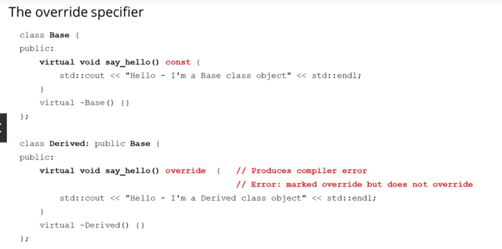

==override仅仅在声明中使用，在定义中不应该使用==

==virtual 也一样==


## 补充-那些仅能在声明使用不能在实现使用的关键字

在C++中，有一些关键字主要用于类成员函数的声明，而不是定义。以下是这些关键字的总结：

1. **virtual**：用于声明一个虚函数。这意味着该函数可以在派生类中被重写。
2. **override**：用于明确指示派生类中的函数是重写基类中的虚函数。这提供了编译时检查，确保函数确实重写了基类中的一个虚函数。
3. **final**：用于指示虚函数不能在进一步派生的类中被重写，或者一个类不能被进一步派生。
4. **= 0**：用于声明纯虚函数。这意味着该函数没有在基类中提供定义，并且必须在任何非抽象的派生类中被重写。
5. **= delete**：用于明确禁止某个函数的使用。
6. **= default**：用于指示编译器为特定的函数生成默认实现，如默认构造函数或析构函数。
7. **explicit**：用于构造函数，表示该构造函数不能用于隐式转换。
8. **friend**：用于声明友元函数或友元类，允许它们访问当前类的私有和受保护成员。
9. **mutable**：用于类的数据成员，表示该数据成员可以在一个`const`成员函数中被修改。

这些关键字主要在类的声明中使用，而不是在函数的定义或实现中使用。当你为这些函数提供定义或实现时，不应再使用这些关键字


## 16.3 final 关键字

* **在类别层级上，final可以防止产生子类**
* **在函数层级上，final可以防止方法在子类中被override**

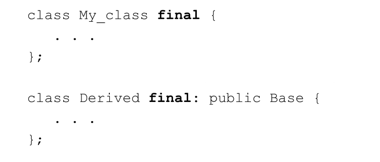

以上两个说明了

* My_class 不能产生子类
* Derived不能产生子类


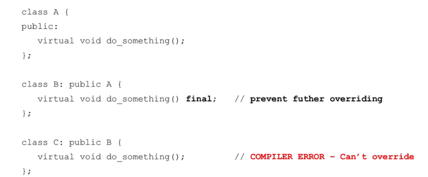

以上说明了 函数`do_something`的virtual属性到此为止，不能再次被override。


## 16.4 使用动态绑定-Base class reference

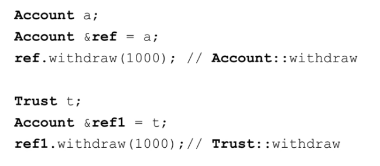

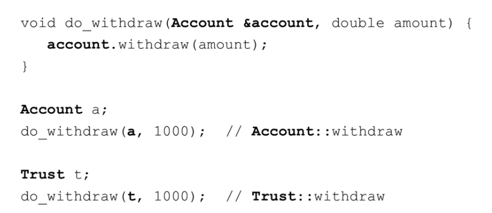


## 16.5 纯虚函数

### 16.5.1 抽象类(Abstract class)

* 抽象类不能产生实例
* 这些类是用于继承层级中的基类
* 必须包含纯虚函数
* 如果其子类没有将所有的纯虚函数全部定义，那它的子类也不能实例化


### 16.5.2 具体类(concrete class)

* 用于产生实例
* 他们所有的成员函数都被定义过

### 16.5.3 纯虚函数 virtual function_name()=0;

==只要包含纯虚函数，该类就不能实例化！我们只能从他的派生类重写**所有**纯虚函数之后才能实例化==

`std::string get_name()=0;` 是一个纯虚函数的声明。在C++中，这种声明表示该函数是一个虚函数，并且没有实现。这样的函数必须在任何非抽象的派生类中被重写。

**当一个类中有至少一个纯虚函数时，该类被称为抽象类。抽象类不能被实例化。它的主要目的是作为其他类的基类，并为派生类提供一个或多个必须实现的接口。**

以下是一个简单的例子：

```c++
class AbstractClass {
public:
    virtual std::string get_name() = 0;  // 纯虚函数
};

class ConcreteClass : public AbstractClass {
public:
    std::string get_name() override {
        return "ConcreteClass";
    }
};
```

在上面的例子中，`AbstractClass` 是一个抽象类，因为它有一个纯虚函数 `get_name()`。`ConcreteClass` 是一个派生类，它从 `AbstractClass` 继承并提供了 `get_name()` 的实现。因此，`ConcreteClass` 不是抽象的，可以被实例化。

`= 0` 在纯虚函数声明中的使用表示该函数没有默认实现。这是告诉派生类的方式，它们必须为这个函数提供实现。

## 16.6 将类使用成接口（interface）

**C++不像Java或者C#提供了特定的关键字或者创建接口的方法作为C++核心的一部分，因此我们使用抽象类和纯虚函数来实现他**

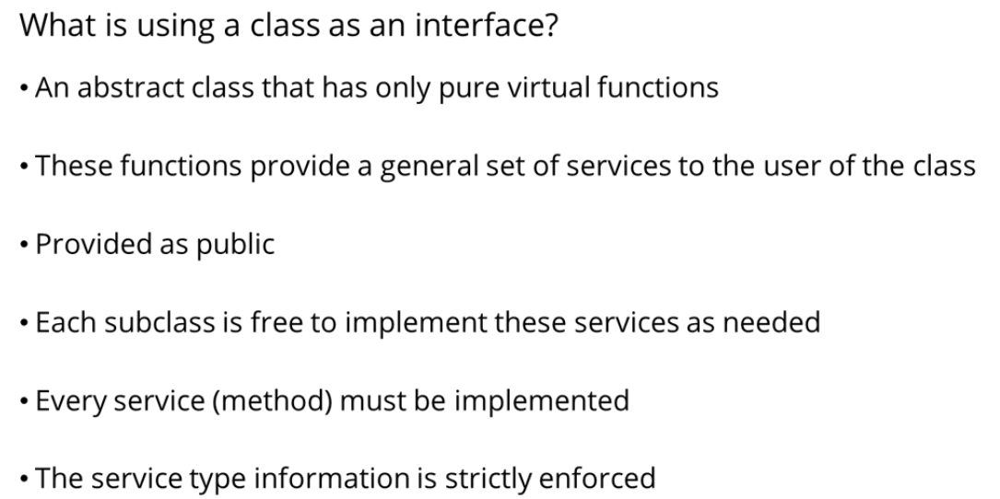

### 例子：创建一个通用的print函数

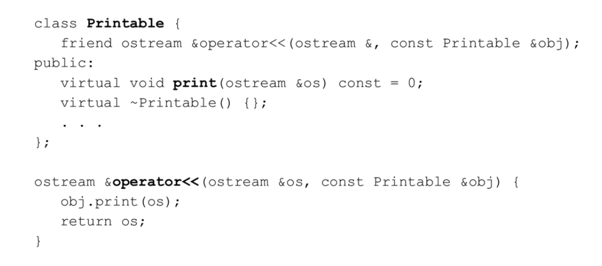

所有Printable的子类都可以传入自己的obj，然后动态绑定到自己的输出流重载上。


### 例子：为Account创建一个通用输出接口

```c++
class I_Printable {
    friend std::ostream &operator<<(std::ostream &os, const I_Printable &obj);
public:
    virtual void print(std::ostream &os) const = 0;
    virtual ~I_Printable {};
};

std::ostream &operator<<(std::ostream &os, const I_Printable &obj) {
    obj.print(os);
    return os;
}

```


```c++
// Section 16
// Interfaces - complete

#include <iostream>


class Account : public I_Printable {
public:
    virtual void withdraw(double amount) {
        std::cout << "In Account::withdraw" << std::endl;
    }
    virtual void print(std::ostream &os) const override {
        os << "Account display";
    }
    virtual ~Account() {  }
};

class Checking: public Account  {
public:
    virtual void withdraw(double amount) {
        std::cout << "In Checking::withdraw" << std::endl;
    }
     virtual void print(std::ostream &os) const override {
        os << "Checking display";
    }
    virtual ~Checking() {  }
};


class Savings: public Account {
public:
    virtual void withdraw(double amount) {
        std::cout << "In Savings::withdraw" << std::endl;
    }
     virtual void print(std::ostream &os) const override {
        os << "Savings display";
    }
    virtual ~Savings() {  }
};

class Trust: public Account  {
public:
    virtual void withdraw(double amount) {
        std::cout << "In Trust::withdraw" << std::endl;
    }
     virtual void print(std::ostream &os) const override {
        os << "Trust display";
    }
    virtual ~Trust() {  }
};

class Dog : public I_Printable {
public:
  virtual void print(std::ostream &os) const override {
        os << "Woof woof";
    } 
};

void print(const I_Printable &obj) {
    std::cout << obj << std::endl;
}


int main() {
    
    Dog *dog = new Dog();
    std::cout << *dog<< std::endl;  
    
    print(*dog);
    
    Account *p1 = new Account();
    std::cout << *p1<< std::endl;
        
    Account *p2 = new Checking();
    std::cout << *p2<< std::endl;  

//    Account a;
//    std::cout << a<< std::endl;
//    
//    Checking c;
//    std::cout << c << std::endl;
//
//    Savings s;
//    std::cout << s << std::endl;
//    
//    Trust t;
//    std::cout << t << std::endl;
        
    delete p1;
    delete p2;
    delete dog;
    return 0;
}

```


同理，既然我们可以对重载<<这么做，我们也可以对一个自定义全局函数这么做，然后使用一个统筹的抽象类来辅助它。这样，我们最后就能像打tag一样为我们的子类选择父类，以此添加通用功能项。

```c++
void print(const I_Printable &obj){
    std::cout << obj << std::endl;
}

print(Checking_Account);//直接输出对应的
```

