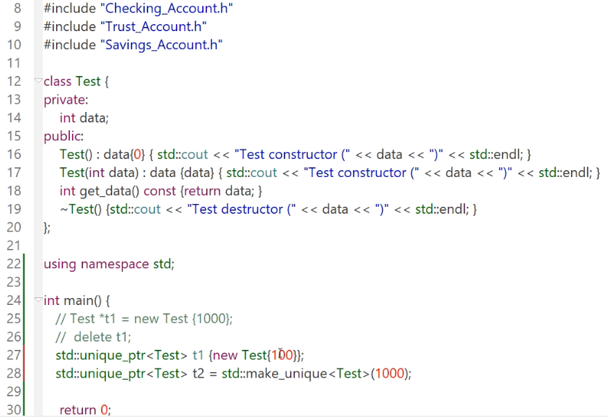
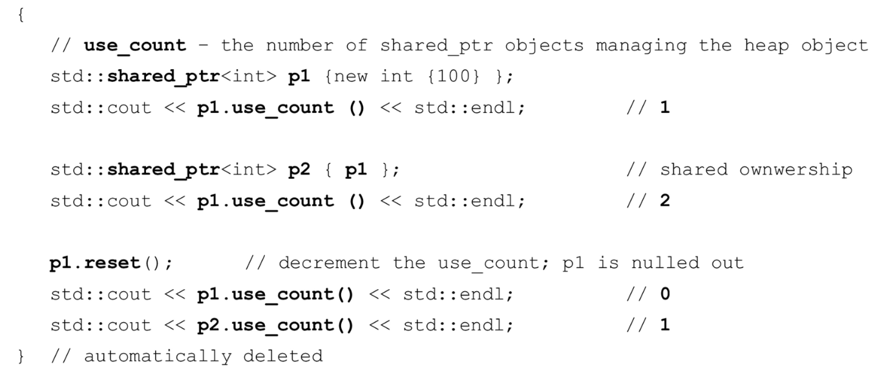
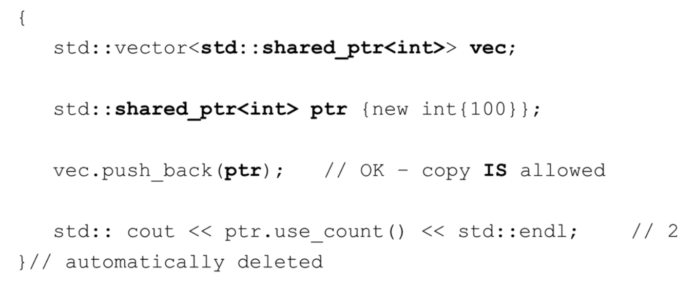
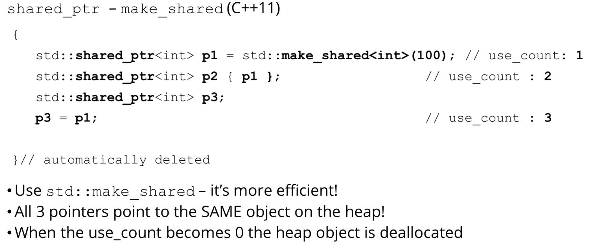
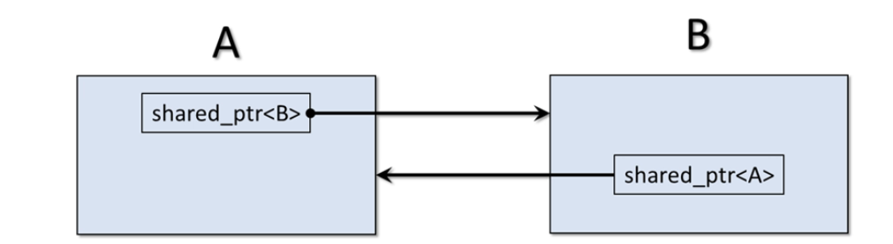
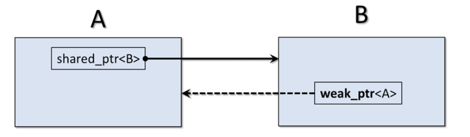

# 17. Smart Pointer

## 17.1 Overview

* Ownership and RAII(Resource Acquisition  Is Initialization)资源获取就是初始化
* 抛弃new和delete，所有内存管理都是由C++处理
* Unique Pointer
* Shared Pointers
* Weak Pointers

* Custorm Deleters

几个注意点：

* **智能指针可能会破坏数据的局部性，尤其是当使用`std::shared_ptr`时。**
* 在某些情况下，使用智能指针是合适的，例如管理稀疏的资源或在非关键路径上的代码中。但在性能关键的循环或算法中，可能更倾向于使用裸指针或其他低级技术。
* `std::shared_ptr`可能会导致循环引用，这会阻止对象被正确释放。在这种情况下，可以使用`std::weak_ptr`来打破循环。

## 17.2 Raw pointer的危害

==首先要明确，就算我们什么都没有做错，程序也可能抛出给异常，使得释放内存的代码永远不会执行==

1. **内存泄漏**：如果动态分配的内存没有被正确释放，会导致内存泄漏。长时间运行的程序可能因此耗尽可用内存。
2. **悬挂指针**（Dangling Pointers）：当一个指针指向的内存被释放后，该指针称为悬挂指针。再次访问或解引用这样的指针会导致未定义的行为。
3. **双重删除**：如果试图多次删除同一个指针，会导致未定义的行为。
4. **野指针**：未初始化的指针或已经释放的指针可能会指向任意内存地址，称为野指针。访问这样的指针也会导致未定义的行为。
5. **内存碎片**：频繁地分配和释放小块内存可能导致内存碎片，这会降低内存的使用效率。
6. **所有权不明确**：当多个指针指向同一块内存时，不清楚哪个指针负责释放内存，可能导致内存泄漏或双重删除。
7. **不安全的类型转换**：裸指针允许不安全的类型转换，如将`void*`转换为其他类型的指针，这可能导致未定义的行为。
8. **数组边界越界**：裸指针没有边界检查，很容易超出数组边界，导致数据损坏或未定义的行为。
9. **线程安全问题**：在多线程环境中，对裸指针的不同步访问可能导致数据竞争和其他线程安全问题。


## 17.3 什么是智能指针？

* ==智能指针是一个实例，与vector相似==
* 只能指向heap（堆）分配的内存
* 在不再需要的时候自动调用delete
* 遵循RAII原则
* 种类
  * Unique Pointer
  * Shared Pointer
  * Weak Pointer


智能指针类提供了

* 重载的dereference`*`
* 成员选择`->`

没有提供算数符号

* `++,--`等


==常用的就是Unique pointer，除非涉及到shared ownership，不然shared pointer不是一个好选择。==

## 17.4 声明智能指针


```c++
#include<memory>

std::unique_pointer<some_class> ptr = ...;
std::shared_pointer<some_class> ptr = ...;
std::weak_pointer<some_class> ptr = ...;

ptr->method();
cout << （*ptr) << endl;
```

当指针超出范围时，智能指针类的析构函数会自动调用以解分配内存


## 17.5 Resource Acquisition Is Initialization

* RAII对象在stack(栈)上分配内存
* Resource Acquisition
  * RAII对象将获得某些资源，例如打开文件，分配内存，获取锁等
* Initialization
  * 对象在初始化时获取这些资源（也就是发生在构造函数中）
  * 当然放弃这些资源就在析构函数中


## 17.6 Unique pointer

* ==不能有多个unique指针指向heap(堆)上的同一个object==

  * 不能copy or assign
  * 可以move：因此非常适合放在STL中

* 因为是Unique的，因此当超出范围时，我们可以确定pointer全被destroy了

* `std::unique_ptr` 有一个专门为数组设计的模板特化，这使得它能够正确地管理动态分配的数组。

  * 当你为 `std::unique_ptr` 提供一个数组类型时，它会自动使用 `delete[]` 来释放内存。例如：

    ```c++
    std::unique_ptr<int[]> arr(new int[10]);
    ```

    在这个例子中，`arr` 是一个指向整数数组的 `std::unique_ptr`。当 `arr` 超出作用域或被重置时，它会自动使用 `delete[]` 来释放数组。

    这与 `std::shared_ptr` 不同，`std::shared_ptr` 默认不为数组提供特殊处理，所以如果你想使用 `std::shared_ptr` 管理数组，你需要提供自定义的删除器。而 `std::unique_ptr` 为数组提供了内置的支持，所以你不需要提供自定义的删除器。

### 17.6.1 声明

```c++
{
    std::unique_ptr<int> p1 {new int {100}};
    std::cout << *p1 << std::endl; //100
    *p1=200;
    std::cout << *p1 << std::endl;//200
}
```


### 17.6.2 get，reset与重载的bool方法

#### 示例

```c++
{
    std::unique_ptr<int> p1 {new int {100}};
    
    std::cout << p1.get() << std::endl;
    
    p1.reset();// p1 is now nullptr
    
    if(p1)
        std::cout << *p1 << std::endl;//won't execute
}
```


#### reset()

1. 如果 `std::unique_ptr` 当前管理一个对象（即它不是空指针），那么它会释放该对象。
2. 如果给 `reset` 提供了一个新的指针参数，那么 `std::unique_ptr` 会开始管理这个新的指针。否则，`std::unique_ptr` 会被设置为 `nullptr`。

```c++
#include <iostream>
#include <memory>

int main() {
    std::unique_ptr<int> p1 = std::make_unique<int>(5);
    std::cout << "Before reset: " << *p1 << std::endl;

    p1.reset{new int{10};  // 释放原先的内存，并让 p1 管理新分配的 int
    std::cout << "After reset: " << *p1 << std::endl;

    return 0;
}

```


#### get():访问原始指针

`std::unique_ptr` 的 `get` 方法用于获取智能指针内部管理的原始指针。它返回一个指向所管理对象的原始指针，但不会改变 `std::unique_ptr` 的所有权或状态。

以下是 `std::unique_ptr::get` 的一些常见用途：

1. **访问资源**：有时，你可能需要传递原始指针给那些不接受智能指针的函数或API。在这种情况下，你可以使用 `get` 方法来获取原始指针。

   ```c++
   std::unique_ptr<MyClass> ptr = std::make_unique<MyClass>();
   some_legacy_function(ptr.get());
   ```

   

2. **检查指针是否为空**：使用 `get` 方法可以检查 `std::unique_ptr` 是否为空（即是否不指向任何对象）。

   ```c++
   if (ptr.get() != nullptr) {
       // ptr is managing an object
   }
   ```

3. **与其他指针类型比较**：你可以使用 `get` 方法获取的原始指针与其他原始指针进行比较。

   ```c++
   MyClass* raw_ptr = /* ... */;
   if (ptr.get() == raw_ptr) {
       // Both pointers point to the same object
   }
   ```

需要注意的是，虽然 `get` 方法提供了对内部原始指针的访问，但你应该避免使用它来手动管理或删除该指针。`std::unique_ptr` 已经负责了资源的生命周期管理，手动干预可能会导致未定义的行为。


####  重载的bool

当你写 `if(ptr)`，其中 `ptr` 是一个智能指针（如 `std::unique_ptr` 或 `std::shared_ptr`），你实际上是在利用智能指针类的 `operator bool()` 成员函数。这个操作符被重载，以便在智能指针对象被用在布尔上下文中时（如 `if` 语句）返回一个布尔值。

对于 `std::unique_ptr` 和 `std::shared_ptr`，`operator bool()` 的实现大致如下：

- 如果智能指针管理（即指向）一个非空对象，则返回 `true`。
- 如果智能指针为空（即不指向任何对象），则返回 `false`。

因此，以下代码：

```c++
std::unique_ptr<MyClass> ptr = /* ... */;
if (ptr) {
    // ptr is managing an object
}
```

等效于：

```c++
if (ptr.get() != nullptr) {
    // ptr is managing an object
}
```

这种重载提供了一种更简洁、直观的方式来检查智能指针是否管理一个对象，而不需要每次都调用 `get()` 方法并与 `nullptr` 进行比较。


### 17.6.3 Unique ptr不能copy or assign

```c++
{
    vector<unique_ptr<int>> vec;
    
    unique_ptr<int> ptr{new int{100}};
    
    vec.push_back(ptr);// Error-Copy not allowed
    
    vec.push_back(move(ptr));
}
```


### 17.6.4 make_unique:适用于C++14的更好的初始化方法

```c++
{
    std::unique_ptr<int> p1 = make_unique<int>(100);
    
    std::unique_ptr<Account> p2 = make_unique<Account>("Curly",5000);
    
    auto p3 = make_unique<Player>("Hero", 100,100);
    
}
```

这个函数返回一个指定类型的唯一指针，它允许我们将初始化值传递给管理对象的构造函数。


### 17.6.5 例子



unique pointer赋值情况

```c++
//在此基础上，我们添加一个情况

std::unique_ptr<Test> t3;

t3 = t1; //Error, 不能copy or assign

t3 = std::move(t1);//t1 = nullptr
```


unique pointer复制情况

```c++
std::vector<std::unique_ptr<Account>> accounts;

accounts.push_back(make_unique<Checking_Account>{"James",1000});
accounts.push_back(make_unique<Savings_Account>{"Billy",1000,5.2});

for(auto acc:accounts)
    std::cout << *acc << std::endl;//Error，不能copy or assign

for(const auto &acc:accounts)
    std::cout << *acc << std::endl;//Error，不能copy or assign
```


## 17.7 Shared Pointer

* shared pointer在heap(堆)上创建一个对象

* ==它可以有许多shared_ptr指向同一个对象==

* 可以copy and assign

* 可以move

* 销毁时，如果使用这个shared_ptr的use count是0，那么才会被销毁

* ==`std::shared_ptr` 默认是为单个对象设计的，而不是为数组设计的。这意味着，当你使用 `std::shared_ptr` 管理一个动态分配的数组时，它默认使用的析构函数是 `delete` 而不是 `delete[]`。这会导致未定义的行为。==

  * 例如，考虑以下代码：

    ```c++
    std::shared_ptr<int> ptr(new int[10]);
    ```

    当 `ptr` 的引用计数变为0时，它会尝试使用 `delete` 来释放数组，而不是 `delete[]`。这是不正确的。

    为了正确地使用 `std::shared_ptr` 管理数组，你需要提供自定义的删除器：

    ```c++
    std::shared_ptr<int> ptr(new int[10], std::default_delete<int[]>());
    ```

    这样，当 `ptr` 的引用计数变为0时，它会使用 `delete[]` 来释放数组。

    然而，对于数组，更推荐使用 `std::vector` 或其他容器，因为它们自动管理内存并提供更多的功能。如果你确实需要一个智能指针来管理原始数组，考虑使用 `std::unique_ptr`，它有一个专门的数组重载：

    ```c++
    std::unique_ptr<int[]> arr(new int[10]);
    ```

    这样，`arr` 会正确地使用 `delete[]` 来释放数组。


### 17.7.1 声明

```c++
{
    std::shared_ptr<int> p1 {new int {100}};
    
    std::cout << *p1 << std::endl;//100
    
    *p1 = 200;
    
    std::cout << *p1 << std::endl; //200
    
    
}
```


### 17.7.2 use_count()

`use_count`方法返回当前引用堆对象的共享指针的数量。





`p1.reset()`将use_count减为1，此时p1中的指针已经不是我们申请的那个指针了，因此其`use_count=0`

p2在超出作用域后，==其被销毁，`use_count--`==

==这样，在超出这个作用域后，use_count=0,就可以自动delete这个指针==


### 17.7.3 允许copy,assign and move

==注意，复制的是这个智能指针ptr对象而非指向的数值==




**注意，每次push都会增加一次引用**

### 17.7.4 make_shared函数

* 返回一个指定类型的共享指针
* 允许我们将初始化值传递给托管对象的构造函数
* ==创建共享指针的首选方法==
  * **never use new, use make_shared。为什么？因为所有的new本身可能throw exception，或者在给shared_ptr前发生exception。此时这个对象并没有给shared_ptr，因此会产生一个memory_leak。**
  * 编译器将生成效率更高的代码：编译器必须生成一个数据结构包含引用计数，原始指针，实际堆对象以及其他数据信息



实际上在这里是p1处理销毁，因为p2和p3先一步销毁了。


## 17.8 Weak_ptr

* ==Weak_ptr永远是从shared_ptr创建而来的==
* Weak_ptr提供了一个非占有的弱引用(non-owning weak reference)，即不参与owning relationship
* 不会增加或减少`use_count`，因此弱指针不会影响其指向对象的生命周期
* ==不是own而是暂时访问==
* 用处
  * 防止两个对象之间的强引用循环
  * 临时引用另一个对象，类似于遍历节点列表的迭代器指针

### 17.8.1 强引用循环

考虑如下一个情况，有A,B两个类。这两个类中都有一个指向对方的shared_ptr，这样这两个类会永远不被释放内存（因为shared ptr计数永远不会到0）



这时我们就需要使用weak_ptr,首先我们需要==想清楚谁own谁==，例如A own B，那么weak_ptr只有访问权，因此`shared_ptr<B>`就可以顺利销毁




> 强引用循环是当两个或更多的 `shared_ptr` 对象相互引用时发生的。这会导致它们的引用计数永远不会下降到0，因此当它们超出作用域时，内存不会被释放。这种情况在使用 `shared_ptr` 管理具有父子关系的对象时尤为常见。
>
> ### 强引用循环示例：
>
> ```c++
> #include <iostream>
> #include <memory>
> 
> class B;  // 前向声明
> 
> class A {
> public:
>     std::shared_ptr<B> b_ptr;
>     ~A() { std::cout << "A Destructor called!" << std::endl; }
> };
> 
> class B {
> public:
>     std::shared_ptr<A> a_ptr;
>     ~B() { std::cout << "B Destructor called!" << std::endl; }
> };
> 
> int main() {
>     {
>         std::shared_ptr<A> a = std::make_shared<A>();
>         std::shared_ptr<B> b = std::make_shared<B>();
>         a->b_ptr = b;
>         b->a_ptr = a;
>     }  // a 和 b 的析构函数在这里不会被调用，因为存在强引用循环
> 
>     return 0;
> }
> ```
>
> ### 使用 `weak_ptr` 打破循环：
>
> ```c++
> #include <iostream>
> #include <memory>
> 
> class B;
> 
> class A {
> public:
>     std::shared_ptr<B> b_ptr;
>     ~A() { std::cout << "A Destructor called!" << std::endl; }
> };
> 
> class B {
> public:
>     std::weak_ptr<A> a_ptr;  // 使用 weak_ptr 而不是 shared_ptr
>     ~B() { std::cout << "B Destructor called!" << std::endl; }
> };
> 
> int main() {
>     {
>         std::shared_ptr<A> a = std::make_shared<A>();
>         std::shared_ptr<B> b = std::make_shared<B>();
>         a->b_ptr = b;
>         b->a_ptr = a;
>     }  // 现在，当超出作用域时，a 和 b 的析构函数都会被调用
> 
>     return 0;
> }
> ```
>
> 在上面的例子中，我们使用 `weak_ptr` 替代 `shared_ptr` 来打破强引用循环。当 `shared_ptr` 超出作用域时，由于没有其他的 `shared_ptr` 强引用对象，引用计数会下降到0，对象会被正确地销毁。


## 17.9 自定义删除器(Custom Deleters)

* 有的时候我们销毁一个smart pointer，我们不仅仅需要销毁这个堆上的对象，也需要调用该对象的析构函数
* 如果这个对象并没有析构函数干他该干的事，我们可以自己提供一个自定义删除器
* 如果要使用自定义删除器，我们不能使用make_unique或者make_shared

### 17.9.1 使用function

```c++
void my_deleter(Some_Class *raw_pointer){
    //your custom deleter code
    delete raw_pointer;
}

shared_ptr<Some_Class> ptr {new Some_class{},my_deleter};
```

1. 定义了一个自定义的删除器函数 `my_deleter`，该函数接受一个 `Some_Class` 的原始指针作为参数。在这个函数中，你可以执行任何自定义的清理或资源释放操作，然后最终删除传入的原始指针。
2. 创建了一个 `std::shared_ptr`，它管理一个 `Some_Class` 的对象。这个 `shared_ptr` 使用 `new Some_class{}` 分配的原始指针进行初始化。
3. 在创建 `shared_ptr` 时，除了传入原始指针外，还传入了自定义的删除器 `my_deleter`。这意味着当这个 `shared_ptr` 的引用计数降到0时（也就是没有其他的 `shared_ptr` 或 `weak_ptr` 引用这个对象时），它不会使用默认的 `delete` 操作符来删除对象，而是会调用 `my_deleter` 函数来执行删除操作。


#### 使用场景

考虑一个场景，你有一个类 `FileWrapper`，它封装了一个文件指针，用于读写文件。当你完成文件操作后，你不仅需要删除对象，还需要确保文件被正确关闭。

```c++
#include <iostream>
#include <memory>
#include <cstdio>

class FileWrapper {
private:
    FILE *file;
public:
    FileWrapper(const char *filename, const char *mode) {
        file = fopen(filename, mode);
        if (!file) {
            throw std::runtime_error("Unable to open file");
        }
    }
    
    // ... 其他文件操作方法，例如write, read等

    FILE* get() const { return file; }
};

void customFileDeleter(FileWrapper *fw) {
    if (fw) {
        fclose(fw->get());  // 关闭文件
        delete fw;          // 删除对象
    }
}

int main() {
    std::shared_ptr<FileWrapper> filePtr(new FileWrapper("sample.txt", "w"), customFileDeleter);
    // ... 使用 filePtr 进行文件操作
}
```

在上述示例中，我们为 `FileWrapper` 类定义了一个自定义的删除器 `customFileDeleter`。当 `shared_ptr` 的引用计数降为0时，它不仅会删除 `FileWrapper` 对象，还会确保文件被正确关闭。这样

### 17.9.2 使用Lambda表达式

```c++
shared_ptr<Test> ptr (new Test{100}, [](Test *ptr) {
    cout << "Using my custom deleter" << endl;
    delete ptr;
});
```


## 仍然需要自己分配内存的情况

虽然智能指针在现代C++编程中是首选的资源管理工具，但在某些情况下，使用原始指针和`new`可能仍然是合适的或者是必要的。以下是一些可能需要使用`new`和原始指针的情况：

1. **与旧代码库/第三方库交互**：如果你正在与一个旧的代码库或第三方库交互，该库期望原始指针作为参数或返回值，那么你可能需要使用`new`。
2. **自定义内存管理**：在某些高性能或嵌入式应用程序中，你可能需要实现自定义的内存管理策略。在这些情况下，直接使用`new`和`delete`可能更有意义。
3. **对象池**：对象池是预先分配的对象集合，用于快速重新使用而不是频繁地创建和销毁对象。在这种情况下，你可能会直接使用`new`进行初始分配。
4. **数据结构实现**：当实现某些数据结构（如链表、树等）时，你可能会直接管理内存。尽管在这些情况下也可以使用智能指针，但直接使用`new`和`delete`可能会使代码更简洁。
5. **智能指针的开销**：虽然这种开销通常可以忽略不计，但在某些超高性能的场景中，智能指针（特别是`std::shared_ptr`）的开销可能成为一个考虑因素。
6. **某些设计模式**：例如，在“工厂方法”设计模式中，通常使用`new`创建对象并返回原始指针。

尽管存在上述情况，但在大多数情况下，使用智能指针是更安全、更现代的做法，它可以自动管理资源的生命周期，从而减少内存泄漏和其他相关错误的风险。当你决定使用`new`时，应该非常小心，并确保正确地管理分配的资源。


