# 18. Exception Handling

## 18.1 Overview

* 什么是Exception
* 什么是Exception Handling
* 我们如何**抛出(throw)**与**捕获(catch)** Exception
* Exception如何影响**流控制(flow control)**
* 定义我们自己的**exception class**
* STL的Exception层次


注意，C++编写异常安全代码是非常困难的，这超出了本课程的范围。

有几种使用exception handling的流派

* 只在那种阻碍程序继续运行的严重错误才使用
* 别用

因此，本节只是打个基础，具体什么时候用看个人经历


## 18.2 概念，术语，语法

### 18.2.1 什么是Exception Handling

* Exception Handling用于处理额外情况
* 用于表明一个预料之外的情况被侦测到了，或是已经存在
* 程序可以处理这些情况
* 我们可以预知这些情况，然后自己选择程序结束的方式，例如如果在文件操作中出现某些错误，我们可以使用exception handling 尽可能多的保护数据。


### 18.2.2 一般什么会引发Exception

* 资源不足（包括存储，显存，内存）
* 资源不存在（缺少资源）
* 无效操作
* 范围溢出
* underflow, overflow
* 非legal data


### 18.2.3 术语

1. **Exception**:

   - **定义**：异常是程序执行期间发生的特殊情况，它会打断程序的正常流程。这些特殊情况可能是由于各种原因引起的，例如尝试除以零、访问不存在的文件、访问超出数组边界的元素等。
   - **示例**：在C++中，`std::out_of_range`是一个异常，它表示尝试访问超出有效范围的元素。

2. **Throwing an Exception (Raising an Exception)**:

   - **定义**：当程序中出现异常情况时，可以使用特定的语句来明确地表示这一点。这个过程称为"抛出"或"引发"异常。
   - 一般来说，Throw an Exception就是当前代码不知道现在的这个状态应该怎么处理，于是它throw出去看看其他代码有没有办法处理
   - **示例**：在C++中，使用`throw`关键字来抛出异常。例如，`throw std::out_of_range("Index out of range!");`。

3. **Catching an Exception (Handling the Exception)**:

   - **定义**：当异常被抛出时，程序的正常执行流程会被打断。为了处理这种情况并决定如何继续，我们需要有一个机制来"捕获"或"处理"这个异常。这通常涉及到执行一些恢复操作、记录错误或通知用户。

   - 示例：在C++中，使用`try/catch`

     块来捕获和处理异常。

     ```c++
     try {
         // Code that might throw an exception
         throw std::out_of_range("Index out of range!");
     } catch (const std::out_of_range &e) {
         std::cerr << "Caught an exception: " << e.what() << std::endl;
     }
     ```


例如，加入我们需要分配内存，但是没有足够的内存

* 分配内存部分抛出问题
* 程序其他部分catch这种问题，清理缓存给他们分配


## 18.3 Exception语法

* **Throw**
  * 抛出一个exception
* **try{}**
  * try中放入有可能抛出exception的code
  * 如果其中的代码引发了一个异常，那么块中的其他代码就不会实行
  * 这个异常会被抛出，然后等一个catch handler处理
  * 如果没有catch handler能处理
* **catch(Exception ex){code to handle the exception}**
  * 包含解决exception的代码
  * 能有多个catch handlers
  * 可能使得程序终止，也可能程序不会终止


## 18.4 一个简单的例子：除0

虽然我们可以简单的判断0，但是这是一个使用exception handle的例子

```c++
double average {};
//try block
try{
    if(total == 0)
        throw 0;			//throw the exception
    average = sum / total;	//wont execute if total == 0
    
}

//exception handler
catch(int &ex){
    std::cerr << "can't devide by zero" << std::endl;
}

cout<<"Bye"<<endl;
```

如果total==0:

* exception thrown
* try block 暂停，不会除0
* catch exception
* catch输出错误信息，但是没有解决
* 输出"Bye"
* 程序终止


在这里，

* exception handle如果没有catch到抛出的问题，那么程序就会跳过try剩余部分
* 如果catch到抛出的问题，那么程序就会从catch部分继续执行
* 无论如何，程序不会崩溃，"Bye"都会被打印


## 18.5 例子2：Sinlge exception in function

```c++
double calculate_avg(int sum, int total){
    return static_cast<double>(sum)/total;
}
```

一般而言，我们更希望平均值是double的

我们无法更改这个函数让它返回一个值让我们知道除以了0；

**因此我们使用exception  handle重写函数，不改变它的接口，通过抛出一场来保证函数不会被0除。**


```c++
double calculate_avg(int sum, int total){
    if(total == 0)
        throw 0;
    return static_cast<double>(sum) / total;
}
```

```c++
try{
    average = calculate_avg(sum,total);
    std::cout << average << std::endl;
}

catch(int &ex){
    std::cerr <<"You can't divide by zero" << std::endl;
}
std::cout << "Bye" << std::endl;
```


## 18.6 Multiple exception

```c++
double calculate_mpg(int miles, int gallons){
    if(gallon == 0)
        throw 0;
    if(miles < 0 || gallons < 0)
        throw std::string{"negative value error"};
    return static_cast<double>(miles)/gallons;
}
```

```c++
double miles_per_gallon {};
try{
    miles_per_gallon = calculate_mpg(miles, gallons);
    std::cout << miles_per_gallon << std::endl;
}

catch(int &ex){
    std::cerr<<"You can't divide by zero" << std::endl;
}

catch(std::string &ex){
    std::cerr << ex << std::endl;
}

std::cout << "Bye" << std::endl;
```

每当throw触发，c++将终止这个函数，并继续在调用栈中寻找一个处理程序，直到找到一个处理程序或程序终止。


## 18.7 catch all handler

```c++
catch (int &ex){
    
}
catch(std::string &ex){
    
}
//catch all
catch(...){
    std::cerr << "Unknown exception" << std::endl;
}
```

* 如果使用了这个函数，通常会将其作为catch块的最后一个，用于捕获之前没捕获到的
* 在这种情况下，因为传入的是`...`，因此我们无法访问具体的exception，但是我们可以在catch-all主体中处理该异常，例如下图中的`std::cerr << ex << std::endl`，如果通过`...`捕获的，那就没有ex，那就用不了这句。

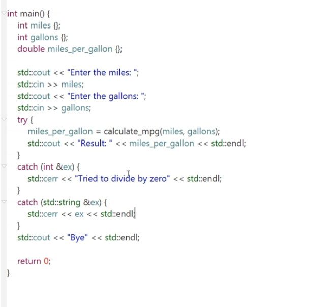

## 内存结构回顾

当我们谈论C++中的"堆栈"时，我们通常是在讨论两个不同的内存区域：堆（Heap）和栈（Stack）。此外，当我们提到"函数调用栈"或"call stack"时，我们实际上是在讨论栈内存中的一个特定部分。以下是关于这些概念的详细解释：

### 1. 栈（Stack）:

- **定义**: 栈是一个后进先出（LIFO）的数据结构，用于存储局部变量、函数参数以及函数调用的相关信息（如返回地址）。
- **函数调用栈**: 当一个函数被调用时，它的参数、局部变量和一些书签信息（如返回到哪里）都被推入栈中。当函数返回时，这些信息被从栈中弹出。因此，函数调用栈是栈的一个特定应用，用于跟踪程序中函数的调用顺序。
- **生命周期**: 栈上的变量在其作用域结束时自动销毁。
- **大小**: 栈的大小是固定的。如果超出了栈的容量（例如，由于过深的函数递归），则会发生栈溢出。

### 2. 堆（Heap）:

- **定义**: 堆是用于动态内存分配的内存区域。与栈不同，堆的大小不是固定的，它可以根据需要增长或缩小。
- **生命周期**: 在堆上分配的内存不会自动销毁。程序员需要显式地使用`delete`（或`delete[]`）来释放内存。如果忘记这样做，就会导致内存泄漏。
- **大小**: 堆的大小受到物理内存和操作系统的限制。

### 3. 为什么需要两种内存区域?

- **速度**: 栈上的分配和销毁速度非常快，因为它只涉及到栈指针的移动。而堆上的分配和销毁则涉及到更复杂的内存管理。
- **灵活性**: 堆允许动态分配，这意味着在运行时可以根据需要分配任意大小的内存。
- **生命周期**: 栈上的变量在其作用域结束时自动销毁，而堆上的变量则需要手动管理。

总的来说，函数调用栈是程序执行时用于跟踪函数调用的机制，而堆和栈是两种不同的内存分配策略，每种都有其特定的用途和优势。

## 18.8 抛出异常时查找catch的过程

* 考虑一个函数（或者在一个域scope中）throw了一个exception，并且没有在当前域中被捕捉
  * ==这个function/域就会终止，并从调用堆栈中删除==
* C++就会尝试去找一个handler，方法是==unwinding the stack==
  * 首先要明确的是，**`catch`块不能直接在与其对应的`throw`语句相同的函数或代码块中。**
    * **语义清晰性**：异常处理的目的是允许函数指出它不能成功完成其预期的任务。这通常是因为它遇到了一个它自己不能或不应该处理的问题。因此，函数通过抛出异常来告知其调用者：“我遇到了问题，我不能处理，你来处理它。”如果`catch`块在相同的函数中，那么这个函数实际上是在说：“我遇到了一个问题，但我会自己处理。”这与异常处理的初衷不符。
    * **代码组织和可读性**：如果`throw`和`catch`在同一个函数中，那么处理异常的代码可能会与正常的逻辑代码混合在一起，这会使函数变得冗长和难以阅读。通过将异常处理代码移到调用函数中，可以使每个函数的职责更加清晰。
    * **灵活性和重用性**：如果异常处理逻辑与引发异常的代码紧密耦合在一起，那么这个函数的重用性会受到限制。相反，通过允许调用者决定如何处理异常，可以使函数更加通用和灵活。
  * C++查看**call stack**,然后查看位于顶部的函数（因为这个函数一定调用了刚刚终止的函数）
  * 如果这个位于顶部的函数使用了try block，则会检查catch处理程序是否匹配
  * 如果找到了一个，它就会触发，我们继续处理
  * 如果没找到try块，或者没有找到匹配的catch处理程序，则从call stack中删除该函数，并重复该过程
    * 注意，当函数被弹出时，其所有的局部变量都会被破坏
    * **局部对象的析构函数调用**：一旦`throw`语句被执行，当前函数的后续代码不会被执行。但在函数退出前，所有在该函数作用域内创建的局部对象的析构函数会被调用。这确保了资源得到正确的清理。
    * **动态分配的内存可能不会被释放**：如果你在函数内部使用`new`分配了内存，但在函数提前因为异常退出前没有使用`delete`释放这些内存，那么这些内存就不会被自动回收，导致内存泄漏。
    * **RAII的重要性**：在异常处理的上下文中，RAII原则尤为重要。使用RAII，即使在面对异常时，资源（如动态分配的内存）也会被正确地释放。例如，如果你使用`std::unique_ptr`来管理动态分配的内存，即使函数因为异常提前退出，该智能指针的析构函数也会被调用，从而释放内存。
  * 如果到达了main，但是exception也没有被handle，那么


总的来说，最关键的是在一个域中，throw后面的都不会被执行了。C++直接开始展开堆栈找catch。


## 18.9 自己创建Exception Classes，throw and catch

注意，永远是throw by value and catch by reference

我们创建的是throw出来的东西

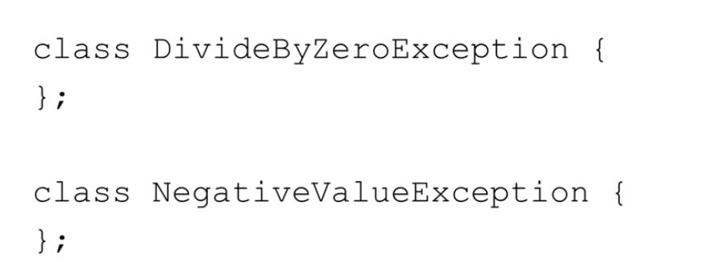

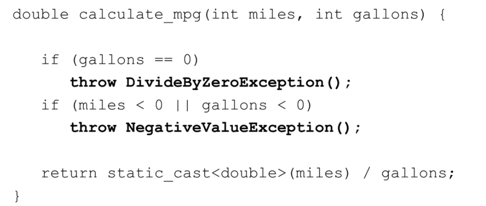

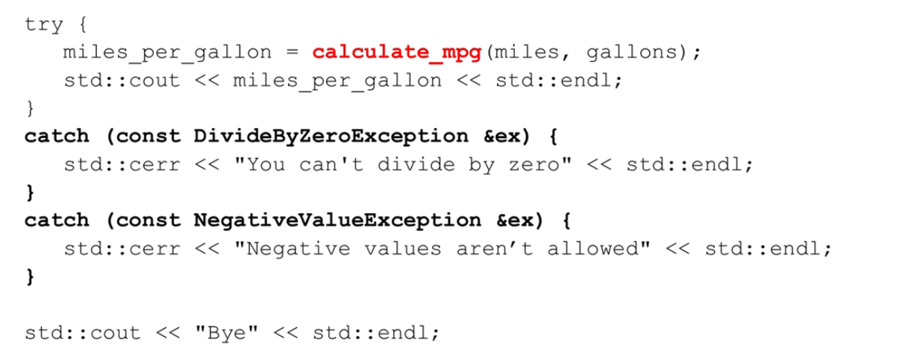

我们也可以设计具体的方法，然后在catch中直接调用


## 18.10 Class Level Exceptions

* **异常处理与类成员函数**

  在C++中，异常可以从类的方法、构造函数和析构函数中抛出。但是，不同类型的成员函数在处理异常时有其特定的注意事项：

  1. **析构函数**：

     - 通常，析构函数不应抛出异常。在C++中，析构函数默认被标记为`noexcept`，这意味着它们不应抛出异常。
     - 如果析构函数在处理另一个异常时被调用（例如，当对象因异常而离开作用域时），并且析构函数本身也抛出异常，那么程序会立即调用`std::terminate()`，因为C++不允许同时有两个未处理的异常。
     - 尽管在某些特殊情况下，析构函数可能需要处理异常，但这是非常罕见的。总的来说，避免在析构函数中抛出异常是一个好的做法。

  2. **构造函数**：

     - 构造函数可能会因为多种原因失败，例如：尝试动态分配内存但失败、打开一个不存在的文件等。
     - 如果构造函数不能成功完成对象的初始化，它应该抛出一个异常来通知调用者。

     ```c++
     class Account {
     public:
         Account(std::string name, double balance)
             : name{name}, balance{balance} {
                 if(balance < 0.0) {
                     throw IllegalBalanceException{};
                 }
             }
     };
     
     try {
         std::unique_ptr<Account> moes_account = std::make_unique<Checking_Account>("Moe", -10.0);
         // 使用 moes_account
     }
     catch(const IllegalBalanceException &ex) {
         std::cerr << "Couldn't create account" << std::endl;
     }
     ```


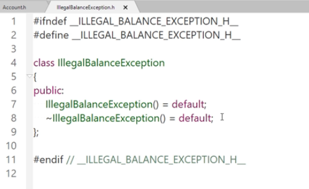

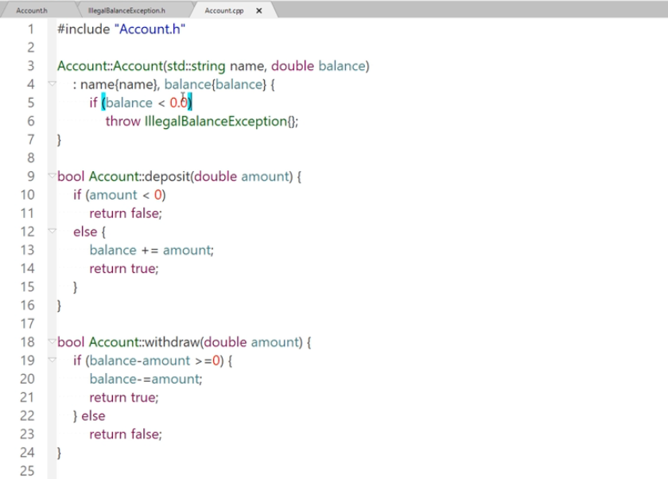

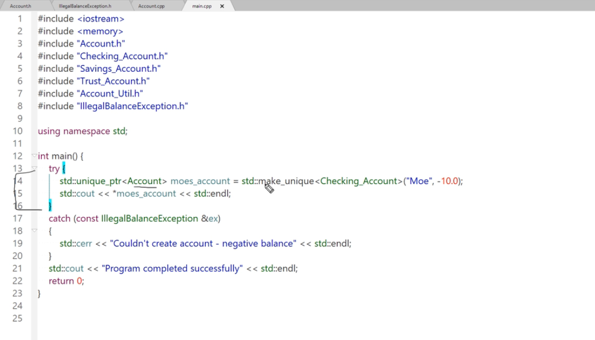


### 18.10.1 函数异常处理

上面的例子可以稍微修改一下

```c++
Account::Account(std::string name, double balance)
try:name{name},balance{balance}{
    if(balance < 0.0){
        throw IllegalBalanceException{};
    }
}
```

代码片段展示了构造函数的异常处理的一个特殊形式，称为**函数的异常处理器**。这种形式的异常处理主要用于构造函数和析构函数，尤其是当成员初始化列表可能抛出异常时。

这里是如何工作的：

1. 成员初始化列表在`try`关键字之前。
2. 如果成员初始化列表中的任何部分抛出异常，那么与该构造函数关联的`catch`块将被执行。
3. 构造函数的主体（在大括号`{}`中的代码）在`try`关键字之后。
4. 如果构造函数的主体抛出异常，与该构造函数关联的`catch`块也会被执行。

这是一个完整的示例：

```c++
class Account {
    std::string name;
    double balance;
public:
    Account(std::string n, double b)
    try : name{n}, balance{b} {
        if (balance < 0.0) {
            throw IllegalBalanceException{};
        }
    }
    catch (const IllegalBalanceException& e) {
        std::cerr << "Exception caught in constructor: " << e.what() << std::endl;
        // 可以进行一些清理或其他操作
    }
};
```

这种异常处理形式的一个关键点是，**如果构造函数的成员初始化列表或主体抛出异常，并且异常被捕获，那么对象的构造仍然会被视为失败，并且对象不会被完全构造。如果这是一个动态分配的对象，那么相应的内存也会被释放。**

这种异常处理方式在某些情况下很有用，但并不常见，因为通常更容易理解和维护的是将异常处理逻辑放在构造函数的主体中。


## 18.11 STL exception 层次结构

1. **C++提供的异常类层次结构**：

   - C++提供了一系列的异常类，这些类在C++标准库中被广泛使用。

   - `std::exception`是所有其他异常类的基类。

   - `std::exception`提供了一个名为`what`的虚函数，返回描述发生的异常的C风格字符串。

     - ```c++
       virtual const char *what() const noexcept;
       ```

     

     以下是STL类层次结构，橙色的类是C++17添加到类层次结构中的类，中间公共基类是exception，我们可以创建子类实现自己的异常（主要是实现what）

     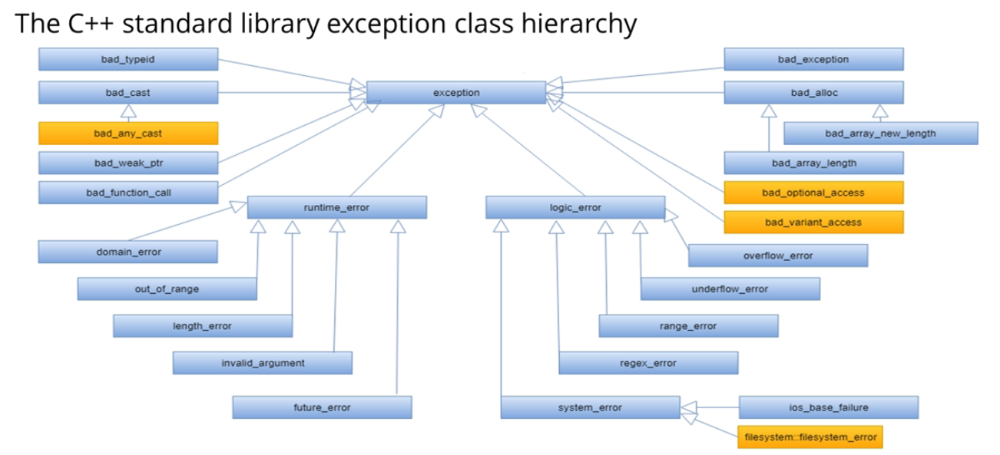

2. **创建异常子类**：

   - 我们可以创建`std::exception`的子类，并实现`what`虚函数，以显示我们想要的任何异常消息。

3. **异常类层次结构概览**：

   - `std::exception`是中心的基类，有许多从它派生出来的类。
   - 这些异常类包括运行时错误、逻辑错误、内存分配错误、范围超出错误等。
   - 我们可以创建自己的用户定义的异常类，这些类从这些异常类派生。

4. **用户定义的异常类**：

   - 通过从`std::exception`公开派生，我们的类现在成为了这个层次结构的一部分。
   - 只需实现`what`虚函数，它将在运行时动态绑定。

5. **创建自定义异常的示例**：

   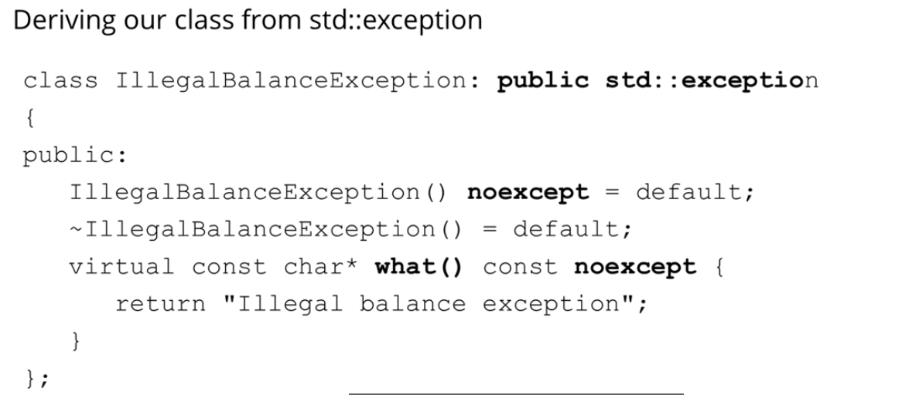

   - 我们可以创建名为`illegal_balance_exception`的用户定义异常类，该类可能在帐户创建时余额为负时抛出。
   - 我们从`std::exception`公开派生该类，并提供一个默认构造函数和一个默认析构函数。
   - 最后，我们实现`what`虚函数并返回描述异常的C风格字符串。

6. **关于`noexcept`关键字**：

   - `noexcept`关键字告诉编译器该方法不会抛出异常。
   - 析构函数默认为`noexcept`。
   - 如果从不抛出异常的方法中抛出异常，程序将终止，异常不会被处理。

7. **如何使用异常**：

   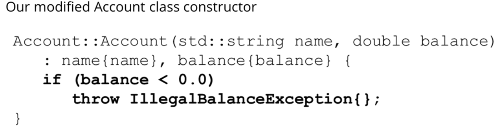

   - 在我们的帐户构造函数中，我们检查帐户余额是否小于0。

   - 如果是，我们将抛出一个`illegal_balance_exception`，这是我们从`std::exception`派生的用户定义异常类。

   - 现在，我们可以尝试创建一个帐户对象。在这种情况下，我们将动态创建一个`Checking_Account`对象。

     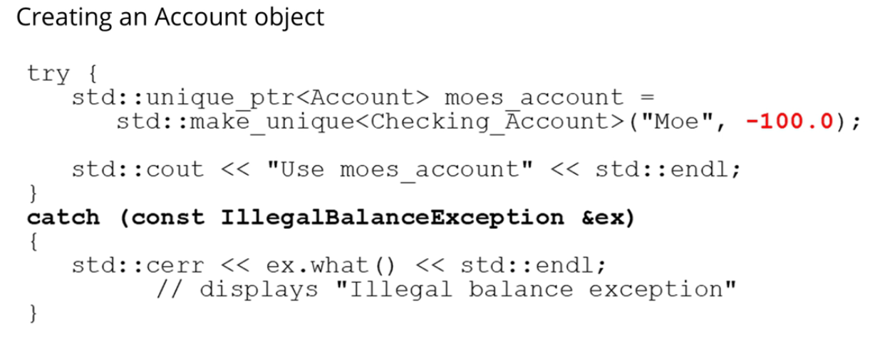

   - 我们用负100的余额创建Moe的帐户。这是不合法的，所以我们期望帐户构造函数会抛出一个`illegal_balance_exception`对象。

   - 在这种情况下，`catch`处理程序被触发，我们调用`ex.what`，它将显示`illegal_balance_exception`。

8. **结论**：

   - 这就是异常处理的全部内容。
   - 下一节是本部分的挑战练习，尽管它涉及到一些在大多数课程中会找到的更高级的异常处理技巧，但我认为您会很好地完成它。