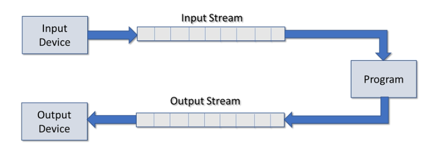

  # 19. I/O and Streams

## 19.1 Overview

* 什么是流
* C++流操纵器
* 文件操作
* string streams


## 19.2 Use stream and files for I/O

* C++提供了一个Stream Abstraction来处理I/O设备，这样就能统一各种I/O接口甚至虚拟接口的使用
* Stream是一个独立于实际device的接口，因此我们可以直接对Stream编程而不用考虑device的类型
* Stream是sequence of bytes



## 19.3 常用的允许我们使用流的头文件

* `iostream`
  * `iostream`是C++标准库中的一个头文件，提供了对输入输出流的基本支持。
  * 主要组件:
    * `cin`：标准输入流，通常与键盘关联。
    * `cout`：标准输出流，通常与屏幕关联。
    * `cerr`：标准错误输出流，用于输出错误消息。
    * `clog`：与`cerr`类似，但用于日志。
* `fstream`
  * **定义**：
    - `fstream`是C++标准库中的一个头文件，提供了文件操作的功能。
  * **主要组件**：
    - `ifstream`：输入文件流，用于从文件读取数据。
    - `ofstream`：输出文件流，用于向文件写入数据。
    - `fstream`：同时支持读写的文件流。
* `iomanip`
  * **定义**：
    - `iomanip`是C++标准库中的一个头文件，提供了一系列的输入/输出操作符，用于格式化数据。
  * **主要组件**：
    - `setw`：设置下一个输出字段的宽度。
    - `setprecision`：设置浮点数的输出精度。
    - `setfill`：设置填充字符。
    - `left`、`right`、`internal`：设置对齐方式。
  * **使用场景**：
    - 当需要对输出到屏幕或文件的数据进行格式化时，`iomanip`提供的操作符非常有用。


## 19.4 常用的stream类与实例

### 常用类

#### `ios`

1. **定义**：
   - `ios`是C++标准库中的一个基类，为所有的输入输出流类提供了基本的支持。
2. **主要组件**：
   - 状态标志（如`eofbit`, `failbit`, `badbit`, `goodbit`）：用于表示流的状态。
   - 格式标志：用于控制数据的输入输出格式。
3. **常用操作**：
   - `setf()`：设置格式标志。
   - `unsetf()`：清除格式标志。
   - `rdstate()`：返回当前状态标志。
   - `clear()`：重置状态标志。

#### `ifstream`

1. **定义**：
   - `ifstream`是一个输入文件流类，用于从文件读取数据。
2. **常用操作**：
   - `open()`：打开文件。
   - `close()`：关闭文件。
   - `>>`：从文件读取数据。
   - `getline()`：从文件读取一行数据。

#### `ofstream`

1. **定义**：
   - `ofstream`是一个输出文件流类，用于向文件写入数据。
2. **常用操作**：
   - `open()`：打开文件。
   - `close()`：关闭文件。
   - `<<`：向文件写入数据。
   - `write()`：向文件写入二进制数据。

#### `fstream`

1. **定义**：
   - `fstream`是一个文件流类，支持同时读写文件。
   - `fstream`是从`ifstream`和`ofstream`多重继承而来的
2. **常用操作**：
   - `open()`：打开文件。
   - `close()`：关闭文件。
   - `>>`和`<<`：从文件读取和向文件写入数据。
   - `read()`和`write()`：进行二进制的读写操作。

#### `stringstream`

1. **定义**：
   - `stringstream`是一个字符串流类，允许你操作字符串就像操作输入/输出流一样。
2. **主要组件**：
   - `str()`：获取或设置字符串流中的字符串内容。
3. **常用操作**：
   - `>>`和`<<`：从字符串读取和向字符串写入数据。
   - `clear()`：重置流的状态标志。


### Global objects

Global objects在main执行前被初始化。

`include <iostream>`来使用他们

* `cin`
  * standard input stream
  * 默认连接到键盘(或其他standard input device)
  * 是`istream`的一个实例
* `cout`
  * Standard out stream
  * 默认连接到console（控制台)(或其他standard output device)
  * 是`ostream`的一个实例

==cin和cout是buffer stream，这意味着==

* ==在用户按Enter之前，cin的输入不会自动进行==

* ==数据只有在以下情况才会输出到cout==
  * **流缓冲区填满**
  * **提供std::endline**
  * **刷新流**


* `cerr`
  * Standard error stream
  * 默认连接到console(或其他standard output device)
  * `ostream`的一个实例，**unbuffered**
* `clog`
  * Standard log stream
  * 默认连接到console(standard log device)
  * `ostream`的一个实例(unbuffered)


## 19.5 重定向IO

重定向 I/O 是指改变输入和/或输出的默认来源或目的地。在 C++ 中，我们经常使用流对象来进行 I/O 操作，例如 `cin` 和 `cout`。默认情况下，`cin` 从键盘读取输入，而 `cout` 将输出发送到屏幕。但是，我们可以重定向这些流，使它们从文件或其他来源读取或写入。

### 19.5.1. 重定向输出

重定向输出意味着将输出发送到除默认屏幕外的其他地方，通常是文件。例如，我们可以将 `cout` 的输出重定向到文件：

```c++
#include <iostream>
#include <fstream>

int main() {
    std::ofstream file("output.txt"); // 创建一个输出文件流对象
    std::streambuf* originalCout = std::cout.rdbuf(file.rdbuf()); // 重定向 cout 到文件

    std::cout << "This will be written to output.txt" << std::endl;

    std::cout.rdbuf(originalCout); // 恢复 cout 到屏幕
    file.close();

    return 0;
}
```

### 19.5.2. 重定向输入

重定向输入意味着从除默认键盘外的其他来源读取输入，通常是文件。例如，我们可以将 `cin` 的输入重定向从文件读取：

```c++
#include <iostream>
#include <fstream>

int main() {
    std::ifstream file("input.txt"); // 创建一个输入文件流对象
    std::streambuf* originalCin = std::cin.rdbuf(file.rdbuf()); // 重定向 cin 从文件读取

    std::string line;
    while (std::getline(std::cin, line)) {
        std::cout << "Read from file: " << line << std::endl;
    }

    std::cin.rdbuf(originalCin); // 恢复 cin 从键盘读取
    file.close();

    return 0;
}
```

### 3. 注意事项

- 在重定向 I/O 之后，最好总是恢复其原始状态，以避免后续代码中的混淆。
- 重定向 I/O 对于从文件读取测试数据或将输出写入文件进行后续分析非常有用。
- 在某些操作系统和编程环境中，还可以在命令行中使用特定的符号（如 `>`, `<`）来重定向 I/O，而无需在代码中进行任何修改。


## 19.6 Stream Manipulators

* 大多数流格式化程序都有两个版本，method version and manipulator version

  * method version中只是一个被调用与流对象一起使用的method

    * ```c++
      std::cout.width(10);//calling width method on cout object
      ```

  * manipulator version被设计为**作为流插入内联使用**，操纵器版本只是重载了`<<`以使其易于使用。

    * ```c++
      #include<iomanip>
      std::cout << std::setw(10);
      ```

### 19.6.1 Common stream manipulators


#### Boolean

在输出boolean值时，默认的是输出1或者0。

通过设置boolalpha和noboolalpha，我们能在两种情况下切换，一旦设置，在切换之前都是沿用一个模式。

##### 1. 格式标志：boolalpha

使用 `boolalpha` 使 `cout` 显示 `true` 或 `false` 而不是 `1` 或 `0`。

**设置cout为boolalpha模式：**

* **manipulator**

```c++
std::cout << std::boolalpha;
std::cout << true << " " << false << std::endl;
```

输出：

```bash
true false
```

##### 2. I/O操作流：noboolalpha

`std::noboolalpha` 是一个I/O流操作，它用于关闭 `boolalpha` 标志。

```cpp
std::cout << std::noboolalpha << true << " " << false << std::endl;
```

输出：

```bash
1 0
```

##### 3. method 方法:formatting boolean types

```c++
std::cout.setf(std::ios::boolalpha);
std::cout.setf(std::ios::noboolalpha);
```

==重置ios标志方法==,仅能传入**标志位boolalpha**

```c++
std::cout<<std::resetiosflags(std::ios::boolalpha);
```


#### Integer

Integer有四种基本的Formating options

* **`dec`**：		默认10 进制
* **`noshowbase`**: 默认不显示进制前缀（即不显示D,B,O,H）
  * D(decimal)表示这个数是十进制
  * B(binary)表示这个数是二进制
  * O(octor)表示这个数是八进制
  * H(hex)表示这个数是十六进制
* **`nouppercase`**:当显示前缀时，默认小写
* **`noshowpos`**:默认正数不显示`+`


##### 1. 格式标志: dec,hex,oct

显示十进制整数。

```cpp
std::cout << std::dec << 255 << std::endl;
std::cout << std::hex << 255 << std::endl;
std::cout << std::oct << 255 << std::endl;
```

输出：

```bash
255
ff
377
```

##### 2. 格式标志: showbase

显示整数的基数前缀。

```c++
std::cout << std::showbase;
std::cout << std::dec << 255 << std::endl;
std::cout << std::hex << 255 << std::endl;
std::cout << std::oct << 255 << std::endl;
```

输出：

```bash
255
0xff //0x for hexadecimal
03ff //0 for octor
```

##### 3. I/O操作流：noshowbase

不显示整数的基数前缀。

```c++
std::cout << std::noshowbase << std::hex << 42 << std::endl;
```

输出：

```bash
2a
```

##### 4. 格式标志：showpos

显示正整数的 `+` 符号。

```c++
std::cout << std::showpos << 42 << std::endl;
```

输出：

```bash
+42
```

##### 5. 格式标志：uppercase

使用大写字母显示十六进制数。

```c++
std::cout << std::showbase << std::uppercase;
std::cout << std::hex << 255 << std::endl;
```

输出：

```bash
0XFF
```


##### 6. I/O操作流：nouppercase

使用小写字母显示十六进制数。

```
cppCopy code
std::cout << std::nouppercase << std::hex << 42 << std::endl;
```

输出：

```
Copy code
2a
```


---------------

##### 7. method方法:formatting and reset

```c++
std::cout.setf(std::ios::showbase);
std::cout.setf(std::ios::uppercase);
std::cout.setf(std::ios::showpos);
```


**reset to defaults**

**关于进制的重置比较不同**

```c++
std::cout << std::resetiosflags(std::ios::basefield);
```

- 当你使用 `resetiosflags(std::ios_base::hex)` 时，你实际上并不会重置 `hex` 格式标志。**这是因为 `resetiosflags` 的工作方式是将流的==当前标志与给定的标志取反==，然后与当前标志进行 AND 操作。**因此，如果你尝试重置 `hex`，实际上不会有任何效果，因为 `hex` 不是一个独立的标志，而是 `basefield` 的一部分。
- 如果你想重置整数的显示格式（例如从 `hex` 切换回 `dec`），你应该使用 `resetiosflags(std::ios_base::basefield)`。这会清除与整数基数相关的所有标志，使其回到默认的十进制显示。

总之，当你想重置特定的格式标志时，你应该使用与该标志相关的字段（如 `basefield`），而不是尝试直接重置单个标志（如 `hex`）。


其余照旧

```c++
std::cout << std::resetiosflags(std::ios::showbase);
std::cout << std::resetiosflags(std::ios::showpos);
std::cout << std::resetiosflags(std::ios::uppercase);
```


***

#### Floating point

* `setprecision`:展示的数字个数，默认6位
* `fixed`：小数点显示位数，默认没有固定集合大小
* `noshowpoint`:是否补0(4.0,4.00)，默认不补0
* `nouppercase`
* `noshowpos`

##### 1. setprecision

默认6位有效数字并rounding，例如

```c++
double num{12345.6789};
cout << num; //12345.7

double num{123456789.987654321};
cout << num; //1.23457e+008

cout << std::setprecision(9);
cout << num; //123456790,rounding occurs
```

注意，==setprecision行为取决于是否设置了fixed或scientific格式标志==

* 设置了fixed，那其表示的就是小数点后精确位数
* 设置了scientific，其表示的也是小数点后位数，但是数字会以科学计数法表示


##### 2. fixed

浮点数不会以科学计数法输出，常与setprecision组合

```c++
double num{123456789.987654321};
cout << num; //1.23457e+008

cout << std::fixed;
cout << num; //123456789.987654,默认小数点后六位

cout << setprecesion(3) << fixed;
cout << num;//123456789.988
```


##### 3. scientifc

同理，浮点数只以科学计数法输出，常与setprecision组合

```c++
double num{123456789.987654321};

cout << setprecesion(3) << scientific <<uppercase << showpos;
cout << num;//+1.23E+008
```


##### 4. trailing zeroes

补0

```c++
double num {12.34};

cout << num << endl;//12.34
cout << showpoint;
cout << num << endl;//12.3400,默认6位有效数字
```


##### 5. method: formate and reset

```c++
//==floatfield是fixed和scientific的组合==
cout.unsetf(std::ios::scientific | std::ios::fixed);
cout << resetiosflags(std::ios:floatfield);

std::cout << std::setprecision(6);  // setprecision的复位，setprecision是一个操作不是一个标志位

std::cout << std::resetiosflags(std::ios_base::showpoint)；


```


----

#### Field width, justification and fill

* **setw**:设置字段的宽度
* **left**：左对齐
* **right**：右对齐
* **fill**：自动填充字符

==设置字段长度和对齐方式只会套用至数据流上的下一个数据项目==

而**fill**会持续到我们再次更改他


```c++
double num {1234.5678};
std::string hello{"Hello"};

std::cout << num << hello << std::endl;//1234.57Hello
```

```c++
double num {1234.5678};
std::string hello{"Hello"};

std::cout
    << std::setw(10) //仅为下一个数据项创建宽度为10的字段
    << num 			//被以10的长度输出，且右对齐
    << hello 		//不被影响
    << std::endl;//___1234.57Hello,假设_是空格


std::cout
    << std::setw(10) << num
    << std::setw(10) << hello
    << std::setw(10) << hello
    << std::endl;//   1234.57     Hello     Hello


std::cout
    << std::setw(10) << std::left << num
    << std::setw(10) << std::left << hello
    << std::setw(10) << std::left << hello
    << std::endl;//1234.57   Hello     Hello

std::cout << std::setfill('-');//填充给定字段宽度中任何空白区域
std::cout
    << std::setw(10) << std::left << num
    << std::setw(10) << std::left << hello
    << hello
    << std::endl;//1234.57---Hello-----Hello
```


#### Others

##### 1. endl

输出换行并刷新缓冲区。

```c++
std::cout << "Hello" << std::endl;
```

输出：

```c++
Hello
```

##### 2. flush

刷新输出缓冲区，不输出换行。

```c++
std::cout << "Hello" << std::flush;
```

输出：

```c++
Hello
```

##### 3. skipws

跳过前导空白字符。

```c++
std::istringstream iss("   42");
int value;
iss >> std::skipws >> value;
std::cout << value << std::endl;
```

输出：

```bash
42
```

##### 4. noskipws

不跳过前导空白字符。

```c++
std::istringstream iss("   42");
int value;
iss >> std::noskipws >> value;
std::cout << value << std::endl; // 不会输出任何内容，因为输入失败
```

##### 5. ws

从输入流中提取并丢弃空白字符。

```c++
std::istringstream iss("   42");
int value;
iss >> std::ws >> value;
std::cout << value << std::endl;
```

输出：

```bash
42
```

### 19.6.2 ios,ios_base与resetiosflags

`std::ios` 和 `std::ios_base` 在 C++ 标准库中都存在，但它们的角色和用途有所不同：

1. **std::ios_base**:
   - `std::ios_base` 是一个类，它定义了所有 I/O 流类的基本接口。它包含了格式标志、事件管理、错误状态等的定义。
   - 它是所有 I/O 流类的基类，例如 `std::istream`, `std::ostream`, `std::iostream` 等。
   - `std::ios_base` 中定义的 `fmtflags` 是一个枚举，用于表示格式标志。
2. **std::ios**:
   - `std::ios` 是一个具体的类，它直接从 `std::ios_base` 继承，并为字符 I/O 提供了基本的支持。
   - 它是 `std::istream` 和 `std::ostream` 的基类。
   - `std::ios` 为字符 I/O 提供了一些特定的功能，例如 tie、rdbuf 等。


## 19.7 Reading from a Text file

必须要干的事

* `#include<fstream>/#include<ifstream>`
* 声明一个`fstream`或是`ifstream`的对象
* 将其连接到一个文件
* 从文件通过流读取数据
* 关闭流


### 19.7.1 声明一个文件流对象

文件默认是text mode


##### **以下两个例子展示了fstream和ifstream下声明对象的流程，注意这里已经完成了初始化。**

```c++
# include<fstream> // open a file for reading and writing

//以input mode打开文件，我们可以读取数据但是不能写入
std::fstream in_file {"./myfile.txt", std::ios::in};

//以input mode和 binary mode打开文件，binary mode仅仅用于非text data
std::fstream in_file {"./myfile.txt", std::ios::in | std::ios::binary};
```


```c++
# include<ifstream>//only for input

std::ifstream in_file {"./myfile.txt"};//默认std::ios::in

std::ifstream in_file {"./myfile.txt", std::ios::binary};

```


### 19.7.2 **从用户获取filename**

```c++
std::ifstream in_file;
std::string filename;
std::cin >> filename; // get the file name

in_file.open(filename);
//or
infile.open(filename, std::ios::binary);
```


### 19.7.3 **确保文件已经成功打开**

方法1：

```c++
if (in_file.is_open()){
    //read from it
}else{
    //file couldnot be opened
    //does it exist?
    //should the program terminate?
}
```

方法2：

```c++
if(in_file){//重载bool属性
    //read from it
}else{
    
}
```


### 19.7.4 **关闭文件**

对于output file，关闭他们是十分重要的，inputfile随便

```c++
in_file.close();
```


### 19.7.5 **使用>>从文件读取数据**

对于formatted read，也就是数据规整读取，我们可以直接读入

**因为`>>`会在看到任何空格暂停**

```c++
/*
100
255.67
Larry
*/
int num {};
double total {};
std::string name {};

in_file >> num;
in_file >> total >> name;
```


**有时我们需要读入空格，我们可以读入一整行**

```c++
std::string line{};
std::getline(in_file, line);
```


### 19.7.6 读取文件每一行

```c++
std::ifstrea in_file{"./myfile.txt"};//open file
std::string line {};

if(!in_file){
    std::cerr << "File open error" << std::endl;
    return 1;
}

while(!in_file.eof()){
    std::getline(in_file,line);
    cout << line << endl;
}
in_file.close(); //close the file
```


或者

```c++
while(std::getline(in_file, line)){
    cout << line << endl;
}
in_file.close();
```


### 19.7.7 读取文件的每一个字符

也就是unformatted manner

```c++
while(in_file.get(c))
    cout << c;
in_file.close();
```


### 19.7.8 循环读取formatted data

```c++
while(in_file >> data1 >> data2 >> data3){
	//dosth
}

in_file.close();
return 0;
```


## 19.8 Output files，写入文件

必须要干的事

* `#include<fstream>/#include<ofstream>`
* 声明一个`fstream`或是`ofstream`的对象
* 将其连接到一个文件
* 通过流写入文件
* 关闭流，必须要关闭流，因为它会率先你可能尚未写入文件的任何缓冲区。


### 19.8.1 创建对象

需要注意的是，

* 如果目标文件不存在，默认会自动创建一个（前提是path exist)
* 如果目标文件存在，默认会被直接覆盖
* 目标文件必须可以被打开
* 目标文件必须可以以text mode或者binary mode打开


```c++
std::fstream out_file {"./myfile.txt", std::ios::out };

std::fstream out_file {"./myfile.txt", std::ios::out | std::ios::binary};
```


```c++
std::ofstream out_file {"./myfile.txt"};

std::ofstream out_file {"./myfile.txt", std::ios::binary};
```


#### 几种不同的写入打开方式：

默认的**truncation**，当这个模式被指定时，如果文件已经存在，它的内容将被清空，即文件大小被截断为0。

```c++
std::ofstream out_file{"./myfile.txt", std::ios::trunc};
```


希望接着已有文档写入(**append**)，

- 在这个模式下，输出总是追加到文件的末尾。
- 即使你在文件流中移动了写指针的位置，任何写入操作都会自动跳转到文件末尾进行。

```c++
std::ofstream out_file {"./myfile.txt", std::ios::app};
```


**at end模式**

- 当文件被打开时，读/写指针会立即移动到文件末尾。
- 这个模式可以用于输入和输出文件流，它允许你直接在文件末尾开始读取或写入，但与 `app` 模式不同，`ate` 模式下你可以移动指针到文件的任何位置进行读写。

```c++
std::ofstream out_file {"./myfile.txt",std::ios::ate};
```


### 19.8.2 string变量创建对象，检查是否成功，关闭流


```c++
//从用户处获得名字
std::ofstream out_file;
std::string filename;
std::cin >> filename;


out_file.open(filename);
//or
out_file.open(filename, std::ios::binary);


//检查是否成功打开
if(out_file.is_open()){
    
}else{
    
}
//or
if(out_file){
    
}else{
    
}

//close a file:very important
out_file.close();


```


### 19.8.3 使用<<写入文件

注意，可以使用所有的标志位来规整

```c++
int num{100};
double total {255.67};
std::string anme{"Larry"};

out_file << num << "\n"
    	<< total << "\n"
    	<< name << std::endl;
```


### 19.8.4 一个简单的复制文件的例子

```c++
std::ifstream in_file{"./myfile.txt"};
std::ofstream out_file{"./copy.txt"};

if(!in_file){
    std::cerr << "inFile open error " << std::endl;
    return 1;
}

if(!out_file){
    std::cerr<<"outFile create error" << std::endl;
	return 1;
}

std::string line {};

while(std::getline(in_file, line))
    out_file << line << std::endl;

in_file.close();
out_file.close();
```

如果是字符写入的话就是

```c++
char c;
while(in_file.get(c)){
    out_file.put(c);
}
```


## 19.9 String Streams

String Streams允许我们使用内存中的字符串对象作为流

* `#include<sstream>`
* 声明一个`stringstream`,`istringstream`(read from)或是`ostringstream`(write to)对象
* 将其连接到一个string
* 使用formatted I/O从string strem读写数据


### 19.9.1 Reading from a `stringstream`

```c++
#include<sstream>

int num {};
double total {};
std::string name{};
std::string info{"Moe 100 1234.5"};

std::istringstream iss{info};//将目标string压入对象
iss >> name >> num >> total;
```


### 19.9.2 Writing to a stringstream

注意我们可以使用manipulator来规整化输入到string里面的数据

```c++
#include<sstream>

int num {100};
double total {1234.5};
std::string name {"Moe"};

std::ostringsteam oss{};
oss << name << " " << num << " " << total;
std::cout << oss.str() << std::endl;
```

在这个例子中我们没有将oss关联到任何string object，其实是可以的。我们在这里使用的是其内部的字符串缓冲区。

==这种方法可以用来让右值存储进去，而不用确实分给右值一个内存，使得我们在需要输出这个值之前还需要保留这个内存。我们大可以直接推入stringstream里面==


### 19.9.3 使用Stringstream验证数据

例如，我们需要验证一个用户输入了integer，而非其他奇怪的string，double

这样我们就能宽松用户输入，不会动不动就程序terminate

```c++
int value{};
std::string input{};

std::cout << "Enter an integer: ";
std::cin >> input;

std::stringstream ss {input};
if(ss >> value){
    std::cout << "An integer was entered";
else{
    std::cout << "An integer was NOT entered";
}
}
```

```c++
int value{};
std::string entry{};

bool done = false;
do{
    std::cout << "Please enter an integer";
    std::cin >> entry;
    std::istringstream validator {entry};
    if(validator >> value)
        done = true;
    else
        std::cout << "Sorry, that's not an integer" << std::endl;
	std::cin.ignore(std::numeric_limits<std::streamsize>::max(),'\n');
}while(!done);
```

`std::cin.ignore(std::numeric_limits<std::streamsize>::max(), '\n');` 这行代码的作用是忽略（丢弃）直到下一个换行符之前的所有字符。这通常用于清除输入流中的所有剩余数据，以便下一次输入不会读取任何未处理的旧数据。

- `std::numeric_limits<std::streamsize>::max()` 返回 `streamsize` 类型可能的最大值，这里用作 `ignore` 函数的第一个参数，表示忽略直到找到下一个参数指定的分隔符为止的所有字符。
- `'\n'` 是换行符，用作 `ignore` 函数的第二个参数，表示当读取到换行符时停止忽略。


这通常用在处理用户输入时，当我们读取一个值之后，用户可能在输入行的末尾按了回车键，这会在输入流中留下一个换行符。如果不清除它，下一次读取操作可能会立即停止，因为它看到了这个换行符。通过调用 `ignore`，我们可以确保下一次读取操作得到的是用户的新输入，而不是残留的换行符。


